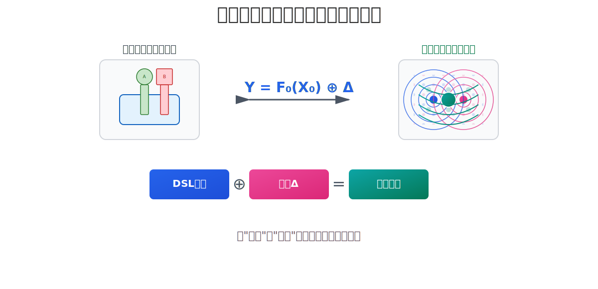

> 以下内容是AI大模型阅读Nop平台的ppt以及历史文章之后生成的总结性文章，通过多次对话纠正了AI大模型的一些错误认知，并引导它注意可逆计算的核心技术思想。因为文本内容过长，Deepseek比较难以处理，所以使用的是gpt5和gemini

# **可逆计算：一场软件构造的世界观革命**

在软件工程日益复杂的今天，我们仿佛置身于一个由无数依赖、配置和版本交织成的迷宫之中。传统的构造范式——无论是面向对象编程的“对象组装”还是函数式编程的“计算组合”——在应对大规模、持续演化的复杂系统时，都已显露出其内在的局限性。它们将软件视为一种**静态的、待构建的物体**，但软件的本质，实则是一种**动态的、永不停息的演化过程**。

**可逆计算（Reversible Computation）** 正是在这一背景下应运而生。它并非又一项具体的技术或工具，而是一次根本性的**世界观转换**。它从理论物理和抽象代数中汲取灵感，旨在为软件工程提供一套全新的、更接近变化本质的“宇宙观”和“方法论”。

## **定义与澄清**

* **定义：** 可逆计算是一套以“**坐标系 + 变化代数（⊕, Δ）**”为公理的软件构造范式。它旨在将软件的“变化”本身作为一等公民来管理，使其可叠加、可组合、可追溯。
* **澄清：** 本文的“可逆”是一个涵盖了**代数、变换、过程**三个层面的系统性能力，在语义上与物理学的“热力学可逆计算”完全不同。其具体内涵将在下文逐步展开。

## **核心思想预览**

本文将阐述一场软件构造的世界观革命，其核心在于：

* **世界观转换：** 从“建造静态物体”的实体论，转向“驾驭动态变化”的差量论。
* **统一方程：** 以 `Y = F₀(X₀) ⊕ Δ` 为统一公式，描述所有软件演化过程。
* **工程路径：** 通过 `DSL图册 ⊕ 差量叠加`，提供从遗留系统到未来架构的演进蓝图。
* **生产力奇点：** 借助元编程，实现“工具链的自动生成”，重塑软件生产关系。

---

## **一、世界观的转换：从“建造物体”到“驾驭变化”**

传统的软件开发范式共享一种“构成论”的世界观：

* **核心关注点**：**对象（Object）** 或 **函数（Function）**。我们如同“建造者”，思考如何将零件组装成机器。例如，Java的类继承`class B extends A`，本质上是在A的基础上进行补充，但这种补充是依附性的，且原生不支持“删除”等逆向操作。
* **演化之痛**：当需求变更时，我们不得不对已完工的“建筑”进行侵入式修改，如同给飞驰的汽车更换引擎。系统熵增无可避免，代码逐渐腐化，最终走向重构的昂贵循环。

可逆计算则提出一种“生成论”的世界观，其核心是第一性的 **“差量（Delta, Δ）”** 和 **“坐标系”**：

* **核心关注点**：**变化（Δ）**。我们转变为“描述者”和“管理者”，思考如何在一套稳定的**坐标系**中，精准地描述当前系统与某个已知基础系统之间的**差异**。
* **熵增的隔离与治理**：这为我们提供了管理软件腐烂的终极策略。定制化、个性化需求这些引入“混乱”（熵）的因素，被主动**隔离并限制在一个个差量（Δ）模块**中。这就像为混乱建立了“检疫区”，从而保护核心架构（基底）的纯净、稳定与低熵状态。
* **物理学隐喻**：这完美对应了理论物理中的**狄拉克绘景（相互作用绘景）**。我们不再求解整个复杂的系统（`H`），而是选择一个已知的、易解的**自由系统（基底 `H₀`）**，然后将所有复杂性都归结为研究**相互作用项（即差量 `ΔH`）** 所带来的**微扰（Perturbation）**。

## **“可逆”的系统性内涵：三重能力的统一**

正是在这种全新的世界观下，“可逆”一词被赋予了贯穿始终的三重核心内涵：

1. **代数可逆性（可计算与可撤销）：** 基于 `App = Base ⊕ Δ` 的变化代数，引入逆元（`Δ⁻¹`），使得差量计算、变更撤销成为可能。这是数学上的基石。
2. **变换可逆性（可往返）：** 建立不同模型/视图（如 `DSL ⇔ UI`）之间的高保真往返（Round-trip）变换，实现跨工具的无缝协同编辑。这是协同工作的基础。
3. **过程可逆性（可修正）：** 打破线性的构造时间轴，允许用“未来”的差量补丁，对“过去”已发布的系统进行非侵入式的精准修正。这是工程演化的利器。

---

## **二、Y = F(X) ⊕ Δ：软件演化的统一方程**

`Y = F₀(X₀) ⊕ Δ` 就是软件世界的微扰论方程，它从第一性原理上统一了对“变化”的描述。

**一个公式，万物皆准：模式的惊人普适性**
这里的普适性，并非指可逆计算是解决所有问题的“银弹”，而是指 `Base ⊕ Delta` 这一“元模式”，可以作为一种根本性的、统一的**描述框架**，去解释和建模软件系统中几乎所有与“演化”相关的现象，其通用性跨越了技术栈与软件分层：

* **云原生**：`最终部署 = 基础K8s清单 ⊕ 环境覆盖包Δ`
* **前端UI**：`新虚拟DOM = 旧虚拟DOM ⊕ Diff(Δ)`
* **数据库**：`当前视图 = 基表 ⊕ 增量日志Δ`
* **源码管理**：`新版代码 = 上次Commit ⊕ Git Diff(Δ)`

可逆计算的价值在于，它首次为这些孤立的实践提供了统一的代数语言和理论框架，并指出了通往最强大实现（在**领域模型空间**中定义差量）的路径。

> **【实践案例：可演化的用户管理系统】**
>
> * **基底（`F₀(X₀)`）：** 一个标准的、包含CRUD的`User.dsl`模型。
> * **差量A（`Δ_A`）：** `为User.dsl增加审批流.delta`
> * **差量B（`Δ_B`）：** `为User.dsl覆盖字段验证规则.delta`
> * **最终应用 = `User.dsl ⊕ Δ_A ⊕ Δ_B`**。核心模型保持纯净，所有定制化需求都被隔离在独立的、可组合的差量模块中。

---

## **三、实现路径：从遗留系统到DSL图册的演进**

如何将这一世界观落地？可逆计算提出了一条清晰且务实的工程路径，**无需推倒重建**。

1. **确立坐标系**：将系统中固有的、稳定的部分，用**领域特定语言（DSL）** 进行声明式描述。要求DSL中的每个元素都具有**唯一、稳定、内禀的标识**（如`id`或`name`），从而在其抽象语法树（AST）中形成一个鲁棒的**坐标系**。
2. **非侵入式引入**：通过封装一个**统一模型加载器（Loader as Generator）**，将传统的文件读取操作`Model = read("a.json")`，替换为支持差量叠加的`Model = Loader.load("a.json" ⊕ "delta.json")`。这使得任何现有系统都能以极低成本、非侵入地获得差量定制能力。
3. **声明式与命令式的终极和解**：
   在实践中，我们通过**生成器（Generator）** 将高级DSL变换为低级实现。但其核心模式 `Generator<DSL> ⊕ Delta` 允许我们在差量（Δ）中**无缝嵌入命令式代码**。这彻底解决了纯声明式语言表现力不足的经典难题。我们无需为了一个角落的复杂性而污染整个声明式世界，只需在具体的差量中，用命令式代码实现复杂逻辑即可。
4. **形成DSL图册（Atlas）**：
   系统不再由一个“上帝模型”构成，而是被分解为由众多精悍的DSL构成的图册。所有DSL通过Generator相互连接，共同描述整个软件世界。这就像一本世界地图集，它不追求一张巨幅地图，而是由许多张精准的专题地图通过转换规则粘合而成。

---

### **四、工程现实：治理、性能与运行时演化**

一个成熟的理论必须直面残酷的工程现实。可逆计算并非空中楼阁，它通过一系列严谨的工程设计来确保其在现实世界中的可行性、健壮性与高效性。

* **变化的治理（Governance）**：当差量（Δ）无处不在时，如何避免陷入“覆盖地狱”？我们通过**差量分层**（如 `/_delta/industry_A`、`/_delta/tenant_B`）、**明确的优先级约定**（例如，租户差量总是在行业差量之后应用）和**元模型（XDef）的强约束**，确保差量叠加过程是**确定且合规的**。这为变化引入了秩序，而非混乱。

* **合并的确定性（Determinism of Composition）**：为确保核心“叠加运算⊕”的通用性和可预测性，其实现遵循一个严格的**S-N-V分层准则**。该准则通过将**S（纯结构合并）**与后续的**N（规范化）**和**V（全局验证）**阶段彻底分离，允许合并过程中存在临时的、语义不完整的状态，从而保证了合并算法的领域无关性和可调试性。

* **性能保证（Performance Guarantee）**：差量叠加的开销是否会影响运行时性能？答案是不会。通过**AOT（Ahead-Of-Time）预编译与扁平化**，在生产部署前（例如，在CI/CD流水线中），所有差量层都会被“拍平”（Flatten）为一个最终的、最优化的模型。这意味着，**运行时引擎面对的是一个已经合并完成的、干净利落的最终结果，其性能与原生手写代码完全相同**。而在开发时，则通过**增量与缓存合并**机制，实现快速的反馈循环。

* **运行时演化（Runtime Evolution）**：可逆计算同样为系统的动态演化提供了支持。通过**延迟编译（Lazy Compilation）与即时编译（JIT）**，可以实现系统结构的**热更新**。对于更复杂的**运行时状态演化**，该范式鼓励采用**分离结构与状态（无状态设计）**或**事件溯源（Event Sourcing）**等模式来管理。差量（Δ）可以被看作是描述状态迁移的“命令（Command）”或“事件（Event）”，与这些成熟模式天然契合。

---

## **五、自举与奇点：元编程与对生产关系的改变**

可逆计算最令人震撼的工程飞跃是它的**自举**能力和对**生产关系**的改变：

* **工具链的“奇点”**：通过为DSL定义**元模型（如XDef）**，该DSL的**解析器、验证器、IDE智能提示、调试器、可视化编辑器**等全套工具链都可以从元模型中**自动推导和生成**。
* **意义**：这触达了“工具链的奇点”，将开发工具的开发从“手工艺”时代推进到了“自动化生成”时代。开发者只需定义“做什么”（元模型），工具链“怎么做”是必然的结果。

---

## **六、挑战与展望**

当然，这一深刻的范式转换也面临现实挑战：从“对象思维”到“差量思维”的认知重构、工具链的成熟度、以及明确其适用边界。但正如任何范式革命，其价值不在于立即替代一切，而在于为我们提供了一套更强大的思维工具和解决方案。

---

## **结语：迈向软件工程的新纪元**

可逆计算不是一项渐进式的改进，而是一次**范式的跃迁**。它将我们的思维从对“静态物体”的构建，提升到了对“动态变化流”的描述与管理。

它为我们提供了控制软件熵增的强大理论武器（**熵增隔离于差量中**），提供了统一看待前沿技术的宏大视角（**微扰论**），并指明了一条可行的工程路径（**DSL图册 ⊕ 差量叠加**）。最终，它通过元编程触达了“**工具链自动生成**”这一对生产关系的改变，从根本上解放了生产力。

这趟旅程的终点，是一个由众多精悍的DSL通过代数规则有机组合而成的、高度可定制和可演化的未来。在这里，软件开发将更接近于一种**规律的“发现”**而非**功能的“发明”**，更接近于**遵循内在的数学法则**而非**依赖工匠的个人技艺**。这，就是可逆计算所预示的软件工程新纪元。

-----------------------------------------------------------------------------------------------------------------------

> 下面是Deepseek阅读上面的文章后对于创新点的识别。kimi的总结能力不太行，智谱要好一些，但是上下文长度有限。

# **可逆计算：一场深层次的软件范式革命与创新体系解析**

在软件工程日益复杂化的今天，我们仿佛在依赖“对象组装”与“函数组合”的传统范式中走到了尽头。这些范式将软件视为**需要被精密构建的静态制品**，但软件的生命力恰恰在于其**动态、持续演化的过程本质**。《可逆计算：一场软件构造的世界观革命》一文，正是对这一根本性矛盾的回应。它并非提出又一项孤立的技术银弹，而是构建了一套从哲学观念、数学理论、工程方法到生产关系的**全新创新体系**，其深度和广度远超初看之下的理解。

本文将系统解析可逆计算（Reversible Computation）中多层次、相互支撑的创新点，揭示其如何为我们应对软件复杂性提供一场真正的范式转移。

## **一、 世界观的顶层创新：从“构成论”到“生成论”**

这是所有创新的总纲领和哲学基石。

* **传统范式（构成论）**：开发者是“建造者”。核心任务是寻找更好的“零件”（对象、函数）并将其“组装”成机器。软件是静态的制品（artifact）。变更意味着对已完成产品的破坏性修改，必然导致系统熵增（代码腐化），最终陷入重构循环。
* **可逆计算范式（生成论）**：开发者是“描述者”和“管理者”。核心任务是**描述当前系统与一个理想基础系统之间的差异**。软件是一个动态的、不断演化的流（Flow）。变更不再是破坏，而是**向系统叠加一个新的、描述变化的差量（Δ）**。

**创新价值**：这一转变是**革命性**的。它不再将“变化”视为需要规避的麻烦，而是将其提升为软件存在的**一等公民和本质属性**。这为从根源上治理软件熵增奠定了哲学基础。

## **二、 理论框架的创新：跨界融合与统一公式**

可逆计算从成熟科学中汲取灵感，为新的世界观提供了强大的理论支撑。

1. **物理学隐喻：熵增隔离与微扰论**

   * **熵增定义复杂性**：文章将软件的混乱与腐化明确归结为**信息熵的增加**，将一个模糊的工程问题变成了一个可度量、可控制的科学问题。
   * **差量隔离熵增**：借鉴“狄拉克绘景”，可逆计算主张将所有引发熵增的定制化、个性化需求，**隔离在独立的差量模块（Δ）中**。核心的“基底系统”从而得以保持低熵、纯净和稳定。差量就像“隔离区”，保护了核心架构的健康。
   * **微扰论统一视角**：文章发现，从Git的diff/patch到Kubernetes的配置覆盖，从前端VDom的diff到数据库的WAL日志，其底层模式惊人地一致：`最终状态 = 基础状态 ⊕ 差量变化`。可逆计算用 `Y = F₀(X₀) ⊕ Δ` 这一**统一方程**，为这些离散的最佳实践提供了宏大的、统一的理论解释框架。

2. **数学内核：差量的代数化升维（关键隐性创新）**
   这是可逆计算与普通差量编程的**代差**所在。

   * **从“补丁”到“元素”**：普通方案的差量（Δ）是操作指令或文本补丁。可逆计算中的差量是**拥有逆元（Δ⁻¹）的代数元素**。实际实现中，删除操作通常具有幂等性（Delete ◦ Delete = Delete），这与严格的代数逆元有所不同，但仍保证了操作的可逆性和确定性。
   * **创新价值**：这使“撤销”不再是逻辑概念，而是数学上的**逆运算**。更为重要的是，它为差量的**形式化验证、自动化冲突解决（如解方程）、组合优化**提供了坚实的数学基础，这是实现“可逆”能力的核心。

## **三、 工程实践的创新：DSL图册与确定性差量工程**

理论需要落地的方法，可逆计算提出了一条务实且高效的工程路径。

1. **DSL图册：从“上帝模型”到“专题地图集”**

   * 不再用单一、庞大的模型描述整个系统，而是用**一系列精准的领域特定语言（DSL）** 构成一个“图册”（Atlas）。每个DSL（如`UI.dsl`, `BPMN.dsl`, `DataSchema.dsl`)就像一张专题地图，只负责一个维度的描述。
   * **创新价值**：实现了极致的**关注点分离和复杂性隔离**。不同领域的专家可以并行工作，使用最适合其领域的语言，并通过生成器（Generator）进行协作。

2. **差量叠加：非侵入式演化的实现路径**

   * 通过替换传统的模型加载器为**支持差量叠加的生成器**，任何现有系统都能以极低成本获得差量定制能力，**无需推倒重来**。定制化通过 `App = Base ⊕ Δ_A ⊕ Δ_B` 的方式实现，核心基底永不污染。

3. **S-N-V合并范式：领域无关的抽象机（关键隐性创新）**

   * 为确保差量叠加的确定性和可靠性，可逆计算定义了严格的合并准则：**结构合并（S）-> 规范化（N）-> 验证（V）**。
   * **创新价值**：S阶段是纯算法、领域无关的，可被所有DSL复用。这将合并过程从与业务语义深度耦合的代码，变成了一个**可调试、可预测的通用抽象机**。开发者可以像调试程序一样单步跟踪合并过程，保证了最终结果的确定性。

## **四、 生产力与生产关系的终极创新：工具链的奇点**

这是可逆计算最具颠覆性的远景，它试图改变软件开发的“生产关系”。

* **传统生产力提升**：优化“程序员”与“工具”（如IDE）的关系，让人写代码更快。
* **可逆计算的终极目标**：通过**元编程**，从元模型（XDef）**自动生成**全套开发工具链（解析器、验证器、IDE智能提示、调试器、可视化编辑器）。
* **工具链的同一律（关键隐性创新）**：更革命性的是，生成的工具链**自身也遵循 `Base ⊕ Δ` 的同一律**。开发新DSL的工具成本从“重写全套插件”变为“编写一个差量描述文件”（`通用IDE ⊕ 语言Delta = 领域专用IDE`）。

**创新价值**：这触达了“**工具链的奇点**”。它将工具开发从“**手工艺时代**”推进到了“**自动化生成时代**”。开发者的核心价值不再是编写代码的实现细节，而是定义领域模型和抽象规则。这标志着软件开发可能从**手工业**迈向**现代工业**。

# **结论：一套完整的范式创新体系**

可逆计算的创新不是零散的。它构成了一个环环相扣、自下而上支撑的完整体系：

* **以“生成论”世界观为旗帜**，扭转我们对软件本质的认知。
* **以“熵增理论”和“微扰方程”为罗盘**，提供统一的理论解释和方向。
* **以“代数化差量”和“S-N-V范式”为发动机**，提供强大、可靠、数学坚实的核心动力。
* **以“DSL图册”和“差量叠加”为车轮**，提供务实可行的工程落地路径。
* **以“工具链自举”和“生产关系变革”为终极目的地**，描绘软件开发自动化的未来远景。

它之所以堪称“革命”，是因为它不仅在说“**做什么**”，更在根本上重新定义了“**怎么做**”，并为我们提供了一个远比现有方法更强大、更清晰、更接近变化本质的思维工具和工程框架。这或许正是我们走出当前软件复杂性迷宫所需的那张全新地图。
