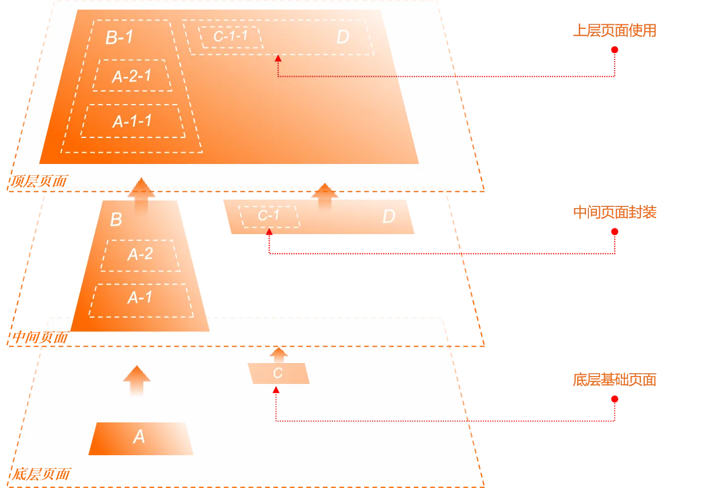

# 为什么说XLang是一门创新的程序语言？

> 我们的物理世界是一个四维时空，量子场论和相对论是它底层的构造规则。超弦理论试图突破底层结构空间的限制，在11维时空中建立统一的构造规则。

## 一. 为什么需要设计XLang语言


XLang语言是Nop平台底层的关键性支撑技术，在形式上它包含了XDef、Xpl、XScript等多个子语言。因为XLang与其他单一语法形式的程序语言有着较大的差异，所以很多人第一次接触时可能会有疑惑，它到底算不算是一种程序语言？它是不是只是在多种现有语言的基础上增加了一些零散的扩展？

这里我想提出一个对程序语言的本质的理解：**一门程序语言定义了一种程序结构空间，程序语言是程序结构空间的构造规则**。也就是说，一门程序语言所能够创造的所有结构以及这些结构之间的所有可行演化路径构成了一个特定的程序结构空间，所有可行的计算都在这个结构空间中发生。

基于以上理解，**XLang语言之所以是一门创新的程序语言，是因为它创造了一个新的程序结构空间，在这个结构空间中可以很方便的实现可逆计算理论所提出的`Y = F(X) + Delta`的计算范式**。虽然XLang可以认为是包含XDef, XPL, XScript等多个子语言，但是它们作为一个整体才是实现可逆计算的关键所在。**XLang是世界上第一个在语言中明确定义领域结构坐标并内置通用的差量计算规则的程序语言**。

**目前大部分人对于软件结构构造的基本理解都是基于还原论的，总是不断向下分解，寻找原子化的成分，然后使用原子进行组装**。原本虚拟化的组件概念在潜意识中实际上是被看作是真实存在的离散个体，类似于物质世界中的粒子，通过嵌套组合来构造世界。但是物理世界中存在着另一种构造方式，那就是波。波是连续存在的模式，通过干涉叠加来构造世界。**XLang语言的特异性就在于它通过差量运算支持连续的叠加构造**。

### 1.1 从结构的观点看程序语言

通用的高级程序语言从FORTRAN开始，经历了几十年的长期发展，目前已经发展到某种瓶颈。新语言所带来的本质上新颖的特性越来越少，各个高级语言都发展到了所谓的多范式编程阶段，它们的语法特性逐渐开始融合、趋同，比如大部分语言现在都同时支持面向对象式的结构声明，支持函数式的Lambda表达式，支持元编程所需要的自定义注解，支持异步编程所需的Async相关语法和支持库等。

一个有趣的问题是，是否还存在着通用的可抽象的语法特性，它们具有足够的技术价值以至于需要一个新的程序语言来承载？XLang的创新是指出目前主流的的程序语言虽然表面上语法形式差异很大，但是在语法层面之下的基本结构层面是非常相似的，在基本结构层面的创新仍然大有可为。

**程序的结构空间本质上是由数据+函数构成，将相关的数据和函数组织在一起就构成自定义的类型**，在一般的程序语言中就对应于类（Class）或者接口（Interface）。从结构的层面看，类结构不过是一个Map，可以通过名称来获取到属性或者方法。

```javascript
type MyClass = {
  name: string,
  myMethod: (arg1:string) => number
}

或者

interface MyClass{
  name: string,
  myMethod: (arg1:string) => number
}
```

当我们想利用一个已有的自定义类型来得到一个新的类型的时候，可以使用继承或者Traits机制。

```javascript
type MySubClass = MyClass & {
  subName: string
}

或者

interface MySubClass extends MyClass {
   subName: string
}
```

在概念层面上大概相当于如下构造方式：

```javascript
Map = Map extends Map
```

类继承在结构层面上相当于是将两个Map按照名称叠加覆盖在一起，上一层中的元素会覆盖下一层的元素。

传统的面向对象语言中可以利用继承机制来复用基类。比如说，构造MapX和MapY的时候复用基类Map1，也就是可以复用继承树的下层。

```javascript
MapX = Map2 extends Map1
MapY = Map3 extends Map1
```

将继承表达为上述结构构造公式之后，很多问题会变得非常自然直观。比如说，我们能不能交换Map1和Map2的相对位置？也就是说，在构造MapX和MapY的时候，我们仍然是复用Map1，但是并不作为基类，而是选择不同的基类，但是用同样的Map1去覆盖。

```javascript
MapX = Map1 extends Map2
MapY = Map1 extends Map3
```

有趣的是，很多面向对象程序语言并不支持上述操作，**面向对象并不直接支持复用继承树的上层！**

更进一步的思考会发现传统的面向对象在结构层面难以回答的问题还有很多，比如说继承链条中如果存在多个同样的对象会导致什么问题？

```javascript
MapX = Map1 extends Map2 extends Map1
```

`C++`中多重继承存在概念层面的严重困难，本质原因就是从不同的继承路径复用了同样的Map1之后产生的结构融合障碍。

现代程序语言是通过Traits机制解决了这些问题。比如在Scala语言中，

```scala
trait Map1 {
  val name: String = "Map1" // 同名属性
  def method1(): Unit = {
    println(s"Method 1 from $name")
  }
}

trait Map2 {
  val name: String = "Map2" // 同名属性
  def method2(): Unit = {
    println(s"Method 2 from $name")
  }
}

class MapX extends Map1 with Map2 {
}

class MapY extends Map1 with Map3 {
}
```

> Scala语言中多个Trait可以定义同名的属性，编译器会自动合并这些属性定义，最终在运行时只会存在一个变量，但是在Java或者C++中，不同类中定义的多个同名属性并不会自动合并为一个。

传统的面向对象程序语言中 `A extends B`表示派生类A可以比基类B多，但是具体多了什么并没有一个明确的技术形式把它隔离出来，我们也就无法直接复用这个多出来的部分（Delta差量）。Traits则是直接把这个差量明确的表达出来了。
Traits机制相比于继承概念来说，它构成一个更加完善的差量语义。**`type MapX = Map1 with Map2 with Map1`是合法的Scala类型定义！**

对于多重继承所造成的问题，Scala的解决方案是引入所谓的线性化规则，按照一定的顺序将继承链条中的所有类和Trait排成一个线性序列，然后约定上层的元素覆盖下层的元素。

```
MapX -> Map2 -> Map1
```

### 1.2 泛型作为Generator

泛型(Generic Type)在Java语言中仅仅是用于类型检查，编译器并没有根据泛型参数来执行什么特殊动作。但是在`C++`语言中，情况则大为不同。`C++`的泛型编程是通过模板（Templates）实现的，编译器会根据模板参数的不同将同一个模板类实例化为针对特定类型的不同代码。

在 1994 年的 C++ 标准委员会会议 上，Erwin Unruh 进行了一次技惊四座的演示。他编写了一段模板元程序，能够在编译期计算一个数是否是质数，如果是质数，编译器会在错误信息中输出这个质数。这段代码被称为 “Unruh 质数计算”，成为了 C++ 模板元编程的经典示例。
Unruh 的演示证明了 C++ 模板在编译期是图灵完备的，这意味着理论上可以在编译期执行任何计算。这一发现开启了 产生式编程（Generative Programming） 的新时代，即利用编译期的计算能力生成代码或优化程序。
C++ 的模板元编程（Template Metaprogramming）成为了实现产生式编程的重要工具。通过模板，开发者可以在编译期完成复杂的计算、类型推导和代码生成，从而在运行时获得更高的性能和灵活性。

参见[C++ Compile-Time Programming](https://accu.org/journals/overload/32/183/wu/)

```c++
template <int p, int i> struct is_prime {
  enum {
    prim = (p==2) ||
           (p%i) && is_prime<(i>2?p:0),
                             i-1> :: prim };
};

template<>
struct is_prime<0,0> { enum {prim=1}; };

template<>
struct is_prime<0,1> { enum {prim=1}; };

template <int i> struct D { D(void*); };

template <int i> struct Prime_print {
  Prime_print<i-1> a;
  enum { prim = is_prime<i, i-1>::prim };
  void f() { D<i> d = prim ? 1 : 0; a.f();}
};

template<> struct Prime_print<1> {
  enum {prim=0};
  void f() { D<1> d = prim ? 1 : 0; };
};

int main() {
  Prime_print<18> a;
  a.f();
}
```

输出

```
unruh.cpp:20:19: error: no viable conversion from ‘int’ to ‘D<17>’
…
unruh.cpp:20:19: error: no viable conversion from ‘int’ to ‘D<13>’
…
unruh.cpp:20:19: error: no viable conversion from ‘int’ to ‘D<11>’
…
unruh.cpp:20:19: error: no viable conversion from ‘int’ to ‘D<7>’
…
unruh.cpp:20:19: error: no viable conversion from ‘int’ to ‘D<5>’
…
unruh.cpp:20:19: error: no viable conversion from ‘int’ to ‘D<3>’
…
unruh.cpp:20:19: error: no viable conversion from ‘int’ to ‘D<2>’
```

如果从结构层面去理解模板元编程，则它可以被理解为如下构造公式

```
Map = Generator<Map> = Map<Map>
```

> A<X,Y> 可以被理解为 `A<B>, struct B{ using T1=X; using T2=Y;}`
> 注意，这里的Map指的是编译器在编译期所看到的结构。每一个成员变量，无论它是属性、方法、还是类型声明，在编译器看来，都是Map中的一个条目。
> 即使编译器将参数列表作为List来管理，它也可以看作是一个用下标来作为Key的Map。而且有趣的是，如果是用数组来做管理，则一般无法引入类似继承这种更高级的合成机制。在概念层面上我们一般会选择按名称合并，而不会选择按下标合并。

作为生成器的模板类在结构层面（编译器所看到的结构）也可以被看作是一个Map。再结合上一节中差量化Traits概念的内容，面向对象程序语言的最强形态在结构层面可以表达为

```
Map = Map extends Map<Map>
```

### 1.3 从Map结构到Tree结构

在编译器看来，所谓的类、模板类、模板参数都可以被看作是Map，而且实际情况也一般是按照Map结构来管理的。至于孤立的函数定义和变量定义，实际上也会属于某种Map，比如模块对象可以看作是一个Map，它包含一组模块内定义的变量、函数和类型等。即使不从属于任何模块，那些独立的函数也会属于某个隐式存在的全局命名空间。

> Lisp语言的内在结构是List，本质上是利用下标来管理元素（原始的Lisp甚至没有下标，只有car、cdr这种逐个遍历的处理机制），但是现在流行的Lisp变种早就引入了类似Map的Associated List结构，使用名称来定位子元素，而不是按照下标去定位。在概念层面上（不考虑冯诺依曼机器按照下标取值的性能优势），List可以看作是用下标来做key的一种特殊的Map。
>
> Lisp的核心创造S表达式可以看作是一种通用的Tree结构，而Lisp也提供了宏等操作这些Tree结构的内置机制，但是Lisp并没有建立Tree的差量的概念。XLang可以看作是对S表达式这一通用处理机制的进一步深化发展。

现有主流程序语言提供的各种语法可以看作是在以Map为基础的结构空间中不断构造新的Map的各种规则。XLang语言的创新点在于它选择将Map结构扩展为Tree结构，在Tree结构的基础上重新思考软件结构的构造问题。也就是将软件结构的构造公式推广为：

```
Tree = Tree x-extends Tree<Tree>
```

> Map扩展为Tree，则Map结构之间的extends运算也需要被扩展为Tree结构上的x-extends运算。

显然Map是Tree的一个特例，Tree结构的每一个节点都可以看作是一个Map， `Tree = Map + Nested`，因此上面的公式确实可以被看作是对`Map extends Map<Map>`构造模式的一种推广。
但是从另外一个角度去考虑，Tree结构可以通过嵌套组合多个Map构造出来，Map是一种更基本的、更细粒度的结构，那么有必要强调Tree结构吗？所有Tree结构上的运算最终不都能分解为每一级的Map结构上的运算吗？

XLang对这个问题的回答是：在更复杂的Tree结构上建立的软件结构空间（以及这个结构空间中的构造规律）并不能简单的划归到以Map为基础的软件结构空间。也就是说，这里出现了`整体 > 部分之和`的情况，**Tree的构造规律所具有的整体性分解到Map结构的构造规律之后会丢失一些关键性信息**。

要真正的理解XLang语言的创新之处，必须要了解XLang语言设计背后的下一代软件构造理论：可逆计算理论。可逆计算明确提出逆元和差量的概念，指出全量是差量的一个特例(A=0+A)，我们需要在（包含逆元的）差量概念的基础上重建所有对软件世界的理解。可逆计算提出了一个通用的图灵完备的软件构造公式：

```
 App = Delta x-extends Generator<DSL>
```

XLang语言是在程序语言级别实现这一技术战略的具体实现方案。

关于可逆计算理论的介绍，可以参见我的公众号文章：

1. [可逆计算：下一代软件构造理论](https://mp.weixin.qq.com/s/CwCQgYqQZxYmlZcfXEWlgA)
2. [写给程序员的可逆计算理论辨析](https://mp.weixin.qq.com/s/aT99VX6ecmZXdemBPnBcoQ)
3. [写给程序员的可逆计算理论辨析补遗](https://mp.weixin.qq.com/s/zGfo7pvKjOCa11PYLJHzzA)
4. [写给程序员的差量概念辨析,以Git和Docker为例](https://mp.weixin.qq.com/s/D5bDNkMJ9gYrFb0uDj2EzQ)

根据可逆计算理论，Tree结构的特殊性在于它对应于一个全局坐标系统：树结构上的每个节点和属性都对应于一个唯一的xpath。

```
/tasks/task[name='test']/@name
```

上述的xpath表示tasks节点下的名称为test的子节点的name属性。

首先我们来明确一下坐标系统的作用: **每一个业务上关心的值在坐标系统中都具有唯一的坐标**，可以通过这个坐标来实现值的读取和修改。

```
value = get(path);
set(path,value);
```

Map结构的问题在于它只提供两级坐标：第一级定位到Map，第二级在Map内定位到属性或者方法。但是这种简单的坐标系统无法实现业务层面上精确的区分。比如说

```java
class Dialog{
    String title;
    List<Button> actions;
    List<Component> body;
}
```

Dialog对象具有一组操作按钮，如果我们想定位到其中的【提交】按钮，把它的label属性修改为【确定】，在现有的程序语言中是没有一种简便直观的定位手段的。如果我们只想定制在某个场景下使用的Dialog（比如为它增加一个属性），使用一般程序语言配套的AOP(Aspect Oriented Programming)机制也无法实现：因为**AOP的定位系统是基于类型的**。而在XLang语言中，可以直接使用如下描述

```xml
<dialog>
   <actions>
      <button name="submit" label="确定" />
   </actionss>
</dialog>
```

目前程序语言的研究一般集中在类型系统，但是研究类型的原因在于不同的对象可以具有相同的类型，从而研究类型比研究原本的对象结构要简单而且不会涉及到对象的生命周期问题。**这导致类型系统并不是一个合格的坐标系：类型相同的对象在类型系统坐标系中无法被区分开来，因而也就无法继续建立精细的差量构造**。

有些人可能对于Tree结构存在疑惑，为什么不是图结构呢？在图结构上，如果我们选定了一个主要的观察方向，同时选择某个固定的节点作为根节点，那么我们就可以很自然的将一个图结构转换为树结构。比如Linux操作系统中，一切都是文件，很多逻辑关系都被纳入到文件树的表达结构中，但借助于文件系统中的文件链接机制，本质上可以表达图结构。**所谓的树仅仅是因为我们在图上选择了一个观察方向而产生的**。

Tree结构**实现了相对坐标与绝对坐标的统一**：从根节点开始到达任意节点只存在唯一的一条路径，它可以作为节点的绝对坐标，而另一方面，在某一个子树范围内，每一个节点都具有一个子树内的唯一路径，可以作为节点在子树内的相对坐标。根据节点的相对坐标和子树根节点的绝对坐标，我们可以很容易的计算得到节点的绝对坐标（直接拼接在一起就可以了）。

### 1.4 可扩展设计必然需要软件结构坐标系

在软件开发中，所谓的可扩展性指的是在不需要修改原始代码的情况下，通过添加额外的代码或差异信息，可以满足新的需求或实现新的功能。如果在完全抽象的数学层面去理解软件开发中的扩展机制，我们可以认为它对应于如下公式：

```
  Y = X + Delta
```

* X对应于我们已经编写完毕的基础代码，它不会随需求的变化而变化
* Delta对应于额外增加的配置信息或者差异化代码

在这个视角下，所谓的可扩展性方面的研究就等价于Delta差量的定义和运算关系方面的研究。

```
X = A + B + C
Y = (A + dA) + (B + dB) + (C + dC)  // 差量无处不在
   = (A + B + C) + (dA + dB + dC)  // 差量可以聚合在一起，独立于基础代码存放
   = X + Delta // 差量满足结合律，可以独立于Base实现合并运算
```

假设X由A、B、C等多个部分构成，需求变更导致的差异性修改是遍布系统各处的，**如果要求所有零碎的修改都可以独立于原系统源码来管理和存放**（差量的独立性），并且小的差量还可以复合为一个更大粒度的差量（差量的可复合性），那么必然需要一个坐标系统用于精确定位。具体来说，`dA`与`A`分离之后，存放到独立存在的Delta中，那么它必然保留了某种定位坐标，只有这样，当Delta与`X`结合的时候，才可以重新找到原始的结构`A`，然后与`A`相结合。

### 1.5 Delta与Patch和插件机制的区别

首先需要指出的是，类似于Git的Patch和分支管理不满足Delta的独立性和可复合性。Patch总是和特定的Base代码版本绑定在一起，在不知道Base的情况下无法将多个Patch合并为一个更大的Patch。详细分析参见文章[写给程序员的差量概念辨析,以Git和Docker为例](https://mp.weixin.qq.com/s/D5bDNkMJ9gYrFb0uDj2EzQ)。

第二个需要强调的地方是，差量与传统编程领域中的扩展点和插件机制有着本质性差异。

```
X = A + B + C
Y = A + B + D
  = X + (-C) + D
  = X + Delta
```

Delta差量不仅仅是向系统中增加内容。如果我们要实现粗粒度的系统级别的复用，所对应的差量必然包含减少的语义（比如，我们需要去除基础产品中定义的一个Bean）。实际上一个粗粒度的差量一定是加和减的混合。

另外需要注意的是，**插件机制只支持少量事先确定的扩展点**，我们并不可能在原始设计之外通过插件来定制原有系统的功能。但是Delta的概念则不同，只要存在一个全局的结构坐标系，这个坐标系中的任何一点上都可以引入Delta差量。k8s中引入的Kustomize机制就是利用Delta差量来实现全面定制，可以看作是可逆计算理论的一个具体应用，参见[从可逆计算看Kustomize](https://mp.weixin.qq.com/s/48LWMYjEoRr3dT_HSHP0jQ)

>  组件的黑箱模型类似于高中阶段牛顿力学的世界观，它是完全机械化的：刚体的运动完全由它的质心坐标和尺寸形状朝向等少数几个参数来描述，刚体的内部构造无法被观测也无关紧要，刚体之间通过直接接触发生相互作用， 刚体的形状必须精确匹配才能构成一个无缝的整体。即使是在古典力学中，稍微高级一点的观点也都会转换到拉格朗日表述或者哈密尔顿表述，它的精神实质是转向场论的世界观。 所谓的场（Field），其实就是建立一个无所不在的坐标系，然后在坐标系的每一点上都可以指定一个物理量。**场的自由度是无限的，但是通过坐标系它是可描述的、可定义的、可研究的**，在坐标系的每一点上我们都可以精确的度量局部的变化。在场的世界观中，我们面对的核心图像是对象总是浸泡在场（无所不在的坐标系）中，而不再是孤立对象之间的两两相互作用。

### 1.6 稳定的领域结构坐标系

主流的程序语言都是通用程序语言，并没有内置某个特定的业务领域中的领域知识。因此，这些语言中内置的结构坐标系只能是利用语言内置的类-方法这种两级结构，最多是引入注解机制，在两级结构基础上进行一定的面向领域的细化。对于方法级别以下的结构，目前一般缺乏合适的技术手段进行坐标定义。

业务需求变化的时候，一般情况下会影响到多处代码发生变化。本质上这是因为从问题空间到解空间的结构映射在一般性的业务环境中都是**非平凡的**，因此两种描述方式无法有效的对齐。套用人工智能领域的话语，我们可以说：**有用的特征都是分布式的（distributed）**。

> 在物理学中，同一个物理事实可以使用无数多种坐标系去建立描述，但是其中可能会存在一个特别的、针对这个特定问题定制的坐标系，在物理学中我们称之为内禀坐标系。在这个坐标系中建立的描述可以突出最核心的物理意义，简化相关的描述。比如说，在一个球面上发生的物理现象当然可以在通用的三维直角坐标系中进行描述，但是如果我们使用球面坐标系往往可以实现简化。

可逆计算理论指出可以针对特定的业务领域建立一个专用的DSL语言(Domain Specific Language)，利用这个DSL语言很自然的建立一个领域坐标系，然后再在这个领域坐标系所定义的差量结构空间中表达差量。因为这个领域坐标系是针对领域问题特制的，因此它往往可以实现差量表达的最小化。比如说，发生了一个业务层面的变化导致需要增加一个字段，如果采用通用语言去表达，则很多地方可能都需要做相应调整，前台、后台、数据库都要一起修改。而如果使用领域模型描述，这种变化可能就只体现为局部的一个字段级别变化，然后由底层引擎框架自动将领域描述翻译为实际执行的逻辑功能。

XLang语言的核心功能就在于如何快速定义多个DSL语言，然后以这些DSL语言作为领域结构坐标系，利用它们实现差量定义和差量结构生成和转换。

XLang与其他语言的本质区别在于，它是基于可逆计算理论、面向DSL开发的程序语言。一般语言都是直接面向应用开发的，我们直接使用这些语言来对业务建模，实现业务逻辑。但是使用XLang，我们会先建立一个或者多个DSL，然后再使用DSL来描述业务。**XLang使得开发一个DSL的成本非常低**，最基本的情况下只需要使用XDef语言定义XDef元模型文件，即可得到这个新的DSL的解析器、验证器、IDE插件、可视化编辑器等，自动实现语法提示、断点调试功能和可视化编辑等完善的编程工具支持。

> Jetbrains公司有一个产品MPS（Meta Programming System），它也是支持先开发DSL，然后再用DSL来描述业务。MPS底层是自己定义的一套底层语言机制。Nop平台是一个类似于MPS的低代码开发平台，它的底层就是XLang语言。只不过Nop平台的指导理论是可逆计算，与MPS的技术路线和指导思想有着本质差异。
> 但是技术发展目标是类似的。

## 二. XLang的具体语法设计

XLang语言是面向Tree结构的语言设计，它的语法组成可以和面向表结构的SQL语言做一个对比。

| SQL语言                       | XLang语言                                   |
| --------------------------- | ----------------------------------------- |
| DDL数据定义语言                   | XDef元模型定义语法                               |
| 无冗余的表格数据                    | 无信息冗余的树形信息结构：XNode                        |
| 在标准化数据结构基础上的即时计算：SQL Select | 在通用的XNode数据结构基础上的运行时和编译期计算：Xpl/XTransform |
| 表格数据的合并和差分：Union/Minus      | Tree结构上的Delta差量计算：x-extends/x-diff        |
| 通过函数定义和存储过程扩展SQL            | 通过Xpl标签库和XScript扩展XLang                   |

首先需要说明的是，XLang是面向Tree结构的一种程序语言，那么一种很自然的语法载体就是XML语法，所以一般XLang语言文件也是一个合法的XML文件。但是这并不是唯一的选择。传统的程序语言很强调语法形式，但是XLang基于可逆计算理论，它强调的是语法形式并不重要，**不同的语法形式不过是同一信息的不同展现形式，而信息等价的不同展现形式之间可以进行可逆转换**。XLang可以采用任何能够直接表达树状结构的语法来表达，比如JSON、YAML等。Lisp语言中的S表达式，增加一些扩展属性之后，也可以作为XLang的语法载体。

> Nop平台还实现了Tree结构和Excel数据文件的一种双向映射，可以在不需要编写Excel解析和生成代码的情况下，使用Excel来表达DSL模型对象，比如用`app.orm.xlsx` Excel文件来表达ORM DSL，它等价于`app.orm.xml`这种XML格式的DSL文件。

### 2.1 XDSL的基本语法结构

XLang语言本身是图灵完备的，但它的设计用途主要不是作为一种通用程序语言，而是作为一种快速开发新的DSL语言的元语言来使用。也就是说虽然可以将XLang作为一种胶水语言来使用，但更多的是用它来开发一种DSL语言嵌入在Java语言环境中使用。

所有基于XLang开发的DSL语言具有一些统一的语法结构，这些DSL统称为XDSL。

```xml
<state-machine x:schema="/nop/schema/state-machine.xdef"
     x:extends="base.state-machine.xml">
    <x:gen-extends>
       <app:GenStateMachineDelta1/>
       <app:GenStateMachineDelta2/>
    </x:gen-extends>

    <x:post-extends>
       <app:PostProcessGeneratedModel />
    </x:post-extends>

    <!-- x:override=remove表示在最终的合并结果中删除这个节点 -->
    <state id="commit" x:override="remove" />

    <on-exit>
       <c:if test="${abc}">
           <c:log info="${xyz}" />
        </c:if>
    </on-exit>
</state-machine>
```

参考上面的示例，所有的XDSL都支持如下语法：

1. `x:schema`引入XDef元模型，类似于JSON Schema，用于约束DSL的语法结构。

2. `x:extends`表示继承已有的DSL文件，将两个DSL模型按照Tree结构逐层合并在一起。

3. `x:override`在执行`x:extends`时用于指定如何合并两个对应节点，`x:override=remove`表示删除语义。

4. `x:gen-extends`使用Xpl模板语言动态生成多个Tree结构节点，然后依次按照Delta合并算法合并在一起。

5. `x:post-extends`同样是使用Xpl模板语言来动态生成多个Tree结构节点，只是它的执行时刻与`x:gen-extends`不同。

6. DSL中如果希望嵌入脚本代码，可以直接使用Xpl模板语言，比如`on-exit`回调函数。

```xml
<model x:extends="A,B">
   <x:gen-extends>
      <C/>
      <D/>
   </x:gen-extends>
   <x:post-extends>
      <E/>
      <F/>
   </x:post-extends>
</model>
```

完整的合并顺序为

```
F -> E -> Model -> D -> C -> B -> A
```

任意的XML或者JSON文件格式都可以引入上面的XLang差量运算语法。比如我们为AMIS(百度开源的一个JSON格式的前端界面定义语言)引入了如下分解方案：

```yaml
x:gen-extends: |
   <web:GenPage view="NopSysCheckerRecord.view.xml" page="main"
        xpl:lib="/nop/web/xlib/web.xlib" />

body:
   x:extends: add-form.page.yaml
   title: 覆盖add-form.page.yaml中定义已有的标题
```

AMIS的JSON格式本身并没有提供分解合并机制，导致一个完整应用的JSON文件很大，也很难进行人工维护。通过引入XLang的`x:gen-extends`语法，可以根据View模型自动基础页面结构，在页面内部还可以使用`x:extends`引入已有的文件。

XLang语言内置了可逆计算支持，也就是`App = Delta x-exends Generator<DSL>`这种计算模式。`x:gen-extends`和`x:post-extends`对应于Generator，是一种元编程机制，可以在编译期作为内置的代码生成器生成模型节点。`x:extends`语法用于合并两个模型节点。

进一步的介绍参见 [XDSL：通用的领域特定语言设计](https://zhuanlan.zhihu.com/p/612512300)

下一代低代码平台-Nop平台中已经定义了多种DSL，比如工作流模型Workflow, 规则模型Rule， 数据模型ORM，组件编配模型BeanDefinition， 批处理模型Batch，二进制消息模型Record等。一般并不需要专门针对自定义的DSL编写运行时引擎，可以通过XLang的元编程机制在编译期将自定义的DSL翻译为已有的DSL语言，或者将多个DSL无缝集成在一起，构成一个新的DSL。参见[为什么SpringBatch是一个糟糕的设计](https://mp.weixin.qq.com/s/1F2Mkz99ihiw3_juYXrTFw)这篇文章中介绍的DSL森林的解决方案。

### 2.2 XDef元模型定义语言

XML格式存在着一系列的国际化标准，比如XSD(XML Schema Definition)，XSLT(EXtensible Stylesheet Language)，但是这些标准的底层假定都是和DOM模型一样，它们都是应用于文本结构的处理，所有的属性都是字符串格式，这使得它们无法应用于通用的Tree结构处理。

XLang引入了XDef元模型定义语言来取代XSD。XDef比XSD要简单、直观得多，而且可以提供比XSD强大得多的结构约束。

```xml
<state-machine x:schema="/nop/schema/xdef.xdef">
   <state id="!var-name" displayName="string" xdef:unique-attr="id" />
   <on-exit xdef:value="xpl" />
</state-machine>
```

与XSD和JSON Schema不同，XDef采用的是一种同态设计，即元模型定义的结构和它所要约束的XML格式之间基本完全一致，将XML节点的属性值替换为对应的类型声明即可。比如

* `id="!var-name"`表示id属性的格式满足var-name格式要求，不能包含特殊字符，不能以数字为前缀，`!`表示属性值不能为空。

* `<on-exit xdef:value="xpl"/>` 表示on-exit节点的内容是Xpl模板语言格式。读取模型文件时会自动解析得到IEvalAction类型的可执行函数。

* `xdef:unqiue-attr="id"`表示当前节点可以出现多个，构成一个列表，列表中的元素通过id属性来作为唯一标识。、

值得注意的是XDef元模型定义语言由`xdef.xdef`来定义。也就是说`state-machine.xml`是一个DSL语言，它的语法结构由元模型`state-machine.xdef`来定义，而`state-machine.xdef`的根节点上标注`x:schema='/nop/schema/xdef.xdef'`，表示这个元模型文件由`xdef.xdef`来约束，最终`xdef.xdef`仍然由`xdef.xdef`来完成约束，从而完成闭环。

所有XDSL领域特定语言共享的XDSL语法由`xdsl.xdef`元模型来定义。IDEA插件会自动根据`xdsl.xdef`中的定义来自动识别`x:extends`、`x:gen-extends`等语法，实现语法提示 、文件跳转等功能。

### 2.3 Xpl模板语言

XLang需要引入一种模板语言用于编译期的代码生成，但是它没有使用常见的velocity、FreeMarker等模板语言，而是重新设计了一种新的Xpl模板语言。

Xpl模板语言是一种图灵完备的语言，它提供了`c:for`、`c:if`、`c:choose`、`c:break`、`c:continue`等语法节点。

```xml
<c:for var="num" items="${numbers}">
    <!-- 检查数字是否为7 -->
    <c:if test="${num == 7}">
        <p>遇到数字 7，停止遍历。</p>
        <c:break /> <!-- 中断循环 -->
    </c:if>

    <!-- 使用 c:choose 判断数字的奇偶性 -->
    <c:choose>
        <when test="${num % 2 == 0}">
            <p>${num} 是偶数。</p>
        </when>
        <otherwise>
            <p>${num} 是奇数。</p>
        </otherwise>
    </c:choose>
</c:for>
```

Xpl模板中通过\${expr}表示嵌入XScript表达式，除此之外，Xpl中还提供了一个专用的`c:script`节点来执行XScript语句。

```xml
<c:script>
  import my.MyDSLParser;
  let model = new MyDSLParser().parseFromNode(path);
</c:script>
```

XScript的语法类似于JavaScript，但是增加了一些扩展语法，比如import语句可以引入Java类。

#### XML和表达式语法的相互嵌入

XLang没有采用jsx语法实现类XML语法，而是沿用XML语法，扩展JavaScript中的Template表达式语法。

```javascript
let resut = xpl `<my:MyTag a='1' />`
const y = result + 3;
```

等价于

```xml
<my:MyTag a='1' xpl:return="result" />
<c:script>
  const y = result + 3;
</c:script>
```

XLang修改了JavaScript中的Template表达式语法的解析格式，将反引号字符之间的内容识别为一个在编译期待解析的字符串，而不是一个Expression列表。这使得XLang可以利用这个语法形式扩展支持更多的DSL格式，比如引入类似C#的LinQ语法

```javascript
const result = linq `select sum(amount) from myList where status > ${status}`
```

#### 多种输出模式

与一般的模板语言不同，Xpl模板语言特别针对编译期代码生成进行了优化设计。一般的模板语言总是直接输出文本内容，这样在用于代码生成的时候会丢失原始代码位置，为了克服这个问题，又需要引入SourceMap机制，要求代码生成器在生成过程中额外记录生成代码和原始代码之间的对应关系。Xpl模板语言的做法则不同，它引入了多种输出模式，用于编译期代码生成时使用`outputMode=node`模式，此时并不是直接输出文本内容，而是输出XNode节点。

```java
class XNode{
    SourceLocation loc;
    String tagName;
    Map<String, ValueWithLocation> attributes;
    List<XNode> children;
    ValueWithLocation content;

    XNode parent;
}

class ValueWithLocation{
    SourceLocation location;
    Object value;
}
```

XNode结构中记录了属性和节点的源码位置，同时将attribute和content的值类型修改为Object类型，从而克服了XML原始设计中只针对文本文档的缺陷，使得它可以更高效的表达复杂的业务对象结构。

### 2.4 可扩展语法

类似于Lisp语言，XLang中可以通过宏函数和标签函数等机制扩展XLang的语法。可以通过`<c:lib>`来引入新的语法节点，然后在该节点内部再通过宏函数等机制实现结构转换。

```xml
<c:lib from="/nop/core/xlib/biz.xlib" />
<biz:Validator fatalSeverity="100"
               obj="${entity}">

    <check id="checkTransferCode" errorCode="test.not-transfer-code"
           errorDescription="扫入的码不是流转码">
        <eq name="entity.flowMode" value="1"/>
    </check>
</biz:Validator>
```

`<biz:Validator>`引入一个验证用的DSL，Validator标签在编译的时候会利用宏函数机制解析节点内容，将它翻译为XLang的Expression来运行。

## 三. XLang应用实例：差量化的组件模型

所有涉及到差量概念的软件实践都可以遵循可逆计算理论的技术路线，很多情况下都可以直接使用XLang来实现差量合并和分解，从而完全避免在运行时引擎中引入差量概念，简化运行时的实现。这里介绍一个在前端低代码/无代码平台的组件模型中的应用实例。

目前前端无代码/低代码平台的功能本质上就是通过可视化界面实现组件的嵌套组合。但是**组件封装在实际应用中经常出现困难：封装的组件难以直接满足需求，但完全从零开始编写一个新的组件成本又太高**。UIOTOS这个无代码平台提出了一种页面继承的做法。



具体来说，在UIOTOS中可以引入已有的页面作为基础页面，然后在上层设置属性覆盖底层页面的属性。详细介绍参见[UIOTOS的文档](https://www.yuque.com/liuhuo-nc809/uiotos/fa6vnvggwl9ubpwg#rsHSa)

为了实现这一特性，UIOTOS做了大量特殊的设计，并且在运行时引擎中引入了大量与属性继承相关的代码。但是，如果基于XLang语言，可以把差量计算完全压缩到编译期来执行，运行时引擎只需要知道普通组件结构即可，不需要有任何差量分解、合并的知识。

```xml
<component x:schema="component.xdef">
  <import from="comp:MyComponent/1.0.0"/>

  <component name="MyComponent" x:extends="comp:MyComponent/1.0.0">
    <state>
      <a>1</a>
    </state>
    <props>
      <prop name="a" x:override="remove"/>
      <prop name="b"/>
    </props>

    <component name="SubComponent" x:extends="ss">
      <prop name="ss"/>
    </component>

    <template x:override="merge">
      这里可以只显示Delta修正的部分

      <form x:extends="a.form.xml">
        <actions>
          <action name="ss" x:id="ss"/>
        </actions>
      </form>
    </template>
  </component>

  <template>
    <MyComponent/>
    <MyComponentEx/>
  </template>
</component>
```

* Component的template段用于表达如何通过子组件组合实现。
* 使用子组件的时候可以通过import语法引入已有的组件，也可以通过component语法定义一个局部组件。
* 如果将Component模型作为XLang的XDSL来实现，则可以使用`x:extends`语法来基于已有的组件进行Delta定制。完全不需要UIOTOS那种特殊设计，直接使用`x:extends`语法就可以实现差量化组件定义。
* 局部组件内部还可以包含自己的局部组件，同样可以被定制。也就是说Delta定制可以修改整个组件树，而不是简单的某个组件类的属性或者方法。
* Delta合并要求每个节点都必须具有唯一坐标，如果DSL节点没有可利用的id或者name属性，可以使用XLang内置的`x:id`扩展属性，这些属性在Delta合并完成之后会被自动删除，因此不会影响到运行时DSL引擎的处理。
* `x:extends`在模型加载的时候被执行，送入运行时引擎时所有x名字空间的属性都已经被处理并自动删除了。因此运行时引擎完全不需要有任何`x:extends`相关的知识，这和UIOTOS的做法形成鲜明对比：Delta差量可以被一种通用引擎一劳永逸的实现，而不需要针对每个特定需求引入差量处理机制。
* 通过`comp:MyComponent/1.0.0`这种扩展格式的虚拟文件路径来引用组件，当通过虚拟文件系统加载的时候可以自动实现租户隔离和版本升级隔离。

完整的讲解可以参见B站视频 [与UIOTOS作者的交流以及支持Delta概念的前端低代码平台的设计](https://www.bilibili.com/video/BV1ask2YhEfp/)。

引入XLang之后，实现Delta组件基本不需要做任何工作，而且这种做法可以被推广到所有需要Delta编辑的DSL模型。比如，有些人在后端服务应用的开发中也引入类似的组件模型。

基于可逆计算理论设计的低代码平台NopPlatform已开源：

- gitee: [canonical-entropy/nop-entropy](https://gitee.com/canonical-entropy/nop-entropy)
- github: [entropy-cloud/nop-entropy](https://github.com/entropy-cloud/nop-entropy)
- 开发示例：[docs/tutorial/tutorial.md](https://gitee.com/canonical-entropy/nop-entropy/blob/master/docs/tutorial/tutorial.md)
- [可逆计算原理和Nop平台介绍及答疑\_哔哩哔哩\_bilibili](https://www.bilibili.com/video/BV14u411T715/)

