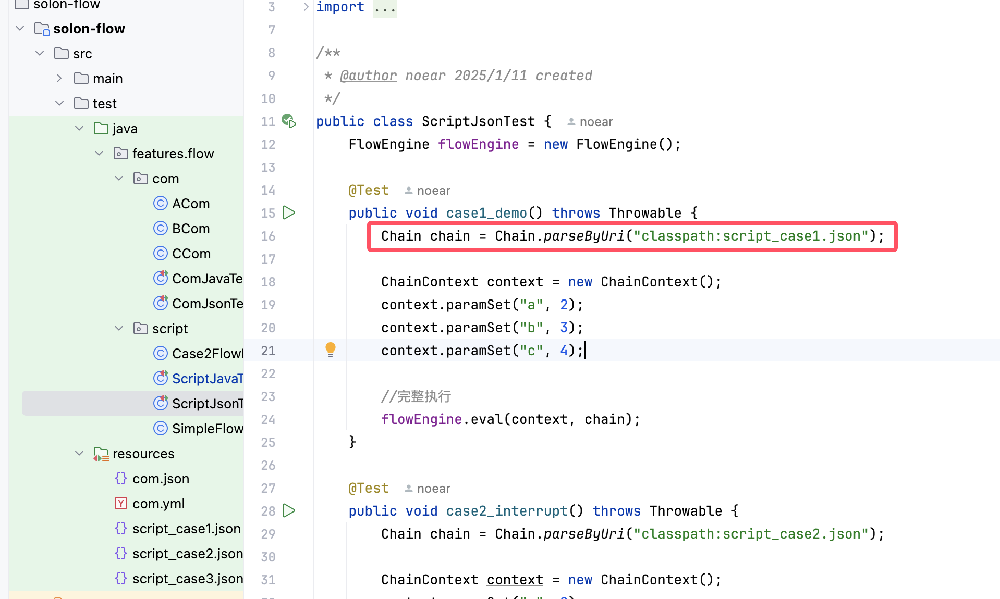

# 关于"为什么XLang是一门创新的程序语言"一文的答疑

我在上一篇文章[为什么XLang是一门创新的程序语言](https://mp.weixin.qq.com/s/O4VeA7Dw8cRF7HTHxi6pNw)中介绍了XLang语言的设计思想，指出XLang语言之所以是一门创新的程序语言，是因为它创造了一个新的程序结构空间，在这个结构空间中可以很方便的实现可逆计算理论所提出的`Y = F(X) + Delta`的计算范式。本文是对一些反馈的问题所做的进一步的解释。

## 1. 如何基于XLang将差量计算压缩到编译期执行？

> 为了实现属性继承，UIOTOS做了大量特殊的设计，并且在运行时引擎中引入了大量与属性继承相关的代码。但是，如果基于XLang语言，可以把差量计算完全压缩到编译期来执行，运行时引擎只需要知道普通组件结构即可，不需要有任何差量分解、合并的知识。


UIOTOS是一个用于IOT领域的无代码平台，它引入了一种容器组件，在这个组件中可以应用已经存在的页面，然后利用属性机制机制覆盖页面对象中的属性，从而实现不重新实现页面，但是又能灵活定制该页面内容的效果。

```json
{
  type: "container",
  baseUrl: "a.page.json",
  overrideProps: {
    "form/title": "sss",
    "actions/0/label": "vvv"
  }
}
```

大致方案如上述所示，基本相当于是通过baseUrl引入页面对象，然后通过多个继承属性来覆盖页面对象中的内容。通过类似JsonPath的语法，可以修改页面对象中的任何嵌套内容，因此它和一般的组件框架中调用组件，然后给组件传递参数是不同的。

UIOTOS在前端运行时框架中专门针对属性继承编写了不少代码，并且需要引入一个特殊的container控件。UIOTOS的方案有一个限制，就是它只能覆盖已有页面中的属性值，并不能改变被继承页面的结构。另外有一个同学做的低代码平台采用了一个功能类似的方案，它不需要引入特殊的container的组件，对于任何组件都可以进行差量定制。具体做法就是在组件中引入一个特殊的overwrite属性。

```json
{
  "component": "MyComponent",
  "version" : "1.0",
  "properties": {
     "a": 1, // 直接设置组件属性
   },
   "overwrite": [
    "这里记录可视化编辑器中对组件的编辑动作"
 ]
}
```

基本操作模式是在编辑器中推拽一个组件之后，如果发现组件有些细节需要调整，可以进入组件定制模式，在可视化设计器中对组件进行微调。**调整过程中的操作步骤被自动录制下来，作为overwrite保存在页面文件中**。这个方案可以任意调整组件结构，比UIOTOS的方案适应性更强，但是记录操作动作会比较冗长，多个动作也难以压缩成一个精简的最终结果（相当于没有利用结合律进行化简）。

> 根据可逆计算理论，A=0+A，全量是差量的一个特例，我们可以用统一的形式来定义全量和差量，这样差量的差量就也是一个普通的差量，可以实现更复杂的逻辑推理。使用overwrite这种动作模式来表达差量是不合适的。

无论是上面的哪种方案在编辑器和前端运行时框架里都要加入差量概念相关的处理代码。但是如果使用XLang语言作为底层模型的表达语言，则可以把差量计算完全压缩到编译期来执行，运行时引擎只需要知道普通组件结构即可，不需要有任何差量分解、合并的知识。具体做法是通过`x:extends`来实现组件继承。

```xml
<component x:schema="component.xdef">
  <import from="comp:MyComponent/1.0.0"/>

  <component name="MyComponentEx" x:extends="comp:MyComponent/1.0.0">
    <props>
      <prop name="a" x:override="remove"/>
      <prop name="b"/>
    </props>

    <template x:override="merge">
      这里可以只显示Delta修正的部分

      <form x:extends="a.form.xml">
        <actions>
          <action name="ss" x:id="ss"/>
        </actions>
      </form>
    </template>
  </component>

  <template>
    <MyComponent/>
    <MyComponentEx/>
  </template>
</component>
```

如果不需要定制，直接通过import引入组件来使用即可。如果需要定制，则启用局部组件定义，通过`x:extends`引入已有的组件。XLang定义了Tree结构之间的Delta合并算法，通过统一的DslNodeLoader来加载模型文件时会自动执行这个算法。伪代码如下：

```javascript
 function loadDeltaModel(path){
    rootNode = VirtualFileSystem.loadXml(path);
    for each node with x:extends attribute  // 递归遍历rootNode以及rootNode的子节点
        baseNode = loadDeltaNode(node.removeAttr('x:extends'));
        genNodes = processGenExtends(node);

        for each genNode in genNodes
            baseNode = new DeltaMerger().merge(baseNode, genNode);
        node = new DeltaMerger().merge(baseNode,node);

    processPostExtends(node);
    return node;
 }
```

`DslNodeLoader.loadDeltaModel("comp:MyComponent/1.0.0")`返回的XNode是最终合并后的节点，其中已经不包含任何x名字空间的属性和子节点。

**Loader可以看作是一种即时编译器，它加载模型文件的时候进行的结构转换可以看作是编译过程的一部分**。

### 在结构层而不是对象层定义的差量运算

> 维特根斯坦说过，语言的边界就是我们世界的边界。可逆计算理论进一步的诠释是：**一种程序语言定义了一个软件结构空间，各种根据已有结构产生新结构的复用机制相当于是这个结构空间中的变换规律**。

一个真正实用的DSL必然需要考虑可扩展性的问题，需要内置一些分解、合并、复用的机制。但是目前大部分DSL设计者都习惯于在具有语义的对象层引入这些结构运算，导致每个DSL设计者实际上都是拍脑袋设计，缺乏通用性和内在的一致性。

XLang提供了一整套标准化的做法，一劳永逸的解决所有DSL的可扩展性问题。DSL引擎只要考虑最小化的运行时问题即可。XLang完全只在编译期（模型解析和加载）执行，运行期完全没有任何XLang相关的内容。这里的关键就在于**XLang是在对象之下的结构层实现Delta合并运算**。所谓结构层就是XNode层面，类似Lisp中的S表达式，它本身是没有任何语义的。**脱离语义，正是Delta合并运算通用性的表现**。

举例来说，Spring的`beans.xml`可以看作是组件装配领域的DSL。Spring1.0引入了parent属性用于实现某种继承功能，引入了Import语法来实现复杂文件分解和复用。Spring2.0引入了自定义节点，简化复杂结构Bean的配置。SpringBoot则引入了@ConditionalOnProperty注解，允许通过配置开关来选择是否启用Bean。为了实现这些功能，都需要Spring框架在内核中专门编写相应的处理代码。

```xml
<beans xmlns="http://www.springframework.org/schema/beans"
       xmlns:xsi="http://www.w3.org/2001/XMLSchema-instance"
       xmlns:myns="http://www.example.com/schema/myns"
       xsi:schemaLocation="http://www.springframework.org/schema/beans
           http://www.springframework.org/schema/beans/spring-beans.xsd
           http://www.example.com/schema/myns
           http://www.example.com/schema/myns/myns.xsd">

    <import resource="classpath:config/services.beans.xml"/>

    <!-- 父Bean -->
    <bean id="parentBean" class="com.example.ParentClass">
        <property name="commonProperty" value="commonValue"/>
    </bean>

    <!-- 子Bean，继承父Bean的配置 -->
    <bean id="childBean" parent="parentBean">
        <property name="extProp" value="extValue"/>
    </bean>

     <!-- 使用自定义命名空间配置Bean -->
    <myns:customBean id="customBean" customProperty="customValue"/>
</beans>
```

```java
@Component
@ConditionalOnProperty(name = "mycomponent.enabled", havingValue = "true", matchIfMissing = false)
public class MyComponent {

    public MyComponent() {
        System.out.println("MyComponent is initialized!");
    }

    public void doSomething() {
        System.out.println("MyComponent is doing something!");
    }
}
```

而如果是使用XLang，这些功能完全不需要开发

```xml
<beans x:extends="config/base.beans.ml">
   <x:gen-extends>
     <c:include src="config/services.beans.xml" />

     <beans>
        <myns:customBean id="customBean" customProperty="customValue"
                      xpl:lib="/example/myns.xlib" />
     </beans>
   </x:gen-extends>

   <bean id="parentBean" class="com.example.ParentClass">
        <property name="commonProperty" value="commonValue"/>
   </bean>

   <bean id="childBean" x:prototype="parentBean">
        <property name="extProp" value="extValue"/>
   </bean>

   <bean id="myComponent" class="com.example.MyComponent"
         feature:on="mycomponent.enabled">
       <property name="propA" ref="xxx" feature:on="mycomponent.xxx.enabled" />
   </bean>
</beans>
```

* 首先，我们注意到，在不引入任何可扩展机制的情况下，Spring1.0中bean的定义就是一个完备的组件装配模型。也就是说，任何可以通过`get/set`函数和`constructor`构造器来装配的bean，都可以使用`beans.xml`这个DSL来描述式的定义装配逻辑。在数学上，我们可以说Spring1.0定义了一个完备的装配运算集合。

* XLang的做法是在已有的DSL基础上引入一组Delta差量运算，但是这些**Delta运算的结果是将`DSL + Delta`结构划归为原始的DSL结构**。这里有趣的是，Spring2.0引入的自定义名字空间的做法是不能化归到1.0语法的，也就是说**用Spring2.0语法配置的bean并不能保证一定可以使用Spring1.0语法来配置，即使Spring1.0语法是一个完备运算集**。Spring2.0的自定义名字空间，比如`<myns:customBean>`会触发Java中的一个NamespaceHandler去处理，它在Java中执行的逻辑可以任意复杂，甚至可能会隐含的引入顺序依赖（bean的声明顺序有可能影响到装配结果），实际上会破坏了Spring1.0的POJO声明式装配设计。

* `x:extends`可以继承已有的DSL文件，功能类似于Spring1.0的import语法。

* `x:gen-extends`中执行Xpl模板语言来动态生成bean的定义。这里可以使用Xpl模板语言内置的`c:include`来引入外部XNode节点，同样可以取代Spring1.0的import语法。

* `x:gen-extends`段中通过Xpl自定义标签的功能可以模拟Spring2.0的自定义名字空间机制。只不过Xpl标签的做法是代码生成，无论标签函数的执行逻辑多么复杂，只要它能生成我们期望的bean配置定义即可。比如上面的`<myns:customBean>`可能实际会生成多个bean的定义。真正在运行时起作用的是标签函数的生成结果。`x:gen-extends`本身是在编译期执行。

```xml
 <myns:customBean id="customBean" customProperty="customValue"
                      xpl:lib="/example/myns.xlib" />

实际展开成如下两个Bean的定义：

<bean id="customBean" class="com.example.CustomBean">
    <property name="customProperty" value="customValue" />
    <property name="otherProperty" ref="otherBean" />
</bean>

<bean id="otherBean" class="com.example.OtherBean" />
```

* XLang中，同级的兄弟节点之间可以通过`x:prototype`属性来指定继承关系。这可以取代Spring1.0语法中的parent属性的作用。同时XLang中的节点进行合并时，可以通过`x:override`来精细的控制合并逻辑：到底是覆盖、合并还是删除等。需要强调的是，XLang的这种机制是在任何节点上都可以实施的，比如在property也可以指定`x:prototype`继承其他Property的配置。但是Spring中的parent属性只能用于bean的定义的继承。

* XLang中每一个节点上都可以通过`feature:on`和`feature:off`这种特性开关来控制条件加载。当特性开关不满足时，对应的节点会被自动删除，实际上并不会进入运行时。这可以取代SpringBoot的条件Bean的作用。同样的，feature开关在任何节点上都可以使用，比如在`<property>`节点上可以控制是否配置某个属性。但是在SpringBoot中条件开关只能作用于bean的创建，是没有任何声明式的机制来控制是否配置某个property的。

综上所述，Spring框架中内置了很多用于增加扩展性的机制，这些机制都需要专门针对组件装配这个领域，针对Spring这个特殊的框架进行编写。如果迁移到另外一个运行时引擎，这些机制都需要重新编写。比如Quarkus框架也支持Bean的装配定义，所有这些扩展方案它都需要自己实现一遍。Spring实现完毕之后，Hibernate等框架也无法利用这些机制来实现自己的扩展。

XLang的关键是将XML或者JSON解析为XNode节点之后，在XNode这个层面完成Delta运算，而不是将XNode转换为强类型的BeanDefinition之后再执行Delta运算。因此它所做的这些功能可以自动应用到其他的DSL上，比如MyBatis的mapper文件，Hibernate的hbm文件等。

其实类似的可扩展性问题在很多领域都存在，比如Facebook发明的GraphQL服务协议中引入了类型扩展语法

```graphql
type User {
  id: ID!
  name: String!
  email: String!
}

extend type User {
  age: Int
  email: String @deprecated(reason: "Use 'contactEmail' instead")
  contactEmail: String!
}
```

在`graphql-java`包的实现中，是先将graphql定义解析为TypeDefinition和TypeExtensionDefinition，然后在对象层实现类型合并。

在XLang的技术体系中，NopGraphQL框架使用XMeta元数据模型来定义Type，所以可以直接使用XLang内置的XNode层面的差量机制实现扩展，无需专门设计一个TypeExtension语法。在NopGraphQL的运行时，也无需具有任何类型扩展的知识。对于运行时框架而言，类型就是类型，不存在类型+类型扩展的情况

### Loader as Generator

在XLang的技术体系中，Loader这个抽象具有特殊地位。因为所有可逆计算相关的内容原则上都是在Loader抽象中完成，所以第三方框架集成XLang原则上非常简单：直接将DSL的Loader替换为XLang的Delta Loader即可。

一个通用的模型加载器可以看作是具有如下类型定义：

```
Loader :: Path -> Model
```

对于一种通用设计，我们需要意识到一件事情，所谓的代码编写并不仅仅是为了应对眼前的需求，而是需要同时考虑到未来的需求变化，需要考虑到系统在时空中的演化。 换句话说，编程所面向的不是当前的、唯一的世界，而是**所有可能的世界**。在形式上，我们可以引入一个Possible算子来描述这件事情。

```
Loader :: Possible Path -> Possible Model
Possible Path = deltaPath + stdPath
```

stdPath指模型文件所对应的标准路径，而deltaPath指对已有的模型文件进行定制时所使用的差量定制路径。举个例子，在base产品中我们内置了一个业务处理流程main.wf.xml，在针对客户A进行定制时，我们需要使用一个不同的处理流程，但是我们并不想修改base产品中的代码。此时，我们可以增加一个delta差量模型文件`/_delta/a/main.wf.xml`，它表示针对客户a定制的main.wf.xml，Loader会自动识别这个文件的存在，并自动使用这个文件，而所有已经存在的业务代码都不需要被修改。

如果我们只是想对原有的模型进行微调，而不是要完全取代原有模型，则可以使用`x:extends`继承机制来继承原有模型。XLang中的DeltaLoader的执行逻辑在数学层面上由下面的公式描述

```
Loader<Possible Path> = Loader<deltaPath + stdPath>
                      = Loader<deltaPath> x-extends Loader<stdPath>
                      = DeltaModel x-extends Model
                      = Possible Model
```

这里需要强调的是，Loader抽象实际上具有非常广阔的应用场景，大量的与可扩展性相关的功能都可以下放到Loader层面统一实现，比如说多租户定制问题可以由一个识别租户参数的Loader来解决。更进一步的介绍参见[从张量积看低代码平台的设计](https://mp.weixin.qq.com/s/BFCTN73pH8ZZID3Dukhx3Q)

## 2. 如何理解XLang中差量叠加与波的类比关系？

> 物理世界中存在着另一种构造方式，那就是波。波是连续存在的模式，通过干涉叠加来构造世界。XLang语言的特异性就在于它通过差量运算支持连续的叠加构造。

传统上构造好X之后，如果要修改，一定是要修改X本身。而如果是一种叠加方式，则可以**通过额外补充一个Delta，在不直接改变X的情况下得到一个新的Y**。

```
X = A + B + C
Y = A + B + D
  = X + (-C + D)
  = X + Delta
```

传统的软件工程体系下，即使可以做到某种增量式开发，往往也是需要特殊设计很多扩展点，并不是任意地方的修改都可以通过Delta方式进行定制修改的。特别是传统的软件工程中增量一般都意味着增加新的功能，很少涉及到逆向减少已有的功能特性这种设计。Delta定制使得我们可以**通过增加实现减少**。

**使用XLang开发的系统无需做任何额外的工作，就自动支持Delta定制。这使得产品化产品的开发成本得以大幅降低**。比如说一个银行核心系统在打包成jar包之后，无需修改基础产品的代码，所有针对特定用户的定制修改、二次开发都可以作为Delta差量单独存放，通过切换Delta就可以实现多个不同的定制版本。同样的机制可以用于多租户定制。

Delta定制可以实现精确到单个属性的定制。而传统软件工程只能提供少数事先定义的扩展点，很难实现所有地方都支持细粒度定制。比如我只想定义一个按钮的某个属性，往往都需要增加一个新的组件或者页面。**所有业务层面关注的概念都可以逐个进行定制**，这是所谓的连续性的一种表现。

## 3. 在已经开发好的标准系统中能否引入XLang？

> XLang是一种创新的技术，它能否应用到已有的系统中？这样在遇到定制需求后，可以使用XLang表达出差量，然后基于标准系统和差量表述生成定制版系统。

首先需要明确的是，差量需要在差量化的结构空间中表达。传统的软件是使用通用语言来表达，它所在的结构空间也就由通用程序语言来定义。通用程序语言如`Java`,`C#`等表达差量的时候非常受限，无法实现细粒度的差量定义。

在面向对象程序语言中，能够直接利用的差量机制只有继承机制。Nop平台的做法是采用一种所谓的三明治架构，代码生成的时候采用如下生成方案

```java
class NopAuthUser extends _NopAuthUser{

    // 这里可以增加额外的方法，从基类继承模型驱动生成的代码。
}

class _NopAuthUser extends OrmEntity{
}
```

也就是说，模型驱动生成的类从系统内置的基础类继承，这样可以自动得到一些内置的属性和方法，而最外层再生成一个类从代码生成的类继承，这样手工修改的代码可以和自动生成的代码隔离。代码生成的时候，我们约定如下规则: **文件名以下划线为前缀的文件以及`_gen`目录下的所有文件都会被自动覆盖，其它文件只有不存在时才新建**。这样的话，当模型发生变动的时候，可以直接重新生成，不会导致手工修改的内容丢失，从而实现模型驱动的增量式开发。

虽然不能从面向对象语言中直接得到更多的差量化支持，但是在架构层面可以自行构建更多的差量机制。最基本的方案是所有使用到XML/JSON/YAML等配置文件或者模型文件的地方都可以引入XLang。



在上面的示例中，Chain是一种可以通过json文件定义的模型对象，它的解析和装载可以通过`Chain.parseByUrl`函数进行。如果使用XLang来改造，可以直接将·`Chain.parseByUrl`替换为`ResourceComponentManager.loadComponentModel(path)`，然后把json文件移动到`resources/_vfs`目录下即可。在这个json就可以使用`x:extends`，`x:post-extends`，`x:override`等XLang的Delta差量语法。

Nop平台提供了一个`nop-spring-delta`模块，其中对Spring的`beans.xml`文件和MyBatis的`mapper.xml`文件增加了Delta定制支持，可以把这些XML文件放到`resources/_vfs`目录下。具体做法如下：

```java
@Service
@ConditionalOnProperty(name = "nop.spring.delta.mybatis.enabled", matchIfMissing = true)
public class NopMybatisSessionFactoryCustomizer implements SqlSessionFactoryBeanCustomizer {
    @Override
    public void customize(SqlSessionFactoryBean factoryBean) {

        List<IResource> resources = ModuleManager.instance().findModuleResources(false, "/mapper", ".mapper.xml");

        if (!resources.isEmpty()) {
            List<Resource> locations = new ArrayList<>(resources.size());
            for (IResource resource : resources) {
                // 忽略自动生成的mapper文件，它们只能作为基类存在
                if (resource.getName().startsWith("_"))
                    continue;

                XDslExtendResult result = DslNodeLoader.INSTANCE.loadFromResource(resource);
                XNode node = result.getNode();
                node.removeAttr("xmlns:x");

                String xml = "<?xml version=\"1.0\" encoding=\"UTF-8\" ?>\n" +
                        "<!DOCTYPE mapper\n" +
                        "        PUBLIC \"-//mybatis.org//DTD Mapper 3.0//EN\"\n" +
                        "        \"http://mybatis.org/dtd/mybatis-3-mapper.dtd\">\n" + node.xml();
                locations.add(new ByteArrayResource(xml.getBytes(StandardCharsets.UTF_8), resource.getPath()));
            }
            factoryBean.addMapperLocations(locations.toArray(new Resource[0]));
        }
    }
}
```

* `ModuleManager.instance().findModuleResources(false, "/mapper", ".mapper.xml")`会在各个模块的mapper目录下查找`mapper.xml`文件。这个过程会自动考虑Delta目录下的文件。如果在`_vfs/_delta/{deltaId}/`目录下存在同名的文件，则会自动选择Delta目录下的版本。Nop平台内置的VirutalFileSystem是一种类似Docker的分层文件系统，上一层的文件会覆盖下一层的同名文件。每个Delta目录就构成一个独立分层，可以通过`nop.core.vfs.delta-layer-ids`来指定多个Delta层。

* 通过XLang提供的DslNodeLoader加载XML的文件的时候，会根据根节点上的`x:schema`属性读取到对应的XDef元模型，然后按照元模型规范定义实现节点的Delta合并。

* 合并完成之后得到一个XNode节点，可以将它转换为XML的DOM节点，这里直接序列化为XML，送入MyBatis的工厂bean。MyBatis本身不需要做任何改造，只是为它增加了一种新的获取mapper文件的方式而已。
