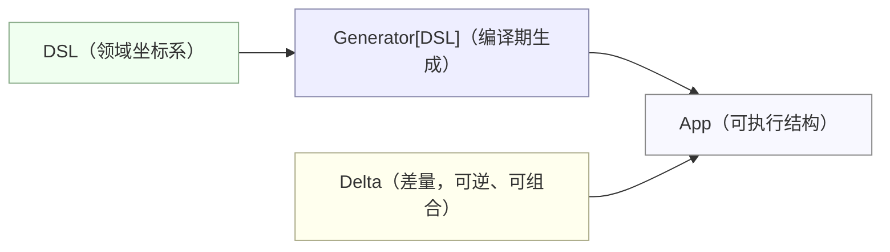
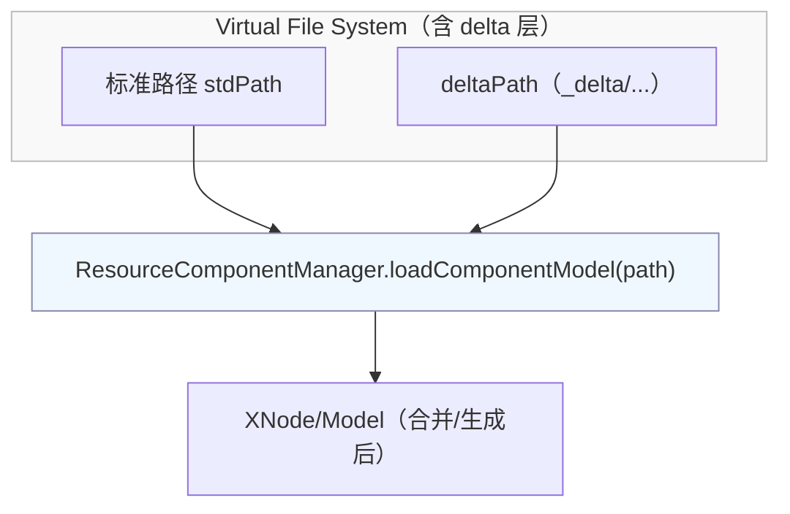

# 让演化可编程：XLang 与可逆计算的结构化范式

**【阅前说明】** 本文是一篇评论与解读。它并非原文复述或官方宣传，而是笔者在深入研读一组相关文章后，对其中呈现的思想与工程实践，所做的结构化辨析与评价。

> 参考文章 [为什么说XLang是一门创新的程序语言](https://mp.weixin.qq.com/s/O4VeA7Dw8cRF7HTHxi6pNw)

本文试图回答一个看似简单却常被误解的问题：XLang 为什么可以被称为一门创新的程序语言？答案并不在“引入了多少语法糖”，而在“重写了语言与软件构造的底层逻辑”：它试图把程序语言从“句法范式”重构为“结构空间的构造规则”，在语言级定义了“领域坐标系”和“差量（Delta）合并”，从而让 `App = Delta x-extends Generator<DSL>` 这一可逆计算范式构成了从理论到工程的完整闭环。换句话说，XLang 借助可逆计算，在工程上把“演化”变成可编程对象。

关于XLang的系列原文中不乏洞见深刻的“金句”与论断，当然也存在争议。为帮助未曾接触原作的读者直击核心，本文将重排其论证次序，择取关键点进行深度剖析，并辅以代码、公式与简明图示，厘清其创新脉络及应用边界。

## 一、第一性重定义：程序语言 = 结构空间的构造规则

作者的“金句”之一是对程序语言的重新界定：

> 一门程序语言定义了一种程序结构空间，程序语言是程序结构空间的构造规则。

这一句很值得细品。主流语言研究几乎都将“语言”视为“句法、语义、类型系统”的三件套，即便在探讨多范式（如OOP、FP、Async、Meta编程）时，其落脚点也依然是函数、表达式等具体元素的表达能力。但 XLang 的切入点截然不同：它追问语言“能构造出怎样的结构空间”，以及“结构之间如何复合与演化”。这一视角上的根本转移，直接引出了后续三个极具分量的设计：

- **从 Map 到 Tree 的升维**：将传统对象模型的“短程关系”（名称-值）提升为树结构的“长程路径”（局部/全局坐标），从而为“定位”与“合并”操作提供了稳固的结构锚点。
- **将 Delta 合并原生化**：在语言层面直接引入支持“删除”语义的差量合并机制，使“演化”本身成为一等公民。
- **视 DSL 为坐标系**：将领域特定语言（DSL）作为“领域坐标系”，通过生成器（Generator）进行多阶段编译，把“模型到模型”的转换链条内建为语言的核心能力。

这与以往“语言=可执行文本”的理解貌似相近，实则殊途。XLang 的核心价值，不只在于“执行”，更在于“描述结构、定义变换”，并将绝大部分结构性工作在编译期完成。正是这一点，为其最核心的范式——可逆计算——铺平了道路。

## 二、从 Map 到 Tree：结构升维与“删除语义”的回归

大多数面向对象语言中的组合、继承与Trait，其本质都是基于名称的Map式叠加与覆盖：我们可以将“类”视为一个Map（Key为成员名，Value为成员实现），而“继承”则无非是子类Map对父类Map的覆盖。然而，这种基于Map的扩展方式存在两大痛点：

- **坐标缺失**：Map仅有“对象名+成员名”的两级坐标，无法稳定地指向“某同类组件的特定实例内部的某个位置”，因而缺乏真正的“领域坐标系”。
- **“删除”语义的缺位**：Map的覆盖操作通常只支持“增加”与“修改”，而“删除”操作在语言层面普遍“失声”。（例如，Scala的Trait无法移除父类成员，Java/C#更是如此。）

XLang 的关键突破，正源于这次结构升维：从 Map 到 Tree。在 Tree 结构中，每个节点都拥有一个类似 XPath 的稳定路径，这使得以下两种看似朴素、但在工程实践中却极难做好的能力得以实现：

- **语义化定位**：诸如 `/tasks/task[name='test']/@name` 这样的路径表达式，能够直接与业务语义对齐，让“谁在何处”的指代清晰无误。（为了保证坐标的稳定，集合中的节点需要具有id/name之类的唯一标识属性）
- **结构级删除**：像 `x:override="remove"` 这样的声明，其效力并非“运行时绕行”，而是“编译期擦除”，从而赋予了差量合并机制真正的“逆元”。

这看似只是“文本处理技巧”的一小步，实则构成了整个理论体系的转折点。“删除”是实现“可逆”（Reversible）的先决条件：一个只有合并操作（好比数学上的幺半群）而无逆元的系统，难以支撑系统级的灵活复用；而一旦拥有了逆元，通过应用一个或一系列差量（Delta），即可实现 **从任意结构X到任意结构Y** 的演化。

代码层面，非常直观：

```xml
<!-- 在 delta 目录覆盖基础 ORM，删除某字段，增加某字段 -->
<orm x:extends="super">
  <entity name="bank.BankAccount" className="mybank.BankAccountEx"  >
    <columns>
      <column name="refAccountId" code="REF_ACCOUNT_ID" sqlType="VARCHAR" length="20" />
      <column name="phone3" x:override="remove" />
    </columns>
  </entity>
</orm>
```

这背后的结构逻辑是：

- 先“升维”到 Tree（节点具有稳定领域坐标）；
- 再在 Tree 上定义 Delta 合并，且合并满足结合律；
- 同时允许“有/无”的混合，保证可逆（删除是独立语义，而不是“不给用”的遮蔽）。

【评论】 这一设计的精妙之处在于：它将工程师们“想做却做不好”的日常操作（如对第三方库进行微调、删减），提升为一种语言内置、且安全可组合的原子能力。这绝非语法糖，而是为可演化性提供的“语义奠基”。

## 三、可逆计算：`App = Delta x-extends Generator<DSL>`


作者的另一句“金句”，则将软件的构造过程精炼为一道公式：

```
App = Delta x-extends Generator<DSL>
```

这道公式明确了可逆计算的三大支柱：

- **DSL (领域特定语言)**：作为“领域坐标系”，它界定了业务描述的空间。
- **Generator (生成器)**：作为“多阶段编译器”，它负责在编译期执行模型到模型、模型到代码的转换，理想情况下应具备图灵完备的计算能力。
- **Delta (差量)**：作为“演化单元”，它封装了变更（含删除），其合并操作满足结合律，是实现复用与演化的一等公民。

这一范式最直观的效果，就是“打开了编译期黑盒”，允许开发者在“语义空间（DSL）”和“结构空间（XNode）”之间进行可逆变换与差量组合。它将“变更”这一行为，从原始的运行时调整、二进制补丁乃至Git行级差异，一举提升到了“基于领域结构稳定坐标系”的层面。

我们用一个极简的 mermaid 图来描绘这一过程：



当然，这套范式中的诸多理念，在工程界早已不乏先例或雏形：

- **Docker**：基于差量文件系统（OverlayFS）的“结构叠加”，每层独立可分发（镜像=Delta 层 + 基层）。
- **Kustomize**：对 Kubernetes YAML 的战略性合并（定制化无侵入）。
- **GraphQL type extension**：类型扩展（但常停留在类型层，缺少统一的结构层 Delta 合并）。
- **FOP/DOP/XVCL**：早期学术界关于“特征/差量”编程的探索（见后文对比）。

XLang与可逆计算的独到之处，在于它并非简单地模仿，而是将这些散落的“点”**锻造**成一个统一的内核：通过“结构层”的 `Delta+Tree+坐标系`，将所有与演化相关的操作“一把兜住”，并将其**内化**为语言的核心能力。这使得它不再是一个外部“工具”或“插件”，而是一个“语言+编译期”的自洽整体。

## 四、XLang三件套：XDef、Xpl、XScript——不是“写代码”，而是“写生成代码的代码”

为使前述的可逆计算公式能够落地，XLang 提供了一套标准工具集：

- **XDef (元模型定义)**：一种同态、易读的元模型定义语言。其本质是“用与模型自身同构的结构去描述该模型”，可视为JSON Schema的增强版。
- **Xpl (模板语言)**：一种图灵完备的XML模板语言，专用于在编译期生成抽象语法树（AST），即XNode。它支持宏与标签库，并能在输出时保留源文件的位置信息，对调试、断点设置及SourceMap极为友好。
- **XScript (脚本语言)**：一种语法近似JavaScript的脚本表达式语言，内置类型扩展，与Xpl及宏无缝协同。

这三者协同工作，使得在编译期“理解并变换结构”成为现实。例如，Xpl中通过宏来隔离并生成AST的例子就非常直观：

```xml
<macro:script>
  import test.MyModelHelper;
  let validatorModel = MyModelHelper.parseValidator(slot_default);
  // 编译期生成 AST（而非运行期拼文本）
  let ast = xpl `
     <c:ast>
        <c:script>
          BizValidatorHelper.runValidatorModel(validatorModel,obj,svcCtx);
        </c:script>
     </c:ast>
  `;
  return ast.replaceIdentifier("validatorModel",validatorModel);
</macro:script>
```

【评论】 在传统的模板语言中，由于最终生成的是纯文本，结构操作不仅极易出错，而且难以调试。相比之下，Xpl 生成的是携带源位置信息的XNode AST，这就完成了一次质的飞跃：**模板不再是简单的“文本拼接器”，而是强大的“结构变换器”**。其原理与Lisp宏的“同像性”（Homoiconicity）异曲同工，却是在XML这一实用主义的土壤上扎实落地。

## 五、DSL 森林：统一元模型、统一差量、统一 Loader

作者反复强调的，是构建“DSL森林”，而非单个的DSL。这一愿景的价值在于，它通过以下三项关键设计，补齐了“多DSL协同工作”的缺失环节：

- **统一的元模型 (XDef)**：确保每种DSL的定义都是自洽的，并能获得IDE的动态支持。
- **统一的差量机制 (x:extends等)**：为所有DSL的分解、合并与定制，提供了一致的语义规则。
- **统一的加载器 (Loader)**：将“加载、编译、生成、合并”等一系列操作抽象为一个原子过程，并内建了对“Delta层”的支持。

在对Spring和Mybatis进行“无侵入Delta定制”的案例中，这一点表现得尤为典型：开发者无需修改Spring/Mybatis的引擎源码，只需将原先“读取XML”的函数调用，替换为`ResourceComponentManager.loadComponentModel(path)`。这一小小的改变，便能让加载过程经由一个内置“Delta层”的虚拟文件系统，自动完成扩展、合并与生成。这种“加载即生成”（Loader as Generator）的设计，值得我们用一张图来单独说明：



【评论】 很多人低估了“补齐Loader抽象”这一设计的深远意义。它相当于为可逆计算范式提供了一个通用的“服务接入端口”：你无需重写目标引擎，只需替换掉其原有的资源“加载”入口，就能将Delta与Generator的强大能力无缝“注入”。对于工程落地而言，这意味着绝大部分的实施难点都被巧妙地化解了。

## 六、可扩展性的统一解：为何Tree是坐标，而类型不是？

作者对“类型系统非合格坐标系”的批评可谓一针见血：类型系统表达的是“同形约束”（is-a-kind-of），而可扩展性真正需要的是“唯一定位”（is-at-a-specific-place）。例如，对于“页面上第2个按钮的label”这类需求，类型系统无力在众多实例中做出精确指代，而Tree结构所依赖的XPath，天生就是一套统一了“绝对坐标”（全局路径）与“相对坐标”（子树路径）的定位语言。

同时，作者还强调了Tree的另一重价值：父节点可作为控制节点，向下游子节点传播属性或指令。这对于大型系统的动态编排至关重要——无论是跨DSL的元编程、多阶段的逻辑推导，还是通过`feature:on/off`实现的条件化功能开关，最终都能收束于这种结构化的控制流之中。

【评论】 类型与坐标的错位，是许多所谓“可配置”扩展性方案失败的根源。XLang的“Tree+坐标”模型，则为此提供了一套逻辑自洽的、根本性的解决方案。

## 七、横向对比：与Git、Docker、Kustomize等模式的异同

一篇评论若要厘清“新”在何处，就必须进行横向对照。下文将简要梳理作者的核心对比观点，并附上笔者的评注。

- **Git**：其`diff/patch`机制本质上是“行级文本”的差量，而非结构化差量。它不具备“稳定坐标系”和“结合律”：补丁（Patch）强依赖基线版本；冲突标记会破坏代码结构；多个补丁无法在脱离基线的情况下安全地合并。**结论**：Git的差量模型专为版本控制而生，在结构化的、可计算的演化方面确实力不从心。
- **Docker**：其差量模型是“文件系统级”的。OverlayFS中的“白障”（Whiteout）文件，正是“删除”这一逆元语义的巧妙工程实现。Docker镜像的每一层都是一个独立的、可复用、可分发、可合并的“差量切片”，其合并操作亦满足结合律。**结论**：Docker是“差量成为一等公民”这一思想在工程领域最成功的范例之一。
- **SpringBoot**：其条件装配（如`@ConditionalOn...`）和自定义命名空间（`NamespaceHandler`）等机制，本质上是在“对象层”进行编织。但为了实现这些动态特性，常需借助命令式扩展点（如 Java 配置类、ImportSelector、BeanFactoryPostProcessor、自定义 Condition 等）实现，从而将部分装配策略下沉到代码层，弱化了纯声明式配置的封闭性与一致性；而在 XLang 中，这类装配与条件决策被统一提升至结构层的 delta 合并，借助 x:extends/x:gen-extends/feature:on 等声明式规则在同一语义层完成结构化合并与条件化扩展，从而保持更好的可推理性与组合性。
- **Kustomize**：可视为可逆计算思想在“Kubernetes部署配置”这一特定场景下的成功应用。它与XLang的核心思想高度相似，但其能力**既局限于YAML格式，也绑定于Kubernetes这一特定领域**。XLang的价值则在于将这种差量化能力**普适化**与**内生化**，使其能够应用于任何DSL。
- **GraphQL Type Extension**：它提供了“类型层”的差量化能力，但其作用范围也仅限于类型定义。与XLang所提供的、贯穿整个体系的“结构层”复杂合成与“跨DSL”粘合能力相比，尚有较大差距。

【评论】 上述对照极具说服力。它表明XLang的创新并非天外飞仙，而是将人们熟知的、散落在各处的局部模式（如Docker的分层、Kustomize的覆盖）**提炼、升华，并最终统一到通用的结构层之上，固化为一等语言公民**。在工程方法论层面，这标志着一次清晰的代际升级：从“为特定场景编写适配器”的模式，跃迁至“以通用的生成器+合并器构造系统”的新范式。

## 八、代数性质：删除、结合律与逆元如何确保工程可行性

作者在原文中对这些代数性质的“必要性”进行了论证，特别是阐述了“为何结合律至关重要”以及“如何通过逆元引入删除语义”。此处，我们用更通俗的语言将其核心观点总结如下：

- **结合律 (Associativity)**：它意味着差量可以“**先局部合并，再整体组合**”，即 `A + (B + C) = (A + B) + C`。这为**局部优化**提供了理论基础：例如，`(B + C)` 这个组合可以被预先计算和缓存，然后在多种上下文中被高效复用（如 `A + (B+C)` 或 `D + (B+C)`），而无需每次都重新计算。
- **逆元 (Inverse Element)**：即“删除语义”，它赋予系统“**通过增加一个‘负差量’来实现减法**”的能力，使得真正的系统级复用成为可能（例如，`新系统 = 旧系统 + (-特性C + 新特性D)`）。没有逆元，系统只能无限叠加，很快就会演变成臃肿、脆弱的“摩天大楼”。
- **幂等删除 (Idempotent Deletion)**：理论上的逆元是**特异性**的（每个元素`A`都有其唯一的`A⁻¹`），而工程上实现的`x:override="remove"`是一个**通用**、**幂等**的删除操作。这种设计与严格的群论公理有所出入，但它并不意味着结构不合法。它只是**构成了一个不叫“群”、但同样满足结合律的代数结构**。这恰恰体现了从数学理论到工程实践的灵活取舍：群论是启发思考的工具，而非必须生搬硬套的教条。

【评论】 这些看似抽象的细节，并非为了构筑繁琐的理论迷宫，而是为工程实践划定清晰边界的基石。与众多停留在口号层面的“理念”文章不同，作者明确交代了“为何能合并、能复用、能逆向推导”的代数依据。这让“可逆计算”的宏大愿景（Vision），得以建立在坚实的公理（Axiom）之上。

## 九、方法论：从还原论到场论，从刚体组合到内禀坐标

作者的物理学背景在行文中俯拾皆是，其核心思想亦是一次深刻的视角重构：**他借鉴了物理学中从还原论到场论的思维转变**，即不再将软件视为“组件（刚体）”的孤立嵌套，而是看作一个**可通过“内禀坐标系”来描述其局部状态与演化规律的“结构场”**。文中提及的活动标架、微分流形、声子等比喻，也都在反复强调同一点：

- 通过“局部坐标+变换规律”为看似无限自由的系统**赋予结构**。
- 将“动态变化”与“结构运算”本身提升为**一等公民**。
- 最终，将“演化”这一过程重构为一种**可编程的实体**。

【评论】 这些物理学比喻极富启发性，但也容易让读者陷入“概念搬家”的误区。在此特别提醒：我们应将其视为思想上的类比，切忌生搬硬套。XLang的真正贡献，并非在于宣讲物理哲学，而在于**将源自“微分流形”这类抽象工具的**思想，**在工程上踏踏实实地转化为了一套可用的`Loader+XDef+Xpl+Delta`工具链**。

## 十、学术坐标：与FOP、DOP、MPS等前沿研究的脉络关系

在评估一项技术的全球原创性时，最常见的质疑便是“这不就是XXX吗？”。一篇公允的评论，其价值就在于既要梳理其思想渊源，也要剖析其独到建树。

- **FOP (Feature-Oriented Programming)**：以“特征”为组合单元。早期FOP缺少删除语义和统一的结构合并规则。后期的FeatureHouse等工作虽实现了语言无关的树合并，但其定位仍是外部“工具/框架”，未能将差量（Delta）能力**内建于语言核心**。
- **DOP (Delta-Oriented Programming)**：明确引入了含删除语义的Delta。但其研究重心更偏向于**针对特定编程语言的语义差量**，而非XLang这样统一在“结构层（Tree）”进行操作。同时，它也缺乏“多阶段编译、统一加载器、领域坐标系”这样一套完整的工程化基建。
- **XVCL/Frame Technology**：更像一种增强型的模板或预处理器。它将变化“录制”为一系列独立的指令，不具备严格的、基于结构的差量合并模型，因此在可逆性、组合性及坐标稳定性上存在先天不足。
- **JetBrains MPS**：作为顶级的“语言工作台”，其优势在于图形化、结构化的编辑器。它与XLang的相似之处在于“先定义DSL，再用DSL编程”的理念。不同之处在于，XLang**将差量合并作为语言的內核机制**，并围绕“编译期元编程+结构层操作”构建了完整的XDef/Xpl/XScript工具链。
- **双向变换 (BX - Bidirectional Transformations)**：这是学术界关于“数据源间同步与一致性”的研究领域，其“双向”精神与可逆计算相通。XLang则为BX理论提供了一个**高度工程化的落地框架**，将“可逆性、差量、结构层”融为了一体。

【评论结论】 XLang与可逆计算并非空中楼阁，它是在FOP/DOP等差量化思想的基础上，进行了深度的整合与推进。其真正的独创性在于，将“结构层、多阶段编译、统一加载器、差量合并”等关键要素**融为一体**，并**在工程层面实现了体系化的落地**。关于作者声称的核心理论诞生于2007年前后，这一时间点与DOP的兴起（约2010年）在时间上确有交叠，其具体的学术史地位有待未来通过论文、开源记录等进行交叉验证。但仅就**将众多理念整合为统一语言内核的完备性**而言，XLang在工程化深度上已属罕见。

## 十一、实践指南：优势、风险与落地建议

本文并非宣传稿，因此必须客观地探讨其局限性。将前文所述的诸多优势置于以下边界条件之下进行考量，将更有利于技术管理者做出审慎的判断。

**优势 (Pros):**

- **优雅的“减法”复用**：通过结构层的可逆Delta（含删除、满足结合律），使“删减式”复用成为可能。
- **开放的编译期**：通过多阶段编译（`Generator<DSL>`），打通了从模型到模型、再到最终产物（页面/服务）的转换链路。
- **无侵入的引擎增强**：统一的Loader抽象，允许以“外挂”方式为Spring/Mybatis等第三方引擎注入Delta定制能力。
- **可调试的元编程**：Xpl输出携带源码位置的AST，从根本上解决了传统模板语言“生成即黑箱”的调试痛点。
- **隔离复杂性**：可逆定制能够将客户化的“熵”隔离在Delta层，确保基础产品的内核纯净，是ToB场景的利器。

**风险与挑战 (Cons):**

- **陡峭的学习曲线**：`XDef/Xpl/XScript`的组合是一套全新的编程范式，对团队既有技能栈构成挑战。
- **尚在发展的生态**：尽管已提供核心的IDE插件与调试工具，但其生态成熟度与主流语言相比仍有差距（当然，这也是一个可以正向演进的过程）。
- **编译期治理**：虽然结构合并发生在编译期，对运行时无性能影响，但频繁的编译和过多的Delta层，对缓存策略、失效管理和编译时长控制提出了新的工程治理要求。
- **协作规范**：Delta的灵活性（不强依赖基线）是一把双刃剑，需要建立严格的工程规范来管理对同一坐标的多次修改。
- **适用边界**：并非所有变更都适合在结构层完成。对于高度动态、由运行时数据驱动的场景，需要结合即时编译等混合策略来处理。
- **XML的“心理门槛”**：尽管XDef的同态性已大幅降低了XML的认知负担，但对于一些团队而言，大量使用XML仍可能构成心理上的接受障碍。

**落地建议 (Adoption Strategy):**

1. **从Loader切入，小步快跑**：将既有项目中某个模块的资源加载逻辑替换为`ResourceComponentManager`，以最小成本体验Delta定制的威力。
2. **分段构建流水线**：依据`App = Delta x-extends Generator<DSL>`公式，将系统构建过程拆分为独立的、可测试的流水线阶段（如ORM → XMeta → XView → XPage）。
3. **建立Delta治理规范**：制定并推行关于Delta分层、命名、合并顺序及冲突解决策略的团队规范，并利用dump等工具进行审查。
4. **坚持结构化生成**：在编写Xpl时，应始终以生成AST（XNode）为目标，而非拼接字符串，并最大限度地保留源码位置信息。
5. **前置条件逻辑**：广泛使用`feature:on/off`等条件编译指令，将功能开关等决策逻辑尽可能前置到编译期处理。
6. **共识驱动的坐标系**：将“领域坐标”（如XPath）作为团队的核心协作语言进行文档化和宣贯。对坐标的理解越统一，Delta合并的健壮性就越高。

## 十二、拥抱AI时代：一个“生成-修正-合并”的统一框架

一个紧迫的现实是：大型语言模型（LLM）正日益广泛地参与到代码、配置乃至页面的生成工作中，这使得生成内容的可控性与可演化性问题变得空前尖锐。在此背景下，可逆计算与XLang的组合，为构建人机协同的开发闭环提供了一条可行路径：

- **生成 (Generation)**：由`Generator<DSL>`模型驱动，生成基础骨架。
- **修正 (Modification)**：由LLM或人类开发者，在清晰的“领域坐标系”上进行增、删、改等微调操作。
- **合并 (Merge)**：通过`x-extends`等机制，依据满足结合律的统一策略，将变更安全地合并。
- **追溯 (Traceability)**：借助XNode的源位置信息，将每一次（无论是来自人还是AI的）修改都与代码源头绑定，极大地便利了调试与回溯。

【评论】 在AI驱动的代码生成时代，基于“结构”的`diff/merge`，注定比基于“文本”的`diff/patch`拥有更广阔的前景。从这个角度看，XLang无疑是为探索这一方向提供了一个颇具潜力的载体。

## 结语：总体评价与原创性判断

综上所述，笔者做出如下评论结论：

- **理论完备性**：可逆计算范式（`App = Delta x-extends Generator<DSL>`）在代数机理与工程实现两个层面高度自洽，它将“结构化差量、多阶段编译、领域坐标系”等理念融合成一个可落地的闭环。这并非单点创新，而是“**一套工具集支撑一个新范式**”的系统性成果。
- **工程实用性**：统一的Loader抽象、输出AST的Xpl、同态的XDef等设计，确保了“理论不是口号”，而是“**更换一个加载器即可生效**”的务实路径。这一点，在对Mybatis/SpringBeans的无侵入定制，以及在DSL森林的跨模型流水线构建上，得到了很好的体现。
- **原创性贡献**：将“结构层Delta合并（含删除）、统一Loader、多阶段编译、领域坐标系”**四位一体地内建于语言核心**，是XLang相较于FOP/DOP/MPS等前辈工作的关键超越。尽管其理论提出的时间（作者声称约2007年）与DOP等研究有时间上的交集，具体学术地位有待考证，但就“**理论-工程一体化**”的深度和完备性而言，XLang无疑走在了前列，具有很强的原创价值。
- **潜在风险**：生态规模、团队学习曲线、Delta治理的复杂性以及编译期性能的管控，是其在短期内需要通过更多实践来验证和锤炼的挑战。

如果只允许用一句话来概括XLang的定位，笔者愿以此作结：

> XLang 的目标，并非成为又一门“新语言”，而是要成为一门“**让语言回归其本质**”的语言。它将结构、坐标、差量与生成这四大基本构造能力重新赋予语言自身，从而让“演化”获得了坐标系，“删减式复用”告别了Hacking，“跨DSL协作”实现了逻辑自洽。**这，或许就是编程语言的下一个进化层次。**

## 附：文中引用的部分代码与公式

- 可逆计算公式

```
App = Delta x-extends Generator<DSL>
```

- Map → Tree 升维思路示意（示意，不是完整语法）

```xml
<!-- 在 Tree 节点上实现删除语义 -->
<column name="phone3" x:override="remove" />
```

- Loader 抽象伪代码

```javascript
function loadDeltaModel(path){
  rootNode = VFS.loadXml(path);
  for each node with x:extends attribute
      baseNode = loadDeltaNode(node.removeAttr('x:extends'));
      genNodes = processGenExtends(node);

      for each genNode in genNodes
          baseNode = new DeltaMerger().merge(baseNode, genNode);
      node = new DeltaMerger().merge(baseNode,node);

  processPostExtends(node);
  return node;
}
```

- 结合律与逆元（通俗版）

```
(A ⊕ B) ⊕ C = A ⊕ (B ⊕ C)
A + (-A) = 0
```

- Xpl 输出 AST 示例（编译期）

```xml
<macro:script>
  let ast = xpl `<c:ast><c:script>...</c:script></c:ast>`;
  return ast.replaceIdentifier("validatorModel",validatorModel);
</macro:script>
```

## 参考与拓展阅读建议。

- Feature-Oriented Programming（FOP），FeatureHouse 等语言无关组件组合
- Delta-Oriented Programming（DOP），DeltaJ 等差量语言原型
- XVCL/Frame Technology：传统模板/预处理增强
- Bidirectional Transformations（BX）：双向变换理论
- Kustomize：Kubernetes 的结构化差量定制
- JetBrains MPS：语言工作台
- GraphQL type extension：类型层差量

本文评论覆盖的 XLang 技术族谱（XDef/Xpl/XScript/XDSL/Loader）与 Nop 平台实践，以及可逆计算理论，与这些工作相互参照，读者可更快厘清定位与边界。

最后，提醒读者：XLang 值得“试一次”，但更值得“按范式全链路地试一次”。它改变的不是某处 API，而是组织面对“演化”的方式。

-------------------------------------------

# 后记

最近我在测试AI大模型的技术理解能力。上面的文章是让gpt5阅读nop-entropy/docs/theory目录下关于XLang的一系列理论文章（总长度约500K），然后作为绝对客观专业的软件专家，写的一篇评论和解读文章。
具体提示词如下：

> 你是一个绝对客观专业的具有国际视野和国际顶尖水平的软件专家，文笔优雅、观点直接、善于“点睛”，能在不失专业性的前提下提出独到见解。你的任务是分析以下多篇文章，针对其中的核心内容写一篇详尽的评论和解读文章。
> 
> 1. 需要明确体现出你写的是一篇评论文章，不要看上去是你原创的文章。
> 2. 不是对原文的复述和改写，而是重新安排详略程度，对原文中的核心要点进和细微之处进行辨析，突出重点。需要有深入的分析和评论意见。
> 3. 自然穿插对其中的金句的解读。必要时使用示例代码和公式以及mermaid图示等。
> 4. 需要结合你自身的知识，关注原文中真正的创新点，批判性的辨析它的优缺点和启发性，明确区分哪些是富有启发性和洞察力的创新部分。对于常规内容可以略过，作为评论文章不需要面面俱到。
> 5. 行文需要专业、客观、容易理解，避免浮夸的语气但是富有启发性和洞察力。
> 6. 解读时需要包含足够的信息，使得没有阅读过原文的读者也要能通过解读获取到原文的核心要点，特别是了解到其中的创新点以及为什么。
> 7. 文章结尾需要有对原文章的客观评价。 仔细分析它在全球范围内的原创性。需要注意，这些文章对应的核心理论和公式在2007年左右提出。
> 8. 拟定一个吸引人的标题，输出采用Markdown格式，字数达到20000字。

提示词中我明确强调了可逆计算理论的提出时间是2007年左右，否则gpt5会搞错理论谱系，以为可逆计算是DeltaOrientedProgramming的后续发展。

相对而言，gpt5更加客观中立，与其他大模型相比它较少主动迎合用户，没有那么浮夸，但是文笔较差，因此写完初稿后，使用gemini-2.5-pro进行了文字润色。具体提示词如下：

> 润色以下文章。每次发现一个需要修改的地方，都先输出原文，然后再输出修改后的文字，等待我的确认。根据我确认后的意见继续进行修改

gemini的修改意见我基本都接受了，少量不准确的地方做了人工修正。

我采用多个AI模型执行了同样的提示词，结果记录在[https://gitee.com/canonical-entropy/nop-entropy/tree/master/docs/theory/xlang-review](https://gitee.com/canonical-entropy/nop-entropy/tree/master/docs/theory/xlang-review) 目录下。
gpt5在长上下文的情况下的逻辑整理能力较强，对原文中的大量信息进行了重组，成文顺序与文章中提到的顺序有较大的区别，最终逻辑关系也整理得比较通顺。

最终的文章标题是让gpt5自动生成10个更好的标题，然后再给出评分。有趣的是，"让演化可编程"这个概念在原文中没有直接提到，算是AI自己的一个小的创造。

总体感觉，AI大模型的信息理解和分析整合能力已经超过了普通的软件架构师。

AI分析的文章列表

1. [为什么说XLang是一门创新的程序语言](https://mp.weixin.qq.com/s/O4VeA7Dw8cRF7HTHxi6pNw)
2. [关于"为什么XLang是一门创新的程序语言"一文的答疑](https://mp.weixin.qq.com/s/XtqjqoC8bhDSuCwGhrMbnw)
3. [关于"为什么XLang是一门创新的程序语言"一文的进一步解释](https://mp.weixin.qq.com/s/TtTfcVqklEeZm-UdLBaaZA)
4. [关于XLang语言的第三轮答疑](https://mp.weixin.qq.com/s/uw88ceRGPcEDlb4W8cNC1g)
5. [写给程序员的差量概念辨析,以Git和Docker为例](https://mp.weixin.qq.com/s/D5bDNkMJ9gYrFb0uDj2EzQ)
6. [从可逆计算看Delta Oriented Programming](https://mp.weixin.qq.com/s/XQlzQSGo-gqColvDw7UPyA)
7. [Nop如何克服DSL只能应用于特定领域的限制？](https://mp.weixin.qq.com/s/6TOVbqHFmiFIqoXxQrRkYg)
8. [从张量积看低代码平台的设计](https://mp.weixin.qq.com/s/BFCTN73pH8ZZID3Dukhx3Q)
9. [从可逆计算看LowCode](https://mp.weixin.qq.com/s/JdeB9nVDcuNkduZ4GTSEPA)
10. [写给程序员的可逆计算理论辨析](https://mp.weixin.qq.com/s/aT99VX6ecmZXdemBPnBcoQ)
11. [写给程序员的可逆计算理论辨析补遗](https://mp.weixin.qq.com/s/zGfo7pvKjOCa11PYLJHzzA)
12. [可逆计算：下一代软件构造理论](https://mp.weixin.qq.com/s/CwCQgYqQZxYmlZcfXEWlgA)
13. [可逆计算理论中的可逆到底指的是什么？](https://mp.weixin.qq.com/s/Fngl7vYWhULn0VKeAEKPkQ)
14. [Nop平台为什么是一个独一无二的开源软件开发平台](https://mp.weixin.qq.com/s/vCPpnE-VMF7GW7yCOGWKxw)
15. [低代码平台中的自动化测试](https://mp.weixin.qq.com/s/aEJ2_fWTQQFFZL3evNR7ww)
16. [低代码平台中的元编程(Meta Programming)](https://mp.weixin.qq.com/s/LkTIVGSrK9zomPW4bNiqqA)
17. [如何在不修改基础产品源码的情况下实现定制化开发](https://mp.weixin.qq.com/s/JopDTYBIw0_Pmp0ZsTuMpA)
18. [可逆计算的方法论来源](https://zhuanlan.zhihu.com/p/64007521)
19. [Nop平台与SpringCloud的功能对比](https://mp.weixin.qq.com/s/Dra8yf2O5VMJyEPox4dGBw)
20. [为什么Nop平台坚持使用XML而不是JSON或者YAML](https://zhuanlan.zhihu.com/p/651450252)
21. [从可逆计算看DSL的设计要点](https://mp.weixin.qq.com/s/X5rshEthmWLvi-31IjeeDA)

Nop平台开源地址

- gitee: [https://gitee.com/canonical-entropy/nop-entropy](https://gitee.com/canonical-entropy/nop-entropy)
- gitcode:[https://gitcode.com/canonical-entropy/nop-entropy](https://gitcode.com/canonical-entropy/nop-entropy)
- github: [https://github.com/entropy-cloud/nop-entropy](https://github.com/entropy-cloud/nop-entropy)