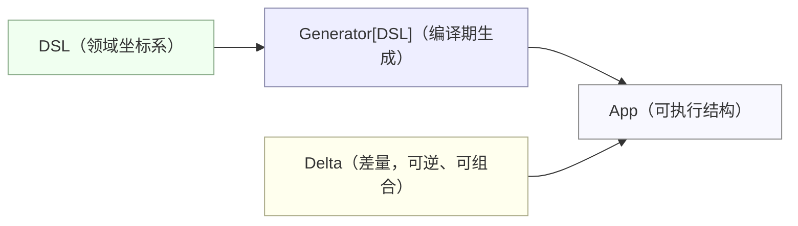
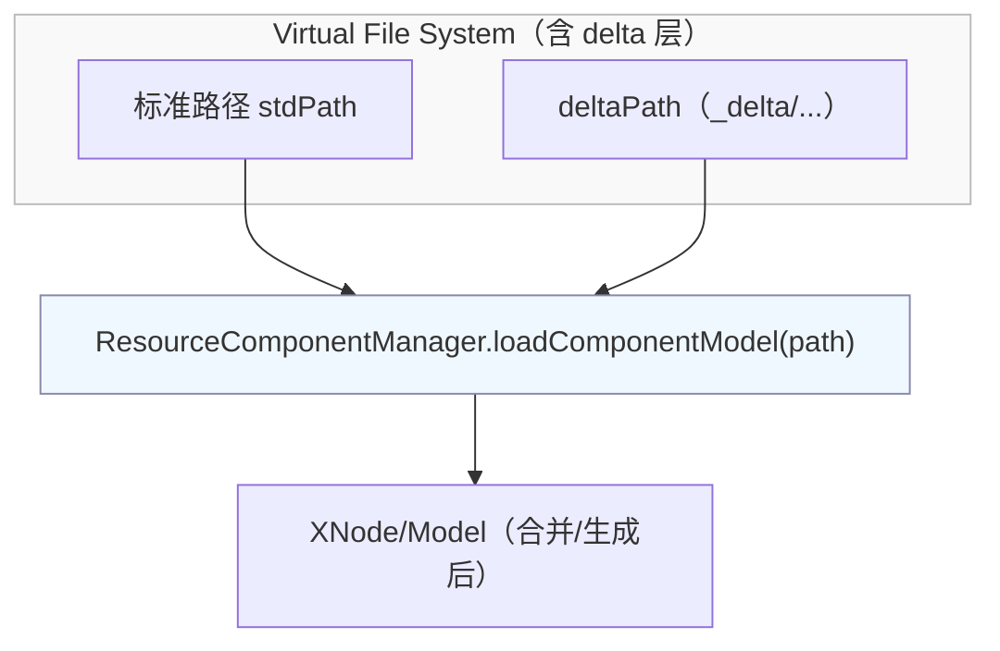
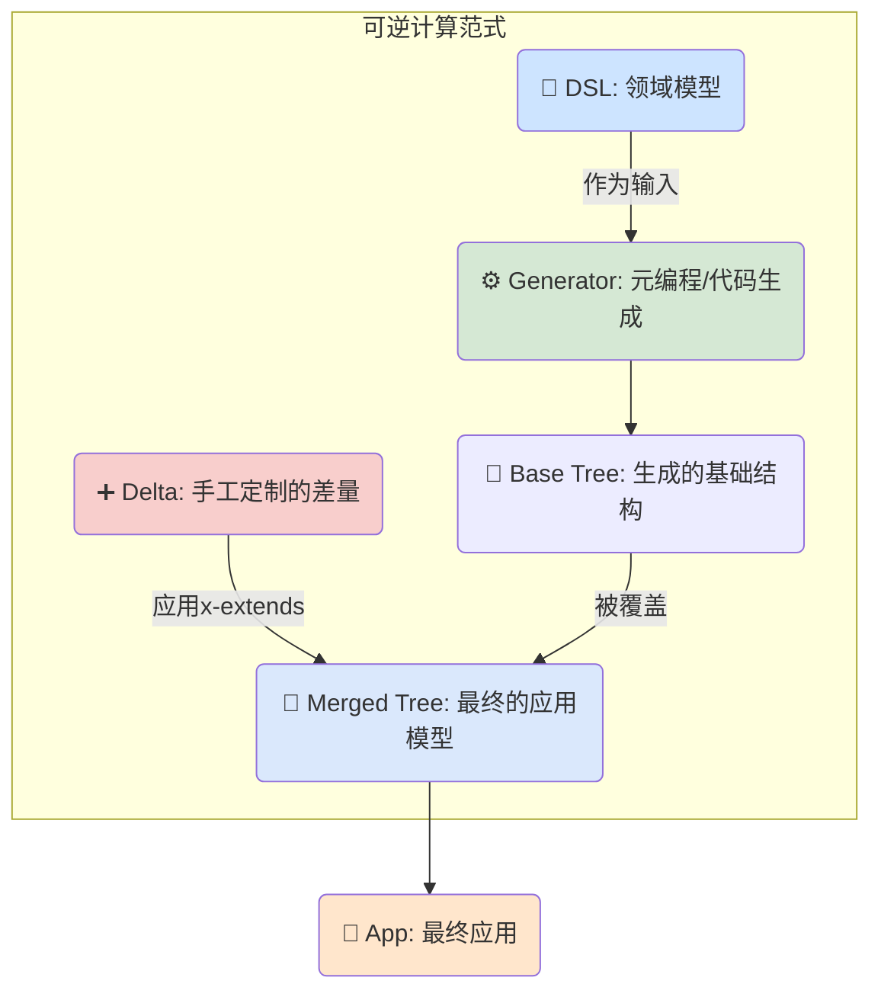

对以下同样内容的专栏文章进行评分，哪个更好，为什么


【文章1】
> generated by gpt5

# 当“语言”变成坐标与波：对 XLang 与可逆计算的系统性评论

> 这是一篇评论与解读文章。本文不是原文的复述，也不是官方宣传材料，而是面对一组文章所呈现的思想与工程实践，进行结构化的辨析与评价。

本文试图回答一个看似简单却常被误解的问题：XLang 为什么可以被称为一门创新的程序语言？答案并不在“引入了多少语法糖”，而在“重写了语言与软件构造的底层逻辑”：它把程序语言从“句法范式”提升为“结构空间的构造规则”，在语言级定义了“领域坐标系”和“差量（Delta）合并”，从而让 App = Delta x-extends Generator<DSL> 这种可逆计算范式具备了完整链路。换句话说，XLang 借助可逆计算，在工程上把“演化”变成可编程对象。

原文组中有许多关键论断与金句，极有洞见，亦不乏争议。本文将重排论证顺序，挑选最有价值的点做深挖，辅以代码/公式/简单图示，帮没有读过原文的读者迅速掌握其核心创新与边界条件，并提出对其全球原创性的评价（尤其注意，作者宣称核心理论与公式提出于 2007 年左右）。

---

## 一、第一性重定义：程序语言 = 结构空间的构造规则

作者的“金句”之一是对程序语言的重新界定：

> 一门程序语言定义了一种程序结构空间，程序语言是程序结构空间的构造规则。

这一句很值得细品。主流语言研究几乎都把“语言”当作“句法+语义+类型推断”的三件套，哪怕谈多范式（OOP+FP+Async+Meta），其落脚点也仍然是函数、表达式、类型的表达能力。但 XLang 的切入点是：语言定义了“能构造出怎样的结构空间”，以及“结构之间如何复合/演化”。这直接支撑起它后面三个有分量的动作：

- 从 Map 到 Tree：从短程（名称–值）提升到长程（树路径–局部/全局坐标），使“定位”和“合并”具备稳定坐标；
- 在语言级引入 Delta 合并（支持删除语义），让“演化”一等公民化；
- 把 DSL 当成“领域坐标系”，用 Generator 做多阶段编译，把“模型→模型”的链条变成语言内置能力。

这和以往“语言=可执行文本”的理解差之毫厘谬以千里：XLang 不仅能“执行”，更能“描述结构+定义变换”，并能在编译期完成绝大部分工作。这为它最核心的范式——可逆计算——铺好了路。

---

## 二、从 Map 到 Tree：结构维度提升与“删除语义”的回归

大多数面向对象语言中的“组合/继承/Trait”本质上都是 Map 上的名称叠加/覆盖：你可以把“类”理解为 Map（key=成员名，value=成员），“继承”就是 Map 覆盖。然而这种 Map 的延拓有两个痛点：

- Map 只有两层坐标（对象名+成员名），无法稳定定位“同类的特定实例的特定位置”，缺乏“领域坐标”；
- Map 覆盖普遍只支持“覆盖”，而对“删除”的支持在语言级失语（Scala Trait 不支持删掉父类成员；Java/C# 更不谈）。

XLang 的关键转折来自结构维度提升：Map → Tree。Tree 的每个节点有稳定路径（xpath/selector），这让以下两个看似朴素、工程上极难做对的能力成为可能：

- 在语义上稳定定位：/tasks/task[name='test']/@name 这类路径与业务语义对齐，“谁在何处”不再模糊；
- 在结构级实现“删除语义”：x:override="remove" 这种写法不是“运行时绕开”，而是“编译期消除”，使 Delta 合并具备逆元。

这看似是“文本工程”的小步，却是整个理论的转折。“删除语义”是可逆（reversible）的必要条件：没有逆元，只有幺半群（Monad），很难做系统级复用；而有了逆元，才具备“从 X 到 Y 的构建等价于直接作用一个 Delta”的可能。

代码层面，非常直观：

```xml
<!-- 在 delta 目录覆盖基础 ORM，删除某字段，增加某字段 -->
<orm x:extends="super">
  <entity name="bank.BankAccount" className="mybank.BankAccountEx"  >
    <columns>
      <column name="refAccountId" code="REF_ACCOUNT_ID" sqlType="VARCHAR" length="20" />
      <column name="phone3" x:override="remove" />
    </columns>
  </entity>
</orm>
```

这背后的结构逻辑是：

- 先“升维”到 Tree（节点具有稳定领域坐标）；
- 再在 Tree 上定义 Delta 合并，且合并满足结合律；
- 同时允许“有/无”的混合，保证可逆（删除是独立语义，而不是“不给用”的遮蔽）。

评论：这一步的美在于“把你平时想做却做不稳的动作（微调/删减）变成语言内置且可组合的”。这不是“语法糖”，而是“语义奠基”。

---

## 三、可逆计算：App = Delta x-extends Generator<DSL>

作者的另一个金句是把软件构造成了一个精炼的公式：

```
App = Delta x-extends Generator<DSL>
```

它定义了三件事：

- DSL：领域坐标系（你在什么空间里描述业务）；
- Generator：多阶段编译（编译期的模型→模型/代码生成，最好是图灵完备的编译期空间）；
- Delta：差量（含删除语义，合并满足结合律），作为复用与演化的一等公民。

这一范式带来的效果是“把编译期空间打开”，允许你在“语义空间（DSL）”和“结构空间（XNode）”之间做可逆变换/差量组合，把“变更”从运行期、二进制、甚至 Git 行差异，提升到“领域结构的稳定坐标系统”之上。

我们用一个极简的 mermaid 图来描绘这一过程：



这套范式的不少部分在工程界早有影子：

- Docker：基于差量文件系统（OverlayFS）的“结构叠加”，每层独立可分发（镜像=Delta 层 + 基层）。
- Kustomize：对 Kubernetes YAML 的战略性合并（定制化无侵入）。
- GraphQL type extension：类型扩展（但常停留在类型层，缺少统一的结构层 Delta 合并）。
- FOP/DOP/XVCL：早期学术界关于“特征/差量”编程的探索（见后文对比）。

XLang/可逆计算的特点是将这些散落的点“钉”成一个内核：用“结构层”的 Delta+Tree+坐标系把这些事情一把兜住，并且落成语言能力。它不是“有个工具”或“有个插件”，而是“语言+编译期”的整体。

---

## 四、语言三件套：XDef、Xpl、XScript，不是“写代码”，而是“写生成代码的代码”

为了让上面的公式落地，XLang 给了三件标准工具：

- XDef：元模型定义语言（同态、易读），本质是“用与模型同构的结构描述模型”，像 JSON Schema 的进阶版；
- Xpl：XML 模板语言（图灵完备），擅长编译期输出 AST（XNode），支持宏与标签库扩展，输出模式支持保留源位置（调试/断点/SourceMap 友好）；
- XScript：脚本表达式语言（近 JS 语法，含类型扩展），与 Xpl、宏协同。

这三者配合，做到了编译期就能“理解并变换结构”。例如 Xpl 宏隔离 AST 的例子非常直观：

```xml
<macro:script>
  import test.MyModelHelper;
  let validatorModel = MyModelHelper.parseValidator(slot_default);
  // 编译期生成 AST（而非运行期拼文本）
  let ast = xpl `
     <c:ast>
        <c:script>
          BizValidatorHelper.runValidatorModel(validatorModel,obj,svcCtx);
        </c:script>
     </c:ast>
  `;
  return ast.replaceIdentifier("validatorModel",validatorModel);
</macro:script>
```

评论：在典型的“模板语言”里，生成结构是易错且难调试的；在 Xpl 中，输出模式使用 node 时能携带源位置，生成的是 XNode AST，这把“模板=文本”提升为“模板=结构变换器”。这非常接近 Lisp 宏的“同像性”，但在 XML 的实用主义世界里落到了地面。

---

## 五、DSL 森林：统一元模型、统一差量、统一 Loader

作者反复强调“不是一个 DSL，而是 DSL 森林”。这句话的价值在于——它把“多 DSL 共存”的可操作性补齐了三件事：

- 统一元模型（XDef）：让 DSL 描述自洽且可被 IDE 动态支持；
- 统一差量（XDSL 的 x:extends/x:gen-extends/x:post-extends）：让分解/合并/定制具有统一语义；
- 统一 Loader：让“加载=编译=生成=合并”成为一个抽象，并内建“delta 层”。

上手的示例在 Spring 和 Mybatis 的“无侵入 Delta 定制”上非常典型：你不用改 Spring/Mybatis 引擎，只是把原来“读取 XML”的函数换成 ResourceComponentManager.loadComponentModel(path)，让它在“虚拟文件系统”的 delta 层里做扩展/合并/生成。这个“Loader as Generator”值得单独画个图：



评论：这里“补齐 Loader 抽象”的意义被很多人低估。它相当于为可逆计算提供了“服务端口”——你不需要重写引擎，只需换一个“加载”口子，就把 Delta 与 Generator 接了进去。工程落地的难点被大幅缓释。

---

## 六、可扩展性与“坐标路径”的统一解：类型不是坐标，Tree 是

作者对“类型系统不是合格的坐标系”的批评非常到位：类型表达的是“同形约束”，而可扩展性需要的是“唯一定位”。比如“页面上第 2 个按钮的 label”这样的需求，类型系统无法在多个对象实例中指指点点，而 Tree 的 xpath/selector 天生就是“绝对坐标”（全局路径）与“相对坐标”（子树路径）的统一。

同时，作者强调 Tree 的另一个价值：父节点可以作为控制节点向下传播属性/操作，这是大型编排的需要（DSL 之间的元编程、多阶段推导、条件开关 feature:on/off 亦收束于此）。

评论：类型与坐标的错位是很多“配置化可扩展性”的根源问题。XLang 的“Tree+坐标”给了一个统一补丁，逻辑上、自洽上都站得住。

---

## 七、工程对照：Git/Docker/SpringBoot/Kustomize/GraphQL type extension

评论文章必须做横向对照，才能看出“新”的边界。我们简要概括作者的典型对照观点，并附上评论。

- Git 的差量是“行文本空间中的差量”。它不满足“稳健坐标+结合律”：Patch 绑基线、冲突后插入标记破坏结构、无法离线合并多个 patch。结论：Git diff 适合“人读代码”，不适合“结构可计算的演化”。

- Docker 的差量是“文件系统空间中的差量”。OverlayFS 的白洞（Whiteout）是逆元语义的工程化。差量可复用、可合并、可分发，满足结合律。镜像是独立的“差量切片”——这正是“差量一等公民”的最典型成功工程案例。

- SpringBoot 的条件装配（@ConditionalOnProperty etc.）与自定义命名空间（NamespaceHandler）是“对象层”的编织，往往破坏声明式装配的自洽性；XLang 则把这件事放在“结构层”，统一为 x:gen-extends/x:extends/feature:on，语义清晰、可组合。

- Kustomize 是“YAML 的差量化定制”。与 XLang 非常接近，可视为可逆计算在部署 DSL 领域的实例。XLang 的价值是把这种能力**统一化**、**语言化**到所有 DSL 上。

- GraphQL type extension 提供了“类型层的差量”，但仍停在类型层，离“结构层的复杂合成”和“跨 DSL 粘接”尚有距离。

评论：这些对照很有说服力——不是“你没见过的形态”，而是“把你知道的散点和局部模式联合起来，提升到结构层并统一成语言抽象”。在工程方法论上，这是从“写适配器”到“写生成器+合并器”的代代升级。

---

## 八、删除语义、结合律与逆元：数学正确性与工程可用性

作者在文章中做了几段数学上的“必要性证明”，尤其关于“结合律为何重要”、“逆元如何引入删除语义”，这里我们用通俗话总结：

- 结合律意味着可以“先局部合并，再整体组合”，这是“局部优化/可复用”的必要条件。没有结合律，你没法离线合并 patch，没法用预合并的 delta 来组装多个目标；
- 逆元（删除语义）意味着“通过增加实现减少”，这使“系统级复用”成为可能（X + (-C + D) 就是“删 C 加 D”）。没有逆元，你只能“尽可能增加”，很快积木搭成乱七八糟的大厦；
- 幂等删除（Delete*Delete=Delete）与群结构冲突，这在工程层面要承认“我们运行在一个缺少逆元公设的近似群”，但这不妨碍“差量合并”作为结构运算仍满足结合律与封闭性。

评论：这些细节并非“数学炫耀”，而是工程边界清晰化的基础。作者不像不少“讲理念”的文章那样停留口号，而是把“你为何能合并/能复用/能逆算”的数学依据交代明白。这让“可逆计算”从旗语变成术语。

---

## 九、方法论维度：从还原论转向场论，活动标架与 DSL 内禀坐标

作者的物理学背景在文本里随处可见，核心是一个转向：从“组件（刚体）嵌套”的还原论转到“场（坐标系+局部变化）”的视角。活动标架、微分流形、声子的比喻都在强调同一件事：

- 把“自由度无限的系统”用“局部坐标+变换规律”结构化；
- 让“动态变化”和“结构运算”成为一等公民；
- 把“演化”重构为一种可编程形态。

评论：这些比喻对工程师有启发意义，但也容易造成误解。本文提醒读者：把比喻当比喻，切忌“学术术语搬家式理解”。XLang 的贡献不是“宣讲物理哲学”，而是“在工程上把活动标架变成可用的 Loader+XDef+Xpl+Delta”。

---

## 十、与国际研究的脉络：FOP、DOP、XVCL、MPS、BX

对于全球原创性的评估，最容易被问的是“这不就是 XXX 吗”。评论的公平性在于既要指出渊源，也要指出超越。

- FOP（Feature-Oriented Programming）：把“特征（Feature）”作为组合单位，早期版本缺少删除语义、统一结构层合并规则。FeatureHouse 等工作开始语言无关的树合并，但停在“工具/框架”，没进入语言层的“内建 Delta”。
- DOP（Delta-Oriented Programming）：引入 Delta 并且包含删除语义，DeltaJ 等原型证实可行。但 DOP 更偏“面向编程语言语义的差量”，缺少“统一到 Tree 的结构层”，也缺少“内置多阶段编译/Loader/坐标系”这类全链路基建。
- XVCL/Frame Technology：更像增强的模板/预处理器，“录制变化”为单步动作序列，不具备严密的结构层 Delta 合并，不擅长可逆+合并+稳定坐标。
- JetBrains MPS：强调“语言工作台”，图形化/结构化编辑器优秀。XLang 与之类似的地方是“先发明 DSL 再用 DSL 写业务”，不同在于 XLang 把 Delta 合并作为语言内核，并且强调“编译期元编程+结构层操作”，有统一的 XDef/Xpl/XScript 三件套。
- Bidirectional Transformations（BX）：学术界关于“正向/反向一致的变换”的大量研究，与可逆变换精神相通。XLang 把“可逆/差量/结构层”做成工程工具链，给 BX 一个新的可落地框架。

评论结论：XLang/可逆计算不是凭空出现，它整合并推进了 FOP/DOP 等差量思想，并把“结构层+多阶段编译+统一 Loader+Delta 合并”一体在工程层落成。作者声称 2007 年提出核心理论，这和学术界 DOP（约 2010 年）时间上相互交叠，具体史实可由后续论文与开源记录交叉印证。就“整体化语言内核”的完整度而言，XLang 在工程化上是少见的。

---

## 十一、落地与边界：优势、风险与工程注意事项

本文不是宣传稿，必须谈局限。把本文前面的肯定置于以下边界条件下，更利于组织做判断。

优点（简要）：

- 结构层 Delta，删除语义可逆，合并满足结合律，难做的“删减复用”可行化；
- 多阶段编译（Generator<DSL>），把编译期空间打开；DSL 森林内的模型→模型→页面/服务链路清晰；
- 统一 Loader 抽象，“外挂式”增能第三方引擎（Spring/Mybatis 等的 Delta 定制无侵入）；
- Xpl 输出 AST、保留源码位置，调试友好（弥补模板语言的“黑箱生成”痛点）；
- 可逆定制能把“定制化开发的熵”隔离在 delta 层，不污染基础产品（ToB 场景利器）。

风险与边界（必须诚实面对）：

- 学习曲线：XML/XDef/Xpl/XScript 的组合对团队是新范式，不是写两个装饰器那么简单；
- 工具生态：作者提供了 IDEA 插件、dump、watch，但相比主流语言生态仍偏小众（不过可正反馈演进）；
- 性能误解：结构层合并处在编译期，运行期无成本；但如果模型编译频繁、delta 层过多，工程治理要跟上（缓存、失效、编译时长控制）；
- 团队协作：delta 不受基线约束（这是优点），也会带来“同一坐标多 delta 合并的治理”，工程规范需上；
- 边缘场景：并非所有变更都适合结构层 delta；对“强运行时动态”的系统（如数据驱动 CFG）需要混合方法（作者已提供运行时延迟编译/即时编译与 Loader 的组合方案）；
- 文件体积与可读性：大量 XML 对一些团队有“心理负担”，虽然 XDef 的同态性减轻了复杂度，但仍需用差量/宏/生成器减少重复。

落地建议（供组织参考）：

- 从“Loader 切入”：先改“加载”，把模型加载换成 ResourceComponentManager，最小成本体验 Delta 定制；
- 拆分 pipeline：按 App = Delta x-extends Generator<DSL> 把链路拆成几步，每步都可独立测试（尤其围绕 ORM→XMeta→XView→XPage）；
- 治理 delta 层：定义层命名、合并顺序、冲突策略、dump 审查、IDE 提示；
- 用 Xpl 输出 AST，而非字符串拼接，尽量保留源位置信息；
- 标记 feature:on/off 条件，尽量把条件逻辑在编译期消化；
- 文档化“领域坐标系”：明确“坐标（XSelector/xpath）”是协作语言，团队对坐标理解越统一，Delta 合并越稳。

---

## 十二、AI 时代的意义：生成-修正-合并的一致框架

一个现实问题：当下 LLM 广泛参与“生成代码/配置/页面”。可控性与可演化性成为关键。可逆计算+XLang 给了一种可能的闭环：

- 生成（Generator<DSL>）：模型驱动生成骨架；
- 修正（Delta）：LLM/人类在领域坐标系上添加/删除/微调；
- 合并（x-extends）：结合律可复用，统一合并策略；
- 追踪（XNode 源位置）：把 LLM 修改与源位置绑定，调试/回溯友好。

评论：AI 时代，结构层 “diff/merge” 比文本层“diff/patch”更值得押注。XLang 是合理的载体。

---

## 结语：总体评价与全球原创性

综合全文，我给出以下评论结论。

- 理论完整性：可逆计算范式（App = Delta x-extends Generator<DSL>）在数学/工程两个层面都较为自洽，把“结构层差量+多阶段编译+领域坐标系”组成了一个可落地的闭环。这不是单点创新，是“一组工具”支撑“一套范式”。

- 工程可用性：统一 Loader 抽象、Xpl 输出 AST、XDef 同态元模型等，让“理论不是口号”，而成为“改一个加载口就用起来”的实操路径。这一点在 Mybatis/SpringBeans 差量定制和 DSL 森林的跨模型 pipeline 上表现突出。

- 全球原创性：以“结构层 Delta 合并（含删除语义）+ 统一 Loader + 多阶段编译 + 领域坐标系”为一体的语言级实现，横向对比 FOP/DOP/XVCL/MPS/Kustomize 等已有工作，具备明显的整合与推进。作者主张其理论提出约在 2007 年，与 DOP（2010 前后）时间相邻，在“理论-工程融合度”上，XLang 已走在比较靠前的位置。就“语言内核级”的整合与落地来看，有较强原创性。

- 风险清单：生态体量、团队学习曲线、delta 治理规范、编译期成本等，短期内仍需要在更多组织中验证与锤炼。

如果只允许用一句话给 XLang 下定义，我会用这句评论作结：

> XLang 不是“一个语言”，而是“把结构、坐标、差量、生成这四件事变回语言”的语言。它让“演化”有了坐标，让“删减复用”不再是 hack，让“多 DSL 作业”可合并可推理——这，才是编程语言的下一层。

---

## 附：文中引用的部分代码与公式

- 可逆计算公式

```
App = Delta x-extends Generator<DSL>
```

- Map → Tree 升维思路示意（示意，不是完整语法）

```xml
<!-- 在 Tree 节点上实现删除语义 -->
<column name="phone3" x:override="remove" />
```

- Loader 抽象伪代码

```javascript
function loadDeltaModel(path){
  rootNode = VFS.loadXml(path);
  for each node with x:extends attribute
      baseNode = loadDeltaNode(node.removeAttr('x:extends'));
      genNodes = processGenExtends(node);

      for each genNode in genNodes
          baseNode = new DeltaMerger().merge(baseNode, genNode);
      node = new DeltaMerger().merge(baseNode,node);

  processPostExtends(node);
  return node;
}
```

- 结合律与逆元（通俗版）

```
(A ⊕ B) ⊕ C = A ⊕ (B ⊕ C)
A + (-A) = 0
```

- Xpl 输出 AST 示例（编译期）

```xml
<macro:script>
  let ast = xpl `<c:ast><c:script>...</c:script></c:ast>`;
  return ast.replaceIdentifier("validatorModel",validatorModel);
</macro:script>
```

---

## 参考与拓展阅读建议

- Feature-Oriented Programming（FOP），FeatureHouse 等语言无关组件组合
- Delta-Oriented Programming（DOP），DeltaJ 等差量语言原型
- XVCL/Frame Technology：传统模板/预处理增强
- Bidirectional Transformations（BX）：双向变换理论
- Kustomize：Kubernetes 的结构化差量定制
- JetBrains MPS：语言工作台
- GraphQL type extension：类型层差量

本文评论覆盖的 XLang 技术族谱（XDef/Xpl/XScript/XDSL/Loader）与 Nop 平台实践，以及可逆计算理论，与这些工作相互参照，读者可更快厘清定位与边界。

最后，提醒读者：XLang 值得“试一次”，但更值得“按范式全链路地试一次”。它改变的不是你一处 API，而是你组织面对“演化”的方式。


【文章2】
> generated by gemini-2.5-pro

# 重构软件的宇宙观：对XLang及其可逆计算理论的批判性解读

在软件工程的浩瀚星空中，新的星辰（编程语言与理论）时常划过天际，但其中大多数不过是已有星座的微弱变体。然而，偶尔也会出现一颗奇特的星，它不仅自身明亮，更试图重绘我们赖以导航的星图。本文旨在对一系列阐述“XLang”语言及其背后“可逆计算理论”的文章进行一次深刻的审视与剖析。这些文章雄心勃勃，宣称XLang并非又一门“更好的Java”，而是一种全新的软件构造范式。作为一名长期的观察者与实践者，我的任务是拨开其哲学外衣，探究其技术内核，并以国际化的视野，审慎评估其在全球软件工程理论演进中的原创性与真实价值。

本文并非对原文的复述，而是以一位外部专家的视角，对其核心论点进行重新组织、辨析与批判。我将深入挖掘其“点睛之笔”，解构其创新主张，并以代码、图示和严谨的逻辑，为读者（即便未曾阅读原文）揭示这一理论的全貌，并最终给出一个客观公正的评价。

## 一、 软件构造的形而上学：从“粒子”到“场”的范式跃迁

在深入XLang的具体语法之前，我们必须首先理解其石破天惊的哲学起点。原文作者提出了一个精妙的论断：**“一门程序语言定义了一种程序结构空间，程序语言是程序结构空间的构造规则。”**

这句“金句”是理解XLang全部思想的基石。它将编程语言从具体的语法和语义规则，提升到了一个更抽象的维度——空间的塑造者。传统语言，无论是Java、C++还是Python，尽管语法各异，但它们塑造的“结构空间”在底层是惊人地相似的。这种空间，正如原文所批判的，是建立在“还原论”之上的。

### 1.1 传统世界的“粒子”隐喻

我们习惯于将软件组件、类、函数视为离散的、原子化的“粒子”。通过封装（将内部细节隐藏起来）和组合（像搭积木一样拼接），我们构建起庞大的软件系统。这种思维模式根深蒂固，它将软件世界描绘成一个由无数微小、坚固的刚体构成的机械宇宙。继承、组合、依赖注入等机制，无一不是在这个“粒子”模型下定义的相互作用力。

原文用一个极具洞察力的公式揭示了面向对象（OOP）继承的结构本质：

```
Map = Map extends Map
```

这里的`Map`并非指数据结构`java.util.Map`，而是一个抽象概念，代表一个类或接口——一个从名称到成员（属性、方法）的映射集合。`MySubClass extends MyBaseClass`在结构层面，无非是将两个`Map`叠加，子类的成员会覆盖父类的同名成员。

这种看似天经地D义的模式，在原文的审视下却暴露了其内在的局限性：

1.  **复用的不对称性**：我们可以轻易复用继承树的下层（基类），但**“面向对象并不直接支持复用继承树的上层！”**。例如，我们有两个类`MapX = Map2 extends Map1`和`MapY = Map3 extends Map1`，它们复用了`Map1`。但如果我们想将`Map1`这个“增量”应用到不同的基类上，如`MapX' = Map1 extends Map2`和`MapY' = Map1 extends Map3`，在许多语言中是极其笨拙甚至无法实现的。这揭示了传统继承中，“增量”与“基底”的身份是固化的、不对称的。Scala的`Trait`机制在一定程度上解决了这个问题，它将“增量”明确地表达出来，使其可以被独立复用：`type MapX = Map1 with Map2`。

2.  **钻石问题（Diamond Problem）**：当一个类从两条路径继承自同一个基类时，例如`MapX = MapA extends MapB, MapC`，而`MapB`和`MapC`都继承自`MapD`，那么`MapX`中来自`MapD`的成员应该如何合并？C++为此付出了巨大的复杂性代价，而Java则直接禁止了多重类继承。这本质上是“粒子”模型在处理复杂的结构融合时遇到的障碍。

### 1.2 XLang的“场”论世界观

与“粒子”模型相对的，是物理学中的“场”模型。原文巧妙地借用了这个比喻：**“物理世界中存在着另一种构造方式，那就是波。波是连续存在的模式，通过干涉叠加来构造世界。”**

这正是XLang试图引入的全新宇宙观。在这个世界里，软件结构不再是孤立的粒子，而是浸泡在一个无所不在的“场”中。这个“场”是什么？它是一个全局的、稳定的**坐标系**。一旦有了坐标系，我们就可以在任何一点上施加一个“扰动”——也就是**差量（Delta）**。

这个从“粒子”到“场”的转变，是理解XLang创新性的核心。它意味着：

*   **从离散扩展到连续扩展**：传统的插件或扩展点机制，就像在坚固的组件上预先钻好的孔，我们只能在这些“离散”的位置进行扩展。而在XLang的“场”模型中，**任何一个有坐标的结构元素都是一个潜在的扩展点**。这种扩展能力是“连续”且无处不在的。
*   **从封装到透明**：粒子模型强调封装（黑箱），我们不关心其内部构造。场模型则要求结构在坐标系下是“透明”的，我们必须能“看到”并“定位”到内部的每一个细节，才能精确地施加差量。
*   **从组合到叠加**：粒子通过接触和刚性连接进行组合。而差量则是通过类似波的干涉和叠加来改变系统。一个差量可以增强（相长干涉）或削弱甚至移除（相消干涉）原有结构。

这个哲学层面的跃迁，是XLang所有技术创新的源头。它用一个统一的、基于坐标的差量叠加模型，取代了传统软件工程中各种零散、特设的扩展机制。

## 二、 核心抽象的升维：从Map到Tree的结构革命

如果说从“粒子”到“场”是XLang的哲学纲领，那么从`Map`结构到`Tree`结构的升维，就是其实现这一纲领的技术核心。

传统的高级语言，即使引入了泛型元编程（如C++模板），其结构构造的极限可以被概括为：

```
Map = Map extends Map<Map>
```

这个公式代表了什么？一个类（`Map`）可以继承自另一个类（`extends Map`），这个基类本身又可以是一个模板类（`Map<Map>`），其行为由模板参数（另一个`Map`）来定制。这基本上涵盖了从OOP继承到泛型、模板元编程的精髓。Unruh在1994年用C++模板在编译期计算质数，震惊了世界，证明了`Generator<Map>`的图灵完备性。这似乎已经是结构构造的极限。

但XLang认为，这个“宇宙”的维度还不够高。它将基本结构单元从`Map`提升到了`Tree`，从而将构造公式推广为：

```
Tree = Tree x-extends Tree<Tree>
```

初看之下，这似乎只是一个简单的替换。`Tree`不过是嵌套的`Map`而已（`Tree = Map + Nested`），这难道不是一种文字游戏吗？任何对`Tree`的操作，不都可以分解为对每一层`Map`的操作吗？

原文给出了一个关键的回答：**整体大于部分之和**。在更复杂的`Tree`结构上建立的软件结构空间，其构造规律并不能简单地归约到以`Map`为基础的软件结构空间。这其中的关键差异，正是前文提到的**坐标系**。

### 2.1 Tree：内禀的坐标系

一个`Map`结构只提供了一个两级的、局部的坐标系：`Map`本身的标识符，以及`Map`内部成员的键（key）。例如，在Java中，我们能定位到`com.example.MyClass`，然后定位到其成员`myField`。但我们无法用一种标准、稳定的方式定位到`myField`这个`List<String>`类型中的第二个元素。

而`Tree`结构，特别是被赋予了唯一标识的`Tree`结构，天然就提供了一个全局的、稳定的坐标系。这个坐标系，在XML世界中我们称之为**XPath**。

```xml
<!-- 一个简化的UI定义 -->
<Dialog id="user-dialog">
    <title>User Information</title>
    <body>
        <Form id="user-form">
            <field name="username" type="text" />
            <field name="password" type="password" />
        </Form>
    </body>
    <actions>
        <Button id="submit" label="Submit" />
        <Button id="cancel" label="Close" />
    </actions>
</Dialog>
```

在这个结构中，每一个元素和属性都有一个唯一的路径，例如：

*   提交按钮的标签：`/Dialog[@id='user-dialog']/actions/Button[@id='submit']/@label`
*   用户名字段：`/Dialog[@id='user-dialog']/body/Form[@id='user-form']/field[@name='username']`

这个坐标系是**稳定**的。只要我们约定列表中的同级兄弟节点必须有一个唯一键（如`id`或`name`），那么在列表中间插入或删除一个节点，不会影响其他节点的坐标。这与React/Vue要求`v-for`循环中的元素必须有唯一的`key`是异曲同工的。

这个看似简单的从`Map`到`Tree`的转变，其深远意义在于：

> **通过将软件的核心结构模型从无坐标的`Map`提升到有内禀坐标系的`Tree`，XLang为实现普适、精确的差量运算奠定了基础。**

没有坐标，差量就无处落脚。有了坐标，系统中的任何一个角落都可以被精确地“定点打击”。

### 2.2 x-extends：Tree结构上的差量微积分

在`Tree`坐标系的基础上，XLang定义了`x-extends`这个核心的差量合并算子。它与传统的`extends`有着本质区别：

1.  **作用域**：`extends`作用于`Map`（类），而`x-extends`作用于`Tree`（整个模型文件）。
2.  **精确性**：`extends`是粗粒度的覆盖，而`x-extends`可以借助坐标系实现细粒度的、递归的合并。
3.  **可逆性**：`extends`只有“加法”，而`x-extends`引入了“减法”（逆元）。

让我们通过一个例子来理解`x-extends`。假设我们有一个基础的UI定义`base.page.xml`：

```xml
<!-- base.page.xml -->
<Page title="Base Page">
    <Form id="main-form">
        <field name="A" label="Field A"/>
        <field name="B" label="Field B"/>
    </Form>
</Page>
```

现在，我们想创建一个定制化页面`custom.page.xml`，要求：
1.  修改页面标题。
2.  在表单中删除字段A。
3.  在表单中增加字段C。
4.  修改字段B的标签。

使用XLang，`custom.page.xml`可以这样写：

```xml
<!-- custom.page.xml -->
<Page x:extends="base.page.xml" title="Customized Page">
    <Form id="main-form">
        <field name="A" x:override="remove" />
        <field name="B" label="Field B New Label" />
        <field name="C" label="Field C" />
    </Form>
</Page>
```

当XLang的加载器处理`custom.page.xml`时，会发生以下`x-extends`合并过程：

1.  加载`base.page.xml`作为基础`Tree`。
2.  递归地将`custom.page.xml`的`Tree`叠加到基础`Tree`上。
3.  合并规则：
    *   **属性合并**：默认是覆盖。`custom.page.xml`中的`title`属性覆盖了`base.page.xml`的`title`。
    *   **节点合并**：
        *   通过唯一键（如`id`或`name`）匹配节点。`Form[@id='main-form']`和`field[@name='B']`被匹配到。
        *   对于匹配到的节点，递归进行合并。所以`field[@name='B']`的`label`属性被更新。
        *   **`x:override="remove"`**：这是一个关键的“逆元”指令。它使得`field[@name='A']`从最终的合并结果中被移除。
        *   **新增节点**：`custom.page.xml`中存在但`base.page.xml`中不存在的节点（如`field[@name='C']`）被直接添加。

最终，加载`custom.page.xml`得到的内存中的`Tree`结构等价于：

```xml
<Page title="Customized Page">
    <Form id="main-form">
        <field name="B" label="Field B New Label" />
        <field name="C" label="Field C" />
    </Form>
</Page>
```

这个过程完美地诠释了**“通过增加（一个Delta文件）来实现减少（删除已有功能）”**的思想。`x-extends`算子及其`x:override`指令，共同构成了`Tree`结构空间上的“差量微积分”。

## 三、 演化的引擎：可逆计算的核心公式 App = Delta x-extends Generator<DSL>

现在，我们可以完整地解构XLang背后的核心理论——可逆计算提出的通用软件构造公式了：

```
App = Delta x-extends Generator<DSL>
```

这个公式不仅是一个理论模型，更是一个可操作的工程蓝图，指导着基于Nop平台的软件开发实践。



让我们逐一剖析这个公式的每个组成部分：

### 3.1 DSL: 领域坐标系的建立者

正如前文所述，精确的差量运算需要一个稳定的坐标系。但在通用编程语言（如Java）的AST（抽象语法树）上建立坐标系是困难的，因为其结构过于通用，与业务语义的关联不稳定。一个业务需求的微小变化，可能导致代码中多个不相关位置的大量修改。

可逆计算的解决方案是：**不要直接用通用语言对业务建模，而是先为业务领域设计一门领域特定语言（DSL）**。

> **“有用的特征都是分布式的（distributed）。”**

这句引自原文的话，深刻地揭示了为什么需要DSL。一个业务特征（如“支持多币种结算”）会像涟漪一样扩散到系统的各个层面（数据库、后端逻辑、前端UI）。如果用通用语言来表达，这个特征的实现会散落在无数个文件中。但如果在一个精心设计的“金融交易”DSL中，它可能只是一个配置项或一个简单的结构声明。

**DSL的作用，就是创建一个“内禀坐标系”，使得业务层面的变化能够在这个坐标系中被局部化、最小化地表达。**

在Nop平台中，开发一个DSL的成本被降到极低。核心工作就是编写一个**XDef**元模型文件。

### 3.2 XDef：同态的元模型语言

`XDef`是XLang家族中用于定义DSL语法的元语言。它取代了繁琐的XSD，其设计哲学是**同态（Homomorphic）**的：元模型的结构与它所要约束的模型的结构几乎完全一样。

例如，要定义一个状态机DSL `state-machine.xml`的语法，其XDef文件`state-machine.xdef`会长这样：

```xml
<!-- state-machine.xdef -->
<state-machine x:schema="/nop/schema/xdef.xdef">
    <!--
        !var-name: 表示id属性是必须的(!), 且格式为变量名(var-name)
        xdef:unique-attr="id": 表示<state>节点列表中的元素以id属性作为唯一标识
    -->
    <state id="!var-name" displayName="string" xdef:unique-attr="id" />

    <!--
        xdef:value="xpl": 表示<on-exit>节点的内容是Xpl模板语言
    -->
    <on-exit xdef:value="xpl" />
</state-machine>
```

这种“所见即所得”的元模型定义方式，极大地降低了DSL的设计门槛。一个有趣的细节是，`state-machine.xdef`文件本身也由一个XDef文件来约束，即`x:schema="/nop/schema/xdef.xdef"`。而`xdef.xdef`最终是由它自己来约束，形成了一个完美的逻辑闭环。这体现了理论的自洽与优雅。

一旦定义了XDef，Nop平台的基础设施就能自动提供：
*   DSL解析器和验证器。
*   IDE中的语法高亮、自动补全、错误检查和链接跳转。
*   （未来）基于元模型的可视化编辑器。

### 3.3 Generator：编译期的演化引擎

`Generator`在公式中代表了从DSL生成基础结构的过程。这是通过XLang的**元编程（Meta Programming）**能力实现的。与Lisp的宏类似，但XLang提供了更系统、更贴近工程实践的机制。

**1. Xpl/XScript：为代码生成而生的模板与脚本**

XLang没有复用Freemarker或Velocity，而是设计了`Xpl`（模板语言）和`XScript`（脚本语言）。其关键创新点在于：

*   **同像性（Homoiconicity）**：Xpl本身是XML格式，它处理和生成的也是XML（或更准确地说是`XNode`树）。这使得编写生成代码的代码变得像操作数据一样自然。
*   **结构化输出（`outputMode=node`）**：这是与传统文本模板语言的根本区别。Xpl可以直接生成`XNode`对象，这个对象完整地保留了**源代码位置信息**。这意味着，经过多层代码生成后，我们依然可以精确地追溯到最终结果的每一部分最初源于模板的哪一行。这对于调试和错误定位是革命性的，彻底解决了传统代码生成器（如JPA的实体生成）产生的代码难以调试的问题。

**2. `x:gen-extends` 和 `x:post-extends`：内置的生成器挂钩**

任何一个XDSL文件都可以包含`<x:gen-extends>`和`<x:post-extends>`节点。这两个节点的内容是Xpl模板，它们会在模型加载时被执行，动态地生成`XNode`树。

```xml
<model x:extends="A,B">
   <x:gen-extends>
      <C/>
      <D/>
   </x:gen-extends>
   <x:post-extends>
      <E/>
      <F/>
   </x:post-extends>
   <!-- 自身的节点内容 -->
</model>
```

当加载这个`model`文件时，Nop平台的加载器会执行一个严格定义的合并序列：

`F` -> `E` -> `model自身内容` -> `D` -> `C` -> `B` -> `A`

（这里的`->`代表`x-extends`操作，即左侧的Delta叠加在右侧的Base之上）

这个机制非常强大。例如，我们可以从一个高度抽象的业务模型（如一个Excel文件描述的ORM模型）出发，通过`x:gen-extends`中的一个`Generator`标签，自动生成一个非常详细的、符合ORM引擎要求的`app.orm.xml`基础结构。

### 3.4 Delta：无处不在的精细化定制

`Delta`在公式中代表了对`Generator<DSL>`生成结果的差量化修正。在上面的例子中，`model`文件自身的内容，以及`x:post-extends`中生成的内容，都扮演了`Delta`的角色。它们在`Generator`生成的基础结构之上，进行精细化的增加、修改和删除。

这套 `DSL -> Generator -> Delta` 的流水线，形成了一个多阶段、可演化的软件生产线。与传统的、一次性的代码生成（“scaffolding”）不同，这条生产线是**活的**：

*   当上游的DSL（如Excel模型）发生变化时，`Generator`会重新运行，生成新的基础结构。
*   下游的`Delta`（手工修正部分）会自动重新叠加到新的基础之上。

只要`Delta`所作用的坐标点在新生成的基础结构中依然存在，整个演化过程就是自动且无损的。这解决了传统模型驱动开发中，手改代码和自动生成代码难以共存的根本性难题。

## 四、 案例研究：与现有技术的批判性对比

为了更深刻地理解XLang的独创性，有必要将其与现有的一些主流技术进行对比。

### 4.1 Docker与Git：差量空间的质量差异

原文中有一个非常精彩的辨析，即Docker和Git虽然都使用了差量技术，但其差量的“质量”有着天壤之别。

*   **Git的差量空间**：是**行文本空间**。它的坐标是**行号**，这是一个非常**不稳定**的坐标系。在文件开头插入一行，后面所有行的坐标都会漂移。这导致Git的`patch`严重依赖于上下文（相邻行内容），并且与特定的Base版本强绑定。两个独立的`patch`文件无法在脱离Base的情况下可靠地合并。它的差量运算不满足**结合律**。
*   **Docker的差量空间**：是**文件系统空间**。它的坐标是**文件路径**，这是一个**稳定**的坐标系。增删一个文件不会影响其他文件的路径。这使得Docker的每一层镜像（Delta）都可以独立存在、分发和管理（如在Docker Hub上）。更重要的是，Docker的差量合并（OverlayFS）就是一个简单的覆盖操作，它满足**结合律**，这使得镜像的构建过程非常稳健和自动化。

> **结论**：差量的价值，很大程度上取决于其所定义的“结构空间”的质量。一个拥有稳定坐标系和良好代数性质（如结合律）的差量空间，远比一个不稳定的空间更有价值。XLang通过引入基于唯一键的`Tree`结构，构建了一个高质量的差量空间。

### 4.2 Spring Framework：声明式外衣下的命令式内核

Spring框架以其声明式的IoC容器和AOP机制著称。但正如原文所批判的，随着SpringBoot的演进，其声明性正在被逐渐侵蚀。`@Conditional`注解、`BeanPostProcessor`、各种`Aware`接口，使得Bean的最终装配结果依赖于一个复杂的、隐晦的运行时执行序列。改变类扫描的顺序，就可能改变最终的结果。

如果用XLang的理念来重塑Spring的Bean配置，会是怎样的景象？

```xml
<!-- my-app.beans.xml -->
<beans x:schema="/nop/schema/beans.xdef" x:extends="base.beans.xml">
    <!-- 仅在特性'my-feature.enabled'开启时，此bean才存在 -->
    <bean id="myFeatureBean" class="com.example.MyFeatureBean" feature:on="my-feature.enabled" />

    <!-- 继承base.beans.xml中的dataSource，并覆盖其poolSize属性 -->
    <bean id="dataSource">
        <property name="poolSize" value="50" />
    </bean>

    <!-- 从base.beans.xml中移除某个不需要的bean -->
    <bean id="unwantedBean" x:override="remove" />
</beans>
```

在这里，所有的条件逻辑（`feature:on`）、继承（`x:extends`）、覆盖和移除（`x:override`）都在**模型加载期**通过统一的、语言无关的Delta运算完成。最终送入NopIoC运行时引擎的，是一个纯粹的、无条件的、扁平化的Bean定义列表。运行时引擎的逻辑因此可以被极大地简化，并且整个装配过程的结果是完全确定的、与加载顺序无关的。

这深刻地体现了XLang的核心设计哲学：**将复杂性（尤其是与演化和定制相关的复杂性）尽可能地压缩到编译期（或加载期）解决，从而保持运行时的纯粹与高效。**

### 4.3 FOP/DOP：学术界的先行者与可逆计算的超越

在学术界，面向特征编程（FOP）和面向差量编程（DOP）是与可逆计算思想最为接近的理论。

*   **FOP (Feature-Oriented Programming)** 关注于将软件功能（Features）映射到代码结构上，并实现功能的组合。它也认识到了树形结构的合并（Superimposition）的重要性。
*   **DOP (Delta-Oriented Programming)** 在FOP的基础上，明确引入了“差量”和“删除”操作，使其更接近可逆计算。

然而，可逆计算理论在几个关键点上超越了它们：

1.  **Generator的整合**：FOP/DOP主要关注`App = Delta + Base`。而可逆计算的`App = Delta x-extends Generator<DSL>`公式，将产生式编程（`Generator`）作为了与`Delta`同等重要的核心构件，形成了一个更完整的、从高级抽象到具体实现的端到端构造理论。
2.  **坐标系的明确化**：虽然FOP/DOP也处理树结构，但可逆计算更加明确和系统地强调了**领域坐标系**的核心地位，并将其与DSL设计紧密结合。
3.  **理论的普适性**：FOP/DOP通常被视为软件产品线（Software Product Line）工程的一种实现技术。而可逆计算则将自身定位为一个更基础的、普适的计算理论，其应用范围可以从软件构造延伸到数据处理、AI模型等任何可以用结构化方式描述的领域。其理论根基植根于物理学（熵、相互作用图景）和抽象数学（群论、范畴论），这为其提供了更深刻、更广阔的视野。

## 五、 批判性评估与未来展望

经过以上详尽的剖析，我们可以对XLang及其可逆计算理论给出一个客观的评价。

**创新性与原创性（全球视野下的定位）**

考虑到这些核心思想在2007年左右被提出，其原创性是毋庸置疑的。

*   在当时，DOP理论刚刚萌芽，而Docker和React等工业界的大规模差量化实践尚未出现。可逆计算理论在思想上具有相当的**前瞻性**。
*   它并非对FOP/DOP的简单改进，而是从不同的哲学源头（物理学）独立发展而来的一套**自洽的理论体系**。特别是将差量运算、产生式编程（元编程）、领域特定语言三者融为一体的`App = Delta x-extends Generator<DSL>`核心公式，具有高度的原创性和理论深度。
*   将差量运算建立在具有稳定坐标的`Tree`结构之上，并为此设计了一整套语言工具（XDef, Xpl, XScript），形成了一个**可落地的工程框架**，这超越了当时大多数停留在理论或特定语言扩展层面的学术研究。

**优势与潜力**

1.  **根本性地解决了粗粒度复用问题**：通过“相关即可复用”的差量机制，它为系统级的定制化和演化提供了一个优雅且强大的解决方案，这对于ToB软件、PaaS/SaaS平台和大型复杂系统的长期维护具有不可估量的价值。
2.  **极大地降低了框架和引擎的开发复杂度**：通过将可扩展性、分解组合等通用问题在XLang层面统一解决，领域特定的运行时引擎可以变得极其轻量和纯粹。
3.  **提升了软件开发的全周期一致性**：从数据模型到后端服务，再到前端UI，可以通过一系列**可逆的、差量化的**模型转换联系起来，最大限度地减少了信息在不同阶段之间的失真和重复劳动。

**挑战与局限**

1.  **陡峭的学习曲线**：这套理论的思维范式与主流的OOP/FP思想差异巨大。开发者需要理解结构空间、坐标系、差量演算、元编程等一系列抽象概念，认知门槛相当高。这可能是其推广面临的最大障碍。
2.  **对工具链的强依赖**：XLang的威力高度依赖于Nop平台提供的集成开发环境（IDE插件）、调试器和模型加载器。离开这个生态系统，直接处理底层的XML文件将是一场噩梦。这既是其优势，也是其潜在的壁垒。
3.  **XML的“原罪”**：尽管原文为XML的使用做了有力的辩护，并指出其与JSON/YAML在结构上的等价性，但在当今的开发者文化中，XML的冗长和复杂性依然是一个难以逾越的心理障碍。这可能会让许多潜在的接受者望而却步。
4.  **性能疑虑**：尽管理论上复杂性被移至编译/加载期，但在一个由成百上千个Delta文件和多层`x:gen-extends`构成的超大型系统中，这个“加载期”的性能表现如何，仍需经过大规模实践的检验。

### 结论

XLang及其背后的可逆计算理论，无疑是软件工程领域一次深刻而富有洞察力的思想实验。它并非对现有技术的修修补补，而是**一次对软件构造基本公理的重新审视与大胆重构**。它用一套源自物理学和抽象数学的、高度统一和自洽的理论，为解决软件开发中由来已久的演化、复用和定制化难题，提供了一条全新的、极具潜力的路径。

它将Lisp的元编程思想、FOP/DOP的差量组合思想、MDA的模型驱动思想以及现代前端框架的声明式UI思想，在一个更高维度的理论框架下实现了统一，并构建出了一套切实可行的工程化方案。

尽管其陡峭的学习曲线和非主流的技术选型（XML）可能会阻碍其被广泛接受，但其理论的深刻性、设计的优雅性以及解决问题的根本性，决定了它在软件工程的理论殿堂中，必将占有一席之地。它就像一颗指向未来的北极星，即使我们当前的大多数船只还无法直接驶向它，但它所揭示的方向，无疑为我们思考下一代软件开发平台的形态，提供了宝贵的启示。对于那些致力于构建超大型、长周期、高度可定制化软件系统的架构师和思想者而言，深入研究XLang和可逆计算理论，将是一次极富回报的智力探险。

