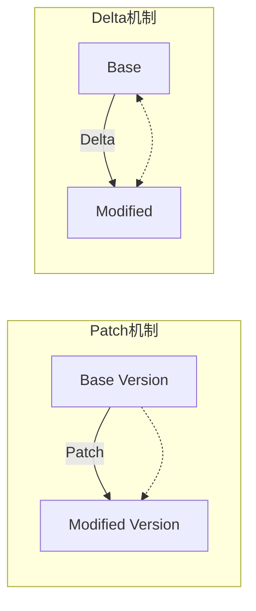
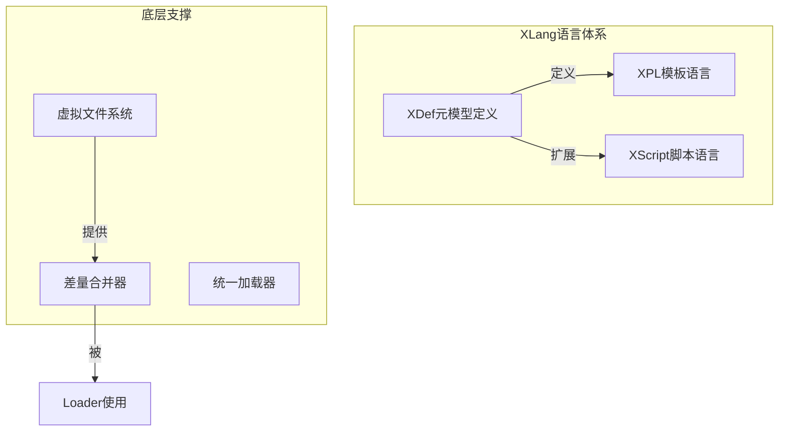
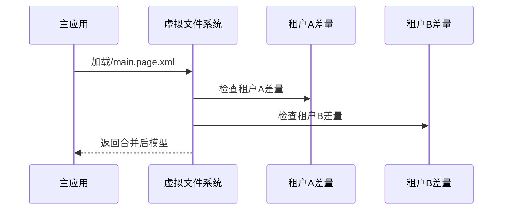

# 从可逆计算视角解析XLang：一种革命性的差量编程范式

## 引言：软件构造理论的新范式

在软件工程领域，程序语言的发展似乎已进入平台期。多范式融合成为主流设计趋势，新语言在语法层面的创新越来越有限。然而，**程序语言的本质远不止语法糖的堆砌**，而是定义了一种**程序结构空间**及其构造规则。正是在这一根本层面，XLang语言带来了范式级的突破。

XLang作为Nop平台的核心支撑技术，形式上包含XDef、Xpl、XScript等多个子语言，但其真正创新在于**首次在语言层面明确定义了领域结构坐标并内置通用差量计算规则**。这标志着软件构造理论从"还原论"的组件组装思维，转向"场论"的连续差量叠加思维，其理论基础可逆计算理论(Reversible Computation)为粗粒度软件复用提供了数学框架。

本文将深入分析XLang的设计哲学、技术实现及应用价值，揭示其如何通过差量运算实现`Y = F(X) + Δ`的计算范式，以及这一范式转换对软件工程未来的深远影响。

## 一、程序结构空间的演进：从Map到Tree的质变

### 1.1 主流程序语言的结构局限性

当代主流程序语言在结构层面具有惊人的相似性。无论是面向对象语言的类继承，还是函数式语言的类型组合，本质上都是在**Map结构空间**中进行操作：

```java
// 传统面向对象中的结构组合
interface Base {
    String name();
    void execute();
}

interface Extended extends Base {
    String description(); // 通过继承扩展结构
}
```

这种结构对应数学表达：`Map_extended = Map_base ∪ Map_addition`，即通过Map的并集操作实现结构扩展。但问题在于：

1. **复用方向受限**：传统继承只支持"向下"复用基类，无法"向上"复用派生类
2. **组合能力有限**：多重继承面临菱形问题，Traits机制提供了改进但仍受Map结构限制
3. **坐标系统薄弱**：仅支持`类型.成员`的两级坐标，无法精确定位复杂结构中的元素

### 1.2 泛型编程的结构生成视角

泛型编程特别是C++模板元编程，揭示了程序结构的另一维度：**结构生成**。模板可视为在编译期生成结构的函数：

```cpp
// C++模板作为结构生成器
template<typename T>
struct Container {
    T value;
    // 编译期根据T生成特定结构
};
```

这对应构造公式：`Map = Generator<Parameters>`。但当结合继承机制时，面向对象的最强形态可表达为：`Map = Map extends Map<Map>`。

这一公式虽强大，但仍局限于Map结构空间。XLang的革命性在于将结构空间从Map扩展到Tree，将公式推广为：`Tree = Tree x-extends Tree<Tree>`。

### 1.3 Tree结构的坐标优势

Tree结构提供了远胜Map的坐标系统能力：

```xpath
// XPath风格的精准坐标示例
/workflow/steps/step[@name='approval']/actions/action[@type='submit']
```

**Tree结构坐标的核心优势**：
1. **绝对坐标与相对坐标统一**：任何节点都有唯一路径，同时子树内保持相对坐标
2. **稳定性**：通过唯一标识（如id、name）而非位置索引定位元素，结构变化不影响坐标
3. **无限嵌套**：支持任意深度的结构表达，适应复杂领域模型

这种坐标系统为差量计算奠定了基础——只有具备稳定坐标，才能精确定位并修改结构中的特定部分。

## 二、可逆计算理论与差量概念辨析

### 2.1 可逆计算的核心公式

可逆计算理论提出了通用的软件构造公式：`App = Δ x-extends Generator<DSL>`

其中：
- `DSL`：领域特定语言，提供领域结构坐标系
- `Generator`：结构生成器，实现DSL到实现结构的转换
- `Δ`：差量，表示在结构坐标系中的修改集合
- `x-extends`：差量合并操作，将Δ应用到基结构上

这一公式的深刻之处在于**全量是差量的特例**（当Δ=0时），因此差量成为比全量更基础的概念。

### 2.2 差量与相关概念辨析

**差量(Δ) vs 补丁(Patch)**：


关键区别：
- **独立性**：Patch依赖特定Base版本，Delta可独立存在和管理
- **结合律**：多个Delta可结合为复合Delta(`Δ_total = Δ1 + Δ2`)，Patch无此性质
- **可逆性**：Delta包含逆操作（删除、修改），Patch主要是添加

**差量(Δ) vs 插件(Plugin)**：
- **粒度**：插件在预定义扩展点工作，差量可在任意坐标点操作
- **方向**：插件主要是添加，差量支持增、删、改全操作
- **灵活性**：插件机制需提前设计，差量可后期任意定制

### 2.3 差量运算的数学基础

差量运算需要满足群结构的基本性质：

1. **封闭性**：差量应用结果仍在该结构空间
2. **结合律**：`(Δ1 + Δ2) + Δ3 = Δ1 + (Δ2 + Δ3)`
3. **单位元**：存在空差量`0`使得`X + 0 = X`
4. **逆元**：对任何差量`Δ`，存在逆差量`-Δ`

传统差量机制如Git Patch大多不满足这些性质，导致自动化处理困难。XLang通过Tree结构坐标和明确定义的合并算法，实现了数学性质良好的差量运算。

## 三、XLang语言设计：实现可逆计算的技术架构

### 3.1 XLang整体架构

XLang不是单一语法体系，而是多层语言工作台：



### 3.2 XDef：元模型定义语言

XDef采用同态设计，元模型与实例结构高度一致：

```xml
<!-- 元模型定义: state-machine.xdef -->
<state-machine x:schema="/nop/schema/xdef.xdef" xmlns:x="/nop/schema/xdsl.xdef">
    <states xdef:body-type="list" xdef:key-attr="id">
        <state id="!string" displayName="string">
            <on-entry xdef:value="xpl" />
            <on-exit xdef:value="xpl" />
        </state>
    </states>
    <transitions xdef:body-type="list">
        <transition from="!string" to="!string" />
    </transitions>
</state-machine>
```

对比实例文件：
```xml
<!-- 实例文件: example.machine.xml -->
<state-machine x:schema="/nop/schema/state-machine.xdef">
    <states>
        <state id="start" displayName="开始状态">
            <on-entry><script>initialize()</script></on-entry>
        </state>
    </states>
</state-machine>
```

**XDef设计优势**：
1. **直观性**：元模型与实例结构一致，降低认知负担
2. **强约束**：支持丰富约束类型（唯一性、引用完整性等）
3. **自描述**：XDef自身由xdef.xdef定义，形成闭环

### 3.3 Xpl：图灵完备的模板语言

Xpl融合了声明式与命令式编程的优点：

```xml
<workflow x:extends="base.workflow.xml">
    <x:gen-extends>
        <!-- 编译期元编程：动态生成节点 -->
        <gen:CreateSteps model="${model}" xpl:lib="/nop/core/xlib/gen.xlib" />
    </x:gen-extends>
    
    <steps>
        <step id="custom-step" x:override="replace">
            <on-execute>
                <c:script>
                    // 嵌入式脚本
                    const result = businessLogic(context);
                    if (result.needApproval) {
                        return { nextStep: 'approval' };
                    }
                </c:script>
            </on-execute>
        </step>
    </steps>
</workflow>
```

**Xpl创新特性**：
1. **多输出模式**：支持输出文本、AST节点或运行时对象
2. **元编程集成**：编译期执行代码生成，运行时不负担
3. **异构语法嵌入**：可在XML中嵌入多种脚本语法

### 3.4 差量合并算法

XLang的差量合并基于结构坐标而非文本行号，核心算法伪代码：

```python
def merge(base_node, delta_node):
    if delta_node.override == 'remove':
        return None  # 删除基节点
        
    if base_node is None:
        return delta_node  # 新增节点
        
    # 根据节点类型选择合并策略
    if is_list_node(base_node) and is_list_node(delta_node):
        return merge_list(base_node, delta_node)
    elif is_map_node(base_node) and is_map_node(delta_node):
        return merge_map(base_node, delta_node)
    else:
        return delta_node  # 类型不同，完全覆盖

def merge_list(base_list, delta_list):
    result = []
    # 基于key-attr建立映射
    base_dict = {node.get(key_attr): node for node in base_list}
    
    for delta_item in delta_list:
        key = delta_item.get(key_attr)
        if key in base_dict:
            # 合并现有项
            merged = merge(base_dict[key], delta_item)
            if merged is not None:
                result.append(merged)
            del base_dict[key]
        else:
            # 新增项
            result.append(delta_item)
    
    # 添加未修改的基项
    result.extend(base_dict.values())
    return result
```

这种基于坐标的合并比基于行号的Git Merge更加稳定和可靠。

## 四、XLang应用实例：差量化组件模型

### 4.1 前端低代码平台的差量定制

传统组件定制需要特殊框架支持，XLang通过差量合并实现通用解决方案：

```xml
<ui-component x:schema="/nop/schema/component.xdef">
    <import from="base:Button/1.0.0" />
    
    <component name="PrimaryButton" x:extends="base:Button/1.0.0">
        <props>
            <prop name="type" default="primary" />
            <prop name="size" default="large" />
            <!-- 删除基组件属性 -->
            <prop name="disabled" x:override="remove" />
        </props>
        
        <template x:override="merge">
            <!-- 只覆盖需要定制的部分 -->
            <button class="primary-btn" :size="${size}">
                <icon name="check" x:override="replace" />
                <span>${slots.default}</span>
            </button>
        </template>
    </component>
</ui-component>
```

**优势对比**：
| 方案 | 运行时支持 | 定制粒度 | 框架耦合度 |
|------|------------|----------|------------|
| UIOTOS方案 | 需要特殊运行时 | 属性级 | 高 |
| XLang方案 | 通用运行时 | 任意节点级 | 低 |

### 4.2 后端服务的差量定制

Spring配置的差量化改造：

```xml
<beans x:extends="base-app.beans.xml">
    <x:gen-extends>
        <!-- 编译期根据条件生成Bean定义 -->
        <gen:ConditionalBeans profile="${env.profile}" 
                              xpl:lib="/nop/spring/xlib/spring-gen.xlib" />
    </x:gen-extends>
    
    <bean id="dataSource" x:override="replace">
        <!-- 替换为特定环境的数据源 -->
        <property name="url" value="${env.db.url}" />
    </bean>
    
    <!-- 删除不需要的Bean -->
    <bean id="obsoleteService" x:override="remove" />
</beans>
```

这种差量定制完全在编译期完成，运行时仍是标准Spring格式，无需特殊容器支持。

### 4.3 多租户定制的统一处理

通过虚拟文件系统实现租户隔离：

```java
// 租户定制文件路径模式
"/_delta/tenant_{tenantId}/{module}/{resource}"

// 加载时自动合并租户定制
IResourceComponentManager manager = NopComponentManager();
IComponentModel model = manager.loadComponent("/app/main.page.xml"); 
// 自动查找并合并/_delta/tenant_001/app/main.page.xml
```

**多租户定制流程**：


## 五、XLang与相关技术对比

### 5.1 与面向特征编程(FOP)对比

FOP将系统分解为特征组合：

| 维度 | FOP | XLang |
|------|-----|-------|
| 结构空间 | 特征结构树 | 通用Tree结构 |
| 组合操作 | 特征叠加 | 差量合并 |
| 灵活性 | 有限的特征组合 | 任意结构修改 |
| 数学基础 | 特征代数 | 可逆计算理论 |

### 5.2 与Delta导向编程(DOP)对比

DOP最接近XLang的差量思想，但关键差异在于：

1. **差量定义**：DOP差量以操作序列表示，XLang差量与全量同构
2. **坐标系统**：DOP依赖类型系统，XLang使用独立结构坐标
3. **生成器集成**：DOP缺乏Generator概念，XLang深度集成

### 5.3 与内部DSL对比

内部DSL优势在于宿主语言生态，但XLang在以下方面更具优势：

1. **语法自由度**：不受宿主语言语法限制
2. **工具链支持**：统一解析、验证、调试工具
3. **可视化编辑**：结构一致性支持自动生成设计器
4. **性能优化**：编译期完成差量合并，零运行时开销

## 六、XLang的创新性与局限性

### 6.1 理论创新性

1. **程序结构空间扩展**：从Map结构到Tree结构的根本性扩展
2. **差量计算内置**：首次在语言层面实现通用差量运算
3. **坐标系统革命**：建立稳定的领域结构坐标系统
4. **可逆性实现**：全量与差量统一，支持逆向变换

### 6.2 技术原创性

在全球范围内，XLang的核心理论和公式在2007年左右提出，早于学术界Delta导向编程(DOP)的提出时间(2010年)。关键创新点：

1. **差量合并算法**：基于结构坐标而非文本或类型系统
2. **元模型驱动**：XDef同态设计实现元编程闭环
3. **虚拟文件系统**：支持多源、多版本模型统一管理
4. **编译期元编程**：x:gen-extends机制实现零开销代码生成

### 6.3 应用价值

1. **软件产品线工程**：完美支持可变性管理，特别是未预见的变化
2. **低代码平台**：提供模型驱动开发的理论基础和技术实现
3. **系统定制化**：支持无侵入、细粒度的系统定制
4. **架构治理**：通过结构坐标实现架构约束和验证

### 6.4 局限性与发展方向

1. **学习曲线**：需要理解可逆计算等新概念
2. **生态建设**：需要构建围绕XLang的工具链和组件库
3. **性能优化**：大规模模型合并的性能需要进一步优化
4. **可视化工具**：需要更多可视化设计器支持

未来发展可能方向：
- 集成AI辅助的差量代码生成
- 支持分布式差量管理和同步
- 增强运行时差量热更新能力
- 扩展更多领域特定语言支持

## 七、结论：软件构造范式转换的意义

XLang代表的不仅是一种新语言，更是软件构造范式的根本转换：

1. **从组合到差量**：从组件组装到差量叠加的思维转变
2. **从离散到连续**：从孤立对象到场式结构的视角转换
3. **从类型到坐标**：从类型约束到结构坐标的定位方式进化
4. **从生成到变换**：从代码生成到结构变换的机制升级

这种范式转换对软件工程具有深远影响：

- **软件复用粒度**：从组件复用提升到系统级差量复用
- **开发模式**：从全量开发转向基产品+差量定制模式
- **系统演化**：支持更加灵活和可控的系统演化路径
- **架构治理**：通过结构坐标实现精准的架构管控

XLang作为可逆计算理论的工程实现，为软件工程提供了全新的理论基础和技术工具链，有望成为下一代低代码平台和软件产品线工程的核心技术。其创新性不仅体现在技术层面，更在于对程序本质的深刻理解和重新表述。

## 参考文献与扩展阅读

1. Canonical Entropy. (2023). 可逆计算：下一代软件构造理论. 微信公众号
2. Schaefer, I. et al. (2010). Delta-Oriented Programming of Software Product Lines. SPLC
3. Apel, S. et al. (2008). Feature-Oriented Software Development. JOT
4. Batory, D. (2005). Feature Models, Grammars, and Propositional Formulas. SPLC
5. Canonical Entropy. (2023). Nop Platform开源项目. Gitee

*注：本文基于提供的多篇技术文章进行深度分析和综合解读，力求客观专业地评价XLang语言的创新性和技术价值。文章中的代码示例、图示和理论分析均基于原始材料进行重新组织和演绎。*