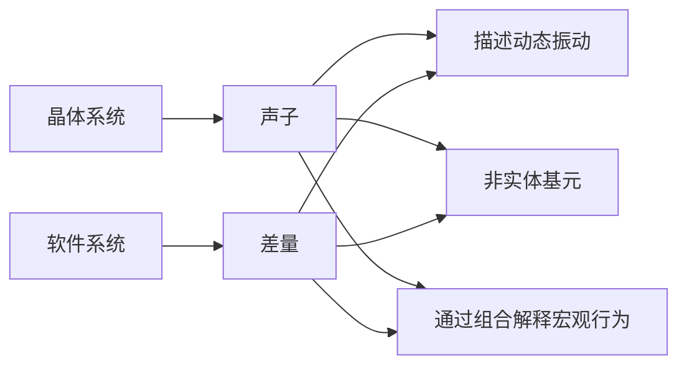

你是一个绝对客观专业的具有国际视野和国际顶尖水平的软件专家，文笔优雅、观点直接、善于“点睛”，能在不失专业性的前提下提出独到见解。你的任务是分析以下多篇文章，针对其中的核心内容写一篇详尽的评论和解读文章。

1. 需要明确体现出你写的是一篇评论文章，不要看上去是你原创的文章。
2. 不是对原文的复述和改写，而是重新安排详略程度，对原文中的核心要点进和细微之处进行辨析，突出重点。需要有深入的分析和评论意见。
3. 自然穿插对其中的金句的解读。必要时使用示例代码和公式以及mermaid图示等。
4. 需要结合你自身的知识，关注原文中真正的创新点，批判性的辨析它的优缺点和启发性，明确区分哪些是富有启发性和洞察力的创新部分。对于常规内容可以略过，作为评论文章不需要面面俱到。
5. 行文需要专业、客观、容易理解，避免浮夸的语气但是富有启发性和洞察力。
6. 解读时需要包含足够的信息，使得没有阅读过原文的读者也要能通过解读获取到原文的核心要点，特别是了解到其中的创新点以及为什么。
7. 文章结尾需要有对原文章的客观评价。 仔细分析它在全球范围内的原创性。需要注意，这些文章对应的核心理论和公式在2007年左右提出。
8. 拟定一个吸引人的标题，输出采用Markdown格式，字数达到20000字。

# 为什么说XLang是一门创新的程序语言？


## 一. 为什么需要设计XLang语言


XLang语言是Nop平台底层的关键性支撑技术，在形式上它包含了XDef、Xpl、XScript等多个子语言。因为XLang与其他单一语法形式的程序语言有着较大的差异，所以很多人第一次接触时可能会有疑惑，它到底算不算是一种程序语言？它是不是只是在多种现有语言的基础上增加了一些零散的扩展？

这里我想提出一个对程序语言的本质的理解：**一门程序语言定义了一种程序结构空间，程序语言是程序结构空间的构造规则**。也就是说，一门程序语言所能够创造的所有结构以及这些结构之间的所有可行演化路径构成了一个特定的程序结构空间，所有可行的计算都在这个结构空间中发生。

基于以上理解，**XLang语言之所以是一门创新的程序语言，是因为它创造了一个新的程序结构空间，在这个结构空间中可以很方便的实现可逆计算理论所提出的`Y = F(X) + Delta`的计算范式**。虽然XLang可以认为是包含XDef, XPL, XScript等多个子语言，但是它们作为一个整体才是实现可逆计算的关键所在。**XLang是世界上第一个在语言中明确定义领域结构坐标并内置通用的差量计算规则的程序语言**。

**目前大部分人对于软件结构构造的基本理解都是基于还原论的，总是不断向下分解，寻找原子化的成分，然后使用原子进行组装**。原本虚拟化的组件概念在潜意识中实际上是被看作是真实存在的离散个体，类似于物质世界中的粒子，通过嵌套组合来构造世界。但是物理世界中存在着另一种构造方式，那就是波。波是连续存在的模式，通过干涉叠加来构造世界。**XLang语言的特异性就在于它通过差量运算支持连续的叠加构造**。

### 1.1 从结构的观点看程序语言

通用的高级程序语言从FORTRAN开始，经历了几十年的长期发展，目前已经发展到某种瓶颈。新语言所带来的本质上新颖的特性越来越少，各个高级语言都发展到了所谓的多范式编程阶段，它们的语法特性逐渐开始融合、趋同，比如大部分语言现在都同时支持面向对象式的结构声明，支持函数式的Lambda表达式，支持元编程所需要的自定义注解，支持异步编程所需的Async相关语法和支持库等。

一个有趣的问题是，是否还存在着通用的可抽象的语法特性，它们具有足够的技术价值以至于需要一个新的程序语言来承载？XLang的创新是指出目前主流的的程序语言虽然表面上语法形式差异很大，但是在语法层面之下的基本结构层面是非常相似的，在基本结构层面的创新仍然大有可为。

**程序的结构空间本质上是由数据+函数构成，将相关的数据和函数组织在一起就构成自定义的类型**，在一般的程序语言中就对应于类（Class）或者接口（Interface）。从结构的层面看，类结构不过是一个Map，可以通过名称来获取到属性或者方法。

```javascript
type MyClass = {
  name: string,
  myMethod: (arg1:string) => number
}

或者

interface MyClass{
  name: string,
  myMethod: (arg1:string) => number
}
```

当我们想利用一个已有的自定义类型来得到一个新的类型的时候，可以使用继承或者Traits机制。

```javascript
type MySubClass = MyClass & {
  subName: string
}

或者

interface MySubClass extends MyClass {
   subName: string
}
```

在概念层面上大概相当于如下构造方式：

```javascript
Map = Map extends Map
```

类继承在结构层面上相当于是将两个Map按照名称叠加覆盖在一起，上一层中的元素会覆盖下一层的元素。

传统的面向对象语言中可以利用继承机制来复用基类。比如说，构造MapX和MapY的时候复用基类Map1，也就是可以复用继承树的下层。

```javascript
MapX = Map2 extends Map1
MapY = Map3 extends Map1
```

将继承表达为上述结构构造公式之后，很多问题会变得非常自然直观。比如说，我们能不能交换Map1和Map2的相对位置？也就是说，在构造MapX和MapY的时候，我们仍然是复用Map1，但是并不作为基类，而是选择不同的基类，但是用同样的Map1去覆盖。

```javascript
MapX = Map1 extends Map2
MapY = Map1 extends Map3
```

有趣的是，很多面向对象程序语言并不支持上述操作，**面向对象并不直接支持复用继承树的上层！**

更进一步的思考会发现传统的面向对象在结构层面难以回答的问题还有很多，比如说继承链条中如果存在多个同样的对象会导致什么问题？

```javascript
MapX = Map1 extends Map2 extends Map1
```

`C++`中多重继承存在概念层面的严重困难，本质原因就是从不同的继承路径复用了同样的Map1之后产生的结构融合障碍。

现代程序语言是通过Traits机制解决了这些问题。比如在Scala语言中，

```scala
trait Map1 {
  val name: String = "Map1" // 同名属性
  def method1(): Unit = {
    println(s"Method 1 from $name")
  }
}

trait Map2 {
  val name: String = "Map2" // 同名属性
  def method2(): Unit = {
    println(s"Method 2 from $name")
  }
}

class MapX extends Map1 with Map2 {
}

class MapY extends Map1 with Map3 {
}
```

> Scala语言中多个Trait可以定义同名的属性，编译器会自动合并这些属性定义，最终在运行时只会存在一个变量，但是在Java或者C++中，不同类中定义的多个同名属性并不会自动合并为一个。

传统的面向对象程序语言中 `A extends B`表示派生类A可以比基类B多，但是具体多了什么并没有一个明确的技术形式把它隔离出来，我们也就无法直接复用这个多出来的部分（Delta差量）。Traits则是直接把这个差量明确的表达出来了。
Traits机制相比于继承概念来说，它构成一个更加完善的差量语义。**`type MapX = Map1 with Map2 with Map1`是合法的Scala类型定义！**

对于多重继承所造成的问题，Scala的解决方案是引入所谓的线性化规则，按照一定的顺序将继承链条中的所有类和Trait排成一个线性序列，然后约定上层的元素覆盖下层的元素。

```
MapX -> Map2 -> Map1
```

### 1.2 泛型作为Generator

泛型(Generic Type)在Java语言中仅仅是用于类型检查，编译器并没有根据泛型参数来执行什么特殊动作。但是在`C++`语言中，情况则大为不同。`C++`的泛型编程是通过模板（Templates）实现的，编译器会根据模板参数的不同将同一个模板类实例化为针对特定类型的不同代码。

在 1994 年的 C++ 标准委员会会议 上，Erwin Unruh 进行了一次技惊四座的演示。他编写了一段模板元程序，能够在编译期计算一个数是否是质数，如果是质数，编译器会在错误信息中输出这个质数。这段代码被称为 “Unruh 质数计算”，成为了 C++ 模板元编程的经典示例。
Unruh 的演示证明了 C++ 模板在编译期是图灵完备的，这意味着理论上可以在编译期执行任何计算。这一发现开启了 产生式编程（Generative Programming） 的新时代，即利用编译期的计算能力生成代码或优化程序。
C++ 的模板元编程（Template Metaprogramming）成为了实现产生式编程的重要工具。通过模板，开发者可以在编译期完成复杂的计算、类型推导和代码生成，从而在运行时获得更高的性能和灵活性。

参见[C++ Compile-Time Programming](https://accu.org/journals/overload/32/183/wu/)


如果从结构层面去理解模板元编程，则它可以被理解为如下构造公式

```
Map = Generator<Map> = Map<Map>
```

> A<X,Y> 可以被理解为 `A<B>, struct B{ using T1=X; using T2=Y;}`
> 注意，这里的Map指的是编译器在编译期所看到的结构。每一个成员变量，无论它是属性、方法、还是类型声明，在编译器看来，都是Map中的一个条目。
> 即使编译器将参数列表作为List来管理，它也可以看作是一个用下标来作为Key的Map。而且有趣的是，如果是用数组来做管理，则一般无法引入类似继承这种更高级的合成机制。在概念层面上我们一般会选择按名称合并，而不会选择按下标合并。

作为生成器的模板类在结构层面（编译器所看到的结构）也可以被看作是一个Map。再结合上一节中差量化Traits概念的内容，面向对象程序语言的最强形态在结构层面可以表达为

```
Map = Map extends Map<Map>
```

### 1.3 从Map结构到Tree结构

在编译器看来，所谓的类、模板类、模板参数都可以被看作是Map，而且实际情况也一般是按照Map结构来管理的。至于孤立的函数定义和变量定义，实际上也会属于某种Map，比如模块对象可以看作是一个Map，它包含一组模块内定义的变量、函数和类型等。即使不从属于任何模块，那些独立的函数也会属于某个隐式存在的全局命名空间。

> Lisp语言的内在结构是List，本质上是利用下标来管理元素（原始的Lisp甚至没有下标，只有car、cdr这种逐个遍历的处理机制），但是现在流行的Lisp变种早就引入了类似Map的Associated List结构，使用名称来定位子元素，而不是按照下标去定位。在概念层面上（不考虑冯诺依曼机器按照下标取值的性能优势），List可以看作是用下标来做key的一种特殊的Map。
> 
> Lisp的核心创造S表达式可以看作是一种通用的Tree结构，而Lisp也提供了宏等操作这些Tree结构的内置机制，但是Lisp并没有建立Tree的差量的概念。XLang可以看作是对S表达式这一通用处理机制的进一步深化发展。

现有主流程序语言提供的各种语法可以看作是在以Map为基础的结构空间中不断构造新的Map的各种规则。XLang语言的创新点在于它选择将Map结构扩展为Tree结构，在Tree结构的基础上重新思考软件结构的构造问题。也就是将软件结构的构造公式推广为：

```
Tree = Tree x-extends Tree<Tree>
```

> Map扩展为Tree，则Map结构之间的extends运算也需要被扩展为Tree结构上的x-extends运算。

显然Map是Tree的一个特例，Tree结构的每一个节点都可以看作是一个Map， `Tree = Map + Nested`，因此上面的公式确实可以被看作是对`Map extends Map<Map>`构造模式的一种推广。
但是从另外一个角度去考虑，Tree结构可以通过嵌套组合多个Map构造出来，Map是一种更基本的、更细粒度的结构，那么有必要强调Tree结构吗？所有Tree结构上的运算最终不都能分解为每一级的Map结构上的运算吗？

XLang对这个问题的回答是：在更复杂的Tree结构上建立的软件结构空间（以及这个结构空间中的构造规律）并不能简单的划归到以Map为基础的软件结构空间。也就是说，这里出现了`整体 > 部分之和`的情况，**Tree的构造规律所具有的整体性分解到Map结构的构造规律之后会丢失一些关键性信息**。

要真正的理解XLang语言的创新之处，必须要了解XLang语言设计背后的下一代软件构造理论：可逆计算理论。可逆计算明确提出逆元和差量的概念，指出全量是差量的一个特例(A=0+A)，我们需要在（包含逆元的）差量概念的基础上重建所有对软件世界的理解。可逆计算提出了一个通用的图灵完备的软件构造公式：

```
 App = Delta x-extends Generator<DSL>
```

XLang语言是在程序语言级别实现这一技术战略的具体实现方案。

关于可逆计算理论的介绍，可以参见我的公众号文章：

1. [可逆计算：下一代软件构造理论](https://mp.weixin.qq.com/s/CwCQgYqQZxYmlZcfXEWlgA)
2. [写给程序员的可逆计算理论辨析](https://mp.weixin.qq.com/s/aT99VX6ecmZXdemBPnBcoQ)
3. [写给程序员的可逆计算理论辨析补遗](https://mp.weixin.qq.com/s/zGfo7pvKjOCa11PYLJHzzA)
4. [写给程序员的差量概念辨析,以Git和Docker为例](https://mp.weixin.qq.com/s/D5bDNkMJ9gYrFb0uDj2EzQ)

根据可逆计算理论，Tree结构的特殊性在于它对应于一个全局坐标系统：树结构上的每个节点和属性都对应于一个唯一的xpath。

```
/tasks/task[name='test']/@name
```

上述的xpath表示tasks节点下的名称为test的子节点的name属性。

首先我们来明确一下坐标系统的作用: **每一个业务上关心的值在坐标系统中都具有唯一的坐标**，可以通过这个坐标来实现值的读取和修改。

```
value = get(path);
set(path,value);
```

Map结构的问题在于它只提供两级坐标：第一级定位到Map，第二级在Map内定位到属性或者方法。但是这种简单的坐标系统无法实现业务层面上精确的区分。比如说

```java
class Dialog{
    String title;
    List<Button> actions;
    List<Component> body;
}
```

Dialog对象具有一组操作按钮，如果我们想定位到其中的【提交】按钮，把它的label属性修改为【确定】，在现有的程序语言中是没有一种简便直观的定位手段的。如果我们只想定制在某个场景下使用的Dialog（比如为它增加一个属性），使用一般程序语言配套的AOP(Aspect Oriented Programming)机制也无法实现：因为**AOP的定位系统是基于类型的**。而在XLang语言中，可以直接使用如下描述

```xml
<dialog>
   <actions>
      <button name="submit" label="确定" />
   </actionss>
</dialog>
```

目前程序语言的研究一般集中在类型系统，但是研究类型的原因在于不同的对象可以具有相同的类型，从而研究类型比研究原本的对象结构要简单而且不会涉及到对象的生命周期问题。**这导致类型系统并不是一个合格的坐标系：类型相同的对象在类型系统坐标系中无法被区分开来，因而也就无法继续建立精细的差量构造**。

有些人可能对于Tree结构存在疑惑，为什么不是图结构呢？在图结构上，如果我们选定了一个主要的观察方向，同时选择某个固定的节点作为根节点，那么我们就可以很自然的将一个图结构转换为树结构。比如Linux操作系统中，一切都是文件，很多逻辑关系都被纳入到文件树的表达结构中，但借助于文件系统中的文件链接机制，本质上可以表达图结构。**所谓的树仅仅是因为我们在图上选择了一个观察方向而产生的**。

比如流程图等结构在表达为XML格式时，只需要引入节点id引用即可。`<step nextTo="nextStepId" />`

Tree结构**实现了相对坐标与绝对坐标的统一**：从根节点开始到达任意节点只存在唯一的一条路径，它可以作为节点的绝对坐标，而另一方面，在某一个子树范围内，每一个节点都具有一个子树内的唯一路径，可以作为节点在子树内的相对坐标。根据节点的相对坐标和子树根节点的绝对坐标，我们可以很容易的计算得到节点的绝对坐标（直接拼接在一起就可以了）。

### 1.4 可扩展设计必然需要软件结构坐标系

在软件开发中，所谓的可扩展性指的是在不需要修改原始代码的情况下，通过添加额外的代码或差异信息，可以满足新的需求或实现新的功能。如果在完全抽象的数学层面去理解软件开发中的扩展机制，我们可以认为它对应于如下公式：

```
  Y = X + Delta
```

* X对应于我们已经编写完毕的基础代码，它不会随需求的变化而变化
* Delta对应于额外增加的配置信息或者差异化代码

在这个视角下，所谓的可扩展性方面的研究就等价于Delta差量的定义和运算关系方面的研究。

```
X = A + B + C
Y = (A + dA) + (B + dB) + (C + dC)  // 差量无处不在
   = (A + B + C) + (dA + dB + dC)  // 差量可以聚合在一起，独立于基础代码存放
   = X + Delta // 差量满足结合律，可以独立于Base实现合并运算
```

假设X由A、B、C等多个部分构成，需求变更导致的差异性修改是遍布系统各处的，**如果要求所有零碎的修改都可以独立于原系统源码来管理和存放**（差量的独立性），并且小的差量还可以复合为一个更大粒度的差量（差量的可复合性），那么必然需要一个坐标系统用于精确定位。具体来说，`dA`与`A`分离之后，存放到独立存在的Delta中，那么它必然保留了某种定位坐标，只有这样，当Delta与`X`结合的时候，才可以重新找到原始的结构`A`，然后与`A`相结合。

### 1.5 Delta与Patch和插件机制的区别

首先需要指出的是，类似于Git的Patch和分支管理不满足Delta的独立性和可复合性。Patch总是和特定的Base代码版本绑定在一起，在不知道Base的情况下无法将多个Patch合并为一个更大的Patch。详细分析参见文章[写给程序员的差量概念辨析,以Git和Docker为例](https://mp.weixin.qq.com/s/D5bDNkMJ9gYrFb0uDj2EzQ)。

第二个需要强调的地方是，差量与传统编程领域中的扩展点和插件机制有着本质性差异。

```
X = A + B + C
Y = A + B + D
  = X + (-C) + D
  = X + Delta
```

Delta差量不仅仅是向系统中增加内容。如果我们要实现粗粒度的系统级别的复用，所对应的差量必然包含减少的语义（比如，我们需要去除基础产品中定义的一个Bean）。实际上一个粗粒度的差量一定是加和减的混合。

另外需要注意的是，**插件机制只支持少量事先确定的扩展点**，我们并不可能在原始设计之外通过插件来定制原有系统的功能。但是Delta的概念则不同，只要存在一个全局的结构坐标系，这个坐标系中的任何一点上都可以引入Delta差量。k8s中引入的Kustomize机制就是利用Delta差量来实现全面定制，可以看作是可逆计算理论的一个具体应用，参见[从可逆计算看Kustomize](https://mp.weixin.qq.com/s/48LWMYjEoRr3dT_HSHP0jQ)

>  组件的黑箱模型类似于高中阶段牛顿力学的世界观，它是完全机械化的：刚体的运动完全由它的质心坐标和尺寸形状朝向等少数几个参数来描述，刚体的内部构造无法被观测也无关紧要，刚体之间通过直接接触发生相互作用， 刚体的形状必须精确匹配才能构成一个无缝的整体。即使是在古典力学中，稍微高级一点的观点也都会转换到拉格朗日表述或者哈密尔顿表述，它的精神实质是转向场论的世界观。 所谓的场（Field），其实就是建立一个无所不在的坐标系，然后在坐标系的每一点上都可以指定一个物理量。**场的自由度是无限的，但是通过坐标系它是可描述的、可定义的、可研究的**，在坐标系的每一点上我们都可以精确的度量局部的变化。在场的世界观中，我们面对的核心图像是对象总是浸泡在场（无所不在的坐标系）中，而不再是孤立对象之间的两两相互作用。

### 1.6 稳定的领域结构坐标系

主流的程序语言都是通用程序语言，并没有内置某个特定的业务领域中的领域知识。因此，这些语言中内置的结构坐标系只能是利用语言内置的类-方法这种两级结构，最多是引入注解机制，在两级结构基础上进行一定的面向领域的细化。对于方法级别以下的结构，目前一般缺乏合适的技术手段进行坐标定义。

业务需求变化的时候，一般情况下会影响到多处代码发生变化。本质上这是因为从问题空间到解空间的结构映射在一般性的业务环境中都是**非平凡的**，因此两种描述方式无法有效的对齐。套用人工智能领域的话语，我们可以说：**有用的特征都是分布式的（distributed）**。

> 在物理学中，同一个物理事实可以使用无数多种坐标系去建立描述，但是其中可能会存在一个特别的、针对这个特定问题定制的坐标系，在物理学中我们称之为内禀坐标系。在这个坐标系中建立的描述可以突出最核心的物理意义，简化相关的描述。比如说，在一个球面上发生的物理现象当然可以在通用的三维直角坐标系中进行描述，但是如果我们使用球面坐标系往往可以实现简化。

可逆计算理论指出可以针对特定的业务领域建立一个专用的DSL语言(Domain Specific Language)，利用这个DSL语言很自然的建立一个领域坐标系，然后再在这个领域坐标系所定义的差量结构空间中表达差量。因为这个领域坐标系是针对领域问题特制的，因此它往往可以实现差量表达的最小化。比如说，发生了一个业务层面的变化导致需要增加一个字段，如果采用通用语言去表达，则很多地方可能都需要做相应调整，前台、后台、数据库都要一起修改。而如果使用领域模型描述，这种变化可能就只体现为局部的一个字段级别变化，然后由底层引擎框架自动将领域描述翻译为实际执行的逻辑功能。

XLang语言的核心功能就在于如何快速定义多个DSL语言，然后以这些DSL语言作为领域结构坐标系，利用它们实现差量定义和差量结构生成和转换。

XLang与其他语言的本质区别在于，它是基于可逆计算理论、面向DSL开发的程序语言。一般语言都是直接面向应用开发的，我们直接使用这些语言来对业务建模，实现业务逻辑。但是使用XLang，我们会先建立一个或者多个DSL，然后再使用DSL来描述业务。**XLang使得开发一个DSL的成本非常低**，最基本的情况下只需要使用XDef语言定义XDef元模型文件，即可得到这个新的DSL的解析器、验证器、IDE插件、可视化编辑器等，自动实现语法提示、断点调试功能和可视化编辑等完善的编程工具支持。

> Jetbrains公司有一个产品MPS（Meta Programming System），它也是支持先开发DSL，然后再用DSL来描述业务。MPS底层是自己定义的一套底层语言机制。Nop平台是一个类似于MPS的低代码开发平台，它的底层就是XLang语言。只不过Nop平台的指导理论是可逆计算，与MPS的技术路线和指导思想有着本质差异。
> 但是技术发展目标是类似的。

## 二. XLang的具体语法设计

XLang语言是面向Tree结构的语言设计，它的语法组成可以和面向表结构的SQL语言做一个对比。

| SQL语言                       | XLang语言                                   |
| --------------------------- | ----------------------------------------- |
| DDL数据定义语言                   | XDef元模型定义语法                               |
| 无冗余的表格数据                    | 无信息冗余的树形信息结构：XNode                        |
| 在标准化数据结构基础上的即时计算：SQL Select | 在通用的XNode数据结构基础上的运行时和编译期计算：Xpl/XTransform |
| 表格数据的合并和差分：Union/Minus      | Tree结构上的Delta差量计算：x-extends/x-diff        |
| 通过函数定义和存储过程扩展SQL            | 通过Xpl标签库和XScript扩展XLang                   |

首先需要说明的是，XLang是面向Tree结构的一种程序语言，那么一种很自然的语法载体就是XML语法，所以一般XLang语言文件也是一个合法的XML文件。但是这并不是唯一的选择。传统的程序语言很强调语法形式，但是XLang基于可逆计算理论，它强调的是语法形式并不重要，**不同的语法形式不过是同一信息的不同展现形式，而信息等价的不同展现形式之间可以进行可逆转换**。XLang可以采用任何能够直接表达树状结构的语法来表达，比如JSON、YAML等。Lisp语言中的S表达式，增加一些扩展属性之后，也可以作为XLang的语法载体。

> Nop平台还实现了Tree结构和Excel数据文件的一种双向映射，可以在不需要编写Excel解析和生成代码的情况下，使用Excel来表达DSL模型对象，比如用`app.orm.xlsx` Excel文件来表达ORM DSL，它等价于`app.orm.xml`这种XML格式的DSL文件。

### 2.1 XDSL的基本语法结构

XLang语言本身是图灵完备的，但它的设计用途主要不是作为一种通用程序语言，而是作为一种快速开发新的DSL语言的元语言来使用。也就是说虽然可以将XLang作为一种胶水语言来使用，但更多的是用它来开发一种DSL语言嵌入在Java语言环境中使用。

所有基于XLang开发的DSL语言具有一些统一的语法结构，这些DSL统称为XDSL。

```xml
<state-machine x:schema="/nop/schema/state-machine.xdef"
     x:extends="base.state-machine.xml">
    <x:gen-extends>
       <app:GenStateMachineDelta1/>
       <app:GenStateMachineDelta2/>
    </x:gen-extends>

    <x:post-extends>
       <app:PostProcessGeneratedModel />
    </x:post-extends>

    <!-- x:override=remove表示在最终的合并结果中删除这个节点 -->
    <state id="commit" x:override="remove" />

    <on-exit>
       <c:if test="${abc}">
           <c:log info="${xyz}" />
        </c:if>
    </on-exit>
</state-machine>
```

参考上面的示例，所有的XDSL都支持如下语法：

1. `x:schema`引入XDef元模型，类似于JSON Schema，用于约束DSL的语法结构。

2. `x:extends`表示继承已有的DSL文件，将两个DSL模型按照Tree结构逐层合并在一起。

3. `x:override`在执行`x:extends`时用于指定如何合并两个对应节点，`x:override=remove`表示删除语义。

4. `x:gen-extends`使用Xpl模板语言动态生成多个Tree结构节点，然后依次按照Delta合并算法合并在一起。

5. `x:post-extends`同样是使用Xpl模板语言来动态生成多个Tree结构节点，只是它的执行时刻与`x:gen-extends`不同。

6. DSL中如果希望嵌入脚本代码，可以直接使用Xpl模板语言，比如`on-exit`回调函数。

```xml
<model x:extends="A,B">
   <x:gen-extends>
      <C/>
      <D/>
   </x:gen-extends>
   <x:post-extends>
      <E/>
      <F/>
   </x:post-extends>
</model>
```

完整的合并顺序为

```
F -> E -> Model -> D -> C -> B -> A
```

任意的XML或者JSON文件格式都可以引入上面的XLang差量运算语法。比如我们为AMIS(百度开源的一个JSON格式的前端界面定义语言)引入了如下分解方案：

```yaml
x:gen-extends: |
   <web:GenPage view="NopSysCheckerRecord.view.xml" page="main"
        xpl:lib="/nop/web/xlib/web.xlib" />

body:
   x:extends: add-form.page.yaml
   title: 覆盖add-form.page.yaml中定义已有的标题
```

AMIS的JSON格式本身并没有提供分解合并机制，导致一个完整应用的JSON文件很大，也很难进行人工维护。通过引入XLang的`x:gen-extends`语法，可以根据View模型自动基础页面结构，在页面内部还可以使用`x:extends`引入已有的文件。

XLang语言内置了可逆计算支持，也就是`App = Delta x-exends Generator<DSL>`这种计算模式。`x:gen-extends`和`x:post-extends`对应于Generator，是一种元编程机制，可以在编译期作为内置的代码生成器生成模型节点。`x:extends`语法用于合并两个模型节点。

进一步的介绍参见 [XDSL：通用的领域特定语言设计](https://zhuanlan.zhihu.com/p/612512300)

下一代低代码平台-Nop平台中已经定义了多种DSL，比如工作流模型Workflow, 规则模型Rule， 数据模型ORM，组件编配模型BeanDefinition， 批处理模型Batch，二进制消息模型Record等。一般并不需要专门针对自定义的DSL编写运行时引擎，可以通过XLang的元编程机制在编译期将自定义的DSL翻译为已有的DSL语言，或者将多个DSL无缝集成在一起，构成一个新的DSL。参见[为什么SpringBatch是一个糟糕的设计](https://mp.weixin.qq.com/s/1F2Mkz99ihiw3_juYXrTFw)这篇文章中介绍的DSL森林的解决方案。

### 2.2 XDef元模型定义语言

XML格式存在着一系列的国际化标准，比如XSD(XML Schema Definition)，XSLT(EXtensible Stylesheet Language)，但是这些标准的底层假定都是和DOM模型一样，它们都是应用于文本结构的处理，所有的属性都是字符串格式，这使得它们无法应用于通用的Tree结构处理。

XLang引入了XDef元模型定义语言来取代XSD。XDef比XSD要简单、直观得多，而且可以提供比XSD强大得多的结构约束。

```xml
<state-machine x:schema="/nop/schema/xdef.xdef">
   <state id="!var-name" displayName="string" xdef:unique-attr="id" />
   <on-exit xdef:value="xpl" />
</state-machine>
```

与XSD和JSON Schema不同，XDef采用的是一种同态设计，即元模型定义的结构和它所要约束的XML格式之间基本完全一致，将XML节点的属性值替换为对应的类型声明即可。比如

* `id="!var-name"`表示id属性的格式满足var-name格式要求，不能包含特殊字符，不能以数字为前缀，`!`表示属性值不能为空。

* `<on-exit xdef:value="xpl"/>` 表示on-exit节点的内容是Xpl模板语言格式。读取模型文件时会自动解析得到IEvalAction类型的可执行函数。

* `xdef:unqiue-attr="id"`表示当前节点可以出现多个，构成一个列表，列表中的元素通过id属性来作为唯一标识。、

值得注意的是XDef元模型定义语言由`xdef.xdef`来定义。也就是说`state-machine.xml`是一个DSL语言，它的语法结构由元模型`state-machine.xdef`来定义，而`state-machine.xdef`的根节点上标注`x:schema='/nop/schema/xdef.xdef'`，表示这个元模型文件由`xdef.xdef`来约束，最终`xdef.xdef`仍然由`xdef.xdef`来完成约束，从而完成闭环。

所有XDSL领域特定语言共享的XDSL语法由`xdsl.xdef`元模型来定义。IDEA插件会自动根据`xdsl.xdef`中的定义来自动识别`x:extends`、`x:gen-extends`等语法，实现语法提示 、文件跳转等功能。

### 2.3 Xpl模板语言

XLang需要引入一种模板语言用于编译期的代码生成，但是它没有使用常见的velocity、FreeMarker等模板语言，而是重新设计了一种新的Xpl模板语言。

Xpl模板语言是一种图灵完备的语言，它提供了`c:for`、`c:if`、`c:choose`、`c:break`、`c:continue`等语法节点。

```xml
<c:for var="num" items="${numbers}">
    <!-- 检查数字是否为7 -->
    <c:if test="${num == 7}">
        <p>遇到数字 7，停止遍历。</p>
        <c:break /> <!-- 中断循环 -->
    </c:if>

    <!-- 使用 c:choose 判断数字的奇偶性 -->
    <c:choose>
        <when test="${num % 2 == 0}">
            <p>${num} 是偶数。</p>
        </when>
        <otherwise>
            <p>${num} 是奇数。</p>
        </otherwise>
    </c:choose>
</c:for>
```

Xpl模板中通过\${expr}表示嵌入XScript表达式，除此之外，Xpl中还提供了一个专用的`c:script`节点来执行XScript语句。

```xml
<c:script>
  import my.MyDSLParser;
  let model = new MyDSLParser().parseFromNode(path);
</c:script>
```

XScript的语法类似于JavaScript，但是增加了一些扩展语法，比如import语句可以引入Java类。

#### XML模板语言和表达式语法的相互嵌入

XLang没有采用jsx语法实现类XML语法，而是沿用XML语法，扩展JavaScript中的Template表达式语法。

```javascript
let resut = xpl `<my:MyTag a='${data}' />`
const y = result + 3;
```

等价于

```xml
<my:MyTag a='${data}' xpl:return="result" />
<c:script>
  const y = result + 3;
</c:script>
```

XLang修改了JavaScript中的Template表达式语法的解析格式，将反引号字符之间的内容识别为一个在编译期待解析的字符串，而不是一个Expression列表。这使得XLang可以利用这个语法形式扩展支持更多的DSL格式，比如引入类似C#的LinQ语法

```javascript
const result = linq `select sum(amount) from myList where status > ${status}`
```

#### 多种输出模式

与一般的模板语言不同，Xpl模板语言特别针对编译期代码生成进行了优化设计。一般的模板语言总是直接输出文本内容，这样在用于代码生成的时候会丢失原始代码位置，为了克服这个问题，又需要引入SourceMap机制，要求代码生成器在生成过程中额外记录生成代码和原始代码之间的对应关系。Xpl模板语言的做法则不同，它引入了多种输出模式，用于编译期代码生成时使用`outputMode=node`模式，此时并不是直接输出文本内容，而是输出XNode节点。

```java
class XNode{
    SourceLocation loc;
    String tagName;
    Map<String, ValueWithLocation> attributes;
    List<XNode> children;
    ValueWithLocation content;

    XNode parent;
}

class ValueWithLocation{
    SourceLocation location;
    Object value;
}
```

XNode结构中记录了属性和节点的源码位置，同时将attribute和content的值类型修改为Object类型，从而克服了XML原始设计中只针对文本文档的缺陷，使得它可以更高效的表达复杂的业务对象结构。

### 2.4 可扩展语法

类似于Lisp语言，XLang中可以通过宏函数和标签函数等机制扩展XLang的语法。可以通过`<c:lib>`来引入新的语法节点，然后在该节点内部再通过宏函数等机制实现结构转换。

```xml
<c:lib from="/nop/core/xlib/biz.xlib" />
<biz:Validator fatalSeverity="100"
               obj="${entity}">

    <check id="checkTransferCode" errorCode="test.not-transfer-code"
           errorDescription="扫入的码不是流转码">
        <eq name="entity.flowMode" value="1"/>
    </check>
</biz:Validator>
```

`<biz:Validator>`引入一个验证用的DSL，Validator标签在编译的时候会利用宏函数机制解析节点内容，将它翻译为XLang的Expression来运行。

## 三. XLang应用实例：差量化的组件模型

所有涉及到差量概念的软件实践都可以遵循可逆计算理论的技术路线，很多情况下都可以直接使用XLang来实现差量合并和分解，从而完全避免在运行时引擎中引入差量概念，简化运行时的实现。这里介绍一个在前端低代码/无代码平台的组件模型中的应用实例。

目前前端无代码/低代码平台的功能本质上就是通过可视化界面实现组件的嵌套组合。但是**组件封装在实际应用中经常出现困难：封装的组件难以直接满足需求，但完全从零开始编写一个新的组件成本又太高**。UIOTOS这个无代码平台提出了一种页面继承的做法。


具体来说，在UIOTOS中可以引入已有的页面作为基础页面，然后在上层设置属性覆盖底层页面的属性。详细介绍参见[UIOTOS的文档](https://www.yuque.com/liuhuo-nc809/uiotos/fa6vnvggwl9ubpwg#rsHSa)

为了实现这一特性，UIOTOS做了大量特殊的设计，并且在运行时引擎中引入了大量与属性继承相关的代码。但是，如果基于XLang语言，可以把差量计算完全压缩到编译期来执行，运行时引擎只需要知道普通组件结构即可，不需要有任何差量分解、合并的知识。

```xml
<component x:schema="component.xdef">
  <import from="comp:MyComponent/1.0.0"/>

  <component name="MyComponent" x:extends="comp:MyComponent/1.0.0">
    <state>
      <a>1</a>
    </state>
    <props>
      <prop name="a" x:override="remove"/>
      <prop name="b"/>
    </props>

    <component name="SubComponent" x:extends="ss">
      <prop name="ss"/>
    </component>

    <template x:override="merge">
      这里可以只显示Delta修正的部分

      <form x:extends="a.form.xml">
        <actions>
          <action name="ss" x:id="ss"/>
        </actions>
      </form>
    </template>
  </component>

  <template>
    <MyComponent/>
    <MyComponentEx/>
  </template>
</component>
```

* Component的template段用于表达如何通过子组件组合实现。
* 使用子组件的时候可以通过import语法引入已有的组件，也可以通过component语法定义一个局部组件。
* 如果将Component模型作为XLang的XDSL来实现，则可以使用`x:extends`语法来基于已有的组件进行Delta定制。完全不需要UIOTOS那种特殊设计，直接使用`x:extends`语法就可以实现差量化组件定义。
* 局部组件内部还可以包含自己的局部组件，同样可以被定制。也就是说Delta定制可以修改整个组件树，而不是简单的某个组件类的属性或者方法。
* Delta合并要求每个节点都必须具有唯一坐标，如果DSL节点没有可利用的id或者name属性，可以使用XLang内置的`x:id`扩展属性，这些属性在Delta合并完成之后会被自动删除，因此不会影响到运行时DSL引擎的处理。
* `x:extends`在模型加载的时候被执行，送入运行时引擎时所有x名字空间的属性都已经被处理并自动删除了。因此运行时引擎完全不需要有任何`x:extends`相关的知识，这和UIOTOS的做法形成鲜明对比：Delta差量可以被一种通用引擎一劳永逸的实现，而不需要针对每个特定需求引入差量处理机制。
* 通过`comp:MyComponent/1.0.0`这种扩展格式的虚拟文件路径来引用组件，当通过虚拟文件系统加载的时候可以自动实现租户隔离和版本升级隔离。

完整的讲解可以参见B站视频 [与UIOTOS作者的交流以及支持Delta概念的前端低代码平台的设计](https://www.bilibili.com/video/BV1ask2YhEfp/)。

引入XLang之后，实现Delta组件基本不需要做任何工作，而且这种做法可以被推广到所有需要Delta编辑的DSL模型。比如，有些人在后端服务应用的开发中也引入类似的组件模型。

基于可逆计算理论设计的低代码平台NopPlatform已开源：

- gitee: [canonical-entropy/nop-entropy](https://gitee.com/canonical-entropy/nop-entropy)
- github: [entropy-cloud/nop-entropy](https://github.com/entropy-cloud/nop-entropy)
- 开发示例：[docs/tutorial/tutorial.md](https://gitee.com/canonical-entropy/nop-entropy/blob/master/docs/tutorial/tutorial.md)
- [可逆计算原理和Nop平台介绍及答疑\_哔哩哔哩\_bilibili](https://www.bilibili.com/video/BV14u411T715/)


# 关于"为什么XLang是一门创新的程序语言"一文的答疑

我在上一篇文章[为什么XLang是一门创新的程序语言](https://mp.weixin.qq.com/s/O4VeA7Dw8cRF7HTHxi6pNw)中介绍了XLang语言的设计思想，指出XLang语言之所以是一门创新的程序语言，是因为它创造了一个新的程序结构空间，在这个结构空间中可以很方便的实现可逆计算理论所提出的`Y = F(X) + Delta`的计算范式。本文是对一些反馈的问题所做的进一步的解释。

## 1. 如何基于XLang将差量计算压缩到编译期执行？

> 为了实现属性继承，UIOTOS做了大量特殊的设计，并且在运行时引擎中引入了大量与属性继承相关的代码。但是，如果基于XLang语言，可以把差量计算完全压缩到编译期来执行，运行时引擎只需要知道普通组件结构即可，不需要有任何差量分解、合并的知识。


UIOTOS是一个用于IOT领域的无代码平台，它引入了一种容器组件，在这个组件中可以应用已经存在的页面，然后利用属性机制机制覆盖页面对象中的属性，从而实现不重新实现页面，但是又能灵活定制该页面内容的效果。

```json
{
  type: "container",
  baseUrl: "a.page.json",
  overrideProps: {
    "form/title": "sss",
    "actions/0/label": "vvv"
  }
}
```

大致方案如上述所示，基本相当于是通过baseUrl引入页面对象，然后通过多个继承属性来覆盖页面对象中的内容。通过类似JsonPath的语法，可以修改页面对象中的任何嵌套内容，因此它和一般的组件框架中调用组件，然后给组件传递参数是不同的。

UIOTOS在前端运行时框架中专门针对属性继承编写了不少代码，并且需要引入一个特殊的container控件。UIOTOS的方案有一个限制，就是它只能覆盖已有页面中的属性值，并不能改变被继承页面的结构。另外有一个同学做的低代码平台采用了一个功能类似的方案，它不需要引入特殊的container的组件，对于任何组件都可以进行差量定制。具体做法就是在组件中引入一个特殊的overwrite属性。

```json
{
  "component": "MyComponent",
  "version" : "1.0",
  "properties": {
     "a": 1, // 直接设置组件属性
   },
   "overwrite": [
    "这里记录可视化编辑器中对组件的编辑动作"
 ]
}
```

基本操作模式是在编辑器中推拽一个组件之后，如果发现组件有些细节需要调整，可以进入组件定制模式，在可视化设计器中对组件进行微调。**调整过程中的操作步骤被自动录制下来，作为overwrite保存在页面文件中**。这个方案可以任意调整组件结构，比UIOTOS的方案适应性更强，但是记录操作动作会比较冗长，多个动作也难以压缩成一个精简的最终结果（相当于没有利用结合律进行化简）。

> 根据可逆计算理论，A=0+A，全量是差量的一个特例，我们可以用统一的形式来定义全量和差量，这样差量的差量就也是一个普通的差量，可以实现更复杂的逻辑推理。使用overwrite这种动作模式来表达差量是不合适的。

无论是上面的哪种方案在编辑器和前端运行时框架里都要加入差量概念相关的处理代码。但是如果使用XLang语言作为底层模型的表达语言，则可以把差量计算完全压缩到编译期来执行，运行时引擎只需要知道普通组件结构即可，不需要有任何差量分解、合并的知识。具体做法是通过`x:extends`来实现组件继承。

```xml
<component x:schema="component.xdef">
  <import from="comp:MyComponent/1.0.0"/>

  <component name="MyComponentEx" x:extends="comp:MyComponent/1.0.0">
    <props>
      <prop name="a" x:override="remove"/>
      <prop name="b"/>
    </props>

    <template x:override="merge">
      这里可以只显示Delta修正的部分

      <form x:extends="a.form.xml">
        <actions>
          <action name="ss" x:id="ss"/>
        </actions>
      </form>
    </template>
  </component>

  <template>
    <MyComponent/>
    <MyComponentEx/>
  </template>
</component>
```

如果不需要定制，直接通过import引入组件来使用即可。如果需要定制，则启用局部组件定义，通过`x:extends`引入已有的组件。XLang定义了Tree结构之间的Delta合并算法，通过统一的DslNodeLoader来加载模型文件时会自动执行这个算法。伪代码如下：

```javascript
 function loadDeltaModel(path){
    rootNode = VirtualFileSystem.loadXml(path);
    for each node with x:extends attribute  // 递归遍历rootNode以及rootNode的子节点
        baseNode = loadDeltaNode(node.removeAttr('x:extends'));
        genNodes = processGenExtends(node);

        for each genNode in genNodes
            baseNode = new DeltaMerger().merge(baseNode, genNode);
        node = new DeltaMerger().merge(baseNode,node);

    processPostExtends(node);
    return node;
 }
```

`DslNodeLoader.loadDeltaModel("comp:MyComponent/1.0.0")`返回的XNode是最终合并后的节点，其中已经不包含任何x名字空间的属性和子节点。

**Loader可以看作是一种即时编译器，它加载模型文件的时候进行的结构转换可以看作是编译过程的一部分**。

### 在结构层而不是对象层定义的差量运算

> 维特根斯坦说过，语言的边界就是我们世界的边界。可逆计算理论进一步的诠释是：**一种程序语言定义了一个软件结构空间，各种根据已有结构产生新结构的复用机制相当于是这个结构空间中的变换规律**。

一个真正实用的DSL必然需要考虑可扩展性的问题，需要内置一些分解、合并、复用的机制。但是目前大部分DSL设计者都习惯于在具有语义的对象层引入这些结构运算，导致每个DSL设计者实际上都是拍脑袋设计，缺乏通用性和内在的一致性。

XLang提供了一整套标准化的做法，一劳永逸的解决所有DSL的可扩展性问题。DSL引擎只要考虑最小化的运行时问题即可。XLang完全只在编译期（模型解析和加载）执行，运行期完全没有任何XLang相关的内容。这里的关键就在于**XLang是在对象之下的结构层实现Delta合并运算**。所谓结构层就是XNode层面，类似Lisp中的S表达式，它本身是没有任何语义的。**脱离语义，正是Delta合并运算通用性的表现**。

举例来说，Spring的`beans.xml`可以看作是组件装配领域的DSL。Spring1.0引入了parent属性用于实现某种继承功能，引入了Import语法来实现复杂文件分解和复用。Spring2.0引入了自定义节点，简化复杂结构Bean的配置。SpringBoot则引入了@ConditionalOnProperty注解，允许通过配置开关来选择是否启用Bean。为了实现这些功能，都需要Spring框架在内核中专门编写相应的处理代码。

```xml
<beans xmlns="http://www.springframework.org/schema/beans"
       xmlns:xsi="http://www.w3.org/2001/XMLSchema-instance"
       xmlns:myns="http://www.example.com/schema/myns"
       xsi:schemaLocation="http://www.springframework.org/schema/beans
           http://www.springframework.org/schema/beans/spring-beans.xsd
           http://www.example.com/schema/myns
           http://www.example.com/schema/myns/myns.xsd">

    <import resource="classpath:config/services.beans.xml"/>

    <!-- 父Bean -->
    <bean id="parentBean" class="com.example.ParentClass">
        <property name="commonProperty" value="commonValue"/>
    </bean>

    <!-- 子Bean，继承父Bean的配置 -->
    <bean id="childBean" parent="parentBean">
        <property name="extProp" value="extValue"/>
    </bean>

     <!-- 使用自定义命名空间配置Bean -->
    <myns:customBean id="customBean" customProperty="customValue"/>
</beans>
```

```java
@Component
@ConditionalOnProperty(name = "mycomponent.enabled", havingValue = "true", matchIfMissing = false)
public class MyComponent {

    public MyComponent() {
        System.out.println("MyComponent is initialized!");
    }

    public void doSomething() {
        System.out.println("MyComponent is doing something!");
    }
}
```

而如果是使用XLang，这些功能完全不需要开发

```xml
<beans x:extends="config/base.beans.ml">
   <x:gen-extends>
     <c:include src="config/services.beans.xml" />

     <beans>
        <myns:customBean id="customBean" customProperty="customValue"
                      xpl:lib="/example/myns.xlib" />
     </beans>
   </x:gen-extends>

   <bean id="parentBean" class="com.example.ParentClass">
        <property name="commonProperty" value="commonValue"/>
   </bean>

   <bean id="childBean" x:prototype="parentBean">
        <property name="extProp" value="extValue"/>
   </bean>

   <bean id="myComponent" class="com.example.MyComponent"
         feature:on="mycomponent.enabled">
       <property name="propA" ref="xxx" feature:on="mycomponent.xxx.enabled" />
   </bean>
</beans>
```

* 首先，我们注意到，在不引入任何可扩展机制的情况下，Spring1.0中bean的定义就是一个完备的组件装配模型。也就是说，任何可以通过`get/set`函数和`constructor`构造器来装配的bean，都可以使用`beans.xml`这个DSL来描述式的定义装配逻辑。在数学上，我们可以说Spring1.0定义了一个完备的装配运算集合。

* XLang的做法是在已有的DSL基础上引入一组Delta差量运算，但是这些**Delta运算的结果是将`DSL + Delta`结构划归为原始的DSL结构**。这里有趣的是，Spring2.0引入的自定义名字空间的做法是不能化归到1.0语法的，也就是说**用Spring2.0语法配置的bean并不能保证一定可以使用Spring1.0语法来配置，即使Spring1.0语法是一个完备运算集**。Spring2.0的自定义名字空间，比如`<myns:customBean>`会触发Java中的一个NamespaceHandler去处理，它在Java中执行的逻辑可以任意复杂，甚至可能会隐含的引入顺序依赖（bean的声明顺序有可能影响到装配结果），实际上会破坏了Spring1.0的POJO声明式装配设计。

* `x:extends`可以继承已有的DSL文件，功能类似于Spring1.0的import语法。

* `x:gen-extends`中执行Xpl模板语言来动态生成bean的定义。这里可以使用Xpl模板语言内置的`c:include`来引入外部XNode节点，同样可以取代Spring1.0的import语法。

* `x:gen-extends`段中通过Xpl自定义标签的功能可以模拟Spring2.0的自定义名字空间机制。只不过Xpl标签的做法是代码生成，无论标签函数的执行逻辑多么复杂，只要它能生成我们期望的bean配置定义即可。比如上面的`<myns:customBean>`可能实际会生成多个bean的定义。真正在运行时起作用的是标签函数的生成结果。`x:gen-extends`本身是在编译期执行。

```xml
 <myns:customBean id="customBean" customProperty="customValue"
                      xpl:lib="/example/myns.xlib" />

实际展开成如下两个Bean的定义：

<bean id="customBean" class="com.example.CustomBean">
    <property name="customProperty" value="customValue" />
    <property name="otherProperty" ref="otherBean" />
</bean>

<bean id="otherBean" class="com.example.OtherBean" />
```

* XLang中，同级的兄弟节点之间可以通过`x:prototype`属性来指定继承关系。这可以取代Spring1.0语法中的parent属性的作用。同时XLang中的节点进行合并时，可以通过`x:override`来精细的控制合并逻辑：到底是覆盖、合并还是删除等。需要强调的是，XLang的这种机制是在任何节点上都可以实施的，比如在property也可以指定`x:prototype`继承其他Property的配置。但是Spring中的parent属性只能用于bean的定义的继承。

* XLang中每一个节点上都可以通过`feature:on`和`feature:off`这种特性开关来控制条件加载。当特性开关不满足时，对应的节点会被自动删除，实际上并不会进入运行时。这可以取代SpringBoot的条件Bean的作用。同样的，feature开关在任何节点上都可以使用，比如在`<property>`节点上可以控制是否配置某个属性。但是在SpringBoot中条件开关只能作用于bean的创建，是没有任何声明式的机制来控制是否配置某个property的。

综上所述，Spring框架中内置了很多用于增加扩展性的机制，这些机制都需要专门针对组件装配这个领域，针对Spring这个特殊的框架进行编写。如果迁移到另外一个运行时引擎，这些机制都需要重新编写。比如Quarkus框架也支持Bean的装配定义，所有这些扩展方案它都需要自己实现一遍。Spring实现完毕之后，Hibernate等框架也无法利用这些机制来实现自己的扩展。

XLang的关键是将XML或者JSON解析为XNode节点之后，在XNode这个层面完成Delta运算，而不是将XNode转换为强类型的BeanDefinition之后再执行Delta运算。因此它所做的这些功能可以自动应用到其他的DSL上，比如MyBatis的mapper文件，Hibernate的hbm文件等。

其实类似的可扩展性问题在很多领域都存在，比如Facebook发明的GraphQL服务协议中引入了类型扩展语法

```graphql
type User {
  id: ID!
  name: String!
  email: String!
}

extend type User {
  age: Int
  email: String @deprecated(reason: "Use 'contactEmail' instead")
  contactEmail: String!
}
```

在`graphql-java`包的实现中，是先将graphql定义解析为TypeDefinition和TypeExtensionDefinition，然后在对象层实现类型合并。

在XLang的技术体系中，NopGraphQL框架使用XMeta元数据模型来定义Type，所以可以直接使用XLang内置的XNode层面的差量机制实现扩展，无需专门设计一个TypeExtension语法。在NopGraphQL的运行时，也无需具有任何类型扩展的知识。对于运行时框架而言，类型就是类型，不存在类型+类型扩展的情况

### Loader as Generator

在XLang的技术体系中，Loader这个抽象具有特殊地位。因为所有可逆计算相关的内容原则上都是在Loader抽象中完成，所以第三方框架集成XLang原则上非常简单：直接将DSL的Loader替换为XLang的Delta Loader即可。

一个通用的模型加载器可以看作是具有如下类型定义：

```
Loader :: Path -> Model
```

对于一种通用设计，我们需要意识到一件事情，所谓的代码编写并不仅仅是为了应对眼前的需求，而是需要同时考虑到未来的需求变化，需要考虑到系统在时空中的演化。 换句话说，编程所面向的不是当前的、唯一的世界，而是**所有可能的世界**。在形式上，我们可以引入一个Possible算子来描述这件事情。

```
Loader :: Possible Path -> Possible Model
Possible Path = deltaPath + stdPath
```

stdPath指模型文件所对应的标准路径，而deltaPath指对已有的模型文件进行定制时所使用的差量定制路径。举个例子，在base产品中我们内置了一个业务处理流程main.wf.xml，在针对客户A进行定制时，我们需要使用一个不同的处理流程，但是我们并不想修改base产品中的代码。此时，我们可以增加一个delta差量模型文件`/_delta/a/main.wf.xml`，它表示针对客户a定制的main.wf.xml，Loader会自动识别这个文件的存在，并自动使用这个文件，而所有已经存在的业务代码都不需要被修改。

如果我们只是想对原有的模型进行微调，而不是要完全取代原有模型，则可以使用`x:extends`继承机制来继承原有模型。XLang中的DeltaLoader的执行逻辑在数学层面上由下面的公式描述

```
Loader<Possible Path> = Loader<deltaPath + stdPath>
                      = Loader<deltaPath> x-extends Loader<stdPath>
                      = DeltaModel x-extends Model
                      = Possible Model
```

这里需要强调的是，Loader抽象实际上具有非常广阔的应用场景，大量的与可扩展性相关的功能都可以下放到Loader层面统一实现，比如说多租户定制问题可以由一个识别租户参数的Loader来解决。更进一步的介绍参见[从张量积看低代码平台的设计](https://mp.weixin.qq.com/s/BFCTN73pH8ZZID3Dukhx3Q)

## 2. 如何理解XLang中差量叠加与波的类比关系？

> 物理世界中存在着另一种构造方式，那就是波。波是连续存在的模式，通过干涉叠加来构造世界。XLang语言的特异性就在于它通过差量运算支持连续的叠加构造。

传统上构造好X之后，如果要修改，一定是要修改X本身。而如果是一种叠加方式，则可以**通过额外补充一个Delta，在不直接改变X的情况下得到一个新的Y**。

```
X = A + B + C
Y = A + B + D
  = X + (-C + D)
  = X + Delta
```

传统的软件工程体系下，即使可以做到某种增量式开发，往往也是需要特殊设计很多扩展点，并不是任意地方的修改都可以通过Delta方式进行定制修改的。特别是传统的软件工程中增量一般都意味着增加新的功能，很少涉及到逆向减少已有的功能特性这种设计。Delta定制使得我们可以**通过增加实现减少**。

**使用XLang开发的系统无需做任何额外的工作，就自动支持Delta定制。这使得产品化产品的开发成本得以大幅降低**。比如说一个银行核心系统在打包成jar包之后，无需修改基础产品的代码，所有针对特定用户的定制修改、二次开发都可以作为Delta差量单独存放，通过切换Delta就可以实现多个不同的定制版本。同样的机制可以用于多租户定制。

Delta定制可以实现精确到单个属性的定制。而传统软件工程只能提供少数事先定义的扩展点，很难实现所有地方都支持细粒度定制。比如我只想定义一个按钮的某个属性，往往都需要增加一个新的组件或者页面。**所有业务层面关注的概念都可以逐个进行定制**，这是所谓的连续性的一种表现。

## 3. 在已经开发好的标准系统中能否引入XLang？

> XLang是一种创新的技术，它能否应用到已有的系统中？这样在遇到定制需求后，可以使用XLang表达出差量，然后基于标准系统和差量表述生成定制版系统。

首先需要明确的是，差量需要在差量化的结构空间中表达。传统的软件是使用通用语言来表达，它所在的结构空间也就由通用程序语言来定义。通用程序语言如`Java`,`C#`等表达差量的时候非常受限，无法实现细粒度的差量定义。

在面向对象程序语言中，能够直接利用的差量机制只有继承机制。Nop平台的做法是采用一种所谓的三明治架构，代码生成的时候采用如下生成方案

```java
class NopAuthUser extends _NopAuthUser{

    // 这里可以增加额外的方法，从基类继承模型驱动生成的代码。
}

class _NopAuthUser extends OrmEntity{
}
```

也就是说，模型驱动生成的类从系统内置的基础类继承，这样可以自动得到一些内置的属性和方法，而最外层再生成一个类从代码生成的类继承，这样手工修改的代码可以和自动生成的代码隔离。代码生成的时候，我们约定如下规则: **文件名以下划线为前缀的文件以及`_gen`目录下的所有文件都会被自动覆盖，其它文件只有不存在时才新建**。这样的话，当模型发生变动的时候，可以直接重新生成，不会导致手工修改的内容丢失，从而实现模型驱动的增量式开发。

虽然不能从面向对象语言中直接得到更多的差量化支持，但是在架构层面可以自行构建更多的差量机制。最基本的方案是所有使用到XML/JSON/YAML等配置文件或者模型文件的地方都可以引入XLang。


在上面的示例中，Chain是一种可以通过json文件定义的模型对象，它的解析和装载可以通过`Chain.parseByUrl`函数进行。如果使用XLang来改造，可以直接将·`Chain.parseByUrl`替换为`ResourceComponentManager.loadComponentModel(path)`，然后把json文件移动到`resources/_vfs`目录下即可。在这个json就可以使用`x:extends`，`x:post-extends`，`x:override`等XLang的Delta差量语法。

Nop平台提供了一个`nop-spring-delta`模块，其中对Spring的`beans.xml`文件和MyBatis的`mapper.xml`文件增加了Delta定制支持，可以把这些XML文件放到`resources/_vfs`目录下。具体做法如下：

```java
@Service
@ConditionalOnProperty(name = "nop.spring.delta.mybatis.enabled", matchIfMissing = true)
public class NopMybatisSessionFactoryCustomizer implements SqlSessionFactoryBeanCustomizer {
    @Override
    public void customize(SqlSessionFactoryBean factoryBean) {

        List<IResource> resources = ModuleManager.instance().findModuleResources(false, "/mapper", ".mapper.xml");

        if (!resources.isEmpty()) {
            List<Resource> locations = new ArrayList<>(resources.size());
            for (IResource resource : resources) {
                // 忽略自动生成的mapper文件，它们只能作为基类存在
                if (resource.getName().startsWith("_"))
                    continue;

                XDslExtendResult result = DslNodeLoader.INSTANCE.loadFromResource(resource);
                XNode node = result.getNode();
                node.removeAttr("xmlns:x");

                String xml = "<?xml version=\"1.0\" encoding=\"UTF-8\" ?>\n" +
                        "<!DOCTYPE mapper\n" +
                        "        PUBLIC \"-//mybatis.org//DTD Mapper 3.0//EN\"\n" +
                        "        \"http://mybatis.org/dtd/mybatis-3-mapper.dtd\">\n" + node.xml();
                locations.add(new ByteArrayResource(xml.getBytes(StandardCharsets.UTF_8), resource.getPath()));
            }
            factoryBean.addMapperLocations(locations.toArray(new Resource[0]));
        }
    }
}
```

* `ModuleManager.instance().findModuleResources(false, "/mapper", ".mapper.xml")`会在各个模块的mapper目录下查找`mapper.xml`文件。这个过程会自动考虑Delta目录下的文件。如果在`_vfs/_delta/{deltaId}/`目录下存在同名的文件，则会自动选择Delta目录下的版本。Nop平台内置的VirutalFileSystem是一种类似Docker的分层文件系统，上一层的文件会覆盖下一层的同名文件。每个Delta目录就构成一个独立分层，可以通过`nop.core.vfs.delta-layer-ids`来指定多个Delta层。

* 通过XLang提供的DslNodeLoader加载XML的文件的时候，会根据根节点上的`x:schema`属性读取到对应的XDef元模型，然后按照元模型规范定义实现节点的Delta合并。

* 合并完成之后得到一个XNode节点，可以将它转换为XML的DOM节点，这里直接序列化为XML，送入MyBatis的工厂bean。MyBatis本身不需要做任何改造，只是为它增加了一种新的获取mapper文件的方式而已。

## 4. XLang语言的差量计算和Delta机制在提高可扩展性和定制化的同时，是否会引入额外的性能开销？

首先，XLang实现DSL的差量合并和Delta定制时，主要是在模型加载时刻通过统一`ResourceComponentManager.loadComponentModel`函数进行，在这个过程中实现了模型缓存、模型编译依赖追踪（依赖文件变化时自动使得模型缓存失效）。

在开发阶段通过延迟加载、即时编译、并行加载等技术可以减少系统初始化时间。

对于正式发布版本，可以通过maven打包工具在编译期执行合并，最终生成合并后的模型文件到`_delta`目录下，并在模型根节点上标注`x:validated="true"`。运行时会优先加载`_delta`目录下的模型文件（这个文件是最终合并后的结果），并且因为已经标注为模型已验证，会自动跳过合并过程，所以再复杂的差量合并逻辑也不会影响运行时性能。


## 5. Lang是不是就是一套标注，底层引擎能理解这套标注，解析后进行差量化合并

你可以认为是在通用的XNode节点（相当于是一种通用的AST）基础上引入了新的差量运算语法规则，也就是你说的`x:extends`, `x:override`这种标注。


* 那如果把这套标注和解析引擎做成一套通用的xml的输入和输出，那是不是就可以实现万物的差量化？不管是程序逻辑还是流程，还是表单，或者其它任意的内容都可以用xml定义出来，能定义出来就一定可以实现差量化合并，合并完后就交给执行引擎
是的，但是这种理解是局部的，而且包含各种误解。比如这种理解完全绑定在所谓的XML实现形式上，但其实XLang根本与具体形式无关，就是关于通用的Tree结构上的运算规律。

* 那是不是XLang就是一套属性标准定义，增加，删除，或者修改节点定义用的描述，差量化合并就是把主文件和delta进行合并，合并的规则就是XLang语言的定义规范用来合并，合并后就成了一份新的dsl描述（可以是xml，也可以是json，也可以是任何tree结构），得到这份新的dsl后剩下交给执行引擎，怎么解析这份dsl是执行引擎的事情，与XLang无关。
大致上是的。但是还需要理解`x:gen-extends`和`x:post-extends`的作用，最终形成对`App = Delta x-extends Generator<DSL>`这样一个完整的计算模式的认知。

## 6. XLang这种模式对于二次开发和ISV生态开发是否会存在挑战？如果调试bug，因为各自都拿不到其它开发团队的delta，如何诊断数据在哪个逻辑被修改了
首先所有模型文件都在`_vfs`虚拟文件目录下统一管理，而且都具有XDef元模型定义。一般只需要查看元模型定义就可以知道DSL的具体语法结构，而且IDEA插件还可以自己进行语法提示，支持断点调试等。
系统启动时，所有Delta合并的结果会输出到dump目录下，这里可以看到每个模型文件最终的合并结果以及每个属性、节点的来源位置。如果要进一步追踪合并的过程，可以在根节点上标注`x:dump="true"`。
详细调试方式参见[debug.md](../dev-guide/debug.md)


# 关于"为什么XLang是一门创新的程序语言"一文的进一步解释

XLang语言是下一代开源低代码平台Nop平台底层的关键性支撑技术。传统的支持泛型元编程的程序语言在结构层面对应于构造公式 `Map = Map extends Map<Map>`，而XLang相当于是将这一公式扩展为`Tree = Tree x-extends Tree<Tree>`。也就是将Map扩展为Tree，同时将Map结构之间的extends运算被扩展为Tree结构上的`x-extends`运算，特别是`x-extends`增加了逆向删除的语义。

XLang语言之所以是一门创新的程序语言，是因为它创造了一个新的程序结构空间，在这个结构空间中可以很方便的实现可逆计算理论所提出的`Y = F(X) + Delta`的计算范式。这一概念的创新性很强，是超出了传统计算机科学思维惯性的一种研究视角，所以一些科班出身的朋友理解起来反而出现了额外的思维障碍。

此前我在公众号上发表了两篇专门讲解XLang语言的设计原理的文章，[为什么说XLang是一门创新的程序语言?](https://mp.weixin.qq.com/s/O4VeA7Dw8cRF7HTHxi6pNw)和[关于"为什么说XLang是一门创新的程序语言"一文的答疑](https://mp.weixin.qq.com/s/XtqjqoC8bhDSuCwGhrMbnw)，并用DeepSeek生成了一篇通俗解释[DeepSeek的通俗版解释：XLang为什么是一门创新的编程语言？](https://mp.weixin.qq.com/s/GsGrmaXMqKmmrYW7EuAuig)。一位朋友在知乎上留言：

> 耐性读完了您的两篇大作，我要说完全看不懂，那是昧着良心说话，但是看懂一点点比完全看不懂更让人困惑：您这XLang是干什么用的？是一个超级的注册表形式的数据结构吗？要怎么实现你说的（或者我以为的）宏伟目标？函数在你这语言中是否是一等公民？

这种疑惑很常见，本质上是因为XLang所依据的理论原理来自于数学和物理学，所以仅受过计算机科班教育的同学将XLang的概念向自己熟悉的计算机领域的概念映射时，会出现种种心理上的不适的感觉。**一个人很难理解他尚未理解的事物**，而他已经接受的某些事物往往会被不自觉的看作是天经地义、理所当然的，对于偏离现有理解的认知会自动的无视甚至抗拒。在本文中我再针对性的进行一些解释，如果有问题欢迎留言讨论。

## 一. XLang是干什么用的？

**XLang的主要用途是用于快速开发和扩展领域特定语言，实现所谓的面向语言编程范式(Language Oriented Programming)**。面向语言编程范式并不是我发明的一个概念，它是计算机科学领域中已经存在了很多年的概念，比如1994年的这篇论文[[PDF] Language-Oriented Programming | Semantic Scholar](https://www.semanticscholar.org/paper/Language-Oriented-Programming-Ward/825a90a7eaebd7082d883b198e1a218295e0ed3b)。

我们平时实现业务都是使用通用程序语言，而面向语言编程范式强调领域特定语言（DSL, Domain Specific Language）的作用，开发业务时总是先开发一个专用于这个业务领域的DSL，然后再用这个DSL去表达业务逻辑。开发了IDEA集成开发工具的JetBrains公司就有一个相关的技术产品[MPS(Meta Programming System)](https://www.jetbrains.com/mps/)。

使用XLang来开发一个新的DSL非常简单，简单到只需要增加一个XDef元模型定义文件，然后你就可以立刻得到一个新的DSL。Nop平台提供了一个通用的IDEA插件，可以自动读取XDef元模型，实现自定义DSL的语法提示、链接跳转、断点调试等功能，后续还会自动实现类型推导等。Nop平台的基础设施自动根据XDef元模型文件生成模型类定义，自动实现解析器和验证器，并自动生成可视化编辑器等。

使用XLang定义的DSL语言不需要自己去考虑扩展性问题（也不用设计相关语法），而且也不需要考虑多个DSL如何无缝集成在一起使用的问题。它们由Nop平台的底层基础设施统一实现。在DSL文件中通过`x:extends`，`x:gen-extends`等内置语法自动实现模型分解合并、编译期元编程等。

如果要扩展一个已有的DSL的语法也非常简单，只需要增加一个XDef元模型文件，指定这个XDef元模型文件从已有的XDef元模型文件继承就可以。

使用XLang的DSL所开发的所有的软件产品都自动支持所谓的Delta定制机制，也就是在完全不修改已有源代码的情况下，在Delta目录下增加Delta文件，就可以修改、删除已有逻辑，当然也可以实现新增逻辑。

XLang所提供的这些能力是**此前所有程序语言都不具备的创新能力**。它对于Nop平台解决粗粒度的、系统级别的软件复用至关重要。也就是说，ToB市场中最难解决的定制化开发问题在Nop平台的技术架构下可以得到本质上的改善，特别是基础产品的架构可以完全不受到定制开发的影响。

* **一个使用XLang开发的银行核心应用，在完全不修改基础产品源码的情况下，通过在Delta目录下增加Delta差量文件就可以定制从数据模型，到业务逻辑，再到前端显示界面的所有逻辑**。

* 一个使用XLang开发的低代码平台，在完全不需要修改平台本身的代码的情况下，通过同样的Delta定制方案，就可以定制这个低代码平台中所有可视化设计器的界面和编辑功能，甚至可以定制被编辑的模型对象。

## 二. XLang是一个超级的注册表形式的数据结构吗？

用注册表去理解XLang就相当于是用链表去理解Lisp：虽然有关系但是关系不大。

在使用现有的程序语言去做抽象时，我们一般所定义都是离散的扩展点，这些离散的扩展点可以用一个类似注册表的结构管理起来。这种思想非常根深蒂固，比如华为的TinyEngine低代码引擎在提到自己2.0版本的设计时，特别强调了**通过注册表机制，可以轻松地对组件、API等内容进行替换，实现灵活的插拔和定制**。参见[TinyEngine低代码引擎2.0新特性介绍](https://mp.weixin.qq.com/s/oX73EX3ZFpk3i6MupiYKZA)。

对于一个已有的实现，比如ABC，如果我们想把它改造成可扩展的抽象，最常见的方案就是变量抽取，比如 `A{X:B}C`，将B替换为一个变量X，然后通过一个变量映射的Map（本质上就是一种注册表）为X指定具体的值。为了减少配置量，我们还可以给它指定一个缺省值B，并宣称这是一种设计原则，即所谓的约定大于配置。**这种方案相当于是在有可能需要修改的地方挖个洞，然后根据需求，为这个洞填上不同的内容**。

> 这种方案也可以被解释为增加一层间接性：任何解决不了的问题都可以通过增加一次指针跳转来解决，如果仍然解决不了，就再增加一层。

如果只有少数地方有可能需要扩展，那么事先挖几个洞是很简单的事情。但是如果事前不知道哪里需要变化，而且很多地方都可能会发生变化呢？ **如果所有地方都挖上洞，那么原有的架构就完全空洞化了，它还有什么存在的意义呢**？挖洞不仅仅有成本，而且会影响系统的运行时性能，也增加了系统的理解难度。事先挖的洞有可能用不上，甚至还会为真正需要的扩展制造障碍。比如 `ABC`挖洞后成为`{X}{Y}C`，结果实际需求既不是替换X，也不是替换Y，而是替换Y的一部分和C的一部分，这要怎么办？

**每个扩展点可以被看作是一个扩展自由度，扩展点不断增加相当于扩展空间的自由度在不断增加**，那么当扩展空间的自由度无限增加的时候，我们能不能建立一种合适的抽象手段？传统的软件构造理论中对于这个问题的回答是否定的。在现有的理论体系中，我们需要依赖于事前的预测来预置扩展点，而不可能在事后不修改原始系统代码的情况下增加或者修改扩展点，当然也不可能在不修改源码的情况下去除扩展点。

**XLang解决无限扩展自由度问题的方法，是仿照物理学引入新的概念：坐标系。本质上是从刚体力学的世界观转向场论的世界观**。在高中阶段我们所学习的牛顿物理学是所谓古典力学中的刚体力学。它的世界观是完全机械化的：刚体的运动完全由它的质心坐标和尺寸形状朝向等少数几个参数来描述，刚体的内部构造无法被观测也无关紧要，刚体之间通过直接接触发生相互作用，刚体的形状必须精确匹配才能构成一个无缝的整体（可以对比一下软件组件的黑箱模型）。即使是在古典力学中，稍微高级一点的观点也都会转换到拉格朗日表述或者哈密尔顿表述，它的精神实质是转向**场论的世界观**。所谓的场（Field），其实就是**建立一个无所不在的坐标系，然后在坐标系的每一点上都可以指定一个物理量**。场的自由度是无限的，但是通过坐标系它是可描述的、可定义的、可研究的，在坐标系的每一点上我们都可以精确的度量局部的变化。基于同样的精神，可逆计算的基本设定是首先建立一个足够精细和通用的领域描述坐标系，在这个坐标系中我们能够做到指哪打哪和打哪指哪（**坐标的唯一性**）。

在可逆计算理论中，**所谓的一个坐标系统，就是为系统中涉及到的每一个值都赋予一个唯一的坐标**。

```
value = get(path);
set(path, value);
```

从形式上看，坐标系的实现类似于一种注册表机制。但是坐标系是一个抽象的概念，它的形式非常多样化。比如文件系统可以看作是一个坐标系，其中的坐标就是文件路径，每个文件路径都对应于一个文件，而每个文件也有一个唯一的文件路径（不考虑文件链接的情况，或者我们只考虑canonical路径）。**一般情况下我们并不会把文件系统看作是一种注册表，更不会把一种DSL语言看做是一种注册表**。

XLang语言中的坐标系具体如何实现？答案很简单，**每个DSL语言都自动定义了一个坐标系统**。这个概念听起来有点微妙，但是如果学习过微分几何中的活动标架法，就可以很快理解它。一般情况下我们都是在一个选定的坐标系统中来定义运动，但是活动标架法利用运动本身的内在特性自动定义了一个附着在运动轨迹上的内禀坐标系统，换句话说**运动在坐标系中发生，同时运动本身生成了一个坐标系**。类似的，业务逻辑使用DSL来表达，同时表达业务的时候使用的DSL的抽象语法树及其节点属性就自动构成了一个坐标系。具体来说，抽象语法树上的每个属性具有唯一的xpath，比如`/task/steps[@name=a]/@name` 表示步骤a的name属性。**因为任何逻辑都是需要用程序语言来表达，所以不存在这个坐标系没有覆盖的情况，所有业务必然是在这个坐标系所定义的坐标空间中发生**。

任何一种程序语言都可以解析为抽象语法树AST，而AST的每个节点和属性都具有唯一的xpath，因此任何一种程序语言都定义了一个内在的坐标系。但是问题在于通用程序语言的坐标在业务层面是不稳定的。比如说，在数据模型层面增加了一个字段，用通用语言表达的时候，可能很多地方都需要手动修改代码。但是如果是模型驱动架构，在数据模型这个DSL中可能只需要修改一个地方，然后会自动推导得到其他地方的修改。我们可以说，增加字段这个变化在数据模型所定义的坐标系中只会产生一个局部的扰动。如果学习过狄拉克提出的Delta函数，我们在形式上可以把它表达为 $ Field*\delta(x-x_0)$。

XLang语言所定义的所有DSL相比于一般的Tree结构，**需要引入一个额外的约定：所有的列表元素都必须具有一个可以用作唯一标识的属性**，比如name、id等，如果业务层面上没有这样的属性，XLang还提供了内置的`x:id`可供使用。引入这个规则之后，DSL的每个Tree节点都会得到一个稳定的坐标，不会因为新增或者删除节点导致大量节点的坐标发生漂移。这里的处理方案其实很容易理解也很自然，前端领域的React框架和Vue框架在实现虚拟DOM Diff算法的时候，都要求列表结构必须引入一个key属性，从而保证Diff算法的稳定性。

> DeepSeek的评价: 这一约束实际上暗合计算机科学中的命名哲学——正如DNS通过域名解耦IP地址、UUID通过唯一标识解耦存储位置，XLang通过强制唯一标识将树节点的逻辑身份与其物理位置分离，实现了从“脆弱的位置耦合”到“稳定的身份抽象”的范式跃迁。

## 三. 怎么实现XLang的宏伟目标？

整个可逆计算理论的技术路线体现为如下核心公式：

```
App = Delta x-extends Generator<DSL>
```

XLang解决问题的独特方式本质上就是反复应用上述公式，**不断通过横向和纵向分解将问题空间向众多的DSL子空间投影，然后通过Delta差量来将这些子空间粘结为一个整体**。如果学习过微分流形理论，就可以很容易的理解这里的内在逻辑。详细介绍参见[Nop如何克服DSL只能应用于特定领域的限制?](https://mp.weixin.qq.com/s/6TOVbqHFmiFIqoXxQrRkYg)

比如说，XLang为面向动态相似性的复用提供一条标准化的技术路线。

> 传统的复用只能利用稳定的相同性，很难利用动态的相似性。


1. 借助于嵌入式元编程和代码生成，任意结构A和C之间都可以建立一条推理管线

2. 将推理管线分解为多个步骤 :  A => B => C

3. 进一步将推理管线差量化：A => _B => B => _C => C

每一个环节都允许暂存和透传本步骤不需要使用的扩展信息。
具体来说，Nop内置的模型驱动生产线可以分解为四个主要模型：

1. XORM：面向存储层的领域模型
2. XMeta：针对GraphQL接口层的领域模型，可以直接生成GraphQL的类型定义
3. XView：在业务层面理解的前端逻辑，采用表单、表格、按钮等少量UI元素，与前端框架无关
4. XPage：具体使用某种前端框架的页面模型

在模型推导的时候我们只是推导得到一个备选的结果（一般存放在以下划线为前缀的模型文件中），然后我们可以选择继承这个备选的模型，增加手工修正和依赖额外信息的Delta推理部分（存放在不以下划线为前缀的模型）。整个推理关系的各个步骤都是可选环节：我们可以从任意步骤直接开始，也可以完全舍弃此前步骤所推理得到的所有信息。例如我们可以手动增加xview模型，并不需要它一定具有特定的xmeta支持，也可以直接新建page.yaml文件，按照AMIS组件规范编写JSON代码，AMIS框架的能力完全不会受到推理管线的限制。借助于这种类似深度学习的深度分解模式，我们可以完全释放模型驱动的威力，同时在必要时可以通过Delta差量引入额外信息，最终成品的能力不会受到模型表达能力的限制。这也使得我们建模时不需要再追求对各种细节需求的覆盖，只需要集中精力关注最核心、最普适的通用需求部分即可。

> `XORM = Generator<ExcelModel> + Delta`
> `XMeta = Generator<XORM> + Delta`
> `XView = Generator<XMeta> + Delta`
> `XPage = Generator<XView> + Delta`

如果映射到传统计算机科学领域的概念，**XLang所提供的可以说是一种多阶段编译的模式**。**传统上编译期的运行规则由编译器固化，编译过程本身相当于是一个黑箱且只有一步**，而XLang的做法是通过编译期元编程将编译期空间打开，允许在图灵完备的编译期空间引入领域特定的结构构造规则，然后补充差量概念形成多阶段分层推理。

XLang所强调的差量概念在传统编程语言中也有一些对应，比如GraphQL定义语言中通过`extend type`语法可以引入类型差量等。但是**XLang所实现的一个本质性创新是，它提供了一种统一的、通用的差量定义和差量运算机制，从而避免了在每一个DSL领域空间中都重复定义**，再结合XDef元模型就可以保证所有的DSL领域空间具有内在的一致性，可以无缝粘结在一起。

为什么只有XLang能够提供统一的差量定义和差量运算？因为它是在结构层而不是在对象层来实现差量运算！关于这一点，DeepSeek AI自动生成了一个有趣的类比：

### **结构层操作：直接修改“设计图纸”**

- **传统方式**：代码像建好的房子，改窗户得砸墙（改源码）或挂窗帘（[AOP代理](https://zhida.zhihu.com/search?content_id=710733231&content_type=Answer&match_order=1&q=AOP%E4%BB%A3%E7%90%86&zhida_source=entity)）。

- **XLang方式**：直接改建筑设计图（XNode树结构），再按图重建房子。例如：

- 原图纸：`大门位置=(10,20)`

- 差量图纸：`大门位置=(15,20)`

- 系统自动生成新图纸，无需关心墙怎么砌。

- **技术核心**：XLang在**结构层**（类似CAD图纸）定义差量，而非在**对象层**（已建好的房子）打补丁。

可逆计算强调我们在将信息转化为业务对象之前，存在统一的结构表达层，可以直接在这个层面完成很多通用操作，没有必要把处理放到对象层。对象层每个对象的类型不同，造成的对应的处理规则也不同。
**正如千变万化的建筑作品背后是统一的工程力学，在结构层看来，很多业务层面不同的东西本质上是一样的，遵循同样的结构构造规律，可以采用同样的处理工具和手段**。

> DeepSeek AI的评价：微分流形理论通过“局部线性化+全局光滑粘合”的框架，将复杂的几何对象转化为可计算的结构。这种思想在XLang中被抽象为“DSL子空间+Delta差量粘结”的工程范式，使得软件系统既能保持模块化开发的简单性，又能通过数学严密的差量运算实现全局一致性。

## 四. 函数在XLang语言中是否是一等公民?

程序空间中的最基本单元就是值与函数，而函数式编程在理论层面甚至宣称一切都是函数，所有的值以及值所具有的运算规则（比如加减乘除）都可以用函数来模拟。在现代程序语言中，函数的重要性不断被强调，最终就体现为函数是语言中的一等公民，可以不借助其他概念（比如要求函数一定要属于类）就可以参与各种运算和结构构造。但是，XLang语言的概念体系与现有的程序语言有着很大的区别，因此它并不关心传统的值与函数的二元划分。或者说，XLang语言中只有差量才是真正的一等公民，A = 0 + A，全量是差量的一种特例。至于函数是否是一等公民是一个次一级的问题。

对于这个问题的理解，如果学习过固体物理中的能带论，就可以很容易领会它内在的逻辑。在固体物理中，固体的基本构造基元是电子、离子以及它们之间的相互作用。但是能带论中的第一等公民既不是电子也不是离子，而是所谓的声子（phonon）。声子是晶体中晶格振动的量子化激发，是描述晶格中原子或离子集体振动的准粒子。简单的说，声子是一种集体运动模式，但是我们在概念层面上可以像对待粒子一样把它当作一个独立存在的个体来看待。同样的，差量是各种微小扰动合并在一起构成的一种宏观层面可以独立定义并独立管理的基本构造单元。它可以很小，小到一个属性或者一个函数或者一个函数内部的执行步骤，大可以是横跨多个对象的AOP的一个切面，甚至可以大到整个系统的一个分层切片。

> DeepSeek AI的解释：声子是晶格振动的量子化能量包，它不直接对应任何实体粒子，而是描述原子集体运动的动态模式。就像XLang中的差量是系统演化的基本载体，声子也并非组成物质的静态单元，而是反映物质内部动态相互作用的基本语言。当宏观物性（如热传导、电导率）需要被描述时，物理学家并不直接追踪每个原子的位移，而是通过声子的激发与湮灭来表征系统的状态变迁。这种通过动态差量而非静态实体构建理论体系的方法论，正是XLang语言设计理念在计算机科学领域的完美映照。

**函数的粒度对于XLang而言并不是最小的可组合粒度**。在函数之下的结构只要引入领域坐标，一样是XLang的结构运算空间的一部分。

因为所有足够强大的程序语言都是图灵完备的，所以本质上它们之间的概念可以相互转换。比如说，差量可以被理解为一个函数。 A = f(0) = 0 + A， 任何差量都可以看作是在单位元基础上执行的一个函数！在可逆计算理论中的Generator在逻辑上也对应于一个数学层面的函数映射。所以在这个意义上，说函数是XLang中的一等公民也没有任何问题。但是，这种理解都是纯数学层面上的，反映到具体的程序语言实现中时会有微妙的差异。

首先，程序语言中的函数虽然满足结合律，可以从函数f和函数g组合得到一个新函数h，但是f和g复合在一起时并不会自动生成一个简化实现（编译器在我们看不见的黑魔法层面才会打开函数边界，简化复合函数的内部实现）。但是差量则不同，Delta1和Delta2组合在一起后会自动执行合并运算，得到的Delta3是一个简化后的结果。

第二，数学层面上的函数对应到具体实现层面可能并不对应于一个简单的由某种程序语言实现的函数。比如说Generator可能对应于一个复杂的代码生成工具，或者一个复杂的元编程处理插件等。

目前计算机科学对于软件构造的结构空间的认知还非常初级，真实的物理世界中的构造模式是非常丰富与复杂的，而软件结构似乎只有函数、值和简单的组合规则，我相信AI时代的智能软件研发需要建筑在新的软件构造理论的基础之上。

## 结语

黑客之王 Linux Torvalds说过，talk is cheap, show me the code。XLang语言并不仅仅是一种理论设计，而是开源低代码平台Nop平台的一个关键性支撑技术。对于XLang的各种疑问可以直接查看XLang语言的实现代码。

* gitee: [https://gitee.com/canonical-entropy/nop-entropy](https://gitee.com/canonical-entropy/nop-entropy)
* gitcode:[https://gitcode.com/canonical-entropy/nop-entropy](https://gitcode.com/canonical-entropy/nop-entropy)
* github: [https://github.com/entropy-cloud/nop-entropy](https://github.com/entropy-cloud/nop-entropy)

文档：https://nop-platform.github.io/projects/nop-entropy/docs/dev-guide/xlang/

感谢[《国产编程语言蓝皮书2024》](https://www.ploc.org.cn/ploc/CNPL-2024-CHS.pdf)收录XLang语言

## 附录

以下是DeepSeek AI生成的对相关数学和物理概念的解释。

### A. 什么是活动标架法？

活动标架法（**Moving Frame Method**，也称移动标架法）是微分几何中一种研究曲线、曲面及高维流形几何性质的强大工具。其核心思想是**通过几何对象自身的局部特性动态构建坐标系**，从而摆脱对固定全局坐标系的依赖。这一方法由法国数学家Élie Cartan在20世纪初系统化发展，现广泛应用于几何、物理和工程领域。

---

#### **1. 核心思想**

传统几何分析通常依赖**固定的全局坐标系**（如笛卡尔坐标系），但活动标架法则让坐标系“附着”在几何对象上，**随对象的运动或变形而动态调整**。这种坐标系被称为**活动标架**（或移动标架），其特点包括：

- **内禀性**：标架由几何对象的局部微分性质（如切线、法线、曲率等）直接定义。
- **动态性**：标架随几何对象的延伸或变形自动更新。
- **适应性**：标架的维度与几何对象的维度匹配（如曲线用1维标架，曲面用2维标架）。

---

#### **2. 关键步骤（以空间曲线为例）**

以三维空间中的一条光滑曲线为例，活动标架法的典型过程如下：

##### **(1) 标架的构建**

- **切向量（T）**：沿曲线的切线方向，由参数化导数的归一化向量定义：
  $\mathbf{T}(s) = \frac{d\mathbf{r}}{ds} $（$s $为弧长参数）。
- **法向量（N）**：指向曲线弯曲方向的单位向量，由切向量的导数归一化得到：
  $\mathbf{N}(s) = \frac{d\mathbf{T}/ds}{\|d\mathbf{T}/ds\|} $。
- **副法向量（B）**：与T和N正交的单位向量，由叉积定义：
  $\mathbf{B}(s) = \mathbf{T} \times \mathbf{N} $。

这三个向量构成曲线每一点处的**Frenet标架** \(\{ \mathbf{T}, \mathbf{N}, \mathbf{B} \}$，完全由曲线自身的几何性质决定。

##### **(2) 结构方程（Frenet-Serret公式）**

标架的微分变化通过曲率（$\kappa $）和挠率（$\tau $）描述：

$$
\begin{cases}
\frac{d\mathbf{T}}{ds} = \kappa \mathbf{N} \\
\frac{d\mathbf{N}}{ds} = -\kappa \mathbf{T} + \tau \mathbf{B} \\
\frac{d\mathbf{B}}{ds} = -\tau \mathbf{N}
\end{cases}
$$

这些方程表明，曲线的几何特性完全由标架的局部变化（曲率和挠率）编码，无需依赖外部坐标系。

---

#### **3. 与固定坐标系的对比**

| **特性**   | **固定坐标系** | **活动标架法**       |
| -------- | --------- | --------------- |
| **依赖关系** | 依赖外部参考系   | 完全由几何对象自身性质定义   |
| **适应性**  | 不随对象运动变化  | 动态附着于对象，随形变自动更新 |
| **信息密度** | 需要全局坐标参数化 | 仅需局部不变量（如曲率、挠率） |
| **应用场景** | 简单几何分析    | 复杂流形、纤维丛、规范理论等  |

---

#### **4. 推广与深层意义**

活动标架法不仅适用于曲线，还可推广到曲面和高维流形：

- **曲面标架**：使用切平面基向量（$\mathbf{e}_1, \mathbf{e}_2 $）和法向量（$\mathbf{n} $），通过第一、第二基本形式描述曲面的弯曲。
- **Cartan联络**：在纤维丛理论中，活动标架与联络（connection）结合，描述向量场沿流形移动时的“平行移动”规则。
- **规范理论**：物理学中的规范场论（如广义相对论、杨-Mills理论）可视为活动标架思想在高维空间的延伸。

---

#### **5. 应用领域**

1. **计算机图形学**：曲面变形、动画骨骼绑定（如Skinning技术）。
2. **机器人运动学**：机械臂轨迹规划中局部坐标系的动态调整。
3. **广义相对论**：时空曲率的局部描述（参考系拖曳效应）。
4. **材料科学**：晶体位错、连续介质力学的局部应变分析。

---

#### **6. 哲学启示**

活动标架法的本质是**用几何对象的内在特性替代外部强加的坐标系**，这与现代物理中“背景无关性”（如广义相对论）和计算机科学中“领域专用语言”（DSL）的设计理念不谋而合——**通过对象自身结构定义描述框架**，而非依赖外部抽象。这种思想在数学与工程之间架起了一座深刻的桥梁。

### B. 什么是微分流形理论？

微分流形理论是研究“**局部像平面，但整体可能弯曲的复杂空间**”如何被拆解、测量和计算的学问。  （比如：地球表面整体是球面，但每个城市的地图像平面）

---

**核心思想分步解释**

#### **1. 什么是流形？**

想象你要研究一个“形状奇怪的物体”，比如：

- **气球表面**（二维球面）
- **甜甜圈表面**（环面）
- **一团皱巴巴的纸**

**流形**的定义就是：  **这种物体在任意一个“小局部”看起来都像是平坦的平面（或三维空间），但整体可能是弯曲或打结的。**

**举个例子**：
你站在地球上，脚下的地面感觉是平的（局部像平面），但整个地球其实是球形的（整体弯曲）。

---

#### **2. 如何描述流形？——用“地图册”**

假设你要给整个地球画地图，但一张纸画不下整个球面，于是你做了三件事：

1. **画多张小地图**：北京地图、上海地图、纽约地图... 每张地图只画地球的一小块区域。
2. **标注重叠区域**：北京地图和上海地图的边缘有部分重叠（比如河北省）。
3. **制定转换规则**：在重叠区域，北京地图上的“天津”坐标如何对应到上海地图上的坐标。

**这就是流形的核心方法**：

- **每张小地图** = **局部坐标卡**（描述流形的一小块）
- **所有地图合起来** = **图册**（覆盖整个流形）
- **转换规则** = **转移函数**（确保地图间无缝衔接）

---

#### **3. 为什么要“光滑”？——微分结构**

流形不仅要“能用地图拼起来”，还要能在这个空间上做**微积分运算**（比如计算速度、加速度）。为此需要：

- **光滑的转换规则**：相邻地图间的坐标转换必须“平滑过渡”，不能有突然的跳跃或折痕。
  （比如：北京地图和上海地图在重叠区域的经纬度转换必须是连续可导的）

**现实比喻**：
如果你用瓦片拼贴一幅壁画，不仅要让瓦片图案在边缘对齐，还要让颜色渐变自然过渡——这就是“光滑性”的要求。

---

#### **4. 流形上的“方向”和“变化”——切空间**

在平面上，方向可以用箭头表示（比如向东、向北）。但在弯曲的流形上，如何定义方向？

- **切空间**：在流形的每一点定义一个“虚拟的平坦平面”，用来表示该点的方向。
  （比如：你站在地球的某个点，切空间就是你脚下那块地面的“假想平面”）

**实际意义**：

- 计算汽车在地球表面的行驶方向 → 用切空间的箭头表示。
- 计算卫星在太空中的轨迹 → 用四维时空流形的切空间。

---

#### **5. 为什么流形理论重要？**

- **物理世界本质是弯曲的**：
  爱因斯坦的广义相对论认为，时空是一个四维流形，引力是时空弯曲的表现。

- **工程中的复杂系统**：
  机器人关节的运动范围、社交网络的连接结构、软件的模块化架构，都可以抽象为流形。

---

#### **微分流形 vs. 软件工程（XLang的DSL+Delta）**

| **微分流形**       | **软件系统**          | **对应关系**        |
| -------------- | ----------------- | --------------- |
| 局部地图（坐标卡）      | 模块化代码（DSL子空间）     | 局部简单化，隐藏复杂性     |
| 地图间的转换规则（转移函数） | 模块间的适配逻辑（Delta差量） | 确保不同模块协同工作      |
| 光滑性要求          | 接口兼容性、无冲突修改       | 修改必须平滑过渡，避免系统崩溃 |
| 切空间的方向计算       | 代码修改的局部影响分析       | 预测某个改动会如何影响其他模块 |

---

#### **现实类比：城市交通系统**

- **流形** = 整个城市的道路网
  （整体复杂，但每个路口附近的道路可以画成平面地图）
- **坐标卡** = 每个街区的地图
- **转移函数** = 街区交界处的道路连接规则
- **光滑性** = 道路坡度平缓，车辆能平稳行驶
- **切空间** = 某个路口的行车方向指示牌

---

#### **总结**

微分流形理论教会我们：

1. **化整为零**：把复杂空间拆成多个简单局部（就像用模块化代码构建系统）。
2. **制定规则**：明确局部之间如何衔接（就像软件模块间的接口协议）。
3. **保持平滑**：确保整体变化自然连贯（就像软件升级不破坏现有功能）。

这种思想不仅用于研究宇宙和几何，还能指导我们构建灵活、可维护的复杂系统——无论是物理世界还是数字世界。

### C. 什么是声子?

声子是凝聚态物理学中的重要概念，它是描述晶体中**晶格振动能量量子化**的准粒子。我们可以从以下几个层面理解这个核心概念：

#### 一、物理本质

1. **集体振动的量子化**
   当晶体中的原子/离子在平衡位置附近做集体振动时（类似弹簧连接的质点网络），这种振动在量子力学框架下被离散化为能量包，每个能量包即对应一个**声子**。
   *数学描述*：通过正则坐标变换，将N个原子的3N维振动简化为3N个独立谐振子，每个振子的能量量子即为声子。

2. **准粒子特性**

   - 非真实粒子，而是**集体运动模式的数学抽象**
   - 携带特定能量和动量：$E = \hbar\omega$（$\omega$为振动频率）
   - 遵循玻色-爱因斯坦统计，可被激发和湮灭

#### 二、核心特征

| 特性        | 具体表现                          |
| --------- | ----------------------------- |
| **非局域性**  | 描述整个晶格的协同振动，无法定位到单个原子         |
| **量子化传播** | 振动能量以离散量（声子数）的形式在晶体中传播        |
| **模式多样性** | 包含纵波（声学支）和横波（光学支）等多种振动模式      |
| **相互作用**  | 声子-声子散射影响热传导，声子-电子相互作用导致超导等现象 |

#### 三、与XLang差量的类比



1. **动态优先**
   正如物理学家用声子而非单个原子位移描述热传导，XLang用差量（Δ）而非完整状态描述系统演化。例如：

   ```python
   # 传统方式
   system.temperature = 300K  # 直接设置绝对值

   # 差量方式
   system += Δ_temperature(+50K)  # 记录温度变化过程
   ```

2. **组合性原理**

   - 声子：不同振动模式的叠加形成实际晶格动力学

   - 差量：多个增量修改的组合构成最终系统状态

     ```javascript
     // 声子组合示例
     thermal_conductivity = phonon_mode1 ⊕ phonon_mode2

      // 差量组合示例
     final_system = base_system + Δ_security + Δ_logging

     ```

#### 四、实际应用领域

1. **材料科学**

   - 解释热传导：声子平均自由程决定材料导热性能
   - 预测相变：声子谱软化预示结构失稳

2. **凝聚态理论**

   - 超导机制：电声耦合形成库珀对（BCS理论）
   - 拓扑物态：声子霍尔效应的理论研究

3. **技术工程**

   - 热电材料：通过声子工程降低晶格热导率
   - 量子计算：声子作为量子信息载体（如离子阱系统）

这种将复杂系统简化为基本激发量（声子/差量）的方法论，体现了人类认知从静态实体向动态关系的范式转变。正如声子革新了我们对固体物质的理解，差量概念正在重塑软件工程的构建哲学。


# 关于XLang语言的第三轮答疑

## 1. XLang是一个框架还是一个编程语言？

XLang不是一种传统的编程语言，但是如果你问DeepSeek， DeepSeek会回答说：

> XLang兼具第四代语言的高抽象特性和第五代语言的理论创新。其核心定位是“支持可逆计算的元语言”，既通过低代码和领域特定语法提升开发效率，又通过结构空间理论和差量运算重新定义了程序构造的底层规则。因此，XLang可被视为第四代语言的一种进化形态，或称为“第四代+语言”，在低代码与理论创新之间实现了独特平衡

现在主流的编程语言都是所谓的第三代编程语言（3GL），它们通常以一个main函数作为程序的入口点。整个语言的设计目的本质上就是编写main这个可执行函数，编译器的作用是将程序语言编写的执行逻辑翻译为硬件模型可以执行的指令。但是第四代编程语言（4GL）开始强调描述性，通过高度抽象的声明式语法和图形化的编程工具来简化开发。换句话说，4GL的核心是”非过程化“，强调向更高层次抽象的提升，而不是向下层硬件模型的适配。

随着LLVM的发展，硬件级别的优化实际上是一个独立的问题，不同的编程语言可以共用通用的编译后端。这不构成编程语言的本质性要求。我期望`Moonbit`这种新开发的编程语言能够提供一个非常紧凑、小型的工具链。只要把XScript的AST翻译到`Moonbit`的AST，后续就自动处理。
XLang包含一个子语言XScript，它的语法故意选择了JavaScript语法的一个子集加少量扩展，类型系统也选择了类似Java类型的简化类型系统，这样可以保证在AST层面无损的翻译到所有主流程序语言。

虽然Nop平台是基于XLang语言所建立的一个完整的低代码平台，但是并不意味着XLang本身是一个框架。XLang目前虽然运行在JVM之上，依赖底层Java语言提供的一些帮助库和实现类，但是并不意味着它依赖Java。完全可以将XLang的全部内容移植到其他程序语言，如`Lisp`或者`Rust`上。编写业务代码的时候可以只使用XLang语言，而不用接触到底层的Java语言。

## 2. 图灵机能够实现图灵完备的根本原因在于图灵机可以被看作是一种虚拟机，它可以模拟所有其他的自动计算机器。
对于这句话，科班出身的同学可能会提出反对意见：图灵完备是通过图灵机定义的，所以“图灵机是图灵完备的” 是一种基于定义的必然结论。对这个反对意见我的观点是，如果纠缠在数学定义上说图灵完备是通过图灵机定义的没有问题，但这仅仅是因为历史上的一种偶然情况所导致的。
在概念层面上，图灵完备和NP完备是类似的两个对于计算领域的划分。每一个NP完备的问题的计算复杂度都是相当的，解决了其中任何一个问题，就自动可以解决所有NP完备的问题，但我们并没有把NP完备定义为背包问题完备。
类似的，图灵完备是一种抽象的计算能力，所有的计算机器在这个能力边界上是等价的，并没有某一个计算机器具有更特别的能力。只不过因为历史上偶然的原因，这种能力被命名为图灵完备。图灵完备性可以被定义为一个计算系统能够执行任何可计算函数的能力，它一样可以被命名为Lambda演算完备。
在物理学中，所有的概念都不依赖于任何特定问题或者特定参照系的选择。如果坚持认为图灵完备是通过图灵机定义的，那也不过是一种抽象的计算能力使用一种特殊的理想模型去刻画时产生的一个具体表现而已，但是我们关心的不是这个具体形式，而是这个具有普适性的能力本身。


## 3. XLang语言的发展目标是取代Java这种通用语言吗？

XLang的发展目标并不是取代`C++`、`Java`这种主流编程语言，实际上它们应该是一种互补关系。

```xml
<c:script lang="groovy">
  这里可以使用groovy语法
</c:script>
```

XLang采用XML语法，在需要表达执行逻辑时，会使用Xpl模板语言这个子语言，Xpl模板语言是图灵完备的，在其中还可以通过`<c:script>`标签来嵌入XScript脚本。如果指定了`lang="groovy"`则可以使用groovy语言来实现脚本。通过类似的方式，实际上可以集成任何其他语言来使用。

现有的编程语言有效解决的问题空间已经很大，很多关于过程计算逻辑的表达完全没有必要再发明一种新的语法去处理，复用已有的程序语法甚至语言运行时就可以了。
XLang关注的是现有编程语言没有有效处理的部分，通过引入差量概念和可逆性概念，XLang可以解决很多必须使用`F(X)+Delta`这种计算模式才能有效解决的问题。也就是说，XLang所解决的问题与现有编程语言在很大程度上是不重叠的。但是这并不意味着XLang是一个DSL，它的语法和语义都是通用的，并不是某个业务领域相关的。最终在使用层面，XLang可以和任何第三代编程语言合作来解决问题：XScript这个部分可以替换为任何其他第三代编程语言。

如果将TypeScript看作是JavaScript的扩展， `TypeScript = JavaScript + JSX + TypeSystem`， 那么XLang也可以看作是JavaScript的一种扩展， `XLang = XScript + Xpl + XDef + MetaProgramming + DeltaProgramming`。Xpl是一种XML格式的模板语言，用途和JSX类似。
这里具有特异性的部分是 DeltaProgramming和MetaProgramming。这里，XLang并不强依赖JavaScript语法，XScript这个子语言部分可以被替换为任何其他第三代编程语言。

有些人对于XLang语言能力的误解可能是它采用XML语法形式，因此无法将它和一个常规的编程语言联系在一起。但是如果你仔细思考一下就会发现，TypeScript的做法是在JavaScript语法内部嵌入类XML的JSX语法，在JSX内部还可以嵌入JavaScript代码段，它是一个正经的编程语言，那么反过来，在XML格式中嵌入JavaScript语法不和TypeScript的做法是等价的吗？

XLang的最外层的入口不是简单的main函数，而是结构各异、语义多样化的各种DSL，甚至是可视化模型而已。

## 4. XLang能建立自己的生态吗？

当然能。但是XLang的生态中包含的内容并不是司空见惯的、每个新语言似乎都要重复开发的通用功能，比如JSON解析器、HTTP客户端等。XLang的正常使用一般会有一个宿主语言，比如Java，它可以直接复用宿主语言中实现的功能，最多是按照某种标准接口封装一下。这类似于TypeScript直接复用底层JavaScript宿主语言的生态。
未来的发展方向应该是多种语法形式的代码可以跨语言进行复用，比如都基于WASM字节码，或者利用GraalVM的polyglot语言互通机制。

XLang的生态中共享的应该主要是各种DSL语言的XDef元模型定义，以及Xpl模板语言所编写的各种代码生成器和元编程结构转换等。

再次强调一下，XLang的主要用途是用于快速开发和扩展领域特定语言，实现所谓的面向语言编程范式(Language Oriented Programming)。业务开发本质上是独立于具体程序语言的，这类似于物理事实独立于坐标系统。通用语言类似于通用的欧几里得坐标系统，在局部我们可以使用更有效的专用的坐标系统，也就是DSL。随着技术的发展，描述式编程和命令式编程可以更好的融合，DSL所占据的描述式的子空间可以越来越大。多个DSL通过`G<DSL1> + G<DSL2> +Delta`可以无缝粘结在一起，必须补充Delta差量的概念才能打破DSL只能适用于单一领域的限制。

## 5. 有没有直观的例子能说明XLang的具体用法？

可以参考如下文章：
- [从可逆计算看Kustomize](https://mp.weixin.qq.com/s/48LWMYjEoRr3dT_HSHP0jQ)
- [逻辑编排引擎NopTaskFlow与SolonFlow的设计对比](https://mp.weixin.qq.com/s/rus4sPKvO-C78cOjSd0ivA)
- [XDSL：通用的领域特定语言设计](https://mp.weixin.qq.com/s/usInt7_odzvFzuiIUPw4iQ)
- [写给程序员的可逆计算理论辨析](https://mp.weixin.qq.com/s/aT99VX6ecmZXdemBPnBcoQ)
- [写给程序员的可逆计算理论辨析补遗](https://mp.weixin.qq.com/s/zGfo7pvKjOCa11PYLJHzzA)

详细语法内容见Nop平台的文档 [XLang语言](https://nop-platform.github.io/projects/nop-entropy/docs/dev-guide/xlang/)

一般情况下我们并不是直接使用XLang来开发业务应用，而是先用XLang定义一个DSL语言，然后具体业务使用这个DSL语言来开发。XLang通过XDef元模型定义语言来定义DSL的结构，Nop平台的`nop-xdefs`模块收集了所有已经定义好的DSL语言的元模型文件。
一般开发自己的DSL的时候也不需要从头开始，可以直接组合这些已有的XDef元模型定义。比如在规则模型中通过`xdef:ref`复用变量定义模型`var-define.xdef`。

```xml
<rule>
  <input name="!var-name" xdef:ref="schema/var-define.xdef" xdef:name="RuleInputDefineModel"
         computed="!boolean=false" mandatory="!boolean=false" xdef:unique-attr="name"/>
  ...
</rule>
```

其实XLang的具体合并算法非常简单，本质上类似于React和Vue中的虚拟DOM Diff算法，只是更加简单。XLang中约定列表中的元素一定具有name、id这种唯一标识，因此具有稳定的xpath可以作为领域坐标，diff计算和merge计算的时候直接按照坐标合并即可。

在语法形式上，XLang相当于是在普通XML格式的基础上引入了`x:schema`、`x:extends`、`x:override`等少数特殊标注，底层的语言引擎能理解这套标注，解析后执行差量合并算法。`x:schema`会引入XDef元模型，通过XDef元模型我们可以定义XML中的节点和属性分别是什么类型。如果指定了类型是xpl，则该属性可以按照Xpl模板语言来解析。

```xml
<task x:schema="/nop/schema/xdef.xdef">
  <steps xdef:body-type="list" xdef:key-attr="name">
    <xpl name="!string">
      <source xdef:value="xpl" />
    </xpl>
  </steps>
</task>
```

上面的元模型定义了`task.xml`的结构，它指出steps是一组步骤定义，每个步骤的类型是xpl，它具有source属性，这个属性使用xpl模板语言来解析。

具体的task.xml的示例

```xml
<task x:schema="/nop/schema/task.xdef">
  <steps>
    <xpl name="test">
      <source>
        logInfo("hello world");
      </source>
    </xpl>
  </steps>
</task>
```

注意到`task.xdef`元模型和它所描述的`task.xml`模型文件的结构基本是一模一样的。`task.xdef`相当于是在一个XML模板上增加一些注解，说明模板中的属性类型。然后具体的`task.xml`是将模板的属性和子节点填充为具体的值后的结果。

元模型的根节点上的`x:schema="/nop/schema/xdef.xdef"`表示`task.xdef`是一个元模型定义文件，它的结构由`xdef.xdef`来约束。而`task.xml`根节点上的`x:schema="/nop/schema/task.xdef`表示`task.xml`是一个模型文件，它的结构由`task.xdef`来约束。
如果去查看`xdef.xdef`的定义，会发现它的`x:schema`指向的仍然是`xdef.xdef`。也就是说，模型的结构由XDef元模型来定义，而XDef元模型也使用XDef元模型来定义。

下面是一个网友的理解：

> 我今天算彻底理解了你的差量化合并的原理，XLang就是一套属性标准定义，增加，删除，或者修改节点定义用的描述，差量化合并就是把主文件和delta进行合并，合并的规则就是XLang语言的定义规范用来合并，合并后就成了一份新的dsl描述（可以是xml，也可以是json，也可以是任何tree结构），得到这份新的dsl后交给执行引擎，怎么解析并处理这份dsl是执行引擎的事情。

XLang定义了DSL，并自动实现DSL的分解、合并、差量化定制，得到合并后的DSL之后原则上就与XLang无关了，执行引擎可以使用任何其他技术去解析XML/YAML来进行后续处理。如果深度使用Nop平台，则执行引擎可以利用XDef元模型自动实现DSL的解析，其中可执行的代码段直接复用Xpl模板语言。


## 6.  XLang是怎么在语言级定义差量的？（不是公式）
XLang通过xdef元模型定义XDSL，XDSL的每一个语法要素有唯一的、稳定的领域坐标，然后用XDSL去表达业务，相当于是将业务投影到XDSL所定义的坐标系中。在这个坐标系的任何一点上都可以定义Delta差量。更进一步大量坐标处产生的Delta差量可以独立出来，作为一个大的Delta差量在概念上被识别、管理，相当于是一种整体性的变化模式成为一个独立的认知实体。

XLang可以看作是一个元语言，它不是直接表达差量，是先定义一个DSL，然后在这个DSL语言中定义语言级别的差量。但是从抽象层面上说，XLang中的所有子语言都是通过XDef元模型语言来定义的，而XDef元模型语言自身也是通过XDef元模型语言来定义，所以它自身的所有子语言也都自动定义了语言级别的差量的概念。

很多人感到难以理解就是没有意识到这里的元性质，并不是直接说A解决什么问题，而是通过一个逻辑的阶梯，在更高的元层面解决，然后投射到下一层，在下一层具体体现。

# 写给程序员的差量概念辨析,以Git和Docker为例

可逆计算理论提出了一个通用的软件构造公式

```
App = Delta x-extends Generator<DSL>
```

Nop平台的整个实现可以看作是对这个公式的一种具体落地实践。这其中，最关键也是最容易引起误解的部分是可逆计算理论中的差量概念，也就是上面公式中的Delta。

> 详细介绍参见[可逆计算：下一代软件构造理论](https://mp.weixin.qq.com/s/CwCQgYqQZxYmlZcfXEWlgA)

可逆计算可以看作是针对差量概念的一个系统化的完整理论，所以业内目前常见的基于差量概念的实践都可以在可逆计算理论的框架下得到诠释。我在举例时经常会提到git和docker，比如

> 问: 什么是Delta? 每一次git的commit是不是一个delta？
> 
> 答：git是定义在通用的行空间上，所以它用于领域问题是不稳定的，领域上的等价调整会导致行空间中的合并冲突。类似的还有Docker技术。很多年以前就有python工具能管理依赖，动态生成虚拟机。这里本质性的差异就在于虚拟机的差量是定义在无结构的字节空间中，而docker是定义在结构化的文件空间中。

有些人读到上面的文字后感觉有点被绕晕了。"类似的还有Docker技术" 这句话到底是在说这两种本质上是一样的？还是想说它们本质上不一样?

这里确实需要一些更详尽的解释。虽然都叫做差量，但是差量和差量之间仍然有着非常深刻的区别。总的来说git和docker本质上都涉及到差量计算，但是它们所对应的差量也有着本质上不同的地方，这里的精细的差异需要从数学的角度才能解释清楚。一般人对于差量概念的理解其实是望闻生义，存在着非常多的含混的地方，所以很多的争论本质上是因为定义不清导致的，而不是这个问题本身内在的矛盾导致的。

> 可逆计算理论对差量的理解和使用在数学层面上其实非常简单，只是它的应用对象不是一般人习以为常的数值或者数据，导致没有经过专门抽象训练的同学一时转不过来弯而已。

因为有些同学反映对于此前文章中提到的数学名词感觉懵懵懂懂，所以在本文中我会尝试补充一些更详细的概念定义和实例分析。如果仍然有感觉不清楚的地方，欢迎加入Nop平台的讨论群继续提问，讨论群的二维码见微信公众号的菜单。

## 一. 差量的普适性和存在性

在数学和物理领域，当我们提出一个新的概念时，第一步就是论证它的普适性和存在性。所以可逆计算对于差量概念的第一个关键性理解是：**差量是普遍存在的**。

```
A = 0 + A
```

任何一个存在单位元的系统都可以很自然的定义出差量：任何一个全量都等价于单位元+自身，也就是说任何一个全量都是差量的特例。而单位元这个概念在一般情况下是自然存在的，比如什么都不干的情况下对应于空操作，而空操作和任何其他操作结合在一起都等价于这个操作本身，因此空操作就是一个自然存在的单位元。

很多人听到**全量是差量的特例**这句话之后可能会感到很疑惑，这很显然，但是它有什么意义吗？一般人无法将数学原理和真实的物理世界联系起来，导致他们会认为数学的精确定义是无用的。这里有个很关键的推论是这样的：既然全量是差量的特例，那么原则上**全量可以采用和差量一模一样的形式**，没有必要为了表达差量，单独设计一个不同的差量形式。比如说，JSON格式的差量可以用JSON Patch语法来表达，但是JSON Patch的格式与原始的JSON格式大相径庭，它这个差量形式就是特制的，而不是与全量格式保持一致的。

```
[
  {
    "op": "add",
    "path": "/columns/-",
    "value": {
      "name": "newColumn",
      "type": "string", // 或者其他数据类型
      "primary": false // 是否为主键
    }
  },
  {
     "op": "remove",
     "path": "/columns/2"
   }
]
```

Nop平台中的做法是：

```xml
<table name="my_table">
   <columns>
     <column name="newColumn" type="string" primary="false" />
     <column name="column2" x:override="remove" />
   </columns>
</table>
```

或者使用JSON格式

```
{
    "type": "table",
    "name": "my_table",
    "columns": [
       {
          "type": "column",
          "name": "newColumn",
          "type": "string",
          "primary": false
       },
       {
         "name": "column2",
         "x:override": "remove"
       }
    ]
}
```

JSON Patch的格式与原始JSON的格式是完全不同的，而且只能使用下标来标记列表中的行，而Nop中的Delta合并是通过name等唯一属性来定义行，在语义层面更加稳定（插入一行不会影响到所有后续行的定位），而且差量的格式与原始格式完全一致，只是额外引入了一个`x:override`属性。

在Nop平台中我们系统化的贯彻了**全量是差量的一个特例**的数学思想，各种需要表达差量的地方，比如前台提交到后台的修改数据、后台提交到数据库的变更数据等，我们全部采用所谓的同构设计，即提交的差量数据结构和普通的领域对象结构基本一致，通过少量扩展字段来表达新增、删除等信息。

认识到全量是差量的一个特例之后，还可以破除一个常见的误解：差量是一些局部的小的变化，实际上差量完全可以大到这个系统。在存在逆元的情况下，**差量甚至可以比整体还要大！**

## 二. 不同的空间有不同的差量定义

现代抽象数学所带来的一个关键性认知是：**运算规则是与某个空间绑定的**。因为我们在中学所学的数学规则都是应用在自然数、有理数、实数这种习以为常的数值空间中，所以大部分人没有意识到运算规则仅在它对应的空间中有效，而且在定义的时候，运算规则和它所作用的空间就是作为一个整体来定义的。在数学中，包含单位元和逆元概念的最小化的数学结构是群(Group)，下面我们就仔细分析一下群的定义。智谱清言AI给出的标准定义如下：
一个群 $ (G, *) $ 由一个集合 $ G $ 和一个二元运算 $ *: G \times G \rightarrow G $ 组成，使得以下四个条件成立：

1. **封闭性（Closure）**：对于所有 $ a, b \in G $，$ a * b $ 也在 $ G $ 中。
2. **结合性（Associativity）**：对于所有 $ a, b, c \in G $，有 $ (a * b) * c = a * (b * c) $。
3. **单位元（Identity Element）**：存在一个元素 $ e \in G $，对于所有 $ a \in G $，有 $ e * a = a * e = a $。这个元素 $ e $ 被称为群的单位元。
4. **逆元（Inverse Elements）**：对于每个 $ a \in G $，存在一个元素 $ a^{-1} \in G $，使得 $ a * a^{-1} = a^{-1} * a = e $。这个元素 $ a^{-1} $ 被称为 $ a $ 的逆元。

首先我们注意到，在群的定义中，基础的集合G和它上面的运算`*`是一个整体，单独的G和单独的运算都无法构成群。但是在日常交流中，我们一般会将群$(G, *)$简称为群G，这可能会给一些人造成误导。

群定义中的`*`仅仅是一种抽象的符号标识，它并不代表乘法。在不同的空间中我们可以定义不同的运算，而在不同的运算中单位元和逆元的定义也是不同的。比如说，实数空间$\mathbb{R}$ 上的加法和乘法各自构成群，但它们不是同一个群的运算。下面是智谱清言AI给出的详细定义，

1. **加法群** $(\mathbb{R}, +)$：
   
   - 封闭性：对于所有$a, b \in \mathbb{R}$，a + b 也在$\mathbb{R}$ 中。
   - 结合性：对于所有$a, b, c \in \mathbb{R}$，有$(a + b) + c = a + (b + c)$。
   - 单位元：存在一个元素$0 \in \mathbb{R}$，对于所有$a \in \mathbb{R}$，有$0 + a = a + 0 = a$。这个元素$0$ 是加法的单位元。
   - 逆元：对于每个$a \in \mathbb{R}$，存在一个元素$-a \in \mathbb{R}$，使得$a + (-a) = (-a) + a = 0$。这个元素$-a$ 是$a$ 的加法逆元。
     因此，实数空间$\mathbb{R}$ 在加法运算下构成了一个群，称为加法群。

2. **乘法群** $(\mathbb{R}^*, \cdot$)：
   
   > 注意，乘法群不包括零，因为零没有乘法逆元。因此，我们考虑的是非零实数构成的集合$\mathbb{R}^*$。
   
   - 封闭性：对于所有$a, b \in \mathbb{R}^*$，$a \cdot b$ 也在$\mathbb{R}^*$ 中。
   - 结合性：对于所有$a, b, c \in \mathbb{R}^*$，有$(a \cdot b) \cdot c = a \cdot (b \cdot c)$。
   - 单位元：存在一个元素$1 \in \mathbb{R}^*$，对于所有$a \in \mathbb{R}^*$，有$1 \cdot a = a \cdot 1 = a$。这个元素$1$ 是乘法的单位元。
   - 逆元：对于每个$a \in \mathbb{R}^*$，存在一个元素$a^{-1} \in \mathbb{R}^*$，使得$a \cdot a^{-1} = a^{-1} \cdot a = 1$。这个元素$a^{-1}$ 是$a$ 的乘法逆元。
     因此，非零实数构成的集合$\mathbb{R}^*$ 在乘法运算下构成了一个群，称为乘法群。

可逆计算理论中的差量概念，本质上是来源于群的思想的启发，因此对于每一种差量，我们总是可以仿照群的定义，从以下的几个方面进行分析：

1. 差量运算是在哪个空间中定义的？

2. 差量运算的结果是否仍然在这个空间中？

3. 差量运算是否满足结合律？能否先执行局部的运算，然后再和整体进行结合？

4. 差量运算的单位元是什么？

5. 差量运算是否支持逆运算？逆元的形式是什么？

## 三. Git中的差量运算

### 1. Git的差量运算是在哪个空间中定义的?

Git的diff功能是把文本文件先拆分成行，然后再对文本行的列表进行比较。因此，Git的差量结构空间可以看作是行文本空间。这是一个通用的差量结构空间。每一个文本文件都可以映射到行文本空间中成为一个行文本列表，换句话说，每一个文本文件在行文本空间中都有一个属于自己的表象(Representation)。

### 2. Git的差量运算的结果是否仍然在行文本空间中？

Git的apply功能可以将patch差量文件应用到当前的文本文件之上，得到的仍然是一个”合法的“文本文件。但是如果细究起来，这里的合法性并不是那么牢靠。

首先，Git中的patch具有很强的特异性，它与自己的应用目标是紧密捆绑在一起的。比如说，从项目A构造出来的patch无法直接应用到另外一个不相关的项目B上。一个patch就是针对一个指定版本（状态）的base文件。在这种情况下，我们很难认为patch在概念层面是一种独立的实体，存在独立的价值。

第二，多个patch应用到同一个base文件之上时可能会出现冲突，在冲突的文件中我们会改变文件原始的结构，插入如下标记内容：

- `<<<<<<< HEAD`：标记当前分支（通常是你的目标分支，即HEAD所指向的分支）的内容开始。
- `=======`：分隔当前分支和被合并分支的内容。
- `>>>>>>> [分支名]`：标记被合并分支（通常是你要合并的分支）的内容开始。

**出现冲突的本质原因是差量运算超出了原定的结构空间，产生了某种异常结构**。这种结构并不在原先合法结构的定义范围之内。

第三，即使多个patch没有发生冲突，合并后的结果也可能破坏源文件应有的语法结构。导致合并的结果虽然是一个”合法的“的行文本文件，但是它却不是一个合法的源码文件。**为了保证合并结果一定具有合法的语法结构，我们必然是需要在抽象语法树的结构空间中进行合并**。

在群定义的四大天条中，排在第一条的就是所谓的封闭性，这无疑是在暗示着它无可辩驳的重要性。但是一般没有受过抽象数学训练的同学却经常会忽略这一点。封闭性很重要吗？不封闭会死吗？数学的力量来自于连续的自动化推理，如果在推理的过程中随时可能突破到已知空间之外，进入某种未知状态，那就意味着数学推理的大厦随时可能会发生坍塌，唯一的指望只能是祈祷幸运女神的伴随和祈求上帝的救赎（程序员手工编辑冲突内容类似于上帝之手的介入）。

### 3. Git中的差量运算是否满足结合律？

如果我们手里有多个patch文件，patch1、patch2、patch3...，这些小的patch文件能否被合并成一个大的patch文件？如果可以合并，得到的结果与合并的顺序有关吗？ (patch1 + patch2) + patch3与 patch1 + (patch2 + patch3)的结果是否等价？

如果Git的差量满足结合律，那就意味着我们可以在独立于base文件的情况下实现patch文件的合并，比如说通过如下指令实现合并patch。

```
git merge-diff patch1.patch,patch2.patch > combined.patch
```

但很可惜，实际情况是，以上指令并不存在。Git合并多个patch时，必须逐个将patch应用到base文件上，然后再反向生成diff。

```
git apply --3way patch1.patch
git apply --3way patch2.patch
git diff > combined.patch
```

结合律是数学领域中一条特别基本的普适规律，现有的各种主要数学理论全部预设了结合律的存在（包括号称最纯粹、最泛化的范畴论）。在数学的世界中，没有结合律几乎是寸步难行。

> 我所知道的唯一的不满足结合律的数学对象是八元数(octonions)。八元数是四元数(quaternions)的扩展，而四元数是复数的扩展。八元数目前只有一些很小众的应用。

结合律为什么重要？首先，**结合律使得我们可以实现局域化的认知**。在存在结合律的情况下，我们不需要考虑本体的存在，**不需要考虑离我们很远的推理链条中发生的事情，只要将全部精力放到直接与自己发生相互作用的对象上就好了**。只要研究清楚了一个对象可以和哪些元素结合，它们之间发生结合运算之后产生的结果是什么，那么在范畴论的意义上就是彻底掌握了关于这个对象的一切知识（在马克思主义哲学中，这对应于人是他所参与的一切生产关系的总和）。

第二，**结合律使得复用成为可能**。我们可以将相邻的几个对象预先结合在一起，形成一个完整的、具有独立语义的新的元素。

```
x = a + b + c = a + (b+c) = a + bc
y = m + b + c = m + bc
```

在上面的例子中，在构造x和y的过程中我们可以复用预结合产生的对象bc。但是很有趣的是，如果复用真的能够发生作用，那么要求同样的对象可以和很多对象结合。比如 `a+bc`和`m+bc`。但是，**在Git的差量运算中，patch没有这样的自由可结合性，它只能应用于固定版本的base文件，因此基本上可以认为它不具备可复用性**。

```
... + a + b + c + ...
    == ... + (a + (b + c)) + ...
    == ... + ((a + b) + c) + ...
```

满足结合律意味着可以自由的选择是否与临近的对象结合，决定先进行左结合还是先进行右结合，亦或是不结合等着别人主动来结合。在形式上，这意味着我们可以随时在计算序列中插入或者删除括号，计算的顺序不影响最终得到的结果。因此，结合律的第三个作用是，**为性能优化创造了可能性**。

```
function f(x){
    return g(h(x))
}
```

函数运算满足结合律，因此编译期在编译的时候可以直接分析函数`g`和`h`的代码，抽取出它们的实现指令，然后在完全不了解函数`f`的调用环境的情况下，对`g`和`h`的指令进行合并优化。此外，结合律也为并行优化创造了可能性。

```
a + b + c + d = (a + b) + (c + d) = ab + cd
```

在上面的例子中，我们可以同时计算`a+b`和`c+d`。很多快速算法都依赖于结合律所提供的这种优化可能性。

### 4. Git的差量运算的单位元和逆元是什么？

Git的差量运算的单位元显然就是一个空的patch文件，它表示什么都不做。有些同学可能会感到奇怪，既然单位元什么都不做了，那它还有什么存在的必要性吗？首先，我们需要了解一下单位元的特殊性：**单位元一旦存在，它就会无处不在**。

$$
a*b = e*e*e*a*e*e*b*e*e*e
$$

在任何对象的前后都可以插入任意数量的单位元。这意味着表面上看起来a和b是直接发生相互作用，实际上它们是**浸泡在单位元的海洋中，间接发生相互作用的**。so what，这个单位元海洋能闹出啥动静吗？要真正理解单位元的重要性，还需要结合着逆元的存在性来看。

$$
e = a*a^{-1} = a^{-1}*a
$$

现在单位元海洋就不是空无一物了，它提供无限多种中间运算过程，只是最后的计算结果是归于虚无而已。

$$
a*b = a *e * b = a * c*d * d^{-1} * c^{-1} * b
$$

假设现在我们已经构造好了$a*c*d$，则我们可以复用这个构造结果来构造$a*b$

$$
acd * d^{-1} * c^{-1} * b = ab
$$

> 在我们所处的物理世界中，在人力所不能及的量子虚空中，表面上看起来空空如也，实际上只是正粒子和反粒子相互竞争达成了某种动态平衡。如果附近恰好存在一个黑洞，由于黑洞的引力场很强，可能会导致随机涨落创生的正反粒子被拉开，最终其中一个堕入黑洞视界，另外一个逃离黑洞。这就是传说中的霍金辐射、黑洞蒸发。

在可逆计算理论中，逆元的引入正是实现粗粒度复用的关键所在。

```
X = A + B + C
Y = A + B + D
  = A + B + C + (-C) + D
  = X + (-C+D) = X + Delta
```

假设X由`A+B+C`构成，我们现在想生产`A + B +D`所组成的Y，如果存在逆元和单位元，则我们可以从X出发，**在完全不拆解X的前提下**，通过一系列的差量运算将X转换为Y。利用结合律，我们可以将`-C`和D聚集在一起，形成一个完整、独立的Delta差量。在可逆计算的视角下，软件复用的原理发生了本质性的变化：从组件复用的**相同可复用**转换到可逆计算的**相关可复用**：任意的Y和任意的X之间都可以通过Delta建立转换关系（Transformation)，从而形成复用，而不需要它们之间构成传统的部分-整体这样的组合关系(Compostion)。

逆元和单位元对于解方程这种复杂的推理模式也是必不可少的。

```
A = B + C
-B + A = -B + B + C = 0 + C
C = -B + A
```

解方程时之所以可以移项，本质上是在方程两侧都加上逆元，然后再省略生成的单位元。

Git可以反向应用patch，也可以利用patch指令来生成反向patch

```
git apply -R original.diff

patch -R -o reversed.diff < original.diff
```

但是因为没有结合律，Git中对于反向patch的应用也就乏善可陈了。

根据本节的分析，**Git虽然提供了某种差量运算，但是它的数学性质却很难让人满意，这也就意味着基于Git的差量很难进行大规模的自动化处理，随时都会因为差量运算失效而导致需要人工介入**。但是与Git相比，Docker的情况就要好很多，它的差量运算堪称完美。

## 四. Docker中的差量运算

### 1. Docker的差量运算是在哪个空间中定义的?

Docker所依赖的核心技术之一是所谓的堆叠文件系统OverlayFS，它依赖并建立在其它的文件系统之上（例如 ext4fs 和 xfs 等等），并不直接参与磁盘空间结构的划分，**仅仅将原来底层文件系统中不同的目录进行 “合并”，然后向用户呈现，这也就是联合挂载技术**。OverlayFS在查找文件的时候会先在上层找，找不到的情况下再到下层找。如果需要列举文件夹内的所有文件，则会合并上层目录和下层目录的所有文件统一返回。

**Docker镜像的Delta差量是定义在文件系统空间中，所谓的Delta的最小单位不是字节而是文件**。比如说，如果我们现在有一个10M的文件，如果我们为这个文件增加一个字节，则镜像会增大10M，因为OverlayFS要经历一个[copy up](https://blog.csdn.net/qq_15770331/article/details/96702613)过程，将下层的整个文件拷贝到上层，然后再在上层进行修改。

有些人可能会认为Git和Docker的差量的区别在于一个是线性列表，一个是树形结构。但是这并不是两者之间的本质性差异。真正重要的区别是**Docker的差量结构空间中存在着可以用于唯一定位的稳定坐标**：每个文件的完整文件路径可以看作是在文件结构空间中定位的唯一坐标。这个坐标或者说所有坐标组成的坐标系之所以被称为是稳定的，是因为当我们对文件系统进行局部改变时，比如新增一个文件或者删除一个文件，不会影响到其他文件的坐标。而Git中不同，它是使用行号来作为定位坐标的，因此只要新增行或者删除行，就会产生大量后续行的坐标变动，因此Git所提供的坐标系是不稳定的。

> 如果从哲学的角度去考虑，Docker的结构设计包含名和实两个部分，每个文件都有自己专属的名，也就是它的文件路径，可以用于在差量结构中间中进行唯一定位。这个`名`所对应的`实`对于差量合并而言并不重要，也无人关心，直接覆盖就可以了。而在Git的设计中，行号只能看作是一种临时的名，它要受到其他行的影响，为了准确定位行，patch文件中还会包含相邻行的内容，相当于是根据`实`来作为一种定位的辅助手段。以`实`为`名`直接限制了patch的独立性。

**Docker的坐标系只管到文件级别，如果我们想在文件内部进行唯一定位并实现差量计算，那应该怎么办**？Nop平台通过XDef元模型在DSL领域模型文件内部建立了领域坐标系，可以精确的定位到XML或者JSON文件中的任意节点。除此之外，Nop平台还内置了一个类似OverlayFS的虚拟文件系统，它将多个Delta层堆叠为一个统一的DeltaFileSystem。

有人可能要问，是不是一定要采用树形结构空间？也不一定。比如说，AOP技术所应用的结构空间可以看作是`包-类-方法`这样一个固定的三层结构空间，而不是支持任意深度嵌套的树形结构空间。类似的，在关系数据库领域，我们使用的是`表-行-列`这样一种三层结构空间。只要定位坐标是稳定的，我们都可以基于它们发展一些系统化的差量运算机制。

> Tree结构具有很多优点。首先，它**实现了相对坐标与绝对坐标的统一**：从根节点开始到达任意节点只存在唯一的一条路径，它可以作为节点的绝对坐标，而另一方面，在某一个子树范围内，每一个节点都具有一个子树内的唯一路径，可以作为节点在子树内的相对坐标。根据节点的相对坐标和子树根节点的绝对坐标，我们可以很容易的计算得到节点的绝对坐标（直接拼接在一起就可以了）。
> 
> Tree结构的另一个优点是**便于管控，每一个父节点都可以作为一个管控节点**，可以将一些共享属性和操作自动向下传播到每个子节点。

关于差量结构空间，还有一个需要注意的细节：当存在逆元的情况下，差量结构空间必然是一种正元素和负元素混合产生的扩展空间，而不是我们习惯的正元素空间。当我们说”Docker的差量运算是定义在文件系统空间中"的时候，这个文件系统一定是需要支持负文件这个概念的。Docker具体的做法是通过一个特殊约定的Whiteout文件来表示删除一个文件或者目录。也即是说，**我们将删除这个转瞬即逝的动作转换为了一个静态的、持久存在的、可操作的对象（文件或目录）**。在数学上相当于是将 `A - B`转换为 `A + (-B)`，这是一个非常不起眼但又非常关键的概念转换。

”**差量结构空间必然是正元素和负元素混合产生的一种扩展空间**“，这句话听起来可能有点莫名奇妙，我再补充一点示例说明。假设我们现在处理的是一个有一定复杂度的多维空间，

```
X = [A, 0],
Y = [0, -B],
X + Y = [A, -B]
```

如果X表示在第一个维度上增加A，而Y表示在第二个维度上减少B，那么如果再允许X和Y之间进行结合运算，我们得到的结果就是一个同时包含`+A`和`-B`的混合物。如果我们只允许每个维度上的值都是正对象，那么这个混合物就是一个非法对象。**为了确保Delta合并运算总可以成功**，我们唯一的选择只能是扩展原有的正对象空间为允许同时包含正对象和负对象的扩展空间。再比如，在Nop平台的ORM模型定义中，我们规定的差量结构空间是一个DSL语法空间，在这个空间中我们可以表达如下的Delta，

```
X = 增加表A(+字段C1,+字段C2)
Y = 修改表A(+字段C3)
Z = 修改表A(-字段C3, +字段C4)
X + Y = 增加表A(+字段C1, +字段C2,+字段C3)
X + Y + Z = 增加表A(+字段C1, +字段C2,+字段C4)
X + Z = ?
```

在上面的例子中，X表示增加一个表A，它包含两个字段C1和C2。Y表示修改表A，为它增加字段C3，那么X和Y执行结合运算后得到的结果是：增加表A，包含字段C1、C2和C3。继续和Z结合，得到的结果是：增加表A，包含字段C1、C3和C4。这其中，C3字段在Y中增加，在Z中减少，最后的结果相当于C3被删除了。现在问题就来了：X和Z进行结合运算的结果是什么？因为根据X的定义，此时表A上没有字段C3，那么Z要求删除一个表A上不存在的字段，这怎么执行？我们在数据库里执行这种语句，直接就会报错。为了保证差量运算总是可以执行，我们的选择是承认如下定义是一个合法的差量定义：

```
U = 增加表A(+字段1, +字段2, -字段3, +字段4)
```

这样的话，我们就可以表示出X和Y进行结合运算的结果

```
X + Z = U
```

有些人可能要问，最终我们生成建表语句的时候不允许出现负字段，这要怎么办？很简单，扩展空间其实是一个允许计算发生的可行空间（抽象数学空间），它包含了所有可能发生的运算，这些可能的运算只是发生在抽象的数学空间中，并不会真正影响到我们的物理世界。当我们真的需要根据运算结果生成建表语句，到数据库中创建真正的数据库表时，我们可以增加一个投影运算，将对象从可行空间投影到只包含正对象的物理空间。

```
P(U) = 增加表A(+字段1, +字段2, +字段4)
```

这个投影运算负责删除所有的负对象，只保留所有的正对象。

> 在数学上这是一种非常标准的工作套路：将非法的运算结果添加到原先的空间中，从而形成一个扩展空间，使得运算在扩展空间中变成合法的运算。比如说我们必须要把复数添加到解空间中，这样的话二次方程才存在通用的解，否则有些二次方程在实数空间中是无解的。

$$
x^2 + 1= 0 \Longrightarrow x = ?
$$

### 2. Docker的差量运算的结果是否仍然在文件系统空间中？

与Git不同，Docker的差量运算总是产生合法的合并结果。首先，**任意两个Delta层都可以自由合并，并不像Git那样存在很强的容许限制**。

```
FROM registry.access.redhat.com/ubi8/ubi-minimal:8.8
WORKDIR /work/
RUN chown 1001 /work \
    && chmod "g+rwX" /work \
    && chown 1001:root /work
COPY --chown=1001:root target/*-runner /work/application

EXPOSE 8080
USER 1001

ENTRYPOINT ["./application", "-Dquarkus.http.host=0.0.0.0"]
```

我们可以随意修改DockerFile中的FROM配置。当升级操作系统镜像层的时候，我们不需要修改应用层的DockerFile，也不需要修改应用层的任何文件，直接重新打包就可以了。而在Git中，如果直接更改原始的Base文件，则依据于原有Base文件制作的所有patch都会失效。

> 打包成镜像之后，Docker的上层镜像会通过唯一的Hash码来绑定它所依赖的下层镜像，但是这可以看作是一种实际应用中的安全保证手段。在概念层面上，上层镜像与下层镜像是独立的，当下层镜像的内容发生变化的时候，上层镜像的内容包括DockerFile都不需要做任何的改变，只需要重新打包就可以了。

第二，**Docker的差量合并永远不会出现冲突的情况**。这使得镜像构建的自动化程度得到了极大的提升。**结合上一节的内容，这实际上是意味着在Docker的差量结构空间中，任意的两个Delta都可以发生相互作用**。

> Docker镜像的合并核心规则就是按照名称进行覆盖，而且覆盖的方向就是确定性的从上到下，显然不会出现冲突的情况。

如果已经存在一些Delta，那么这些Delta通过差量运算可以产生更多新的Delta。很自然的，我们要问，这些原始的Delta从哪里来呢？我们肯定是希望可用的Delta越多越好。在数学中，一个标准的工作套路是先论证某种数学对象具有很多优秀的性质，然后再想办法构造出大量这种对象出来。反映到软件领域，就对应于用生成器来生成Delta。

Docker的神来之笔是引入了DockerFile和Docker Build工具。它复用了Linux世界积累了数十年的历史遗产，每一个用于文件操纵的命令行工具都立刻转化为Docker差量结构空间中的一个有效的Generator。每一个Generator都具有明确的业务含义，可以独立的被理解和使用，并且可以串接在一起组成更复杂的Generator。如果从数学角度去理解，Docker的差量结构空间定义了基本的加减法，但是我们能不能在这个空间中再定义函数概念，从而将空间中的一个结构转换为另外一个结构？**Generator可以看作是差量结构空间中的映射函数，而且它确确实实可以被表达为程序语言中的一个函数**。

与之相比，Git的差量结构空间就缺乏一个有意义的Generator映射机制。因为底层的Delta就缺乏独立存在的意义，在它之上要建立一个有意义的函数映射机制就更是难上加难。虽然说patch本身采用的也是文本表达形式，我们可以在任意程序语言中编写文本处理函数来生成patch，但是因为缺乏通用性，一般只是在极少数情况下，我们会针对特定的场景编写自己专用的某些Generator或者Transformer工具，而不像Docker那样，可以复用大量别人已经编好的Generator，并且毫无阻碍的把它们组合在一起使用。

> 一个好的数学空间需要有良好的基本单元和基础运算性质，还要在其上能够引入丰富的动力学特性。Generator的引入确保我们可以源源不断的产生新的Delta结构，同时也可以将不同抽象层次的Delta结构适配到一起。

可逆计算理论将Generator和Delta的构造规律总结为一个通用的软件构造公式，并为它的落地实现提供了一个标准的技术路线

```
App = Delta x-extends Generator<DSL>
```

这里的DSL指的是领域特定语言(Domain Specific Language,

 DSL），同时它也隐含的定义了一种差量结构空间。**一个程序语言能够描述的所有结构的整体构成一个差量结构空间（AST语法树空间）**。与文件系统空间不同，并不存在统一的AST语法树空间，我们只能对每种程序语言单独去研究它的AST语法树空间。不过，在Nop平台中，我们并不直接使用通用语言来编写业务逻辑，而是大量使用DSL。比如说IoC容器使用beans.xml，ORM引擎使用的app.orm.xml，逻辑编排引擎使用的task.xml等，都是专用于某个领域的DSL。在Nop平台中，所有的XDSL都使用XLang语言中的XDef元模型语言来定义语言的语法结构，这些语法结构共享了XLang语言中定义的通用的差量合并语法规则，从而确保所有使用XDef定义的DSL都支持差量合并运算，并自动定义一个差量结构空间。也就是说虽然不存在统一的AST语法树空间，但是在差量运算这个层面，我们是可以定义出统一的差量合并运算，并且统一实现的。

可逆计算理论中的Generator泛指一切在差量结构空间中执行的结构生成和结构变换功能，它可以是一个独立的代码生成工具，也可以是语言内置的编译期元编程机制，如宏函数等。Nop平台为所有的DSL都增加了标准化的编译期元编程语法。也就是说在各个DSL中不需要定义元编程相关的语法，可以复用XLang中定义的标准语法和标准库。

```xml
<workflow>
   <x:gen-extends>
      <oa:GenWorkflowFromDingFlow xpl:lib="/nop/wf/xlib/oa.xlib">
        {
          // 类钉钉工作流设计器所生成JSON
        }
      </oa:GenWorkflowFromDingFlow>
   </x:gen-extends>
   <!-- 这里的内容会和x:gen-extends生成的内容执行Delta差量合并 -->
</workflow>
```

* 可以利用XLang内置的x:gen-extends语法把类钉钉工作流的JSON格式转换为NopWorkflow的DSL格式。
* 在`x:gen-extends`生成的基础之上，还可以进行局部修改。

Generator作用到DSL之后得到的结果可能是一个新的DSL，这样就可以继续使用XLang的机制进行差量化处理。但是也可能会脱离Nop平台，生成某种通用程序语言代码，比如Java、Vue等，此时我们就只能利用语言内置的extends等机制实现部分差量合并运算能力。通用程序语言的AST语法树空间虽然也可以定义差量合并运算，但是它们的数学性质就没有XDSL中那么良好。关于XDSL的进一步介绍，可以参见[XDSL：通用的领域特定语言设计](https://mp.weixin.qq.com/s/usInt7_odzvFzuiIUPw4iQ)。

```java
// _NopAuthUser是代码生成器自动生成的部分，手写的代码与自动生成的代码通过extends语法实现隔离
class NopAuthUser extends _NopAuthUser{
   // 在手写的代码中可以增加新的函数和属性，它们相当于是在基类基础上的Delta差量
   public boolean isAdminUser(){
      return getRoles().contains("admin");
   }
}
```

* java的extends语法不支持删除语义，同时也不支持类似Tree结构的深层嵌套合并。

**Git和Docker都可以看作是利用某种大家已经熟知的、已有的差量结构空间（行文本空间和文件系统空间）。而可逆计算理论是总结出相关的规律，支持系统化的构建专用的差量结构空间**。Nop平台为此提供了一系列可复用的基础技术架构工具。Docker可以看作是可逆计算理论的一个具体应用实例。

```
App = DockerBuild<DockerFile> overlay-fs BaseImage
```

### 3. Docker中的差量运算是否满足结合律？

Docker利用OverlayFS将文件系统分成多个层，上层的文件自动覆盖下层的文件。当在Docker中删除一个文件时，实际上是在上层中添加了一个特殊的Whiteout文件来掩盖底层的文件。这允许容器看起来好像文件已经被删除，即使下层中仍然存在该文件。
从数学的角度去分析，Docker的差量运算就是简单的覆盖操作，它自动满足结合律。

```
  A ⊕ B = B
  (A ⊕ B) ⊕ C = A ⊕ (B ⊕ C) = C
```

结合律的存在使得Docker镜像的制作在某种程度上可以脱离基础镜像进行。实际上，一个Docker镜像就是一个普通的tar包，解包后成为文件系统中的几个目录和文件。只要知道少数几条规则，就可以直接跳过docker应用程序，直接用tar指令制作Docker镜像。

Docker镜像获得了概念层面上的独立性，因此可以通过集中的DockerHub来管理和分发这些Delta切片。**所有满足结合律的Delta差量都可以建立类似Docker镜像的这种独立管理、分发机制**。

### 4. Docker的差量运算的单位元和逆元是什么？

显然什么都不做就是Docker的差量空间中的单位元。而Whiteout文件可以看作是逆元。不过这里有个微妙的地方。在群的定义中，逆元的概念是针对每个元素单独定义的，每个a都有一个对应的$a^{-1}$ ，这些逆元并不相同（逆元相等等价于元素本身相同）。也就是说，**群结构中的逆元具有某种特异性**：$a^{-1}$是专用于抵消$a$的影响的。但是，Docker中的Whiteout文件仅仅是用于占位使用，它的内容其实是空的。一旦存在Whiteout文件，就会自动表示删除下层对应文件名的文件，**无论该文件中的内容是什么**。因此，Whiteout文件在作为逆元使用时，它是缺乏特异性的，它可以用于取消同样路径名的、具有任意内容的下层文件。

在数学层面上，这种特异性的缺乏最终表现为删除操作的幂等性

$$
Delete * Delete = Delete
$$

删除一个文件两次，等价于删除一次。

数学上可以证明，幂等性与群结构是冲突的。一旦存在幂等元素，就不可能构成群结构。

假设满足幂等性： $ a*a = a $, 那么

$$
\begin{aligned}
a     &= a*e = a * (a*a^{-1}) \\
      &= a* a * a^{-1} = (a* a) * a^{-1} \\
      &= a* a^{-1} \\
      &= e
\end{aligned}
$$

以上推导说明，如果一个群结构中存在幂等的元素，那么它一定就是单位元。由反证法可以推出，如果存在非单位元的幂等元素，就必然不可能构成群结构。因为一般情况下，在实现逆向操作的时候为了简化所需要记录的信息，我们总是采用幂等删除的设计，所以在数学层面上我们所定义的并不是真正的群结构，只是某种支持可逆运算的结构。

#### Monad和伴随函子

有人可能会问，**如果没有逆元会怎么样？那就是函数式编程中让人心心念念的Monad啊**。群的定义中包含四大天条：封闭性、结合性、单位元和逆元。只满足前两条称为半群，满足前三条称为幺半群（单位元又称为幺元），也就是Monad。所以Monad在数学层面上是一个相当贫瘠的结构，并没有多么了不起的作用。即使在范畴论中，真正核心的概念也是所谓的伴随函子(Adjoint Functor)，这可以看作是可逆运算概念的一种推广。

> 关于Monad的介绍，可以参见我的文章[写给小白的Monad指北](https://zhuanlan.zhihu.com/p/65449477)

以下是智谱清言AI给出的伴随函子的定义：

伴随函子的定义涉及一对函子，以及它们之间的一种特殊关系。具体来说，给定两个范畴 $\mathcal{C}$和 $\mathcal{D}$，如果有一对函子：

$$
L: \mathcal{C} \rightarrow \mathcal{D}
$$

$$
R: \mathcal{D} \rightarrow \mathcal{C}
$$

并且对于所有 $\mathcal{C}$中的对象 $c$和 $\mathcal{D}$中的对象 $d$，都存在一个自然双射：

$$
\text{Hom}_{\mathcal{D}}(L(c), d) \cong \text{Hom}_{\mathcal{C}}(c, R(d))
$$

那么我们就说 $L$和 $R$是一对伴随函子，$L$是 $R$的左伴随，$R$是 $L$的右伴随。

举例来说，Nop平台的报表引擎负责根据对象数据生成Excel，而导入引擎负责解析Excel得到对象数据，它们可以看作是Excel范畴和对象范畴之间的一对伴随函子。

给定Excel范畴中的任意一个合法的Excel（满足某种规范要求，但是并不是固定格式），导入引擎都可以自动解析这个Excel得到对象数据。也就是说，我们并不是针对每一个Excel单独编写一个特殊的解析器，而是编写了一个通用的Excel解析器，它可以自动解析Excel范畴内的每一个Excel。因此，这个导入引擎就不是一个普通的函数，而是作用在Excel范畴中每一个具体的Excel文件上的函子（Functor）。类似的，对于对象范畴内的每一个对象，我们都可以根据某种规则自动导出生成一个Excel文件。类似于将对象导出为JSON文本格式，报表引擎在导出对象数据为Excel文件时并不需要任何额外的信息。

> - 在集合范畴中，函数是从一个集合到另一个集合的映射，这些映射在范畴论中被称为态射。每个集合在这个范畴中被视为一个对象。因此，函数就是集合范畴中从一个对象到另一个对象的态射。
> - 函子是范畴论中从一个范畴到另一个范畴的映射，它不仅将每个对象映射到另一个范畴的对象，还将每个态射映射到另一个范畴的相应态射，同时保持了态射的复合和范畴的结构。也就是说，如果有两个连续的态射 f:A→B 和 g:B→C，那么在目标范畴中，F(g∘f)=F(g)∘F(f)。
> - 函子的作用是全局性的，它涉及到范畴中的所有对象和所有态射，而不仅仅是单一对象或单一态射。换句话说，函子是某种高阶的描述，而函数是相对低阶的描述，在高阶的描述中定义的一个普通的点和箭头，翻译到低阶描述时都对应一大堆的处理规则。

一个Excel文件经过导入引擎解析得到对象数据，然后再经过报表引擎生成Excel文件，得到的Excel并不一定是与原先的Excel一模一样的Excel，而是在某种程度上与原有的Excel等价的一个Excel(比如某些样式信息发生了变化，或者单元格的相对位置等与业务无关的附加信息发生调整)。换句话说，在某种意义上，输入的Excel和输出的Excel具有某种等价关系 $Excel \simeq Export * Import(Excel)$。

同样的，一个JSON对象经过报表引擎导出为Excel，再经过导入引擎解析重新得到JSON对象时，可能一些属性值会出现细微的变化。比如说，一些值原本是空字符串，处理一圈回来之后可能变成了null，或者某些具有缺省值的字段在结果中丢失等。但是在某种意义上说，对象仍然保持某种等价关系 $ Obj \simeq  Import * Export (Obj) $

伴随函子可以被视为可逆运算的一种推广，但这种推广是在范畴论的抽象框架下进行的，它涉及到函子和态射的复合，而不仅仅是单个运算的可逆性。**在伴随函子的上下文中，$L $和$R $不是直接互为逆运算，而是通过所谓的自然同构相互“逆转”**。具体来说，$L $和$R $在某种意义上互为逆运算，因为$R $将$L $的像映射回$\mathcal{C} $中的对象，而$L $将$R $的像映射回$\mathcal{D} $中的对象，但这种映射是通过自然同构来“修正”的。

## 五. 同一个物理变化可以对应多种差量

差量是定义在支持某种差量合并运算的模型空间中的变化量，不同的模型空间具有不同的差量形式。**对应于同一个物理世界中的变化，差量的定义并不是唯一的**。投射到不同的表示空间中我们会得到不同的差量运算结果。

首先，所有的结构都可以在通用的二进制比特空间中得到表示，比如函数A存储在文件中时对应于二进制数据10111...，而我们希望将它转换为函数B，它对应的二进制表示为010010...。在抽象的数学层面，寻找将函数A变换为函数B的差量X，相当于是求解如下方程 `A⊕X=B`。很显然，如果将⊕定义为二进制比特层面的异或操作，则我们可以自动求解得到 `X=A⊕B`。

```
 A ⊕ B = A ⊕ (A ⊕ X) = (A ⊕ A) ⊕ X = 0 ⊕ X = X
```

> 在证明中我们用到了异或操作的[归零律、结合律和恒等律](https://baike.baidu.com/item/%E5%BC%82%E6%88%96/10993677)。

虽然在二进制比特空间中我们总是可以求解得到函数的差量，但是这个差量却没有什么业务价值（对于二进制级别的压缩软件等还是有价值的）。我们既不能直观的理解它，也缺少便利的手段来直观的操纵它。

对于同样的一个函数，如果投射到行文本空间中去观察，函数的差量对应的就是行文本的Diff结果。

**既然有这么多可选的差量结构空间，那么哪一个才是最优的选择**？这个问题的回答可以类比坐标系选择问题。同样的一个物理事实可以使用无数多种坐标系去建立描述，但是其中可能会存在一个特别的、针对这个特定问题定制的坐标系，在物理学中我们称之为内禀坐标系。在这个坐标系中建立的描述可以突出最核心的物理意义，简化相关的描述。比如说，在一个球面上发生的物理现象当然可以在通用的三维直角坐标系中进行描述，但是如果我们使用球面坐标系往往可以实现简化。

可逆计算理论指出可以针对特定的业务领域建立一个专用的DSL语言，利用这个DSL语言很自然的建立一个领域坐标系，然后再在这个领域坐标系所定义的差量结构空间中表达差量。因为这个领域坐标系是针对领域问题特制的，因此它往往可以实现差量表达的最小化。比如说，发生了一个业务层面的变化导致需要增加一个字段，如果采用通用语言去表达，则很多地方可能都需要做相应调整，前台、后台、数据库都要一起修改。而如果使用领域模型描述，这种变化可能就只体现为局部的一个字段级别变化，然后由底层引擎框架自动将领域描述翻译为实际执行的逻辑功能。

## 六. 总结

世界的本体是不可观测的。物理学格物以致知，我们所能感受到的不过是深不可测的世界本体之上被激发的一丝涟漪（差量）而已。

要深入的理解差量概念，需要从数学中群结构的定义出发：封闭性、结合性、单位元、逆元。这其中，逆元是一个非常关键性的概念。在软件领域，函数式编程炒热了Monad一词，它基本是满足群结构定义四大天条中的前三条，可以看作是幺半群结构，但是缺少逆元的概念。

> 满足封闭性和结合性称为半群，在此基础上增加单位元，则称为幺半群。

可逆计算理论明确指出了逆元概念在软件构造领域的重要性，并结合产生式编程，提出了一个系统化的实施差量计算的技术路线

```
App = Delta x-extends Generator<DSL>
```

在可逆计算理论的指导下，我们有必要重新思考软件的构造基础，基于差量的概念重建我们对于底层软件结构的理解。**在5到10年内，我们可以期待整个业界发生一次从全量到差量的概念范式转换，我愿将它称之为软件智能生产领域的差量革命**。


# 从可逆计算看Delta Oriented Programming

多年以前，为了向领导汇报，需要鼓吹一下可逆计算理论的原创性和普适性，所以我做了一点文献调研，查阅了国际软件工程大会(ICSE)历年的文章，发现最接近的理论是1997年出现的Feature Oriented Programming（FOP）<sup>[\[2\]](#f2)</sup><sup>[\[3\]](#f3)</sup>和2010年左右由德国的教授Schaefer提出的Delta-Oriented Programming（DOP）<sup>[\[7\]](#f7)</sup><sup>[\[8\]](#f8)</sup>。可逆计算理论由我在2007年左右提出 <sup>[\[12\]](#f12)</sup>
<sup>[\[13\]](#f13)</sup><sup>[\[14\]](#f14)</sup>，它的思想来源不是传统的软件工程或者计算机领域，实际上我的学术背景是理论物理学，而且我对于软件工程理论方面的历史成果事前也并不了解，因此在基本原理层面可逆计算与学术界现有的理论并不相同。在本文中，我简单介绍一下可逆计算理论与类似理论之间的区别和联系。

## 一. 软件产品线工程与可变性管理

谈到软件工程理论，就绕不开卡内基梅隆大学软件工程研究所（Software Engineering Institute，SEI）。它不仅是理论界的扛把子，而且是理论联系实际的典范（每年CMM认证授权费就收到手软）。自从SEI提出所谓的软件产品线工程理论（Software Product Lines） <sup>[\[1\]](#f1)</sup>之后，学术界的众多理论都经历了一个校正调整的过程，把自身的概念校准到软件产品线的话语体系中来。软件产品线工程是横跨管理和技术领域的综合性理论，试图利用一切可行手段去解决非常宏大的系统级、产品级软件复用问题（远远超越细粒度的组件复用技术）。


软件产品线工程所提出的核心技术问题是所谓的**可变性管理**。这几乎是一个万能箩筐型的问题。我们在软件开发和演化过程中所遭遇的**几乎所有困难都能够很容易的被归因于应对变化的能力不足**。经过校准之后FOP将自己定位为软件产品线的某种自然而且高效的实现途径。而后来的DOP将自己解释为对FOP缺陷的改进，同样是实现可变性管理的一种关键技术手段。按照同样的校准逻辑，可逆计算可以看作是对DOP的进一步发展和提升。当然，实际情况是，可逆计算的提出时间要早于DOP，而且它所遵循的是完全不同的思想路线。

根据理论上的分析，可变性管理的真正困难在于如何有效的管控**预料之外的**（unexpected）变化。如果我们对一个领域非常熟悉，而且领域内的变化方式为有限的几种，那么就可以在关键位置设置几个**恰到好处的扩展点**，举重若轻的解决可变性问题。但如果变化的可能位置不断增加，变化的方式不断翻新花样（换句话说，也就是**变化的自由度不断增加，直至趋于无穷**），那么迟早这种变化的自由度会超越手工枚举能够管控的范围。在这种充满未知的演化图景下，我们如何实现对无限多的变化自由度的有效描述和管控？在物理学中，这实际上属于一个已经被解决了的问题。

在高中阶段我们所学习的牛顿物理学是所谓古典力学中的刚体力学。它的世界观是完全机械化的：刚体的运动完全由它的质心坐标和尺寸形状朝向等少数几个参数来描述，刚体的内部构造无法被观测也无关紧要，刚体之间通过直接接触发生相互作用，刚体的形状必须精确匹配才能构成一个无缝的整体（可以对比一下软件组件的黑箱模型）。即使是在古典力学中，稍微高级一点的观点也都会转换到拉格朗日表述或者哈密尔顿表述，它的精神实质是转向**场论的世界观**。所谓的场（Field），其实就是**建立一个无所不在的坐标系，然后在坐标系的每一点上都可以指定一个物理量**。场的自由度是无限的，但是通过坐标系它是可描述的、可定义的、可研究的，在坐标系的每一点上我们都可以精确的度量局部的变化。基于同样的精神，可逆计算的基本设定是首先建立一个足够精细和通用的领域描述坐标系，在这个坐标系中我们能够做到指哪打哪和打哪指哪（**坐标的唯一性**）。建立场的观念之后，我们就可以在下一节对FOP和DOP进行一些理论分析了。

## 二. 从面向特征(FOP)到面向差量(DOP)

面向特征编程，顾名思义，其最核心的概念就是所谓的特征（Feature）。那么，什么是特征？按照文献 <sup>[\[3\]](#f3)</sup>中的定义

> A feature is a unit of functionality of a software system that satisfies a requirement, represents a design decision, and provides a potential configuration option.


比如按照上面的特征模型，车（Car）必须具有引擎（Engine）这一特征，引擎可以是燃油的或者是电动的，甚至是混动的。而变速箱(Transmission)可以是自动的或者手动的，但不能既是自动的，又是手动的。按照软件产品线工程的设想，具体软件开发类似买车时在配置菜单中打勾做选择（也可以类比于到饭馆点菜），选择指定的特征之后，由生成器负责将它们转换为可执行代码，自动生成可运行的程序。


FOP最基本的洞见在于特征（我们在业务层面所关注的内容）往往不能很好的和面向对象（组件）或者函数分解结构对齐，而几乎必然会成为一种横切关注点（crosscutting concern）。这其实也很好理解。特征是在问题空间中有价值的、可识别的结构，而组件/函数是在解空间中的有效抽象和描述，从问题空间到解空间的结构映射在一般性的业务环境中都是**非平凡的**，因此两种描述方式无法有效的对齐。套用人工智能领域的话语，我们可以说：**有用的特征都是分布式的（distributed）**。

在软件产品线工程中，实现特征定义和组合的一种基本技术手段是类似C语言的预处理机制（条件编译）。


FOP对于软件产品线工程的贡献在于，它提供了更为规范和强大的特征定义和组合机制<sup>[\[5\]](#f5)</sup><sup>[\[6\]](#f6)</sup>。

1. 定义语言无关的特征结构树（Feature Structure Tree, FST）
2. 通过语言无关的Tree Superimposition来实现特征组合

所谓的FST就是一个通用的树形结构，每个节点具有名称(name)和类型(type)，其中子节点的名称各不相同，从而可以区分开来。Tree Superimposition就是两棵树之间的合并过程，节点按照名称逐级合并，合并节点的类型需要匹配。

> Superimposition is the process of composing software artifacts by merging their corresponding substructures.


早期的FOP并没有意识到树结构以及树结构合并算法的通用性，它所采用的是对已有语言进行语法扩展的路数。


Apel在2008-2009年左右发表的一系列工作<sup>[\[4\]](#f4)</sup><sup>[\[5\]](#f5)</sup><sup>[\[6\]](#f6)</sup>将FOP推进到一个新的抽象高度。不仅仅限于代码文件，文档、测试用例等等一切相关artifact都可以纳入特征结构树的管辖范围。FeatureHouse<sup>[\[6\]](#f6)</sup>通过为EBNF语法规则增加FOP相关标注的方式，允许为任意语法结构引入通用的合并规则（不再需要为FOP引入特定的程序语言），从而极大的扩展了FOP的应用范围。

> FEATUREHOUSE relies  on  three  ingredients:
> 
> (1) a  language-independent  model  of  software  artifacts
> 
> (2) superimposition  as  a  language-independent  composition paradigm
> 
> (3)  an artifact language specification based on attribute grammars.


根据上一节的分析，FOP的这一系列做法其实非常容易理解。所谓FST树，就是一种通用的描述坐标系，所有的artifact都**必然**可以分解到这个坐标系中获得一个唯一的、确定的表示。之所以是树形结构，是因为树结构中**任意节点到根节点的路径都是唯一的**，因此可以作为坐标来使用。确定坐标之后，坐标点上的合并过程完全是Generic的，与具体的业务逻辑和业务结构完全无关。这一点，在Apel引入的Feature Algebra形式代数<sup>[\[4\]](#f4)</sup>中表达的非常清楚。


如果与AOP做个对比，可以发现一个非常有意思的情况。AOP的pointcut能力非常强大，可以直接使用正则表达式这种复杂算子来实现过滤选择，但是丧失了坐标的唯一性，难以建立Feature Algebra。同时，AOP与程序语言深度绑定，难以扩展到其他artifact层面。所以，**强大的表达能力并不是我们所需要追求的全部**，可逆计算非常强调可逆性，强大到破坏了可逆性的行为是需要被限制，甚至被禁止的。

FOP的理论看似已经非常完善，但从可逆计算的角度看，它仍然存在很大的发展空间。2010年，Schaefer发现了FOP的一个不足之处，提出了所谓的Delta Oriented Programming（面向差量编程）。Schaefer的发现是

> It is not possible to start  from  an  existing  legacy  application  comprising  a  larger  set of features and to **remove** features.

如果**抛弃所有关于feature的业务解读，直接把它定义为功能的差量(Delta)**，立刻就可以发现FOP只包含覆盖和新增操作，没有定义**删除**操作！DOP最初是引入了一个类Java语法:DeltaJ <sup>[\[10\]](#f10)</sup>


后来DOP也学习FeatureHouse，引入了DeltaEcore<sup>[\[11\]](#f11)</sup>，可以为任意语法引入差量结构。


最早的时候，DOP需要包含一个core product，所有的delta作用到core product之后产生最终的产品。但是，按照可逆计算理论，在存在单位元的情况下，差量和全量之间是可以互相转化的。Schaefer很快也发现了这一点，立马又灌了一篇论文<sup>[\[8\]](#f8)</sup>，指出不需要core product，仅依赖delta module就可以构建所有系统。

从可逆计算的角度去观察DOP，会发现它仍然存在很大的发展空间，最明显的是它缺少Generator的部分。不过，与可逆计算相比，DOP对于Delta的认知也仍然处于比较初级的程度。taowen前两天提到一篇论文<sup>[\[15\]](#f15)</sup>，其中描述了一个与差量有关的技术XVCL，它与DOP也有一些相似的地方。在下一节我将分析一下可逆计算中的差量概念与DOP和XVCL等技术之间的区别。

## 三. XVCL与Frame Technology

XVCL宣称自己的理论基础源于所谓的Frame technology，而Frame technology宣称自己的概念源于人工智能领域的Frame，而Frame这个概念由Minsky于1975年发明（没办法，为了发论文每个人都得给自己的概念找个体面的祖师爷）。简单的理解起来，Frame就是一个结构模板（architype），其中挖了一些洞，叫做slot，可以被定制，基本上和vue component没多大区别。

> 1. 选择一个example X
> 2. 将X内部容易变化的细节部分标记出来，把它转化为frame参数（slot），同时将example X的原始内容作为缺省值（slot的body）（。。。好吧，这就是一个vue组件）

网上有一篇2008年对Frame technology发明人Bassett的访谈<sup>[\[17\]](#f17)</sup>，这篇文章还是包含了一些有趣的观点的（基本都是我基于可逆计算理论表达过的观点，这算英雄所见略同，还是历史就是一个loop？）：

1. Frame可以有效描述 "A与B很相似，**除了**..."这种情况，也可以描述 "A与B+C很相似，**除了**..."这种情况
2. 程序员通过拷贝粘贴修改代码即耗费人力，又不可靠，通过frame指令实现对代码的增删改，又快又准
3. Frame可以互相嵌套构成Frame Tree，可以架设在任意语言所表达的结构之上（比如说在自然语言所写的文本文档中增加frame标记就可以实现文档的frame扩展）
4. 在Frame的观点下，maintenance不再是与development相互割裂的过程。整个开发的过程和维护的过程一样，都是在外部逐步增加frame差量来实现的（不需要修改原始的frame，在原frame中只需要增加标记）。
5. similar programs often differ by small amounts of code，**差异部分可以被局限在frame delta中**，一般只有总量的5% - 15%
6. 任何领域都有所谓的自然粒度（natural graininess）。具体的实现技术，如类、函数等会将自然的结构拆分的稀碎（比如成百上千很小的类和函数），导致不必要的复杂性
7. Frame基于semi-lattice数学结构，可以处理多重继承问题（基本和scala语言的trait机制类似，通过规定覆盖顺序来避免继承导致的概念冲突）
8. Frame就是一个architype，它可以被看作是一个模糊集合（fuzzy set）的中心元素。与其他抽象技术不同，**并不需要事前确保frame的抽象正确无误**。如果发现还需要增加变化点，只要在原始frame中增加slot标记就好了（完全兼容此前的代码，也没有任何运行时成本）。

以上观点听起来很神奇，但对应的XVCL实现代码却是朴实无华的。


XVCL类似于一种模板语言，其中可以定义变量、判断、循环等。adapt类似于函数调用，可以嵌套调用其他frame。而break标签用于标记一个扩展点，类似vue中的slot标签。因为类似模板语言，所以可以用于生成代码，也可以用于生成文档。例如生成Use Case文档。


XVCL与vue组件毕竟是不同的，它提供了某种差量编程的能力：当通过adapt标签来调用其他的frame的时候，可以通过insert-before/insert/insert-after等对定制内容进行较为复杂的控制（adapt的时候insert标签对应部分将修改基础frame中break标签所标记的部分），使用insert empty也可以实现删除缺省内容的效果。


相比于C语言的预处理器，XVCL是一种进步，因为它**可以应用于任意文本格式的文件**，而不仅仅限于特定程序语言（虽然任何模板语言都能干这个），同时XVCL具有更严格的变量作用域规则，并提供了**受控的差量定制机制**（C语言预处理器无法提供slot定制功能）。

不过，如果按照可逆计算理论的分析框架，XVCL所建立的坐标系统实际上是比FeatureHouse<sup>[\[6\]](#f6)</sup>要更弱的： XVCL通过把系统分解为frame，并在frame中增加break标记构造了一个可用于支持定制的坐标系统，但是frame文件之间基本上处于无组织的状态，而FeatureHouse好歹按照目录结构把所有artifact都管理起来，并在每一级目录上都定义了合并算子。frame-break这种两级抽象基本类似于class-member结构，FeatureHouse通过Feature Structure Tree可以毫无压力的模拟frame机制。而DOP相比于XVCL，也提供了更多的feature组合能力。

虽然FOP、DOP和Frame Technology都采用了差量概念，但它们所定义的差量与可逆计算理论中的差量是有着明显区别的：可逆计算指出差量不仅仅是要表达差异，更重要的是它意味着可逆的运算结构，从而可以有效的限制系统的熵增。基于可逆计算进行设计时，引入任何机制都需要进行配对设计（正向与逆向）。在下一节中我将更详细的阐述一下可逆计算的不同之处。

## 四. 可逆计算有什么不同之处？

在可逆计算的介绍文章<sup>[\[18\]](#f18)</sup>中，我首先阐述了一个启发式的观点：可逆计算可以看作是**图灵机理论和Lambda演算理论之外实现所谓图灵完备的通用计算的第三条逻辑路径**。强调这个观点的目的是为了指出，**可逆计算并不是一种简单的程序技巧或者是仅适用于某个领域的设计模式**，它是一种具有普适性的计算结构，可以用于各种抽象层面、各种应用领域。可逆计算与物理学中熵的概念息息相关，它所揭示的规律也并不仅仅限于软件应用系统。

可逆计算引入了可逆的差量这一核心概念，明确指出**全量= 单位元+差量**, 因此**全量和差量是可以互相转化的**。这一概念的一个基本推论是：**全量和差量可以是同构的，应该用同一个schema去约束**。这与DOP和XVCL的做法有着很大的区别，在DOP和XVCL中，差量都是**以修改动作的形式出现**，差量的表达方式与全量的表达方式截然不同，这样的话如何去描述差量的差量？差量与全量同构的情况下，**差量的差量仍然是一个普通的差量**。很多人将差量的作用看作是 base + patch，认为base是主要的，patch是次要的。但是，实际上base也可以被看作是patch的patch，base与patch之间是对偶关系，在理论上没有必要把它们区别对待。**差量具有独立存在的价值，它并不需要依附于base才能够被理解**。

在XVCL中，我们需要主动在代码中插入break标签来标记扩展点。但是可逆计算的普适性决定了以下事实：**DSL模型既是在坐标系中定义的实体，同时它又构成了坐标系本身**。我们没有必要单独为了扩展点在模型中增加额外的描述信息，而只需要采用类似FeatureHouse的做法，在EBNF规则/Schema定义中增加少量标注信息即可。

在FOP中，特征模型特别高层，基本退化为了开关树，难以容纳复杂的领域逻辑，而具体的特性表达手段又特别低层，一般与通用程序语言语法类似，或直接依附于通用程序语言（如Java等），这导致根据特性组合编译为具体产品的过程必然与很多细节知识绑定在一切，难以扩展到复杂的应用场景。这从FOP论文所举的实例多半为玩具项目也可窥见一斑。可逆计算明确了DSL的核心地位，为渐进式的引入领域知识指明了方向。

1. **DSL与DSL如何无缝融合**？DSL的本征结构采用Tree结构描述，但是每一个节点都可以具有不同的表观层文本语法，并且可以关联不同的可视化界面。因此不同的DSL可以无缝嵌套在一起
2. **不同的DSL如何共享部分信息，避免出现逻辑冲突**？$ DSL_2 = Generator\langle DSL_1\rangle  + Delta $, 可以从DSL1模型中反向抽取共享信息，然后通过生成器再传播到DSL2模型中，非共享的部分直接通过Delta机制进行描述即可。

FOP虽然引入了Feature Structure Tree这种通用的树形结构，但是与业内其他主流实践类似，它也**陷入到了类型理论的逻辑陷阱中难以自拔**。类型理论可以看作是提供了一个两层坐标系统：任何结构都具有一个确定的类型，根据属性名或者方法名我们可以定位到指定的子结构（相当于是一种局部相对坐标）。定制过程也分为两步：1. 根据类型找到对应的对象  2. 打开对象，修改其中的属性或者方法。但是，**以类型作为坐标系统，明显是不精确和不完善的**。

作为一个坐标系统，最基本的能力是提供如下两个操作

1. value = get(path)
2. set(path, value)

所有需要识别的对象在此坐标系中都应该具有唯一的存取坐标。

但是类型的本义是对相同的结构进行归并表达：**不同的对象具有相同的类型**。这导致使用类型在领域空间中进行唯一定位并不是理所当然的一件事情。最基本的一个问题是，如何定位数组中的某个元素（数组中的元素具有同样的类型）？我们可以使用数组下标来作为数组中的局部坐标，但是**这一坐标表示一般情况下是不稳定的**。当我们在数组中插入一个元素时，所有后续元素对应的下标都会跟着变化。参考一下虚拟DOM的diff算法的实现，我们就可以发现，有必要为数组中的每个元素规定一个特殊的id属性，用于作为该元素稳定的坐标表示。当然，肯定可以通过对类型系统进行扩展，把这一概念包含到类型定义中，但是如果一个模型对象始终只有一个实例，那么有多大必要将自己局限在类型理论的范畴内讨论问题是很值得存疑的。

FOP的特征结构树对应的是包-类-方法这样的组织层级，当我们需要进行特化处理的时候，必然会导致引入大量不必要的类型。可逆计算按照领域结构进行组织（DSL模型本身可能对应多个层级，而不是类-方法这样两层），在领域结构上明确规定坐标的唯一性，因此结构具有唯一的坐标表示，而生成器相当于是一个映射函数，它将一个对象的坐标表示映射到一个新的坐标表示（类似物理系统在相空间中的演化）。生成器本身也是在同样的坐标系下进行表达的，可以通过同样的动力学过程驱动它的演化。与FOP相比，可逆计算明显具有更好的适应性。

FOP和DOP是学术界对于如何构建复杂系统所进行的有益的理论探索，它们也确实带给我一些新的启发。特别的，我在可逆计算中吸收了特性选择器的观念，允许在任意模型节点上通过`feature:on='特性选择表达式'`这一标注来决定是否启用特性相关部分，这一处理过程在模型结构解析之前发生，因此是完全通用的机制，与特定DSL模型无关。

## 五. 可逆计算的开源实现

能坚持看到这里的，估计也没几个人了，握个手吧。如果你对可逆计算确实感兴趣，可能觉得纯理论说得云山雾绕，没多大意思，不如show me the code。这个可以有。我已经开源了一个可逆计算的参考实现**Nop Platform 2.0**。后端使用java（不依赖spring框架），前端使用vue3.0，第一阶段的开源部分主要包含从模型定义到GraphQL服务这条链路所涉及到的所有技术。计划中主要展示如下内容：

1. 模型驱动的代码生成：只需输入一个Excel格式的数据模型，即可得到前后端全套可运行代码，可以完成对多主子表数据结构的增删改查操作。

2. 渐进式的模型增强：在已生成代码的基础上，可以进行增量式的微调。手工调整代码与自动生成代码相互隔离，互不影响。

3. 基于同态映射的可视化设计：代码和可视化模型可以看作是同一逻辑结构的两种同态表示，根据元模型定义自动生成对应的可视化设计器。

4. 多版本差量定制：无需修改主程序代码，即可为不同部署版本定制不同的实现逻辑。定制代码以差量形式存放，粒度可以精确到单个函数和单个按钮展现。

5. 设计器与应用的协同演化：设计器本身也是模型驱动的产物，它并不是固化的工具。设计器可以针对特定应用进行定制优化，同时随着应用功能演进不断增强。设计器定制逻辑与应用定制完全相同。

6. 编译期元编程：通过元模型可以随时定义新的模型，并自动得到对应的解析器、验证器、可视化设计器等。大量的模型构造和转化工作在编译期完成，大幅简化运行期结构，同时可以将同一模型适配到多种运行时引擎上。

7. GraphQL服务、消息服务和批处理服务的统一：无需编程，同一份业务处理逻辑可以发布为在线GraphQL服务，或者消息队列处理服务，或者批处理文件处理任务等，并自动实现批量加载和批量提交优化。

8. 模型驱动的自动化测试：无需编写测试代码，在系统调试过程中可以自动录制服务输入输出数据以及数据库更改记录，并实现回放测试。自动化测试引擎会自动识别随机生成的主键和主子表关联等信息，并执行对应校验代码。

9. 基于变化检测的即时更新：自动识别模型文件变更，并实现即时重编译。通过FileWatch监视文件变化主动触发重编译。

10. 分库分表、多租户、分布式：对于复杂应用场景的内置支持。

后续还将逐步开源IDE插件和WorkflowEngine、 RuleEngine、ReportEngine、JobEngine等运行时引擎，并集成GraalVM虚拟机，基于Truffle框架实现XLang运行时，支持编译为二进制程序等。

项目地址：

- gitee: [canonical-entropy/nop-entropy](https://gitee.com/canonical-entropy/nop-entropy)
- github: [entropy-cloud/nop-entropy](https://github.com/entropy-cloud/nop-entropy)
- 开发示例：[docs/tutorial/tutorial.md](https://gitee.com/canonical-entropy/nop-entropy/blob/master/docs/tutorial/tutorial.md)
- [可逆计算原理和Nop平台介绍及答疑\_哔哩哔哩\_bilibili](https://www.bilibili.com/video/BV1u84y1w7kX/)

## 参考

<span id="f1">\[1\]: [Software Product Lines Essentials](https://resources.sei.cmu.edu/asset_files/Presentation/2008_017_001_24246.pdf)</span>

<span id="f2">\[2\]: [An Overview of Feature-Oriented Software Development](http://www.jot.fm/issues/issue_2009_07/column5.pdf)</span>

<span id="f3">\[3\]: [Feature-Oriented Software Development:A Short Tutorial on Feature-Oriented Programming,Virtual Separation of Concerns, and Variability-AwareAnalysis](https://www.cs.cmu.edu/~ckaestne/pdf/gttse11.pdf)</span>

<span id="f4">\[4\]: [An Algebra for Features and Feature Composition](https://www.infosun.fim.uni-passau.de/cl/publications/docs/AMAST2008.pdf)</span>

<span id="f5">\[5\]: [Superimposition: A Language-Independent Approach to Software Composition](https://www.se.cs.uni-saarland.de/publications/docs/MIP-0711.pdf)</span>

<span id=f6>\[6\]: [FEATUREHOUSE: Language-Independent, Automated Software Composition](https://www.infosun.fim.uni-passau.de/cl/publications/docs/ICSE2009fh.pdf)</pan>

<span id=f7>\[7\]: [Delta Oriented Programming](https://homepages.dcc.ufmg.br/~figueiredo/disciplinas/lectures/dop_v01.pdf)</span>

<span id=f8>\[8\]: [Pure Delta-oriented Programming](https://www.se.cs.uni-saarland.de/apel/FOSD2010/49-schaefer.pdf)</span>

<span id=f9>\[9\]: [Refactoring Delta-Oriented Software Product Lines](https://www.isf.cs.tu-bs.de/cms/team/schulze/pubs/2013/AOSD2013-DOR.pdf)</span>

<span id=f10>\[10\]:[https://deltajava.org/](https://deltajava.org/)</span>

<span id=f11>\[11\]: [DeltaEcore—A Model-Based Delta Language Generation Framework](https://subs.emis.de/LNI/Proceedings/Proceedings225/81.pdf)</span>

<span id=f12>\[12\]: [Witrix架构分析](http://www.blogjava.net/canonical/archive/2007/09/23/147641.html)</span>

<span id=f13>\[13\]: [从编写代码到制造代码](http://www.blogjava.net/canonical/archive/2009/02/15/254784.html)</span>

<span id=f14>\[14\]: [模型驱动的数学原理](http://www.blogjava.net/canonical/archive/2011/02/07/343919.html)</span>

<span id=f15>\[15\]: [XVCL: a mechanism for handling variants insoftware product lines](https://core.ac.uk/download/pdf/82147954.pdf)</span>

<span id=f16>\[16\]: [ANALYSIS AND DEBUGGING OF META-PROGRAMS IN XVCL](https://core.ac.uk/download/pdf/48627012.pdf)</span>

<span id=f17>\[17\]: [Frame technology](http://www.stephenibaraki.com/cips/v46/bassett.html)</span>

<span id=f18>\[18\]: [可逆计算：下一代软件构造理论](https://zhuanlan.zhihu.com/p/64004026)
</span>

# Nop如何克服DSL只能应用于特定领域的限制？

   Nop平台可以看作是一个语言工作台（Language Workbench），它为DSL(领域特定语言，Domain Specific Language)的设计和研发提供了完整的理论支撑和底层工具集。使用Nop平台来开发，主要是使用DSL来表达业务逻辑，而不是使用通用的程序语言来表达。有些人可能会有疑问：既然DSL是所谓的领域特定语言，那岂不是意味着它只能应用于某个特定领域，这样在描述业务的时候是不是会存在本质性的限制？以前ROR(Ruby On Rails)框架流行的时候，热炒过一段时间DSL的概念，但现在不也悄无声息了，Nop又有何特异之处？对这个问题的回答很简单：Nop平台是基于可逆计算理论从零开始构建的下一代低代码平台，而可逆计算理论是一个系统化的关于DSL设计和构建的理论，它在理论层面解决了传统DSL设计和应用所存在的问题。

## 一.  横向DSL分解: DSL特性向量空间

图灵机能够实现图灵完备的根本原因在于图灵机可以被看作是一种虚拟机，它可以模拟所有其他的自动计算机器，而如果我们不断提升虚拟机的抽象层次，就会得到可以直接"运行"所谓领域特定语言(DSL)的虚拟机，但是因为DSL关注的重点是特定领域概念，它必然无法以最便利的方式表达所有通用计算逻辑（否则它就成为了通用语言），必然会导致某种信息溢出，成为所谓的Delta项。

**在第一代、第二代、第三代程序语言的发展过程中，不断的提升抽象层次，但它们仍然都是通用程序语言，但是发展到第四代程序语言，我们很可能得到的不是另一种通用程序语言，而是大量领域特定语言所构成的DSL森林**，通过它们我们可以形成对原有程序结构的一种新的表示和认知。

根据可逆计算的核心构造公式 `App = Delta x-extends Generator<DSL>`，我们可以连续应用Delta分解，得到如下公式

```
App = G1<DSL1> + G2<DSL2> + ... + Delta
App ~ [DSL1, DSL2, ..., Delta]
```

我们可以利用一系列的DSL语言，通过Generator和Delta项把它们粘结在一起。**如果我们把Generator看作是一种可以被忽略的背景知识（在表达业务的时候不需要明确表达），则可以将每个DSL看作是一个特性维度（Feature），而应用程序可以投影到多维的特性空间**。每一个DSL确实存在表达上的限制，但是多个特性维度组合在一起，再加上额外的Delta信息，就可以建立一个完整的描述。

## 二. 纵向DSL分解：多阶段、多层次的软件生产线

前一节介绍的是可逆计算理论中的横向DSL分解，与此类似，我们在纵向也可以引入多层级的DSL分解，它可以克服传统模型驱动架构（MDA）的固有缺陷。


在日常开发中，我们经常可以发现一些逻辑结构之间存在相似性和某种**不精确的衍生关系**，例如后端数据模型与前端页面之间密切的关联，对于最简单的情况，我们可以根据数据模型直接推导得到它对应的增删改查页面，或者反向根据表单字段信息推导得到数据库存储结构。但是，这种不精确的衍生关系很难被现有的技术手段所捕获和利用，如果强行约定一些关联规则，则只能应用于非常受限的特定场景，而且还会导致与其他技术手段的不兼容性，难以复用已有的工具技术，也难以适应需求从简单到复杂的动态演化。 这正是**传统模型驱动架构所面临的两难抉择：模型要发挥最大作用就必须内置大量知识进行自动推理，但是内置的知识越多就越容易绑定在某个应用场景，难以处理预料之外的新需求**。

Nop平台基于可逆计算理论为实现这种面向动态相似性的复用提供了标准的技术路线：

1. 借助于嵌入式元编程和代码生成，**任意结构A和C之间都可以建立一条推理管线**

2. **将推理管线分解为多个步骤 :  A =\> B =\> C**

3. **进一步将推理管线差量化**：A =\> `_B` =\> B =\> `_C` =\> C

4. **每一个环节都允许暂存和透传本步骤不需要使用的扩展信息**

具体来说，Nop内置的模型驱动生产线可以分解为四个主要模型：

1. XORM：面向存储层的领域模型

2. XMeta：针对GraphQL接口层的领域模型，可以直接生成GraphQL的类型定义

3. XView：在业务层面理解的前端逻辑，采用表单、表格、按钮等少量UI元素，与前端框架无关

4. XPage：具体使用某种前端框架的页面模型

在模型推导的时候我们只是推导得到一个备选的结果（一般存放在以下划线为前缀的模型文件中），然后我们可以选择继承这个备选的模型，增加手工修正和依赖额外信息的Delta推理部分（存放在不以下划线为前缀的模型）。整个推理关系的各个步骤都是可选环节：**我们可以从任意步骤直接开始，也可以完全舍弃此前步骤所推理得到的所有信息**。例如我们可以手动增加`xview`模型，并不需要它一定具有特定的`xmeta`支持，也可以直接新建`page.yaml`文件，按照AMIS组件规范编写JSON代码，AMIS框架的能力完全不会受到推理管线的限制。借助于这种类似深度学习的深度分解模式，我们可以完全释放模型驱动的威力，同时在必要时可以通过Delta差量引入额外信息，最终成品的能力不会受到模型表达能力的限制。这也使得**我们建模时不需要再追求对各种细节需求的覆盖，只需要集中精力关注最核心、最普适的通用需求部分即可**。

> `XORM = Generator<ExcelModel> + Delta`
>
> `XMeta = Generator<XORM> + Delta`
>
> `XView = Generator<XMeta> + Delta`
>
> `XPage = Generator<XView> + Delta`

## 三. 非编程指的是非命令式编程

Nop是**Nop is nOt Programming**的递归缩写，Nop非编程指的是它不是传统意义上的命令式编程，而是尽可能的扩大描述式编程的应用范围。**所谓的DSL**可以看作是一种对于业务逻辑的描述式表达方法，它**关注的是如何用业务领域内部的概念来描述业务本身**，而不是用通用程序语言的术语来表达如何一步步的实现业务功能。反过来思考，如果我们可以找到一种针对当前业务的描述式表达方式，然后用最精简的文本结构把它保存下来，那自然就成为一种DSL。

实际上，在传统编程领域，当我们希望提高编程的抽象层次，提升软件的灵活性和适应性的时候，也会不断强调领域概念的重要性，比如说DDD(Domain Driven Design)中的统一语言（Ubiquitous Language）。但是，在传统编程领域，领域概念最终仍然是由通用语言内部的通用程序结构来承载的，因此它在表达的自由性和丰富性方面受到底层通用语言语法结构的限制。另一方面，很多设计优秀的程序框架，本身底层的心智模型就对应于一个隐式存在的DSL，但是我们并没有把它明确表达出来。比如说，SpringBoot的条件化bean组装机制完全可以在spring1.0的语法基础上扩充少量条件标签来实现，但是SpringBoot的实现中却没有定义这样一种DSL，结果最终SpringBoot丧失了自己引以为傲的声明式组装能力，也丧失了对于全局组装结果的直观洞察能力。详细分析，参见[如果重写SpringBoot，我们会做哪些不同的选择？](https://mp.weixin.qq.com/s/_ZVXESRqjSbObmrkDZoGMQ)

Nop平台没有使用Spring和Quarkus这种第三方框架，而是选择从零开始编写IoC/ORM/Workflow/BatchJob等一系列底层引擎，这里最重要的原因就是要根据可逆计算理论对这些引擎的设计进行改造。**每一个具有独立存在价值的引擎都必然对应于一个内在的模型，而这个模型也必然对应着一种DSL语言**。Nop平台的关键点是**为每一种引擎都明确定义出一个DSL，然后借助于Nop平台的基础设施，自动的实现DSL的解析、验证、缓存、分解合并、元编程等**。在这种情况下，所有的引擎都只需要处理自己特有的运行时逻辑即可，而且因为大量的可扩展设计都可以在编译期借助于Nop平台来完成，所以引擎的运行时结构可以得到极大的简化。在Nop平台中，每个引擎的代码量一般会比对应的开源实现要小一个数量级，同时还提供更丰富的功能、更好的可扩展性、更优异的性能。参见[Nop平台与SpringCloud的功能对比 ](https://mp.weixin.qq.com/s/Dra8yf2O5VMJyEPox4dGBw)。


> Nop平台的应用范围不仅仅是强调可视化编辑的低代码领域，它提供了大量底层引擎，可以对标SpringCloud生态的相应部分，有能力成为AI时代的一种类似SpringCloud的基础技术底座。

## 四. 统一的元模型，统一的DSL结构构造规律

对于DSL的反对意见最常见的是以下三点：

1. 构造和维护DSL的成本很高

2. 不同的DSL语法形式差别很大，导致学习成本也很高

3. DSL和通用语言之间的交互困难

因此，很多人推荐使用嵌入在通用语言中的所谓内部DSL(Internal DSL)。内部DSL利用宿主通用编程语言的语法和结构来构建领域特定的语言，不需要独立的语法分析器或编译器，可以利用现有编程语言的工具和生态系统，比如代码编辑、调试、打包和部署等，而且学习成本相对较低，因为用户不需要学习一套全新的语言。

但是，常见的内部DSL所存在的问题是，它们过于强调DSL语法与自然语言之间的表观相似性（实际上也不是与自然语言相似，只是与英语相似），实际上只是引入了不必要的形式复杂性。此外，一般内部DSL只是利用底层语言内置的类型系统来进行形式约束，往往并不能保证DSL语法的稳定性，完全可能存在多种等价的表达方式来表达同样的领域逻辑，所谓的DSL语法仅仅是一种不成文的约定而已。内部DSL的解析一般要依赖于底层语法的解析器，难以脱离于底层语言之外进行解析和转换，这也导致内部DSL的语法和语义与底层语言纠缠在一起，很少有人会关注内部DSL自身的概念完整性、可扩展性和结构可逆性。

Nop平台的做法是引入统一的XDef元模型来规范化所有DSL的语法和语义结构，并提供了统一的开发和调试工具来辅助DSL的开发。只要掌握了元模型，就可以立刻掌握所有DSL的语法和分解合并、差量定制等标准方案，不需要针对每个DSL单独学习。使用Nop平台来开发一个新的引擎时，我们可以通过`xdef:ref`来引用已有的DSL，实现多个DSL的自然融合，通过XPL模板语言实现描述式向命令式的自动转换。具体参见[低代码平台中的元编程(Meta Programming)](https://mp.weixin.qq.com/s/LkTIVGSrK9zomPW4bNiqqA)。


# 从张量积看低代码平台的设计

软件设计中的一个基本问题是可扩展性问题。处理可扩展性问题的一个基本策略是将新的变化要素看作是一个新的维度，然后考察这个维度与已有维度之间的相互作用关系。

例如，现在针对Order对象编写好了一个OrderProcess处理逻辑，如果作为SAAS软件发布，则需要增加租户维度。最简单的情况下，租户仅仅是引入数据库层面的过滤字段，
即租户维度相对独立，它的引入不影响具体的业务处理逻辑（租户相关的逻辑独立于特定的业务处理过程，可以在存储层被统一定义并解决）。

但是更复杂一些的扩展性要求是每个租户可以有自己定制的业务逻辑，则此时租户维度无法保持独立性，必然需要与其他业务技术维度发生相互作用。本文将介绍一个启发式的观点，
它将类似租户扩展这一类具有普遍性的可扩展性问题类比于张量空间通过张量积所实现的扩张过程，并结合可逆计算理论，为这类可扩展性问题提供一个统一的技术解决方案。

## 一.  线性系统与向量空间

数学中最简单的一类系统是线性系统，它满足线性叠加规律

$$
f(\lambda_1 v_1 + \lambda_2 v_2) = \lambda_1 f(v_1) + \lambda_2 f(v_2)
$$

我们知道，任何一个向量都可以分解为基向量的线性组合

$$
\mathbf v = \sum_i \lambda_i \mathbf e_i
$$

因此，作用于向量空间上的线性函数，其结构本质上是非常简单的，它完全由函数在基向量上的值来确定。

$$
f(\mathbf v) = \sum_i \lambda_i f(\mathbf e_i)
$$

只要知道了函数f在所有基向量上的值$f(\mathbf e_i)$，我们就可以直接计算出函数f在$\mathbf e_i$所张成的向量空间中的任意向量处的值。

按照数学的精神，如果一个数学性质很好，我们就专门以该性质为前提来定义所需要研究的数学对象（**数学性质定义了数学对象，而不是数学对象具有某种数学性质**）。那么体现在软件框架设计领域，**如果我们主动要求一个框架设计满足线性叠加规律**，那它的设计应该是什么样子？

首先我们需要从不那么数学的角度重新审视一下线性系统的含义。

1. $f(\mathbf v)$ 可以看作是在一个具有复杂结构的参数对象上执行某种操作。

2. $\mathbf v = \sum_i 易变的参数\cdot 标识性的参数$。有些参数是具有特殊标识作用的相对固化的参数，而其他参数是每次请求都发生变化的易变的参数。

3. **f先作用于标识性的参数（这一作用结果可以事先确定）得到一个计算结果，然后再把这个计算结果和其他参数进行结合运算**

举个具体的例子，比如前台提交请求，需要触发后台的一组对象上的操作。

$$
request = \{ obj1：data1, obj2: data2, ... \}
$$

整理成向量形式

$$
request = data1* \mathbf {obj1} + data2* \mathbf {obj2} + ...
$$

当我们研究**所有可能的请求**时，我们会发现所有请求构成一个向量空间，**每个objName对应向量空间中的一个基向量**。

后端框架的处理逻辑对应于

$$
\begin{aligned}
process(request) &= data1* route(\mathbf {obj1}) + data2* route(\mathbf {obj2}) + ...\\
&= route(\mathbf {obj1}).handle(data1) + route(\mathbf {obj2}).handle(data2) + ...
\end{aligned}
$$

框架越过易变的参数data，先作用于对象名参数上，根据对象名路由到某个处理函数，然后再调用该处理函数，传入data参数。

> 这里我们需要注意到  $\lambda_i f(\mathbf e_i)$本质上是 $\langle \lambda_i, f(\mathbf e_i)\rangle $，即参数与$f(\mathbf e_i)$的结合并不一定是简单的数值乘法，而可以被扩展为某种内积运算的结果，在软件代码层面，它就体现为函数调用。

## 二. 张量积和张量空间

在数学中，一个基本问题是如何从一些较小的、较简单的数学构造出发，自动生成更大的、更复杂的数学结构，而张量积（Tensor Product）的概念正是这种自动化的构造方式的一种自然结果（这里所谓的自然性在范畴论中获得了精确的数学定义）。

首先，我们来看一下线性函数的推广：多重线性函数。

$$
f(\lambda_1 u_1+\lambda_2 u_2,v) = \lambda_1 f(u_1,v) + \lambda_2 f(u_2,v) \\
f(u,\beta_1 v_1+ \beta_2 v_2) = \beta_1 f(u,v_1) + \beta_2 f(u,v_2)
$$

作用于向量空间上的线性函数可以看作一个单参数函数，它接收一个向量，产生一个值。而类似于单参数函数向多参数函数的推广，多重线性函数具有多个参数，每个参数都对应一个向量空间（可以看作是一个独立的变化维度），当固定考察某个参数时（例如固定参数u，考察参数v或者固定参数v，考察参数u），它都满足线性叠加规律。类似于线性函数，多重线性函数的值同样由它在基向量上的值所决定

$$
f(\sum_i \lambda_i \mathbf u_i,\sum_j \beta_j \mathbf v_j)= 
\sum_{ij} \lambda_i \beta_j f(\mathbf u_i,\mathbf v_j)
$$

$f(\mathbf u_i,\mathbf v_j)$实际上等价于传入一个tuple，即

$$
f(\mathbf u_i, \mathbf v_j)\cong f(tuple(\mathbf u_i,\mathbf v_j)) \cong f(\mathbf u_i\otimes  \mathbf v_j )
$$

即我们可以忘记f是一个多参数的函数，而把它看作是一个接收了复杂参数形式 $\mathbf u_i \otimes \mathbf v_j$的单参数的函数。回到最初的多重线性函数  $f(\mathbf u,\mathbf v)$，我们现在可以在新的视角下把它看作是 一个**新的向量空间上的线性函数**

$$
f(\mathbf u\otimes \mathbf v)=\sum _{ij} \lambda_i \beta_j f(\mathbf u_i \otimes \mathbf v_j)
$$

$$
\mathbf u \otimes \mathbf v = (\sum_i \mathbf \lambda_i \mathbf u_i) 
\otimes (\sum_j \beta _j \mathbf v_j)  
= \sum _{ij} \lambda_i \beta_j \mathbf u_i \otimes \mathbf v_j
$$

> $f(\mathbf u,\mathbf v)$和$f(\mathbf u\otimes \mathbf v)$中的f其实并不是同一个函数，只是具有某种等价性，这里把它们的符号都记为f而已。

$\mathbf u \otimes \mathbf v$被称作是向量$\mathbf u$和向量$\mathbf v$的张量积，它可以被看作是一个新的向量空间中的向量，这个空间就是所谓的张量空间，它的基是 $\mathbf u_i \otimes \mathbf v_j$。

如果$\mathbf u \in U$ 是m维向量空间，而$\mathbf v \in V$是n维向量空间，则张量空间$U\otimes V$包含了所有形如\\sum _i T_{ij} \\mathbf u\_i \\otimes \\mathbf v\_j$的向量，它对应于一个$m\\times n$维的向量空间（它也被称为是$U$和$V的张量积空间）。

> $U\otimes V$是由所有形如$\mathbf u\otimes \mathbf v$这样的张量积所张成的空间，这里的张成指的是线性张成，即这些向量的所有线性组合所构成的集合。这个空间中的元素比单纯的$\mathbf u \otimes \mathbf v$这种形式的向量要多，即不是所有张量空间中的向量都能写成$\mathbf u \otimes \mathbf v$的形式。例如
> 
> $$
> \\begin{aligned}
> \\mathbf u\_1 \\otimes \\mathbf v\_1 + 4 \\mathbf u\_1 \\otimes \\mathbf v\_2

 + 3 \\mathbf u\_2 \\otimes \\mathbf v\_1
 + 6 \\mathbf u\_2 \\otimes \\mathbf v\_2
   \&= (2\\mathbf u\_1 + 3 \\mathbf u\_2)\\otimes (\\mathbf v\_1
 + 2 \\mathbf v\_2) \\
   \&=
   \\mathbf u \\otimes \\mathbf v
   \\end{aligned}

> $$
> 
> 但是 $2 \mathbf u_1 \otimes \mathbf v_1 + 3 \mathbf u_2 \otimes \mathbf v_2$无法被分解为$\mathbf u \otimes \mathbf v$这种形式，只能保持线性组合的形式。
> 
> 在物理上，这对应于所谓的量子纠缠态。

张量积是从简单结构出发构造复杂结构的一种免费的策略（Free），这里的免费（在范畴论中具有严格的数学意义）指的是这个构造过程没有添加任何新的运算规则，就是从两个集合中各取一个组成一对放在那里而已。

> 本质上$\mathbf u \otimes \mathbf v $中$\mathbf u$和$\mathbf v$并没有发生任何直接的相互作用，$\mathbf v$对$\mathbf u$的影响仅在外部函数$f$作用到$\mathbf u\otimes \mathbf v$上才会展现。即当 $f(\mathbf u \otimes \mathbf v) \ne f(\mathbf u)$的时候，我们才会发现$\mathbf v$的存在会影响到f作用到$\mathbf u$上的结果。

借助于张量积的概念，可以认为多重线性函数等价于张量空间上的普通线性函数，当然，这种说法是很不严谨的。稍微严格一点的说法是：

对于任意的（每一个）多重线性函数 $\phi: U\times V\times W ...\rightarrow X$, 都对应**存在一个唯一的**张量空间$U\otimes V\otimes W...$上的线性函数 $\psi$, 使得 $\phi(\mathbf u, \mathbf v,\mathbf w,...) = \psi(\mathbf u \otimes \mathbf v\otimes \mathbf w...)$

或者说任何作用于向量空间的积$U\times V\times W...$上的多重线性函数，都可以被分解为一个两步的映射过程，即先映射到张量积，然后再应用张量空间上的线性函数。

在上一节中，我们介绍了线性系统和向量空间的概念，指出软件框架可以模拟线性系统的作用过程，结合本节介绍的张量积的概念，我们很容易得到一个通用的可扩展性设计方案：从接收向量参数扩展到接收张量参数，**不断增加的可变性需求可以通过张量积来吸收**。例如，

$$
process(request) = data * route(\mathbf {objName} \otimes \mathbf {tenantId})
$$

增加租户概念可能导致对系统中所有业务对象的处理逻辑都发生变化，但是在框架层面我们只需要对route函数进行增强，允许它接收objName和tenantId所组成的张量积，然后动态加载对应的处理函数即可。

如果再仔细思考一下这里的处理逻辑，我们会发现如果把软件框架实现为一个线性系统，那么它的核心其实是一个以张量积为参数的**Loader函数**。

在软件系统中，Loader函数的概念无处不在，但它的作用其实并没有得到充分的认知。回顾一下NodeJs的情况，所有被调用的库函数在形式上都是通过require(path)函数装载得到的，即我们调用函数 f(a)的时候，本质上执行的是require("f").call(null, a)。如果我们对require函数进行增强，允许它根据更多的标识性参数进行动态加载，显然我们可以实现函数级别的可扩展设计。Webpack和Vite中所使用的HMR模块热更新机制，可以被理解为一种Reactive的Loader，它监控依赖文件的变化，然后重新打包、加载并替换当前正在使用的函数指针。

可逆计算理论为Loader函数提供了新的理论层面的诠释，并**带来了一个统一的、通用的技术实现方案**。在后面的内容中，我将介绍在Nop Platform2.0（可逆计算的开源实现）中所使用的技术方案的概况和其基本原理。

## 三. Everything is Loader

> 程序员问函数：汝从哪里来，欲往哪里去？
> 
> 函数答曰：生于Loader，归于data

函数式编程的箴言是一切都是函数，everything is function。但是考虑到可扩展性，这个function就不可能是变动不居的，在不同的场景下，我们最终实际应用的必然是不同的函数。如果程序的基本结构是 f(data)，我们可以用一种系统化的方式将其改造为

loader("f")(data)。很多框架、插件的设计都可以从这个角度去审视。

* Ioc容器：
  
  buildBeanContainer(beansFile).getBean(beanName, beanScope).methodA(data)
  
  $$
  Loader(beansFile\otimes beanName\otimes beanScope \otimes methodName)
$$

* 插件系统
  
  serviceLoader(extensionPoint).methodA(data)
  
  $$
  Loader(extensionPoint \otimes methodName)
$$

* 工作流：
  
  getWorkflow(wfName).getStep(stepName).getAction(actionName).invoke(data)
  
  $$
  Loader(wfName\otimes stepName \otimes actionName)
$$

当我们在系统的各个层面都识别出相似的Loader结构之后，一个有趣的问题是：这些Loader内在的一致性到底有多高？它们之间能不能复用代码？工作流引擎、IoC引擎、报表引擎、ORM引擎...，林林总总的引擎都需要加载自身特定的模型，它们目前大多是各自为战，能否抽象出一个**系统级的、统一的Loader**来负责模型加载？如果可以，那么具体有哪些公共逻辑可以在这个统一的Loader中实现？

低代码平台的设计目标是实现代码逻辑的模型化，而模型以序列化的形式保存时就形成模型文件。可视化设计的输入输出是模型文件，所以其实可视化只是模型化的一个附带收益。一个统一的低代码平台最基本的一个工作应该是 统一管理所有模型，实现所有模型的资源化。Loader机制必然是这样的低代码平台中的一个核心组件。

我们来看一个日常开发中常见的函数

```java
JsonUtils.readJsonObject(String classPath, Class beanClass)
```

这是一个通用的Java配置对象加载函数，它读取classpath下的一个json文件，并通过JSON反序列化机制把它转换为指定类型的java对象，然后在编程中我们就可以直接使用这个对象了。而如果配置文件格式错误，比如说字段名写错了，或者数据格式错了，则在类型转换阶段可以被检测出来。如果配置了@Max,@NotEmpty这样的一些验证器注解，我们甚至可以在反序列化的时候进行一些业务相关的校验。显而易见，各类模型文件的加载和解析其实都可以看作是这一函数的变种。以工作流模型加载为例，

```java
workflowModel = workflowLoader.getWorkflow(wfName);
```

相比于较为原始的json解析，工作流模型的加载器一般具有以下增强:

1. 可能从数据库中加载，而不限于从class path下的某个文件加载

2. 模型文件格式可能采用xml格式，而不限于是json格式

3. 模型文件中可以配置可执行的脚本代码，而不限于是配置string/boolean/number等少数原始类型的数据项。

4. 模型文件的格式校验更加严格，比如检查属性值在枚举项范围之内，属性值满足特定的格式要求等。

Nop Platform 2.0是可逆计算理论的一个开源实现，它可以看作是支持领域特定语言(DSL)开发的一个低代码平台。在Nop平台中，定义了统一的模型加载器

```java
interface IResourceComponentManager{
    IComponentModel loadComponent(String componentPath);
}
```

1. 通过模型文件的后缀名可以识别模型类型，因此不需要传入componentClass这种类型信息

2. 模型文件中通过x:schema="xxx.xdef"来引入模型所需要满足的schema定义文件，从而实现比java类型约束更严密的格式和语义校验。

3. 通过增加expr等字段类型，允许在模型文件中直接定义可执行代码块，并自动解析为可执行函数对象

4. 通过虚拟文件系统，支持模型文件的多种存储方式。例如可以规定一种路径格式，指向存储在数据库中的模型文件。

5. 加载器自动收集模型解析过程中的依赖关系，根据依赖关系自动更新模型解析缓存。

6. 如果配备一个FileWatcher，可以实现当模型依赖发生变化时，主动推送更新后的模型。

7. 通过DeltaMerger和XDslExtender实现模型的差量分解和组装。在第五节中会更详细的介绍这一点（它也是Nop平台与其他平台技术显著的差异之处）。

在Nop平台中，所有的模型文件都是通过统一的模型加载器加载的，同时，**所有的模型对象也都是通过元模型（Meta Model）定义自动生成的**。在这种情况下，回看上面的工作流模型的处理过程

```java
getWorkflow(wfName).getStep(stepName).getAction(actionName).invoke(data)
```

getWorkflow通过统一的组件模型加载器负责实现，不需要特殊编写，同时getStep/getAction等方法也通过元模型定义自动生成，同样不需要特殊编写。因此，整个Loader的实现可以说是完全自动化的

$$
Loader(wfName\otimes stepName \otimes actionName)
$$

换一个角度去理解，Loader的参数可以看作是一个多维坐标（**一切可用于唯一定位的信息都是坐标**）：每个wfName对应一个虚拟文件路径path，而path是在虚拟文件系统中定位所需的坐标参数，同时stepName/actionName等是在模型文件内部进行唯一定位所需的坐标参数。Loader接收一个坐标，返回一个值，所以它也可以被看作是定义了一个坐标系。

可逆计算理论在某种意义上正是要建立并维护这样一个坐标系统，并研究在这个坐标系统中模型对象的演化和发展。

## 四. Loader as Multiple Dispatch

函数代表了某种静态化的计算（代码本身是确定性的），而Loader提供了一种计算机制，它的计算结果是返回的函数，所以Loader是一种高阶函数。如果Loader不是简单的根据参数定位到某个已经存在的代码块，而是可以根据传入的参数动态的生成对应的函数内容，则Loader可以作为元编程机制的一种切入点。

在程序语言理论中，有一种语言内置的元编程机制称为多重派发（Multiple Dispatch），它在Julia语言中得到了广泛的应用。多重派发与这里所定义的Loader机制有诸多相似之处，实际上Loader可以看作是对多重派发的一种超越类型系统的扩展。

考察一个函数调用f(a,b)，如果是采用面向对象语言来实现，我们将选择把第一个参数a实现为类型A的对象，而函数f是类型A上定义的一个成员函数，b为传给函数f的一个参数。面向对象的调用形式a.f(b)是所谓单重派发的，即根据函数的第一个参数a（this指针）的类型，动态的查询类型A的虚拟函数表，确定所需要调用的具体函数。也就是说，

```text
在面向对象的观点下　f::A->(B->C)
```

> a.f(b)在实现层面对应于一个函数 f(a,b)，a为隐式传递的this指针

而所谓的多重派发，指的是调用函数时，根据**所有参数**的运行时的类型，选择一个＂最适合＂的实现函数来进行调用，即

```text
在多重派发的观点下　f:: A x B -> C， AxB为A和B构成的元组
```

> Julia语言可以在编译期根据调用函数时给定的参数的类型，动态的生成一个特化的代码版本，从而优化程序性能。例如 f(int,int)和f(int, double)在Julia语言中可能会生成两个不同的二进制代码版本。

如果采用向量空间的观点，我们可以把不同的类型看作是不同的基向量，例如 3实际上对应于 3 int , 而"a"实际上对应于 "a" string（类比于 $\lambda_i \mathbf e_i$），不同类型的值原则上是相互分离的，类型不匹配的时候不允许发生相互关系（不考虑类型自动转换的情况），恰如不同的基向量之间相互独立。在这个意义上，多重派发 f(3, "a") 可以被理解为  $[3,"a"]\cdot Loader(int \otimes string)$

类型信息是在编译期附加到数据之上的一种描述性信息，本质上它并没有什么特异之处。在这个意义上，Loader可以看作是一种更通用的、作用于任意基向量组成的张量积上的一种多重派发。

## 五. Loader as Generator

一个通用的模型加载器可以看作是具有如下类型定义：

```
    Loader :: Path -> Model
```

对于一种通用设计，我们需要意识到一件事情，所谓的代码编写并不仅仅是为了应对眼前的需求，而是需要同时考虑到未来的需求变化，需要考虑到系统在时空中的演化。 换句话说，编程所面向的不是当前的、唯一的世界，而是**所有可能的世界**。在形式上，我们可以引入一个Possible算子来描述这件事情。

```
    Loader :: Possible Path -> Possible Model
    Possible Path = stdPath + deltaPath
```

stdPath指模型文件所对应的标准路径，而deltaPath指对已有的模型文件进行定制时所使用的差量定制路径。举个例子，在base产品中我们内置了一个业务处理流程main.wf.xml，在针对客户A进行定制时，我们需要使用一个不同的处理流程，但是我们并不想修改base产品中的代码。此时，我们可以增加一个delta差量模型文件`/_delta/a/main.wf.xml`，它表示针对客户a定制的main.wf.xml，Loader会自动识别这个文件的存在，并自动使用这个文件，而所有已经存在的业务代码都不需要被修改。

如果我们只是想对原有的模型进行微调，而不是要完全取代原有模型，则可以使用x:extends继承机制来继承原有模型。

```java
Loader<Possible Path> = Loader<stdPath + deltaPath> 
                      = Loader<deltaPath> x-extends Loader<stdPath>
                      = DeltaModel x-extends Model
                      = Possible Model
```

在Nop平台中，模型加载器实际上是分解为两个步骤来实现

```java
interface IResource{
    String getStdPath(); // 文件的标准路径
    String getPath(); // 实际文件路径
}

interface IVirtualFileSystem{
    IResource getResource(Strig stdPath);
}


interface IResourceParser{
    IComponentModel parseFromResource(IResource resource);
}
```

IVirtualFileSystem提供了一个类似Docker容器所使用的overlayfs的差量文件系统，而IResourceParser负责对一个具体的模型文件进行解析。

可逆计算理论提出了一个通用的软件构造公式

```java
App = Delta x-extends Generator<DSL>
```

基于这一理论，我们可以把Loader看作是Generator的一个特例，把Path看作是一种极小化的DSL。当根据path加载得到一个模型对象之后，我们可以继续应用可逆计算的公式对此模型对象进行转换和差量修订，最终得到我们所需要的模型对象。举个例子，

在Nop平台中我们定义了一种ORM实体对象的定义文件orm.xml，它的作用类似于Hibernate中的hbm文件，大致格式如下:

```xml
<orm x:schema="/nop/schema/orm/orm.xdef" xmlns:x="/nop/schema/xdsl.xdef">
  <entities>
    <entity name="xxx" tableName="xxx">
       <column name="yyy" code="yyy" stdSqlType="VARCHAR" .../>
       ...
    </entity>
  </entities>
</orm>
```

现在需要为这个模型文件提供一个可视化设计器，我们需要做什么？在Nop平台中，我们只需要增加如下一句描述：

```xml
<orm>
   <x:gen-extends>
      <orm-gen:GenFromExcel path="my.xlsx" xpl:lib="/nop/orm/xlib/orm-gen.xlib" />
   </x:gen-extends>
    ...
</orm>
```

x:gen-extends是XLang语言内置的元编程机制，它是在编译期执行的代码生成器，可以动态生成模型的基类。`<orm-gen:GenFromExcel>`是一个自定义标签函数，它的作用是读取并解析Excel模型，然后按照orm.xml格式的要求来生成orm定义文件。Excel文件的格式如下图所示：

[excel-orm](excel-orm.png)

Excel模型文件的格式其实非常接近于日常中我们使用的需求文档格式（示例中的Excel文件格式本身就是从需求文档中拷贝粘贴得来的）。只需要编辑Excel文件即可实现对ORM实体模型的可视化设计，而且这种设计修改是**即时生效**的！（借助于IResourceComponentManager的依赖追踪能力，只要Excel模型文件发生修改，orm模型就会被重新编译）。

有些人可能对Excel的编辑方式不满意，希望采用类似PowerDesigner这种图形化的设计器。No Problem！只需要调换一下元编程生成器即可，真的就是一句话的事情。

```xml
<orm>
   <x:gen-extends>
      <orm-gen:GenFromPdm path="my.pdm" xpl:lib="/nop/orm/xlib/orm-gen.xlib" />
   </x:gen-extends>
    ...
</orm>
```

现在我们就可以愉快的在PowerDesigner中设计实体模型了。

上面这个例子集中体现了可逆计算理论中所谓**表象转换**（Representation Transformation）的概念。真正重要的是核心的ORM模型对象，可视化设计只是在使用这个模型对象的某种表象，不同表象之间可以进行可逆转换。**表象并不是唯一的！** 而且我们需要注意到，表象转换完全不需要涉及到运行时（即设计器不需要知道ORM引擎的任何相关信息），它完全是形式层面的事情（类似于数学层面的某种形式变换）。目前很多低代码平台的设计器无法脱离特定的运行时支持而存在，这实际上是一个不必要的限制。

现在还有一个有趣的问题。为了支持`<orm-gen:GenFromExcel>`，我们是否需要编写一个特定的Excel模型文件的解析器，用于解析具有示例格式的Excel文档？在Nop平台中，这个回答是：**不需要**。

orm模型本质上是一个Tree结构的对象，这个Tree结构需要满足的约束条件在orm.xdef文件中已经进行了定义。Excel模型是orm模型的一个可视化表象，它也必然可以映射为一个Tree结构。如果这种映射是通过一些确定性的规则可以描述的，则我们就可以使用一个统一的Excel解析器来完成模型解析。

```java
interface ExcelModelParser{
    XNode parseExcelModel(ExcelWorkbook wk, XDefinition xdefModel);
}
```

所以，实际情况是，**只要定义了xdef元模型文件，我们就可以使用Excel对模型文件进行设计**。而在定义了xdef元模型的情况下，模型的解析、分解、合并、差量定制、IDE提示、断点调试器等都是自动得到的，无需额外进行编程。

在Nop平台中，基本的技术战略就是xdef是世界的源起，只要有了xdef元模型，你就自动拥有了前后端的一切。如果你不满意，差量定制会帮助你进行微调和改进。

> 在示例的Excel模型文件中，格式是相对自由的。你可以随意的增删行列，只要它能够以某种**自然的**方式转换为Tree结构即可。如果采用高比格的范畴论的术语，我们可以说ExcelModelParser并不是一个从单个Excel模型对象转换到单个Tree模型对象的转换函数，而是一个作用于整个Excel范畴，将其映射为Tree范畴的一个函子（函子作用于范畴中的每一个对象上，并把它们映射为目标范畴中的一个对象）。范畴论解决问题的方式就是这么夸张，它**通过解决范畴中的每一个问题，然后宣称一个具体的问题被解决了**。这么疯狂的方案如果能够成功，那么唯一的原因就是：It's science。

最后重新强调一下可逆计算的关键点：

1. 全量是差量的一种特例，因此原先的配置文件本身就是合法的差量描述，可逆计算改造可以完全不需要修改已经存在的配置文件。以百度的amis框架为例，在Nop平台中为amis的json文件增加可逆计算支持，只是把装载接口从JsonPageLoader变成IResourceComponentManager，原则上不需要改变原有的配置文件，也不需要变动任何应用层面的逻辑。

2. 在进入强类型世界之前，存在统一的弱类型的结构层。可逆计算可以适用于任意Tree结构（包括且不限于json、yaml、xml、vue）等。可逆计算本质上是一个形式变换问题，
   它可以完全不涉及到任何运行时框架，可以成为多阶段编译的上游部分。可逆计算为领域特定语言、领域特定模型的构造、编译、转换等提供了一系列的基础架构支撑。
   只要使用可逆计算内置的合并操作和动态生成操作，即可以通用的方式实现领域模型的分解、合并、抽象。这种机制既可以用于后端的Workflow和BizRule, 也可以应用于前端页面。同样的，它可以应用于AI模型，分布式计算模型等。唯一的要求就是，这些模型需要以某种结构化的Tree形式来表达。比如，将这一技术应用于k8s，本质上与k8s目前力推的kustomize完全一致。[https://zhuanlan.zhihu.com/p/64153956](https://zhuanlan.zhihu.com/p/64153956)

3. 任何根据名称加载数据、对象、结构的接口，例如loader、resolver、require等函数，都可以成为可逆计算的切入点。 表面上看起来路径名已经是最简单的、无内在结构的原子概念，但可逆计算指出任何量都是差量计算的结果，都存在内在的演化动力。我们可以不把路径名被看作是指向一个静态对象的符号，而把它看作是指向一个计算结果的符号，一个指向可能的未来世界的符号。 Path -\> Possible Path -\> Possible Model

## 小结

简单总结一下本文中所介绍的内容

1. 线性系统好

2. 多重线性系统可以化归为线性系统

3. 线性系统的核心是 Loader:: Path -\> Model

4. Loader可以扩展为 Possible Path -\> Possible Model，加载 = 合成

5. 可逆计算理论提供了更加深刻的理论解释

基于可逆计算理论设计的低代码平台NopPlatform已开源：

- gitee: [canonical-entropy/nop-entropy](https://gitee.com/canonical-entropy/nop-entropy)
- github: [entropy-cloud/nop-entropy](https://github.com/entropy-cloud/nop-entropy)
- 开发示例：[docs/tutorial/tutorial.md](https://gitee.com/canonical-entropy/nop-entropy/blob/master/docs/tutorial/tutorial.md)
- [可逆计算原理和Nop平台介绍及答疑\_哔哩哔哩\_bilibili](https://www.bilibili.com/video/BV1u84y1w7kX/)

# 从可逆计算看低代码

2020年低代码（LowCode）这一buzzword频繁亮相于主流技术媒体，大背景下是微软/亚马逊/阿里/华为等巨头纷纷入场，推出自己的相应产品。一时之间，大大小小的技术山头，无论自己原先是搞OA/ERP/IOT/AI的，但凡认为自己有点技术的厂商，不说改旗易帜，至少也要加绣一条LowCode的花边，表示不落人后。

根据Gartner的2019年的LowCode报告，LowCode未来的钱景可谓是一片光明：

> 到2024年，四分之三的大型企业将使用至少四种低代码开发工具进行IT应用程序开发和公民开发（citizen development，可以认为是非IT背景的用户进行开发，例如：业务用户/产品经理/业务顾问等）。 到2024年，低代码应用程序开发将承担65%以上的应用程序开发活动。

向LowCode转型意味着软件将进入工业化生产阶段。但自从上世纪七十年代以来，这种转向尝试早已不是什么新鲜事情，这一轮的LowCode运动又有什么特殊之处？它凭什么能完成前辈未竟之事业？本文试图从可逆计算理论的角度针对LowCode中的一些技术问题谈谈自己的看法。

关于可逆计算理论的介绍，可以参见[可逆计算：下一代软件构造理论](https://zhuanlan.zhihu.com/p/64004026)

## 一. LowCode的本质是什么？

LowCode，顾名思义就是 Code Low，在软件产品的构建过程中大幅降低所谓代码编程活动所占的比例。显然，LowCode这一说法仅仅是一种愿望表达，即我们希望大幅降低代码编程量，这意味着更少的工作、更快的交付、更稳的系统，然后从老板的角度，它带来更低的成本、更高的利润和更广的市场等。作为一种朴素而美好的愿望，**LowCode的本质与FastCode/CleanCode一样，那就是它没有什么本质**，或者说它的本质就是对理想中的一种现象的描述。当所有其他指标都相同的情况下，FastCode肯定比SlowCode强，同样的，在提供同样功能特性的前提下，LowCode肯定比HighCode更让人青睐。

相比于Case工具、模型驱动、产生式编程等等看似高大上，但实际不知所云的专业概念，LowCode无疑是更具体的、更亲民的，特别是结合可视化拖拉拽取代程序员、全流程免运维等这些商业上鼓吹的具有立竿见影的经济效益的卖点，更容易打动圈外的人。

实际上LowCode更像是一面旗帜，所有能够减少Code的实践和理念都可以归于其麾下，而且我们几乎可以肯定的说，LowCode一定是走在正确的技术发展道路上。你能想象500年后人们还像今天一样人肉码代码吗？如果那时候人类还没有灭绝，大概也不会再需要现在这种程序员去写什么业务代码了吧。坚信Code不会被LowCode取代的人明显是缺乏未来视角。在走向智能社会的过程中，我们一定会经历一个智力工作逐步向机器转移，Code逐步减少的过程，那LowCode岂不就是通向未来之路吗？

LowCode具体的技术内涵与外延目前并没有确定下来，现有LowCode产品厂商的具体做法也很难被定性为最佳实践，甚至可以说按照现有的方案实际上是很难兑现其商业宣传中的各种神奇疗效的。如果LowCode真的能深刻的改变技术和商业领域，那还需要我们做出更多革命性的探索才行。

## 二. LowCode一定需要可视化设计吗？

LowCode减少编码工作无外乎有两种方式：

1. 实质性的减少针对特定业务所需要编写的代码量

2. 将传统上需要编码的工作转化为非编码的活动

可视化设计在LowCode中的作用就对应于第二种方式。相比于编程，它有两个优点：

1. 可视化交互更加直观具体，所需编程知识更少

2. 可视化交互约束性更强，更不容易出错

可视化设计无疑是目前LowCode平台厂商的核心卖点之一。但如果第一种抽象方式做得足够简单，我们并不一定需要可视化设计器。买不起豪华设计的穷人一样可以LowCode。很多时候我们只需要针对业务领域制定一个**专用的领域语言**就可以在很大程度上解决问题。例如目前所有创作类网站广泛使用的MarkDown语法，相比于复杂的文字排版软件其功能无疑弱到了极点，但关键是它**在大多数日常场景下够用**啊，而且**具有内生的扩展机制**，允许通过自定义扩展来适应各种特殊情况（比如嵌入公式、图表，甚至任意HTML等）。通过这种设计上的偏置，我们可以极大简化常见场景的复杂度，从而使得可视化设计成为次级的设计目标。

一个很有趣的问题是，可视化设计是否生产力更高？很多程序员估计是要举双手双脚反对的。实际上，按照目前可视化设计工具的现状，设计器的输出产物有可能复杂度会超过直接手写的代码。更不用说，设计器相比于代码还存在多种缺陷：

1. 无法像代码文本那样采用多种工具、多种手段对目标进行自由编辑
2. 无法像代码中的函数封装那样以简单的方式实现二次抽象，很多设计器甚至连简陋的组件组合和暂存机制都不提供。
3. 无法像代码中的继承和接口注入机制那样，对设计工具和设计产物进行局部修正和调整。

可逆计算理论针对以上问题提出了自己的解决方案，它指出可视化设计是可逆性的一种自然推论：

```
      DSL <=> 可视化界面
```

领域特定语言DSL具有多种表达形式（文本和图形化），这些展现形式之间可以可逆转换。DSL内置通用的二次封装和差量扩展机制。设计器本身不是固化的产品，而是由元设计器结合DSL的结构信息动态生成，从而实现设计器与应用描述之间的协同演化。

## 三. LowCode要怎么Low?

如果把软件产品生产看作是对信息的一种加工过程，那么上一节所提到的LowCode的变Low的策略实际就是：

1. 减少信息表达

2. 采用Code之外的形式表达

如果我们仔细观察一下市面上的LowCode产品，会发现一些有趣的现象。以ivx.cn为例，它面向的用户是非专业程序员，能够以完全免编程的方式来设计界面和后台逻辑。这种所谓NoCode的方式确实可以降低对使用者的技术要求，它所依赖的除了可视化设计器所提供的直观性之外，还在于它**主动的限制了使用者所面对的设计空间**，放弃了编程中的很多便利性和灵活性，通过**降低设计空间中的信息密度**来达到降低技术能力要求的目的。

比如说，在一般的编程实践中，我们需要了各种变量的作用域以及作用域之间的关系，在ivx中没有这些概念，都类似全局变量。编程时，我们可以写复杂的链式调用`a.b(g(3)).f('abc')`，在ivx中也不存在这种概念，设计器中的一行只能表达单一一个动作。对于完成工作这一基本要求来说，我们编程中所习惯的大量特性确实是没有必要的，限制“**做一件事只有一种方式，执行一个动作只会产生一种后果**”使得入门变得更加容易。

但是，这种Low化的方式也会限制平台自身的能力上限，导致难以参与到更加复杂和更加高价值的生产活动中。

如果要求LowCode能够辅助专业开发，那么它一定要能在某种程度上**本质性的**减少信息表达。为了做到这一点，我们已知的策略大概有如下几种：

1. 系统化的组件重用
2. 基于领域抽象的模型驱动
3. 全端、全流程、全生命周期的一体化设计

## 3.1 组件重用

组件重用是降低系统复杂度的一种通用策略：将复杂的对象分解，然后识别出重复的组分。LowCode的不同之处在于，它鼓吹一种系统化的组件重用，比如提供完整的开箱即用的组件库，无需程序员到处收集，而且确保所有组件可以正确组合，并提供适当的文档和良好的设计器支持，同时组件的生产和消费过程也可以被纳入LowCode平台的管理范围，比如提供公开的物料库和组件市场等。目前LowCode领域所缺乏的是一种得到广泛支持的组件描述标准（可以类似Jetbrains公司的web-types标准 https://github.com/JetBrains/web-types），它使得不同来源的组件库可以在统一的层面得到管理。

> 组件重用属于哲学上还原论的一种应用。还原论最成功的范例无疑是原子论。纷繁芜杂的世界表象下竟然是区区百来种原子的支撑，这无疑是关于我们这个世界的最深刻的洞察。但是，认识了原子并不等于认识了世界，大量的信息存在于原子的组合过程中，我们还需要对这个世界的多层次的、整体性的认识。

当前组件技术所面临的挑战在于，我们对于组件的动态性、可组合性、环境适应性等要求越来越高，因此必须要引入超越单个组件视角的、更加系统化的解决方案。比如，我们可能希望一套组件能够适应桌面端、移动端、小程序等多种运行环境。LowCode平台所提供的标准的解决方案是转译技术：把同一套组件描述针对不同的运行环境翻译为不同的具体组件实现（而不是把针对多种运行环境的实现细节封装在组件内部）。当转译成为一种日常之后，我们也就开始走入了模型的世界。

## 3.2 模型驱动

根据量子力学，在我们的世界中信息是守恒的。如果向一个系统投入少量信息就能够产生大量有价值的结果，那只可能是两个原因：

1. 看似多样化的结果背后存在一个简单的逻辑内核，系统的本质复杂性并不如表面上看起来那么高。

2. 结合其他信息源和全局知识，系统**自动推导**出了大量的衍生结果。

为了构造这样一个\*\*非线性（投入和产出不成正比）\*\*的生产系统，我们首先需要建立领域抽象，然后基于领域抽象建立一个可以被少量信息驱动的产品工厂。

领域抽象是发现领域中的本质性要素和它们之间的作用关系，换句话说，其实就是**削减不必要的需求**。当我们在一个领域浸淫多年，有了充分的领域知识之后，我们会发现很多需求都是没必要的细节，我们完全可以选择只做性价比高的事情。如果将这种领域知识沉淀为某种领域特定的描述语言，则我们就可以极大的降低信息的表达量。举个例子，前端css框架bootstrap库本质上是对前端结构的重新认识，它将颜色限定为success/info/warning/danger等少数几种，将尺寸限制为sm/md/lg等，而将布局限制为一行仅有12个可选位置。用惯了bootstrap之后，我们会发现实际上多数时候我们并不需要那么丰富的颜色搭配，也不需要那么多种尺寸选择。通过主动限制自己的能力之后，我们通过自律反而获得了某种自由--减少了不必要的决策和要求，同时达到了风格上的统一。

模型对于复杂性的化简往往是乘性的。比如说，100种可能情况如果通过两个基本要素的交叉组合来描述，100 = 10\*10, 则我们只需要定义20个基本要素和一个组合规则即可。不止于此，模型的更大的价值在于它提供了关于系统的**全局性的知识**。比如，在有限自动机模型中，`a->b->c->a`，一系列状态迁移后系统并不会发散，而必然会**回归到某个已知状态**。而在自相似的嵌套模型中，整体由部分组成，部分结构放大后又回归到已知的描述。

全局性的知识极大的便利了信息的传播和推导。例如，如果所有组件实例在运行时都有唯一的名称和稳定的定位路径，则我们可以利用它来实现数据自动绑定（与Store中的数据项自动对齐），客户点击追踪等。而在传统的编程活动中，我们所依赖的主要是通用的、领域无关的程序语言和组件库等，缺少全局性的统一的结构约束，很容易就会破坏全局性的结构假定，导致自动推理链条的中断，只能通过程序员的手工工作负责接续。现代软件设计范式中强调约定优于配置（convention over configuration），其要点也正在于利用和保留全局知识。

模型描述所提供的知识，其用途往往是多样化的，可以参与多种推导过程。例如，根据数据模型，我们可以自动生成数据库定义/数据迁移脚本/界面描述/数据存取代码/接口文档等。而在传统的编程方式中，一段代码它的用途往往是唯一的。

LowCode平台目前的主流做法首先是试图提供一个“更好”的编程模型，然后再内置或者集成大量的领域特定的服务或程序模板。这个所谓的更好当然是仁者见仁，智者见智。有一些相当于是弥补当前编程语言的不足，提供增强的语法特性。比如自动将符合某些条件的同步操作翻译为异步调用，自动实现远程调用代理等，甚至自动实现分布式调度等。有一些是整合最佳实践，降低开发难度，比如将底层的React/Redux封装为类Vue的响应式数据驱动模型。而另一些则是引入更强的假定，缩小了编程模型的适用范围但是增强了平台的控制力，比如简化前端模板语言，自动将模板与前后端模型对象绑定，提供模板到多端的渲染能力支持等。

LowCode平台一般都会内置表单模型、规则模型、流程模型、BI图表模型等通用开发领域常见的模型引擎，同时可能提供丰富的前端界面模板、大屏展示模板等物料资源。很多还会提供领域特定的服务支持，比如针对IOT数据的流式数据处理服务等。

## 3.3 一体化设计

根据热力学，对于我们所观察到的世界，信息总是耗散的。当信息经过系统的边界不断传递时，它可能会丢失，会扭曲，会冲突。在日常工作中，我们很大一部分工作量不是在做什么新的事情，而是重复实现数据的格式调整、完整性验证、接口适配等本质上属于对接转换的工作。

我们所处的技术环境本身一直处在变动不居的持续演化过程中，这也成为持久的混乱之源。把编译环境架设起来，保证持续集成能够稳定运行并不是一件很简单的事情。经常会发现新人下载源码之后，半天编译打包不成功。移动端、云环境、分布式等复杂的运行环境使得非功能性需求的重要性不断上升，相应所需的知识量也在不断的膨胀。

监控运维和运营数据分析目前已经成为在线软件不可或缺的组成部分，也倒逼着功能开发必须要为运维埋点和数据分析提供支持。

目前LowCode平台对这一系列挑战的回答一般是一个涵盖各种输入输出端点、开发部署测试发布全流程、软件生产运维退役全生命周期的大统一的解决方案。一体化的设计便于减少信息的损耗，避免信息的重复表达，维护模型语义的一致性，屏蔽底层工具遍地是坑的悲惨现实。但无疑，这也是一柄双刃剑。维持一个遗世独立的稳定的乌托邦，需要非常大的投入。可能巨型的公司可以利用LowCode形式来作为自身基础能力的输出，反正它们本身就需要再造很多工具，而且希望其他人绑定到自身所提供的技术生态上，而第三方本身对依赖巨头也存在着默认可接受的事实。

## 四. LowCode与模型驱动有区别吗？

从目前的实际技术路线来看，LowCode平台目前所采用的策略方针与传统模型驱动领域并无本质的区别。只不过是在新时代的技术场景下，新技术的诞生使得一些事情变得更加简单，而开源技术的广泛流行使得各人能够操纵的技术元素和技术方位变得更加广泛了而已。确认，如果能够把稳定性问题完全外包给云计算基础设施，小团队借助适当工具后的开发能力完全可以适应传统上的大型软件的研发工作。

新的时代也产生了新的需求，在整个产品的应用范围方面。LowCode与模型驱动有一些差别。

LowCode可以说是继组件技术之后，试图实现超越组件粒度的、粗粒度、系统级的软件复用的一种集大成的实践集合。

1. 从编程思想上说，传统的模型驱动基本还是把整体研发逻辑适配到某种面向对象编程范式上，而目前随着函数式的兴起，多范式是一种必然的选择。
2. 传统的复用虽然目标设想的很大，但实际的操作路线比较粗糙，只是简单的实现参数化。

从可逆计算理论角度考察，我认为LowCode与传统模型驱动的一个差别可以是基于差量模型驱动的、拥抱模型演化的设计。对于任何一个模型，我们可以问一个简单的问题：**能否允许定制，如何定制？追加一个问题就是：模型如何分解，如何在模型基础上实现二次抽象**？
对模型可以增加一个衡量标准：是否可逆。很多问题，当我们明确意识到可逆性的存在和必要性之后，就开始变得明晰起来。

从适用的技术手段上说，随着转译技术的发展，和编译器技术的普及，目前在语言级别动刀子也不再是一件难以想象的事情。实际上，很多库作者的实际做法就已经是进入传统编译技术的领域了。在我们的武器库中增加了这一手段之后，特别是在应用层开放使用这种能力之后，很多拓扑结构上难以处理的大范围的信息传导问题就很容易解决。形式稳定性问题在使用本征表示之后往往也得以解决。

抽象最基本的方法是参数化。比如

```
​    F(X1, X2, X3, ....)
```

如果从很粗糙的角度上说，一个模型的复杂度我们从所需参数的个数来衡量，参数少的就是复杂度低，参数多的就是复杂度高。比如，如果参数X1,X2,X3之间是相互独立的，则模型所对应的情况显然和 X1, X2, X3的交叉积的个数直接对应。但是，实际的世界往往更加复杂，但参数足够多之后，它们**并不是互相独立的**！

我们理解F(X1,X2,X3)的前提是，我们需要理解F，还需要理解X1,X2,X3在F内部传播并被使用的具体过程。如果它们是相互影响的，情况可能还要更加糟糕，那就是我们需要理解这种相互影响到底是如何以微妙的方式发生的。

但是，一个真正有趣的情况在于，如果我们为X1,X2,X3建立规范化的结构约束后会怎样？当参数足够复杂之后，它有可能自身构成一个有继变化的整体，我们可以用一个领域模型M来对它进行描述，从而使得我们可以在不依赖于F的情况下独立的理解M。

我们这个世界底层的逻辑是层展的。也就是说我们可以在不同的层面基于不同的结构建立对系统的理解。从一个层面进入到另一个层面时，我们对它们的理解可能是独立的（一个完备的参数系统升华为一个独立的概念空间）。当我们引入结构，并主动的管理概念结构时，我们所面对的复杂性情况就完全不同了。

参数化演变的终点是 `f(DSL)`, 所有x构成一个有机变化的整体，从而实现整体领域逻辑的一种描述方式，而f成为领域的支撑能力。当然一个有效的DSL只能是描述某个业务切面，所以需要 `f(DSL1) + g(DSL2）+ 。。。`， 总结下来就是  `Y = G(DSL) + delta`。

抽象的一个常见问题是抽象泄露。如果我们抽象出的DSL与实际情况不符合怎么办？在可逆差量的视角下，这个问题可以这么解决:

```
Biz = App - G(DSL1)
```

把剥离领域描述DSL1之后剩下的部分Biz看作是一个独立的研究对象。这类似于物理上我们可以把高斯模型作为系统的零阶解, 然后把原始方程重新表述为修正量所对应的1阶方程。

从底层技术的基本逻辑来说，很多业务问题背后的技术结构是似曾相识的，但是目前主流的技术手段并不足以我们把相应的技术实现从一种技术场景迁移到其他技术场景。总是有很多技术实现和业务内容强绑定，需要程序员拷贝粘贴过来之后手工进行剪裁修正。通过DSL抽象和差量化处理，我们可以实现不同层面逻辑的一种新的拆分模式，例如在不打开引擎盖的情况下换发动机。

程序员是站在上帝视角看待软件系统的，他并不需要完全被动的接收系统中的事实。上帝说，要有光，于是就有了光。程序员可以自己设计规则（Rule/Law），并约束所有元素的行为。现在有些人认为LowCode只能做从0到1的原型开发，最终还是要通过DDD之类的传统技术重构，这大概是认为LowCode只能是把业务对齐到少数内置的模型上，而不能根据领域的实际情况提供最合适的逻辑分解。而可逆计算的视角不同，它强调DSL本身应该是可定制的，可以根据需求变化做自由扩展。同时类似JetBrains公司的MPS系统，可逆计算的支撑技术应该是一种领域语言工作台，它为领域语言的开发/运行提供完整的解决方案。

## 五. LowCode需要技术中立吗？

LowCode试图实现更高级的复用，那么技术生态的分裂所导致的这种偶然的依赖性必然是它要试图屏蔽的内容。同样的逻辑内容为什么使用java实现了之后在typescript不能被直接使用？
技术中立存在几种策略：

1. 微服务。通过技术中立的通信协议实现分离，这是一种非常规范而成熟的方案。而且随着内核网络栈的优化，例如引入RDMA和DPDK技术，Sidecar模式下跨进程调用的性能极度优化后可以与进程内调用可比。

2. 虚拟机。GraalVM提供了通过编译混杂不同的技术栈的作用，这也是非常有前途的一种方向，它的好处是可以跨越技术边界实现协同优化。而在微服务的方案中，Java调用JavaScript的代码不能进行统一优化。

3. 领域语言。这是一种低成本的，控制权由普通程序员掌握的方案。如果编写解释器的复杂性能够进一步降低，比如类似于一个解释规则就是简单对应于一个函数调用，它可以成为我们解决日常业务问题的一种常规手段。

如果把每种具体的实现技术看作是一种不同的坐标系，那么采用不同的技术去实现就相当于是把一个确定的逻辑使用不同的坐标系统去表示。那么数学上是如何处理坐标无关量的？物理学的所有原理都是所谓参照系无关的，也就是坐标无关的，它们都采用所谓的张量（Tensor）来表示。张量的坐标无关本质上说的是，一个物理量在不同的坐标系里有不同的具体表示，这些具体的表示之间通过某种可逆的结构变换联系在一起。坐标中立并不意味着绑定到某种坐标系中，而是不同的坐标之间可以可逆转换。
所以依据可逆计算理论，我们并不一定要强求大一统设计，强求所有地方的信息表达都只有唯一的一种形式。而可以是多种表达，只要存在某种预定义的可逆机制可以从系统中反向抽取信息并自动进行转换即可。比如，现有的接口定义都存在接口描述，无论是采用protobuf描述，还是jsonrpc，抑或是grpc。因为它们都是描述式信息。原则上我们是可以根据其中一种描述，补充部分信息实现这些结构描述之间的自由转换的。如果我们的产品可以随时根据接口描述自动生成，它就可以不是一种固化的二进制代码。延迟生成，实际上就是一种多阶段编译技术，它可以是未来LowCode的发展方向。

可逆性是可以分而治之的。当一个庞大模型的每个局部都是可逆的时候，我们就有可能自动得到整体的可逆性。可逆性本身也是可以跨系统的。LowCode的未来不应该是单一的产品或者单一的SAAS应用，而是内与外、上下游可以实现信息的自由传递与转换，突破技术形式的绑定。

坐标中立的体系存在一个特例--零，它为系统带来了一种本质性的化简机制。**一个坐标中立的零在所有的坐标系中都仍然保持为零**。它的含义在于，有很多运算我们完全可以在坐标中立的表象中完成。大量的判断和结构转换/加工都可以在纯形式的层面完成，它们完全不涉及到复杂的运行时依赖。
可逆计算的一个核心观点是，坐标中立是形式层面的事情，可以完全脱离运行时来讨论。通过编译期的元编程技术，我们可以实现运行时结构与直接手写代码完全相同。LowCode在运行期可以不引入额外的间接处理层。

## 六.  LowCode需要图灵完备吗？

说实话，图灵完备这个概念完全是计算机圈子内部的行话。说起模型，一个模型的重要性和有效性与图灵完备有半毛钱的关系吗？比如，化学分子式无疑是描述分子结构的一种非常有效的领域特定语言，化学反应方程是对具体化学反应过程的一种模型化的描述，它需要是图灵完备的吗？牛顿万有引力方程将天上的星星和地上的苹果联系在一起，是伟大的建模成就，它的计算可以指导四季耕作。微分方程模型的建立和求解需要图灵完备吗？

领域内最核心的知识并不需要图灵完备。我们需要图灵完备的地方是当我们需要做一些“通用”的计算和处理过程的时候，当我们需要机器代替我们去自动化处理某些平平无奇的动作的时候。当我们要以某种未预料的方式来处理某些事情时，我们需要保留图灵完备的处理能力。如果我们已经遇到过这种情况，往往我们能够进行算法封装，把复杂的逻辑运算封装到算法内部，外部使用者并不需要图灵完备。

LowCode为了完成足够广泛范围的工作，它肯定是要保留图灵完备的能力的。但是它所提供的核心的领域模型并不需要图灵完备。图灵完备反而可以只是某种边缘场景的应用。
图灵完备能力的获得可以是通过内嵌的DSL语言。当然这是一种非常廉价的方式，特别是可以充分利用IDE对语言本身的支持来免费获得实现对DSL的支持。但是这种做法的问题在于，嵌入式DSL往往只关注于正确表达的形式直观性，对于偏离DSL形式的情况缺乏约束。也就是说，如果使用者不按照约定的方式去编写DSL是完全可能的，虽然语义上是完全一致的，但从形式上就不符合原始DSL的要求。面向DSL的结构转换也就难以进行下去。
JSX这种方式是一种有趣的扩展形式。因为执行时我们可以获得虚拟DOM节点，相当于是拥有对结构的比较大的控制权限的。但是typescript的问题在于它没有明确的编译期。jsx的编译期处理非常复杂，运行期得到的是具体的VDOM节点。而在编译期我们需要分析代码结构，而因为停机问题的存在，普遍来说代码结构是难以分析的。所以vue template这种编译期可分析的结构是非常重要的。

图灵完备并不是信息完备。反向解析得到信息是目前所有主流技术都缺乏的。图灵完备实际上不利于信息逆向分析。习惯于手写代码的传统导致程序员对于程序结构的自动分析并不重视，因为这些工作此前都是编译器编写者的责任。而如果LowCode可以大规模在应用层使用这种技术，还需要更多的普及教育。现在所有语言的运行时能力很强，但是编译期的逆向能力都很差。很多人倾向于用json，本质上是想把逆向分析/转换的能力掌握到手里。
DSL也不一定意味着特殊的程序语法。我们对于可逆计算的具体实现是直接使用xml模板技术作为前后台统一的结构描述，相当于是直接编写AST抽象语法树。相比于LISP，好处在于结构形式更加丰富一些。显然html格式对于一般人员来说，比lisp还是要更加容易阅读。
可逆计算提供了将扩展能力累加到领域特定逻辑之上的方法。

## 七. 为了LowCode我们会失去什么？

一个有趣的问题是，LowCode带给我们的都是好处吗？使用LowCode我们会失去什么？
我的回答是，LowCode将使得程序员失去一家独大的控制权。传统的编程方式，所有软件结构的构造都源自于程序员的输入，因为程序员成为了应用和需求人员不可回避的中介。而LowCode技术所带来的一种变革在于，通过将逻辑分层分解，多种信息来源可能独立的参与系统构建。需求人员完全可能绕过程序员直接指示业务模型的构造，并在系统智能的支持下自主的完成业务设计-反馈的循环。当这些人员直接掌握控制权之后，可能他们也不想再回到此前那个需要被动等待的时代。
LowCode的技术策略虽然看来看去似乎并不新鲜，但是它确实在表述和立意上有所不同。它明确强调citizen programming，而此前的model driven本质上还是程序员内部的问题。

**任何一场技术革命实质性的结果都是生产力和生产关系的变革**。我们已经站在时代的边缘，使得多种信息掌控者：程序员、业务人员、人工智能等等可以通过分工协作、齐头并进的方式参与逻辑系统的构建，使得信息的流动有望突破形式的限制，绕过人类载体，跨越系统边界和时间演化进程。LowCode在传达这一核心概念的时候是不清晰的、存在误导性的。

基于可逆计算理论，我提出了一个新的概念： [下一代软件生产范式-NOP（非编程，NOP is Not Programming）](https://zhuanlan.zhihu.com/p/66548896)。

NOP强调了这种生产范式转换所带来的本质性变化。从桌面互联网转向移动互联网技术之后，一个新的理念诞生，那就是所谓的移动优先。当我们设计一个系统时，首先考虑移动端的处理过程，然后再考虑桌面端。类似的，在LowCode的时代，我们在软件生产中需要考虑**描述优先**，通过领域模型将系统的逻辑结构以可以进行差量修正的形式明确表达处理，它作为一种后续的财富，使得我们的系统逻辑可以越来越多的摆脱某种当时当地的技术实现约束的限制，明确记录我们的业务意图。

描述的部分应该和常规代码的部分具有明确的边界。以Antlr4为例，此前的设计中，我们会在描述式的EBNF范式中增加action标注来控制语法解析器的行为，而在Antlr4中明确提出语法文件中只描述语法结构，一些特定的处理过程全部集中到Listener和Visitor处理器中。描述信息完全被隔离之后，antlr立刻摆脱了java的束缚，它可以根据同一份语法定义，生成java/go/typescript等不同语法实现的解析器，同时根据语法描述自动生成IDE语法解析插件，格式化处理器，IDE自动提示等，产生了多种用途。

在我看来，传统上的code使用的逻辑是机器运行的逻辑，把所有逻辑的表述形式都适配到适合图灵机或者lamba演算机运行的形式。但是领域逻辑具有自己特定的表述形式，它的组成元素有自己的作用方式，这些方式可以被直接理解，而不必非要划归为某个图灵机上执行的步骤去理解。一个语言就是一个世界，不同的世界有不同世界观。LowCode不是说code有多low, 而应是表述的方向不同。

LowCode并不等价于让不懂逻辑的人写代码（虽然很多产品试图给人这种错觉让人买单）。实际上很多数学家也不会写程序，但是他们非常懂逻辑。5-10年以后市场上会有不少40岁以上的曾经的程序员，但他们不一定再懂最新的开发技术，用一个更高层的逻辑描述不还是能开发业务逻辑并享用到最新的技术进展吗？

基于可逆计算理论设计的低代码平台NopPlatform已开源：

- gitee: [canonical-entropy/nop-entropy](https://gitee.com/canonical-entropy/nop-entropy)
- github: [entropy-cloud/nop-entropy](https://github.com/entropy-cloud/nop-entropy)
- 开发示例：[docs/tutorial/tutorial.md](https://gitee.com/canonical-entropy/nop-entropy/blob/master/docs/tutorial/tutorial.md)
- [可逆计算原理和Nop平台介绍及答疑\_哔哩哔哩\_bilibili](https://www.bilibili.com/video/BV14u411T715/)


# 写给程序员的可逆计算理论辨析

可逆计算理论是Docker、React、Kustomize等一系列基于差量的技术实践背后存在的统一的软件构造规律，它的理论内容相对比较抽象，导致一些程序员理解起来存在很多误解，难以理解这个理论和软件开发到底有什么关系，能够解决哪些实际的软件开发问题。
在本文中，我将尽量采用程序员熟悉的概念讲解差量以及差量合并的概念，并分析一些常见的理解为什么是错误的。

如果对可逆计算理论不了解，请先阅读文章

[可逆计算：下一代软件构造理论](https://zhuanlan.zhihu.com/p/64004026)

## 一. 从Delta差量的角度去理解类继承

首先，Java的类继承机制是内置在Java语言中的一种对原有逻辑进行Delta修正的技术手段。例如

```java
public class NopAuthUserBizModel extends CrudBizModel<NopAuthUser> {
    @Override
    protected void defaultPrepareSave(EntityData<NopAuthUser> entityData, IServiceContext context) {
        super.defaultPrepareSave(entityData, context);

        user.setStatus(NopAuthConstants.USER_STATUS_ACTIVE);
        user.setDelFlag(DaoConstants.NO_VALUE);
    }
}
```

很多人对可逆的概念都感到很难理解，什么是差量，到底怎么逆，逆向执行吗？**这里说的可逆不是运行期的逆向执行，而是在程序的编译期所进行的结构变换**。比如说我们可以通过类继承的方式在不修改基类源码的情况下改变类的行为。

```javascript
CrudBizModel<?> crud = loadBizModel("NopAuthUser");
crud.save(entityData);
```

同样的CrudBizModel类型，如果实际对应的Java类不同，则执行的业务逻辑就不同。继承可以看作是向已经存在的基类补充Delta信息。

1. **B = A + Delta, 所谓的Delta,就是在不修改A的情况下向A补充一些信息,将它转化为B**。

2. **可逆指的是我们可以通过Delta来删除基类中已经存在的结构。**

当然Java本身并不支持通过继承来删除基类中的方法，但是我们可以通过继承将该函数重载为空函数，然后可以寄希望于运行期的JIT编译器能够识别这个情况，从而在JIT编译结果中完全删除这个空函数的调用，最终达到完全删除基类结构的效果。

还可以举另外一个例子，假设我们已经编写了一个银行核心系统，在某个银行部署的时候客户要求进行定制化开发，要求删除账户上某些多余的字段，同时要增加一些行内业务要用到的定制字段。此时，如果不允许修改基础产品中的代码，我们可以采用如下方案

```Java
class BankAccountEx extends BankAccount{
   String refAccountId;

   public String getRefAccountId(){
      return refAccountId;
   }

   public void setRefAccountId(String refAccountId){
      this.refAccountId = refAccountId;
   }
}
```

我们可以增加一个扩展账户对象，它从原有的账户对象继承，从而具有原有账户对象的所有字段，然后在扩展对象上我们可以引入扩展字段。然后我们在ORM配置中使用扩展对象，

```xml
  <entity name="bank.BankAccount" className="mybank.BankAccountEx">...</entity>
```

以上配置表示保持原有的实体名不变，将实体所对应的Java实体类改成BankAccountExt。这样的话，如果我们此前编程中创建实体对象的时候都是使用如下方法

```javascript
 BankAccount account = dao.newEntity();
 或者
 BankAccount acount = ormTemplate.newEntity(BankAccount.class.getName());
```

则我们实际创建的实体对象是扩展类对象。而且因为ORM引擎内部知道每个实体类名所对应的具体的实现类，所以通过关联对象语法加载的所有Account对象也是扩展类型。

```javascript
BankAccount parentAccount = account.getParent(); // parent返回的是BankAccountEx类型
```

原有的代码使用BankAccount类型不需要发生改变，而新写的代码如果用到扩展字段，则可以将account强制转型为BankAccountEx来使用。

关于删除字段的需求，Java并不支持删除基类中的字段，我们该怎么做呢？实际上我们可以通过定制ORM模型来实现某种删除字段的效果。

```xml
<orm x:extends="super">
  <entity name="bank.BankAccount" className="mybank.BankAccountEx"  >
    <columns>
       <column name="refAccountId" code="REF_ACCOUNT_ID" sqlType="VARCHAR" length="20" />
       <column name="phone3" code="PHONE3" x:override="remove" />
    </columns>
  </entity>
</orm>
```

根节点上的`x:extends="super"`表示继承基础产品中的ORM模型文件（如果不写，则表示新建一个模型，完全放弃此前的配置）。字段phone3上标记了`x:override="remove"`，它表示从基础模型中删除这个字段。

如果在ORM模型中删除了字段，则ORM引擎就会忽略Java实体类上的对应字段，不会为它生成建表语句、Insert语句、Update语句等。这样的话，从实际的效果上说，就达到了删除字段的效果。

> 无论如何操作被删除的字段phone3，我们都观测不到系统中有任何的变化，而一个无法被观测、对外部世界也没有影响的量，我们可以认为它是不存在的。

更进一步的，Nop平台中的GraphQL引擎会自动根据ORM模型来生成GraphQL类型的基类，因此如果ORM模型中删除了某个字段，则自动的在GraphQL服务中也会自动删除这个字段，不会为它生成DataLoader。

## Trait: 独立存在的Delta差量

`class B extends A`是在类A的基础上补充Delta信息，但是这个Delta是依附于A而存在的，也就是说B中所定义的Delta是只针对A而实现的，脱离了A的Delta没有任何意义。 鉴于这种情况，有些程序员可能对"可逆计算理论要求差量独立存在"这一点感到疑惑，差量不是对base的修改吗，它怎么可能脱离base而独立存在呢？

带着这个疑问，我们来看一下Scala语言的核心创新之一：Trait机制，关于它的介绍可以参见网上的文章，例如 [Scala Trait 详解（实例）](https://blog.csdn.net/Godfrey1/article/details/70316850)。

```scala
trait HasRefId{
  var refAccountId:String = null;

  def getRefAccountId() = refAccountId;

  def setRefAccountId(accountId: String): Unit ={
    this.refAccountId = accountId;
  }
}

class BankAccountEx extends BankAccount with HasRefId{
}

class BankCardEx extends BankCard with HasRefId{
}
```

trait HasRefId相当于是一种Delta，它表示为基础对象增加一个refAccountId属性，我们在声明BankAccountEx类时只需要混入这个trait就可以自动实现在BankAccount类的基础上增加属性。

需要特别注意的是, **HasRefId这个trait是独立编译、独立管理的**。也就是说，即使编译的时候没有BankAccount对象，HasRefId这个trait也是具有自己的业务含义，可以被分析、存放的。而且我们注意到，同样的trait可以作用于多个不同的基础对象，它并不和某个基类绑定。例如上面的BanCardEx也混入了同样的HasRefId。

在编程的时候，我们也可以针对trait类型编程，不需要使用到任何base对象的信息

```scala
def myFunc(acc: HasRefId with HasUserId): Unit = {
    print(acc.getRefAccountId());
  }
```

上面的函数接收一个参数acc，只要求acc满足两个trait的结构要求。

如果从数学的角度上分析一下，我们会发现，类的继承对应于 B \> A ， 表示B比A多，但是多出来的东西并没有办法被独立出来。但是Scala的trait相当于是 B = A with C, 这个被明确抽象出来的C可以应用到多个不同的基类上，比如 D = E with C等。在这个意义上，我们当然可以说C是独立于A或者E而独立存在的。

Scala的这个trait机制后来被Rust语言继承并发扬光大，成为这个当红炸子鸡的所谓零开销抽象的独门秘技之一。

## DeltaJ: 具备删除语义的Delta差量

从Delta差量的角度看，Scala的trait的功能并不完整，它无法实现删除字段或者函数的功能。德国的一个教授Shaefer察觉到软件工程领域中删除语义的缺乏，提出了一种包含删除操作的Delta定义方式：[DeltaJ语言](https://deltaj.sourceforge.net/)，并提出了Delta Oriented Programming的概念。


详细介绍可以参见 [从可逆计算看Delta Oriented Programming](https://zhuanlan.zhihu.com/p/377740576)

## Delta合并与继承的区别

可逆计算理论中提出的Delta合并算子类似于继承概念，但是又有着一些本质性的区别。

传统的编程理论非常强调封装性，但是可逆计算是面向演化的，而**演化必然是破坏封装性的**。在可逆计算理论中，封装性并没有那么重要，所以Delta合并可以具有删除语义，并且是把基础模型作为白盒结构来看待，而不是不可被分析的黑盒对象。Delta合并对封装性的最终破坏程度由XDef元模型约束来限制，避免它突破最终的形式约束。

继承会产生新的类名，而原有类型指向的对象结构并不会发生变化。但是根据可逆计算理论设计的Delta定制机制相当于是直接修改模型路径所对应的模型结构，并不会产生新的模型路径。例如对于模型文件/bank/orm/app.orm.xml，我们可以在delta目录下增加一个相同子路径的文件来覆盖它，然后在这个文件中再通过`x:extends="super"`来继承原有的模型。所有使用/bank/orm/app.orm.xml的地方实际装载的将是定制后的模型。

```xml
<!-- /_delta/default/bank/orm/app.orm.xml -->
<orm x:extends="super">
  ...
</orm>
```

因为Delta定制并不会改变模型路径，所以所有根据模型路径和对象名建立的概念网络都不会因为定制而产生扭曲和移动，它保证了**定制是一种完全局域化的操作**。可以想见，如果是一般的面向对象继承，在不修改源码的情况下我们不可能在局部把硬编码的基类名替换成派生类的类名，这样就只能扩大重载范围，比如重载整个函数，替换整个页面等。很多情况下，我们都无法有效控制局部需求变化的影响范围，我们还为这种现象起了一个名字：抽象泄露。一旦抽象泄露，就可能出现影响范围不断扩大，最终甚至导致架构崩溃。

Delta定制与继承的第三个区别在于**继承定义在短程关联之上**。面向对象的继承在结构层面可以被看作是Map之间的覆盖：每个类相当于是一个Map，它的key是属性名和方法名。Map是一种典型的短程关联，它只有容器-元素这样一级结构关系。而**Delta定制是定义在树形结构这一典型的长程关联之上**：父节点控制着所有递归包含的子节点，如果删除了父节点，所有递归包含的子节点都会被删除。Delta定制在结构层面可以被看作是树形结构之间的覆盖：Tree = Tree x-extends Tree。在后面的章节中，我会在理论层面解释树形结构相比于Map结构的优势之处。

## 二. Docker作为可逆计算理论的实例

可逆计算理论指出，在图灵机理论和Lambda演算理论之外，存在着第三条通向图灵完备的中间路径，我们可以用一个公式来表达这条技术路线

```
App = Delta x-extends Generator<DSL>
```

* x-extends是一个词，它表示对面向对象的extends机制的一种扩展。有些人可能把它误认为x减去extends，结果导致非常困惑。

* `Generator<DSL>`是一种类似泛型的写法，它表示Generator采用类似[C++模板元编程](https://zhuanlan.zhihu.com/p/137853957)的技术，在编译期将DSL作为数据对象进行加工转换，动态生成Delta所将要覆盖的基类。

  > 一个复杂的结构化的类型声明如果进一步引入执行语义就会自动成为DSL（Domain Specific Language)，所以Generator相当于是一个模板宏函数，它接受一个类似类型定义的DSL，在编译期动态生成一个基类。

Docker镜像的整体构造模式可以看作是

```
App = DockerBuild<DockerFile> overlay-fs BaseImage
```

DockerFile就是一种DSL语言，而Docker镜像的build工具相当于是一种生成器，它解释DockerFile中定义的apt install等DSL语句，动态将它们展开为硬盘上对文件系统的一种差量化修改（新建文件、修改文件、删除文件等）。

[OverlayFS](https://blog.csdn.net/qq_15770331/article/details/96702613) 是一种**堆叠文件系统**，它依赖并建立在其它的文件系统之上（例如 ext4fs 和 xfs 等等），并不直接参与磁盘空间结构的划分，**仅仅将原来底层文件系统中不同的目录进行 “合并”，然后向用户呈现，这也就是联合挂载技术**。OverlayFS在查找文件的时候会先在上层找，找不到的情况下再到下层找。如果需要列举文件夹内的所有文件，则会合并上层目录和下层目录的所有文件统一返回。如果用Java语言实现一种类似OverlayFS的虚拟文件系统，结果代码就类似于[Nop平台中的DeltaResourceStore](https://gitee.com/canonical-entropy/nop-entropy/blob/master/nop-core/src/main/java/io/nop/core/resource/store/DeltaResourceStore.java)。OverlayFS的这种合并过程就是一种标准的树状结构差量合并过程，特别是我们可以通过增加一个Whiteout文件来表示删除一个文件或者目录，所以它符合`x-extends`算子的要求。

## Docker镜像与虚拟机增量备份的对比

有些程序员对于Docker技术存在误解，认为它就是一种轻量级的虚拟化封装技术或者说是一种很方便的应用打包工具，与Delta差量有什么关系呢？当然，从使用层面上说Docker确实相当于是一种轻量级的虚拟机，但关键是它是凭借什么技术实现轻量级的？它作为一种打包工具与其他的打包工具相比有什么本质上的优势？

在Docker之前，虚拟机技术就可以实现增量备份，但是虚拟机的增量是定义在字节空间中，虚拟机的增量文件在脱离了基础镜像的情况下是没有业务含义的，也不能为独立的被构造、独立的被管理。而Docker则不同，**Docker镜像的Delta差量是定义在文件系统空间中，所谓的Delta的最小单位不是字节而是文件**。比如说，如果我们现在有一个10M的文件，如果我们为这个文件增加一个字节，则镜像会增大10M，因为OverlayFS要经历一个[copy up](https://blog.csdn.net/qq_15770331/article/details/96702613)过程，将下层的整个文件拷贝到上层，然后再在上层进行修改。

**在Docker所定义的差量空间中，半个文件A+半个文件B不是一个合法定义的差量，我们也不可能用Docker的工具构造出这样一个差量镜像出来**。所有的镜像中包含的都是完整的文件，它的特殊性在于还包含某种**负文件**。例如，某个镜像可以表示`(+A,-B)`，增加文件A，同时删除文件B，而修改文件的某个部分这一概念无法被直接表达，它将被替换为增加文件A2。A2对应于修改后产生的结果文件。

**Docker镜像是独立于基础镜像存在的Delta差量**，我们可以在完全不下载基础镜像的情况下独立的制作一个应用镜像。实际上Docker镜像就是一个tar文件，用zip工具打开之后我们会看到每一层都对应于一个目录，我们只要通过拷贝操作将文件拷贝到对应目录中，然后计算hash码，生成元数据，再调用tar打包就可以生成一个镜像文件了。对比虚拟机的字节空间中的差量备份文件，我们缺少合适的、针对虚拟机字节空间的、稳定可靠的技术操作手段。而在文件系统空间中，所有的生成、转换、删除文件的命令行程序都自动成为这个Delta差量空间中的变换算子。

> 在数学上，不同的数学结构空间中它们允许存在的算子的丰富性是不同的。如果是一个贫瘠的结构空间，例如字节空间，那么我们就缺少一些强大的结构变换手段。

## Docker镜像与Git版本的对比

有些同学可能会疑惑，Docker的这种差量是否与Git是类似的？确实，**Git也是一种差量管理技术，但是它所管理的差量是定义在文本行空间中的**。这两种技术的区别从可逆计算的角度去看，只在于它们对应的差量空间不同，进而导致这两个空间中存在的算子（Operator）不同。Docker所对应的文件系统空间可用的算子特别多，每个命令行工具都自动成为这个差量空间上的合法操作。而在文本行空间，如果我们随便操作，很容易就导致产生的源码文件语法结构出现混乱，无法通过编译。因此，在Docker的差量空间中，我们有很多的Generator可以生成Delta，而在Git的差量空间中，所有的变更操作都是由人手工完成的，而不是由某个程序自动生成的。比如说我们要给某个表增加字段A，我们是手工修改源码文件，而不是期待通过某个Git集成的工具自动对源码进行修改。有趣的一点是，**如果我们为Git配备一个结构化的比较与合并工具**，比如集成Nop平台的Delta合并工具等，则可以将Git所面对的Delta空间修改为DSL所在的领域模型空间，而不再是文本行空间。**在领域模型空间中，通过Delta合并算子进行的变换可以保证结果格式一定是合法的XML格式，而且所有的属性名、节点名都是XDef元模型文件中定义的合法名称**。

再次强调一下，**差量概念是否有用关键在于它到底定义在哪个差量模型空间中，在这个空间中我们能够建立多少有用的差量运算关系**。在一个贫瘠的结构空间中定义的差量并没有多大的价值，差量与差量并不是生而平等的。

有些人可能怀疑Delta差量是不是就是给一个json加上版本号，然后用新版本替换旧版本？问题没有这么简单。差量化处理首先要定义差量所在的空间。在Nop平台中差量是定义在领域模型空间，而不是文件空间中的，不是说整个JSON文件加个版本号，然后将整个JSON文件替换为新的版本，而是**在文件内部我们可以对每一个节点、每一个属性进行单独的差量定制**，也就是说在Nop平台的差量空间中，每一个最小的元素都是具有领域语义的业务层面上稳定的概念。另外一个区别在于，根据XDSL规范，Nop平台中所有的领域模型都支持`x:gen-extends`和`x:post-extends`编译期元编程机制，可以在编译期动态生成领域模型，然后再进行差量合并。这样整体上可以满足  `DSL = Delta x-extends Geneator<DSL0>`的计算范式要求。很显然，一般的JSON相关技术，包括JSON Patch技术并没有内置的Generator的概念。

## 三. Delta定制的理论和实践意义

基于可逆计算理论的指导，Nop平台在实操中可以做到的效果就是： **一个复杂的银行核心应用可以在完全不修改基础产品源码的情况下，通过Delta定制进行定制化开发，为特定的银行实现完全定制的数据结构、后台逻辑、前端界面等**。

从软件工程的角度去理解，**可逆计算理论解决了粗粒度的系统级软件复用的问题**，即我们可以复用整个软件系统，不需要把它拆解为分立的模块、组件。组件技术在理论方面存在缺陷，所谓的组件复用是**相同可以复用**，我们复用的是A和B之间的公共的部分，但是A和B的公共部分是比A和B都要小的，这直接导致组件技术的复用粒度无法扩展到比较宏观的层次。因为一个东西的粒度越大就越难找到和它完全一样的东西。

可逆计算理论指出 X = A + B + C, Y = A + B + D = X + (-C + D) = X + Delta，在引入逆元的情况下，任意的X和任意的Y都可以建立运算关系，从而在不修改X的情况下，可以通过补充Delta信息实现对X的复用。也就是说，**可逆计算理论将软件的复用原理从"相同可复用"扩展到了"相关可复用"**。组件的复用是基于整体-部分之间的组合关系，而**可逆计算指出对象之间除了组合关系之外还可以建立更灵活的转化关系**。

Y = X + Delta， 在可逆计算的视角下， **Y 是在X上补充Delta信息得到的，但是它可能比X更小，而不是说它一定比X要大**，这个观点和组件理论有着本质性区别。想象一下 Y = X + （- C) 表示从X中删除一个C得到Y。实际得到的Y是比X更小的结构。

美国的卡内基梅隆大学软件工程研究所是软件工程领域的权威机构，它们提出了一个所谓的[软件产品线工程理论](https://resources.sei.cmu.edu/library/asset-view.cfm?assetid=513819)，指出软件工程的发展历程就是不断提升软件复用度，从函数级复用、对象级复用、组件级复用、模块级复用，最终实现系统级复用的发展历程。软件产品线理论试图为软件的工业化生产建立理论基础，可以像工业生产线一样源源不断的生成软件产品，但是它并没有能够找到一种很好的技术手段能够以很低廉的成本实现系统级复用。软件产品线传统的构建方式要使用到类似C语言的宏开关的机制，维护成本很高。而可逆计算理论相当于是为落实软件产品线工程的技术目标提供了一条可行的技术路线。具体分析可以参见 [从可逆计算看Delta Oriented Programming](https://zhuanlan.zhihu.com/p/377740576)

为了具体说明如何进行Delta定制，我提供了一个示例工程 [nop-app-mall](https://gitee.com/canonical-entropy/nop-app-mall)，
介绍文章 [如何在不修改基础产品源码的情况下实现定制化开发](https://zhuanlan.zhihu.com/p/628770810)
演示视频 [B站](https://www.bilibili.com/video/BV16L411z7cH/)

## Delta定制与插件化的区别

有些程序员一直有疑问，我们传统的"正交分解"、"模块化"、"插件系统"按照功能进行聚类，将相关功能集合为一个库、包等，不也能实现复用吗？可逆计算的复用有什么特殊之处？**差别就在于复用的粒度不同**。传统的复用方式无法实现系统级别的复用。想象一下，系统中包含1000多个页面，某个客户说我要在页面A上增加按钮B，删除按钮C，使用传统的复用技术怎么做？为每一个按钮都写一个运行时控制开关吗？如果不修改页面对应的源码，能实现客户的需求吗？如果后来基础产品升级了，它在前台页面中增加了一个新的快捷键操作方式，我们的定制代码是否能够自动继承基础产品已经实现的功能，还是必须由程序员手工进行代码合并？

**传统的可扩展技术依赖于我们对未来变化点的可靠预测，比如插件系统我们必须要定义插件到底挂接在哪些扩展点**。但现实情况是，我们不可能把系统中所有可能扩展的地方都设计成扩展点，比如说我们很难为每个按钮的每个属性都设计一个开关控制变量。缺少细粒度的开关很容易导致我们的扩展粒度因为技术受限而变大，比如客户只是要修改一下某个界面上的某个字段的显示控件，结果我们必须要定制整个页面，本来是一个字段级别的定制问题因为系统缺少灵活定制的能力而不得不上升为页面级别的定制问题。

K8s在1.14版本之后力推所谓的Kustomize声明式配置管理技术，这是为了解决类似的可扩展性问题而发明的一种解决方案，它可以被看作是可逆计算理论的一个应用实例，而且基于可逆计算理论我们还很容易的看出Kustomize技术未来可能的改进方向。具体参见 [从可逆计算看kustomize](https://zhuanlan.zhihu.com/p/64153956)

## Delta差量与数据差量处理的关系

Delta差量的思想其实在数据处理领域并不罕见。比如说

1. 数据存储领域使用的[LSM树(Log-Structured-Merge-Tree)](https://zhuanlan.zhihu.com/p/181498475)，它就相当于是按照分层的方式进行差量管理，每次查询数据的时候都会检查所有的层，合并差量运算结果之后返回给调用者。而LSM树的压缩操作可以看作是对Delta进行合并运算的过程。

2. MapReduce算法中的[Map端Combiner优化](https://blog.csdn.net/heiren_a/article/details/115480053)可以看作是利用运算的结合律对Delta差量进行了预合并，从而减轻Reduce阶段的负担

3. [事件溯源(Event Sourceing)](https://zhuanlan.zhihu.com/p/38968012)架构模式中我们将针对某个对象的修改历史记录下来，然后在查询当前状态数据时通过Aggregate聚合操作合并所有Delta修改记录，得到最终结果。

4. 大数据领域中目前最热门的所谓流批一体，[流表二象性（Stream Table Duality)](https://developer.aliyun.com/article/667566)。我们对表的修改将会通过binlog成为Delta变更数据流，而把这些Delta合并在一起得到的快照就是所谓的动态表。

5. 数仓领域的Apache Doris内置了所谓的[Aggregate数据模型](https://doris.apache.org/zh-CN/docs/dev/data-table/data-model/)，在导入数据的时候就执行Delta差量预合并计算，从而极大的减轻查询时的计算量。而DataBricks公司直接把它的数据湖技术核心命名为[Delta Lake](https://learn.microsoft.com/zh-cn/azure/databricks/delta/)，在存储层直接支持增量数据处理。

6. 甚至在前端编程领域，所谓的Redux框架，它的具体做法也就是把一个个的action看作是对State的差量化变更，通过记录所有这些Delta实现时光旅行。

程序员们现在已经习惯了不可变数据的概念，因此在不可变数据的基础上发生的变化的数据很自然的就成为了Delta。但是正如我在此前的文章中指出的，数据和函数是对偶的关系，数据可以看作是作用于函数之上的泛函（函数的函数），**我们同样需要建立不可变逻辑的概念**。如果我们把代码看作是逻辑的一种资源化表示，那么我们应该也可以对逻辑结构进行Delta修正。**大部分程序员现在并没有意识到逻辑结构也是像数据一样可以被程序操纵，并通过Delta修正来调整的**。 Lisp语言虽然很早就确立了“代码即数据”的设计思想，但是它并没有进一步提出一种系统化的支持可逆差量运算的技术方案。

在软件领域的实践中，Delta、差量、可逆等概念的应用正越来越多，**在5到10年内，我们可以期待整个业界发生一次从全量到差量的概念范式转换，我愿将它称之为差量革命**。

> 有趣的是，在深度学习领域，可逆、残差连接等概念已经成为标准理论的一部分，而神经网络的每一层结构都可以看作是 Y = F(X) + Delta这样一种计算模式。

## 四. 可逆计算理论的概念辨析

## 什么是领域模型坐标系

我在介绍可逆计算理论的时候会反复提及领域模型坐标系的概念，Delta差量的独立存在隐含的要求领域坐标的稳定存在。那么，什么是领域坐标？一般的程序员所接触到的坐标只有平面坐标、三维坐标等，可能对于抽象的、数学意义上的坐标概念感到难以理解。下面，我将详细解释一下可逆计算理论中的领域坐标概念到底包含什么内容，它的引入又会给我们的世界观造成什么不一样的影响。

首先，在可逆计算理论中我们谈到坐标，指的是存取值的时候所使用的某种唯一标识，对于任何支持如下两个运算的唯一标识，我们都可以认为它是一个坐标：

1. value = get(path)
2. set(path, value)

而**所谓的一个坐标系统，就是为系统中涉及到的每一个值都赋予一个唯一的坐标**。

具体来说，对于如下的一个XML结构，我们可以将它展平后写成一个Map形式

```xml
<entity name="MyEntity" table="MY_ENTITY">
  <columns>
     <column name="status" sqlType="VARCHAR" lenght="10" />
  </columns>
</entity>
```

对应于

```
{
  "/@name"： "MyEntity",
  "/@table": "MY_ENTITY",
  "/columns/column[@name='status']/@name": "status",
  "/columns/column[@name='status']/@sqlType": "VARCHAR"
  "/columns/column[@name='status']/@length": 10
}
```

每一个属性值都有一个唯一的对应的XPath可以直接定位到它。通过调用get(rootNode, xpath)我们可以读取到对应属性的值。
在MangoDB这种支持JSON格式字段的数据库中，JSON对象实际上就是被展平成类似的Map结构来存储，从而可以为JSON对象中的值建立索引。只不过JSON对象的索引中使用的是JSON Path而不是XPath。这里的XPath就是我们所谓的领域坐标。

> XPath规范中规定的XPath具备匹配多个节点的能力，但是在Nop平台中我们只使用具有唯一定位功能的XPath，而且对于集合元素我们只支持根据唯一键字段来定位子元素。

对于上面的Map结构，我们也可以把它简写为多维向量的形式：

```
['MyEntity','MY_ENTITY', 'status','VARCHAR',10]
```

我们只需要记住这个向量的第一个维度对应于`/@name`处的值，而第二个维度对应于`/@table`处的值，依此类推。

> 可以想象一下，所有可能的DSL所构成的坐标系实际上是一个无限维的向量空间。例如，一个列表中可以增加任意多条子元素，那么对应到领域坐标系的向量表示中就可能对应无穷多个不同的变化维度。

如果把DSL模型对象看作是定义了一个领域语义空间，那么DSL描述中的每个值现在就是在这个语义空间中的某个位置处的值，而这个位置所对应的坐标就是XPath，它的每个部分都是领域内部有意义的概念，因为整个XPath在领域语义空间中也具有明确的业务含义，所以我们将它简称为领域坐标，强调它是在领域语义空间中具有领域含义的坐标表示。与此相反，Git Diff中我们定位差异时使用的坐标是哪个文件的哪一行，这个坐标表示是与具体业务领域中的领域概念完全无关的，因此我们说Git所使用的Delta差量空间不是领域语义空间，它所使用的定位标识也不是领域坐标。

在物理学中，当我们为相空间中的每一点都指定一个坐标以后，就从牛顿力学的基于质点的世界观转向了所谓的场论的世界观。后续电动力学、相对论、量子力学的发展所采用的都是场论的世界观。简单的说，在场论的世界观下，我们关注的重点不再是单个对象怎么和其他对象发生相互作用，而是在一个无所不在的坐标系中观察对象上的属性值如何在给定坐标点处发生变化。

基于领域坐标系的概念，无论业务逻辑如何发展，我们描述业务所用的DSL对象在领域坐标系中一定是具有唯一的表示的。比如最初DSL对应的表示是 \['MyEntity','MY\_ENTITY', 'status','VARCHAR',10\]，后来演化成了 \['MyEntity','MY\_ENTITY', 'status','VARCHAR',20\]，
这个20所对应的坐标是 "/columns/column\[@name='status'\]/@length"，因此它表示我们将status字段的长度值调整到了20。

当我们需要对已有的系统进行定制的时候，只需要在领域模型向量中找到对应的位置，直接修改它的值就可以了。这就类似于我们在一个平面上根据x-y坐标找到对应的点，然后修改这个位置处的值。这种定制方式完全不依赖于系统内部是否已经内置了某种扩展接口、插件体系。因为所有的业务逻辑都是在领域坐标系中进行定义的，**所有的业务逻辑变化都是建立在领域坐标基础上的一个Delta差量**。

## Delta合并满足结合律的证明

函数式编程语言中有一个出身很高贵的概念：Monad，是否理解这个概念是判断函数式爱好者是否已经入门的标志性事件。Monad从抽象数学的角度去理解，基本对应于数学和物理学中的半群概念，即具有单位元且满足结合律。所谓的结合律指的是运算关系的结合顺序不影响最终结果：

```
  a + b + c = (a + b) + c = a + (b + c)
```

这里的运算关系采用加号来表示有些误导，因为加法满足交换律（a + b = b + a），但是一般的结合运算并不需要满足交换律，比如函数之间的复合关系就满足结合律，但是一般情况下f(g(x))并不等价于g(f(x))。为了避免误解，下面我会使用符号⊕ 来表示两个量之间的结合运算关系。

> 关于Monad的知识，可以参考我的文章 [写给小白的Monad指北](https://zhuanlan.zhihu.com/p/65449477)。曾有网友反映这是全网最通俗易懂的关于State Monad的介绍。

首先，我们可以证明:如果一个向量的每个维度都满足结合律，则整个向量之间的运算也满足结合律。

```
([A1, A2] ⊕ [B1,B2]) ⊕ [C1,C2] = [A1 ⊕  B1, A2 ⊕ B2] ⊕ [C1,C2]
                                = [(A1 ⊕ B1) ⊕ C1, (A2 ⊕ B2) ⊕ C2]
                                = [A1 ⊕ (B1 ⊕ C1), A2 ⊕ (B2 ⊕ C2)]
                                = [A1, A2] ⊕ ([B1, B2] ⊕ [C1,C2])
```

考虑到上一节中我们对于领域坐标系的定义，为了证明Delta合并满足结合律，**我们只需要证明在单个坐标处的合并运算满足结合律即可**。

最简单的情况是我们常见的覆盖更新：每次运算都是用后面的值覆盖前面的值。我们可以选择用一个特殊的值来表示删除，这样的话就可以将删除也纳入到覆盖更新的情况中来。如果后面的值表示删除，则无论前面的值是什么，最终的结果都是删除。数据库领域的BinLog机制其实就是采用的这种做法：每次对数据库行的修改都会产生一条变更记录，变更记录中记录了行的最新的值，只要接收到变更记录，我们就可以放弃此前的值。在数学上它对应于 A ⊕ B = B ，显然

```
 (A ⊕ B) ⊕ C  = B ⊕ C = C = B ⊕ C = A ⊕ (B ⊕ C)
```

覆盖操作是满足结合律的。

另外一个稍微复杂一些的结合运算是类似AOP的运算，我们可以在基础结构的前面和后面追加一些内容。

```
 B = a super b,  C = c super d
```

B通过super引用基础结构，然后在基础结构的前面增加a, 而在后面增加b

 ```
  (A ⊕ B) ⊕ C = (a A b) ⊕ C = c a A b d = A ⊕ ( c a super b d) = A ⊕ (B ⊕ C)
 ```

以上就证明了Delta合并运算是满足结合律的。

## 如何理解差量是独立的

有些程序员对于Delta差量是独立存在的这一概念始终感到费解，难道删除操作能独立于基础结构存在吗？如果基础表上压根没有这个字段，删除字段不就报错了吗？如果一个Delta表示修改基础表中某个字段的类型，难道它能独立于基础表存在吗？如果将它应用到一个压根就没有这个字段的表上，不就报错了吗？

出现这种疑问很正常，因为作为逆元存在的负差量是很难理解的。在科学领域，对于负数的认知也是很晚近的事情。连17世纪微积分的发明人莱布尼兹都在信件中抱怨负数的逻辑基础不牢靠。参见 [负数简史：承认负数是一次思想的飞跃](https://mp.weixin.qq.com/s?__biz=MzU0NDQzNDU1NQ==&mid=2247491026&idx=1&sn=59f777aaabb8a242cac192d4e914b058&chksm=fb7d6dc6cc0ae4d0d7d79282226b7aaac1466e9ff4b43ed45f3e51704e131a1eff94343de8a6&scene=27)

为了认识这一概念，我们首先要区分抽象的逻辑世界，以及我们真实所在的物理世界。在抽象的逻辑世界中，我们可以承认如下定义合法：

```
表A(增加字段A,修改字段B的类型为VARCHAR，删除字段C)
```

即使表A上没有字段B和字段C也不会影响这个定义的合法性。如果接受了这一点，我们就可以证明在表A上应用任何差量运算得到的结果都是这个空间中的合法存在的一个元素（这在数学上称为是封闭律）。

在完全不考虑表A中具有什么字段的前提下，我们在逻辑空间中可以合并多个对表A进行操作的Delta，例如

```
表A(增加字段A,修改字段B的类型为VARCHAR，删除字段C) + 表A(_,修改字段B的类型为INTEGER，_) =
    表A(增加字段A,修改字段B的类型为INTEGER，删除字段C)
```

> 这种做法有些类似于函数式语言中的延迟处理。函数式语言中  range(0, Infinity).take(5).take(2)的第一步就无法执行，但实际上take(5)和take(2)可以无视这一点，先行复合在一起，然后再作用到range(0,Infinity)上得到有限的结果。

在一个存在单位元的差量化空间中，全量可以被看作是差量的特例，例如

```
表A(字段A,字段B) = 空 + 表A(增加字段A,增加字段B)
```

那么如何解决在现实中我们无法从不存在字段C的表中执行删除字段C的操作这一难题呢？答案很简单，我们引入一个观测投影算符，规定从逻辑空间投影到物理空间中时自动删除所有不存在的字段。例如

```
表A(增加字段A, 修改字段B的类型为VARCHAR, 删除字段C) ->  表A(字段A)
```

也就是说，如果是修改或者删除操作，但是表A上没有对应的字段，则可以直接忽略这个操作。

这种说法听起来可能有些抽象。具体在Nop平台中的做法如下：

```xml
<entity name="test.MyEntity">
  <columns>
    <column name="fieldB" sqlType="VARCHAR" x:virtual="true" />
    <column name="fieldC" x:override="remove" />
  </columns>
</entity>
```

Nop平台中的Delta合并算法规定，所有的差量合并完毕之后，检查所有具有`x:override="remove"`属性的节点，**自动删除这些节点**。另外，也检查所有具有`x:virtual="true"`的节点，因为合并过程中只要覆盖到基础节点上，就会自动删除x:virtual属性，所以如果最后仍然保留了`x:virtual`属性，就表明合并过程中最终也没有在基础模型中找到对应的节点，那么这些节点也会被自动删除。

> 差量运算的结果所张成的空间是一个很大的空间，我们可以认为它是所有可行的运算所导致的结果空间。但是我们实际能够观测到的物理世界仅仅是这个可行的空间的一个投影结果。这个视角有些类似于量子力学中的波包塌缩的概念：量子态的演化是在一个抽象的数学空间中，但是我们所观测的所有物理事实是波包塌缩以后的结果，也就是说在数学空间中薛定谔的猫可以处在既死又活的量子叠加态中，但是我们实际观测到的物理结果只能是猫死了或者猫活着。

基于可逆计算理论设计的低代码平台NopPlatform已开源：

- gitee: [canonical-entropy/nop-entropy](https://gitee.com/canonical-entropy/nop-entropy)
- github: [entropy-cloud/nop-entropy](https://github.com/entropy-cloud/nop-entropy)
- 开发示例：[docs/tutorial/tutorial.md](https://gitee.com/canonical-entropy/nop-entropy/blob/master/docs/tutorial/tutorial.md)
- [可逆计算原理和Nop平台介绍及答疑\_哔哩哔哩\_bilibili](https://www.bilibili.com/video/BV14u411T715/)


# 写给程序员的可逆计算理论辨析补遗

可逆计算理论是作者试图从物理学的基本原理出发来解释软件开发实践的时候所发现的一种面向演化的软件构造理论，所以它的方法论来源不是计算机科学本身，而是理论物理学，它所描述的是一种程序员不太熟悉的、相对抽象的软件构造规律。我在[可逆计算理论的方法论来源](https://zhuanlan.zhihu.com/p/64007521)一文中初步介绍了理论物理学和数学所带来的启发性思想。最近，我又专门写了一篇文章[写给程序员的可逆计算理论辨析](https://zhuanlan.zhihu.com/p/632876361)，从程序员熟悉的概念出发详细解释了差量与差量合并在程序实践中的具体形式和做法。根据读者的反馈信息，在本文中我将继续补充一些针对可逆计算理论的概念辨析，澄清对于可逆计算理论的一些常见误解。

## 一. 函数（业务处理逻辑）如何实现差量化

差量是定义在支持某种差量合并运算的模型空间中的变化量，不同的模型空间具有不同的差量形式。**这意味着对于同一个实体，如果放到不同的模型空间中去观察，我们实际上会得到不同的结果**。

首先，所有的结构都可以在通用的二进制比特空间中得到表示，比如函数A存储在文件中时对应于二进制数据10111...，而我们希望将它转换为函数B，它对应的二进制表示为010010...。在抽象的数学层面，寻找将函数A变换为函数B的差量X，相当于是求解如下方程   `A⊕X=B`。很显然，如果将⊕定义为二进制比特层面的异或操作，则我们可以自动求解得到 `X=A⊕B`。

```
 A ⊕ B = A ⊕ (A ⊕ X) = (A ⊕ A) ⊕ X = 0 ⊕ X = X
```

> 在证明中我们用到了异或操作的[归零律、结合律和恒等律](https://baike.baidu.com/item/%E5%BC%82%E6%88%96/10993677)。

虽然在二进制比特空间中我们总是可以求解得到函数的差量，但是这个差量却没有什么业务价值（对于二进制级别的压缩软件等还是有价值的）。我们既不能直观的理解它，也缺少便利的手段来直观的操纵它。

第二个常用的表示空间是源代码所在的行文本空间：所有的源码文件都可以通过代码行来描述。我们可以相对直观的在这个空间中定义代码的差量并很方便的操纵它。比如说一般的IDE工具都提供了拷贝行、删除行、复制行的操作快捷键。更进一步，所有调试工具和版本管理工具的业务价值都建立在行文本空间之上。例如，源代码版本管理工具在比较不同版本之间的差异时，会自动计算得到行文本空间中的Diff表示，而经过训练的程序员在代码评审时可以直接理解Diff表示。但是，行文本空间是一个与具体业务领域无关的通用表示空间，这导致它在描述业务逻辑代码的时候缺乏稳定性。一些在业务层面完全等价的结构变换会产生文本行空间中的大量差异。例如，代码格式化之后可能导致文本行层面出现巨大差异。此外调整函数的定义顺序一般并不影响程序语义，但是从行文本空间的角度来看，却是天翻地覆的巨大变化。

> Go语言在编译的时候总是按照固定的格式化规则对源码进行格式化。表面上看起来，这一做法使得程序员丧失了对源码的格式控制，但有趣的是，它并不意味着某种功能缺失，反而成就了更加稳定的文本行差量化表示形式。

**为了得到一种稳定的、具有明确业务语义的函数差量化表示形式，我们必须要在领域专用的模型空间中实现对函数的定义**。具体来说，我们可以将函数分解为多个步骤，然后为每个步骤分配一个唯一id等等。在Nop平台中，我们定义了两种可以实现分布式异步调用函数的差量化逻辑表达形式。

1. **基于堆栈结构的TaskFlow**。每一个步骤执行完毕之后缺省会自动执行下一个兄弟节点，而当所有的子节点都执行完毕之后会返回父节点继续执行。在运行时，可以按照父子节点关系查找到每个节点当前持有的状态数据，相当于是构成一个堆栈空间。通过引入外部持久化存储，TaskFlow可以实现类似程序语言中的[Continuation机制](https://www.zhihu.com/question/61222322/answer/564847803)：即某个步骤执行时可以将整个流程或者流程的一个分支挂起，然后外部程序可以调用TaskFlow的continueWith函数，从挂起的步骤继续执行。TaskFlow的XDef元模型参见[task.xdef](https://gitee.com/canonical-entropy/nop-entropy/blob/master/nop-xdefs/src/main/resources/_vfs/nop/schema/task/task.xdef)

2. **基于图结构的Workflow**。工作流模型可以描述大数据处理领域常见的DAG有向无环图，也可以描述办公自动化领域带回退、循环功能的审批流程图。工作流完全依赖于to-next步骤迁移规则来指定下一个待执行的步骤。同时，因为工作流的步骤之间完全平级，没有嵌套关系（子流程除外），所以在流程挂起之后，可以从任意一个步骤重新开始执行，在Workflow中实现Continuation机制要更加简单。Workflow的XDef元模型参见[wf.xdef](https://gitee.com/canonical-entropy/nop-entropy/blob/master/nop-xdefs/src/main/resources/_vfs/nop/schema/wf/wf.xdef)

```xml
<task x:extends="send-order.task.xml">
  <steps>
     <step id="save-order" />
     <step id="send-email">
         ...
     </step>
  </steps>
</task>
```

以上定义表示，对send-order.task.xml这个任务定义进行差量化调整，在save-order这一步骤之后增加一个send-email步骤。我们也可以通过差量化形式来调整某个步骤的配置参数或者删除某个步骤等。

## 二. 可逆计算能否应用于运行时演化

我在此前的文章中多次强调了可逆计算可以通过编译期元编程机制来实现，有些同学可能会产生疑问，这是否意味着可逆计算所描述的只是静态的系统演化实践(编译期实施差量)，那动态的系统演化(运行期实施差量)是否也能纳入可逆计算理论的描述范围？

这是一个非常有趣的问题。先说一下结论: 可以，**可逆计算可以应用于运行期演化**。

首先，**在运行期我们可以使用延迟编译和即时编译技术**。在Nop平台中，如果系统上线之后我们修改了DSL模型文件，则所有依赖于这个DSL模型的相关模型都会自动失效，下次再访问到这些模型的时候会自动重新加载编译。比如说，修改了NopAuthUser.xmeta文件会导致NopAuthUser.view.xml和用到NopAuthUser.view.xml的所有页面模型也会自动更新。DSL模型的自动更新过程不需要重新启动系统，只是更新缓存中的编译结果。

SAAS多租户系统在抽象的层面上看，也可以理解为一个Delta定制问题。每个租户对应于一个Delta，而且这些Delta在运行时的状态空间也是相互隔离的。实际上，因为Nop平台系统化的考虑了Delta的构建、分解机制，相比于其他技术方案它能够更加优雅的处理运行期演化问题。基于Nop平台的设计模式，我们可以在完全不停机的情况下实现持续的软件演化。

> 运行期的解释模型和编译期的代码生成模型之间的区别可以通过函数式编程中的[Curry化机制](https://zhuanlan.zhihu.com/p/38917159)来理解。例如，[低代码前端框架AMIS](https://aisuda.bce.baidu.com/amis/zh-CN/docs/index)的执行模型对应于 renderAmis(pageJson, pageData)。如果进行Curry化，则它对应于  (renderAmis(pageJson))(pageData)。如果我们可以对renderAmis(pageJson)这一形式中包含的逻辑进行优化，就相当于是执行 Component = CodeGenerator(pageJson)，编译过程等价于通过某种代码生成器生成优化后的代码，在编译期就可以提前执行大量的判断和循环逻辑，而在运行期就只需要保留必要的Component(pageData)逻辑即可。

**更为复杂的一个问题是运行期的状态空间是否也能纳入Delta的管理范围**，毕竟整个应用系统的完整描述 = 结构 + 状态。答案同样是可以，因为可逆计算是一个完全抽象的理论，它可以将结构空间+状态空间综合在一起，定义一个完整的高维空间，然后再考虑这个高维空间中的差量化演化。（在物理学中，这个高维空间被称为[相空间](https://baike.baidu.com/item/%E7%9B%B8%E7%A9%BA%E9%97%B4/8172498?fr=aladdin))。但是从实践的角度上说，考虑状态将导致需要处理的复杂度直线上升，所以一般情况下我们只会考虑结构空间中的Delta，而忽略状态空间。

具体举一个例子，比如说我们现在要对一个机器人进行Delta改进。对这个机器人的完整描述肯定是包括它的结构以及这些结构所处的状态，比如说机器人处于高速的运动状态中，我们需要描述它的各个部分的相对速度、加速度、角速度，甚至压力、温度等，但是一般情况下我们并不会在机器人的工作模式下对它进行改装，而是要把它转入到静息模式，也就是某种非激活的模式。工作模式下的各种状态信息对于改装而言是不相关的、可忽略的。少数极端的情况下，我们需要在行驶的火车上换车轮，那么基本的做法大概是： 先使用时间静止技术，在局部冻结时间线，然后将部分需要保持的状态序列化到存储中，然后修改结构，再次加载状态，一切就绪后再恢复时间演化。**在Delta修正所应用的过程中，时间是静止的，各类状态是冻结的，状态本身也是可以进行Delta修正的数据**。（比如说我们使用了某种锁机制，直接阻止外部操作，从外部使用者来看系统不再执行后续步骤，等价于时间静止。更复杂的技术则涉及到多重宇宙：在某个时刻通过快照复制分裂为多重宇宙之后，需要在平行宇宙中不断复制Delta进行追账，直到对齐到某个时间点，然后在短时间内静止时间，完成时间线切换）

> 关于时间静止的一个有趣应用，可以参见我的文章 [Paxos的魔法学研究报告](https://zhuanlan.zhihu.com/p/193117183)

对状态进行Delta修正的复杂度在于**对象关联的状态信息并不是仅仅由对象自身所决定**。比如我们的机器人正在和别的机器人进行激烈的对战，它的状态本质上是与对手相互作用导致的结果。如果需要复现这个状态，必须要考虑到能量守恒、动量守恒、角动量守恒等一系列物理约束。我们无法单方面的从机器人个体的角度出发复现它的状态，而是必须要考虑所有与它交互的客体的情况，需要考虑环境与机器人之间的相互影响，这导致复现状态或者修改状态是一件非常复杂的事情。如果我们通过Delta定制修改了对象结构，那么如何调整运行期的状态数据，使得它与新的对象结构以及外部运行时环境相协调就成为一件非常棘手的事情。

根据上面的讨论，如果我们希望在运行期实现演化，基本的做法有两种：

1. **分离结构和状态**，比如微服务强调无状态设计，将业务状态保留在共享存储中，所以可以随时启停
2. **定义激活和非激活两种模式**，切换到非激活模式下完成结构修订。

> 如果发散一下考虑生物界的演化问题。 我们可以把DNA看作是某种承载信息的DSL，生物的成长过程对应于Generator，它根据DSL的信息结合环境信息塑造出生物的本体。同时生物在应对具体问题挑战的时候，还可以利用外部的各种Delta。比如人可以穿上潜水服这个Delta，获得在水中活动的能力，可以加上不同厚度的衣服，获得在极寒和极热地区活动的能力。而一般的动植物能够加装的Delta很少，而特化的物理器官在增加某种适应性的同时也削弱了在其他环境中的适应性。比如北极熊的毛皮很保暖，很适合在寒冷的北极生活，这也导致了它无法适应热带的气候。

## 三. 现有系统要做到差量化是不是要推倒重建

Nop平台的代码看起来有点多（现在大概有二十多万行Java代码，包括十万行左右自动生成的代码），有些程序员看到之后可能感到有点疑虑，引入可逆计算的差量化计算模式，是否意味着必须要使用Nop平台？而使用Nop平台是否意味着要重写原有的业务代码？

首先，Nop平台的代码显得比较多是因为它没有直接使用Spring，而是重写了Java生态中的大量的底层框架，在重写的过程中纳入了很多创新的设计，提升了应用层的易用性，也提升了系统的性能。

### 为什么重写底层框架

目前流行的底层框架其设计时间都比较久远，历史积累的实现代码已经非常臃肿，因此面对新的技术环境挑战，例如异步化、支持GraalVM原生编译、支持GraphQL编程模型等，存在着船大难掉头的难题。**以Hibernate为例，它具有至少30万行以上的代码量**，却长期存在着不支持在From子句中使用子查询，不支持关联属性之外的表连接、难以优化延迟属性加载等问题。NopORM引擎实现了Hibernate+MyBatis的所有核心功能，可以使用大多数SQL关联语法，支持With子句、Limit子句等，同时增加了逻辑删除、多租户、分库分表、字段加解密、字段修改历史跟踪等应用层常用的功能，支持异步调用模式，支持类似GraphQL的批量加载优化，支持根据Excel模型直接生成GraphQL服务等。**实现所有这些功能，NopORM中手写的有效代码量只有1万行左右**。类似的，在Nop平台中我们通过4000行左右的代码实现了支持条件装配的NopIoC容器，通过3000行左右的代码实现了支持灰度发布的分布式RPC框架，通过3000代码实现了采用Excel作为设计器的中国式报表引擎NopReport等。具体介绍参见以下文章:

* [低代码平台需要什么样的ORM引擎](https://zhuanlan.zhihu.com/p/543252423)
* [如果重写SpringBoot，我们会做哪些不同的选择](https://zhuanlan.zhihu.com/p/579847124)
* [采用Excel作为设计器的开源中国式报表引擎：NopReport](https://zhuanlan.zhihu.com/p/620250740)
* [低代码平台中的分布式RPC框架](https://zhuanlan.zhihu.com/p/631686718)

之所以重写这些框架只需要很少的代码量，一个很重要的原因在于它们共用了Nop平台的很多通用机制。**任何一个具有一定复杂度的底层框架在某种意义上说都是提供了一种DSL领域特定语言**，比如Hibernate的hbm模型文件，Spring的beans.xml对象定义文件，Report的报表模型文件，RPC所使用的接口定义文件等。Nop平台为开发自定义的DSL提供了一系列的技术支撑，避免了每个框架都自行去实现模型的解析、加载、转换功能。同时，Nop平台提供了高度可定制的表达式语言和模板语言引擎，也避免了每个框架都重新去实现类似的脚本引擎。还有一点是，每个框架都使用IoC容器来实现动态装配，避免了自行去实现插件扩展机制。

Nop平台统一了所有底层框架所使用的DSL描述方式，因此可以使用统一的XDef元模型定义语言来定义不同的DSL，这使得我们可以提供统一的IDE插件来实现对不同DSL的编程支持，可以实现多个DSL之间的无缝嵌入。在未来，我们还将提供统一的可视化设计器生成器，它**根据XDef元模型自动为DSL生成可视化设计工具**。借助于XDSL内置的Delta差量定制机制，我们可以实现在完全不修改基础产品源码的情况下，实现深度的定制化开发。具体介绍参见文章：

* [XDSL：通用的领域特定语言设计](https://zhuanlan.zhihu.com/p/612512300)
* [如何在不修改基础产品源码的情况下实现定制化开发](https://zhuanlan.zhihu.com/p/628770810)

### 如果不重写底层框架，如何引入差量化机制

Nop平台重写底层框架只是为了简化编程、提升性能。如果坚持使用传统的开源框架，同样可以引入差量化机制，只是使用起来没有那么方便。实际上，在JSON格式基础上实现差量化虚拟文件系统和Delta差量合并算法大概只需要几千行代码。

如果希望以最小的成本向系统中引入可逆计算，可以使用如下两种方式：

#### 1. 将Nop平台作为增量式代码生成器

Nop平台的代码生成器可以集成在Maven打包工具中使用，在执行mvn package指令的时候会自动运行precompile和postcompile目录下的所有代码生成脚本。**生成的代码可以脱离Nop平台运行，完全不需要改变原有的运行模式，也不会增加新的运行时依赖**。

Nop平台支持程序员定义自己的领域模型，也支持扩展平台内置的数据模型、API模型等，而且这种扩展都是通过Delta定制方式实现，增加模型属性时不需要修改Nop平台的代码。目前已经有人使用Nop平台的代码生成器来生成其他低代码平台所需的模型文件。

Nop平台的代码生成器采用了一系列创新的设计，它的实现方式和完成的功能与常见的代码生成脚手架有着本质性区别，具体介绍参见文章 [数据驱动的差量化代码生成器](https://zhuanlan.zhihu.com/p/540022264)

除了集成在maven工具中使用之外，我们有可以使用命令行方式来执行持续性的代码生成。

```
java -jar nop-cli.jar run tasks/gen-web.xrun -t=1000
```

```xml
<!-- gen-web.xrun -->
<c:script><![CDATA[
    import io.nop.core.resource.component.ResourceComponentManager;
    import io.nop.core.resource.VirtualFileSystem;
    import io.nop.codegen.XCodeGenerator;
    import io.nop.xlang.xmeta.SchemaLoader;
    import io.nop.commons.util.FileHelper;

    assign("metaDir","/meta/test");

    let path = FileHelper.getRelativeFileUrl("./target/gen");
    let codegen = new XCodeGenerator('/nop/test/meta-web',path);
    codegen = codegen.withDependsCache();
    codegen.execute("/",$scope);
]]></c:script>
```

上面的例子表示每隔1秒钟执行一次gen-web.xrun任务，而这个任务的具体内容是针对/meta/test虚拟路径下的所有meta文件，应用/nop/test/meta-web虚拟路径下的代码生成模板，生成的代码保存到target/gen目录下。代码生成器设置了withDependsCache，因此每次执行的时候它都会检查代码生成器所用到的模型文件是否已经发生变化，只有发生变化的时候才会重新生成，否则会直接跳过。例如，如果my.page.json文件是根据NopAuthUser.xmeta模型以及web.xlib这个控件库生成的，那么只有当NopAuthUser.xmeta文件或者web.xlib文件发生变化的时候，才会重新生成my.page.json。

这种依赖追踪机制有些类似于前端Vite打包工具所内置的修改监听功能：当发现源码发生改变的时候自动重新加载源码，并把修改推送到前端浏览器中。

#### 2. 使用Nop平台的统一模型装载器

Nop平台所提供的Delta定制机制主要是用于动态生成并组装各类模型文件，并不涉及到任何运行时框架方面的知识，因此它可以很自然的与任何设计良好的运行时框架进行对接。**具体的对接策略就是将原先加载模型文件的函数调用替换为对Nop平台中的统一模型加载器的调用**。

```javascript
 Model = readModelFromJson("my.model.json");
 被替换为
 Model = (Model)ResourceComponentManager.instance()
                  .loadComponentModel("my.model.json");
```

ResourceComponentManager内部会缓存模型文件的解析结果，并且会自动跟踪解析过程中发现的所有模型依赖关系，当被依赖的模型发生修改时，会导致所有依赖于它的解析缓存结果自动失效。

**可逆计算理论所提出的Y= F(X)+Delta的计算模式可以被封装到一个抽象的加载器（Loader）接口之中，这一事实极大的降低了在第三方系统中引入可逆计算的成本**。详细介绍参见文章 [从张量积看低代码平台的设计](https://zhuanlan.zhihu.com/p/531474176)

在Nop平台中，我们对于百度AMIS框架的集成就采用了这种方式。

```yaml
type: page
x:gen-extends: |
   <web:GenPage view="MyEntity.view.xml" page="crud" />
body:
   - type: form
     "x:extends": "add.form.yaml"
     api:
       url: "/test/my-action"
```

通过使用ResourceComponentManager来加载AMIS的页面文件，我们为它引入了`x:extends`,`x:gen-extends`这样的差量化分解组合机制，可以使用XPL模板语言动态生成JSON页面内容，可以通过`x:extends`复用已经定义好的子页面，并在子页面的基础上进行精细化的定制，可以在Delta目录下增加同名的文件来覆盖系统中原有的模型文件。

所有JSON、YAML或者XML格式的模型文件都可以直接使用Nop平台的统一模型加载器来实现差量分解、合并。

通过统一模型加载器，我们还可以很容易的将原系统中的模型文件改造为输出模板文件。例如，我们在Word文件的基础上约定了一些特殊的表达式定义规则，就可以直接将Word文件转换为XPL模板语言文件，用于动态生成Word文档。具体介绍参见[如何用800行代码实现类似poi-tl的可视化Word模板](https://zhuanlan.zhihu.com/p/537439335)。

## 四. Delta差量相比于Scala Traits有什么本质性创新

我在[上一篇文章](https://zhuanlan.zhihu.com/p/632876361)中明确指出Scala语言中的Traits概念可以看作是**类空间中的某种Delta差量的定义方式**。有些同学读了这篇文章之后可能会有些疑惑，那么可逆计算理论中的Delta差量是否本质上也只是某种子类型的定义问题，它并没有什么特别的创新之处？

因为很多程序员从学习编程开始就只接触过面向对象的话语体系，所以在思维中可能会将代码编写等价于创建类、属性、方法。**包括在研究ChatGPT如何生成业务代码的时候，很多人的第一想法也是如何让GPT学会将问题分解为多个类，然后再生成每个类对应的代码**。

我们需要明确的是**Traits概念依附于类的概念，但是类并不是对所有逻辑结构的最适合的描述方式**。在本文的第一节中，我已经明确指出同一个结构可以放到不同的模型空间中去表达，而在每个模型空间中都存在着对应的、专属于这个模型空间的差量定义方式。比如一个函数总可以在二进制比特空间、源码文本行空间这两个通用的模型空间中得到表达。而**类空间本质上也是一个通用的模型空间**: 所有使用面向对象技术实现的逻辑结构，都具有类空间中的表达形式，因此也都可以通过类空间的差量来对它们进行Delta修正。

可逆计算理论**并不受限于使用某个特定的模型空间**，它作为一个理论首先是对众多分散的实践提供了统一的理论解释，并且指出了完整的技术路线应该是Y=F(X)+Delta，将[产生式编程（Generative Programming)](https://zhuanlan.zhihu.com/p/399035868)、面向差量编程和多阶段编程有机的结合在一起。在可逆计算的视角下，虚拟化领域的Docker技术、前端领域的React技术、云计算领域的Kustomize技术等近几年出现的创新实践都可以被看作是可逆计算理论的具体应用实例，在这种情况下，我们才可能识别出这些技术之间的共性，并抽象出一种统一的技术架构来将它推广到更多的应用领域。

可逆计算理论指出我们可以建立更加灵活的领域模型空间，在更加稳定的领域坐标系中表达逻辑结构的差量（这一点类似于在物理学中选择使用**内禀坐标系（intrinsic coordinates)**）。引入领域坐标系的概念之后，我们会发现类型系统所提供的是一种并不完善的坐标系，有些差量化问题在类型系统中无法得到精确的定义。因为类型概念的出发点就是多个实例可以具有同样的类型，所以使用它来作为定位坐标本身就很可能引入含混性。

可逆计算理论指出类的概念在结构层面可以看作是Map结构：类具有属性在结构层面对应于根据key可以从Map中获取到相应的值。**类的继承可以被看作是Map之间的一种覆盖关系**。可逆计算相当于是把这种覆盖关系推广到Tree结构之间，并且**补充了逆元的概念**。Tree是比Map复杂度更高的结构，Tree = Map + Nested。

> 可以应用于Tree结构的运算必然可以应用到Map结构上，所以Tree可以被看作是对Map的一种推广。

**补充了逆元的概念，相当于是扩大了问题的解空间**，一些原先不好解决的问题，在这个新的解空间中都存在通用的解决方案。比如说，Scala Traits不支持取消操作，一旦对象A混入了某个Trait B之后，就无法通过Scala语法实现取消，只能是手工修改源码，这直接导致很难实现系统级的粗粒度软件复用。在不修改X的情况下通过补充Delta来实现定制与将X拆解为多个组件重新再组装的方式有着本质性的区别: 拆解和组装是具有成本的，而且人工操作可能会引入偶然性的错误。这就好像是一支精密的手表，将它的各个组件拆解后再装配到一起很有可能会发现某个螺丝拧错了。

建立领域坐标系之后，Delta差量可以跨越传统的代码结构障碍，直接作用于指定的领域坐标处，这相当于是**建立了无所不在的传送门**，我们可以将逻辑差量直接传送到指定位置处。

> 在魔法的世界中，走出房间不一定要经过房门，我们可以直接穿墙而过!

### 为什么强调树结构而不是图结构

Tree结构具有很多优点。首先，它**实现了相对坐标与绝对坐标的统一**：从根节点开始到达任意节点只存在唯一的一条路径，它可以作为节点的绝对坐标，而另一方面，在某一个子树范围内，每一个节点都具有一个子树内的唯一路径，可以作为节点在子树内的相对坐标。根据节点的相对坐标和子树根节点的绝对坐标，我们可以很容易的计算得到节点的绝对坐标（直接拼接在一起就可以了）。

Tree结构的另一个优点是**便于管控，每一个父节点都可以作为一个管控节点**，可以将一些共享属性和操作自动向下传播到每个子节点。

另一方面，对于图结构，如果我们选定了一个主要的观察方向，选择某个固定的节点作为根节点，那么我们就可以很自然的将一个图结构转换为树结构。比如Linux操作系统中，一切都是文件，很多逻辑关系都被纳入到文件树的表达结构中，但借助于文件系统中的文件链接机制，本质上可以表达图结构。**所谓的树仅仅是因为我们在图上选择了一个观察方向而产生的**。

## 五. 系统差量化之后，版本机制还有意义吗

git的版本相当于是一个比较粗粒度的非结构化差量，可以给一次大的更新起一个名字，可以处理一般的程序源码。而Delta我们希望它是高度结构化、语义化的，如果所有的语言包括Java都实现合适的Delta差量化，则可以起到类似git的作用。

但另一方面，很多时候我们就想直接修改Delta的实现本身，不需要保留语义边界，此时用git这种非结构化的方式去管理Delta差量代码就很合适。

## 六. XML格式太复杂， 能不能考虑JSON？甚至YAML？

很多程序员并没有亲自设计过XML格式的DSL语言，只是听业界的前辈讲过上古时代的XML是如何被后起之秀淘汰的传说，就由此形成了一种刻板印象，认为XML过于冗长，只能用于机器之间传递信息，并不适合于人机交互。但是，这是一种错误的偏见，源于XML原教旨主义对于XML错误的使用方式，以及一系列XML国际规范对错误使用方式的推波助澜。

在此前的文章中我已经进行了详细的解释，参见[GPT用于复杂代码生产所需要满足的必要条件](https://zhuanlan.zhihu.com/p/632876916).

在Nop平台中我们提供了XML和JSON、YAML之间的自动双向转换机制，同样的DSL同时存在着XML表示和JSON表示。

## 七. 不完全等价的格式之间如何实现可逆转换？

有些程序员实践过DSL描述之间的转换机制，比如从高层的DSL自动转换到低层的DSL，此时我们经常会发现要实现可逆转换是非常困难的，甚至是不可能的。因为跨越复杂性层次或者系统边界的时候，经常会丢失细节信息，导致转换前和转换后仅仅是约等于关系，并不严格等价。

有些人寄希望于AI强大的猜测能力，可以根据残留的信息自动补全得到原始的信息，但这样做天生就是不精确的，容易出现错误的。

$$
A \approx F(B), G(A) \approx B
$$

为了使得上面的两个方程从约等于转变为等于，可逆计算理论建议的解决方案是在两侧都补充Delta差量。

```
  A + dA = F(B + dB),  G(A + dA) = B + dB
```

也就是说为了满足可逆转换的要求，每一个抽象层都应该提供一个内置的扩展信息保存机制，容纳一些当前使用不到的扩展信息。

> 正所谓有一种用处叫做无用之用，一些可有可无的功能会撑起一个灰色的设计空间，允许意料之外的一些演化在其中发生。

## 八. 从范畴论的角度如何理解可逆计算

范畴论在抽象数学领域中也能算得上是最抽象的数学分支之一，而一般的程序员其实并没有接受过很强的抽象数学训练，所以他们对于范畴论的理解往往局限在类型系统中，甚至可能和某些函数式语言的语法特性绑定在一起。但是范畴论的本质其实很简单，也不涉及到类型系统。可逆计算以及Nop平台中的很多做法都可以放到范畴论的理论框架中去理解。

所谓的范畴指的是：

1. 一些点和点与点之间的连接箭头

2. 箭头和箭头可以复合产生新的箭头，而且箭头的复合关系满足结合律

3. 每个点上存在一个单位箭头

也就是说**只要我们能够把一些概念映射为点和箭头，那么就可以很自然的组成一个范畴**。

比如说，制作柠檬派的过程可以构成一个范畴。


再比如，数据库的schema定义也构成一个范畴


这里需要注意的是，不是所有的有向图（Graph）都是范畴，因为范畴要求每个点上都存在单位箭头，而且箭头之间需要能够复合，复合关系还要满足结合律。数学上更加严谨的说法是，从任意一个有向图出发，我们可以通过Free Construction构造出一个范畴来。所以从下面这种只有两个箭头的图构造得到的范畴实际上包含6个箭头。


v1,v2,v3上需要增加3个单位箭头，而f1和f2的复合需要被定义为一个新的箭头，所以总共有6个箭头。

这里的所谓Free指的是我们没有添加任何新的约束条件，仅仅是从补足范畴论定义的需要出发向图中补充了最少量的元素。而一个不Free的构造方式是向图中引入约束条件：规定两条连接同样起点和钟点的路径是等价的。


一个比较容易理解的例子是向数据库的schema关系图中增加业务约束条件：


* 每个部门的秘书必须在这个部门中工作
* 每个雇员的经理必须和雇员在同一个部门

在easySchema这个范畴上增加equation约束条件之后就可以得到新的范畴 mySchema

> 以上关于范畴论的示意图全部出自 [Seven Sketches in Compositionality :
> An Invitation to Applied Category Theory](https://arxiv.org/pdf/1803.05316.pdf)一书。

在范畴论的视角下，我们当前的系统可以被看作是领域结构所构成的范畴，而Delta定制的作用是作用到每一个领域坐标处，把领域结构中的每个点映射为一个新的点，由此在整体上把当前的领域结构变换为一个新的领域结构。因此，**Delta定制可以被看作是领域结构范畴之间的映射函子(Functor)**。

所谓的函子，就是将范畴C中的每个点映射到另一个范畴D中的一个点，将范畴C中的每个箭头也映射到范畴D中的一个箭头，同时保持之间箭头的复合关系满足结合律。

注意函子的特殊性在于它作用在范畴C的每个点上，而且映射过程保持范畴C中的某种结构关系。

在Nop平台中，我们很注重以通用的方式来解决问题，这种所谓的通用性可以从范畴论的角度来解释。比如Excel模型文件解析，一般的做法是针对某个特殊约定好的Excel文件格式，特殊编写一个Excel文件解析函数，将它解析为某个特定结构的Java对象。而在Nop平台中，我们实现了一个通用的Excel解析器，它并不假定Excel具有特定格式，而是允许相对任意的Excel输入（字段顺序可以随意调整，允许任意复杂的字段嵌套关系），无需编程就可以将一个Excel文件解析得到对应的领域结构对象。从范畴论的角度观察，Nop平台所提供的是从Excel范畴到领域对象范畴的一个映射函子，而不仅仅是一个针对特定结构的解析函数。在另一个方向上，对于任意的领域对象，无需编程，就可以使用通用的报表导出机制将它导出为一个Excel文件。这个报表函子与Excel解析函子可以看作是构成了一对伴随函子(Adjoint Functor)。

## 九. 这些抽象的理论有什么用？搞GPT代码生成能用得上吗

首先，可逆计算理论本身非常有用，它解决了系统级粗粒度软件复用的问题。比如说，如果一开始系统底层就遵循可逆计算原理，那么我们就没有必要再发明Kustomize技术，Spring容器的实现方式也可以得到大幅简化。一个银行核心应用产品如果遵循可逆计算原理，那么它在不同客户处进行定制化开发的时候，就不需要修改基础产品的源代码，大幅降低同时维护多个不同版本的基础产品代码的压力。而革命性的Docker技术在抽象结构层面可以被看作是可逆计算理论的一个标准应用实例，类似Docker的结构构造方式理应可以被推广到更多的技术应用领域。

第二，从可逆计算理论出发我们可以对GPT代码生成提出以下几点建议。

1. 代码生成并不意味着一定要把代码拆分为类和方法来生成，类空间不过是通用的模型空间的一种，我们可以采用其他的领域模型空间来表达逻辑。

2. 如果GPT能够准确的生成代码，那么它一定能够理解元模型和差量模型。元模型可以帮助AI在尽量少的信息输入情况下精确掌握模型约束条件。而差量模型使得增量式开发成为可能。

3. 在训练的时候我们可以有意识的使用元模型和差量模型来训练，这样可以从少量的样本迅速衍生得到大量具有内在一致性的训练样本。差量化训练类似于数值空间的梯度下降学习。

基于可逆计算理论设计的低代码平台NopPlatform已开源：

- gitee: [canonical-entropy/nop-entropy](https://gitee.com/canonical-entropy/nop-entropy)
- github: [entropy-cloud/nop-entropy](https://github.com/entropy-cloud/nop-entropy)
- 开发示例：[docs/tutorial/tutorial.md](https://gitee.com/canonical-entropy/nop-entropy/blob/master/docs/tutorial/tutorial.md)
- [可逆计算原理和Nop平台介绍及答疑\_哔哩哔哩\_bilibili](https://www.bilibili.com/video/BV14u411T715/)


# 可逆计算：下一代软件构造理论

众所周知，计算机科学得以存在的基石是两个基本理论：图灵于1936年提出的图灵机理论和丘奇同年早期发表的Lambda演算理论。这两个理论奠定了所谓通用计算（Universal Computation）的概念基础，描绘了具有相同计算能力（图灵完备），但形式上却南辕北辙、大相径庭的两条技术路线。如果把这两种理论看作是上帝所展示的世界本源面貌的两个极端，那么是否存在一条更加中庸灵活的到达通用计算彼岸的中间路径?
自1936年以来，软件作为计算机科学的核心应用，一直处在不间断的概念变革过程中，各类程序语言/系统架构/设计模式/方法论层出不穷，但是究其软件构造的基本原理，仍然没有脱出两个基本理论最初所设定的范围。如果定义一种新的软件构造理论，它所引入的新概念本质上能有什么特异之处？能够解决什么棘手的问题？
本文中笔者提出在图灵机和lambda演算的基础上可以很自然的引入一个新的核心概念--可逆性，从而形成一个新的软件构造理论--可逆计算（Reversible Computation）。可逆计算提供了区别于目前业内主流方法的更高层次的抽象手段，可以大幅降低软件内在的复杂性，为粗粒度软件复用扫除了理论障碍。
可逆计算的思想来源不是计算机科学本身，而是理论物理学，它将软件看作是处于不断演化过程中的抽象实体， 在不同的复杂性层次上由不同的运算规则所描述，它所关注的是演化过程中产生的微小差量如何在系统内有序的传播并发生相互作用。
本文第一节将介绍可逆计算理论的基本原理与核心公式，第二节分析可逆计算理论与组件和模型驱动等传统软件构造理论的区别和联系，并介绍可逆计算理论在软件复用领域的应用，第三节从可逆计算角度解构Docker、React等创新技术实践。

## 一.  可逆计算的基本原理

可逆计算可以看作是在真实的信息有限的世界中，应用图灵计算和lambda演算对世界建模的一种必然结果，我们可以通过以下简单的物理图像来理解这一点。
首先，图灵机是一种结构固化的机器，它具有可枚举的有限的状态集合，只能执行有限的几条操作指令，但是可以从无限长的纸带上读取和保存数据。例如我们日常使用的电脑，它在出厂的时候硬件功能就已经确定了，但是通过安装不同的软件，传入不同的数据文件，最终它可以自动产生任意复杂的目标输出。图灵机的计算过程在形式上可以写成

$$
目标输出 = 固定的机器（无限复杂的输入）
$$

与图灵机相反的是，lambda演算的核心概念是函数，一个函数就是一台小型的计算机器，函数的复合仍然是函数，也就是说可以通过机器和机器的递归组合来产生更加复杂的机器。lambda演算的计算能力与图灵机等价，这意味着如果允许我们不断创建更加复杂的机器，即使输入一个常数0，我们也可以得到任意复杂的目标输出。lambda演算的计算过程在形式上可以写成

$$
目标输出 = 无限复杂的机器（固定的输入）
$$

可以看出，以上两种计算过程都可以被表达为Y=F(X) 这样一种抽象的形式。如果我们把Y=F(X)理解为一种建模过程，即我们试图理解输入的结构以及输入和输出之间的映射关系，采用最经济的方式重建输出，则我们会发现图灵机和lambda演算都假定了现实世界中无法满足的条件。在真实的物理世界中，人类的认知总是有限的，所有的量都需要区分已知的部分和未知的部分，因此我们需要进行如下分解：

$$
\begin{aligned}
 Y &= F(X) \\
   &= (F_0 + F_1) (X_0+X_1)\\
   &= F_0(X_0) + \Delta
\end{aligned}
$$

重新整理一下符号，我们就得到了一个适应范围更加广泛的计算模式

$$
Y = F(X) \oplus \Delta
$$

除了函数运算F(X)之外，这里出现了一个新的结构运算符⊕，它表示两个元素之间的合成运算，并不是普通数值意义上的加法，同时引出了一个新的概念：差量△。△的特异之处在于，它必然包含某种负元素，F(X)与△合并在一起之后的结果并不一定是“增加”了输出，而完全可能是“减少”。
在物理学中，差量△存在的必然性以及△包含逆元这一事实完全是不言而喻的，因为物理学的建模必须要考虑到两个基本事实：

1. 世界是“测不准”的，噪声永远存在
2. 模型的复杂度要和问题内在的复杂度相匹配，它捕获的是问题内核中稳定不变的趋势及规律。

例如，对以下的数据


我们所建立的模型只能是类似图(a)中的简单曲线，图(b)中的模型试图精确拟合每一个数据点在数学上称之为过拟合，它难以描述新的数据，而图(c)中限制差量只能为正值则会极大的限制模型的描述精度。

以上是对Y=F(X)⊕△这一抽象计算模式的一个启发式说明，下面我们将介绍在软件构造领域落实这一计算模式的一种具体技术实现方案，笔者将其命名为可逆计算。

所谓可逆计算，是指系统化的应用如下公式指导软件构造的一种技术路线

```
   App = Delta x-extends Generator<DSL>
```

* App :  所需要构建的目标应用程序
* DSL: 领域特定语言（Domain Specific Language），针对特定业务领域定制的业务逻辑描述语言，也是所谓领域模型的文本表示形式
* Generator : 根据领域模型提供的信息，反复应用生成规则可以推导产生大量的衍生代码。实现方式包括独立的代码生成工具，以及基于元编程（Metaprogramming）的编译期模板展开
* Delta : 根据已知模型推导生成的逻辑与目标应用程序逻辑之间的差异被识别出来，并收集在一起，构成独立的差量描述
* x-extends:  差量描述与模型生成部分通过类似面向切面编程（Aspect Oriented Programming）的技术结合在一起，这其中涉及到对模型生成部分的增加、修改、替换、删除等一系列操作

DSL是对关键性领域信息的一种高密度的表达，它直接指导Generator生成代码，这一点类似于图灵计算通过输入数据驱动机器执行内置指令。而如果把Generator看作是文本符号的替换生成，则它的执行和复合规则完全就是lambda演算的翻版。差量合并在某种意义上是一种很新奇的操作，因为它要求我们具有一种细致入微、无所不达的变化收集能力，能够把散布系统各处的同阶小量分离出来并合并在一起，这样差量才具有独立存在的意义和价值。同时，系统中必须明确建立逆元和逆运算的概念，在这样的概念体系下差量作为“存在”与“不存在”的混合体才可能得到表达。

现有的软件基础架构如果不经过彻底的改造，是无法有效的实施可逆计算的。正如图灵机模型孕育了C语言，Lambda演算促生了Lisp语言一样，为了有效支持可逆计算，笔者提出了一种新的程序语言X语言，它内置了差量定义、生成、合并、拆分等关键特性，可以快速建立领域模型，并在领域模型的基础上实现可逆计算。
为了实施可逆计算，我们必须要建立差量的概念。变化产生差量，差量有正有负，而且应该满足下面三条要求：

1. 差量独立存在
2. 差量相互作用
3. 差量具有结构

在第三节中笔者将会以Docker为实例说明这三条要求的重要性。

可逆计算的核心是“可逆”，这一概念与物理学中熵的概念息息相关，它的重要性其实远远超出了程序构造本身，在可逆计算的方法论来源一文中，笔者会对它有更详细的阐述。

正如复数的出现扩充了代数方程的求解空间，可逆计算为现有的软件构造技术体系补充了“可逆的差量合并”这一关键性技术手段，从而极大扩充了软件复用的可行范围，使得系统级的粗粒度软件复用成为可能。同时在新的视角下，很多原先难以解决的模型抽象问题可以找到更加简单的解决方案，从而大幅降低了软件构造的内在复杂性。在第二节中笔者将会对此进行详细阐述。

软件开发虽然号称是知识密集性的工作，但到目前为止，众多一线程序员的日常中仍然包含着大量代码拷贝/粘贴/修改的机械化手工操作内容，而在可逆计算理论中，代码结构的修改被抽象为可自动执行的差量合并规则，因此通过可逆计算，我们可以为软件自身的自动化生产创造基础条件。笔者在可逆计算理论的基础上，提出了一个新的软件工业化生产模式NOP（Nop is nOt Programming），以非编程的方式批量生产软件。NOP不是编程，但也不是不编程，它强调的是将业务人员可以直观理解的逻辑与纯技术实现层面的逻辑相分离，分别使用合适的语言和工具去设计，然后再把它们无缝的粘接在一起。笔者将在另一篇文章中对NOP进行详细介绍。

可逆计算与可逆计算机有着同样的物理学思想来源，虽然具体的技术内涵并不一致，但它们目标却是统一的。正如云计算试图实现计算的云化一样，可逆计算和可逆计算机试图实现的都是计算的可逆化。

## 二. 可逆计算对传统理论的继承和发展

## （一）组件（Component）

软件的诞生源于数学家研究希尔伯特第十问题时的副产品，早期软件的主要用途也是数学物理计算，那时软件中的概念无疑是抽象的、数学化的。随着软件的普及，越来越多应用软件的研发催生了面向对象和组件化的方法论，它试图弱化抽象思维，转而贴近人类的常识，从人们的日常经验中汲取知识，把业务领域中人们可以直观感知的概念映射为软件中的对象，仿照物质世界的生产制造过程从无到有、从小到大，逐步拼接组装实现最终软件产品的构造。
像框架、组件、设计模式、架构视图等软件开发领域中耳熟能详的概念，均直接来自于建筑业的生产经验。组件理论继承了面向对象思想的精华，借助可复用的预制构件这一概念，创造了庞大的第三方组件市场，获得了空前的技术和商业成功，即使到今天仍然是最主流的软件开发指导思想。但是，组件理论内部存在着一个本质性的缺陷，阻碍了它把自己的成功继续推进到一个新的高度。
我们知道，所谓复用就是对已有的制成品的重复使用。为了实现组件复用，我们需要找到两个软件中的公共部分，把它分离出来并按照组件规范整理成标准形式。但是，A和B的公共部分的粒度是比A和B都要小的，大量软件的公共部分是比它们中任何一个的粒度都要小得多的。这一限制直接导致越大粒度的软件功能模块越难以被直接复用，组件复用存在理论上的极限。可以通过组件组装复用60%-70%的工作量，但是很少有人能超过80%，更不用说实现复用度90%以上的系统级整体复用了。
为了克服组件理论的局限，我们需要重新认识软件的抽象本质。软件是在抽象的逻辑世界中存在的一种信息产品，信息并不是物质。抽象世界的构造和生产规律与物质世界是有着本质不同的。物质产品的生产总是有成本的，而复制软件的边际成本却可以是0。将桌子从房间中移走在物质世界中必须要经过门或窗，但在抽象的信息空间中却只需要将桌子的坐标从x改为-x而已。抽象元素之间的运算关系并不受众多物理约束的限制，因此信息空间中最有效的生产方式不是组装，而是掌握和制定运算规则。
如果从数学的角度重新去解读面向对象和组件技术，我们会发现可逆计算可以被看作是组件理论的一个自然扩展。

* 面向对象 :   不等式 A \> B
* 组件 :            加法 A = B + C
* 可逆计算 :    差量 Y = X + △Y

面向对象中的一个核心概念是继承：派生类从基类继承，自动具有基类的一切功能。例如老虎是动物的一种派生类，在数学上，我们可以说老虎(A)这个概念所包含的内容比动物(B)这个概念更多，老虎\>动物（即A\>B）。据此我们可以知道，动物这个概念所满足的命题，老虎自然满足， 例如动物会奔跑，老虎必然也会奔跑（ P(B) -\> P(A) ）。程序中所有用到动物这一概念的地方都可以被替换为老虎（Liscov代换原则）。这样通过继承就将自动推理关系引入到软件领域中来，在数学上这对应于不等式，也就是一种偏序关系。

面向对象的理论困境在于不等式的表达能力有限。对于不等式A \> B，我们知道A比B多，但是具体多什么，我们并没有办法明确的表达出来。而对于 A \> B， D \> E这样的情况，即使多出来的部分一模一样，我们也无法实现这部分内容的重用。组件技术明确指出"组合优于继承"，这相当于引入了加法

```
  A = B + C
  D = E + C
```

这样就可以抽象出组件C进行重用。
沿着上述方向推演下去，我们很容易确定下一步的发展是引入“减法”，这样才可以把 A = B + C看作是一个真正的方程，通过方程左右移项求解出

```
  B = A - C = A + (-C)
```

通过减法引入的“负组件”是一个全新的概念，它为软件复用打开了一扇新的大门。
假设我们已经构建好了系统 X = D + E + F， 现在需要构建 Y = D + E + G。如果遵循组件的解决方案，则需要将X拆解为多个组件，然后更换组件F为G后重新组装。而如果遵循可逆计算的技术路线，通过引入逆元 -F， 我们立刻得到

```
Y = X - F + G = X + (-F + G) = X +  DeltaY
```

在不拆解X的情况下，通过直接追加一个差量DeltaY，即可将系统X转化为系统Y。

组件的复用条件是“相同方可复用”，但在存在逆元的情况下，具有最大颗粒度的完整系统X在完全不改的情况下直接就可以被复用，软件复用的范围被拓展为“相关即可复用”，软件复用的粒度不再有任何限制。组件之间的关系也发生了深刻的变化，不再是单调的构成关系，而成为更加丰富多变的转化关系。
Y = X + △Y 这一物理图像对于复杂软件产品的研发具有非常现实的意义。X可以是我们所研发的软件产品的基础版本或者说主版本，在不同的客户处部署实施时，大量的定制化需求被隔离到独立的差量△Y中，这些定制的差量描述单独存放，通过编译技术与主版本代码再合并到一起。主版本的架构设计和代码实现只需要考虑业务领域内稳定的核心需求，不会受到特定客户处偶然性需求的冲击，从而有效的避免架构腐化。主版本研发和多个项目的实施可以并行进行，不同的实施版本对应不同的△Y，互不影响，同时主版本的代码与所有定制代码相互独立，能够随时进行整体升级。

## （二）模型驱动架构（Model Driven Architecture)

模型驱动架构（MDA）是由对象管理组织（Object Management Group，OMG）在2001年提出的软件架构设计和开发方法，它被看作是软件开发模式从以代码为中心向以模型为中心转变的里程碑，目前大部分所谓软件开发平台的理论基础都与MDA有关。
MDA试图提升软件开发的抽象层次，直接使用建模语言（例如Executable UML）作为编程语言，然后通过使用类似编译器的技术将高层模型翻译为底层的可执行代码。在MDA中，明确区分应用架构和系统架构，并分别用平台无关模型PIM（Platform Independent Model）和平台相关模型PSM（Platform Specific Model）来描述它们。PIM反映了应用系统的功能模型，它独立于具体的实现技术和运行框架，而PSM则关注于使用特定技术（例如J2EE或者dotNet）实现PIM所描述的功能，为PIM提供运行环境。
使用MDA的理想场景是，开发人员使用可视化工具设计PIM，然后选择目标运行平台，由工具自动执行针对特定平台和实现语言的映射规则，将PIM转换为对应的PSM，并最终生成可执行的应用程序代码。基于MDA的程序构造可以表述为如下公式

```
App = Transformer(PIM)
```

MDA的愿景是像C语言取代汇编那样最终彻底消灭传统编程语言。但经历了这么多年发展之后，它仍未能够在广泛的应用领域中展现出相对于传统编程压倒性的竞争优势。

事实上，目前基于MDA的开发工具在面对多变的业务领域时，总是难掩其内在的不适应性。根据本文第一节的分析，我们知道建模必须要考虑差量。而在MDA的构造公式中，左侧的App代表了各种未知需求，而右侧的Transformer和PIM的设计器实际上都主要由开发工具厂商提供，未知=已知这样一个方程是无法持久保持平衡的。
目前，工具厂商的主要做法是提供大而全的模型集合，试图事先预测用户所有可能的业务场景。但是，我们知道“天下没有免费的午餐”，模型的价值在于体现了业务领域中的本质性约束，没有任何一个模型是所有场景下都最优的。预测需求会导致出现一种悖论: 模型内置假定过少，则无法根据用户输入的少量信息自动生成大量有用的工作，也无法防止用户出现误操作，模型的价值不明显，而如果反之，模型假定很多，则它就会固化到某个特定业务场景，难以适应新的情况。
打开一个MDA工具的设计器，我们最经常的感受是大部分选项都不需要，也不知道是干什么用的，需要的选项却到处找也找不到。

可逆计算对MDA的扩展体现为两点：

1. 可逆计算中Generator和DSL都是鼓励用户扩充和调整的，这一点类似于面向语言编程（Language-oriented programming）。
2. 存在一个额外的差量定制机会，可以对整体生成结果进行精确的局部修正。

在笔者提出的NOP生产模式中，必须要包含一个新的关键组件：设计器的设计器。普通的程序员可以利用设计器的设计器快速设计开发自己的领域特定语言（DSL）及其可视化设计器，同时可以通过设计器的设计器对系统中的任意设计器进行定制调整，自由的增加或者删除元素。

## （三）面向切面编程（Aspect Oriented Programming)

面向切面（AOP）是与面向对象（OOP）互补的一种编程范式，它可以实现对那些横跨多个对象的所谓横切关注点（cross-cutting concern）的封装。例如，需求规格中可能规定所有的业务操作都要记录日志，所有的数据库修改操作都要开启事务。如果按照面向对象的传统实现方式，需求中的一句话将会导致众多对象类中陡然膨胀出现大量的冗余代码，而通过AOP， 这些公共的“修饰性”的操作就可以被剥离到独立的切面描述中。这就是所谓纵向分解和横向分解的正交性。


AOP本质上是两个能力的组合：

1. 在程序结构空间中定位到目标切点（Pointcut）
2. 对局部程序结构进行修改，将扩展逻辑（Advice)编织(Weave)到指定位置。

定位依赖于存在良好定义的整体结构坐标系（没有坐标怎么定位？），而修改依赖于存在良好定义的局部程序语义结构。目前主流的AOP技术的局限性在于，它们都是在面向对象的语境下表达的，而领域结构与对象实现结构并不总是一致的，或者说用对象体系的坐标去表达领域语义是不充分的。例如，申请人和审批人在领域模型中是需要明确区分的不同的概念，但是在对象层面却可能都对应于同样的Person类，使用AOP的很多时候并不能直接将领域描述转换为切点定义和Advice实现。这种限制反映到应用层面，结果就是除了日志、事务、延迟加载、缓存等少数与特定业务领域无关的“经典”应用之外，我们找不到AOP的用武之地。
可逆计算需要类似AOP的定位和结构修正能力，但是它是在领域模型空间中定义这些能力的，因而大大扩充了AOP的应用范围。特别是，可逆计算中领域模型自我演化产生的结构差量△能够以类似AOP切面的形式得到表达。

我们知道，组件可以标识出程序中反复出现的“相同性”，而可逆计算可以捕获程序结构的“相似性”。相同很罕见，需要敏锐的甄别，但是在任何系统中，有一种相似性都是唾手可得的，即动力学演化过程中系统与自身历史快照之间的相似性。这种相似性在此前的技术体系中并没有专门的技术表达形式。
通过纵向和横向分解，我们所建立的概念之网存在于一个设计平面当中，当设计平面沿着时间轴演化时，很自然的会产生一个“三维”映射关系：后一时刻的设计平面可以看作是从前一时刻的平面增加一个差量映射（定制）而得到，而差量是定义在平面的每一个点上的。这一图像类似于范畴论（Category Theory）中的函子（Functor）概念，可逆计算中的差量合并扮演了函子映射的角色。因此，可逆计算相当于扩展了原有的设计空间，为演化这一概念找到了具体的一种技术表现形式。

## （四）软件产品线（Software Product Line）

软件产品线理论源于一个洞察，即在一个业务领域中，很少有软件系统是完全独特的，大量的软件产品之间存在着形式和功能的相似性，可以归结为一个产品家族，把一个产品家族中的所有产品（已存在的和尚未存在的）作为一个整体来研究、开发、演进，通过科学的方法提取它们的共性，结合有效的可变性管理，就有可能实现规模化、系统化的软件复用，进而实现软件产品的工业化生产。
软件产品线工程采用两阶段生命周期模型，区分领域工程和应用工程。所谓领域工程，是指分析业务领域内软件产品的共性，建立领域模型及公共的软件产品线架构，形成可复用的核心资产的过程，即面向复用的开发（development for reuse）。而应用工程，其实质是使用复用来开发（ development with reuse），也就是利用已经存在的体系架构、需求、测试、文档等核心资产来制造具体应用产品的生产活动。
卡耐基梅隆大学软件工程研究所（CMU-SEI）的研究人员在2008年的报告中宣称软件产品线可以带来如下好处：

1. 提升10倍以上生产率
2. 提升10倍以上产品质量
3. 缩减60%以上成本
4. 缩减87%以上人力需求
5. 缩减98%以上产品上市时间
6. 进入新市场的时间以月计，而不是年

软件产品线描绘的理想非常美好：复用度90%以上的产品级复用、随需而变的敏捷定制、无视技术变迁影响的领域架构、优异可观的经济效益等等。它所存在的唯一问题就是如何才能做到？尽管软件产品线工程试图通过综合利用所有管理的和技术的手段，在组织级别策略性的复用一切技术资产（包括文档、代码、规范、工具等等），但在目前主流的技术体制下，发展成功的软件产品线仍然面临着重重困难。
可逆计算的理念与软件产品线理论高度契合，它的技术方案为软件产品线的核心技术困难---可变性管理带来了新的解决思路。在软件产品线工程中，传统的可变性管理主要是适配、替换和扩展这三种方式：


这三种方式都可以看作是向核心架构补充功能。但是可复用性的障碍不仅仅是来自于无法追加新的功能，很多时候也在于无法屏蔽原先已经存在的功能。传统的适配技术等要求接口一致匹配，是一种刚性的对接要求，一旦失配必将导致不断向上传导应力，最终只能通过整体更换组件来解决问题。可逆计算通过差量合并为可变性管理补充了“消除”这一关键性机制，可以按需在领域模型空间中构建出柔性适配接口，从而有效的控制变化点影响范围。
可逆计算中的差量虽然也可以被解释为对基础模型的一种扩展，但是它与插件扩展技术之间还是存在着明显的区别。在平台-插件这样的结构中，平台是最核心的主体，插件依附于平台而存在，更像是一种补丁机制，在概念层面上是相对次要的部分。而在可逆计算中，通过一些形式上的变换，我们可以得到一个对称性更高的公式：

$$
A = B \oplus G(D) \equiv (B,D)
$$

如果把G看作是一种相对不变的背景知识，则形式上我们可以把它隐藏起来，定义一个更加高级的“括号”运算符，它类似于数学中的“内积”。在这种形式下，B和D是对偶的，B是对D的补充，而D也是对B的补充。同时，我们注意到G(D)是模型驱动架构的体现，模型驱动之所以有价值就在于模型D中发生的微小变化，可以被G放大为系统各处大量衍生的变化，因此G(D)是一种非线性变换，而B是系统中去除D所对应的非线性因素之后剩余的部分。当所有复杂的非线性影响因素都被剥离出去之后，最后剩下的部分B就有可能是简单的，甚至能够形成一种新的可独立理解的领域模型结构(可以类比声波与空气的关系，声波是空气的扰动，但是不用研究空气本体，我们就可以直接用正弦波模型来描述声波)。
A = (B,D)的形式可以直接推广到存在更多领域模型的情况

$$
A = (B,D,E,F,...)
$$

因为B、D、E等概念都是某种DSL所描述的领域模型，因此它们可以被解释为A投影到特定领域模型子空间所产生的分量，也就是说，应用A可以被表示为一个“特征向量”（Feature Vector）， 例如

```
App = (工作流, 报表, 权限, ...)
```

与软件产品线中常用的面向特征编程（Feature Oriented Programming）相比，可逆计算的特征分解方案强调领域特定描述，特征边界更加明确，特征合成时产生的概念冲突更容易处理。
特征向量本身构成更高维度的领域模型，它可以被进一步分解下去，从而形成一个模型级列，例如定义

$$
D' \equiv (B,D) \\G'(D') \equiv B \oplus G(D)
$$

, 并且假设D'可以继续分解

$$
D' = V\oplus M(U) = M'(U')
$$

则可以得到

$$
\begin{aligned}
A &= B \oplus G(D)\\
  &= G'(D')\\
  &= G'(M'(U'))\\
  &= G'M'(V,U)
\end{aligned}

$$

最终我们可以通过领域特征向量U'来描述D’，然后再通过领域特征向量D‘来描述原有的模型A。
可逆计算的这一构造策略类似于深度神经网络，它不再局限于具有极多可调参数的单一模型，而是建立抽象层级不同、复杂性层级不同的一系列模型，通过逐步求精的方式构造出最终的应用。

在可逆计算的视角下，应用工程的工作内容变成了使用特征向量来描述软件需求，而领域工程则负责根据特征向量描述来生成最终的软件。

## 三. 初露端倪的差量革命

## （一）Docker

Docker是2013年由创业公司dotCloud开源的应用容器引擎，它可以将任何应用及其依赖的环境打包成一个轻量级、可移植、自包含的容器（Container），并据此以容器为标准化单元创造了一种新型的软件开发、部署和交付形式。
Docker一出世就秒杀了Google的亲儿子lmctfy （Let Me Contain That For You）容器技术，同时也把Google的另一个亲儿子Go语言迅速捧成了网红，之后Docker的发展 更是一发而不可收拾。2014年开始一场Docker风暴席卷全球，以前所未有的力度推动了操作系统内核的变革，在众多巨头的跟风造势下瞬间引爆容器云市场，真正从根本上改变了企业应用从开发、构建到部署、运行整个生命周期的技术形态。


Docker技术的成功源于它对软件运行时复杂性的本质性降低，而它的技术方案可以看作是可逆计算理论的一种特例。Docker的核心技术模式可以用如下公式进行概括

Dockerfile是构建容器镜像的一种领域特定语言，例如

```
FROM ubuntu:16.04
RUN useradd --user-group --create-home --shell /bin/bash work
RUN apt-get update -y && apt-get install -y python3-dev
COPY . /app
RUN make /app

ENV PYTHONPATH /FrameworkBenchmarks
CMD python /app/app.py

EXPOSE 8088
```

通过Dockerfile可以快速准确的描述容器所依赖的基础镜像，具体的构建步骤，运行时环境变量和系统配置等信息。
Docker应用程序扮演了可逆计算中Generator的角色，负责解释Dockerfile，执行对应的指令来生成容器镜像。
创造性的使用联合文件系统（Union FS），是Docker的一个特别的创新之处。这种文件系统采用分层的构造方式，每一层构建完毕后就不会再发生改变，在后一层上进行的任何修改都只会记录在自己这一层。例如，修改前一层的文件时会通过Copy-On-Write的方式复制一份到当前层，而删除前一层的文件并不会真的执行删除操作，而是仅在当前层标记该文件已删除。Docker利用联合文件系统来实现将多个容器镜像合成为一个完整的应用，这一技术的本质正是可逆计算中的aop\_extends操作。

Docker的英文是码头搬运工人的意思，它所搬运的容器也经常被人拿来和集装箱做对比：标准的容器和集装箱类似，使得我们可以自由的对它们进行传输/组合，而不用考虑容器中的具体内容。但是这种比较是肤浅的，甚至是误导性的。集装箱是静态的、简单的、没有对外接口的，而容器则是动态的、复杂的、和外部存在着大量信息交互的。这种动态的复杂结构想和普通的静态物件一样封装成所谓标准容器，其难度不可同日而语。如果没有引入支持差量的文件系统，是无法构建出一种柔性边界，实现逻辑分离的。

Docker所做的标准封装其实虚拟机也能做到，甚至差量存储机制在虚拟机中也早早的被用于实现增量备份，Docker与虚拟机的本质性不同到底在什么地方？回顾第一节中可逆计算对差量三个基本要求，我们可以清晰的发现Docker的独特之处。

1. 差量独立存在：Docker最重要的价值就在于通过容器封装，抛弃了作为背景存在（必不可少，但一般情况下不需要了解），占据了99%的体积和复杂度的操作系统层。应用容器成为了可以独立存储、独立操作的第一性的实体。轻装上阵的容器在性能、资源占用、可管理性等方面完全超越了虚胖的虚拟机。

2. 差量相互作用：Docker容器之间通过精确受控的方式发生相互作用，可通过操作系统的namespace机制选择性的实现资源隔离或者共享。而虚拟机的差量切片之间是没有任何隔离机制的。

3. 差量具有结构：虚拟机虽然支持增量备份，但是人们却没有合适的手段去主动构造一个指定的差量切片出来。归根结底，是因为虚拟机的差量定义在二进制字节空间中，而这个空间非常贫瘠，几乎没有什么用户可以控制的构造模式。而Docker的差量是定义在差量文件系统空间中，这个空间继承了Linux社区最丰富的历史资源。每一条shell指令的执行结果最终反映到文件系统中都是增加/删除/修改了某些文件，所以每一条shell指令都可以被看作是某个差量的定义。差量构成了一个异常丰富的结构空间，差量既是这个空间中的变换算符（shell指令），又是变换算符的运算结果。差量与差量相遇产生新的差量，这种生生不息才是Docker的生命力所在。

## （二）React

2013年，也就是Docker发布的同一年，Facebook公司开源了一个革命性的Web前端框架React。React的技术思想非常独特，它以函数式编程思想为基础，结合一个看似异想天开的虚拟DOM（Virtual DOM)概念，引入了一整套新的设计模式，开启了前端开发的新大航海时代。

```javascript
class HelloMessage extends React.Component {
  constructor(props) {
    super(props);
    this.state = { count: 0 };
    this.action = this.action.bind(this);
  }

  action(){
    this.setState(state => ({
      count: state.count + 1
    }));
  },

  render() {
    return (
      <button onClick={this.action}>
        Hello {this.props.name}:{this.state.count}
      </button>
    );
  }
}

ReactDOM.render(
  <HelloMessage name="Taylor" />,
  mountNode
);
```

React组件的核心是render函数，它的设计参考了后端常见的模板渲染技术，主要区别在于后端模板输出的是HTML文本，而React组件的Render函数使用类似XML模板的JSX语法，通过编译转换在运行时输出的是虚拟DOM节点对象。例如上面HelloMessage组件的render函数被翻译后的结果类似于

```javascript
render(){
   return new VNode("button", {onClick: this.action,
          content: "Hello "+ this.props.name + ":" + this.state.count });
}
```

可以用以下公式来描述React组件：

```
VDOM = render(state)
```

当状态发生变化以后，只要重新执行render函数就会生成新的虚拟DOM节点，虚拟DOM节点可以被翻译成真实的HTML DOM对象，从而实现界面更新。这种根据状态重新生成完整视图的渲染策略极大简化了前端界面开发。例如对于一个列表界面，传统编程需要编写新增行/更新行/删除行等多个不同的DOM操作函数，而在React中只要更改state后重新执行唯一的render函数即可。
每次重新生成DOM视图的唯一问题是性能很低，特别是当前端交互操作众多、状态变化频繁的时候。React的神来之笔是提出了基于虚拟DOM的diff算法，可以自动的计算两个虚拟DOM树之间的差量，状态变化时只要执行虚拟Dom差量对应的DOM修改操作即可（更新真实DOM时会触发样式计算和布局计算，导致性能很低，而在JavaScript中操作虚拟DOM 的速度是非常快的）。整体策略可以表示为如下公式

$$
state = state_0 \oplus state_1\\
\Delta VDom = render(state_1) - render(state_0)\\
\Delta Dom = Translator(\Delta VDom)
$$

显然，这一策略也是可逆计算的一种特例。
只要稍微留意一下就会发现，最近几年merge/diff/residual/delta等表达差量运算的概念越来越多的出现在软件设计领域中。比如大数据领域的流计算引擎中，流与表之间的关系可以表示为

$$
Table = \int Stream
$$

对表的增删改查操作可以被编码为事件流，而将表示数据变化的事件累积到一起就形成了数据表。

现代科学发端于微积分的发明，而微分的本质就是自动计算无穷小差量，而积分则是微分的逆运算，自动对无穷小量进行汇总合并。19世纪70年代，经济学经历了一场边际革命，将微积分的思想引入经济分析，在边际这一概念之上重建了整个经济学大厦。软件构造理论发展到今天，已经进入一个瓶颈，也到了应该重新认识差量的时候。

## 四. 结语

笔者的专业背景是理论物理学，可逆计算源于笔者将物理学和数学的思想引入软件领域的一种尝试，它最早由笔者在2007年左右提出。一直以来，软件领域对于自然规律的应用一般情况下都只限于"模拟"范畴，例如流体动力学模拟软件，虽然它内置了人类所认知的最深刻的一些世界规律，但这些规律并没有被用于指导和定义软件世界自身的构造和演化，它们的指向范围是软件世界之外，而不是软件世界自身。在笔者看来，在软件世界中，我们完全可以站在“上帝的视角”，规划和定义一系列的结构构造规律，辅助我们完成软件世界的构建。而为了完成这一点，我们首先需要建立程序世界中的“微积分”。
类似于微积分，可逆计算理论的核心是将“差量”提升为第一性的概念，将全量看作是差量的一种特例（全量=单位元+全量）。传统的程序世界中我们所表达的都只是“有”，而且是“所有”，差量只能通过全量之间的运算间接得到，它的表述和操纵都需要特殊处理，而基于可逆计算理论，我们首先应该定义所有差量概念的表达形式，然后再围绕这些概念去建立整个领域概念体系。为了保证差量所在数学空间的完备性（差量之间的运算结果仍然需要是合法的差量），差量所表达的不能仅仅是“有”，而必须是“有”和“没有”的一种混合体。也就是说差量必须是“可逆的”。可逆性具有非常深刻的物理学内涵，在基本的概念体系中内置这一概念可以解决很多非常棘手的软件构造问题。
为了处理分布式问题，现代软件开发体系已经接受了不可变数据的概念，而为了解决大粒度软件复用问题，我们还需要接受不可变逻辑的概念（复用可以看作是保持原有逻辑不变，然后增加差量描述）。目前，业内已经逐步出现了一些富有创造性的主动应用差量概念的实践，它们都可以在可逆计算的理论框架下得到统一的诠释。笔者提出了一种新的程序语言X语言，它可以极大简化可逆计算的技术实现。目前笔者已经基于X语言设计并实现了一系列软件框架和生产工具，并基于它们提出了一种新的软件生产范式（NOP）。

基于可逆计算理论设计的低代码平台NopPlatform已开源：

- gitee: [canonical-entropy/nop-entropy](https://gitee.com/canonical-entropy/nop-entropy)
- github: [entropy-cloud/nop-entropy](https://github.com/entropy-cloud/nop-entropy)
- 开发示例：[docs/tutorial/tutorial.md](https://gitee.com/canonical-entropy/nop-entropy/blob/master/docs/tutorial/tutorial.md)
- [可逆计算原理和Nop平台介绍及答疑\_哔哩哔哩\_bilibili](https://www.bilibili.com/video/BV14u411T715/)


# 可逆计算理论中的可逆到底指的是什么？

可逆计算理论是我受到物理学和数学的启发，在2007年左右提出的新一代的软件构造理论。可逆一词与物理学中熵的概念息息相关，熵增的方向确定了物理世界中时间箭头的演化方向，可逆计算理论所研究的是面向演化的粗粒度软件结构的构造规律，所以可逆正是这个理论的点睛之笔。一些没有学过热力学和统计物理的同学，对于熵的概念一无所知，看到可逆这个说法难免会感到一头雾水。可逆重要吗？软件要怎么可逆？逆向执行吗？这有什么意义？在本文中，我简单解释一下可逆计算理论中可逆到底指什么。

## 一. 可逆计算的核心公式

可逆计算提出了软件构造的一个核心公式

```
   App = Delta x-extends Generator<DSL>
```

需要明确指出的是，可逆计算理论是一个具有严格定义的科学理论，它并不是一个仁者见仁、智者见智的方法论，这里的公式也不是一种示意性的类比，它实际上包含如下精确定义的内容：

1. Delta、Generator和DSL都具有Tree结构，而且我们会明确定义一个坐标系统，用于在Tree结构中进行精确定位和依赖追踪
2. `x-extends`是Tree结构上的通用的差量合并算子，它具有精确的数学定义，并且可以在数学上证明它满足结合律
3. Generator是作用在DSL结构空间上的函子（Functor）映射，它负责将一类结构映射为另一类结构（注意，不是专用于某一个对象，而是可以应用到领域内的一大类结构上）

Nop平台是可逆计算理论的一个参考实现，它就是将数学上的抽象符号和定义翻译为具体的实现代码而已。

传统的软件工程理论中也有增量开发的概念，但是并没有一种**系统化、精确化的技术形式**去表达这个所谓的增量，特别是没有建立具有明确定义的逆运算和逆元的概念，在一般人的概念中增量就是增加的意思，这与可逆计算理论中的差量概念有着本质性区别。

与很多人所想象的不同，可逆计算理论中的可逆指的并不是逆向执行的意思。实际上，因为一般情况下我们总是在编译期应用可逆计算，此时根本没有到运行期，也就不存在什么逆向执行的问题。

因为可逆计算的核心公式具有明确的数学定义，所以所谓的可逆性也完全体现在这个公式所蕴含的数学操作中。

## 二. 逆元：通过增加实现减少

可逆计算中的可逆第一个明显的体现是**包含逆元的基本结构单元: Delta**。传统上软件构造的基本单元是没有逆元概念的，我们所有能够操作的事物都是**正**的元素，而逆元是累加上去之后会使得原有的东西消失的元素。

可逆计算中的Delta是一个复杂的差量化结构，如果分解到最细粒度，它相当于是各种正的原子元素和负的原子元素的混合体。

> 在我们的物理世界中，一切物质都可以分解为少数的一些基本粒子，而所有的粒子都有与它自身相配对的反粒子。粒子和反粒子可以从虚空中创生出来，也可以相遇湮灭化为那一道光。

在考虑存在单位元的情况下，任意元素总可以被看作是作用在单位元之上的某个差量，$0+A=A$。所以说，全量是差量的一个特例，我们可以在差量概念的基础上重新认识和构建所有软件结构。

在数学上，元素和作用在元素之上的运算是作为一个整体被定义的，也就是说Delta和`x-extends`算子必须作为一个整体被考虑，只有在明确`x-extends`作用含义的情况下我们才能清楚的解释Delta中的逆元到底意味着什么。

## 三. 减法：方程的逆向求解

当我们从操作的角度去理解逆元的时候，就可以很自然的从逆元概念得到减法。

```
  A = B + (-C) = B - C
```

如果引入了减法的概念，我们就可以通过移项实现方程的逆向求解

```
 A = B + C ==>  B = A - C
```

在Nop平台中的实际实现为

```
App = Delta x-extends Base ==>  Delta = App x-diff Base
```

[DeltaMerger.java](https://gitee.com/canonical-entropy/nop-entropy/blob/master/nop-xlang/src/main/java/io/nop/xlang/delta/DeltaMerger.java)和[DeltaDiffer.java](https://gitee.com/canonical-entropy/nop-entropy/blob/master/nop-xlang/src/main/java/io/nop/xlang/delta/DeltaDiffer.java)分别实现了正向的`x-extends`和逆向的`x-diff`运算。也就是说，在Nop平台中通过Delta合并算法合并得到整体之后，我们还可以通过diff算法反向计算重新拆分出其中的Delta成分，这种能力使得我们可以像解方程一样实现软件的差量化构造。

具体的一个实际应用场景是，既支持自动化模型生成，又支持可视化设计的前端页面设计器。在Nop平台中，前端页面是根据数据模型自动推定生成的，在自动生成之后我们可以通过可视化设计器对生成的结果进行微调，然后再保存回页面DSL的时候，我们应用diff算法计算得到可视化修改的差量部分。也就是说，如果可视化设计器只是进行了局部调整，则实际保存到DSL文件中的也是少量的差量信息，而不是整个完整页面的信息。通过这种方法，我们可以实现自动化模型生成和可视化设计之间的协同作用。

```
PageInEditor = DeltaPage x-extends Generator<ViewModel>
DeltaPage = PageInEditor x-diff Generator<ViewModel>
```

在可视化编辑器中进行编辑的总是全量页面 PageInEditor，但是保存到文件系统中的DSL是如下结构，它只突出显示手工修改的局部差量。

```yaml
x:gen-extends: |
  <web:GenPage view="NopAuthUser.view.xml" page="main" xpl:lib="/nop/web/xlib/web.xlib" />

title: 修改后的标题
```

## 四. 可逆变换

目前主流的软件构造理论都是基于组合、组装的观点，而少有系统化的基于变换的观点来考察软件系统的构造问题。但是正如我在知乎的文章[解耦的方法远不止依赖注入](https://zhuanlan.zhihu.com/p/550923860)中所指出的，**为了实现解耦，最本质、最强大的手段应该是表象变换，接口只是表象变换的最简单的一种形式而已**。

> 回想一下数学物理中最重要的Fourier变换理论，多个不同频率的信号叠加在一起，在时域上看来它们是完全混杂在一起的，在每一个时间点上实际上都存在着多个信号的影响。但是通过Fourier变换，我们在频域上可以得到完全分离的多个信号!

**在可逆计算理论中明确包含 `Generator<DSL>`这样一个对应于产生式编程的计算单元**。DSL是对业务领域信息的一种高效表达，而Generator相当于是根据DSL表达的信息应用一个形式变换，得到这一信息的其他表现形式（在此过程中有可能会引入新的信息或者对已有的信息进行剪裁）。这里的一个特殊情况，就是Generator存在逆变换的情况。

有趣的是，虽然可逆变换是一般性的形式变换的一种特殊情况，在实际的应用中，它却可以系统化的解决大量实际问题。

> 甚至，在理论层面上说，我们可以在可逆变换的框架下解决所有计算问题，毕竟量子计算就是一种可逆变换。

假设变换G存在逆变换F，则我们可以实现A和B之间的双向转换

```
B = G(A), A = F(B)
```

低代码平台中的**可视化设计问题可以在可逆变换的框架下自动被解决**。

```
可视化表象 = Designer(文本表象),   文本表象 = Serializer(可视化表象)
```

可视化设计器读取文本表象，产生可视化表象，从而支持用户通过可视化手段编辑模型，然后用户保存时，再将可视化设计器中的模型信息序列化成文本，导出到文件中就成为DSL模型文件。

**可逆性可以复合**：如果结构的每个子部分都支持可逆变换，则我们可以自动推导得到一个应用于结构整体的可逆变换。例如，如果我们对每个字段级别的结构定义了可视化表象和对应的文本表象，那么我们就可以自动推导得到整个DSL文本和可视化设计表单之间的双向转换。

$$
\left(\begin{array}{c} a\\ a^{-1} \end{array} \right)*\left( \begin{array}{c} b\\ b^{-1} \end{array} \right) =\left( \begin{array}{c} ab\\ b^{-1}a^{-1} \end{array} \right) \\
$$

我们可以根据a的逆和b的逆，自动推导得到ab的逆为$b^{-1}a^{-1}$。

需要注意的是，在实际应用中，我们很多情况下遇到的只是相似变换，并不是完全一致的等价变换。比如说，在DSL的可视化编辑中，为了展示美观，可视化表象中可能会包含一些专用于可视化表象的布局信息，这些信息对于DSL文本表象而言是完全多余的内容。在这种情况下，为了保证我们在DSL文本编辑和可视化编辑之间自由切换，我们可以应用可逆计算理论的差量化思想，为文本表象补充一些扩展的Delta结构，专用于存储这些额外的信息，将约等于的相似关系转化为严格的相等关系。

$$
B \approx G (A) , A \approx F(B) \Longrightarrow 
B + dB = G(A + dA), A + dA = F(B + dB)
$$

在Nop平台中，充分贯彻了差量化设计的思想，在所有的结构中都内置了扩展属性机制，也就是说，永远采用 `(data, ext_data)`这种配对设计。在技术形式上，ext\_data经常作为元数据来存储。比如在消息对象设计中体现为 `data + headers`，而在Java类设计中，体现为  `field + annotations`，在DSL模型设计中，体现为 `props + ext_props`。

另外需要强调的是，数学上的可逆变换远比一般人想象中的函数可逆映射要复杂、强大得多。在Nop平台中的可逆变换大部分相当于是范畴论中的函子变换（Functor）。也就是说，它不是作用于单一的某个对象上，而是**定义在领域（所谓的范畴）中的每个对象上**。举例来说，Nop平台提供了DSL对象和Excel之间的可逆转换：无需编程，可以解析Excel文件得到DSL对象，同时也可以将DSL对象导出为Excel文件。

```
DslModel = Importor<Excel>, Excel = ReportExporter<DslModel>
```

传统的编程实践中，我们总是针对某一个具体的Excel文件编写解析代码，然后解析得到某一个特殊的数据对象，反向也是同样的情况，我们针对某个具体的业务对象编程，实现一个Excel导出函数。如果我们现在针对某个需求编写了这里的双向转换函数，后来需求变了，或者我们开发一个新的产品，那么我们只能是参考以前的导入导出代码，但是没法直接复用它们，必须针对新的对象结构重新编写。

但是，在Nop平台中导入模型和报表模型构成一对非常通用的可逆变换，它可以自动实现将**任意的数据对象**导出为Excel文件，同时也可以解析**任意的一个Excel**(只要满足相当宽泛的Tree结构条件即可)得到对应的数据对象。用范畴论的术语来描述，相当于Nop平台是建立了 DSL范畴和Excel范畴之间的一对伴随函子(Adjoint Functor)。这种函子化的可逆变换如果进一步进行复合，可以形成一种前所未有的强大技术手段。

在实际的业务应用中，如果我们总是追求最小化信息表达，强调业务开发的框架中立性，那么很自然的就会导向可逆形式变换。具体分析参见我的文章[业务开发自由之路：如何打破框架束缚，实现真正的框架中立性](https://zhuanlan.zhihu.com/p/682910525)。

## 五. 沿时间线逆行

传统软件工程中的构造手段都是沿着时间线正向进行的。比如说，在概念层面上，我们需要先开发基类A，然后再开发派生类B，基类A总是先于派生类B存在。当我们进行扩展时，我们一般是增加不同的派生类来引入新的信息结构。少数情况下，我们会修改基类A，然后就需要重新编译，相当于重新构造所有的派生类。如果放到时间线上去考量，我们会看到信息是逐层堆叠，层层累进的，旧的信息在下方，而新的信息在上方。如果我们要把新的信息注入到系统的根基中，那么就**必须要修改源码，相当于是把结构打碎然后重新构建**。

可逆计算的构造公式作为一个纯数学的形式表达，它的各个部分并没有明确的时间依赖假定。

```
App[t] = Delta[t-1] x-extends Generator[t]<DSL[t]>
```

t时刻需要构建的系统，可以由t-1时刻确定的Delta，作用到t时刻才确定的`Generator[t]<DSL[t]>`结构上，合成为一个整体构成。因为t时刻（比如部署时刻）我们已经知道所有业务相关信息，可以避免猜测用户应用场景中的大量可能情况，从而只需要描述当前需要用到的信息，继而我们可以用一个根据t时刻信息定制的Generator来动态展开这些信息。

落实到具体的代码实现中，Nop平台提供了一种非常独特的Delta定制能力。它可以在完全不修改现有源码的情况下，对系统中所有用到的DSL结构进行差量化调整。类比Java中的实现我们可以更清楚的看到Delta定制的独特性。假设我们现在已经构建了一个系统 `A extends B extends C`，把它们打成了jar包。现在在完全不修改这个jar包的情况下，Java中是没有任何手段修改这个已有的结构的，我们只能是在外部补充新的信息

```
E extends A extends B extends C
```

但是如果利用Delta定制机制，我们可以通过补充一个delta描述，任意替换已有的代码结构。例如将替换B为`E+F`，得到 `A extends E extends F extends C`。在数学层面上相当于是

```
X = A + B + C
Y = X + (-B + E + F) = A + E + F +C
```

Delta定制的能力体现在可逆计算公式的如下推演中

```
App = B + G<S>
App + dApp = B + G<S> + dApp = B + dB + (G + dG)<S + dS>
```

在可逆计算理论的构造公式中，扰动差量可以产生于任何部分，然后这些差量可以跨越当前已有的结构，统一汇总为一个外部修正dApp。这种数学上的构造要求扰动信息可以在已有结构之间自由流动。它的一个特殊应用就是将t时刻才知晓的信息，以差量化的形式直接注入到已有的、t-1时刻就固化的程序结构中，此时无需修改已有的源代码。**类似于我们永远可以有一枚后悔药，让我们穿越到t-1时刻，对程序结构进行任意的适配调整，最终解决我们在t时刻遇到的问题**。

需要注意的是，虽然Docker技术也采用了`App = Delta x-extends Generator<DSL>`这样一种计算模式，是可逆计算理论的一个典型应用实例，但是它并不支持Nop平台中的这种动态Delta定制。Docker的镜像是不可变的，而且前后层的关系是绑定的，后一层会明确指定所依赖的前一层的hash摘要，类似于区块链，形成一个不可被篡改的时间线。

# Nop平台为什么是一个独一无二的开源软件开发平台

Nop平台与其他开源软件开发平台相比，其最本质的区别在于Nop平台是**从第一性的数学原理出发，基于严密的数学推导**逐步得到各个层面的详细设计。它的各个组成部分具有一种内在的数学意义上的一致性。这直接导致Nop平台的实现相比于其他平台代码要短小精悍得多，而且**在灵活性和可扩展性方面也达到了所有已知的公开技术都无法达到的高度**，可以实现系统级的粗粒度软件复用。而主流的技术主要基于组件组装的思想进行设计，其理论基础已经决定了整体软件的复用度存在上限。

Nop平台遵循了可逆计算理论所制定的技术战略

```
 App = Delta x-extends Generator<DSL>
```

为了落实这一技术战略，Nop平台使用了如下具体的战术手段。

## 一. DSL森林

在Nop平台中，能使用DSL(Domain Specific Language)描述的逻辑一定会使用DSL来描述。这与主流框架的设计思想是完全不同的。比如说，

1. Hibernate中引入数据库方言对象需要指定一个Dialect类，而在Nop平台中我们会增加一个dialect.xml模型文件
2. Hibernate中定义对象与数据库表之间的映射关系主要使用代码中的JPA注解（最新的Hibernate6.0已经取消hbm支持），而在Nop平台中我们使用orm.xml模型文件
3. SpringBoot通过注解来实现复杂条件装配，而在Nop平台中为Spring1.0语法的beans.xml增加了条件判断扩展，可以在beans.xml模型文件中实现类似SpringBoot的条件装配功能。
4. 解析Excel模型文件一般要么像EasyExcel那样只支持简单结构，要么靠程序员手工编写针对某个固定格式的解析代码，而Nop平台中我们可以通过imp模型来描述存储在Excel文件中的复杂领域对象结构，自动实现解析，并自动实现Excel生成。

图灵奖得主Michael Stonebraker在批判MapReduce技术时曾指出，数据库领域这四十年来中学到了三条重要的经验：

1. Schemas are good.
2. Separation of the schema from the application is good.
3. High-level access languages are good.

如果我们想要将上述三条经验推广到更广泛的编程领域，那么我们必然需要创建自定义的高层语言，也就是所谓的DSL。DSL提高了信息表达密度，同时也提升了业务逻辑的可分析性和可迁移性。我们可以分析描述式的DSL结构反向提取出大量信息，并且将它迁移到新的模型中。例如百度的AMIS框架在宣传时总是强调AMIS的页面描述长期保持稳定，而底层的实现框架已经升级换代了很多次。我们甚至可以编写一个转换器，将AMIS的描述转换到某种我们自己编写的Vue组件框架上。

> 在可逆计算理论的概念框架下，我们需要强调信息表达的可逆性，即通过某种形式表达的信息应该可以被逆向抽取，转换为其他形式。而不是像今天的软件一样，信息被固化在具体的语言、框架中，升级底层框架是一件成本高昂的奢侈行为。

传统上Schema只是用于约束某种数据对象，但当我们系统化的使用DSL来解决问题时，我们所面对的不再是单一的某一个DSL，而是众多DSL所组成的DSL森林，在这种情况下，我们有必要为DSL引入独立的Schema定义，也就是所谓的元模型：描述模型的模型。

## 二. 统一的元元模型

主流框架的设计可以说是各自为战，比如工作流引擎、报表引擎、规则引擎、GraphQL引擎、IoC引擎、ORM引擎等等，各自编写自己的模型解析和序列化代码，各自独自编写自己的格式校验。如果需要可视化设计工具，则每个框架都自己独自编写一套。一般情况下，除非出自大公司或者成为某个商业产品的一部分，我们很难看到一个框架具有对应的IDE插件，具有良好可用的可视化设计工具。

如果所有的模型底层具有严格定义的内在一致性，我们就可以**通过逻辑推导自动实现大量功能而无需针对每一种模型单独编写**。而统一的元元模型是实现内在一致性的关键手段。

1. 模型（元数据）是描述数据的数据
2. 元模型是描述模型的模型（数据）
3. 元元模型是描述元模型的模型（数据）

举例来说，

1. ORM模型文件[app.orm.xml](https://gitee.com/canonical-entropy/nop-entropy/blob/master/nop-auth/nop-auth-dao/src/main/resources/_vfs/nop/auth/orm/_app.orm.xml)定义了一个数据库存储模型
2. ORM模型的结构由它的元模型[orm.xdef](https://gitee.com/canonical-entropy/nop-entropy/blob/master/nop-xdefs/src/main/resources/_vfs/nop/schema/orm/orm.xdef)来描述
3. 在Nop平台中，所有的模型都采用统一的XDef元模型语言来描述，而XDef元模型语言的定义[xdef.xdef](https://gitee.com/canonical-entropy/nop-entropy/blob/master/nop-xdefs/src/main/resources/_vfs/nop/schema/xdef.xdef)就是所谓的元元模型。有趣的是，XDef由XDef自己来定义，所以我们不再需要元元元模型。

Nop平台根据XDef元模型自动得到模型解析器、验证器等，通过统一的IDE插件实现代码提示、链接跳转以及断点单步调试等功能。更进一步，Nop平台可以根据XDef元模型描述以及扩展的Meta描述，**自动为模型文件生成可视化设计器**。借助于公共的元模型以及内嵌的Xpl模板语言，我们可以**实现多个DSL之间的无缝嵌入**。比如在工作流引擎中嵌入规则引擎，在报表引擎中嵌入ETL引擎等。此外，**统一元元模型使得复用元模型成为可能**，比如[designer模型](https://gitee.com/canonical-entropy/nop-entropy/blob/master/nop-xdefs/src/main/resources/_vfs/nop/schema/designer/graph-designer.xdef)和[view模型](https://gitee.com/canonical-entropy/nop-entropy/blob/master/nop-xdefs/src/main/resources/_vfs/nop/schema/xui/xview.xdef)都引用了公共的form模型。复用元模型可以极大的提升系统内部语义的一致性，从根源上减少概念冲突，提升系统的复用性。

Nop平台所提供的是所谓的领域语言工作台(DSL Workbench)的能力。我们可以利用Nop平台来快速的开发新的DSL或者扩展已有的DSL，然后再使用DSL来开发具体的业务逻辑。

Nop平台作为一个低代码平台，它自身的开发也是采用的低代码的开发方式。一个显著的结果是，Nop平台中手工编写的代码量相比于传统框架的代码量大为下降。**以Hibernate为例，它具有至少30万行以上的代码量**，却长期存在着不支持在From子句中使用子查询，不支持关联属性之外的表连接、难以优化延迟属性加载等问题。NopORM引擎实现了Hibernate+MyBatis的所有核心功能，可以使用大多数SQL关联语法，支持With子句、Limit子句等，同时增加了逻辑删除、多租户、分库分表、字段加解密、字段修改历史跟踪等应用层常用的功能，支持异步调用模式，支持类似GraphQL的批量加载优化，支持根据Excel模型直接生成GraphQL服务等。**实现所有这些功能，NopORM中手写的有效代码量只有1万行左右**。类似的，在Nop平台中我们通过4000行左右的代码实现了支持条件装配的NopIoC容器，通过3000行左右的代码实现了支持灰度发布的分布式RPC框架，通过3000代码实现了采用Excel作为设计器的中国式报表引擎NopReport等。具体介绍参见以下文章:

* [低代码平台需要什么样的ORM引擎](https://zhuanlan.zhihu.com/p/543252423)
* [如果重写SpringBoot，我们会做哪些不同的选择](https://zhuanlan.zhihu.com/p/579847124)
* [采用Excel作为设计器的开源中国式报表引擎：NopReport](https://zhuanlan.zhihu.com/p/620250740)
* [低代码平台中的分布式RPC框架](https://zhuanlan.zhihu.com/p/631686718)

## 三. 差量化

在软件开发中，所谓的可扩展性指的是在不需要修改原始代码的情况下，通过添加额外的代码或差异信息，可以满足新的需求或实现新的功能。如果在完全抽象的数学层面去理解软件开发中的扩展机制，我们可以认为它对应于如下公式：

```
 Y = X + Delta
```

* X对应于我们已经编写完毕的基础代码，它不会随需求的变化而变化
* Delta对应于额外增加的配置信息或者差异化代码

在这个视角下，所谓的可扩展性方面的研究就等价于Delta差量的定义和运算关系方面的研究。

主流的软件开发实践中所使用的扩展机制存在如下问题：

1. **需要事先预测在哪些地方可能会进行扩展，然后在基础代码中定义好扩展接口和扩展方式**
2. **每一个组件能够提供哪些扩展方式和扩展能力都需要单独去设计，每个组件都不一样**
3. **扩展机制往往会影响性能，扩展点越多，系统性能越差**

以SpringBoot为例，如果我们在基础代码中创建了两个bean：beanA和beanB，在扩展代码中我们希望删除beanA，扩展beanB，则需要修改基础代码，在配置类的工厂方法上增加SpringBoot特有的注解。除了直接使用注解之外，SpringBoot也提供了其他机制可以对bean的创建过程进行精细控制，但是这些做法都需要实现Spring框架内部的接口，并且了解IoC容器的执行细节。如果我们弃用Spring容器，换成Quarkus等其他IoC框架，则针对Spring容器所设计的扩展机制就失去了意义。

```java
@Configuration
class MyConfig{
    @Bean
    @ConditionalOnProperty(name="beanA.enabled",matchIfMissing=true)
    public BeanA beanA(){
        return new BeanA();
    }

    @Bean
    @ConditionalOnMissingBean
    public BeanB beanB(){
        return new BeanB();
    }
}
```

Nop平台基于可逆计算原理，建立了一整套系统化的差量分解、合并的机制，可以使用非常统一、通用的方式来实现差量化扩展。特别的，所有的DSL模型文件都支持Delta定制机制，可以在`_delta`目录下增加同名的文件来覆盖基础代码中已有的文件。以上面的Bean定制逻辑为例，

```
<!-- /_delta/default/beans/my.beans.xml 将会覆盖 /beans/my.beans.xml文件 -->
<beans x:extends="super" x:schema="/nop/schema/beans.xdef">

    <!-- 删除基础代码中定义的beanA -->
    <bean id="beanA" x:override="remove" />

    <!-- 在已有的beanB的配置基础上，增加fldA的设置 -->
    <bean id="beanB" >
        <property name="fldA" value="123" />
    </bean>
</beans>
```

这种DSL层面发生的Delta合并过程适用于Nop平台中的所有底层引擎，例如ORM引擎、工作流引擎、规则引擎、页面引擎等都可以使用类似的方式进行扩展定制。**运行时引擎完全不需要内置任何关于此类可扩展性的知识**。例如，在NopIoC引擎中，我们没有像SpringBoot那样设计大量的扩展接口，也没有在运行时执行大量的判断逻辑，而是尽量在DSL模型的编译阶段以统一的方式来实现动态扩展。

基于Nop平台开发的软件产品无需在应用层做出特殊设计即可实现系统级的软件复用，在定制开发的时候可以复用整个基础产品。例如基于Nop平台开发的银行核心系统，在不同的银行进行定制化部署实施的时候，不需要修改基础产品的源码，只需要增加Delta差量代码即可。通过这种方式，我们可以实现**基础产品和定制化版本之间的并行演化**。

具体技术方案可以参见以下文章：

* [如何在不修改基础产品源码的情况下实现定制化开发](https://zhuanlan.zhihu.com/p/628770810)
* [XDSL：通用的领域特定语言设计](https://zhuanlan.zhihu.com/p/612512300)
* [从可逆计算看开源低代码平台Skyve的设计](https://zhuanlan.zhihu.com/p/625523422)

可逆差量的概念相对比较新颖、抽象，导致一些程序员理解起来存在很多误解，为此我专门写了如下概念辨析的文章：

* [写给程序员的可逆计算理论辨析](https://zhuanlan.zhihu.com/p/632876361)
* [写给程序员的可逆计算理论辨析补遗](https://zhuanlan.zhihu.com/p/634682195)

## 四. 模板化

目前主流的软件开发实践本质上仍然是手工作业模式，大量的程序逻辑都是通过程序员手工编写完成。如果要实现软件的自动化生产，那么我们必须要使用智能化的代码生成机制来替代手工编写。

Nop平台基于可逆计算原理将差量化编程和[产生式编程(Generative Programming)](https://developer.aliyun.com/article/409958)有机的结合在一起，支持自动生成的代码与手工修正的代码协同工作，通过元编程和代码生成工具渐进式的引入代码生成能力，极大拓宽了产生式编程范式的应用范围。而传统的代码生成方案，一旦自动生成的代码不满足需求需要手工修改，则被修改的代码就脱离了自动化生产流程，被迫成为手工维护的技术资产的一部分，在长期的系统演化过程中，大量自动生成的、结构不直观却必须要手工维护的代码很有可能发展成为技术负债，成为负资产。

代码生成原则上可以使用各种各样的实现方案，只要最终的输出产物满足需求规格要求即可。但是如果希望代码生成的过程尽量维持直观性，而且可以实现代码生成与DSL自身的结构表达无缝接驳在一起，我们需要使用模板化的代码生成方案。所谓的模板(Template)就是以目标结构为基础进行模板化加工，在其上增加一些额外的标注，或者将某些部分替换为`${xxx}`这种形式的动态表达式。

Nop平台非常强调模板本身与目标结构之间的同态性和[同像性（homoiconicity）](https://baike.baidu.com/item/%E5%90%8C%E5%83%8F%E6%80%A7)。

## 同态性

同态性指的是模板自身与输出目标具有相似的结构，最理想的情况下模板本身甚至就是一个合法的目标结构。这方面最直观的例子是Nop平台中的Excel报表和Word报表的设计。它们本质上都是以底层OfficeXML为基础，在其上通过注解等内置的扩展机制补充表达式信息，从而将原始的领域对象转换为模板化对象。**如果抹去模板对象上的一些扩展属性，我们实际上可以得到一个合法的Office文件，并且可以使用Office软件来编辑它**！ 反过来考虑，在实现可视化设计器的时候，如果内置了与模板化相互配合的扩展机制，则我们可以将普通的领域对象设计器增强为模板设计器。

具体方案参见以下文章：

* [如何用800行代码实现类似poi-tl的可视化Word模板](https://zhuanlan.zhihu.com/p/537439335)
* [采用Excel作为设计器的开源中国式报表引擎：NopReport](https://zhuanlan.zhihu.com/p/620250740)

为了保持模板与输出目标之间的结构相似性，在Nop平台中我们还系统化的使用了前缀引导语法，在自动化测试的模板匹配语法以及测试数据生成器中都得到了应用。具体参见

* [DSL分层语法设计及前缀引导语法](https://zhuanlan.zhihu.com/p/548314138)
* [低代码平台中的自动化测试](https://zhuanlan.zhihu.com/p/569315603)

当模板自身具有很强的结构化特征时，我们就可以使用XDSL通用的Delta定制机制来实现对模板本身的定制。

需要注意的是，模型对象本身就可以被看作是一个模板：我们可以根据Model直接生成Model，`Model = Model<EmptyConfig>`，相当于是某种Identity函数，而在原始对象上进行某种标记、加工后相当于把它改造为某种复杂的生成函数，`Model = ModelTemplate<Config>`。

## 同像性

同像性是源自于Lisp函数式语言的一种特性，它指的是模板语言的语法结构和抽象语法树同形，因此可以用模板语言直接生成可执行的模板代码。Nop平台的做法是采用XML语法作为基础结构语法，模板语言采用XML格式，它的输出结果也是合法的XML。例如

```xml
<orm>
    <c:for var="entity" items="${ormMode.entities}">
        <orm-gen:GenEntity entity="${entity}" />
    </c:for>
</orm>
```

保持同像性有如下好处:

1. 便于引入自定义的程序语法，在使用层面自定义语法和语言内置语法完全等价
2. 在元编程阶段可以通过统一的XNode结构来描述DSL语法，对程序结构进行变换和操作普通的Tree数据一样简单
3. 便于跟踪生成代码所对应的模板源码位置。模板语言本身相当于是采用了AST语法树形式，它的输出结果不是简单的文本内容，而是新的AST节点（XNode）。如果只是文本内容，则没有办法进一步继续进行结构化处理，也没有很简单的方法跟踪生成的代码所对应的模板源码位置。

## 五. 多阶段分解

Nop平台大量采用代码生成机制通过自动推理来生产代码，但是如果推理链条比较长，使用一步到位的代码生成方案会导致模型定义过于复杂，而且使得不同抽象层面的信息无序混杂在一起。对于这种情况，Nop平台提供了一条标准的技术路线：

1. 借助于嵌入式元编程和代码生成，**任意结构A和C之间都可以建立一条推理管线**

2. **将推理管线分解为多个步骤 :  A =\> B =\> C**

3. **进一步将推理管线差量化**：A =\> `_B`  =\> B =\> `_C` =\> C

4. **每一个环节都允许暂存和透传本步骤不需要使用的扩展信息**

例如在Nop平台中我们内置了一条从Excel数据模型自动生成前后端全套代码的推理i管线。


具体来说，从后端到前端的逻辑推理链条可以分解为四个主要模型：

1. XORM：面向存储层的领域模型

2. XMeta：面向GraphQL接口层的领域模型

3. XView：在业务层面理解的前端逻辑，采用表单、表格、按钮等少量UI元素，与前端框架无关

4. XPage：具体使用某种前端框架的页面模型

根据Excel模型可以自动生成`_XORM`模型，然后在此基础上我们可以补充差量配置信息形成最终使用的XORM模型。下一步，我们再根据XORM模型生成`_XMeta`模型，依此类推。如果写成数学公式，相当于是

```
   XORM  = CodeGen<Excel> + DeltaORM
   XMeta = CodeGen<XORM>  + DeltaMeta
   XView = CodeGen<XMeta> + DeltaView
   XPage = CodeGen<XView> + DeltaPage
```

整个推理关系的各个步骤都是可选环节：**我们可以从任意步骤直接开始，也可以完全舍弃此前步骤所推理得到的所有信息**。

比如，我们可以手动增加XView模型，并不需要它一定具有特定的XMeta支持，也可以直接新建page.yaml文件，按照AMIS组件规范编写JSON代码，AMIS框架的能力完全不会受到推理管线的限制。

基于可逆计算理论设计的低代码平台NopPlatform已开源：

- gitee: [canonical-entropy/nop-entropy](https://gitee.com/canonical-entropy/nop-entropy)
- github: [entropy-cloud/nop-entropy](https://github.com/entropy-cloud/nop-entropy)
- 开发示例：[docs/tutorial/tutorial.md](https://gitee.com/canonical-entropy/nop-entropy/blob/master/docs/tutorial/tutorial.md)
- [可逆计算原理和Nop平台介绍及答疑\_哔哩哔哩\_bilibili](https://www.bilibili.com/video/BV1u84y1w7kX/)

# Delta定制

Nop平台与其他开发平台相比，一个显著的特异之处在于它支持在完全不修改平台源码的情况下，通过Delta定制机制实现对平台功能的深度定制。

整体架构说明，参见[delta-customization.md](delta/delta-customization.md)

## 定制bean

Nop平台中所有的bean都由NopIoC容器统一管理，它是一个语法类似Spring1.0，但是增加了类似SpringBoot的条件装配和自动装配机制的，完全声明式的一个IoC容器。

**为了避免命名冲突，Nop平台内置的bean的id一般以nop为前缀，例如nopJdbcTemplate等**

### 查看bean的定义

为了定制bean，首先可以查看`_dump`目录下的/nop/main/beans/merged-app.beans.xml文件。系统在调试模式下启动时会自动将所有被激活的bean的配置都输出
到这个调试文件中。通过查看这个文件，可以获知系统中所有使用到的bean的配置细节。

```xml

<!--LOC:[15:6:0:0]/nop/auth/beans/auth-service.beans.xml-->
    <bean class="io.nop.auth.service.auth.DefaultActionAuthChecker" id="$DEFAULT$nopActionAuthChecker" ioc:aop="false"
          name="nopActionAuthChecker">
        <property name="siteMapProvider" ext:autowired="true">
            <ref bean="nopSiteMapProvider" ext:resolved-loc="[13:6:0:0]/nop/auth/beans/auth-service.beans.xml"
                 ext:resolved-trace="/nop/auth/beans/app-service.beans.xml"/>
        </property>
    </bean>
```

这个文件中可以看出每个bean所在的源文件位置，例如上面的示例表示

1. 名为nopActionAuthChecker的bean在auth-service.beans.xml文件中定义。
2. siteMapProvider属性使用@Inject注解自动注入，实际注入的bean为 nopSiteMapProvider
3. nopSiteMapProvider的源码位置为 auth-service.beans.xml文件的第13行。
4. `id="$DEFAULT$nopActionAuthChecker"` 表示它定义的是一个default实现，如果存在一个具有相同名称的bean，则会自动替换这个实现。

nopActionAuthChecker的原始定义如下，节点上标记了ioc:default='true'。如果存在另外一个bean的name也是nopActionAuthChecker，则会自动
覆盖这个缺省定义。ioc:default的作用类似于SpringBoot中的ConditionalOnMissingBean

```xml
    <bean id="nopActionAuthChecker" class="io.nop.auth.service.auth.DefaultActionAuthChecker" ioc:default="true"/>
```

### 替换或者删除系统中的bean定义

如果需要替换系统中bean的定义，只需要在/\_vfs/\_delta/default目录下定义同名的beans.xml文件，然后在其中使用x:extends机制来定制

```xml

<beans x:schema="/nop/schema/beans.xdef" xmlns:x="/nop/schema/xdsl.xdef"
       x:extends="super">
    <!-- 可以通过这种方式删除系统中内置的bean的定义-->
    <bean id="nopActionAuthChecker" x:override="remove" />
</beans>
```

也可以替换bean的实现类，例如

```xml
<beans x:schema="/nop/schema/beans.xdef" xmlns:x="/nop/schema/xdsl.xdef"
       x:extends="super">
    <!-- 这里的定义会和平台中的定义节点进行合并 -->
    <bean id="nopActionAuthChecker" class="xxx.MyActionAuthChecker" />
</beans>
```

## 扩展Excel模型

参见[custom-model.md](model/custom-model.md)


# 自动测试

## 一. 数据驱动测试

NopAutoTest测试框架是一个数据驱动的测试框架，这意味着一般情况下我们不需要编写任何准备输入数据和校验输出结果的代码，只需要编写一个骨架函数，并提供一批测试数据文件即可。具体来看一个示例

[nop-auth/nop-auth-service/src/test/io/nop/auth/service/TestLoginApi.java](https://gitee.com/canonical-entropy/nop-entropy/blob/master/nop-auth/nop-auth-service/src/test/java/io/nop/auth/service/TestLoginApi.java)

[nop-auth/nop-auth-service/cases/io/nop/auth/service/TestLoginApi](https://gitee.com/canonical-entropy/nop-entropy/tree/master/nop-auth/nop-auth-service/cases/io/nop/auth/service/TestLoginApi)

```java
class TestLoginApi extends JunitAutoTestCase {
    // @EnableSnapshot
    @Test
    public void testLogin() {
        LoginApi loginApi = buildLoginApi();

        //ApiRequest<LoginRequest> request = request("request.json5", LoginRequest.class);
        ApiRequest<LoginRequest> request = input("request.json5", new TypeReference<ApiRequest<LoginRequest>>() {
        }.getType());

        ApiResponse<LoginResult> result = loginApi.login(request);

        output("response.json5", result);
    }
}
```

测试用例从JunitAutoTestCase类继承，然后使用`input(fileName, javaType)`
来读取外部的数据文件，并将数据转型为javaType指定的类型。具体数据格式根据文件名的后缀来确定，可以是json/json5/yaml等。

调用被测函数之后，通过output(fileName, result)将结果数据保存到外部数据文件中，而不是编写结果校验代码。

### 1.1 录制模式

testLogin在录制模式下执行时会生成如下数据文件

```
TestLoginApi
    /input
       /tables
          nop_auth_user.csv
          nop_auth_user_role.csv
       request.json5
    /output
       /tables
          nop_auth_session.csv
      response.json5
```

/input/tables目录下会记录读取过的所有数据库记录，每张表对应一个csv文件。

> 即使是没有读取到任何数据，也会生成对应的空文件。因为在验证模式下需要根据这里录制的表名来确定需要在测试数据库中创建哪些表。

如果打开response.json5文件，我们可以看到如下内容

```
{
  "data": {
    "accessToken": "@var:accessToken",
    "attrs": null,
    "expiresIn": 600,
    "refreshExpiresIn": 0,
    "refreshToken": "@var:refreshToken",
    "scope": null,
    "tokenType": "bearer",
    "userInfo": {
      "attrs": null,
      "locale": "zh-CN",
      "roles": [],
      "tenantId": null,
      "timeZone": null,
      "userName": "auto_test1",
      "userNick": "autoTestNick"
    }
  },
  "httpStatus": 0,
  "status": 0
}
```

可以注意到，accessToken和refreshToken已经被自动替换为了变量匹配表达式。这一过程完全不需要程序员手工介入。

至于录制得到的nop\_auth\_session.csv，它的内容如下

```csv
_chgType,SID,USER_ID,LOGIN_ADDR,LOGIN_DEVICE,LOGIN_APP,LOGIN_OS,LOGIN_TIME,LOGIN_TYPE,LOGOUT_TIME,LOGOUT_TYPE,LOGIN_STATUS,LAST_ACCESS_TIME,VERSION,CREATED_BY,CREATE_TIME,UPDATED_BY,UPDATE_TIME,REMARK
A,@var:NopAuthSession@sid,067e0f1a03cf4ae28f71b606de700716,,,,,@var:NopAuthSession@loginTime,1,,,,,0,autotest-ref,*,autotest-ref,*,
```

第一列\_chgType表示数据变更类型，A-新增，U-修改,D-删除。随机生成的主键已经被替换为变量匹配表达式`@var:NopAuthSession@sid`
。同时，根据ORM模型所提供的信息，createTime字段和updateTime字段为簿记字段，它们不参与数据匹配校验，因此被替换为了\*，表示匹配任意值。

### 1.2 验证模式

当testLogin函数成功执行之后，我们就可以打开`@EnableSnapshot`注解，将测试用例从录制模式转换为验证模式。
在验证模式下，测试用例在setUp阶段会执行如下操作:

1. 调整jdbcUrl等配置，强制使用本地内存数据库（H2）
2. 装载input/init\_vars.json5文件，初始化变量环境（可选）
3. 收集input/tables和output/tables目录下对应的表名，根据ORM模型生成对应建表语句并执行
4. 执行input目录下的所有xxx.sql脚本文件，对新建的数据库进行自定义的初始化（可选）。
5. 将input/tables目录下的数据插入到数据库中

测试用例执行过程中如果调用了output函数，则会基于MatchPattern机制来比较输出的json对象和录制的数据模式文件。具体比较规则参见下一节的介绍。
如果期待测试函数抛出异常，则可以使用error(fileName, runnable)函数来描述

```java
@Test
public void testXXXThrowException(){
        error("response-error.json5",()->xxx());
        }
```

在teardown阶段，测试用例会自动执行如下操作：

1. 比较output/tables中定义的数据变化与当前数据库中的状态，确定它们是否吻合。
2. 执行sql\_check.yaml文件中定义的校验SQL，并和期待的结果进行比较（可选）。

### 1.3 测试更新

如果后期修改了代码，测试用例的返回结果发生了变化，则我们可以临时设置saveOutput属性为true，更新output目录下的录制结果。

```java
@EnableSnapshot(saveOutput = true)
@Test
public void testLogin(){
        ....
        }
```

## 二. 基于前缀引导语法的对象模式匹配

在上一节中，用于匹配的数据模板文件中匹配条件只包含固定值和变量表达式`@var:xx`
两种，其中变量表达式采用了所谓的前缀引导语法（详细介绍可以参加我的文章[DSL分层语法设计及前缀引导语法](https://zhuanlan.zhihu.com/p/548314138)
），这是一种可扩展的领域特定语法（DSL）设计。首先，我们注意到`@var:`前缀可以被扩展为更多情况，例如 `@ge:3`
表示大于等于3。第二，这是一种开放式的设计。\*\*
我们随时可以增加更多的语法支持，而且可以确保它们之间不会出现语法冲突\*\*。第三，这是一种局域化的嵌入式语法设计，`String->DSL`
这一转换可以将任意字符串增强为可执行的表达式，例如在csv文件中表示字段匹配条件。我们来看一个更加复杂的匹配配置

```json
{
  "a": "@ge:3",
  "b": {
    "@prefix": "and",
    "patterns": [
      "@startsWith:a",
      "@endsWith:d"
    ]
  },
  "c": {
    "@prefix": "or",
    "patterns": [
      {
        "a": 1
      },
      [
        "@var:x",
        "s"
      ]
    ]
  },
  "d": "@between:1,5"
}
```

这个示例中通过`@prefix`引入了具有复杂结构的and/or匹配条件。类似的，我们可以引入`if`,`switch`等条件分支。

```json
{
  "@prefix": "if"
  "testExpr": "matchState.value.type == 'a'",
  "true": {
    ...
  }
  "false": {
    ...
  }
}
{
  ”@prefix":"switch",
"chooseExpr": "matchState.value.type",
"cases": {
"a": {...},
"b": {
...
}
},
"default": {
...
}
}
```

testExpr为XLang表达式，其中matchState对应于当前匹配上下文对象，可以通过value获取到当前正在匹配的数据节点。根据返回值的不同，会选择匹配true或者false分支。

这里”@prefix“对应于前缀引导语法的explode模式，它将DSL展开为Json格式的抽象语法树。如果因为数据结构限制，不允许直接嵌入json，例如在csv文件中使用时，我们仍然可以使用前缀引导语法的标准形式。

```
@if:{testExpr:'xx',true:{...},false:{...}}
```

只要把if对应的参数通过JSON编码转化为字符串，再拼接上`@if:`前缀就可以了。

前缀引导语法的语法设计方式非常灵活，并不要求不同前缀的语法格式完全统一。例如`@between:1,5`
表示大于等于1并且小于等于5。前缀后面的数据格式只有前缀对一个的解析器负责识别，我们可以根据情况设计对应的简化语法。

如果只需要验证对象中的部分字段满足匹配条件，可以使用符号`*`来表示忽略其他字段

```json
{
  "a": 1,
  "*": "*"
}
```

## 三. 多步骤相关测试

如果要测试多个相关联的业务函数，我们需要在多个业务函数之间传递关联信息。例如登录系统之后得到accessToken，然后再用accessToken获取到用户详细信息，完成其他业务操作之后再传递accessToken作为参数，调用logout退出。

因为存在共享的AutoTestVars上下文环境，业务函数之间可以通过AutoTestVariable自动传递关联信息。例如

```java
    @EnableSnapshot
@Test
public void testLoginLogout(){
        LoginApi loginApi=buildLoginApi();

        ApiRequest<LoginRequest> request=request("1_request.json5",LoginRequest.class);

        ApiResponse<LoginResult> result=loginApi.login(request);

        output("1_response.json5",result);

        ApiRequest<AccessTokenRequest> userRequest=request("2_userRequest.json5",AccessTokenRequest.class);

        ApiResponse<LoginUserInfo> userResponse=loginApi.getLoginUserInfo(userRequest);
        output("2_userResponse.json5",userResponse);

        ApiRequest<RefreshTokenRequest> refreshTokenRequest=request("3_refreshTokenRequest.json5",RefreshTokenRequest.class);
        ApiResponse<LoginResult> refreshTokenResponse=loginApi.refreshToken(refreshTokenRequest);
        output("3_refreshTokenResponse.json5",refreshTokenResponse);

        ApiRequest<LogoutRequest> logoutRequest=request("4_logoutRequest.json5",LogoutRequest.class);
        ApiResponse<Void> logoutResponse=loginApi.logout(logoutRequest);
        output("4_logoutResponse.json5",logoutResponse);
        }
```

其中2\_userRequest.json5中的内容为

```json
{
  data: {
    accessToken: "@var:accessToken"
  }
}
```

我们可以用`@var:accessToken`来引用前一个步骤返回的accessToken变量。

### 集成测试支持

如果是在集成测试场景下，我们无法通过底层引擎自动识别并注册AutoTestVariable，则可以在测试用例中手工注册

```java
public void testXXX(){
        ....
        response=myMethod(request);
        setVar("v_myValue",response.myValue);
        // 后续的input文件中就可以通过@var:v_myValue来引用这里定义的变量
        request2=input("request2.json",Request2.class);
        ...
        }
```

在集成测试场景下，我们需要访问外部独立部署的测试数据库，而不再能够使用本地内存数据库。此时，我们可以配置localDb=false来禁用本地数据库

```java
@Test
@EnableSnapshot(localDb = false)
public void integrationTest(){
        ...
        }
```

EnableSnapshot具有多种开关控制，可以灵活选择启用哪些自动化测试支持

```java
public @interface EnableSnapshot {

    /**
     * 如果启用了快照机制，则缺省会强制使用本地数据库，并且会使用录制的数据来初始化数据库。
     */
    boolean localDb() default true;

    /**
     * 是否自动执行input目录下的sql文件
     */
    boolean sqlInput() default true;

    /**
     * 是否自动将input/tables目录下的数据插入到数据库中
     */
    boolean tableInit() default true;

    /**
     * 是否将收集到的输出数据保存到结果目录下。当saveOutput=true时，checkOutput的设置将会被忽略
     */
    boolean saveOutput() default false;

    /**
     * 是否校验录制的输出数据与数据库中的当前数据相匹配
     */
    boolean checkOutput() default true;
}
```

### SQL初始化
init目录下的`xxx.sql`会在自动建表之前执行，而input目录下的`xxx.sql`会在自动建表之后执行。

在sql文件中，可以使用 `@include: ../init.sql`这种方法引入其他目录下的sql文件。

## 四. 数据变体

数据驱动测试的一个非常大优势在于，它很容易实现对边缘场景的细化测试。

假设我们需要要测试一个用户账户欠费之后的系统行为。我们知道，根据用户欠费额的大小，欠费时间的长短，系统行为在某些阈值附近可能存在着很大的变化。而构造一个完整的用户消费和结算历史是非常复杂的一项工作，我们很难在数据库中构造出大量具有微妙差异的用户数据用于边缘场景测试。如果使用的是数据驱动的自动化测试框架，则我们可以将已有的测试数据复制一份，然后在上面直接做精细化调整就可以了。

NopAutoTest框架通过数据变体(Variant)的概念来支持这种细化测试。例如

```java
    @ParameterizedTest
@EnableVariants
@EnableSnapshot
public void testVariants(String variant){
        input("request.json",...);
        output("displayName.json5",testInfo.getDisplayName());
        }
```

在增加了`@EnableVariants`和`@ParameterizedTest`
注解之后，当我们调用input函数的时候，它读取的数据是/variants/{variant}/input目录下的数据与/input目录下的数据合并的结果。

```
/input
   /tables
      my_table.csv
   request.json
/output
   response.json
/variants
   /x
      /input
         /tables
            my_table.csv
         request.json
      /output
         response.json
   /y
      /input
     ....
```

首先，测试用户会在忽略variants配置的情况下执行，此时会录制数据到input/tables目录下。然后，在开启variant机制之后，按照每个variant会再次执行测试用例。

以testVariants的配置为例，它实际上会被执行3遍，第一遍`variant=_default`
，表示以原始的input/output目录数据来执行。第二遍执行variants/x目录下的数据，第三遍执行variants/y目录下的数据。

因为不同变体之间的数据往往相似度很高，我们没有必要完整复制原有的数据。NopAutoTest测试框架在这里采用了可逆计算理论的统一设计，可以利用Nop平台内置的delta差量合并机制来实现配置简化。例如在/variants/x/input/request.json文件中

```json
{
  "x:extends": "../../input/request.json"
  "amount": 300
}
```

`x:extends`是可逆计算理论引入的标准差量扩展语法，它表示从原始的request.json继承，只是将其中的amount属性修改为300。

类似的，对于`/input/tables/my_table.csv`中的数据，我们可以只在其中增加主键列和需要被定制的列，然后其中的内容会和原始目录下的对应文件自动合并。例如

```csv
SID, AMOUNT
1001, 300
```

整个Nop平台都是基于可逆计算原理而从头开始设计并实现的，关于它的具体内容可以参见文末的参考文档。

数据驱动测试在某种程度上也体现了可逆计算的所谓可逆性要求，即我们已经通过DSL（json数据以及匹配模板）表达的信息，可以被反向析取出来，然后通过再加工转换为其他信息。例如，当数据结构或者接口发生变化的情况下，我们可以通过编写统一的数据迁移代码，将测试用例数据迁移到新的结构下，而无需重新录制测试用例。


# 低代码平台中的元编程(Meta Programming)

在众多的编程语言中，爷爷辈的Lisp语言一直是一个独特的存在，这种独特性有人把它总结为"Lisp是可编程的编程语言"
。这指的是Lisp具有强大的元编程能力，可以由程序员自主创造新的语法抽象。
编程通俗的说就是**写代码**, 而所谓的元编程指的是**写生成代码的代码**。
Lisp通过宏提供了元编程的能力，而Lisp宏本质上就是一种内嵌在语言中的代码生成器。除了Lisp语言之外，Scala和Rust这些比较现代的程序语言也提供了所谓的宏的设计，但是宏一般被看作是非常复杂的底层技术，很少进入普通程序员的工具箱。

Nop平台的XLang语言是实现可逆计算原理的核心技术之一，为了落实可逆计算理论所提出的 `App = Delta x-extends Generator<DSL>`
这样一种面向DSL和差量编程的新的编程范式，
XLang定义了一整套系统化的、覆盖应用系统开发方方面面的Generator方案。Lisp的宏仅仅是提供了生成Lisp
AST的元编程机制，而XLang除了引入宏函数用于生成XLang AST之外，还提供了面向代码生成的Xpl模板语法，
生成的范围从局部的函数实现体，到单个模型文件，再到整个模块目录。特别是Nop平台中定义的所有DSL语言都内置了`x:gen-extends`
这样的差量生成机制，可以在模型解析、加载的过程中动态生成模型差量再自动实现差量合并，
从而创造了一种新的软件结构复用手段，解决了很多在传统编程范式下难以处理的技术问题。在本文中，我将简单介绍一下Nop平台中所内置的这些元编程机制。

## 宏函数

XLang语言中也定义了类似Lisp宏的宏函数。所谓宏函数是在编译期执行，自动生成Expression抽象语法树节点的函数。

宏函数具有特殊的参数要求，并且需要增加`@Macro`
注解。具体示例可以参见[GlobalFunctions](https://gitee.com/canonical-entropy/nop-entropy/blob/master/nop-xlang/src/main/java/io/nop/xlang/functions/GlobalFunctions.java)。

> EvalGlobalRegistry.instance().registerStaticFunctions(GlobalFunctions.class) 会将类中的所有静态函数注册为XScript脚本语言中可用的全局函数

```javascript
    @Macro
    public static Expression xpl(@Name("scope") IXLangCompileScope scope, @Name("expr") CallExpression expr) {
        return TemplateMacroImpls.xpl(scope, expr);
    }
```

宏函数的第一个参数必须是IXLangCompileScope类型，第二个参数必须是CallExpression类型，返回值必须是Expression类型。

编译宏函数的时候，会把函数调用所对应的AST作为CallExpression传入。例如

```
let result = xpl `<c:if test="${x}">aaa</c:if>`
```

编译xpl宏函数的时候CallExpression的第一个参数是TemplateStringLiteral，也就是上面调用中的XML文本 `<c:if test="${x}">aaa</c:if>`。
在宏函数中我们可以自行解析这个XML文本，然后构造出新的Expression对象返回。

利用宏函数机制，结合XScript语言中的TemplateStringLiteral，我们可以很容易的将不同语法格式的DSL嵌入到XScript语言中。例如，\*
*提供类似C# LinQ的SQL查询语法*\*。

```
let result = linq `select ff from myObject o  where o.value > 3`
```

目前在Nop平台中，内置了如下宏函数

|函数名|说明|
|---|---|
|xml|解析XML文本得到XNode节点，并包装为LiteralExpression|
|xpl|解析Xpl模板文本得到Expression|
|sql|解析Xpl模板文本得到生成SQL语句的Expression|
|jpath|解析json path得到JPath对象，并包装为LiteralExpression|
|xpath|解析 XSelector文本得到XSeletor对象，并包装为LiteralExpression|
|selection|解析类似GraphQL Query的对象属性选择文本得到 FieldSelection对象，并包装为LiteralExpression|
|order\_by|解析 order by语句片段，得到List<OrderFieldBean>对象，并包装为LiteralExpression|
|location|返回调用函数所在的源码位置，并包装为LiteralExpression|
|IF|实现类似Excel公式中IF函数的功能|
|SWITCH|实现类似Excel公式中SWITCH函数的功能|

因为宏函数在编译期执行，因此用宏函数来实现解析功能可以优化系统执行性能。例如从XNode中读取子节点a的b属性时

```
  node.selectOne(xpath `a/@b`)
```

因为xpath是一个宏函数，所以它在编译期就会完成解析，在运行期相当于是传送一个常量对象给selectOne函数。

通过宏函数可以实现自定义的语法结构，例如IF(X,Y,Z)会被转换为if语句。

## 面向代码生成的Xpl模板语言

Xpl模板语言是XLang语言的一部分，它采用XML格式，包含`<c:if>`和`<c:for>`
等图灵完备的逻辑运算语法规则。**XML格式的模板语言可以实现Lisp同像性，即代码的格式与生成的数据的格式相同**。

一般的模板语言（例如Freemarker或者Velocity）并不具有同像性，而且它们都只是用于文本生成，并不是真正的支持**代码生成**。
Xpl模板语言为了支持代码生成，它提供了多种输出模式：

1. node模式：输出XNode节点。**这种方式会保留源代码位置信息**，即在最终得到的结果中我们可以知道每个属性和节点到底是那一段源码生成的。
2. xml模式：输出XML文本，自动对属性和文本内容进行XML转义。
3. html模式：输出XHTML文本，除`<br/>`等少数标签之外，大部分标签都采用完整格式输出，即总是输出`<div></div>`而不会输出`<div/>`
4. text模式：不允许输出节点和属性，只允许输出文本内容，而且不需要进行XML转义。
5. xjson模式：输出XNode节点自动按照固定规则转换为JSON对象。
6. sql模式：输出SQL语句，对于表达式输出结果，自动变换为SQL参数

例如对于以下SQL输出，

```
<filter:sql>
  o.id in (select o.id from MyTable o where o.id = ${entity.id})
</filter:sql>
```

实际会生成 `o.id in (select o.id from MyTable o where o.id = ? )`，表达式的值不会直接拼接到SQL文本中，而是会被替换为SQL参数。

## 编译期表达式

Xpl模板语言内置了`<macro:gen>`和`<macro:script>`等标签，它们会在编译期自动执行。

* `<macro:script>`表示在编译期执行表达式，比如可以在编译期动态解析Excel模型文件得到一个模型对象等

```xml

<macro:script>
    import test.MyModelHelper;

    const myModel = MyModelHelper.loadModel('/nop/test/test.my-model.xlsx');
</macro:script>
```

得到编译期变量之后，后续表达式可以使用编译期表达式来访问该对象，例如 `#{myModel.myFunc(3)}`

* 编译期表达式采用 `#{expr}`这种形式。编译期表达式会在编译到该表达式的时候立刻执行，直接保留到运行期的是它的返回结果。
* 在普通的表达式中可以使用编译期表达式，例如 ${ x \> #{MyConstants.MIN\_VALUE} }
* Xpl模板语言在编译期时会自动执行编译期表达式，并根据执行结果进行优化，例如`<div xpl:if="#{false}>` 在编译期可以获知xpl:
  if的值是false，此节点会被自动删除。

`<macro:gen>`的内容是Xpl模板语法，它会先编译body，再执行body，收集输出结果，然后再编译生成的结果。而`<macro:script>`
的内容是XScript语法，并且它会丢弃返回结果

## 自定义宏标签

Xpl模板语言中的标签库中可以定义宏标签。宏标签与普通标签的区别在于，宏标签的source段在编译之后会立刻执行，然后再收集执行过程中输出的内容进行编译。

比如，我们可以定义一个宏标签`<sql:filter>`,它可以实现如下结构变换

```xml

<sql:filter>and o.fld = :param</sql:filter>
        变换为
<c:if test="${!_.isEmpty(param)}">
and o.fld = ${param}
</c:if>
```

具体实现在[sql.xlib](https://gitee.com/canonical-entropy/nop-entropy/blob/master/nop-orm/src/main/resources/_vfs/nop/orm/xlib/sql.xlib)
标签库中

```xml

<filter macro="true" outputMode="node">
    <slot name="default" slotType="node"/>

    <source>
        <c:script>
            import io.nop.core.lang.sql.SqlHelper;
            import io.nop.core.lang.sql.SQL;

            const sb = SqlHelper.markNamedParam(slot_default.contentValue);
            const cond = sb.markers.map(marker=> "!_.isEmpty("+marker.name+")").join(" and ");
            const sqlText = sb.renderText(marker =>{
            return "${" + marker.name + "}";
            });
        </c:script>

        <c:if xpl:ignoreTag="true" test="${'$'}{${cond}}">
            ${sqlText}
        </c:if>
    </source>
</filter>
```

上述的宏标签会对节点内容进行结构变换，生成`<c:if>`节点，然后模板引擎会再对输出的`<c:if>`节点进行编译，效果等价于手工编写对应节点。

* 通过`slotType="node"`的slot来直接读取节点内容。slotType=node时表示不解析slot的内容，直接把它作为XNode类型的变量。
* `xpl:ignoreTag`表示不将当前节点以及子节点识别为xpl标签，将`<c:if>`直接作为普通XML节点输出。
* `test="${'$'}{$cond}"`中的表达式会被识别，执行表达式后生成`test="${cond}"`

\*\* 宏标签类似于Lisp语言中的宏，它提供了一种简易的AST语法树变换机制，相当于是一种内嵌的代码生成器 \*\*

## 编译得到AST

通过`<c:ast>`标签可以得到内容部分所对应的抽象语法树（Expression类型）。

```xml

<Validator ignoreUnknownAttrs="true" macro="true">

    <!--runtime标识是运行期存在的变量。这个属性仅当标签是宏标签的时候起作用-->
    <attr name="obj" defaultValue="$scope" runtime="true" optional="true"/>

    <!--slotType=node表示保持XNode节点内容传入到source段中。如果不设置这个属性，则会编译后传入-->
    <slot name="default" slotType="node"/>
    <description>
        利用宏标签机制将XNode按照Validator模型解析，并转化对ModelBasedValidator调用。
        宏标签的source段在编译期执行，它的输出结果才是最终要编译的内容
    </description>
    <source>

        <!--在编译期解析标签体得到ValidatorModel, 保存为编译期的变量validatorModel-->
        <c:script><![CDATA[
                    import io.nop.biz.lib.BizValidatorHelper;

                    let validatorModel = BizValidatorHelper.parseValidator(slot_default);
                    // 得到<c:script>对应的抽象语法树
                    let ast = xpl `
                         <c:ast>
                            <c:script>
                               import io.nop.biz.lib.BizValidatorHelper;
                               if(obj == '$scope') obj = $scope;
                               BizValidatorHelper.runValidatorModel(validatorModel,obj,svcCtx);
                            </c:script>
                         </c:ast>
                     `
                    // 将抽象语法树中的标识名称替换为编译期解析得到的模型对象。这样在运行期就不需要动态加载模型并解析
                    return ast.replaceIdentifier("validatorModel",validatorModel);
                ]]></c:script>
    </source>
</Validator>
```

* 宏标签的source段在编译的时候执行， BizValidatorHelper.parseValidator(slot\_default)
  表示解析标签节点得到ValidatorModel对象（这个对象是在编译期存在）。
* 在XScript脚本语言（语法类似TypeScript）中，可以通过xpl模板函数来嵌入XML格式的Xpl模板代码。
* ast = xpl `<c:ast>...</c:ast>` 表示执行xpl模板函数，`<c:ast>`表示仅仅是得到它的子节点所对应的AST语法树，而不是执行其中的内容
* ast.replaceIdentifier("validatorModel",validatorModel) 表示将ast语法树中的名称为validatorModel的标识符替换为编译期变量
  ValidatorModel。这相当于是一种常量替换，将变量名替换为变量所代表的具体的值。
  因为validatorModel是在编译期解析得到的模型对象，所以在运行期完全不需要再进行任何动态解析过程。
* source段可以直接返回AST语法树节点（对应于Expression类型），而不一定需要通过输出XNode来动态生成AST语法树。（上一节的例子是通过输出来构造AST语法树）
* `<attr name="obj" runtime="true">`
  表示obj属性为运行时属性，在source段中它对应于一个Expression，而不是它的值。如果没有标记runtime=true，则在source段中可以使用，但是因为宏标签的source段是在编译期运行，所以调用时属性值只能是固定值或者编译期表达式。

```xml

<biz:Validator obj="${entity}"/>
```

## XDSL的差量生成与合并机制

Nop平台中所有的DSL都支持x-extends差量合并机制，通过它实现了可逆计算理论所要求的计算模式

> App = Delta x-extends Generator<DSL>

具体来说，所有的DSL都支持`x:gen-extends`和 `x:post-extends`
配置段，它们是编译期执行的Generator，利用XPL模板语言来动态生成模型节点，允许一次性生成多个节点，然后依次进行合并，具体合并顺序定义如下：

```
<model x:extends="A,B">
    <x:gen-extends>
        <C/>
        <D/>
    </x:gen-extends>

    <x:post-extends>
        <E/>
        <F/>
    </x:post-extends>
</model>
```

合并结果为

```
F x-extends E x-extends model x-extends D x-extends C x-extends B x-extends A
```

当前模型会覆盖`x:gen-extends`和`x:extends`的结果，而`x:post-extends`会覆盖当前模型。

借助于`x:extends`和`x:gen-extends`
我们可以有效的实现DSL的分解和组合。具体介绍参见 [XDSL：通用的领域特定语言设计](https://zhuanlan.zhihu.com/p/612512300)


以Nop平台内置的ioc引擎为例，它采用了类似spring1.0的配置语法，并作为XDsl自动继承了x:extends的能力。

1. `x:extends="base.beans.xml"`表示从已有的配置文件继承，可以通过custom机制对已有配置文件进行定制调正，例如删除`id=a`的`bean`定义
2. `x:gen-extends`节点引入元编程生成器，执行动态代码生成`beans`节点，然后再和已有的`beans`节点按照统一的delta合并算法合并在一起。
3. 通过`feature:on`开关可以控制只有配置开关打开的时候才启用某些`bean`的定义。

关于feature:on和feature:off的具体语法，参见[feature-expr.md](feature-expr.md)

与spring的ioc机制进行对比，所有动态生成和扩展的功能都是由XDsl层面统一实现，分解合并完成之后会生成一个符合`ioc.xdef`约束的描述式模型，然后再交由
`DslModelParser`去解析。DSL解析器只需要处理真正的领域结构模型即可，而无需考虑任何额外的分解合并机制。而在spring中，profile、BeanPostProcessor等 内置机制都是特殊针对spring
ioc框架特殊编写的，无法应用于其他DSL的开发，而且它们的存在也破坏了spring所推崇的描述性，导致bean的初始化时机出现非常微妙的 依赖关系，不仔细跟踪spring的执行过程实际上无法确定bean的扫描和初始化时机。

在XLang中不同的DSL共享了同样的扩展机制，使得它们只需要关注最核心的领域模型结构即可，而`x:gen-extends`的全部作用可以被看作是编译期的一种代码生成技术（产生式编程），
简单的说就是不断拼接、转换、输出字符串或者`XNode`，无论内部执行过程多复杂，引入多少XPL标签库，最终实际送到DSL解析器里的只有符合XDef定义的DSL模型文本。所有由扩展
和二次抽象需要所带来的复杂性经过编译期代码生成处理之后就完全被消解掉了，它们不会延续到程序运行阶段，也不会带来任何运行期成本。


# 如何在不修改基础产品源码的情况下实现定制化开发

ToB市场中软件产品开发难以摆脱的一个魔咒是所谓的定制化开发。一般情况下，定制化开发需要针对特定用户的特定需求对产品源代码进行大量修改，导致产品代码的通用性被严重腐蚀。如果无法平衡好定制化开发和标准化产品开发之间的关系，则有可能严重拖累公司产品的整体发展进程。因为商业层面的竞争力很大程度上来源于差异化的能力，所以高价值的中高端客户必然会存在大量定制化的需求，甚至这些需求还很难被抽象到一个标准化的可配置模式中。为了最小化同时进行定制化开发和基础产品研发的成本，在理想的情况下，定制化开发不应该修改基础产品的代码，但是基于现有的软件工程理论和通用框架，要实现这一点却困难重重，或者成本非常高。在本文中，我将分析定制化开发之所以陷入困境的技术原因，并介绍Nop平台中如何利用可逆计算原理来提供一种创新的定制能力，它使得应用层代码无需做出任何特殊的设计（比如预先抽象出扩展接口）即可获得完全增量式的定制化开发能力（定制的增量代码完全独立于基础产品代码，定制基础产品或者Nop平台的功能都无需修改原始代码）。

具体的定制实例可以参见示例工程 [nop-app-mall/app-mall-delta](https://gitee.com/canonical-entropy/nop-app-mall/tree/master/app-mall-delta)。关于可逆计算理论，可以参见文章 [可逆计算：下一代软件构造理论](https://zhuanlan.zhihu.com/p/64004026)。

## 一. 定制化开发的困局

传统上，我们处理定制化开发的技术方案主要有如下两个：

## 1.1  代码分支

最常见的方式是针对每个客户建立一个专属的代码分支，然后定期从主干分支合并代码。根据我们观察到的情况，如果存在5个以上的分支，就非常容易产生混乱，特别是当同一个团队同时维护多个差异巨大的代码分支的情况下，甚至会出现错误提交、发布错误版本的情况。

基础产品一般较为复杂，依赖众多，每个分支都包含相似而又不相同的基础产品的代码会导致开发环境的维护成本急剧上升。而当出现问题需要诊断的时候，因为基础产品的代码已经被频繁改动，往往很难快速定位问题来源是在修改后的基础产品代码中还是在新开发的定制代码中。

因为基础产品的代码量一般很大，代码同步时进行比对分析的工作量和要求的知识储备也很高。如果在基础产品中修复了bug或者增加了新功能，把这些修改同步到下游分支往往是一个漫长的过程，必须有相当清楚修改原因的开发人员负责执行代码合并过程。而另一方面，当定制化代码分支中出现一个优秀的特性，希望能够被逆向抽取，合并到主分支中时，从定制化分支剥离通用特性代码也是一个比较复杂的过程。**基础产品代码与特殊定制代码纠缠、混杂在一起，缺乏明确的形式边界，很容易出现意大利面条式的依赖关系而难以分离**。

## 1.2. 配置化和插件化

配置化和插件化是支持定制化开发的另一条主要技术路线。一个成熟的产品化产品必然是一个高度可配置的产品，大量的客户化需求都被抽象为配置项的交叉组合。对于一些难以事前穷举的需求变化，如果我们能够预测到它所对应的变化位置，则可以事先在基础产品中预留好扩展点（扩展接口），然后在定制化开发时插入特殊的插件实现实例。

这一方案的主要问题是预测可能不准。特别是当产品本身还不成熟的情况下，有可能预测的变化都没有发生，而需求变化都发生在没有预测到的地方。这导致一个比较尴尬的情况：**当我们最需要可扩展性来降低产品演进成本的时候，它可能还不存在**。

高度的灵活性一般也伴随着复杂性的上升以及运行性能的下降。一些并不常见的需求有可能会在基础产品内部留下深深的、不成比例的烙印，导致后来的开发人员非常疑惑，这里绕这么一个大弯的目的何在？需求只有一句话，为什么会对应如此多的接口和实现代码？如果把特定的业务需求看作是一条逻辑路径，那么配置化相当于是将多条逻辑路径都内置在产品中，形成四通八达的交通网络，然后再通过密密麻麻的调度开关来控制具体启用的路径连接。如果缺乏全局性的指导原则和设计规划，那么配置本身很容易就会成为新的复杂性来源，变得难以被理解，难以被复用。

基于现有的软件工程理论，比如软件产品线工程(Software Product Line)，提升软件灵活性的技术手段可以被归类为适配（adaptation)、替换（replacement）和扩展(extension)这三类。它们都可以看作是向核心架构补充功能。但是定制化的原因不一定是来自于缺少新的功能，很多时候也在于需要屏蔽或者简化原先已经存在的功能。现有的技术手段难以高效的实现删除已有功能的目标。

## 二. 可逆计算理论

事前预测不靠谱，事后分离成本高。如果希望以低廉的成本实现定制化开发，在理想的情况下，定制化代码和基础产品代码应该物理隔离，同时无需预留接口，即可通过某种通用机制对基础产品功能进行剪裁、扩展。为了实现这个目标，我们有必要重新审视定制化开发的理论基础。

假设我们已经建立了基础产品`X`，它具有多个组成部分，可以用如下公式来表达：

```
   X = A + B + C
```

我们希望开发的目标产品`Y`，它也具有多个组成部分，

```
   Y = A + B + D
```

**在产品X的基础上来开发产品Y，翻译到抽象层面，对应于建立从X到Y的一个运算关系**

```
   Y = A + B + D = (A + B + C) + (-C + D) = X + Delta
```

如果真的可以实现完全不修改基础产品`X`，那么一个很自然的理论推论是：**定制化代码相当于是一种针对基础产品的Delta修正**。

更进一步，我们可以有如下衍生的推论:

1. 差量Delta应该是架构设计中的**第一类(First Class)概念**。
   这样它才可以被独立识别、管理、存放。定制化代码应该和基础产品代码在物理层面分离，单独进行版本管理。

2. `X = 0 + X`，任何量作用于单位元都得到它自身，因此**全量是差量的一个特例**。 Delta的定义和表达形式在理论层面无需进行特殊设计，任何一个原有的形式表达都可以被看作是一种差量化表达，我们只需要定义好差量之间的运算规则即可。

3. `Y = X  + Delta1 + Delta2 = X + (Delta1 + Delta2) = X + Delta`。 **Delta应该满足结合律**，这样可以脱离基础产品，独立的对多个Delta进行合并运算，将多个Delta打包为一个整体。

4. `Delta = -C + D`，除了新增组分之外，**Delta必须包含逆元**，这样才能实现对原系统的剪裁。Delta应该是新增、修改、删除的混合体。

5. `Y = (A + dA) + (B + dB) + (C + dC) = A + B + C + (dA + dB + dC) = X + Delta`，如果允许原系统各处都可以发生变化，则Delta机制需要从原系统的各个细微之处搜集变化，然后把它们聚合为一个整体的Delta。**这隐含的要求原系统具有一个稳定的定位坐标系**。`dA`与`A`分离之后，存放到独立存在的Delta中，那么它必然保留了某种定位坐标，只有这样，当Delta与`X`结合的时候，才可以重新找到原始的结构`A`，然后与`A`相结合。

一些高度灵活的SAAS产品将表单配置和流程配置保存在数据库表中，然后通过调整配置来实现针对特定用户的定制化开发。在这种解决方案中，配置表和配置条目的主键相当于构成了一个坐标系统。在此基础上，可以为配置条目增加版本字段，从而实现版本管理甚至版本继承功能。

一些软件提供的补丁热更新的机制本质上也是一种Delta修正机制。补丁的成功应用依赖于基础架构层面提供的坐标系定位机制以及定位后执行的差量合并算法。不过，与定制化开发相比，热更新对补丁的结构化要求较低，不一定要求补丁本身具有相对稳定的业务语义，补丁本身也不一定对应于程序员可以直接理解的源码。

在Docker技术出现之前，虚拟机技术已经可以实现增量备份，但是虚拟机的增量是定义在二进制字节空间中，一个很小的业务变化就可能导致大量字节层面的变化，极不稳定，因此虚拟机增量备份不具备业务语义，也很少有独立存在的价值。而**Docker相当于在文件系统空间中定义了差量合并规则，Docker镜像具有明确的业务语义，可以通过DockerFile这一领域语言来动态构建，可以上传到中心仓库存储、检索，这开辟了一条基于差量概念实现应用构建的完整技术路线**。

可逆计算理论指出，各种基于差量概念的技术实践背后存在着统一的软件构造原理，它们都可以统一到如下公式中:

```
  App = Delta x-extends Generator<DSL>
```

关于可逆计算的详细介绍，可以参见文章 [可逆计算：下一代软件构造理论](https://zhuanlan.zhihu.com/p/64004026)。

Nop平台是可逆计算理论的一个参考实现，基于Nop平台的Delta定制机制，无需付出额外成本，我们就可以实现完全增量式的定制化软件开发。在下一节中我将详细介绍Nop平台中的具体做法。

## 三. Nop平台中的Delta定制

使用Nop平台开发的所有应用都自动支持Delta定制。这里以一个电商应用为例，具体演示在系统的各个层面如何在不修改基础产品源码的情况下增加功能，以及如何修改、删除已有功能。具体示例代码参见 [nop-app-mall/app-mall-delta](https://gitee.com/canonical-entropy/nop-app-mall/tree/master/app-mall-delta)

## 3.1 专用的Delta模块

所有差量定制代码可以集中存放在一个专用的Delta模块中，例如[app-mall-delta](https://gitee.com/canonical-entropy/nop-app-mall/tree/master/app-mall-delta)。

在`app-mall-codegen`模块的[gen-orm.xgen](https://gitee.com/canonical-entropy/nop-app-mall/blob/master/app-mall-codegen/postcompile/gen-orm.xgen)文件中，增加如下调用，表示将差量化定制代码生成到`app-mall-delta`模块下。

```javascript
codeGenerator.withTargetDir("../app-mall-delta").renderModel('../../model/nop-auth-delta.orm.xlsx','/nop/templates/orm-delta', '/',$scope);
codeGenerator.withTargetDir("../app-mall-delta").renderModel('../../model/nop-auth-delta.orm.xlsx','/nop/templates/meta-delta', '/',$scope);
```

在其他模块中，例如`app-mall-app`模块中，只要依赖`app-mall-delta`模块即可实现对Nop平台内置功能的定制。

## 3.2 数据模型的Delta定制

`nop-auth`模块是Nop平台缺省提供的一个权限管理模块，Nop平台基于[nop-auth.orm.xlsx](https://gitee.com/canonical-entropy/nop-entropy/blob/master/nop-auth/model/nop-auth.orm.xlsx)这一数据模型来自动生成ORM模型定义以及GraphQL类型定义等。如果需要在系统内置的用户表上增加字段，则我们可以增加一个[nop-auth-delta.orm.xlsx](https://gitee.com/canonical-entropy/nop-app-mall/blob/master/model/nop-auth-delta.orm.xlsx)差量模型，在其中只包含需要被扩展的表和字段。


在`NopAuthUser`表中我们增加了一个`MALL_USER_ID`字段，它关联到`nop-app-mall`项目中定义的`LitemallUser`表。

1. `MALL_USER_ID`的【编号】列必须指定一个唯一编号，一般情况下我们可以选择从`基础模型的最大编号+50`开始，避免与基础模型中新增字段的编号重复。

2. 为了保证模型中数据结构的完整性，我们必须在`NopAuthUser`表中包含主键定义，为了避免重复生成代码，在【标签】列需要增加`not-gen`标签，表示它是基类中已经定义的字段，无需生成对应属性定义代码。

3. 需要将表的【对象名】指定为`io.nop.auth.dao.entity.NopAuthUser`，这样可以保持基础模型中定义的实体对象名不变，所有已有的代码不会受到影响。

4. 表的【基类】指定为`io.nop.auth.dao.entity.NopAuthUser`，【类名】指定为`NopAuthUserEx`，这样生成的实体类会从`NopAuthUser`类继承。

在差量模型中如果引用其他模块中定义的实体类，则需要使用完整的实体名，例如`app.mall.dao.entity.LitemallUser`。


因为不需要为这些外部表生成代码，所以我们在`LitemallUser`表的【标签】配置中增加`not-gen`标签，且表的字段定义只保留主键定义，用于模型解析时的完整性校验。


**注意`appName`需要与自己定制的模块名保持一致，否则无法实现定制功能，运行时会出现重复定义实体的错误**

在数据模型配置中，我们指定`deltaDir=default`，这样模型文件生成的路径为 `/_vfs/_delta/{deltaDir}/{originalPath}`。模型装载的时候会优先装载delta目录下的模型文件，从而覆盖基础产品中的模型定义。

实际生成ORM模型文件结构为

```xml
<orm x:extends="super,default/nop-auth.orm.xml">
  <entities>
     <entity className="app.mall.delta.dao.entity.NopAuthUserEx" displayName="用户"
             name="io.nop.auth.dao.entity.NopAuthUser">
             ...
     </entity>
  </entities>
</orm>
```

在这种配置下，`entityDao`或者`ormTemplate`新建实体时返回的实现类为`NopAuthUserEx`类型，但是实体名保持为`NoptAuthUser`。

```javascript
 IEntityDao<NopAuthUser> dao = daoProvider.daoFor(NopAuthUser.class);
 NopAuthUserEx user = (NopAuthUser)dao.newEntity();

或者
 NopAuthUserEx user = （NopAuthUserEx) ormTemplate.newEntity(NopAuthUser.class.getName());
```

实体类生成的代码结构为

```java
class NopAuthUserEx extends _NopAuthUserEx{

}

class _NopAuthUserEx extends NopAuthUser{

}
```

在扩展的实体类中，继承了基础模型实体类的全部功能，同时可以通过生成的`_NopAuthUserEx`类来增加新的字段信息。

如果希望在数据库中精简字段，删除某些字段定义，则只需要在字段的【标签】配置中增加`del`标签，它对应生成如下配置

```xml
<orm>
   <entities>
      <entity name="io.nop.auth.dao.entity.NopAuthUser">
         <columns>
            <!-- x:override=remove表示删除此字段定义 -->
            <column name="clientId" x:override="remove" />
         </columns>
      </entity>
   </entities>
</orm>
```

使用差量化数据模型，我们可以很容易的跟踪定制化版本与基础产品版本之间的数据库差异。

> 在数据模型文档中可以很明确的注明定制原因和变化时间等附加信息。

### 3.3 IoC容器的Delta定制

Nop平台内置了一个兼容Spring1.0配置语法的IoC容器[NopIoC](https://zhuanlan.zhihu.com/p/579847124)。

#### 1. 条件开关
   NopIoC在Spring1.0的XML语法的基础之上补充了类似SpringBoot的条件装配能力。我们可以采用配置变量开关来启用或者禁用参与装配的bean

```xml
    <bean id="nopAuthHttpServerFilter" class="io.nop.auth.core.filter.AuthHttpServerFilter">
        <ioc:condition>
            <if-property name="nop.auth.http-server-filter.enabled" enableIfMissing="true"/>
        </ioc:condition>
        <property name="config" ref="nopAuthFilterConfig"/>
    </bean>
```

#### 2. 缺省实现
   NopIoC可以为指定名称的bean提供一个缺省实现，如果在容器中存在其他同名的bean，则缺省实现会被自动忽略，这一点类似于SpringBoot中的`ConditionOnMissingBean`机制。
   
```xml
<bean id="nopActionAuthChecker" class="io.nop.auth.service.auth.DefaultActionAuthChecker" ioc:default="true"/>

<!-- 标记了ioc:default="true"的bean 会被其他文件中定义的同名的bean覆盖 -->
<bean id="nopActionAuthChecker" class="com.ruoyi.framework.web.service.PermissionService" />
```

也可以为新增的bean增加`primary=true`配置，它的优先级会高于所有没有标记为`primary`的bean的定义。

#### 3. x-extends继承

NopIoC更为强大的地方是它支持XLang语言内置的Delta定制机制。我们可以在delta目录下增加同名的`beans.xml`配置文件来覆盖基础产品中已有的配置文件。例如`app-mall-delta`模块中`/_vfs/_delta/default/nop/auth/auth-service.beans.xml`

```xml
<beans x:schema="/nop/schema/beans.xdef" xmlns:x="/nop/schema/xdsl.xdef"
       x:extends="super">

    <bean id="nopAuthFilterConfig">
        <property name="authPaths">
            <list x:override="append">
                <value>/mall*</value>
            </list>
        </property>
    </bean>

</beans>
```

上面的配置表示继承已有的模型（`x:extends="super"`），然后修改`nopAuthFilterConfig`这个bean的`authPaths`属性的配置，为它增加一个条目。

除了覆盖bean的配置之外，我们可以通过delta定制来删除bean的配置。例如Nop平台与Ruoyi框架集成的时候需要删除内置的`dataSource`配置

```xml
    <bean id="nopDataSource" x:override="remove" />
```

具体配置参见[delta目录下的dao-defaults.beans.xml](https://gitee.com/canonical-entropy/nop-for-ruoyi/blob/master/ruoyi-admin/src/main/resources/_vfs/_delta/default/nop/dao/beans/dao-defaults.beans.xml)

Delta定制非常简单直观，**适用于所有模型文件而且可以定制到最细粒度的单个属性**。如果对比一下SpringBoot的等价实现，我们会发现SpringBoot的定制功能存在很大的限制：首先，为了实现Bean exclusion和 Bean Override，Spring需要在引擎内部增加大量相关的处理代码，同时也引入很多特殊的使用语法。第二，Spring的定制机制只针对单个Bean的配置，比如我们可以禁用某个bean，但缺乏合适的针对单个属性的定制手段。如果事前规划的不好，我们很难通过简单的方式来覆盖系统中已有的Bean的定义。

> 因为IoC容器可以按照名称、类型、注解等多种方式搜索匹配的bean，并实现装配，所以在一般情况下我们不需要再额外设计插件机制。

> 在调试模式下启动时，NopIoC会将所有bean的定义输出到`/_dump/{appName}/nop/main/beans/merged-app.beans.xml`文件中，在其中可以看到每一个bean的定义所对应的源码位置。

### 3.4 GraphQL对象的Delta定制

Nop平台的GraphQL服务一般对应于`BizModel`对象，例如`NopAuthUser__findPage`表示调用`NopAuthUserBizModel`类上的`findPage`方法。我们可以通过覆盖`BizModel`注册类的方式来实现对GraphQL服务的定制。具体做法如下：

#### 1. 从已有的`BizModel`类继承，在其中增加新的服务方法，或者重载原有的方法

```java
public class NopAuthUserExBizModel extends NopAuthUserBizModel {
    static final Logger LOG = LoggerFactory.getLogger(NopAuthUserExBizModel.class);

    @Override
    protected void defaultPrepareUpdate(EntityData<NopAuthUser> entityData, IServiceContext context) {
        super.defaultPrepareUpdate(entityData, context);

        LOG.info("prepare update user: {}", entityData.getEntity().getUserId());
    }
}
```

#### 2. 在`beans.xml`中覆盖原有的bean定义。
   
   ```xml
    <bean id="io.nop.auth.service.entity.NopAuthUserBizModel"
          class="app.mall.delta.biz.NopAuthUserExBizModel"/>
   ```
   
   自动生成的bean定义上标记了`ioc:default="true"`，所以只要重新按照同样的`id`注册，就会覆盖缺省的定义。

除了扩展已有的`BizModel`类之外，我们可以通过`XBiz`模型来覆盖Java对象中定义的服务方法。例如定制`NopAuthUser.xbiz`文件，在其中增加方法定义

```xml
<biz x:schema="/nop/schema/biz/xbiz.xdef" xmlns:x="/nop/schema/xdsl.xdef" x:extends="super">

    <actions>
        <query name="extAction3" displayName="定义在biz文件中的测试函数3">
            <source>
                return "result3"
            </source>
        </query>
    </actions>
</biz>
```

NopGraphQL引擎会自动收集所有biz文件以及标注了`@BizModel`的bean，并按照`bizObjName`把它们分组汇总为最终的服务对象。这种做法有些类似于游戏开发领域的[ECS架构(Entity-Component-System)](https://zhuanlan.zhihu.com/p/30538626)。在这种架构中，具有唯一标识的对象是由多个对象切片堆叠而成，因此定制的时候我们不一定需要修改原有的对象切片，而是可以选择堆叠一个新的切片覆盖此前的功能即可。`XBiz`文件中定义的函数优先级最高，它会覆盖`BizModel`中定义的函数。

## 3.5 前端页面的Delta定制

Nop平台的前端页面主要在`view.xml`和`page.yaml`这两种模型文件中定义。前者是技术中立的`XView`视图大纲模型，它采用表单、表格、页面、按钮等粗粒度的概念实现对页面结构的描述，足以描述一般的管理页面。而`page.yaml`模型对应于百度AMIS框架的JSON描述，最终返回到前端的实际上是`page.yaml`文件中的内容。`page.yaml`利用`x:gen-extends`这一元编程机制根据`XView`模型来动态生成页面内容。

通过定制这两种模型文件，我们可以调整表单的布局、设置单个字段的显示控件、在页面上增加按钮、删除按钮，甚至完全覆盖基础产品中的页面内容。

## 3.6 标签函数的Delta定制

Nop平台的代码生成以及元编程机制中大量使用Xpl模板语言，而且工作流模型等可执行模型中所有涉及脚本执行的地方使用的都是Xpl模板语言。Xpl模板语言内置了标签库机制来实现函数级别的封装（每一个标签相当于是一个静态函数）。标签库xlib文件可以通过Delta定制机制来实现定制。
例如我们可以定制[control.xlib](https://gitee.com/canonical-entropy/nop-app-mall/blob/master/app-mall-app/src/main/resources/_vfs/_delta/default/nop/web/xlib/control.xlib)来调整字段类型所对应的缺省展示控件，也可以定制[ddl.xlib](https://gitee.com/canonical-entropy/nop-entropy/blob/master/nop-orm/src/main/resources/_vfs/nop/orm/xlib/ddl/ddl_mysql.xlib)来修复针对某个数据库版本的建表语句的语法。

## 3.7 规则模型和报表模型等的Delta定制

Nop平台中的所有模型，包括工作流模型、报表模型、规则模型等都是采用XDef元模型来约束，它们都满足XDSL领域语法规则(具体介绍参见[XDSL:通用领域特定语言设计](https://zhuanlan.zhihu.com/p/612512300))。因此，所有的模型也自动具有Delta定制能力，可以在`_vfs/_delta/{deltaDir}`目录下增加对应路径的模型文件来定制基础产品内置的模型文件。

与一般的报表引擎、工作流引擎不同，Nop平台中的引擎大量使用了Xpl模板语言作为可执行脚本，因此可以引入自定义标签库来实现定制扩展。例如，
一般的报表引擎会内置几种数据加载机制:JDBC/CSV/JSON/Excel等。如果我们希望增加新的加载方式，一般需要实现引擎内置的特殊接口，并且使用特殊的注册机制将接口实现注册到引擎中，而修改可视化设计器，使其支持自定义配置一般也不是一项很简单的工作。

而在`NopReport`报表模型中，提供了名为`beforeExecute`的Xpl模板配置，它可以看作是一个基于通用接口（[IEvalAction](https://gitee.com/canonical-entropy/nop-entropy/blob/master/nop-core/src/main/java/io/nop/core/lang/eval/IEvalAction.java)）的扩展点。在`beforeExecute`段中我们可以采用如下方式引入新的数据加载机制：

```xml
<beforeExecute>
   <spl:MakeDataSet xpl:lib="/nop/report/spl/spl.xlib" dsName="ds1" src="/nop/report/demo/spl/test-data.splx" />
</beforeExecute>
```

> 只需要查看XDef元模型我们就可以很容易的发现哪些节点是Xpl模板配置节点，无需定义或者理解特殊的插件接口。

标签调用既是一种函数调用，又可以看作是一种很容易被解析的XML配置，可以通过补充一个`XView`模型文件来自动生成`beforeExecute`段的可视化编辑器。
如果平台已经提供了模型的可视化设计器，也可以很容易的通过定制设计器所对应的模型文件实现自定义扩展。

另外一种做法是利用XDSL内置的扩展属性配置。Nop平台所有的模型文件都自动支持扩展属性，除了XDef元模型中定义的属性和节点之外，所有带名字空间的属性和节点在缺省情况下都不会参与格式校验，会作为扩展属性被存储（这一机制类似于允许在Java类中增加任意的Annotation注解）。我们引入扩展属性节点来保存配置，然后利用`x:post-extends`元编程机制在编译期解析扩展配置，动态生成`beforeExecute`段。这种做法不需要在报表模型中内置引入数据源配置这样的概念，也不需要报表引擎在运行时有任何特殊的接口支持，仅仅通过**局部的编译期变换**即可实现任意外部数据源的集成。

```xml
<x:post-extends>
   <xpt-gen:DataSetSupport/> <!-- 负责解析ext:dataSets扩展配置，动态生成代码，追加到beforeExecute段 -->
</x:post-extends>

<ext:dataSets>
   <spl name="ds1" src="/nop/report/demo/spl/test-data.splx" />
</ext:dataSets>

<beforeExecute> 这里还可以写其他初始化代码 </beforeExecute>
```

## 3.8 编译期的特性开关

一个高度可配置的产品如果希望保持运行时性能，那么它应该尽量在编译期执行各类特性开关，这样最终生成的代码可以得到简化。在Nop平台中，所有的XDSL领域模型文件都支持`feature:on`和`feature:off`特性开关机制。例如

```xml
<form id="view" feature:on="!nop.auth.use-ext-info"> ...</form>
```

在任何一个XML节点上都可以设置`feature:on`和`feature:off`属性。`feature:on="!nop.auth.use-ext-info"`表示`nop.auth.use-ext-info`配置变量为`false`时此节点才存在，否则它会被自动删除。

可以和SpringBoot中的条件开关机制做一个对比：Nop平台内置的`feature`开关可以作用于任何模型文件的任何节点，模型本身并不需要针对条件开关做任何针对性设计，也不需要在运行时引擎增加任何相关代码，特性过滤是在XML加载时实现的。而SpringBoot的条件开关则需要专门编写相关代码，也无法应用于其他模型文件。

## 四. 总结

Nop平台基于可逆计算原理实现了所谓的Delta定制机制，通过它可以在完全不修改基础产品的情况下，实现对于前后端功能的全面定制。

Nop平台的开源地址：

- gitee: [canonical-entropy/nop-entropy](https://gitee.com/canonical-entropy/nop-entropy)
- github: [entropy-cloud/nop-entropy](https://github.com/entropy-cloud/nop-entropy)
- 开发示例：[docs/tutorial/tutorial.md](https://gitee.com/canonical-entropy/nop-entropy/blob/master/docs/tutorial/tutorial.md)
- [可逆计算原理和Nop平台介绍及答疑\_哔哩哔哩\_bilibili](https://www.bilibili.com/video/BV1u84y1w7kX/)

# 可逆计算的方法论来源

对于软件领域的大量设计原则和所谓的方法论，我一直持有很深的怀疑态度。为什么会存在这些原则，能否从科学的层面证明它们的有效性？可逆计算理论试图为软件构造提供一个更加坚实的理论基础，它明确提出应该将“差量”提升为第一性的概念，将全量看作是差量的一种特例（全量=单位元+全量），围绕差量概念去重建整个领域概念体系。可逆计算的思想来源不是计算机科学本身，而是理论物理学，它将软件看作是处于不断演化过程中的抽象实体， 在不同的复杂性层次上由不同的运算规则所描述，它所关注的是演化过程中产生的微小差量如何在系统内有序的传播并发生相互作用。本文将介绍可逆计算从作为其思想来源的统计物理学和量子力学所获得的启发。

（一）熵增原理
在香农的原始定义中，信息是能够用来消除不确定性的东西。而在物理学中，所谓的不确定性就是系统的混乱程度，而用于度量系统混乱程度的物理量就是熵（Entropy）。接收到信息后，不确定性降低，也就意味着混乱程度的减少，因此信息也就被认为是负熵。

熵是物理学中的一个核心概念，它甚至比能量概念还要重要。热力学第一定律就是能量守恒定律，它指出能量只能被转化，而不可能被创造或者消灭。而热力学第二定律指出，即使有了能量，也不一定能够对外做功，必须考虑到热力学过程内在的不可逆性：热力学系统从一个平衡态演化到另一平衡态的过程中，其熵永不减少，若过程可逆，则熵不变，若不可逆，则熵增加，这 也就是所谓熵增原理。

熵增原理控制了所有自然发生的过程，驱动所有事物自发的向着混乱最大化的方向发展。因此，在软件开发过程中，我们同样可以观察到大型软件产品普遍存在着从有序到混乱的发展历程。伴随着人员的更替、需求的变迁，在软件中增加新的功能变得越来越困难，修改bug经常引入新的bug，没人能够说清楚如何才能抽取系统中的一小部分进行复用，最终只能推翻重建。

可逆计算的核心是可逆性，而可逆性之所以重要，不仅仅在于它方便了软件元素的灵活复用，深层次的原因是它体现了我们这个世界本质的运作规律。通过遵循可逆计算原则，我们能够有效的控制软件演进过程中的熵增速度。理想情况下，如果系统能够做到完全可逆，则熵是保持不变的。

在软件架构设计中，我们总是说要高内聚、低耦合、关注点分离，但是什么是高、什么是低、需要分离到什么样的程度？可逆计算给出了一个可操作性更强的标准：分离到可逆的程度就好了。对于具体的软件开发，可逆计算所提出的要求是，任何增加的功能都应该有配对的逆向取消机制，任何输入到系统中的信息都应该存在一种自动反向提取出来的方法。

可逆性是可以复合的，即如果每个部分都可逆，且部分之间的结合关系也可逆，则系统整体可逆。这一特点使得逐步构建大型的可逆系统成为可能。具体方式可以参考设计模式中的Command模式


每个Command都包含一组配对的execute和undo操作，则一系列按顺序执行的Command可以被封装成一个BatchCommand，它的execute和undo操作可以由子命令复合得到。

现实世界中，熵增是无法逃避的宿命。但是即使无法完全消除熵增，我们仍然可以选择熵增发生的地方，例如将熵增集中在差量△中。特定客户的需求总是包含着大量随机的、偶然的因素，把它们纳入系统不可避免的会破坏原先统一均衡的系统结构，如果能够把这些偶然因素集中在一个可抛弃的差量△中，则可以保护核心架构不会受到侵蚀。当系统交付给新的客户时，我们不必携带上一个客户的个性化需求，可以始终从一个低熵的状态开始。

（二）量子力学中的世界图景
量子力学是描述宇宙的基本理论，它所研究的问题可以归结为算符（Operator）作用到所谓的态函数（State Vector）上，如何驱动系统发生演化的问题。

1925年海森堡提出了量子力学的第一种表述形式：矩阵力学，它也被称为海森堡图景。在这一图景中，态函数ψ为固定的对象，不随时间演化，而可观测算符A的演化满足方程


1926年薛定谔提出了量子力学的第二种表述形式：波动力学，它也被称为薛定谔图景。在这一图景中，算符为固定的对象，不随时间演化，而态函数的演化满足大名鼎鼎的薛定谔方程


其后不久，薛定谔证明了矩阵力学和波动力学的等价性。

1927年狄拉克提出所谓的“变换理论”，引出了量子力学的第三种表述形式：相互作用图景，它也被称为狄拉克图景。在这一图景中，首先将系统的Hamilton量拆分为已知的部分和待研究的微小扰动


然后研究系统如何偏离已知模型进行演化，即我们所关心的是差量描述的演化情况。在相互作用图景下，态函数和算符都随时间演化


根据这三种图景都可以得到完全一致的物理测量结果


相互作用图景是物理学家在实际工作中使用最多的图景。事实上，数学物理中存在一个专门的分支：微扰论（Perturbation Theroy），它系统化的研究在已知模型的基础上添加微小的扰动量，新的模型如何演化的问题。而理论物理中绝大多数有价值的计算都是在微扰论的框架下进行。

如果把量子力学和计算机理论做个对比，我们会发现量子力学中的世界图景和计算机理论的世界观之间存在一个有趣的对应关系

薛定谔图景 <--> 图灵机
海森堡图景 <--> lambda演算
狄拉克图景 <--> 可逆计算
图灵机和lambda演算建立了通用计算机的概念基础，在理论上解决了计算的可行性问题，即为什么可以存在一种通用的机器执行机械化的动作，使用有限资源来完成所有我们能够想见的计算。在通用计算机已经普及的今天，我们所面临的最大的实际问题是如何有效的进行计算的问题。计算效率的提高依赖于我们发现计算中的“捷径”，而这依赖于我们对问题本质的洞察，而洞察的产生与问题的表述形式息息相关。表象（representation）变换本身甚至就是解决问题的一种方式，因为变换后的问题表象有可能使得解决方案变得清晰可见。可逆计算借助于领域模型和差量描述，使我们的注意力得以聚焦在待解决的新问题上。

（三）群和结构主义
自从爱因斯坦发现相对论以来，现代物理学的大多数基本原理都建筑在群概念的基础之上。例如，狭义相对论对应于Lorentz群，量子电动力学对应于U(1)规范群等。

​ 所谓群（Group），就是定义了一个二元运算（不妨记为符号+），并满足如下四条群公理的非空集合G。

封闭律。集合中任意两个元素的运算结果仍属于该集合。
结合律。运算可以局部进行，运算的最终结果与运算的结合顺序无关。
幺元律。集合中存在单位元0,它对任何元素的作用结果都是无作用。
逆元律。集合中对每一个元素a, 存在对应的逆元素-a，它可以完全取消a的作用。
这四条公理看似非常简单，却蕴含着非常深刻的数学内容。例如，如果只考虑元素个数有限的所谓有限群，不用增加任何其他假定，仅依赖这四条公理，即可推导出大量数学定理。在1955年至2004年间共100多位数学家在500多篇期刊文章中写下了上万页的证明，才完成了对有限群分类的工作。

封闭律是为了确保所有的运算结果都仍然在定义范围之内，不会出现运算结果无法描述的情况，这样运算就可以一直持续下去，构成很长的推理链条。例如，Lisp语言具有所谓的同像性（homoiconicity），Lisp宏的输出仍然是合法的Lisp语言，这正是封闭律的一种体现。

结合律意味着可以进行局部运算，而不用依赖于全局结构，这样才可能实现子结构的二次封装。例如，


对于满足结合律的运算，可以将 B和C抽象为一个新的结构X，而将D和E抽象为一个新的结构Y，X和Y的组合可以被再次抽象为结构Z。

满足结合律的运算可以实现局部优化，即我们可以选择在合适的地方加上括号，实现局部的预计算。例如

（
）

所谓的分而治之（Divide And Conquer）技术，之所以能够加速计算，很多时候所利用的也就是结合律，比如说归并排序。

幺元律的作用在于它使得差量成为第一性的概念。在具有单位元的系统中，任何量都可以被看作是与单位元之间的差量。例如


从哲学上说，物理学格物以致知，我们所知的一切都只是世界的变化，世界的本体是不可观测的。所谓的差量（有正有负）实际上就是我们知识的全部。

如果满足封闭律，结合律和幺元律，在数学上就可以称之为“幺半群”。函数式编程中著名的Monad，只不过是自函子范畴上的幺半群而已。

Monad只是幺半群，它不满足逆元律。在群的四条公理中，最难被人们所认识的也是逆元律。从自然数发展的历史来看，欧洲数学家直到17世纪才接受负数的概念，这反映出本质上逆元的概念存在令人困惑之处。在当时的人们看来，负数对应于不存在的事物，既然对应的对象不存在，负数本身怎么能够存在呢？

逆运算对于很多数学推导来说都是必不可少的。例如在引入负数之前，


这两个方程的结构是完全不同的，它们需要不同的求解技术，因此也就不可能利用符号抽象出二次方程的标准形式


引入负数才使得我们能够以统一的方式提出问题，并研究通用的求解技术。

基于逆元可以在任意元素之间建立关联，从而实现任意元素之间的转化。这样元素之间的关系就突破了简单的整体-部分或者一般-特殊等关系的范畴，进入更加抽象的结构运算范畴。这种思想上的变革启发了哲学中的结构主义思潮。

在哲学上，结构主义提出结构具有三个要素：整体性，转换性（具有转换规律或法则），自律性（自身调整性）。整体性意味着结构不能被简单的切分，其构成要素通过内在的关系运算实现大范围的关联与转换，整体之所以成为整体正是以转换/运算的第一性为保证的。这种转换可以是共时的（同时存在的各元素），也可以是历时的（历史的转换构造过程），这意味着结构总要求一个内在的构造过程，在独立于外部环境的情况下结构具有某种自给自足的特性，不依赖于外部条件即可独立的存在并保持内在的活动。自律性意味着结构内在的转换总是维持着某种封闭性和守恒性，确保新的成分在无限地构成而结构边界却保持稳定。注意到这里对结构的评判并不是来自外在规范和约束，而是基于结构内在的规律性，所强调的不是结构对外部条件的适应性，而是自身概念体系的完备性。实际上，一个无法直接对应于当前实际环境的结构仍然可能具有重要的价值，并在解决问题的过程中扮演不可或缺的角色。在合理性这个视角下，我们所关注的不仅仅是当前的现实世界，而是所有可能的世界。结构独立于内容存在于抽象的数学世界中，一个“合理”的结构的价值必能在它所适应的具体世界中凸显出来。

在建立领域模型时，我们可能经常会问这个模型是否是对业务的准确描述，是否可以适应需求的变更，是否允许未来的各种扩展等等。但是如果换一个思维方向，我们会发现这些问题都假定了存在最适合业务领域的唯一理想的模型，我们想知道当前模型和理想的模型之间相差多远。这些问题都是针对最终确立的模型而发问的，而在模型构建的过程中，那些可被利用的，已存在的或者可以存在的模型又是哪些呢？每一个信息模型都对应着某种自动推理机，可以接收信息并做一定的推导综合工作。一个可行的问题是，如何才能更有效的利用已有的信息进行推导，如何消除冗余并减少各种转换成本。我们经常可以观察到，某一信息组织方式更充分的发掘了信息之间的内在关联（表现为它对信息的使用不是简单的局域化的，而是在多处呈现为互相纠缠的方式，难以被分解），这种内在关联足够丰富，以至于我们不依赖于外部因素就可以独立的理解。这种纠缠在一起的信息块自然会成为我们建模的对象。

如果我们不再强求单一的、大而全的模型，使得模型的“覆盖能力”不再是我们关注的重点，那么建模的思维图式将会发生深刻的转变：最终的模型可以由一系列微模型交织构成，每一个微模型在某种程度上说都是自己自足、自圆其说的，它的存在合理性由其内在逻辑的自洽性决定。在这种图式下，所谓的模型就相当于是已经确立的数学定理，如果增加新的假设，我们可以通过已有的定理推导出新的定理，也就是建立新的模型。


# Nop平台与SpringCloud的功能对比

Nop平台是根据可逆计算原理从零开始设计并实现的新一代的低代码平台，它的目标并不是针对少数固化的场景提供预置的开发脚手架和可视化设计工具，
而是打破描述式编程和传统命令式编程之间人为制造的藩篱，建立两者无缝相容的一种新的编程范式。不断扩大描述式编程所覆盖的语义空间。为了以最低的技术成本达到这一目标，
Nop平台没有采用目前业内主流的基础开源框架，而是选择了基于可逆计算原理重塑整个技术体系。本文将简单列举一下Nop平台所造的轮子，并与SpringCloud技术体系中现有的轮子做个对比。

|轮子|Nop体系|Spring体系|
|---|---|---|
|Web框架|NopGraphQL|SpringMVC|
|表达式引擎|XLang XScript|SpringEL|
|模板引擎|XLang Xpl|Velocity/Freemarker|
|ORM引擎|NopORM|JPA/Mybatis|
|IoC容器|NopIoC|SpringIoC|
|动态配置|NopConfig|SpringConfig|
|分布式事务|NopTcc|Alibaba Seata|
|自动化测试|NopAutoTest|SpringBootTest|
|分布式RPC|NopRPC|Feign RPC|
|报表引擎|NopReport|JasperReport|
|规则引擎|NopRule|Drools|
|批处理引擎|NopBatch|SpringBatch|
|工作流引擎|NopWorkflow|Flowable/BPM|
|任务调度|NopJob|Quartz|
|XML/JSON解析|NopCore|Jaxb/Jackson|
|资源抽象|NopResource|Spring Resource|
|代码生成器|NopCodeGen|各类自制生成器|
|IDE插件|NopIdeaPlugin|Mybatis插件/Spring插件等|

Nop平台可以直接作为类似SpringCloud的基础开发框架来使用，在ProCode层面也可以极大简化软件开发过程，并明显提升软件的可扩展性。

## 一. IoC容器

声明式的IoC容器是Spring发家时的基本技能。但是自从Spring2.0版本之后，SpringIoC就逐渐失去了它的声明式特性，导致现在它的执行掺杂了大量命令式逻辑，典型的体现就是：**改变Spring中包扫描的顺序会以微妙的方式改变bean装配的结果**。

NopIoC是在Spring1.0的装配语法的基础上补充了类似SpringBoot的条件装配逻辑，最终运行时完全归约为Spring1.0的语法来执行。**beans文件的装载顺序以及bean的声明顺序不会影响到最终装配的结果**。

```xml
@ConditionOnMissingBean
@ConditionOnProperty("test.my-bean.enabled")
@Component
public class MyBean{
    @Inject
    OtherBean other;
}
```

对应于NopIoC的如下配置

```xml
<bean id="myBean" ioc:default="true" class="test.MyBean">
  <ioc:condition>
     <if-property name="test.my-bean.enabled" />
  </ioc:condition>
</bean>
```

NopIoC支持`@Inject`,`@PostConstruct`,` @PreDestroy`等规范化注解，也兼容Spring特有的`@Autowired`注解。但是它不使用包扫描来发现bean的定义，而是要求在beans.xml文件中声明bean。

因为Nop平台大量使用模型驱动来动态生成代码，所以大量bean的定义会自动被生成到配置文件中，需要手工编写的配置内容其实很少。另外自己也可以写一个扩展扫描函数，利用NopIoC的元编程机制来动态生成bean的定义。例如

```xml
<beans>
   <x:gen-extends>
      <ioc-gen:scan packages="test.my,test.other" />
   </x:gen-extends>
</beans>
```

### Bean的定制

NopIoC的独特之处在于**可以通过标准的Delta定制来实现对装配逻辑的定制**，例如可以通过如下代码**删除已有的bean的定义**。

```xml
<beans x:extends="super">
    <bean id="dataSource" x:override="remove" />
</beans>
```

### 动态配置

NopIoC的设计中包含了与NopConfig配置中心的一体化设计。在beans.xml配置中可以通过特殊的前缀表示动态配置项：

```xml
<bean id="xx">
   <property name="poolSize" value="@r-cfg:my.pool-size|5" />
</bean>
```

`@r-cfg:`前缀表示是动态配置项，当配置中心更改配置时会自动更新bean的属性。

另外在beans语法中还定义专门的ioc:config节点

```xml
  <ioc:config id="nopOrmGlobalCacheConfig" class="io.nop.commons.cache.CacheConfig"
    ioc:config-prefix="nop.orm.global-cache"  ioc:default="true"/>
```

NopIoC容器会自动跟踪所有对于`ioc:config`的引用，一旦配置发生变化，会自动触发那些使用config的bean上所定义的refresh-config方法。

ioc:config-prefix的作用类似于Spring中`@ConfigurationProperties`，用于指定配置项在配置文件中所对应的前缀。

### 与SpringIoC的互操作

NopIoC与Spring容器可以同时使用，一般情况下NopIoC会在SpringIoC初始化之后再启动，它可以通过parentContainer拿到Spring容器所管理的bean。所以在NopIoC中可以通过`@Inject`直接注入Spring所管理的bean，而在Spring所管理的bean中，可以使用beanContainer来按照名称或者类型获取NopIoC所管理的bean。

```java
BeanContainer.intance().getBean(beanName)
BeanContainer.intance().getBeanByType(beanType)
```

NopIoC的设计目标是成为一个更好的SpringIoC，它坚持了严格的声明式设计，可以集成到Spring生态中使用，全部代码不超过5000行。更详细的设计可以参见文章： [如果重写SpringBoot，我们会做哪些不同的选择？](https://zhuanlan.zhihu.com/p/579847124)

## 二. Web框架

在SpringCloud的技术体系中，我们一般是在Controller中调用Service来完成具体业务逻辑，而在Controller中会处理一些对象结构转换或者组合的工作，例如将实体对象转换为DTO对象等。为了实现GraphQL服务接口，我们需要使用graphql-java包重新编写接口层代码，并不能直接复用Controller对外提供服务。

NopGraphQL引擎极大简化了服务接口层的设计，一般情况下我们**可以直接把领域模型对象暴露为对外服务接口，通过元数据层实现权限管控和结构适配，而无需通过Controller层实现适配转换**。

例如，即使对于最简单的Web服务，我们也需要指定url模式，指定参数传递方式（是通过param传递，还是通过path传递，或者是通过body传递）。很多时候还会在无意中引入对HttpServlet接口的依赖，导致整个服务与具体的Web运行时环境绑定。

```java
@RestController
public class MyController{
    @PostMapping(value = "/echo/{id}")
    public String echo(@QueryParam("msg") String msg,
                 @PathParam("id") String id, HttpServletRequest request) {
        return "Hello Nacos Discovery " + msg + ",id=" + id;
    }
}
```

在Nop平台中，我们只需要在领域模型对象上增加`@BizModel`注解，然后标记服务方法及服务参数的名称即可。

```xml
@BizModel("MyObject")
public class MyObjectBizModel{
    @BizQuery
    public PageBean<MyEntity> findPage(@Name("id") id,
             FieldSelection selection, IServiceContext ctx){
       return ....
    }
}
```

1. NopGraphQL可以提供REST服务，但是它约定了固定的url模式：`/r/{bizObjName}__{bizAction}`，无需为每个请求单独设计链接模式。

2. 标记了@BizQuery注解的函数可以通过POST和GET方式来访问，而标记了@BizMutation的方法只支持POST方式访问。这种自动推导也避免了误用。

3. 对于参数只需要通过@Name注解来标记参数名，无需指定参数传递方式

4. 标记为@BizMutation的函数会自动启用事务管理，无需额外标记@Transactional

### GraphQL作为通用分解组合方案


NopGraphQL引擎不仅仅可以同时提供GraphQL和REST两种服务模式，它在Nop平台中的作用是作为一个通用的分解组合方案。在Nop平台中，所有的消息服务、批处理服务、RPC服务等，**在接收到请求消息之后，都是把它们投递到GraphQLEngine中去处理**。

一般的Web框架的服务方法都不支持直接返回实体对象，因为一般实体对象上包含过多的信息，并不适合直接序列化到前台。但是**在GraphQL引擎的协调下，服务方法的返回值并不会直接作为结果数据返回给前台，而是要经过selection和Data Loader的增强处理**。基于这种情况，NopGraphQL将结果转换和适配工作完全交给GraphQL引擎（根据XMeta提供的元数据）去处理。也就是说可以通过配置的方式实现适配层，而无需单独设计的Controller适配层。

NopGraphQL引擎可以脱离Web环境，在任何需要工作分解和结果选择、适配的场景下使用。它提供了与运行时无关的IServiceContext上下文对象（基本等价于一个Map），可以利用它缓存在多个服务调用之间共享的数据，优化批处理的性能。

### 分布式RPC

在SpringCloud的技术体系中，服务端启动时自动注册到服务注册中心，然后在客户端增加Feign接口，就可以实现负载均衡调用，灰度发布、AB测试等都可以利用这里的服务路由机制来实现。

在NopGraphQL中，我们也是增加服务调用接口，

```java
    public interface RuleService{

        CompletionStage<ApiResponse<RuleResultBean>> executeRuleAsync(ApiRequest<RuleRequestBean> request);

        default ApiResponse<RuleResultBean> executeRule(ApiRequest<RuleRequestBean> request){
            return FutureHelper.syncGet(executeRuleAsync(request));
        }
    }
```

1. 服务接口支持异步调用和同步调用模式，异步调用约定返回类型为CompletionStage，而且方法名增加后缀Async。

2. 约定请求参数为ApiRequest类型，而返回结果为ApiResponse类型，这样可以在消息对象层面直接设置和读取headers扩展数据，而无需依赖底层的运行时接口。

3. 在服务接口上无需增加额外注解，比如不用增加@Path等REST路径声明等

在beans.xml中通过如下配置创建分布式RPC客户端

```xml
    <bean id="testGraphQLRpc" parent="AbstractRpcProxyFactoryBean"
          ioc:type="io.nop.rpc.client.TestRpc">
        <property name="serviceName" value="rpc-demo-consumer"/>
    </bean>
```

通过设置nop.rpc.service-mesh.enabled=true，可以启用服务网格模式，跳过客户端负载均衡代理。

详细介绍可以参见文章：

1. [低代码平台中的GraphQL引擎](https://zhuanlan.zhihu.com/p/589565334)

2. [低代码平台中的分布式RPC框架(约3000行代码)](https://zhuanlan.zhihu.com/p/631686718)

## 三. 存储层

NopORM引擎包含了SpringData, JPA以及MyBatis的大部分功能，同时补充了大量业务开发中的常用功能，例如字段加密、逻辑删除、修改历史跟踪、扩展字段、多租户等。

在使用接口层面，NopORM的使用模式与Spring中非常类似，只是它总是使用XML模型文件而不是JPA注解。

```java
IEntityDao<NopAuthUser> dao = daoProvider.daoFor(NopAuthUser.class);


MyEntity example = dao.newEntity();
example.setMyField("a");
// 查找满足条件的第一个
MyEntity entity = dao.findFirstByExample(example);

QueryBean query = new QueryBean();
query.setFilter(and(eq(MyEntity.PROP_NAME_myField,"a"), gt(MyEntity.PROP_NAME_myStatus,3)));
query.setLimit(5);

List<MyEntity> list = dao.findPageByQuery(query);
```

一般情况下内置的IEntityDao上提供的方法已经足够的丰富，可以通过它支持非常复杂的查询条件，因此没有必要单独为每个实体生成独立的Dao接口，一般都是通过DaoProvider获取到对应的IEntityDao接口来使用。

对于复杂查询语句，可以直接使用类似MyBatis的sql-lib机制，通过XML模型来管理复杂动态SQL。

```java
@SqlLibMapper("/app/mall/sql/LitemallGoods.sql-lib.xml")
public interface LitemallGoodsMapper {
    void syncCartProduct(@Name("product") LitemallGoodsProduct product);
}
```

在Mapper接口上增加@SqlLibMapper注解来定义sql-lib模型与Java接口的映射关系。

在sql-lib模型中，可以通过Xpl模板语言来生成SQL语句

```xml
        <eql name="syncCartProduct" sqlMethod="execute">
            <arg name="product"/>

            <source>
                update LitemallCart o
                set o.price = ${product.price},
                  o.goodsName = ${product.goods.name},
                  o.picUrl = ${product.url},
                  o.goodsSn = ${product.goods.goodsSn}
                where o.productId = ${product.id}
            </source>
        </eql>
```

### Excel模型驱动

Nop平台提供了非常强大的模型驱动开发模式，可以解析Excel数据模型文件自动生成实体定义、Mapper接口定义、元数据定义，后台GraphQL服务，甚至包括前台增加改查页面等。


详细设计可以参见文章

1. [低代码平台需要什么样的ORM引擎?(2)](https://zhuanlan.zhihu.com/p/545063021)

2. [数据驱动的差量化代码生成器](https://zhuanlan.zhihu.com/p/540022264)

3. [基于可逆计算理论的开源低代码平台：Nop Platform](https://zhuanlan.zhihu.com/p/612433693)

4. [低代码平台如何在不改表的情况下为实体增加扩展字段](https://zhuanlan.zhihu.com/p/618851796)

## 四. 底层语言

Nop平台提供了专为DSL开发而设计的XLang语言，它包含了XScript脚本语言，Xpl模板语言，XTransform结构转换语言，XDef元模型定义语言等多个子语言。其中

1. XScript脚本语言的语法类似于JavaScript语法，并支持类似Java的类型系统，可以作为一般性的表达式语言来使用。

2. Xpl模板语言是类似于FreeMarker的模板语言，支持自定义标签库，支持编译期宏处理。

3. XDef元模型定义语言类似于XML Schema模式定义语言，是一种非常简单直观的元模型定义语言。

4. XTransform是类似于XSLT的通用Tree结构转换语言。


Nop平台底层对于XML语言进行了很多改造，它只是使用基本的XML语法形式，并没有使用JAXB标准，也没有使用Java中常用的XML解析器，而是完全从零编写了XML解析器和JSON解析器。相比于常用的XML解析器和DOM模型，Nop平台的XNode结构要更加简单、直观，并且它内置SourceLocation跟踪机制，可以直接作为通用的AST语法树节点来使用。


与Spring生态的表达式语言和模板语言相比，Nop平台XLang语言的设计一致性更强，

1. 多个子语言共用大量的语法特性

2. 多个子语言共用全局函数库

3. 可以将一般的Java函数注册为全局函数

4. 语法类似于JavaScript，支持对象函数调用

5. 提供了一个很容易定制的表达式解析器SimpleExprParser。在报表引擎中使用ReportExprParser以及在规则引擎中使用的RuleExprParser都是基于这个表达式引擎定制而来。

6. 系统化的支持编译期元编程机制，例如支持宏函数、宏标签等

进一步的详细信息可以参考文章：

1. [低代码平台中的元编程(Meta Programming)](https://zhuanlan.zhihu.com/p/652413095),

2. [替代XSD的统一元模型定义语言:XDef](https://zhuanlan.zhihu.com/p/652191061),

3. [从可逆计算看DSL的设计要点](https://zhuanlan.zhihu.com/p/646144092)

## 五. 导入导出

NopReport是基于可逆计算理论从零开始独立实现的一套开源中国式报表引擎，它的核心代码很短，只有3000多行（参见[nop-report-core](https://link.zhihu.com/?target=https%3A//gitee.com/canonical-entropy/nop-entropy/tree/master/nop-report/nop-report-core)模块），具有较高的性能（性能测试代码参见[TestReportSpeed.java](https://link.zhihu.com/?target=https%3A//gitee.com/canonical-entropy/nop-entropy/blob/master/nop-report/nop-report-demo/src/test/java/io/nop/report/demo/TestReportSpeed.java)），以及其他报表引擎难以达到的灵活性和可扩展性。

NopReport在[Nop平台](https://link.zhihu.com/?target=https%3A//gitee.com/canonical-entropy/nop-entropy)中的定位是对表格形式数据结构的通用建模工具，所有需要生成表格形式数据的功能都可以转化为NopReport报表模型对象来实现。例如，NopCli命令行工具提供的数据库逆向工程命令会逆向分析数据库表结构，生成Excel模型文件，这个Excel模型文件就是通过**将导入模板转化为报表输出模型**来生成。


与其他报表引擎相比，NopReport具有如下非常鲜明的个性化特点：

1. 采用Excel作为模板设计器

2. 可以直接采用领域模型对象作为数据对象，而数据集(DataSet)仅仅是一种可选的数据对象形式。（一般的报表引擎只能使用表格数据）

3. 在通用的表达式语法基础上扩展层次坐标概念，而不是使用专门设计的报表表达式语法

4. 支持多Sheet和循环生成

NopReport除了用于导出数据之外，它还支持自定义数据结构的导入。无需编程，只需要少量配置即可实现Excel数据模型的导入。Nop平台中所有使用的Excel模型文件，例如ORM实体模型，API接口模型等都是使用这里的报表导入机制实现导入。

详细介绍可以参见：

1. [采用Excel作为设计器的开源中国式报表引擎：NopReport](https://zhuanlan.zhihu.com/p/620250740)

2. [如何用800行代码实现类似poi-tl的可视化Word模板](https://zhuanlan.zhihu.com/p/537439335)

3. [导入导出Excel时如何支持动态列和动态样式](https://www.bilibili.com/video/BV1M14y1271a/)

## 六. 逻辑编排

Nop平台提供了业务规则、工作流引擎、批处理引擎、任务调度引擎等逻辑编排相关的引擎实现，可以对一般的业务逻辑进行完整的描述。


具体介绍可以参见 [采用Excel作为可视化设计器的规则引擎 NopRule](https://zhuanlan.zhihu.com/p/655192140)

## 七. 自动化测试

SprintBootTest提供了Spring框架与JUnit等测试框架的集成。在Nop平台中，从JunitAutoTest基类继承即可使用依赖注入来得到需要测试的Bean。

```java
@NopTestConfig(localDb = true,initDatabaseSchema = true)
public class TestGraphQLTransaction extends JunitAutoTestCase {
    @Inject
    IDaoProvider daoProvider;

    @Inject
    IGraphQLEngine graphQLEngine;

    @EnableSnapshot
    @Test
    public void testRollback() {
        GraphQLRequestBean request = new GraphQLRequestBean();
        request.setQuery("mutation { DemoAuth__testFlushError }");
        IGraphQLExecutionContext context = graphQLEngine.newGraphQLContext(request);
        GraphQLResponseBean response = graphQLEngine.executeGraphQL(context);
        output("response.json5", response);
        assertTrue(response.hasError());
        assertTrue(daoProvider.daoFor(NopAuthRole.class).getEntityById("test123") == null);
    }
}
```

通过@NopTestConfig注解可以很简单的控制自动化测试相关的一些配置开关。

NopAutoTest自动化测试框架的独特之处是它**提供了模型驱动的自动化测试能力，可以通过录制、回放机制实现复杂业务功能的自动化测试**，无需手工编写测试代码。

具体设计参见 [低代码平台中的自动化测试](https://zhuanlan.zhihu.com/p/569315603)

## 八. 外围工具

Nop平台提供了与Maven相集成的代码生成器，它**可以在Nop平台之外独立使用，基于用户自定义的模型文件，应用用户自定义的代码模板，以增量化的方式生成指定代码**。而一般的代码生成器，无论是模型还是代码模板都很难支持细粒度的定制。

详细设计参见 [数据驱动的差量化代码生成器](https://zhuanlan.zhihu.com/p/540022264)

NopIdeaPlugin提供了一个通用的IDEA插件，它会自动识别XML根节点上x:schema属性所指定的元模型，然后根据元模型自动实现属性提示、链接跳转、格式校验等，对于代码段还提供了断点调试功能。


## 总结

Nop平台的实现与SpringCloud相比，主要有如下特点：

1. 实现原理简单直接，代码量普遍比Spring框架中的组件小一个数量级以上，但是核心功能反而更加丰富

2. 支持差量化定制，可以在Delta目录下增加Delta模型文件来定制所有已有功能（包括平台内置功能），例如所有的数据模型、所有的设计器页面都可以自由定制。

3. 利用代码生成、元编程等机制实现自动推导，极大降低需要手工编写的代码量，保证系统内部信息结构的高度一致性。

4. 统一使用XDSL规范来实现模型DSL，可以随时新增DSL模型，也可以在原有DSL模型中增加新的扩展属性。IDE插件自动识别并支持新的DSL模型，无需特殊编写支持插件。

5. 模型驱动集成在DevOps开发流程中，在maven打包过程中实现代码生成、模型转换等，不需要单独部署模型管理平台。

Nop平台可以作为运行在SpringCloud之上的一种扩展组件，它与SpringCloud内置机制并不冲突，它内部的各种组件也可以被替换为SpringCloud的实现，只是会丢失很多高级特性、损失性能、损失扩展性，破坏程序结构的可推理性。


# 为什么Nop平台坚持使用XML而不是JSON或者YAML

目前在开发领域似乎形成了一种政治正确：XML是一种过时的技术，不应该再被广泛的使用。对于Nop平台大量使用XML来表达领域模型，有网友调侃道：信息都用xml表达，你这是反（潮流而）动啊。在此前的文章[XML、JSON和函数AST的等价性](https://zhuanlan.zhihu.com/p/554294376)中，我已经对XML和JSON的等价性进行了说明。基于这种等价性，在Nop平台中，XML和JSON是自动支持双向转换的，本质上用哪种表达方式都不影响模型的语义，完全可以用JSON文件来存储模型信息。但是，目前的情况下，XML的表现力相比JSON格式而言存在一些优势，在本文中我将补充一些具体的分析。

## JSON存在的问题

JSON格式的主要问题是缺少注释机制以及多行文本表示形式。这些问题在YAML格式中已经被解决，而YAML格式兼容JSON格式。所以在Nop平台中我们一般倾向于使用YAML格式来替代JSON，例如使用page.yaml来存放前端JSON页面。

```yaml
x:gen-extends: |
  <web:GenPage view="NopAuthUser.view.xml" page="main" xpl:lib="/nop/web/xlib/web.xlib" />

body:
  name: crud-grid
  filter:
    id: crud-filter
    actions:
      - id: submit-button
        icon: fa fa-snapchat
```

在XML中嵌入JSON格式是非常简单的一件事情。但是在JSON中嵌入XML就需要进行字符串转义，会大大影响数据的可读性。如果使用YAML格式，嵌入XML就很简单直观了。

JSON乃至YAML格式所存在的另一个问题是它缺少特殊定义的类型属性。JSON对象中所有的属性原则上地位是平等的，在JSON规范中并没有规定可以用于快速区分JSON对象结构的类型属性，这导致它在反序列化的时候难以进行性能优化。

反序列化的时候我们往往需要根据类型属性来决定反序列化得到的对象类型，但是因为JSON格式没有规定type属性一定是第一个属性，可能在解析完整个对象结构之后才能对类型数据做出判断，这导致无谓的临时对象构建过程和额外的内存消耗。

相比较而言，XML总是突出tagName这个特殊属性，可以帮助我们在视觉层面快速识别特定的局部结构。在简单结构的情况下，XML表达形式可能会比JSON格式更简洁、直观。

```
 <row a="1" b="xyz" />

 {
 	"a": 1,
 	"b": "xyz",
 	"type": "row"
 }
```

## XML存在的问题

毫无疑问，XML在实际使用过程中存在一些明显的问题，最本质的原因是XML最早的设计目标是一种面向文本数据的标签语言，对于具有丰富数据类型的应用数据缺乏规范化的表达方式。以IBM、SUN为首的大企业所大力推行的一系列XML相关标准又以严谨为名引入了大量复杂的设计，逐步成就了XML冗长繁琐的刻板印象。

以[XSD(XML Schema Definition)](https://www.w3school.com.cn/schema/schema_intro.asp)语言为例，如果对比JSON Schema语言，我们可以很容易的得到结论：XML Schema的信息密度远比JSON Schema要低。

JSON Schema可以很自然的声明嵌套结构，而XML Schema却强制把一切结构都拆解为type和element两层结构。

```xml
<xs:element name="personinfo">
  <xs:complexType>
    <xs:sequence>
      <xs:element name="firstname" type="xs:string"/>
      <xs:element name="lastname" type="xs:string"/>
      <xs:element name="address" type="xs:string"/>
    </xs:sequence>
  </xs:complexType>
</xs:element>
```

很多人在使用XSD的时候还总是倾向于使用xs:sequence定义，强制为子节点引入顺序依赖，这背离了声明式编程的基本思想，在使用层面往往也没有什么实际的价值，只是带来不必要的麻烦。

> 声明式编程很大程度上就是要淡化顺序依赖这个概念，摆脱命令式编程所强行引入的非因果约束

而在JSON schema中属性之间根本就无法定义顺序关系

```json
{
  "type": "object",
  "properties": {
    "firstname": {
      "type": "string"
    },
    "lastname": {
      "type": "string"
    },
    "address": {
      "type": "string"
    }
  }
}
```

## Nop平台中的XML

Nop平台虽然大量使用XML语法，但是它并没有全盘接收目前的XML规范标准，而是只采纳了其中一个语法和特性子集。例如NopXML去除了外部Entity支持（由此避免了很多安全漏洞），简化了名字空间概念（仅在根节点处理xmlns配置），去除了Instruction概念（仅识别根节点上的Instruction）。 Nop平台在解析和处理XML的时候也没有使用现有的JAXB (Java Architecture for XML Binding) 技术，而是自行编写了XML解析器。解析得到的结果不是标准XML技术中所定义的DOM结构，而是面向应用层重新设计的XNode结构。

```java
class XNode{
	SourceLocation loc;
	String tagName;
	Map<String, ValueWithLocation> attributes;
	List<XNode> children;
	ValueWithLocation content;

	XNode parent;
}

class ValueWithLocation{
	SourceLocation location;
	Object value;
}
```

XNode结构中记录了属性和节点的源码位置，并将attribute和content的值类型修改为Object类型，从而克服了XML原始设计中只针对文本文档的缺陷，使得它可以更高效的表达复杂的业务对象结构。

Nop平台采用XDef元模型语言替代了XML Schema的作用，它利用了前缀引导语法的设计思想，比JSON Schema更紧凑直观。

> 前缀引导语法的设计参见 [DSL分层语法设计及前缀引导语法](https://zhuanlan.zhihu.com/p/548314138)

```xml
<person firstname="!string" lastname="!string" address="string" />
```

XDef元模型定义的结构基本与它所需要约束的数据结构相似，可以看作是将具体的某个模型数据中的值替换为类型声明后得到的结果。

对于XPath和Xslt转换语法，Nop平台同样没有采用，而是设计了替代的XSelector和XTransform语法。

更为重要的是，Nop平台引入了XML格式的模板语言XPL（XLang Template Language）。它是一个图灵完备的模板语言，支持判断、循环、标签抽象、模板元编程等概念，是Nop平台基于XML格式实现可逆计算的关键技术之一。

具体介绍参见 [xpl.md](https://gitee.com/canonical-entropy/nop-entropy/blob/master/docs/dev-guide/xlang/xpl.md)

**Nop平台坚持使用XML文件格式最重要的原因就在于JSON乃至YAML格式缺少功能与XPL类似的可用于复杂结构代码生成的模板语言**。

## XPL的特点

1. 具有类似Lisp的同像特性：XPL为XML格式，输出结果也是XML格式
2. 具有多种输出模式，当outputMode=node时会直接输出XNode节点，在输出的过程中会记录属性和节点的来源位置。这在代码生成和断点调试时特别有用，它意味着我们始终可以跟踪当前节点的最初源码位置，调试或者报错时可以直接定位到源码行。
3. 支持编译期运行，本质上类似于Lisp中的宏的作用。
4. 支持自定义标签库，标签库支持Delta定制。也就是说XPL模板语言支持函数级别的差量化定制。

具体示例可以参见视频 [Nop平台中如果通过XBiz配置文件实现后台服务函数](Nop平台中如果通过XBiz配置文件实现后台服务函数)


# 从可逆计算看DSL的设计要点

低代码平台的可视化设计器本质上是DSL（Domain Specific Language）的结构化编辑器。可视化设计器将编辑的结果序列化成文本格式时所采用的规范就是一种DSL语法定义。

Nop平台基于可逆计算原理，提出了一整套系统化的构建机制来简化DSL的设计和实现，使得我们很容易增加针对自己业务领域的DSL，也很容易在已有DSL的基础上进行扩展。具体来说，Nop平台中所定义的DSL一般采用XML语法格式，符合所谓的XDSL规范要求。XDSL的设计要点如下:

## 一. DSL优先而不是可视化设计优先

很多低代码平台的设计重心是可视化设计器的简便易用，导致它的DSL格式设计随意、混乱冗长，不适合程序员人工阅读编写。XDSL强调DSL文本形式的设计应该简洁、直观，可以手工编写，也方便程序自动处理。可视化设计可以看作是文本形式DSL的另外一种形式的表象，可视化表象和文本形式之间可以按照规范化的规则进行可逆转换。

在这种设计思想下，同一个DSL可以具有多种可视化设计器，比如NopORM模型对应的DSL是app.orm.xml这种模型文件，而它的可视化设计器可以是Excel、PowerDesigner或者PDMiner。我们还可以增加更多的可视化设计器，只要它们的设计文件可以和orm.xml模型文件实现双向转换。

在具体的业务应用中，我们还可以增加采用定制化的可视化设计器，比如一个局部的细节设计器只负责设计模型文件的某个部分，然后通过差量合并运算将局部设计结果合并到整体模型中。

## 二. DSL的语法通过元模型来定义，而所有的DSL共享同样的元模型定义语言。

DSL的价值在于它所抽象出来的具有业务价值的领域语义空间，至于它**采用什么样的语法形式本质上是一个次要问题**。XDSL统一采用XML语法形式，这样就可以引入统一的XDefinition元模型语言来规范具体的DSL语法。

> 元模型是描述模型的模型。类似于元数据是描述数据的数据。

```xml
<orm x:schema="/nop/schema/orm/orm.xdef"  xmlns:x="/nop/schema/xdsl.xdef">
	...
</orm>
```

* 在模型文件的根节点上，我们通过`x:schema`来指定元模型定义文件。

* [orm.xdef](https://gitee.com/canonical-entropy/nop-entropy/blob/master/nop-xdefs/src/main/resources/_vfs/nop/schema/orm/orm.xdef)这个元模型使用[xdef.xdef](https://gitee.com/canonical-entropy/nop-entropy/blob/master/nop-xdefs/src/main/resources/_vfs/nop/schema/xdef.xdef)这个元元模型来定义。

* xdef.xdef采用xdef.xdef自身来定义，所以我们不需要更高层次的元元元模型。

### 统一的元模型语言促进DSL之间的无缝嵌套

在Nop平台中，大量的DSL元模型定义中会引用已经定义的其他DSL模型。例如 [api.xdef](https://gitee.com/canonical-entropy/nop-entropy/blob/master/nop-xdefs/src/main/resources/_vfs/nop/schema/api.xdef)和[xmeta.xdef](https://gitee.com/canonical-entropy/nop-entropy/blob/master/nop-xdefs/src/main/resources/_vfs/nop/schema/xmeta.xdef)都会引用已定义的[schema.xdef](https://gitee.com/canonical-entropy/nop-entropy/blob/master/nop-xdefs/src/main/resources/_vfs/nop/schema/schema/schema.xdef)

不同的DSL使用同样的类型定义，也便于复用同样的可视化设计组件、转换工具、校验规则等。

### 根据元模型自动提供IDE插件

Nop平台提供了一个IDEA插件[nop-idea-plugin](https://gitee.com/canonical-entropy/nop-entropy/tree/master/nop-idea-plugin)。它会根据`x:schema`指定的元模型自动校验DSL语法，并实现自动语法提示，链接跳转等功能，对于函数类型的DSL节点，它还可以提供断点调试功能。当我们增加一个新的DSL语言的时候，不需要单独为它开发IDEA插件工具，直接就可以得到IDEA开发支持。

根据元模型，我们还可以自动推导得到可视化设计器。而不需要为每个DSL单独引入可视化设计器。

## 三. 所有DSL都需要提供分解、合并机制

一个DSL文件复杂到一定程度，必然需要引入分解、合并、库抽象等管理复杂性的机制。XDSL定义了一组标准化的Delta差量语法，具体参见[xdsl.xdef](https://gitee.com/canonical-entropy/nop-entropy/blob/master/nop-xdefs/src/main/resources/_vfs/nop/schema/xdsl.xdef)

```xml
<meta x:extends="_NopAuthUser.xmeta"
	  x:schema="/nop/schema/xmeta.xdef" xmlns:x="/nop/schema/xdsl.xdef" >

	<x:post-extends>
		<biz-gen:GenDictLabelFields xpl:lib="/nop/core/xlib/biz-gen.xlib"/>
	</x:post-extends>
</meta>
```

`x:extends`用于继承已有的模型文件，而`x:gen-extends`和`x:post-extends`是内置的元编程机制(Meta Programming)，它们用于实现可逆计算理论中的Generator部分，动态生成DSL模型对象，然后再进行Delta合并。

`x:override`用于指定合并节点时所采用的合并策略，具体定义参见[可逆计算理论中的Delta合并算法](https://gitee.com/canonical-entropy/nop-entropy/blob/master/docs/dev-guide/xlang/x-override.md)

## 四. 通过差量文件系统管理所有DSL文件

Nop平台将所有的模型文件纳入统一的虚拟文件系统来管理。这个虚拟文件系统提供了类似Docker技术中UnionFS文件系统的功能，内部不同的目录构成不同的层，高层目录中的文件会自动覆盖低层目录中的相同虚拟路径下的文件。
具体来说，`/_vfs/_delta/default/a.xml`会自动覆盖`/_vfs/a.xml`文件。在代码中所有使用虚拟文件路径`/a.xml`的地方在运行时实际加载的文件是`/_vfs/_delta/default/a.xml`文件。也就是说，我们**不用修改原有的源代码，只需要在delta目录下增加同名的文件，就可以自动改变实际加载的模型内容**。

* 可以通过配置项 nop.core.vfs.delta-layer-ids来指定多个delta层（缺省情况下只有一个default差量层）。
* 在delta目录下的XDSL文件可以通过 `x:extends="super"`来表示继承前一个层中的模型文件。
* 可以将数据库表中保存的模型文件也映射到某个虚拟文件路径，比如wf:MyWf/1.0表示从数据库中的NopWfDefinition表中加载模型文件。

借助于差量文件系统以及XDSL内置的Delta合并算法，我们可以实现系统级别的Delta定制机制，在完全不修改基础产品源代码的情况下，通过增加Delta模块实现对系统的数据模型、业务逻辑、前端界面等进行深度的定制调整，参见[如何在不修改基础产品源码的情况下实现定制化开发](https://zhuanlan.zhihu.com/p/628770810)

## 五. 通过统一的Loader来加载DSL模型

Nop平台中使用统一的ResourceComponentManager来加载所有的DSL模型。

```
OrmModel model = (OrmModel)ResourceComponentManager.instance().loadComponentModel("/nop/auth/orm/app.orm.xml");
```

当我们增加一种新的DSL模型的时候，可以增加一个注册文件，例如orm.register-model.xml

```xml
<model x:schema="/nop/schema/register-model.xdef" xmlns:x="/nop/schema/xdsl.xdef"
       name="orm">
    <loaders>
        <xlsx-loader fileType="orm.xlsx" impPath="/nop/orm/imp/orm.imp.xml"/>
        <xdsl-loader fileType="orm.xml" schemaPath="/nop/schema/orm/orm.xdef"/>
    </loaders>
</model>
```

通过这个注册模型，我们可以指定对于给定的文件类型，如何进行解析得到模型对象。

* xlsx-loader指定如何根据Excel导入模型配置解析Excel模型文件
* xdsl-loader指定DSL文件所必须具有的元模型，并按照元模型进行解析（模型文件的x:schema指定的元模型必须是schemaPath指定的值或者是在它基础上进行扩展的）

基于统一的模型加载器，我们可以实现针对任意模型的代码生成工具

```
java -jar nop-cli.jar gen abc.model.xlsx -t=/nop/templats/my-model
```

gen命令接受一个模型文件参数，然后通过-t参数来指定代码生成模板路径，就可以自动解析模型文件得到模型对象，传入到模板文件中生成代码。具体参见 [数据驱动的差量化代码生成器](https://zhuanlan.zhihu.com/p/540022264)

### 解析缓存和依赖追踪

ResourceComponentManager内部管理了所有DSL模型的解析缓存以及DSL模型文件之间的依赖关系。它的依赖追踪机制类似于前端Vue框架使用的依赖追踪，即动态记录模型解析过程中加载或者使用过的DSL模型，当模型文件的修改时间发生变化的时候，所有依赖它的模型缓存都自动被记为失效。

nop-cli工具还提供了watch功能，可以监听指定目录下为模型文件，当模型文件发生变化的时候自动重新执行代码生成器生成衍生的代码。

### 可逆计算的切入途径

可逆计算原理的核心实现全部被封装在ResourceComponentManager这个抽象之中。在第三方应用中引入可逆计算最简单的方式就是把自己的模型加载函数替换为ResourceComponentManager.loadComponentModel。比如说，为了给Spring和MyBatis框架引入模型文件的Delta定制功能，我们重新实现了beans.xml和mapper.xml的扫描功能，使用ResourceComponentManager来动态生成DOM对象，然后调用Spring和MyBatis的解析器去解析并注册到对应引擎中。

理论层面的分析可以参见[从张量积看低代码平台的设计](https://zhuanlan.zhihu.com/p/531474176)

## 六. 所有的DSL模型对象都支持扩展属性

XDSL模型对象的属性并不是在开发期固化的，它一般从AbstractComponentModel基类继承，支持增加任意的扩展属性。在具体的业务应用中，我们可以选择从已有的元模型继承，增加业务特定的扩展属性。

比如平台中内置了[xmeta.xdef](https://gitee.com/canonical-entropy/nop-entropy/blob/master/nop-xdefs/src/main/resources/_vfs/nop/schema/xmeta.xdef)这个元模型。

我们可以定义xmeta-ext.xdef元模型，它从xmeta.xdef继承，然后增加一些扩展字段

```xml
<meta x:extends="/nop/schema/xmeta.xdef" xmlns:ui="ui" xmlns:graphql="graphql"
      x:schema="/nop/schema/xdef.xdef"
      xmlns:x="/nop/schema/xdsl.xdef" xmlns:xdef="/nop/schema/xdef.xdef">

	<props>
		<prop ui:show="string" graphql:type="string" />
	</props>

</meta>
```

以上元模型表示为xmeta模型的prop节点增加ui:show属性和graphql:type属性。

然后在具体的meta文件中我们就可以使用xmeta-ext.xdef来替换原有的xmeta.xdef。

```xml
<meta x:schema="/my/schema/xmeta-ext.xdef">...</meta>
```

* IDEA插件会自动识别并使用扩展的元模型定义来校验Meta文件。
* 使用ResourceComponentManager.loadComponentModel加载的模型对象上会包含扩展属性。

也就是说，在不修改平台内置元模型定义的情况下，我们可以随时为已有的模型对象增加扩展属性，并在编程中像内置属性那样使用它们。
