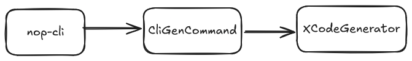
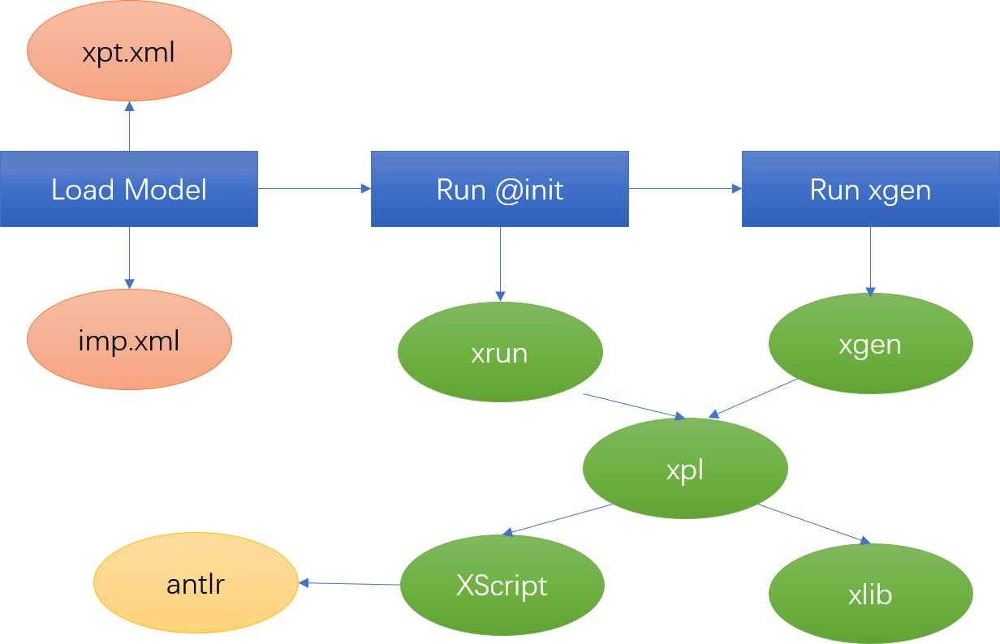
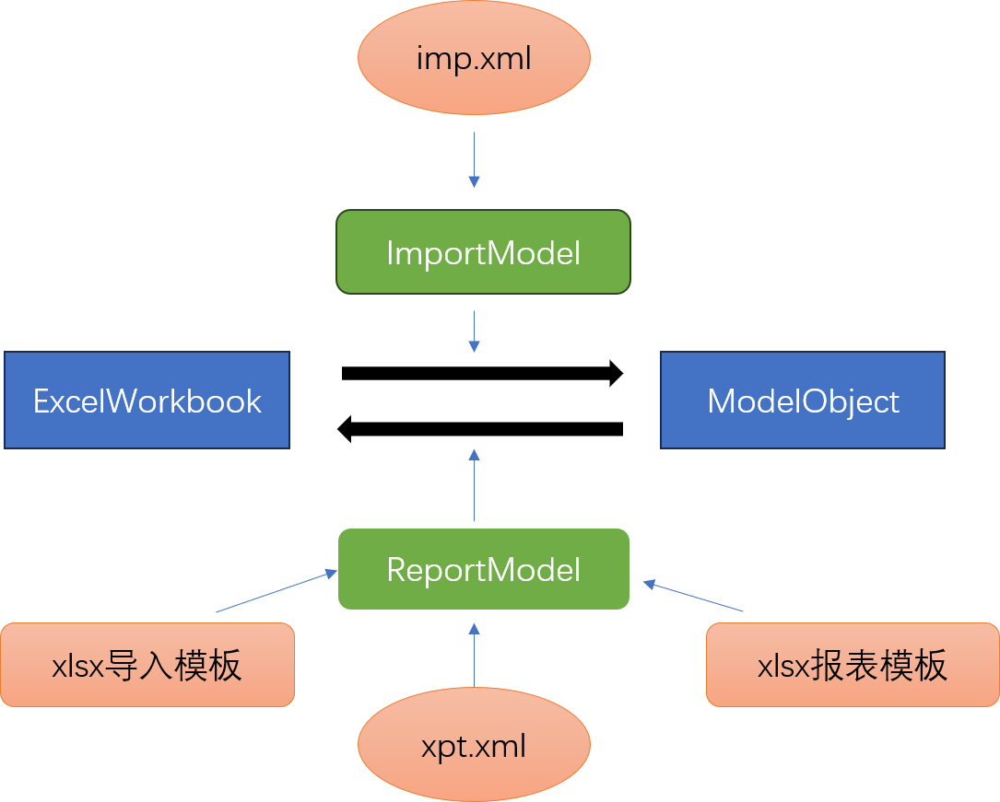
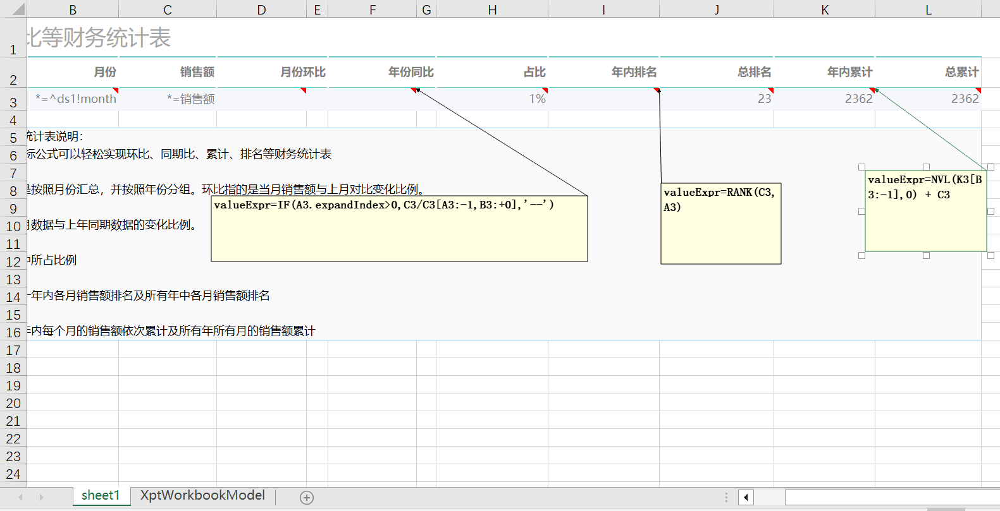

# 那些在Nop代码生成器中用到的DSL

Nop平台基于所谓的可逆计算理论从零开始编写，它的整体实现可以看作是如下软件构造公式在不同抽象层面的反复应用

> `App = Delta x-extends Generator<DSL>`

为了将这个抽象公式落实为具体的技术实现，Nop平台内置了一系列的通用机制，用于实现Generator，定义DSL（Domain Specific Language），拆分、合并Delta等。这里需要强调的是，Nop平台相比于传统技术的本质性区别在于，它所提供的是可逆计算理论指导下的**通用解决方案**。在传统的技术视角下，DSL的设计完全是一种AdHoc式的边缘领域解决方案，是否有用全凭运气，完全通用的东西更是压根不存在。我们经常可以看到如下说法

> 自己重新定义一套DSL，去取代开发人员已经熟悉的java语言，哪来的自信比设计语言的大师更高明？更何况开发过程还需要各种IDE、debug环境与工具

正所谓人无法理解他尚未理解的事物。因为目前主流技术体系没有解决方案，所以导致很多人认为某个问题不存在通用解，更进而会认为某些问题压根不存在或不需要被解决：**不能被解决的问题会被潜意识的认为是不需要被解决的**。

Nop平台的设计目标是成为一个通用的领域语言工作台(Domain Specific Language Workbench)，也就是说，它为创建新的领域语言提供了一系列的技术支持，力争将开发新的领域语言的成本降到最低。领域特定语言最重要的部分是它的语义结构（存在哪些领域特有的原子概念，以及这些概念之间如何相互作用），而表观的语法形式其实是一个次要问题。**设计并实现一个DSL并不需要从零开始，而是可以复用一系列的通用基础设施**。Nop的出现是通用语言设计发展到顶峰之后的自然结果，是通用语言自身基础设施标准化之后的进一步发展。实际上，在2024年开发一个新的通用语言，其成本已经远远小于20年前，比如Moonbit这样的十多人的小团队就可以开发新的语言。而开发一个DSL语言的运行时没有通用语言那样严苛的性能要求，可以通过Generator翻译为通用语言，其成本更是远小于开发一个通用语言。

Nop平台系统化的使用DSL来解决传统软件工程中的问题，这也导致它引入了大量的自定义DSL，在不熟悉Nop的同学看来，可能就是一堆xdef、xpl、xrun、xdsl，甚至还用上了antlr，这么多不同后缀名的DSL文件到底怎么协同工作的？本文就以XCodeGenerator的执行过程为例，讲解一下Nop平台代码生成器中用到的各种DSL。

## 一. XCodeGenerator的执行过程

  `App = Delta x-extends Generator<DSL>`这个公式中提到的Generator是一个抽象概念，它泛指一切针对领域结构的抽象变换机制，具体的表现可以是一个独立的代码生成工具，也可以是某种内置在程序语言内部的宏函数(Macro Function)和元编程(Meta Programming)机制。XCodeGenerator是Nop平台内置的一个通用代码生成器。

> 参见[地表最强的模型驱动代码生成器NopCodeGen](https://mp.weixin.qq.com/s/rd36AFh5pmjwtRFmApRswg)

一般情况下我们可以通过maven插件调用XCodeGenerator


也可以通过nop-cli命令行工具来调用XCodeGenerator



当我们通过命令行执行`java -jar nop-cli.jar gen model/test.orm.xlsx -t=/nop/templates/orm`命令时，它实际执行的逻辑用伪代码表达：

```javascript
   templateDir = "/nop/templates/orm"
   modelPath = "model/test.orm.xlsx"
   // 通过参数指定执行的模板目录和输入文件目录
   codegen = new XCodeGenerator(templateDir, targetDir);
   codegen.renderModel(modelPath, scope);
```

XCodeGenerator的renderModel函数执行逻辑用伪代码表达：

```javascript
void renderModel(modelPath,scope){
   // 解析模型文件得到模型对象
   codeGenModel = ResourceComponentManager.instance().loadComponentModel(modelPath);
   // 设置到上下文环境中
   scope.setLocalValue("codeGenModel", codeGenModel);
   // 执行代码生成模板
   execute(scope);
}
```

XCodeGenerator的execute函数用伪代码表示：

```javascript
void execute(scope){
    // 执行templateDir根目录下的init文件
    runInitFile("@init.xrun",scope);
    // 获取到init初始化代码所创建的NestedLoop循环模型对象
    codeGenLoop = scope.getValue("codeGenLoop");
    // 递归遍历每一个模板路径templatePath
    //   使用NestedLoop.loopForVars(templatePath)来确定每个模板文件循环生成多少次
    //   针对每一个循环变量组合，执行一次代码生成逻辑
    processDir(codeGenLoop)
}
```

XCodeGenerator用到了如下DSL


## 二. 解析Excel文件得到ExcelWorkbook

Nop平台解析Excel文件没有使用Apache POI库，而是从零开始实现xlsx文件格式解析器ExcelWorkbookParser。

```javascript
ExcelWorkbook wk = new ExcelWorkbookParser().parseFromFile(file);
```

ExcelWorkbook是Nop平台中针对Excel数据表格模型所定义的模型对象。它提供了对于Excel模型的一种简化描述，可以从xlsx文件解析得到ExcelWorkbook，也可以根据ExcelWorkbook来生成xlsx。

```javascript
new ExcelTemplate(wk).generateToFile(file, XLang.newEvalScope());
```

ExcelWorkbook只支持Excel的一些基本特性（包括样式、图片等），大量高级特性并不支持。但是对于一般应用而言，ExcelWorkbook提供的信息已经足够丰富，作为报表导入导出而言一般不需要使用Excel的高级特性。

Nop平台区别于其他平台技术的一个典型特点是：**所有模型对象都有对应的DSL格式，而所有的DSL都有对应的XDef元模型定义**。举例来说，ExcelWorkbook是对表格数据模型的建模结果，它和Excel并不是绑定关系。Excel仅仅是ExcelWorkbook的一种序列化形式，它还可以序列化为一个更加简单的xpt.xml模型文件。

```javascript
ExcelWorkbook wk = (ExcelWorkbook) DslModelHelper.loadDslModel(resource);
DslModelHelper.saveDslModel("/nop/schema/excel/workbook.xdef",
                  wk, targetResource);
```


1. 首先定义workbook.xdef元模型，然后根据它自动生成ExcelWorkbook模型类的代码。

2. 根据workbook.xdef中的信息，可以将ExcelWorkbook保存为xpt.xml模型文件，并实现反向解析。所有使用xdef定义的DSL模型都可以自动实现解析和序列化。**如果类比于JSON序列化 = 对象+注解， 那么 DSL序列化 = 对象 + XDef**。因为Nop平台中XML和JSON可以互相转换。所以DSL模型虽然一般保存为XML格式，但也可以选择保存为YAML、JSON等格式。前台可视化设计器编辑的JSON对象可以自动保存为XML格式。**Nop平台强调的是同一信息具有多种展现形式（多重表象），在不同的展现形式之间可以自动进行可逆转换**。

3. ExcelWorkbook和xlsx文件格式之间的相互转换通过ExcelWorkbookParser和ExcelTemplate来实现。Nop平台没有使用POI库，而是自行解析xlsx文件（xlsx文件本质上是将一堆xml文件打包成一个zip文件）。需要注意的是，**Nop平台没有使用Java内置的XML解析器也没有使用XML标准中规定的DOM节点接口**，而是使用从零开始编写的XNodeParser和自定义的XNode结构。

> 一直有人对于Nop平台大量使用XML格式耿耿于怀，认为XML早已过时，凡是使用XML的技术都属于落后于时代潮流。但实际情况是，XML格式本身并没有太大的问题，使用XML遇到的很多问题本质上是来源于一系列XML规范和这些规范的实现过于臃肿繁琐。Nop平台通过自行实现XML结构的解析器、转换器等很自然的就避免了相关问题。参见[为什么Nop平台坚持使用XML而不是JSON或者YAML](https://zhuanlan.zhihu.com/p/651450252)

这里有一个需要注意的地方是ExcelWorkbook对应的DSL文件格式一般是`xpt.xml`，即所谓的Xpt报表模型文件。因为在Nop平台的设计中，一个没有任何动态展开逻辑的Excel文件也是一个合法的报表模板文件，所以任何ExcelWorkbook都可以直接作为一个合法的`xpt.xml`来保存。

## 三. 解析ExcelWorkbook得到ModelObject

Nop平台大量使用模型来表达需求信息，比如使用数据模型来定义数据库结构，使用API模型来定义后台服务接口等，这些模型都可以用XML格式的DSL来表达。但是XML是一种技术人员比较熟悉的语言，业务人员更熟悉的是Excel，如果能够让业务人员在Excel中直接编辑和查看模型信息，就可以直接将需求文档作为代码生成工具的输入，确保模型永远和代码保持一致。

Nop平台提供了一个通用的[ImportExcelParser](https://gitee.com/canonical-entropy/nop-entropy/blob/master/nop-excel/src/main/java/io/nop/excel/imp/ImportExcelParser.java)，它可以根据`ImportModel`导入模型配置来自动解析ExcelWorkbook得到模型对象。解析的过程中会进行细致的字段验证，并且可以执行复杂的转换逻辑，如果发现错误会提示具体是哪个单元格因为什么原因报错。



传统的做法中，解析Excel总是需要针对特定的格式需求编写特定的解析代码，最终要求Excel的格式也必须严格的和解析时确定的格式一致。一些语义上保持不变的操作，比如增加空行、调整单元格顺序等，都会破坏解析代码，导致解析失败。

Nop平台提供的是一个通用解析器，它会根据ImportModel模型给出的信息来决定如何解析一个ExcelWorkbook对象，从它的单元格中解析出字段值，并执行转换和验证逻辑，最后组装出一个强类型的Java对象。在反方向上，对于一个给定的ModelObject，借助于ReportModel给定的信息，我们利用NopReport报表引擎来生成ExcelWorkbook对象。

需要注意的是，这里的转换逻辑比JSON序列化复杂，因为解析得到的模型对象丢失了Excel格式和布局信息，它和ExcelWorkbook的相互转换在两个方向上是不对称的，可以看作是JSON序列化的一种非对称扩展。

> **ExcelWorkbook  + ImportModel => ModelObject** 
> 
> **ModelObject + ReportModel => ExcelWorkbook**

ImportModel是ImportExcelParser在运行时所使用的模型信息，它可以保存为imp.xml文件，以DSL的形态存在。

### 报表模型ReportModel

Nop平台提供了一个支持复杂行列展开算法和层次坐标的中国式报表引擎，参见[NopReport:采用Excel作为设计器的开源中国式报表引擎 ](https://mp.weixin.qq.com/s/_nKUiryetF2O5zSrPfU8FQ)。根据ModelObject来生成Excel的时候，一般不是简单的将属性值填到指定位置的单元格中，而是有可能具有复杂的嵌套子对象列表，需要执行判断、循环等操作动态生成行甚至生成列。因此根据ModelObject来生成ExcelWorkbook的时候实际上是通过NopReport报表引擎来执行。

ReportModel在NopReport引擎的实现中，是在ExcelWorkbook的基础上增加报表展开计算所需要的模型信息。

> ReportModel = ExcelWorkbook + XptWorkbookModel

Nop平台对于ReportModel提供了多种表达方式：

1. 通过xpt.xml这种DSL模型文件来表达，可以解析`xpt.xml`来获取ReportModel。而`xpt.xml`通过`workbook.xdef`元模型来实现约束。

2. NopReport也提供了以Excel为载体的模型定义方式，支持在普通的Excel文件中通过注解引入额外的配置。

3. 第三种ReportModel的定义方式是根据`imp.xml`导入模型配置，结合一个空的template模板，自动推导得到一个ReportModel。



## 四. 统一的模型加载器

Nop平台中引入了大量的模型文件格式，同一个模型还可以对应于多种模型文件格式。比如说orm模型可以保存在`nop-auth.orm.xlsx`这种Excel文件中，也可以保存在`app.orm.xml`这种XML格式的DSL文件中。

Nop平台所提供的是一种所谓的面向语言（Language Oriented Programming）的编程范式，即在解决业务问题之前，我们先定义一个针对当前业务领域的DSL，然后再用这个DSL去解决业务问题。为了统一管理大量的DSL，Nop平台提供了统一的模型加载器。

```javascript
model = ResourceComponentManager.instance().loadComponentModel(path)
```

我们可以用ResourceComponentManager来加载所有模型文件。那么，ResourceComponentManager又是怎么知道文件和模型格式之间的对应关系的呢？不出意料，**Nop的标准套路是引入一个新的`register-model.xml`注册模型**。

```xml
<!-- orm.register-model.xml -->
<model x:schema="/nop/schema/register-model.xdef" xmlns:x="/nop/schema/xdsl.xdef"
       name="orm">
    <loaders>
        <xlsx-loader fileType="orm.xlsx" impPath="/nop/orm/imp/orm.imp.xml"/>
        <xdsl-loader fileType="orm.xml" schemaPath="/nop/schema/orm/orm.xdef"/>
    </loaders>
</model>
```

Nop平台启动的时候，会自动扫描虚拟文件目录中满足`/nop/core/registry/*.register-model.xml`模式的所有文件，并自动注册文件后缀名到模型解析器的映射关系。

在上面的例子中，以`orm.xlsx`为后缀的文件，将会使用ImportExcelParser解析，解析的时候使用的ImportModel信息来源于`/nop/orm/imp/orm.imp.xml`。而以`orm.xml`的后缀名的文件，将使用DslModelParser来解析，解析时使用的XDefinition元模型对象来源于`/nop/schema/orm/orm.xdef`。

## 五. 执行代码生成模板

代码生成模板中用到的xrun，xgen等文件格式，本质上都是XPL模板语言文件。

```xml
<!-- xpl.register-model.xml -->
<model x:schema="/nop/schema/register-model.xdef" xmlns:x="/nop/schema/xdsl.xdef"
       name="xpl">

    <loaders>
        <loader fileType="xpl" class="io.nop.xlang.xpl.loader.HtmlXplModelLoader"/>
        <loader fileType="xgen" class="io.nop.xlang.xpl.loader.HtmlXplModelLoader"/>
        <loader fileType="xrun" class="io.nop.xlang.xpl.loader.NoneXplModelLoader"/>
    </loaders>

</model>
```

通过`xpl.register-model.xml`文件可以很明确的看出它们之间的关系和区别。

* xpl和xgen是一回事，只是在代码生成中使用时，xgen是一个被特殊识别的后缀，它执行完毕之后产生的文件会去除xgen后缀。例如`test/a.java.xgen`会生成`test/a.java`。

* xrun也是xpl模板文件，但是它不允许输出，仅仅用于执行代码。

**调试模式下，Nop平台启动时会在`/nop/main/registry/app.registry.xml`文件中输出所有register-model的内容。可以查看这个文件来获知统一模型加载器能够识别的所有文件后缀**。

### XLang语言

xpl模板语言是整个XLang语言家族的一部分，而XLang语言是Nop平台的一个关键基础设施，它提供了一系列的子语言，共同形成一个内置支持差量概念、支持编译期元编程，支持`Delta x-extends Generator<DSL>`这样一种计算模式的程序语言族。具体介绍参见[xlang.md](https://gitee.com/canonical-entropy/nop-entropy/blob/master/docs/dev-guide/xlang/xlang.md)。


* Xpl模板语言支持类似Vue标签的标签库机制，标签库使用Xlib这个DSL来表达

* Xpl模板语言可以通过内置的`<c:script>`标签调用XScript脚本语言

* XScript是一种语法类似TypeScript的脚本语言，它的解析器通过antlr工具生成。

* Nop在Antlr的基础上做了扩展工作，可以自动生成AST的解析器，而不仅仅是内置的ParseTree解析器，参见[Antlr4如何自动解析得到AST而不是ParseTree](https://zhuanlan.zhihu.com/p/534178264)

* 生成XLangASTParser的时候需要使用XCodeGenerator，而这个时候又会用到XScript。也就是说生成XScript解析器的时候需要使用XScript语法，这里会出现循环依赖。Nop平台是先手写XLangASTParser和XLangASTBuildVisitor，完成最基本的代码生成器后，再逐步改成自动生成XLangASTParser和XLangASTBuildVisitor。

* Nop平台中**所有XML格式的文件都使用xdef元模型来定义自己的结构，它们统称为XDSL**。比如xpl模板语言对应于xpl.xdef，而标签库xlib对应于xlib.xdef。

* XDef元模型本身也通过`xdef.xdef`来进行约束，但是在具体实现层面XDefinitionParser解析XDef模型文件的时候是手工编写的，并没有使用自动解析，否则解析XDef需要先解析`xdef.xdef`会导致循环。

* Xpl虽然采用XML语法，但是它解析后得到的抽象语法树AST与XScript是一致的，都是XLangAST。
  
  ```xml
  <c:unit>
     <c:for var="x" items="${list}">
        ...
     </c:for>
     <c:script>
        for(let x of list){
           // ... 
        }
     </c:script>
  </c:unit>
  ```
  
  上面的`<c:for>`标签和`<c:script>`标签中的for语句解析得到的都是ForOfStatement。

## 六. DSL背后的统一结构构造规律

Nop不仅仅是一种具体的开发框架，**它更是一种新的思维方式**。Nop解决问题的方式是先定义一个DSL语言去建立局部的描述框架，相当于是在广袤的模型空间中建立一个个的据点，然后不同的模型之间再建立自动转换的技术路径，通过完全自动化的推理就可以在模型空间中自由通行。传统的编程方案中，每个结构之间都需要手工编写代码建立联系，而在Nop的世界中，通过更高层次的元模型来俯瞰世界，发现林林总总的DSL背后存在着统一的分解、合并、转换规律，我们可以针对元模型进行统一的逻辑编写，然后自动适应于每一个特定的模型对象。

现有的低代码平台所做的工作都是试图建立一些AdHoc的开发模型，然后想着如何改善可视化编辑器，让用户更简单的可以使用编辑器去配置模型。但是Nop所思考的是完全不同的问题，它所关心的是所有模型背后的构造规律是什么，如何自动推导得到可视化设计器，如何自动推导实现模型之间的自由转换。
