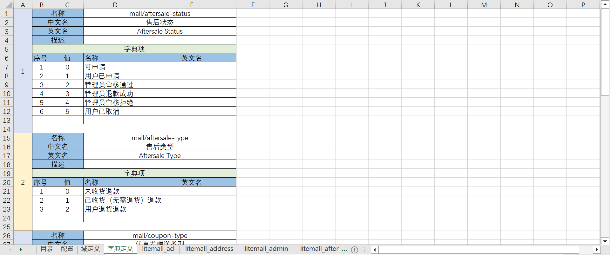
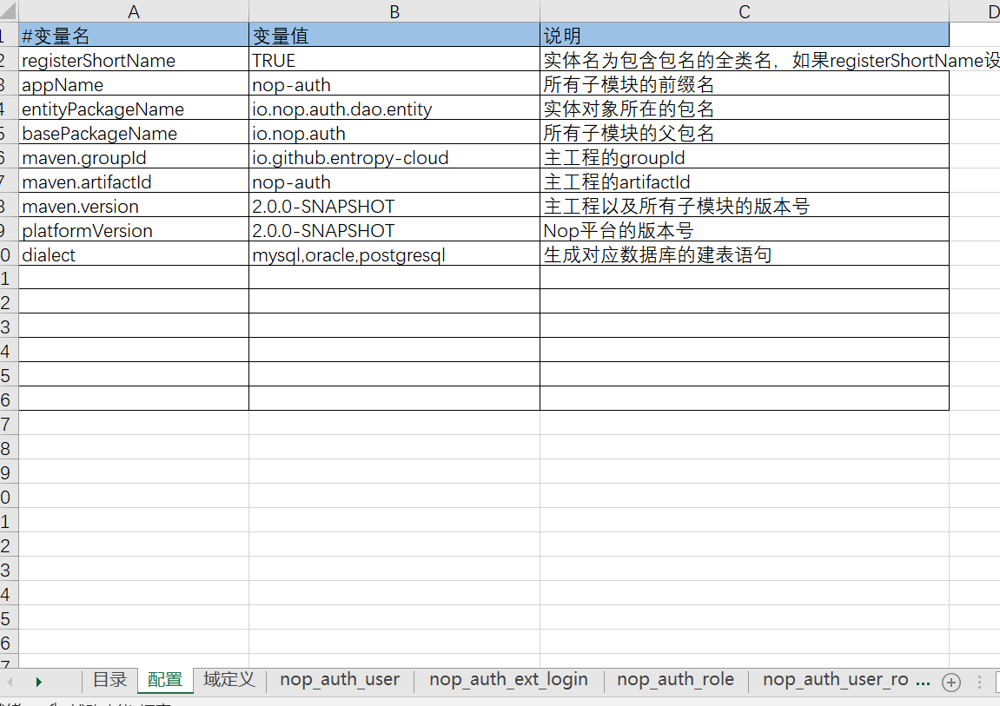
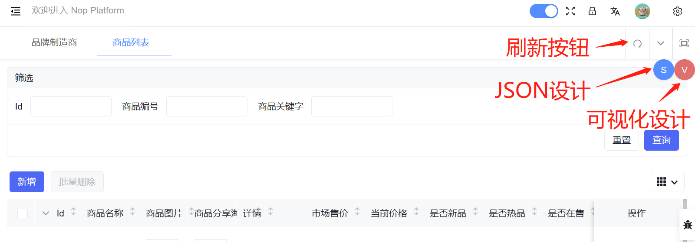
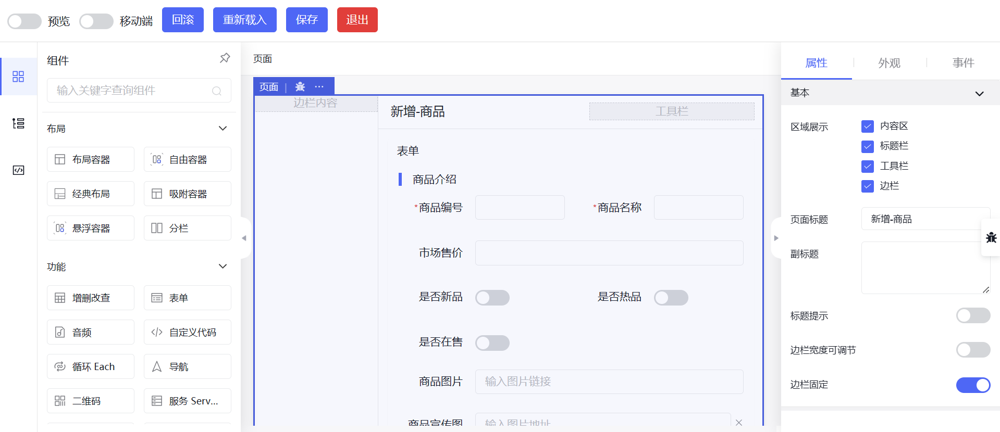
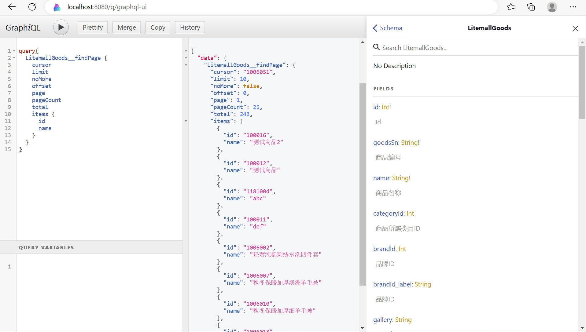
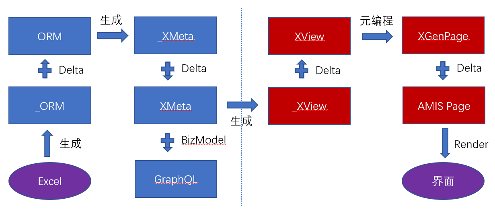

# 开发示例

操作演示视频：[使用Nop平台开发商品列表页面的完整示例](https://www.bilibili.com/video/BV1384y1g78L/)

Nop平台是可逆计算理论的一个具体落地实现方案。为了演示可逆计算理论的相关概念，它内置了针对后台管理系统的一套低代码开发流程，可以采用低代码的方式来快速开发后台管理系统，并且无需特殊设计，利用平台内置机制即可自动提供产品化定制能力。以下以`nop-app-mall`项目的开发为例，介绍Nop平台内置的低代码开发流程。

> `nop-app-mall`是一个简单电子商城的示例应用，项目工程为 [nop-app-mall](https://gitee.com/canonical-entropy/nop-app-mall)

> Nop平台开源网址：
>
> * gitee: [https://gitee.com/canonical-entropy/nop-entropy](https://gitee.com/canonical-entropy/nop-entropy)
> * github: [https://github.com/entropy-cloud/nop-entropy](https://github.com/entropy-cloud/nop-entropy)

## 一. 设计Excel数据模型

首先需要设计一个Excel格式的数据模型，在其中定义数据库表、字段以及表关联信息。


在Excel模型中我们可以指定如下信息：

1. 标签：用于对表、字段等进行额外标记，例如`seq`表示字段值使用`SequenceGenerator`自动生成，`var`表示字段值会初始化为随机值，在自动化单元测试中需要被标记为动态变量。

2. 显示：控制字段是否显示，是否允许更新等。前端自动生成列表和表单页面时会参考这里提供的信息。

3. 数据域：对于具有特殊业务语义的字段类型，可以为它指定一个特定的数据域，系统识别该数据域之后可以统一进行处理。例如`domain=createTime`表示该字段为创建时间字段，新建实体的时候会自动初始化为当前时间。

4. 字典：通过数据字典来限制字典的值只能在限定选项范围之内。字典可以是Java中的`enum`类，例如`io.nop.xlang.xdef.XDefOverride`。也可以在yaml文件中定义，例如`mall/aftersale-status`对应于`/nop/dict/mall/aftersale-status.dict.yaml`文件。

5. 表关联：通过【关联列表】可以配置表之间的关联关系。【属性名】是子表实体中对应父实体的属性名，而【关联属性名】是父实体中对应子表实体集合的属性名。例如部门表中`parentId`这个关联字段对应的【属性名】为`parent`，【关联属性名】为`children`。如果不需要通过ORM引擎来访问实体集合，则不需要配置关联属性名。

字典表可以在Excel模型中直接定义，代码生成的时候会自动根据模型生成`dict.yaml`定义字典文件。



更详细的配置说明可以参见文档 [excel-model.md](../dev-guide/model/excel-model.md)

### 逆向工程

操作视频: [如何通过逆向工程生成Excel格式的数据模型](https://www.bilibili.com/video/BV1Rc411u79d)

除了手工编写数据库模型之外，我们也可以连接已有的数据库，使用`nop-cli`命令行工具逆向分析数据库结构，生成Excel模型。

```shell
java -Dfile.encoding=UTF8 \
    -jar nop-cli.jar \
    reverse-db litemall \
    -c=com.mysql.cj.jdbc.Driver \
    --username=litemall \
    --password=litemall123456 \
    --jdbcUrl="jdbc:mysql://127.0.0.1:3306/litemall?useUnicode=true&characterEncoding=utf-8&useSSL=true&serverTimezone=UTC"
```

`nop-cli`的`reverse-db`命令需要传入参数【数据库模式名】，例如`litemall`，然后通过`jdbcUrl`等选项传入JDBC连接字符串等信息。

逆向工程得到`orm.xlsx`模型文件后，需要调整【配置】表单页中的maven模块名、包名等信息。



### 导入PowerDesigner模型或者PDManer模型

通过`nop-cli`工具的`gen-orm-excel`命令可以根据PowerDesigner设计工具的pdm物理模型来生成Excel数据模型。

```shell
java -Dfile.encoding=UTF8 -jar nop-cli.jar gen-orm-excel model/test.pdm
```

PowerDesigner是收费软件，它的一个开源替代品是[PDManer元数据建模工具](https://gitee.com/robergroup/pdmaner)。

通过`nop-cli`工具也可以根据PDManer的模型文件来生成Excel数据模型

```shell
java -Dfile.encoding=UTF8 -jar nop-cli.jar gen-orm-excel model/test.pdma.json
```

按照可逆计算理论，Pdm模型、PDManer模型与Excel模型一样都只是ORM领域模型的一种可视化表象，**这些表象包含同样的信息，原则上可以互相转换**。利用Nop平台中的元编程能力，我们可以在编译期根据Pdm模型自动生成orm模型文件，这样就可以直接使用PowerDesigner或者PDManer作为Nop平台中ORM模型的可视化设计工具。

```xml
<!-- app.orm.xml -->
<orm x:schema="/nop/schema/orm/orm.xdef"
     x:extends="base.orm.xml" x:dump="true"
     xmlns:x="/nop/schema/xdsl.xdef" xmlns:xpl="/nop/schema/xpl.xdef">
    <x:gen-extends>
        <pdman:GenOrm src="test.pdma.json" xpl:lib="/nop/orm/xlib/pdman.xlib"
                      versionCol="REVISION"
                      createrCol="CREATED_BY" createTimeCol="CREATED_TIME"
                      updaterCol="UPDATED_BY" updateTimeCol="UPDATED_TIME"
                      tenantCol="TENANT_ID"
        />
    </x:gen-extends>
</orm>
```

`x:gen-extends`是编译期运行机制，在装载`app.orm.xml`这个模型文件的过程中，会根据`x:gen-extends`中定义的Xpl模板来动态生成可继承的基础模型，然后再使用`x-extends`合并算法对继承的内容执行差量修正。

> `x:gen-extends`机制是XLang语言的内置语法，它的详细介绍参见 [xdsl.md](../dev-guide/xlang/xdsl.md)

## 二. 生成初始工程代码

如果已经获得Excel数据模型，则可以使用`nop-cli`命令行工具的`gen`命令来生成初始工程代码

```shell
java -jar nop-cli.jar gen model/app-mall.orm.xlsx -t=/nop/templates/orm
```

具体生成的内容如下:

```
├─app-mall-api       对外暴露的接口定义和消息定义
├─app-mall-codegen   代码生成辅助工程，根据ORM模型更新当前工程代码
├─app-mall-dao       数据库实体定义和ORM模型
├─app-mall-service   GraphQL服务实现
├─app-mall-web       AMIS页面文件以及View模型定义
├─app-mall-app       测试使用的打包工程
├─deploy             根据Excel模型生成的数据库建表语句
```

Nop平台提供了与Maven相集成的代码生成能力，只需要在pom文件中增加如下配置：

```xml
<pom>
    <parent>
        <artifactId>nop-entropy</artifactId>
        <groupId>io.github.entropy-cloud</groupId>
        <version>2.0.0-SNAPSHOT</version>
    </parent>

    <build>
        <plugins>
            <plugin>
                <groupId>org.codehaus.mojo</groupId>
                <artifactId>exec-maven-plugin</artifactId>
            </plugin>
        </plugins>
    </build>
</pom>
```

> 如果不从`io.github.entropy-cloud:nop-entropy`模块的pom文件继承，则需要为`exec-maven-plugin`插件增加更多详细配置

在使用maven打包功能时，会自动执行工程的`precompile`和`postcompile`目录下的`xgen`代码，其中`precompile`在compile阶段之前执行，执行环境可以访问所有依赖库，但是不能访问当前工程的类目录，而`postcompile`在compile阶段之后执行，可以访问已编译的类和资源文件。例如`app-mall-codegen`模块的`precompile/gen-orm.xgen`文件内容如下

```xml
<c:script>
// 根据ORM模型生成dao/entity/xbiz
codeGenerator.withTargetDir("../").renderModel('../../model/app-mall.orm.xlsx','/nop/templates/orm', '/',$scope);
</c:script>
```

以上指令相当于手工执行`nop-cli gen`命令，因此**一旦生成初始工程，此后即可通过maven打包来根据Excel数据模型更新当前工程的代码，而不再需要使用nop-cli工具**。Nop平台采用了增量式的代码生成设计，重新生成并不会破坏手工调整的业务代码。具体原理参见文章

[数据驱动的代码生成器](https://zhuanlan.zhihu.com/p/540022264)

为了方便调试，初始生成的代码中包含`AppMallCodeGen.java`和`AppMallWebCodeGen.java`两个测试类，可以在IDEA中直接启动来执行代码生成。

根据ORM模型生成的代码包含从前端到后端的全套代码，可以使用`mvn install`指令来直接编译运行。无需额外配置，通过如下指令即可启动测试应用：

```shell
mvn clean install -DskipTests -Dquarkus.package.type=uber-jar

java -Dfile.encoding=UTF8 \
    -Dquarkus.profile=dev \
    -jar app-mall-app/target/app-mall-app-1.0-SNAPSHOT-runner.jar
```

`app-mall-app`使用内置的H2内存数据库启动，并且启动的时候会自动根据ORM模型创建数据库表，缺省用户`nop`，密码`123`。

## 三. 配置菜单和访问权限

自动生成的代码中包含权限定义文件：`app-mall-web/src/resources/_vfs/app/mall/auth/_app-mall.action-auth.xml`，其中为每个后台实体定义了缺省的菜单项，对应于标准增删改查页面。

在`app-mall.action-auth.xml`文件中可以手动添加新的菜单项，也可以标记删除自动生成的菜单项。

```xml
 <resource id="goods-manage" displayName="商品管理" icon="ion:grid-outline" resourceType="TOPM"
           routePath="/goods-manage" component="layouts/default/index">
     <children>
         <resource id="mall-goods-list" displayName="商品列表"
                   icon="ant-design:appstore-twotone" component="AMIS"
                   resourceType="SUBM" url="/app/mall/pages/LitemallGoods/main.page.yaml"/>
         <resource id="mall-goods-create" displayName="商品上架"
                   icon="ant-design:appstore-twotone" component="AMIS"
                   resourceType="SUBM" url="/app/mall/pages/LitemallGoods/add.page.yaml"/>
         <resource id="mall-goods-comment" displayName="商品评论"
                   icon="ant-design:appstore-twotone" component="AMIS"
                   resourceType="SUBM" url="/app/mall/pages/LitemallComment/main.page.yaml"/>
     </children>
 </resource>
```

菜单结构采用`jeecgboot`项目的设计，顶层菜单配置`resourceType=TOPM`，`component=layouts/default/index`，而具体页面配置`resourceType=SUBM`，`component=AMIS`，`url`配置为页面文件的虚拟路径。

## 四. 完善后端服务

Nop平台会自动根据Excel数据模型生成Meta元数据描述文件和相应的GraphQL服务对象，**通过简单配置即可实现功能完备的GraphQL后台服务**。对比`app-mall`项目中的`LitemallGoodsBizModel.java`和原始`litemall`项目中的`AdminGoodsService.java`实现类，可以很明显的发现Nop平台可以避免大量重复性代码，一般只需要表达偏离标准增删改查逻辑的差量逻辑即可。

### 4.1 增加实体函数

仅依赖于实体字段的固定逻辑可以直接实现为实体对象的方法。例如，商品表上`retailPrice`字段对应于相关产品的最低价。

```java
class LitemallGoods extends _LitemallGoods{
    /**
     * retailPrice记录当前商品的最低价
     */
    public void syncRetailPrice() {
        LitemallGoodsProduct minProduct = Underscore.min(getProducts(), LitemallGoodsProduct::getPrice);
        BigDecimal retailPrice = minProduct == null ? minProduct.getPrice() : new BigDecimal(Integer.MAX_VALUE);
        setRetailPrice(retailPrice);
    }
}
```

借助于NopOrm数据访问引擎，可以很方便的直接访问到关联对象集合。

> 所有关联对象和关联对象集合都是延迟加载的。可以利用`BatchLoadQueue`机制提前预加载，从而避免Hibernate中常见的N+1问题。具体参见 [orm.md](../dev-guide/orm/orm.md)

### 4.2 增加增删改查补充逻辑

Nop平台利用XMeta文件中定义的描述信息已经可以自动实现增删改查的全部逻辑，例如:

1. 根据元数据配置自动验证参数的合法性（是否非空、是否在字典表范围内、是否满足格式要求等）

2. 实现复杂查询条件以及分页、排序

3. 一次性提交主子表信息，自动识别对子表数据的变更

4. 启用逻辑删除时自动增加`deleted=false`查询条件

5. 验证唯一键约束没有被破坏，例如商品名称不允许重复

6. 自动记录创建人、创建时间、修改人、修改时间等

7. 删除当前实体时，自动删除所有标记为`cascade-delete`的关联对象

当我们需要对标准的增删改查逻辑进行增强时，可以在`CrudBizModel`的派生类中覆写`defaultPrepareSave`等函数。例如在保存商品信息的时候，自动同步商品上的冗余字段`retailPrice`。

```java
@BizModel("LitemallGoods")
public class LitemallGoodsBizModel extends CrudBizModel<LitemallGoods> {
    public LitemallGoodsBizModel() {
        setEntityName(LitemallGoods.class.getName());
    }

    @Override
    protected void defaultPrepareSave(EntityData<LitemallGoods> entityData, IServiceContext context) {
        entityData.getEntity().syncRetailPrice();
    }

    @Override
    protected void defaultPrepareQuery(QueryBean query, IServiceContext context) {
        TreeBean filter = query.getFilter();
        if (filter != null) {
            TreeBean keywordsFilter = filter.childWithAttr("name", LitemallGoods.PROP_NAME_keywords);
            if (keywordsFilter != null) {
                Object value = keywordsFilter.getAttr("value");
                TreeBean orCond = or(contains(LitemallGoods.PROP_NAME_name, value), contains(LitemallGoods.PROP_NAME_keywords, value));
                filter.replaceChild(keywordsFilter, orCond);
            }
        }
    }
}
```

上面的示例代码中还覆写了`defaultPrepareQuery`函数，在这个函数中我们对前台提交的复杂查询条件进行变换，例如前台提交`keywords`查询字段，可以被变换为同时对数据库表中的`keywords`和`name`字段进行模糊查询。

### 4.3 增加数据库访问

如果在Excel模型中为数据库表增加了`mapper`标签，则会自动生成一个`sql-lib.xml`文件以及一个`Mapper`接口，我们可以使用比MyBatis更方便、更强大的`SqlLibManager`机制来实现数据库访问。`sql-lib`文件支持使用EQL对象查询语法或者原生的SQL语法。EQL对象查询语法通过Dialect模型可以适配到大多数关系型数据库，因此一般推荐尽量使用EQL语法。

```xml
<!-- LitemallGoods.sql-lib.xml -->
<sql-lib x:schema="/nop/schema/orm/sql-lib.xdef" xmlns:x="/nop/schema/xdsl.xdef">

    <sqls>
        <eql name="syncCartProduct" sqlMethod="execute">
            <arg name="product"/>

            <source>
                update LitemallCart o
                set o.price = ${product.price},
                  o.goodsName = ${product.goods.name},
                  o.picUrl = ${product.url},
                  o.goodsSn = ${product.goods.goodsSn}
                where o.productId = ${product.id}
            </source>
        </eql>
    </sqls>
</sql-lib>
```

与MyBatis类似，在`sql-lib`的`source`段中EL表达式会被自动替换为sql参数，并且因为EQL语法可以根据ORM模型推导字段类型，所以并不需要像MyBatis那样为每个表达式指定JDBC参数类型。详细文档参见[sql-lib.md](../dev-guide/orm/sql-lib.md)

在Mapper接口中增加对应java方法：

```java
@SqlLibMapper("/app/mall/sql/LitemallGoods.sql-lib.xml")
public interface LitemallGoodsMapper {

    void syncCartProduct(@Name("product") LitemallGoodsProduct product);
}
```

Nop平台中的`IEntityDao`接口类似于Spring中的`JpaRespository`，但是它提供了更多的功能。详细文档参见[dao.md](../dev-guide/orm/dao.md)

### 4.4 增加GraphQL的Query/Mutation/Loader

通过为普通Java方法增加`@BizQuery/@BizMutation/@BizLoader`注解即可将其转化为GraphQL的服务方法。

```java
@BizModel("NopAuthRole")
public class NopAuthRoleBizModel extends CrudBizModel<NopAuthRole> {
    public NopAuthRoleBizModel() {
        setEntityName(NopAuthRole.class.getName());
    }

    @BizLoader
    @GraphQLReturn(bizObjName = "NopAuthUser")
    public List<NopAuthUser> roleUsers(@ContextSource NopAuthRole role) {
        return role.getUserMappings().stream().map(NopAuthUserRole::getUser)
                .sorted(comparing(NopAuthUser::getUserName)).collect(Collectors.toList());
    }

    @BizMutation
    public void removeRoleUsers(@Name("roleId") String roleId,
                                @Name("userIds") Collection<String> userIds) {
        removeRelations(NopAuthUserRole.class,
                "roleId", "userId",
                roleId, userIds);
    }
}
```

`@BizLoader`表示为指定对象增加扩展属性。例如`NopAuthRole`对象上并没有`roleUsers`属性，但只要在`xmeta`文件中增加该属性定义，然后定义一个`BizLoader`，所有返回`Role`对象的请求就都可以访问到该属性。例如

```groovy
query{
    NopAuthRole__get(id: 'admin'){
       name
       roleUsers
    }

    NopAuthRole__findPage(query:$query){
       name
       roleUsers
    }
}
```

graphql的详细文档参加[graphql-java.md](../dev-guide/graphql/graphql-java.md)

### 4.5 定义xbiz模型

Nop平台为 **无代码开发模式（NoCode）** 提供了内置支持。通过`xbiz`模型，我们可以在不修改Java源代码的情况下，在线增加、修改后台GraphQL模型中的`Query/Mutation/DataLoader`。

`xbiz`模型内置了有限自动机模型，一些简单的状态迁移逻辑无需在Java中编程，通过配置即可完成。例如简单的审批状态迁移等。

通过XDSL内置的`x:gen-extends`机制，我们可以通过一句话为`xbiz`模型引入工作流支持。

```xml
<biz>
   <x:gen-extends>
      <!-- 可以动态为业务对象生成工作流相关的后台服务函数-->
      <biz-gen:GenWorkflowSupport/>
   </x:gen-extends>
</biz>
```

> 目前工作流引擎的集成工作尚在初始阶段

## 五. 完善前端页面

### 5.1 细化表单和表格

视图大纲模型(`view.xml`)是与具体实现框架无关的、完全面向业务领域的一种前端DSL，它抽象出了`grid`、`form`、`layout`、`page`、`dialog`、`action`等关键要素，通过简单配置即可描述常见的增删改查逻辑，相比于面向通用页面的描述模型要紧凑得多。例如，调整商品对象的新增和修改页面时，我们只需要编写如下布局描述

```xml
<form id="edit" size="lg">
            <layout>
                ========== intro[商品介绍] ================
                goodsSn[商品编号] name[商品名称]
                counterPrice[市场价格]
                isNew[是否新品首发] isHot[是否人气推荐]
                isOnSale[是否上架]
                picUrl[商品页面商品图片]
                gallery[商品宣传图片列表，采用JSON数组格式]
                unit[商品单位，例如件、盒]
                keywords[商品关键字，采用逗号间隔]
                categoryId[商品所属类目ID] brandId[Brandid]
                brief[商品简介]
                detail[商品详细介绍，是富文本格式]

                =========specs[商品规格]=======
                !specifications

                =========goodsProducts[商品库存]=======
                !products

                =========attrs[商品参数]========
                !attributes

            </layout>
            <cells>
                <cell id="unit">
                    <placeholder>件/个/盒</placeholder>
                </cell>
                <cell id="specifications">
                    <!-- 可以通过gen-control直接指定字段所用控件 -->
                    <gen-control>
                        <input-table addable="@:true" editable="@:true"
                                     removable="@:true" >
                            ...
                        </input-table>
                    </gen-control>
                    <selection>id,specification,value,picUrl</selection>
                </cell>
                <cell id="products">
                    <!-- 可以引用外部view模型中的grid来显示子表 -->
                    <view path="/app/mall/pages/LitemallGoodsProduct/LitemallGoodsProduct.view.xml"
                          grid="ref-edit"/>
                </cell>
            </cells>
</form>
```

`layout`是一种专用的布局领域语言，它将布局信息和具体字段的展示控件信息分离开来。具体字段所使用的控件一般由数据类型或者数据域（`domain`）设置来推定，我们只需要补充布局信息即可实现页面展示。`layout`布局语言的详细介绍参见[layout.md](../dev-guide/xui/layout.md)

**根据表单和表格模型，Nop平台会自动分析得到它们所需要访问的后台字段列表，从而自动生成graphql请求的`selection`部分，避免手工编写导致界面展示和后台请求数据不一致**。

### 5.2 调整字段联动逻辑

通过数据绑定属性表达式可以表达字段联动逻辑，例如

```xml
 <cell id="pid">
     <requiredOn>${level == 'L2'}</requiredOn>
     <visibleOn>${level == 'L2'}</visibleOn>
 </cell>
```

### 5. 3 调整界面按钮和跳转逻辑

对于常见的crud页面、单个表单页面(`simple`)、多标签页面(`tab`)等都可以在视图大纲模型中进行定义和调整，在页面模型中可以直接引用已经定义的表单和表格模型。

> 可以通过定制`xview.xdef`元模型文件来支持更多的页面模型

```xml
        <crud name="main" grid="list">
            <listActions>
                <!--
                修改新增按钮的功能为跳转到新增页面
                -->
                <action id="add-button" x:override="merge-replace" actionType="link" url="/mall-goods-create">

                </action>
            </listActions>

            <!-- bounded-merge表示合并结果在当前模型范围内。基础模型中有，当前模型中没有的子节点，会被自动删除。
                 缺省生成的代码中已经定义了row-update-button和row-delete-button，只是配置了x:abstract=true，
                 因此这里只要声明id，表示启用继承的按钮即可，可以避免编写重复的代码。
             -->
            <rowActions x:override="bounded-merge">
                <!--
                    使用drawer而不是对话框来显示编辑表单
                -->
                <action id="row-update-button" actionType="drawer"/>

                <action id="row-delete-button"/>

            </rowActions>
        </crud>
```

生成代码的时候会为每个业务对象自动生成增删改查对应的页面和操作按钮，它们存放在以**下划线**为前缀的`view`文件中，例如`_LitemallGoods.view.xml`。因此，在`LitemallGoods.view.xml`中调整按钮配置的时候，可以只表达变动的信息，而无需编写完整的按钮。

### 5.4 可视化设计器

目前Nop平台实际使用的前端框架是[百度AMIS框架](https://aisuda.bce.baidu.com/amis/zh-CN/docs/index)，它使用JSON格式的页面文件。在浏览器地址栏中我们直接输入后台的`page.yaml`文件来查看页面文件的内容(**无需在前端路由中注册**)，例如

```
http://localhost:8080/index.html?#/amis/app/mall/pages/LitemallGoods/main.page.yaml
```

它实际对应的页面是 `src/main/resources/_vfs/app/mall/pages/LitemallGoods/main.page.yaml`，其中的内容为

```yaml
x:gen-extends: |
    <web:GenPage view="LitemallGoods.view.xml" page="main"
         xpl:lib="/nop/web/xlib/web.xlib" />
```

这个文件表示根据`LitemallGoods.view.xml`视图大纲模型中定义的`page`页面模型来生成AMIS描述。

1. 如果我们需要实现的页面比较特殊，无法使用视图大纲模型来有效描述，则可以直接编写`page.yaml`文件，而跳过视图大纲模型的配置。也就是说，**前端页面具有AMIS框架的全部能力，并不受视图大纲模型的限制**。

2. 即使是手工编写`page.yaml`文件，我们仍然可以通过`x:gen-extends`来引入局部的`form`或者`grid`定义，简化页面编写。（嵌套的json节点也可以使用`x:gen-extends`或者`x:extends`来表示动态生成）

3. 视图模型定义的是与具体实现技术无关的页面展示逻辑，原则上它可以适配任何前端框架技术。Nop平台后续会考虑接入阿里的`LowCodeEngine`。

4. 在自动生成的JSON页面的基础上，在`page.yaml`文件中我们手工对生成的代码进行差量修正（利用XDSL内置的Delta合并技术）。

在调试模式下，所有前端AMIS页面的右上角都有两个设计按钮。



1. 如果在后端手工修改了`page.yaml`或者`view.xml`模型文件，可以点击刷新页面来更新前端

2. 点击JSON设计按钮弹出YAML编辑器，允许在前端直接修改JSON描述然后立刻看到展现效果。

3. 点击可视化设计按钮会弹出amis-editor可视化设计器，允许开发人员通过可视化设计器来调整页面内容。**点击保存后会反向计算出完整页面与生成View的差量，然后将差量部分保存到`page.yaml`文件中**。

   

例如，在可视化设计器中修改【商品上架】页面的标题为【新增-商品】并保存之后，`add.page.yaml`文件中的内容为

```yaml
x:gen-extends: |
  <web:GenPage view="LitemallGoods.view.xml" page="add" xpl:lib="/nop/web/xlib/web.xlib" />
title: '@i18n:LitemallGoods.forms.add.$title|新增-商品'
```

保存的内容已经被转换为差量形式。

### 5.5 引入自定义模块

Nop平台前端框架的源码在工程[nop-chaos](https://gitee.com/canonical-entropy/nop-chaos)中，一般情况下我们都是使用框架内置的组件来开发应用，此时我们只需要在java端引入预编译好的`nop-web-site`模块即可，无需重新编译前端的`nop-chaos`工程。

前端框架主要采用vue3.0、ant-design-vue和百度AMIS框架研发，我们在AMIS框架的基础上做了一些扩展，详细介绍参见文档[amis.md](../dev-guide/xui/amis.md)。`nop-chaos`内置了SystemJs模块加载能力，可以动态加载前端模块。例如:

```json
{
    "xui:import": "demo.lib.js",
    // 同级及下级节点中可以通过demo.xxx来访问demo模块中定义的内容。
}
```

## 六. 开发调试

Nop平台系统化的使用元编程和DSL领域语言来开发，为此它也提供了一系列辅助开发调试工具。

1. 所有编译期合成的模型都会输出到`_dump`目录下，其中会打印每个节点和属性的来源源码位置

2. `nop-idea-plugin`模块提供了IDEA开发插件，可以根据`xdef`元模型定义实现代码自动完成，格式校验等功能，并且对于XScript脚本语言和Xpl模板语言提供了断点调试功能。

3. Quarkus框架内置了`graphql-ui`开发工具，可以在线查看后台所有GraphQL类型定义，并提供代码提示、自动补全等功能。

详细介绍参见文档[debug.md](../dev-guide/debug.md)




## 七. 自动化测试

Nop平台内置了模型驱动的自动化测试框架，无需特殊编程即可实现全自动的测试数据准备和验证。

```java
public class TestLitemallGoodsBizModel extends JunitAutoTestCase {

    @Inject
    IGraphQLEngine graphQLEngine;

    @EnableSnapshot
    @Test
    public void testSave() {
        ContextProvider.getOrCreateContext().setUserId("0");
        ContextProvider.getOrCreateContext().setUserName("test");

        ApiRequest<?> request = input("request.json5", ApiRequest.class);
        IGraphQLExecutionContext context = graphQLEngine.newRpcContext(GraphQLOperationType.mutation,
                "LitemallGoods__save", request);
        Object result = FutureHelper.syncGet(graphQLEngine.executeRpcAsync(context));
        output("response.json5", result);
    }
}
```

`NopAutoTest`采用录制回放的机制来构造测试用例

1. 从`JunitAutoTestCase`类继承
2. 编写测试方法，使用`input`函数读取输入数据，使用`output`函数输出结果数据。初次执行的时候会录制输入数据和输出数据到`cases`目录下。
3. 成功执行后在测试方法上标注`@EnableSnapshot`，从而启用录制产生的快照数据。
4. 启用快照后再次运行，会使用录制数据初始化一个内存数据库来使用，并自动验证返回的结果数据以及对数据库的修改结果与录制的数据相匹配。

更详细的介绍参见[autotest.md](../dev-guide/autotest.md)

## 八. Delta定制

所有的XDSL模型文件都存放在`src/resources/_vfs`目录下，它们组成一个虚拟文件系统。这个虚拟文件系统支持Delta分层叠加的概念（类似于Docker技术中的`overlay-fs`分层文件系统），缺省具有分层`/_delta/default`(可以通过配置增加更多的分层)。也就是说，如果同时存在文件`/_vfs/_delta/default/nop/app.orm.xml`和`/nop/app.orm.xml`文件，则实际使用的是`_delta`目录下的版本。在delta定制文件中，可以通过`x:extends="raw:/nop/app.orm.xml"` 来继承指定的基础模型，或者通过`x:extends="super"`来表示继承上一层的基础模型。

与传统的编程语言所提供的定制机制相比，**Delta定制的规则非常通用直观，与具体的应用实现无关**。以ORM引擎所用到的数据库Dialect定制为例，如果要扩展Hibernate框架内置的`MySQLDialect`，我们必须要具有一定的Hibernate框架的知识，如果用到了Spring集成，则我们还需要了解Spring对Hibernate的封装方式，具体从哪里找到Dialect并配置到当前`SessionFactory`中。而在Nop平台中，我们只需要增加文件`/_vfs/default/nop/dao/dialect/mysql.dialect.xml`，就可以确保所有用到MySQL方言的地方都会更新为使用新的Dialect模型。

Delta定制代码存放在单独的目录中，可以与程序主应用的代码相分离。例如将delta定制文件打包为`nop-platform-delta`模块中，需要使用此定制的时候只要引入对应模块即可。我们也可以同时引入多个delta目录，然后通过`nop.core.vfs.delta-layer-ids`参数来控制delta层的顺序。例如配置 `nop.core.vfs.delta-layer-ids=base,hunan` 表示启用两个delta层，一个是基础产品层，在其上是某个具体部署版本所使用的delta层。通过这种方式，我们可以以极低的成本实现软件的产品化：**一个功能基本完善的基础产品在各个客户处实施的时候可以完全不修改基础产品的代码，而是只增加Delta定制代码**。

在开发具体应用时，我们可以使用delta定制机制来修正平台bug，或者增强平台功能。例如`app-mall`项目通过定制`/_delta/default/nop/web/xlib/control.xlib`标签库来增加更多的字段控件支持。例如增加了`<edit-string-array>`控件，则在Excel数据模型中只要设置字段的数据域为`string-array`，则前端界面就会自动使用AMIS的`input-array`控件来编辑该字段。

更详细的介绍参见[xdsl.md](../dev-guide/xlang/xdsl.md)

## 九. GraalVM原生编译

[GraalVM](https://www.graalvm.org/)是Oracle公司开发的下一代Java虚拟机，支持Python、JavaScript、R等多语言运行，并可以将Java字节码编译为二进制的机器码，直接作为exe运行，摆脱对JDK的依赖。原生程序启动更快（可能快数十倍），使用的 CPU 和内存更少并且占用的磁盘空间也更小。

Nop平台在Quarkus框架的基础上进一步简化了GraalVM支持，可以很容易的将应用模块编译为原生可执行程序。

1. Quarkus框架自身对很多第三方库进行了GraalVM适配

2. Nop平台会分析IoC容器配置，获知所有需要被动态创建的bean，并生成GraalVM配置

3. Nop平台中所有的反射操作都通过`ReflectionManager`帮助类进行，它会记录所有反射操作。应用程序在调试模式下运行时，会根据收集的反射信息，自动生成GraalVM配置到`src/resources/META-INF/native-image`目录下

以`app-mall`项目为例，编译原生运行程序只需如下步骤: ([需要事先安装GraalVM环境](https://blog.csdn.net/wangpaiblog/article/details/122850438))

```shell
cd app-mall-app
mvn package -Pnative
```

编译结果为`target/app-mall-app-1.0-SNAPSHOT-runner.exe`。目前exe体积有些大（146M），主要是因为`graalvm.js`引擎会占用接近60M，如果不需要动态执行js打包工作，则可以去除对`nop-js`模块的依赖。

> 可以只在调试阶段使用`nop-js`模块执行动态代码，系统运行时原则上只需要生成好的静态js文件即可。

## 总结

Nop平台内置的差量化软件生产线如下图所示：



它可以用如下公式表达

$$
\begin{aligned} XORM   &= Generator\langle XExcel \rangle + \Delta XORM \\
XMeta &= Generator\langle XORM \rangle + \Delta XMeta \\
GraphQL &= Builder\langle XMeta\rangle + BizModel \\
XView &= Generator\langle XMeta\rangle  + \Delta XView \\
XPage &=  Generator\langle XView\rangle  + \Delta XPage \\
end{aligned}
$$

整个推理关系的各个步骤都是可选环节：**我们可以从任意步骤直接开始，也可以完全舍弃此前步骤所推理得到的所有信息**。例如我们可以手动增加`xview`模型，并不需要它一定具有特定的`xmeta`支持，也可以直接新建`page.yaml`文件，按照AMIS组件规范编写JSON代码，AMIS框架的能力完全不会受到推理管线的限制。

在日常开发中，我们经常可以发现一些逻辑结构之间存在相似性和某种**不精确的衍生关系**，例如后端数据模型与前端页面之间密切的关联，对于最简单的情况，我们可以根据数据模型直接推导得到它对应的增删改查页面，或者反向根据表单字段信息推导得到数据库存储结构。但是，这种不精确的衍生关系很难被现有的技术手段所捕获和利用，如果强行约定一些关联规则，则只能应用于非常受限的特定场景，而且还会导致与其他技术手段的不兼容性，难以复用已有的工具技术，也难以适应需求从简单到复杂的动态演化。

Nop平台基于可逆计算理论为实现这种面向动态相似性的复用提供了标准的技术路线：

1. 借助于嵌入式元编程和代码生成，**任意结构A和C之间都可以建立一条推理管线**

2. **将推理管线分解为多个步骤 :  A =\> B =\> C**

3. **进一步将推理管线差量化**：A =\> `_B`  =\> B =\> `_C` =\> C

4. **每一个环节都允许暂存和透传本步骤不需要使用的扩展信息**

具体来说，从后端到前端的逻辑推理链条可以分解为四个主要模型：

1. XORM：面向存储层的领域模型

2. XMeta：针对GraphQL接口层的领域模型，可以直接生成GraphQL的类型定义

3. XView：在业务层面理解的前端逻辑，采用表单、表格、按钮等少量UI元素，与前端框架无关

4. XPage：具体使用某种前端框架的页面模型
