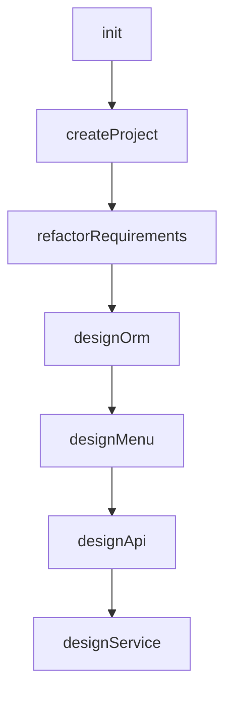
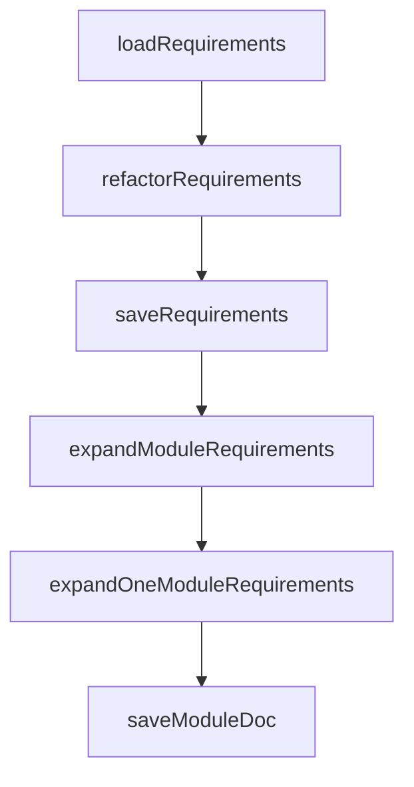
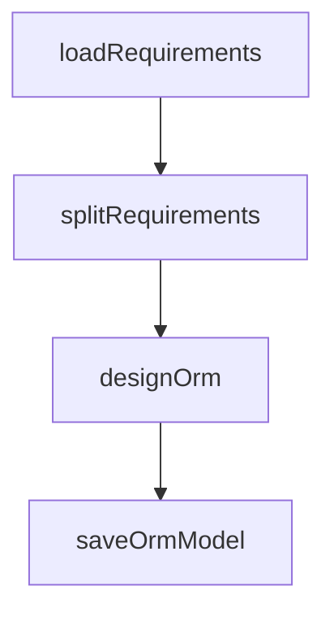
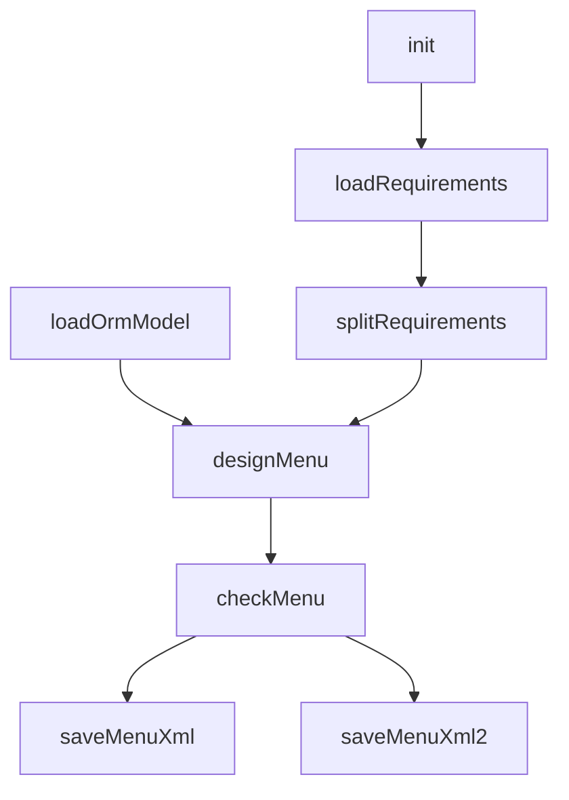
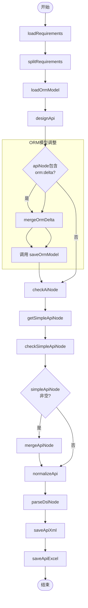

# AI代码生成任务

## 核心流程：ai-coder.task.xml

### 简要说明：
1. **整体流程**：
  - 这是一个AI驱动的应用代码生成主流程，通过调用多个子任务实现完整开发周期
  - 采用顺序执行模式：初始化→创建项目→需求重构→ORM设计→菜单设计→API设计→服务设计
  - 基于Nop平台的任务扩展机制（`x:extends`继承基础任务模板）

2. **关键步骤**：
  - **init**：初始化阶段
    - 计算需求文档路径（`requirementsPath`）
  - **createProject**：创建项目骨架
    - 调用`ai-create-project.task.xml`子任务
    - 输入：Maven组ID、应用名称、基础包名、输出目录
  - **refactorRequirements**：需求文档重构
    - 调用`ai-biz-analyzer.task.xml`子任务
    - 使用条件标志（`flags match="req or EMPTY"`）控制执行
    - 处理需求文档的标准化和扩展
  - **designOrm**：ORM模型设计
    - 调用`ai-orm-design.task.xml`子任务
    - 基于重构后的需求生成数据模型
  - **designMenu**：菜单权限设计
    - 调用`ai-menu-design.task.xml`子任务
    - 生成菜单结构和权限配置
  - **designApi**：API接口设计
    - 调用`ai-api-design.task.xml`子任务
    - 设计系统API接口规范
  - **designService**：服务层设计
    - 调用`ai-service-design.task.xml`子任务
    - 完成业务逻辑服务设计

3. **输入参数**：
  - 必需参数：`mavenGroupId`, `appName`, `basePackageName`, `outputDir`, `inputRequirementsPath`, `needExpand`
  - AI可选参数：`aiProvider`, `aiModel`, `sessionId`（传递给各设计子任务）
  - 条件执行：通过`flags`属性控制子任务执行（如`flags match="menu or EMPTY"`）

4. **设计特点**：
  - **模块化设计**：将开发过程分解为独立可重用的子任务
  - **AI驱动**：各设计阶段均使用AI子任务实现自动化生成
  - **可扩展性**：通过条件标志(`flags`)灵活控制流程执行节点
  - **工程规范**：遵循标准Maven项目结构（`mavenGroupId`）
  - **配置继承**：AI参数（provider/model）贯穿整个设计流程

该主控任务实现了从项目创建到详细设计的完整AI辅助开发流程，通过串联多个专业领域的AI设计子任务，将需求文档自动转换为可直接使用的工程代码。每个设计阶段都可以通过条件标志独立启用或跳过，提供了灵活的流程控制能力。

## 业务分析：ai-biz-analyzer.task.xml

### 简要说明：

1. **任务结构**：

- 定义了5个输入参数：`inputRequirementsPath`, `basePackageName`, `outputDir`, `needExpand`, `sessionId`
- 配置AI聊天选项（`ai:chatOptions`），使用动态传入的AI参数
- 通过`x:extends`继承基础任务模板`/nop/task/lib/common.task.xml`
- 启用了AI编码器（`ai-coder`）和文件工具（`file-utils`）命名空间

2. **核心流程**：

- **loadRequirements**：读取需求文档
  - 使用`file-utils:ReadText`自定义类型
  - 从`inputRequirementsPath`读取原始需求文档
  - 输出：原始需求文本(`inputRequirements`)
- **refactorRequirements**：重构需求文档
  - 使用AI任务步骤(`ai:TaskStep`)重构需求文档
  - 应用`coder/refactor-requirements`提示模板
  - 输入：原始需求文本和是否扩展标志(`needExpand`)
  - 输出：结构化需求文档(`requirementsDoc`)
- **saveRequirements**：保存重构后的需求
  - 将重构后的需求保存到`docs/requirements/refactored-requirements.md`
- **expandModuleRequirements**：并行处理模块需求
  - 遍历需求文档中"3.2 核心功能模块"的所有子模块
  - 为每个模块创建并行处理分支
- **expandOneModuleRequirements**：扩展单个模块需求
  - 使用AI扩展特定模块的需求
  - 应用`coder/expand-module-requirements`提示模板
  - 添加并发限制(`throttle`)，最大并发数为1
- **saveModuleDoc**：保存模块文档
  - 将扩展后的模块需求保存到`docs/requirements/sections/{sectionNo}.md`

3. **关键特性**：

- **AI文档重构**：使用AI将原始需求文档重构为标准格式
- **并行处理**：通过`fork`实现模块级并行处理
- **并发控制**：使用`throttle`限制AI调用频率（最大并发1）
- **模块化存储**：按模块编号(`sectionNo`)保存扩展后的需求文档
- **模板化AI提示**：使用预定义的AI提示模板(`promptName`)指导AI处理

该任务实现了需求文档的自动化处理流程：读取→AI重构→保存→并行模块扩展→分模块保存。核心是通过AI将原始需求文档转换为结构化、标准化的技术需求文档，并针对核心功能模块进行深度扩展。

## ORM设计: ai-orm-design.task.xml

### 简要说明：

1. **任务结构**：

- 定义了一个包含7个输入参数的任务：`requirementsPath`, `appName`, `basePackageName`, `outputDir`, `aiProvider`,
  `aiModel`, `sessionId`
- 配置了AI聊天选项（`ai:chatOptions`），使用动态传入的AI提供商和模型参数
- 通过`x:extends`继承基础任务模板`/nop/task/lib/common.task.xml`

2. **流程步骤**：

- **loadRequirements**：加载Markdown格式的需求文档
  - 使用自定义类型`ai-coder:LoadMarkdown`
  - 输入：需求文件路径和模板路径
  - 输出：结构化文档对象(`requirementsDoc`)
- **splitRequirements**：拆分需求文档
  - 从`requirementsDoc`中提取标记为`ORM`的需求部分
  - 输出：ORM相关需求文本(`ormRequirements`)
- **designOrm**：设计ORM模型
  - 使用自定义类型`ai:TaskStep`调用AI能力
  - 输入：ORM需求文本
  - 输出：ORM模型(`ormModel`)
  - 启用响应缓存(`ai:useResponseCache="true"`)
- **saveOrmModel**：保存ORM模型
  - 调用外部任务库(`ai-coder.task-lib.xml`)中的保存步骤
  - 输入：生成的ORM模型和应用名称

3. **关键特性**：

- 使用AI辅助代码生成（`ai-coder`命名空间）
- 支持多AI提供商配置（Ollama/DeepSeek/VolcEngine等）
- 采用模板化文档处理（`.tpl.md`模板文件）
- 实现需求文档的模块化拆分（`selectSectionByTplTag`）

该任务实现了从需求文档解析→ORM需求提取→AI模型设计→模型保存的自动化流程，核心是通过AI将自然语言需求转换为ORM数据模型。

## 菜单设计: ai-menu-design.task.xml

### 简要说明：

1. **任务结构**：

- 定义了一个包含7个输入参数的任务：`requirementsPath`, `appName`, `basePackageName`, `outputDir`, `aiProvider`,
  `aiModel`, `sessionId`
- 配置了AI聊天选项（`ai:chatOptions`），使用动态传入的AI提供商和模型参数
- 通过`x:extends`继承基础任务模板`/nop/task/lib/common.task.xml`

2. **核心流程**：

- **init**：初始化步骤
  - 生成应用ID（`appId`），将应用名称中的连字符替换为斜杠
- **loadRequirements**：加载需求文档
  - 使用自定义类型`ai-coder:LoadMarkdown`加载Markdown格式的需求文档
  - 应用模板处理文档结构
- **splitRequirements**：拆分需求文档
  - 从需求文档中提取标记为`MENU`的菜单需求部分
- **loadOrmModel**：加载ORM模型
  - 从指定路径(`model/ai-gen.orm.xml`)加载预生成的ORM数据模型
- **designMenu**：设计菜单结构
  - 使用AI根据菜单需求和ORM模型设计菜单及角色权限
  - 启用响应缓存(`ai:useResponseCache="true"`)
- **checkMenu**：校验菜单设计
  - 使用AI对设计的菜单进行校验和优化
- **saveMenuXml**：保存菜单配置
  - 将菜单设计保存为DSL格式的XML文件
- **saveMenuXml2**：保存备用菜单配置
  - 将菜单设计保存到应用特定的路径中

3. **关键特性**：

- 双路径保存：菜单配置同时保存到标准位置(`model/ai-gen.action-auth.xml`)和应用特定路径
- AI辅助设计：使用AI生成菜单结构和权限配置
- 设计校验：专门的`checkMenu`步骤确保菜单设计质量
- 模板化处理：使用预定义的Markdown模板(`requirements.tpl.md`)解析需求文档

该任务实现了从需求文档解析→菜单需求提取→ORM模型加载→AI菜单设计→设计校验→双路径保存的完整工作流，核心是通过AI将自然语言需求转换为菜单权限配置。

## API设计：ai-api-design.task.xml

### 流程说明

1. **输入阶段**

- 接收外部参数：`requirementsPath`, `appName`, `basePackageName`, `outputDir`, `aiProvider`, `aiModel`, `sessionId`

2. **需求处理**

- `loadRequirements`: 加载Markdown需求文档并解析结构
- `splitRequirements`: 提取API相关需求文本

3. **模型加载**

- `loadOrmModel`: 从文件系统加载已有的ORM模型

4. **API设计**

- `designApi`: 使用AI生成API初始模型（基于需求文本和ORM模型）

5. **ORM模型调整**

- 检查API节点是否包含ORM变更(`orm:delta`)
- 若存在变更：合并到ORM模型 → 保存更新后的模型文件

6. **API模型验证**

- `checkAiNode`: AI验证API模型合理性
- `getSimpleApiNode`: 提取简化API模型
- `checkSimpleApiNode`: AI二次验证简化模型

7. **模型合并**

- 当简化模型有效时，将其与原始API模型合并

8. **API规范化**

- 设置服务类完整路径
- 重置消息字段的propId属性

9. **输出结果**

- `parseDslNode`: 将DSL节点解析为API模型对象
- `saveApiXml`: 保存XML格式的API定义
- `saveApiExcel`: 生成Excel格式的API文档

### 关键特性

1. **AI集成**：

- 使用`ai:TaskStep`调用AI服务完成设计/验证任务
- 通过`ai:chatOptions`配置AI参数（模型/会话等）

2. **条件执行**：

- ORM调整和模型合并步骤通过`<when>`条件触发
- 依赖前序步骤的输出状态

3. **模型驱动**：

- 基于XDef模式定义（`/nop/schema/*.xdef`）
- 支持DSL节点操作（提取/合并/解析）

4. **文件操作**：

- 多格式输出支持（XML/Excel）
- 文件路径通过`outputDir`参数动态配置

5. **扩展机制**：

- 通过`x:extends`继承基础任务模板
- 使用`customType`复用自定义步骤逻辑
