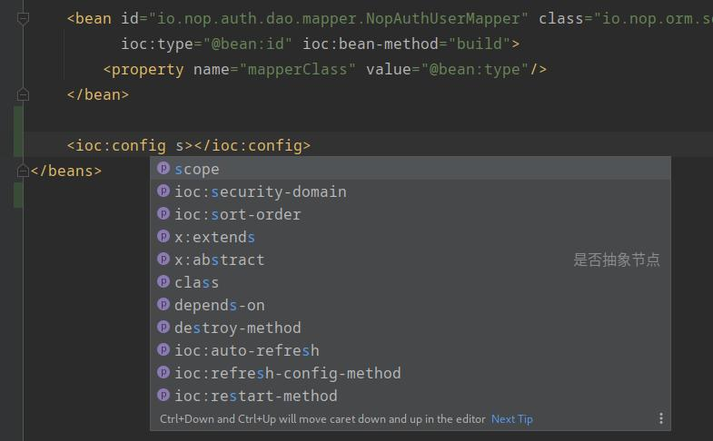
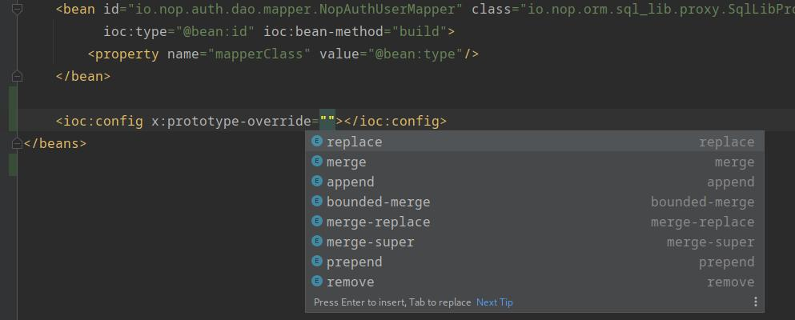
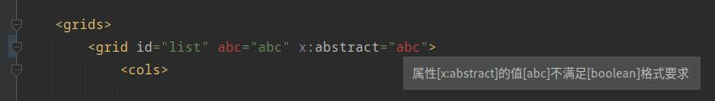
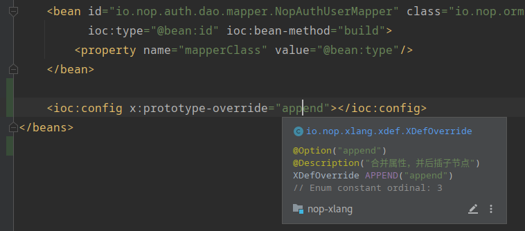
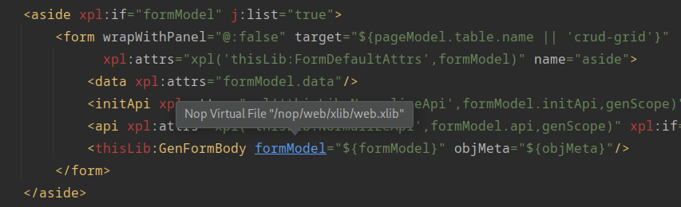
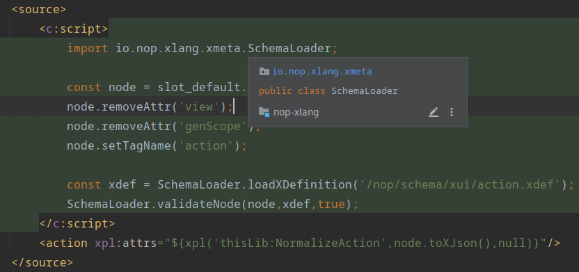

# XLang DSL Plugin

在 Nop 平台中，所有的 DSL 都采用 XML 语法格式，使用统一的 xdef 元模型来提供规范化的形式约束和基本的属性语义。基于 xdef 元模型，我们可以实现统一的语法提示、关联分析、断点调试等功能，而无需针对每个 DSL 语言单独编写 IDE 插件。

> 插件的编译、安装可以参考文档： [idea.md](../../dev-guide/ide/idea.md)

## DSL 语法格式

XLang DSL 采用 XML 格式，根节点上必须通过 `x:schema` 属性来指定所对应的 xdef 元模型，例如

```xml
<beans x:schema="/nop/schema/beans.xdef"
       xmlns:x="/nop/schema/xdsl.xdef" ...>
</beans>
```

## 语法提示

输入标签名、属性名、属性值的时候，会弹出 xdef 中定义的相关信息。






## 语法检查

插件会根据 xdef 定义检查标签名、属性名以及属性值的格式。不符合要求的语法元素会被增加 Error 标记。




## 快速文档

鼠标悬停在标签名、属性名以及属性值上时，会显示 xdef 文件中定义的文档




## 路径链接

鼠标悬停在路径格式的属性值上，同时按 CTRL 键，会提示跳转到路径所对应的文件。
对于 XPL 模板标签，则提示跳转到标签库的定义处。




## XScript 代码高亮

`<c:script/>` 标签内的 XScript 代码高亮、代码文档、代码跳转、代码补全等。





## DSL 文档格式增强

在 DSL 中的文档内容，推荐采用如下形式：

```xml
<example xmlns:x="/nop/schema/xdsl.xdef"
    x:schema="/nop/schema/xdef.xdef"
>
    <!-- [这是节点]
    > - 第一级列表 #1
    > - 第一级列表 #2
    > - 第一级列表 #3
    >   - 第二级列表 #1
    >   - 第二级列表 #2
    >   - 第二级列表 #3

    @type [这是节点类型]
        > 属性使用说明
        > - 说明 1
        > - 说明 2
    @name [这是节点名称]
        > 说明 xxx
    -->
    <node type="!#generic-type=string" name="string"/>

</example>
```

- 文档最开始的 `[xxx]` 表示标签或属性名称为 `xxx`；
- 其余行开头的 `> `（含一个空格）可仅用于多级列表开头，以避免因行首空白被移除而无法正确渲染 markdown 多级列表的问题；

节点文档渲染结果：


属性文档渲染结果：


为了避免恶意链接，markdown 中的链接和图片的地址均完整显示，以方便用户确认链接是否可信：


## 断点调试


在 XScript 脚本或者 Xpl 模板片段中可以增加断点。
插件增加了一个与 `Run` 和 `Debug` 指令平级的执行器 `XLangDebug`，通过它启动后会同时启动 Java 调试器和启动 XLang 脚本语言调试器。


为了调试 XLang，需要引入 `nop-xlang-debugger` 模块

```xml
<dependency>
    <groupId>io.github.entropy-cloud</groupId>
    <artifactId>nop-xlang-debugger</artifactId>
    <version>2.0.0-SNAPSHOT</version>
</dependency>
```
