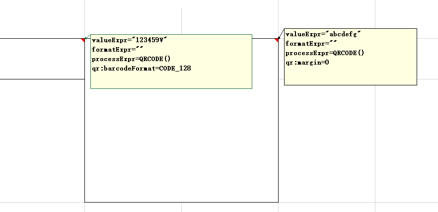
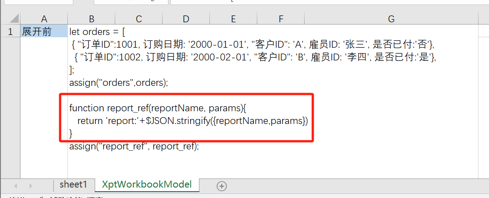

# NopReport中如何实现二维码导出

NopReport是从零开始编写的下一代中国式报表引擎，它的核心仅有3000多行代码，但是完整实现了中国式非线性报表理论所定义的层次坐标和行列对称展开算法。

* 使用介绍：[采用Excel作为设计器的开源中国式报表引擎:NopReport](https://zhuanlan.zhihu.com/p/620250740), [视频讲解](https://www.bilibili.com/video/BV1Sa4y1K7tD/)
* 源码分析: [非线性中国式报表引擎NopReport源码解析](https://zhuanlan.zhihu.com/p/663964073)，[视频讲解](https://www.bilibili.com/video/BV17g4y1o7wr/)

NopReport并没有内置二维码展现这种业务相关的组件，但是它遵循了可逆计算理论，所以内置了大量可扩展机制可以用于引入扩展组件。本文以实现二维码导出为例介绍NopReport中的可扩展机制，这些机制是基于可逆计算理论自然导出，并不限于在Nop平台中使用，对于其他框架的可扩展性也可以起到指导作用。

## 一. 配置导出二维码

目前`nop-report-ext`模块提供了二维码扩展组件。使用时需要引入如下jar包

```xml
    <dependency>
        <groupId>io.github.entropy-cloud</groupId>
        <artifactId>nop-report-ext</artifactId>
    </dependency>
```

在Excel模板中，通过单元格的注解调用`QRCODE()`扩展函数。[示例模板](https://gitee.com/canonical-entropy/nop-entropy/raw/master/nop-report/nop-report-demo/src/main/resources/_vfs/nop/report/demo/base/11-%E6%89%93%E5%8D%B0%E6%9D%A1%E7%A0%81%E5%92%8C%E4%BA%8C%E7%BB%B4%E7%A0%81.xpt.xlsx)



* valueExpr: 这里只是通过valueExpr来直接指定一个演示用的输出值，实际开发中可以利用NopReport内置的其他机制来生成单元格的值
* formatExpr: 因为在最终输出的Excel以及展示用的HTML页面上我们并不需要输出单元格的值，所以这里指定formatExpr返回空字符串。否则在二维码上会叠加显示对应的文本。
* processExpr: 调用扩展函数`QRCODE`，实际生成二维码
* `qr:barcodeFormat`: 指定输出条码格式，缺省是`QRCODE`，指定为`CODE_128`生成条形码。

`qr:`为前缀的变量是传递给`QRCODE`函数的扩展数据，但是并不需要直接作为`QRCODE`函数的参数传递。可以设置的属性值对应于[QrcodeOptions.java](https://gitee.com/canonical-entropy/nop-entropy/blob/master/nop-integration/nop-integration-api/src/main/java/io/nop/integration/api/qrcode/QrcodeOptions.java)类中的成员变量。

可以通过`qr:width`和`qr:height`来指定输出图形的大小。如果不指定，则会自动使用当前单元格的宽高。

## 二. 实现原理

### 1. 单元格模型的可扩展属性

NopReport的设计遵循可逆计算原理，系统化的采用 `(data,ext_data)`这样的配对设计，确保在任何模型节点上都可以追加扩展属性。缺省情况下，所有具有名字空间的属性都不参与元模型校验，因此我们可以引入`qr`名字空间，通过它设置二维码输出所需要的配置信息，比如二维码格式、大小等。如果需要校验qr名字空间中的属性格式，则可以引入一个自定义的xdef元模型。

```xml
<workbook xdef:check-ns="qr">
  <sheets>
    <sheet>
      <table>
        <rows>
          <cell>
            <model xdef:name="XptCellModel"
                   qr:barcodeFormat="string" qr:margin="int" qr:imgType="string" qr:width="double"
                   qr:height="double" qr:encoding="string" qr:errorCorrection="int">
            </model>
          </cell>
        </rows>
      </table>
    </sheet>
  </sheets>
</workbook>
```

目前NopReport采用Excel为可视化设计器，在单元格的注解中设置单元格模型信息。后续还会提供在线可视化编辑，此时就可以xdef元模型中声明的属性定义自动生成可视化编辑页面。

### 2. 可扩展的函数空间

NopReport提供了`expandExpr`、`valueExpr`、`formatExpr`、`styleIdExpr`、`processExpr`等多种表达式配置，可以调用外部函数来完成复杂逻辑处理。NopReport的表达式引擎从Nop平台内置的XLang表达式引擎扩展而来（在XLang EL的基础上增加了报表层次坐标语法），因此它自动继承了XLang中定义的全局函数和全局对象。同时，报表引擎还为报表执行环境引入了报表专用的一系列函数。

#### 全局函数

```javascript
// 注册XLang EL全局函数
EvalGlobalRegistry.instance().registerStaticFunctions(GlobalFunctions.class);

// 注册Report执行环境专用的报表函数
ReportFunctionProvider.INSTANCE.registerStaticFunctions(ReportExtFunctions.class);
```

一般情况下可以仿照`nop-report-ext`模块中的做法，在初始化的时候注册扩展函数。

```java
public class ReportExtInitializer {

    @PostConstruct
    public void init() {
        ReportFunctionProvider.INSTANCE.
                  registerStaticFunctions(ReportExtFunctions.class);
    }
}
```

#### 集成IoC容器

除了全局注册之外，在表达式中还可以直接通过`inject`函数获取到NopIoC容器中管理的bean，例如`inject('qrService').genQrCode('123456')`。

> 因为NopIoC支持类似Spring容器的BeanScope概念，从NopIoC获取的bean不一定都是单例对象

#### 调用时传入

在调用具体报表时还可以通过scope对象传入帮助对象

```javascript
IEvalScope scope = XLang.newEvalScope();
scope.setLocalValue("myTool", new MyTool());
reportEngine.getRenderer("/my.xpt.xlsx","html").generateToFile(file, scope);
```

在表达式中就可以调用myTool对象上的方法，例如`myTool.myMethod(cell.value)`

#### 报表内定义

NopReport引擎与一般的报表引擎非常不一样的地方是，它非常强调报表模型的自包含性和自定义抽象的能力。在报表模型的【展开前】配置中，我们可以定义仅在这个报表中使用的函数。**这个函数定义存放在报表模型中，而不需要外部注册或者传入**。



在【展开前】配置中，我们可以利用XPL模板语言的标签库抽象，来动态加载外部标签函数。后续Nop平台将会为所有XPL配置段提供通用的逻辑编排可视化设计器，这样就可以使用可视化配置的方式为报表模型引入自定义函数。

## 3. 隐式传递的上下文

Nop平台为开发自定义的领域模型(Domain Model)和领域特定语言(DSL, Domain Specific Language)提供了一系列标准的套路，这其中就包含在表达式语言中引入的隐式上下文的概念。

当我们在一个特定领域（或者特定业务场景）中工作的时候，总是会有一些系统性的背景知识，当我们编写特定的业务代码时，我们可以假定这些背景知识是已知的或者可以按照某种确定性的方式推导得到的，从而原则上并不需要在代码中明确指明。
但是一般情况下，我们编码使用的是通用语言和通用框架，并不存在一种简单的、标准化的方式将这些知识内置到语言中，因此我们经常会发现大量仅起粘结作用的胶水代码中，一些背景信息被重复的表达多次。

比如说，在报表引擎中，我们的背景知识是报表运行时总是存在一个上下文对象`IXptRuntime`，在我们调用函数的时候能否不显式传递这个参数，而是假定它是一种可以隐式传递的背景知识？
如果我们不希望在调用所有函数的时候都显式传递IXptRuntime，一般的做法是将上下文对象通过`ThreadLocal`这种近似全局变量的方式进行传递，这种方式会破坏函数的结构，引入不必要的复杂性。

Nop平台的XLang语言中引入了隐式参数的概念，它类似于Scala语言中的implicit语法。

```scala
// scala语言中的隐式参数
def welcome(implicit name: String) = s"Welcome, $name!"

implicit val guestName: String = "Guest"

println(welcome) // 输出: Welcome, Guest!
```

scala语言中会按照类型自动查找上下文中的implicit变量，并自动绑定为函数参数。 Nop平台的Xpl模板语言提供了implicit参数，但是它是按照name来实现隐式绑定。

```xml
<!-- 标签库my.xlib -->

<lib>
  <tags>
    <MyTag>
      <attr name="xptRt" implicit="true" />
      <source>
        ...
      </source>
    </MyTag>
  </tags>
</lib>
```

调用标签的时候可以传入xptRt参数。也可以不设置参数，则会自动绑定上下文中的同名变量

```xml
<my:MyTag />
```

在XLang表达式中，也提供了隐式传递IEvalScope的机制。

```
    @EvalMethod
    public static ExcelImage QRCODE(IEvalScope scope) {
        IXptRuntime xptRt = IXptRuntime.fromScope(scope);
        ExpandedCell cell = xptRt.getCell();

        QrcodeOptions options = new QrcodeOptions();
        cell.getModel().readExtProps("qr:", true, options);
        ...
        return image;
    }
```

如果函数上标记了`@EvalMethod`注解，则第一个参数必须是IEvalScope。在表达式中调用的时候会自动传入表达式的运行时scope。通过scope可以获取到上下文中的其他变量。

`ReportExtFunctions`中定义的`QRCODE`函数就是使用这种隐式参数机制，因此不需要显式传递IXptRuntime上下文对象。在`QRCODE`函数中可以通过IXptRuntime得到当前正在处理的单元格对象，并进而可以获取到单元格模型上的扩展属性。
