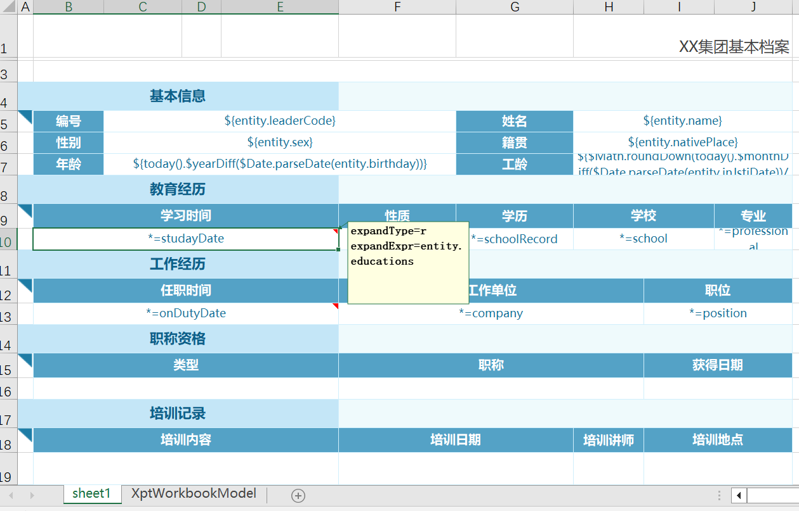
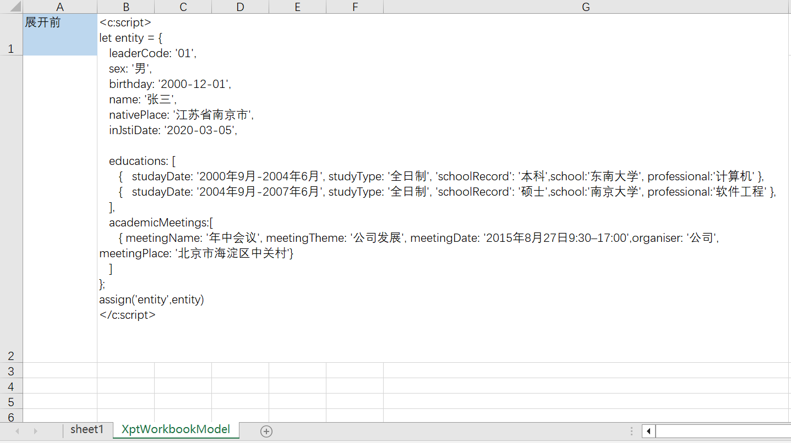

# 采用Excel作为设计器的开源中国式报表引擎：NopReport

中国式报表是复杂结构报表的代名词，它泛指国内信息化领域经常出现的基于多源数据，采用行列交叉、多层级表头、自由分片合并等形式所展现的信息汇总报表。

[为什么会存在"中国式报表"这一说法](https://www.zhihu.com/question/519875794)

> [润乾报表](http://www.raqsoft.com.cn/about#aboutme)的创始人蒋步星是写入了中国历史的传奇人物（国际奥林匹克数学竞赛的首届中国金牌得主，来自新疆石河子，参见[顾险峰教授的回忆](https://blog.sciencenet.cn/blog-2472277-1160241.html)），他发明了中国式报表模型相关的理论，并引领了整整一代报表软件的技术潮流。

目前国内商业化的报表工具都支持中国式报表的制作，但是开源的报表引擎中只有[UReport](https://gitee.com/youseries_admin/ureport)支持中国式报表，而且目前已经不再维护。

NopReport是基于可逆计算理论从零开始独立实现的一套开源中国式报表引擎，它的核心代码很短，只有3000多行（参见[nop-report-core](https://gitee.com/canonical-entropy/nop-entropy/tree/master/nop-report/nop-report-core)模块），具有较高的性能（性能测试代码参见[TestReportSpeed.java](https://gitee.com/canonical-entropy/nop-entropy/blob/master/nop-report/nop-report-demo/src/test/java/io/nop/report/demo/TestReportSpeed.java)），以及其他报表引擎难以达到的灵活性和可扩展性。

NopReport在[Nop平台](https://gitee.com/canonical-entropy/nop-entropy)中的定位是对表格形式数据结构的通用建模工具，所有需要生成表格形式数据的功能都可以转化为NopReport报表模型对象来实现。例如，NopCli命令行工具提供的数据库逆向工程命令会逆向分析数据库表结构，生成Excel模型文件，这个Excel模型文件就是通过**将导入模板转化为报表输出模型**来生成。

与其他报表引擎相比，NopReport具有如下非常鲜明的个性化特点：

## 一. 采用Excel作为设计器

[操作演示视频](https://www.bilibili.com/video/BV1Sa4y1K7tD/)

根据可逆计算原理，报表引擎的本质是定义了一个针对表格形式数据结构的DSL（参见元模型定义[workbook.xdef](https://gitee.com/canonical-entropy/nop-entropy/blob/master/nop-xdefs/src/main/resources/_vfs/nop/schema/excel/workbook.xdef)），而可视化设计器不过是这个DSL的一种可视化展现形式。Nop平台为了实现模型驱动的代码生成器，已经实现了Excel文件的解析和生成，那么只要再做少量扩展标注，就可以把Excel作为报表设计器来使用。具体做法是将Excel的批注作为扩展信息，并识别单元格文本中的表达式语法。目前NopReport已经可以支持如下几种报表：

### 档案式报表




### 段落明细表


### 复杂多源报表


### 交叉报表—数据双向扩展


### 同比环比等财务统计表


### 兄弟节点并行展开


列父格D2的展开将导致D3被复制为多个，而当D3执行行展开的时候，就产生了多个兄弟节点同时进行行展开。
兄弟节点进行行展开时将会自动共享新建的行，因此父节点最终被扩展为多少行，由所有子节点的总计的展开数量来决定。

### Excel模型扩展

NopReport报表模型可以看作是对Excel模型的一种扩展。在单元格的批注中我们可以通过expandType、expandExpr和field等属性来指定单元格展开方向和展开内容。另外在单元格的文本中，我们可以直接写表达式语法。优点是在界面上可以直接看见表达式内容，而不需要把批注展开。支持两种格式的文本表达式语法：

1. EL表达式：例如${entity.myField}
2. 展开表达式：它采用 `*=`作为前缀
   A. `*=fieldName` 等价于配置field=fieldName
   B. `*=^ds1!fieldName`，等价于配置 expandType=r, ds=ds1, field=fieldName
   C. `*=>ds1!fieldName` 等价于配置 expandType=c, ds=ds1, field=fieldName
   D. `*=^fieldName@entity.children` 等价于配置expandType=r,field=fieldName,expandExpr=entity.children

详细说明参见文档[xpt-report.md](../dev-guide/report/xpt-report.md)

## 二. 高度灵活的数据对象支持

一般的报表引擎在数据管理层面都只面向平面表数据结构，基本操作流程都是先建立数据源(DataSource)，然后建立数据集(DataSet)，数据集对应于数据库中的表或者视图，而数据集所管理的就是一行行的数据记录。

这种做法的好处是报表引擎比较容易通用化，可以独立于业务系统运行。但是坏处也很明显，那就是报表引擎无法直接使用应用程序内部已经建立的领域对象模型，也无法利用领域模型内在的结构关系来进行性能优化。

NopReport采用的是一种更加灵活、开放的分层式设计，它的运行时直接面向领域模型对象，而数据集（DataSet）仅仅是作为可选的一种数据组织形式。例如，在上一节介绍的档案式报表中，通过JSON变量直接构造报表数据


展开【教育经历】时，只需要配置 expandType=r, expandExpr=entity.educations。而类似帆软报表的报表工具需要定义多个数据集： ds\_study、ds\_work等，然后再配置这些数据集之间的关联过滤条件。而在NopReport中，我们直接假定用户信息按照树状结构进行组织。从NopOrm引擎中查询得到的用户对象可以直接送到报表引擎中作为输入数据，并不需要在报表引擎中重新定义一个专为报表导出而用的数据集。

NopOrm引擎中已经针对对象关联属性的存取进行了优化（例如解决ORM引擎常见的[N+1问题](https://zhuanlan.zhihu.com/p/545063021)等），使用起来也非常符合业务直觉： 表格单元格上的父子关系很直接的对应于实体对象上的属性关联关系。

NopReport对数据来源没有任何特殊要求，在【展开前】配置中，我们可以使用Xpl模板语言对数据进行自由加工。一般的报表引擎可以通过可视化设计器来设计数据集，而在基于可逆计算原理构建的NopReport报表引擎中，我们其实可以很容易的模拟实现这一点。

例如【展开前】可以引入Xpl标签抽象，将具体数据集的获取方式封装为Xpl标签。

```xml
<xpt-rt:UseJdbcDataSet dsName="ds1" xpl:lib="/nop/report/xlib/xpt-rt.xlib">
  <soure> select xx from yy where type=${type} </soure>
</xpt-rt:UseJdbcDataSet>
```

我们可以将`<xpt-rt:UseJdbcDataSet>`等标签看作是一种配置文件，利用Nop平台的GenericTreeEditor(目前尚在开发过程中)就可以自动生成数据集的可视化设计器。

利用Nop平台作为技术底座，我们可以积累出专门适用于自己领域的数据模型定义，而不用完全依赖平台内置提供的数据模型。

## 三. 使用通用的表达式语法

中国式报表理论中非常独特的地方是所谓的[层次坐标](https://help.fanruan.com/finereport/doc-view-3802.html)。例如B2\[A2:+1\]表示返回以 A2 单元格为父格的下一个 B2 单元格纵向扩展的数值（这个所谓的下一个是相对于当前行中的B2单元格而言）。为了配合层次坐标表达式，报表引擎一般都会引入报表专用的表达式引擎，它具有自己特定的语法、函数，从而导致和一般的业务开发中使用的表达式语法有着较大的差异，无法直接复用相应的代码，也需要重新学习相应的表达式语法。

NopReport直接复用XScript表达式引擎，在XScript表达式语法（类似于JavaScript语法）的基础上扩展了层次坐标语法。实际上只需要几十行代码即可为表达式引擎引入层次坐标支持，具体可以参见[ReportExpressionParser.java](https://gitee.com/canonical-entropy/nop-entropy/blob/master/nop-report/nop-report-core/src/main/java/io/nop/report/core/expr/ReportExpressionParser.java)。

每个坐标表达式会返回一个ExpandedCellSet对象，

```java
class ExpandedCellSet implement Iterable<Object>{
   List<ExpandedCell> cells;

    @Override
    public Iterator<Object> iterator() {
        return cells.stream().map(ExpandedCell::getValue).iterator();
    }

    public ExpandedCellSet filter(Predicate<ExpandedCell> filter) {
        List<ExpandedCell> list = cells.stream().filter(filter).collect(Collectors.toList());
        return new ExpandedCellSet(loc, expr + "{ filter }", list);
    }
}
```

NopReport的层次坐标语法不支持Filter过滤条件，但是在返回的ExpandedCellSet对象上具有filter方法，我们通过调用此函数来实现类似的效果。

ExpandedCellSet实现了Iterable接口，在报表函数可以直接作为值的列表来使用，例如在SUM函数中

```java
public static Number SUM(@Name("values") Object values) {
        if (values == null)
            return null;

        Iterator<Object> it = CollectionHelper.toIterator(values, true);
        Number ret = 0;

        while (it.hasNext()) {
            Object value = it.next();
            if (!(value instanceof Number))
                continue;
            ret = MathHelper.add(ret, value);
        }
        return ret;
    }
```

我们并不需要特殊识别ExpandedCellSet类型进行特殊处理。

在NopReport中，数据集对于层次坐标的支持也完全被屏蔽在ReportDataSet类型中，而完全不需要在表达式引擎中做出任何特殊的定制。

```java
class ReportDataSet{
     @EvalMethod
    public Number sum(IEvalScope scope, String field) {
        List<Object> items = current(scope);
        Number ret = 0;
        for (Object item : items) {
            Object value = getFieldValue(item, field);
            if (!StringHelper.isEmptyObject(value)) {
                ret = MathHelper.add(ret, value);
            }
        }
        return ret;
    }
}
```

`@EvalMethod`是XScript所识别的一种语法标记，它表示在表达式调用时会自动传入scope环境对象。例如`ds.sum('金额')`实际会调用到 `ReportDataSet.sum(IEvalScope, String)`方法。current函数会根据隐式传递的scope变量来确定当前单元格所对应的层次坐标，然后再确定满足该层次坐标条件的数据条目是哪些。

上一节中复杂多源报表中为了获得项目总数，我们使用了表达式配置 valueExpr=zs.where('ID',xptRt.field('ID')).sum('数量')，这就是一个普通的JavaScript函数调用。而在帆软报表的配置中，我们需要配置数据集之间的关联过滤条件，还需要约定特殊的数据集调用表达式 `zs.求和(数量)`。

在Nop平台中，我们可以很容易的在表达式计算过程中引入我们自定义的封装函数，而不需要所有函数都是在报表引擎已经内置的函数。例如在【展开前】配置中我们增加针对当前报表的函数，而不需要注册为全局函数。

```
function myFunc(a){
    return ...
}
assign("myFunc",myFunc); // 在当前报表的表达式中就可以使用myFunc函数了。
```

> 在[ReportFunctions](https://gitee.com/canonical-entropy/nop-entropy/blob/master/nop-report/nop-report-core/src/main/java/io/nop/report/core/functions/ReportFunctions.java)类中增加的静态函数会自动成为ReportFunctionProvider.INSTANCE中注册的全局报表函数。

## 四. 性能优化友好的设计

NopReport采用了大量性能优化的结构设计，并且大幅简化了报表层次展开算法。

最基础的展开单元格对象采用了单向链表设计，当频繁进行单元格插入操作时可以提高性能。

```java
class ExpandedCell{
  ExpandedCell down;
  ExpandedCell right;

  ExpandedCell rowParent;
  ExpandedCell colParent;

  ExpandedRow row;
  ExpandedCol col;

  Map<String, List<ExpandedCell>> rowDescendants;

  Map<String, List<ExpandedCell>> colDescendants;
}

class ExpandedRow {
  ExpandedCell firstCell;
}

class ExpandedCol{
  ExpandedCell firstCell;
}

class ExpandedTable{
  List<ExpandedCell> rows;
  List<ExpandedCell> cols;
}
```

在ExpandedCell对象上增加了扩展属性支持，表达式引擎计算过程中将会利用这些扩展属性来缓存可以被复用的中间计算结果。

```java
class ExpandedCell{
    /**
     * 缓存与单元格有关的动态计算的值
     */
    private Map<String, Object> computedValues;

    public Object getComputed(String key, Function<ExpandedCell, Object> fn) {
        if (computedValues == null) {
            computedValues = new HashMap<>();
        }
        return computedValues.computeIfAbsent(key, k -> fn.apply(this));
    }

}
```

例如PROPORTION函数用于计算一个单元格的值在所有满足条件的单元格的汇总值中占比是多少。

```java
    @EvalMethod
    public static Number PROPORTION(IEvalScope scope,
                                    @Name("cell") ExpandedCellSet cell,
                                    @Name("range") @Optional ExpandedCellSet range){
        IXptRuntime xptRt = IXptRuntime.fromScope(scope);
        Object value = cell.getValue();
        if (value == null)
            return null;

        Number v = ConvertHelper.toNumber(value, err -> new NopException(err).source(cell).param(ARG_EXPR, cell));

        String cellName = cell.getCellName();

            ExpandedCell rangeCell = range.getCell();
            // 利用第一个单元格的计算属性来缓存汇总结果
            Number sum = (Number) rangeCell.getComputed(cellName + '_' + XptConstants.KEY_ALL_SUM,
                    c -> SUM(rangeCell.getChildSet(cellName, xptRt)));
            return MathHelper.divide(v, sum);
    }
```

我们利用了rangeCell的扩展属性缓存了rangeCell的具有指定名称的所有子单元格的汇总值。

## 五. 多Sheet支持和循环生成

NopReport的设计支持多Sheet页，可以在Excel中增加多个Sheet页，每个Sheet页都可以有自己对应的配置。此外可以配置【循环变量】，从而动态确定具体生成多少个Sheet页，每个Sheet页的名称是什么。利用这个机制，可以更容易的生成档案式报表

## 六. 在Java中调用

具体使用实例参见[TestReportFile.java](https://gitee.com/canonical-entropy/nop-entropy/tree/master/nop-report/nop-report-core/src/test/java/io/nop/report/core/TestReportFile.java)

```javascript
IReportEngine reportEngine = newReportEngine();
File xptFile = attachmentFile("test.xpt.xlsx");
ExcelWorkbook xptModel = new XptModelLoader().loadModelFromResource(new FileResource(xptFile));
ITemplateOutput output = reportEngine.getRendererForXptModel(xptModel, "xlsx");

IEvalScope scope = XLang.newEvalScope();
scope.setLocalValue("title", "测试报表，标题显示在右上角");

File outputFile = getTargetFile("output.xlsx");
output.generateToFile(outputFile, scope);
```

可以通过scope对象向报表中传递变量。在报表表达式中即可使用这些变量，并且可以在【展开前】等处理阶段对这些变量进行进一步的加工、计算等。

在【展开前】配置中可以使用xpl模板语言和XScript脚本语言来动态加工数据。

* 可以使用import来引入Java类
* 可以使用inject(beanName)引入IoC容器中定义的bean

## 条件样式
可以根据条件动态计算得到单元格的样式。

1. 在报表模板中需要增加XptWorkbookModel这个Sheet页，在其中定义命名样式。


2. 配置单元格的styleIdExpr
```
styleIdExpr=cell.ev == 2002 ? 'red' : null
```
