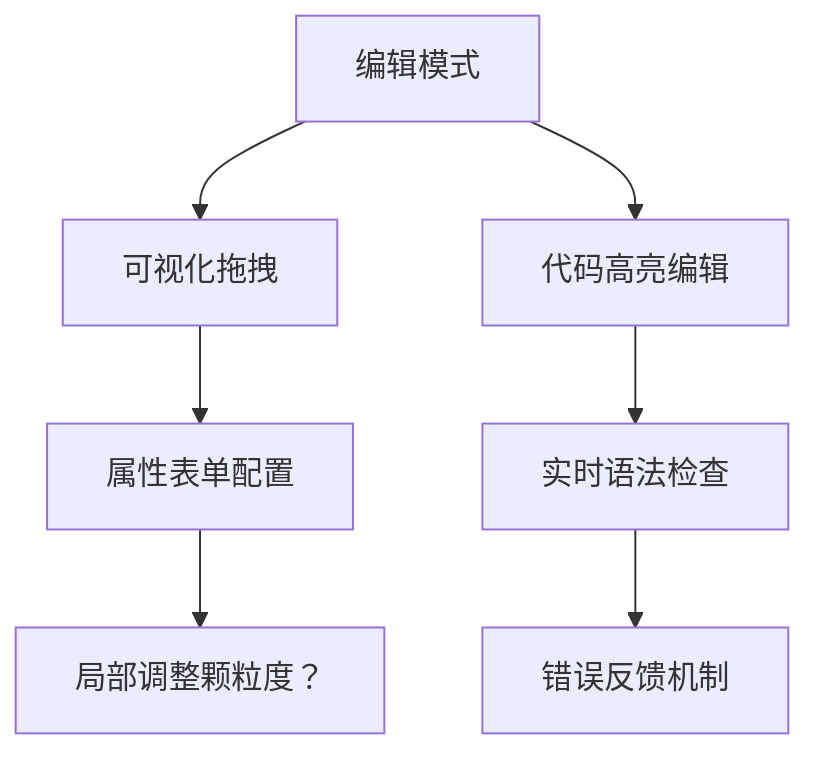

【提示词说明】
* 模型：deepseek-r1

【任务说明】
针对一个在线Web应用需求，产品经理和软件架构师分别提出了自己的需求分析框架。你的任务是综合这两个需求分析框架，保留这两者的全部信息，并在其基础上进行进一步完善。

软件功能：AI辅助智能代码生成系统，用户输入需求即可自动生成各种DSL模型文件，用户可以进行局部调整，最后点击生成即可生成一个完整应用
技术背景：Java Web应用，面向一般技术人员。

# 产品经理提出的需求分析框架

```markdown

### **需求分析文档大纲**
**1. 业务目标与范围**
- 核心价值：缩短DSL建模到应用生成的周期，降低技术门槛
- 范围边界：
  ✅ 包含：需求输入→AI生成DSL→可视化调整→应用生成→结果导出
  ❌ 不包含：版本协作、用户权限管理、部署运维

**2. 用户角色与场景**
| 角色       | 使用场景                  | 关键需求                  |
|------------|--------------------------|--------------------------|
| 技术工程师 | 快速生成数据管道配置      | 支持实时预览生成结果      |
| 数据分析师 | 创建报表模板DSL          | 提供自然语言需求示例库    |

**3. 核心功能需求**
**3.1 智能需求解析**
- 关键问题：
  - 支持哪些类型的自然语言输入？（例：结构化描述/自由文本/关键词标签）
  - 是否需要预设领域术语词典？（如金融领域特有名词）

**3.2 DSL生成与编辑**
- 功能清单：
  - AI生成基础DSL框架（需明确支持的语言：SQL/Scala/Python等）
  - **可视化编辑器**：
    ```mermaid
    graph LR
      A[节点拖拽] --> B[属性表单配置]
      C[代码高亮编辑] --> D[实时语法检查]
    ```
  - 局部调整的颗粒度要求？（函数级/行级/参数级）

**3.3 应用生成引擎**
- 关键问题：
  - 目标应用类型限制？（Web服务/批处理作业/API端点）
  - 是否需要选择技术栈模板？（Spring Boot/Flask等）

**4. 非功能性需求**
| 类型         | 具体指标                          |
|--------------|----------------------------------|
| 性能         | DSL生成响应时间 ≤3s (1000token内) |
| 可靠性       | 生成代码基础编译通过率 ≥95%       |
| 安全         | 输入内容过滤XSS/SQL注入特征       |

**5. 集成点与扩展性**
- 确认需求：
  - 是否需要对接现有认证系统？（LDAP/OAuth2）
  - 未来扩展AI模型切换接口？（如GPT/Claude/本地模型）

**6. 用户体验关键点**
- 交互设计问题：
  - 是否需要保存需求历史记录？
  - 错误处理方式：
    ```javascript
    // 示例：DSL校验反馈机制
    {
      "error_type": "SYNTAX_ERROR",
      "position": { "line": 12, "column": 5 },
      "suggested_fix": "Missing closing bracket"
    }
    ```

**7. 数据管理需求**
- 存储策略：
  - 用户生成的DSL文件是否持久化存储？
  - 敏感数据处理规范？（如需求中含数据库密码）

**8. 验收标准示例**
- 成功场景：
  ```gherkin
  当 用户输入"创建每分钟统计订单量的Flink作业"
  且 调整时间窗口为5分钟
  则 生成可提交至Flink集群的JAR包
  ```

---

### **给工程师的敏捷启动建议**
1. **最小化MVP路径**：
- 优先实现：自然语言→SQL生成→结果下载链路
- 技术选型推荐：
  - 前端：React + Monaco Editor（代码编辑）
  - 后端：Spring Boot + AI Gateway（统一模型接口）

2. **风险早应对**：
- AI幻觉控制：采用**DSL模板约束** + 语义规则校验
- 性能优化：对生成结果实施**缓存分级策略**（高频需求模板缓存）

3. **可测试性设计**：
- 定义DSL生成质量评估矩阵：
  | 指标                | 阈值   |
  |---------------------|--------|
  | 功能完整度          | ≥80%   |
  | 需手动修改行数占比  | ≤20%   |

此框架可确保需求覆盖关键决策点，同时为Sprint规划提供明确输入。建议在需求澄清阶段重点确认**DSL支持范围**和**AI生成准确率预期**，这两个因素将显著影响技术实现方案。

```

# 软件架构师提出的虚伪iu分析框架

```markdown

### **需求分析文档大纲**

#### **1. 引言**
- 1.1 背景与目标
  *（系统核心价值：降低开发门槛，通过AI生成可调整的DSL模型，最终输出完整应用）*
- 1.2 范围界定
  - **包含**：需求输入→AI生成DSL→可视化编辑→应用生成→下载
  - **不包含**：应用部署、用户协作功能、移动端支持
- 1.3 目标用户画像
  *（一般技术人员：需明确技术能力边界）*

#### **2. 用户角色与场景**
- **问题清单**：
  - Q1: 主要用户的技术背景？（如：前端/后端/全栈开发、测试工程师、技术产品经理）
  - Q2: 用户是否需要团队协作功能？（如共享项目、版本历史）
  - Q3: 用户是否需角色权限管理？（如管理员、普通用户）

#### **3. 核心功能需求**
- 3.1 **需求输入模块**
  - 支持自然语言描述或结构化表单输入
  - **问题清单**：
    - Q4: 是否需支持文件导入（如Markdown/Excel需求文档）？
    - Q5: 是否需多轮需求澄清（AI追问用户模糊点）？
- 3.2 **AI生成DSL模型**
  - 自动生成DSL（如数据模型、API接口、UI描述）
  - **问题清单**：
    - Q6: 需支持哪些DSL类型？（如SQL Schema、OpenAPI、HTML模板）
    - Q7: AI服务选用第三方API（如OpenAI）还是自研模型？
- 3.3 **模型编辑与调整**
  - 可视化编辑器（拖拽组件） + 代码编辑器（直接修改DSL）
  - **问题清单**：
    - Q8: 是否需实时预览调整效果？
    - Q9: 是否支持版本回滚/差异对比？
- 3.4 **应用生成与导出**
  - 一键生成完整应用（含代码、配置文件、构建脚本）
  - **问题清单**：
    - Q10: 输出应用的技术栈要求？（如Spring Boot + React）
    - Q11: 是否需压缩包下载或直推Git仓库？

#### **4. 非功能需求**
- 4.1 **性能**
  - **问题清单**：
    - Q12: DSL生成响应时间阈值？（如≤5秒）
    - Q13: 完整应用生成超时限制？（如≤2分钟）
- 4.2 **安全性**
  - **问题清单**：
    - Q14: 是否需用户认证？
    - Q15: 是否扫描AI生成代码的安全漏洞？
- 4.3 **可用性**
  - **问题清单**：
    - Q16: 是否需内置DSL语法帮助文档？
    - Q17: 是否支持离线编辑？
- 4.4 **可靠性**
  - **问题清单**：
    - Q18: 生成的应用最低可用标准？（如编译通过/基础功能可运行）

#### **5. 技术约束**
- 5.1 架构：单体Java Web应用（Spring Boot）
- 5.2 前端框架选择（Thymeleaf/React/Vue）
- **问题清单**：
  - Q19: 是否强制使用特定前端技术？
  - Q20: 是否需兼容旧版浏览器？

#### **6. 部署与运维**
- **问题清单**：
  - Q21: 预期并发用户量？（决定资源规划）
  - Q22: 是否需监控AI服务调用频次？

#### **7. 扩展性考量**
- **问题清单**：
  - Q23: 未来是否支持插件机制？（如自定义DSL生成器）
  - Q24: 是否预留API接入点？（如集成Jenkins）

#### **8. 假设与依赖**
- 关键依赖：AI服务可用性、Java 17+环境
- **问题清单**：
  - Q25: 是否允许降级方案？（如AI失败时提供手动DSL模板）

---

### **后续行动建议**
1. 优先回答 **Q4-Q7**（需求输入与AI生成），确定核心流程可行性
2. 澄清 **Q10-Q11**（技术栈与输出），避免后期技术冲突
3. 验证 **Q18**（可靠性标准），确保生成应用满足基础质量

> 此大纲聚焦可落地的敏捷开发需求，工程师可直接基于问题答案进行模块拆分（如：需求输入→AI服务→编辑器→生成器）。建议结合用户故事地图（User Story Mapping）细化迭代计划。

```

【AI回复】

### 综合需求分析框架（产品经理 + 软件架构师）

---

#### **1. 业务目标与范围**
- **核心价值**
  缩短DSL建模到应用生成的周期，降低技术门槛（PM）
  通过AI生成可调整的DSL模型，输出完整应用（SA）
- **范围边界**
  ✅ 包含：需求输入 → AI生成DSL → 可视化编辑 → 应用生成 → 结果导出/下载
  ❌ 不包含：
  - 版本协作/用户权限管理（PM）
  - 应用部署/移动端支持（SA）
  - 团队协作功能（SA-Q2）

---

#### **2. 用户角色与场景**
| 角色         | 使用场景                  | 关键需求                  | 待澄清问题（SA）          |
|--------------|--------------------------|--------------------------|--------------------------|
| 技术工程师   | 快速生成数据管道配置      | 实时预览生成结果（PM）    | 技术背景？（SA-Q1）       |
| 数据分析师   | 创建报表模板DSL          | 自然语言需求示例库（PM）  | 是否需要角色权限？（SA-Q3）|
| *新增角色*   | *生成API接口DSL*         | *支持OpenAPI规范*        | *是否需团队共享？（SA-Q2）* |

---

#### **3. 核心功能需求**
**3.1 智能需求输入**
- 支持方式：自然语言/结构化表单/关键词标签（PM）
- 问题清单：
  - Q4: 是否支持文件导入（Markdown/Excel）？（SA）
  - Q5: 是否需多轮需求澄清（AI追问模糊点）？（SA）
  - *新增问题：是否需预设领域术语词典？（PM扩展）*

**3.2 AI生成DSL模型**
- 支持语言：SQL/Scala/Python（PM） + OpenAPI/HTML模板（SA-Q6）
- 关键决策：
  - Q7: AI服务采用第三方API（OpenAI）或自研模型？（SA）
  - 可靠性要求：生成代码编译通过率 ≥95%（PM）

**3.3 模型编辑与调整**

- 问题清单：
  - Q8: 是否需实时预览调整效果？（SA）
  - Q9: 是否支持版本回滚/差异对比？（SA）
  - *新增：局部调整颗粒度（函数级/行级/参数级）？（PM）*

**3.4 应用生成与导出**
- 输出类型：Web服务/批处理作业/API端点（PM）
- 技术栈：
  - Q10: 是否强制Spring Boot/React等？（SA）
  - Q11: 压缩包下载或直推Git仓库？（SA）
- 验收标准示例：
  ```gherkin
  当 输入“创建每分钟统计订单量的Flink作业”
  且 调整时间窗口为5分钟
  则 生成可提交至Flink集群的JAR包
  ```

---

#### **4. 非功能性需求**
| 类型       | 具体指标                          | 问题清单（SA）               |
|------------|----------------------------------|-----------------------------|
| 性能       | DSL生成响应≤3s（1000token内）（PM）| Q12: 响应阈值是否可调整？    |
|            | 应用生成超时≤2分钟（SA-Q13）      |                             |
| 安全性     | 输入内容过滤XSS/SQL注入（PM）     | Q14: 是否需用户认证？        |
|            | *新增：AI生成代码安全扫描*        | Q15: 漏洞扫描深度？          |
| 可用性     | *新增：内置DSL语法帮助*           | Q16: 帮助文档覆盖范围？      |
|            | *新增：离线编辑支持*              | Q17: 离线功能优先级？        |
| 可靠性     | 生成应用最低可用标准（SA-Q18）     | *编译通过率≥95%（PM补充）*   |

---

#### **5. 技术约束**
- 后端架构：Spring Boot单体应用（SA）
- 前端框架：
  - 推荐：React + Monaco Editor（PM）
  - 约束：是否强制特定技术？（SA-Q19）
- 兼容性：
  - Q20: 浏览器兼容要求？（SA）
- 依赖：Java 17+环境（SA）

---

#### **6. 集成与扩展**
| 类别           | 需求                          | 问题清单                  |
|----------------|------------------------------|--------------------------|
| 认证集成       | 对接LDAP/OAuth2（PM）         | 是否MVP必需？（SA-Q14扩展）|
| AI模型扩展     | 支持GPT/Claude/本地模型（PM） | Q23: 插件机制设计？       |
| 工程化集成     | 预留API接入点（如Jenkins）（SA）| Q24: API开放范围？        |
| 降级方案       | AI失败时提供手动DSL模板（SA） | Q25: 降级触发条件？       |

---

#### **7. 数据管理**
- 存储策略：
  - 用户DSL文件是否持久化？（PM）
  - 需求历史记录保存需求？（PM扩展）
- 安全规范：
  - 敏感数据处理（如数据库密码）（PM）
  - *新增：DSL文件加密存储要求*

---

#### **8. 用户体验关键点**
- 错误处理机制：
  ```json
  {
    "error_type": "SYNTAX_ERROR",
    "position": { "line": 12, "column": 5 },
    "suggested_fix": "Missing closing bracket"
  }
  ```
- 交互设计：
  - 实时预览与编辑同步（SA-Q8 + PM）
  - *新增：用户操作轨迹记录（用于优化AI）*

---

#### **9. 假设与依赖**
- 关键依赖：
  - AI服务可用性 ≥99%（SA扩展）
  - DSL模板约束降低AI幻觉（PM）
- 风险假设：
  - 高频需求模板缓存失效（PM）
  - 第三方AI服务响应延迟（SA）

---

### **敏捷实施建议**
1. **MVP路径**
   ```mermaid
   graph LR
     A[自然语言输入] --> B[SQL生成]
     B --> C[可视化调整]
     C --> D[JAR包下载]
   ```
  - 技术栈：React + Monaco + Spring Boot + AI Gateway（PM）
  - 优先解决：Q4-Q7（需求输入与AI生成可行性）（SA）

2. **风险应对**
  - AI幻觉控制：DSL模板约束 + 语义规则校验（PM）
  - 性能优化：高频需求模板分级缓存（PM）
  - 降级方案：手动DSL模板库（SA-Q25）

3. **质量评估矩阵**
   | 指标                | 阈值   | 测量方式               |
   |---------------------|--------|------------------------|
   | 功能完整度          | ≥80%   | 用户用例覆盖测试       |
   | 需手动修改行数占比  | ≤20%   | 版本差异分析           |
   | 编译通过率          | ≥95%   | 自动化构建验证（PM+SA）|

4. **后续行动**
  - 关键决策：
    - 确认DSL支持范围（SQL/OpenAPI等）（PM）
    - 明确AI生成准确率预期（≥80%功能完整度）（PM）
    - 澄清技术栈约束（SA-Q10/Q19）
  - 原型验证：自然语言→Flink作业生成链路

> 此框架融合业务目标与技术落地需求，问题清单（Q1-Q25）覆盖全部待澄清点，可作为Sprint规划基线。
