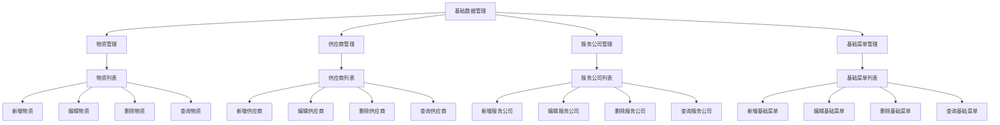

#  基础数据管理

##  用户故事列表

###  US-3.2.1-001: 基础数据维护管理(Priority:1,Efforts:2 PM)
- Who: 学校管理员
- What: 实现对基础数据的维护与管理
- Why: 为食堂物资管理提供统一的数据源
- 关联用例: UC-3.2.1-001, UC-3.2.1-002, UC-3.2.1-003, UC-3.2.1-004

##  用例列表

###  UC-3.2.1-001: 物资管理(CRUD)(useCaseType:ui)

####  基本信息
- menuId: /material/list
- 参与者: 学校管理员
- 简要描述: 对物资信息进行新增、编辑、删除和查询操作

####  详细说明
- 前置条件: 用户已登录系统，具有基础数据管理权限
- 基本流程:
  1. 用户进入物资管理页面
  2. 用户可执行新增、编辑、删除、查询操作
- 异常流程:
  1. 用户无权限操作，系统提示无权限
- 后置条件: 数据变更已生效，页面刷新显示更新内容

###  UC-3.2.1-002: 供应商管理(CRUD)(useCaseType:ui)

####  基本信息
- menuId: /supplier/list
- 参与者: 学校管理员
- 简要描述: 对供应商信息进行新增、编辑、删除和查询操作

####  详细说明
- 前置条件: 用户已登录系统，具有基础数据管理权限
- 基本流程:
  1. 用户进入供应商管理页面
  2. 用户可执行新增、编辑、删除、查询操作
- 异常流程:
  1. 用户无权限操作，系统提示无权限
- 后置条件: 数据变更已生效，页面刷新显示更新内容

###  UC-3.2.1-003: 服务公司管理(CRUD)(useCaseType:ui)

####  基本信息
- menuId: /service_company/list
- 参与者: 学校管理员
- 简要描述: 对服务公司信息进行新增、编辑、删除和查询操作

####  详细说明
- 前置条件: 用户已登录系统，具有基础数据管理权限
- 基本流程:
  1. 用户进入服务公司管理页面
  2. 用户可执行新增、编辑、删除、查询操作
- 异常流程:
  1. 用户无权限操作，系统提示无权限
- 后置条件: 数据变更已生效，页面刷新显示更新内容

###  UC-3.2.1-004: 基础菜单管理(CRUD)(useCaseType:ui)

####  基本信息
- menuId: /menu/list
- 参与者: 学校管理员
- 简要描述: 对基础菜单信息进行新增、编辑、删除和查询操作

####  详细说明
- 前置条件: 用户已登录系统，具有基础数据管理权限
- 基本流程:
  1. 用户进入基础菜单管理页面
  2. 用户可执行新增、编辑、删除、查询操作
- 异常流程:
  1. 用户无权限操作，系统提示无权限
- 后置条件: 数据变更已生效，页面刷新显示更新内容

##  页面列表

###  物资管理页面(pageType:list)
- menuId: /material/list
- 功能: 物资信息的增删改查及查询统计
- 交互元素: 表格、搜索框、新增按钮、编辑按钮、删除按钮、导出按钮

###  供应商管理页面(pageType:list)
- menuId: /supplier/list
- 功能: 供应商信息的增删改查及查询统计
- 交互元素: 表格、搜索框、新增按钮、编辑按钮、删除按钮、导出按钮

###  服务公司管理页面(pageType:list)
- menuId: /service_company/list
- 功能: 服务公司信息的增删改查及查询统计
- 交互元素: 表格、搜索框、新增按钮、编辑按钮、删除按钮、导出按钮

###  基础菜单管理页面(pageType:list)
- menuId: /menu/list
- 功能: 基础菜单信息的增删改查及查询统计
- 交互元素: 表格、搜索框、新增按钮、编辑按钮、删除按钮、导出按钮

##  UI交互流程

##  业务规则
- 物资入库时，已禁用的供应商将不出现在选择列表中，其历史数据将会保留。
- 已禁用的服务公司不能再登录使用系统，但历史数据将会保留。
- 每日菜单不能再进行编辑及删除操作，如果菜单日期已纳入结算日。
- 出入库操作时，有权限的用户可锁定数据，已锁定的数据不能再编辑和删除。
- 服务公司的每日菜单只能从基础菜单中进行选择，如有缺少需通知学校管理员补充录入。
- 附件材料（入库时需将供应商提供的票据作为附件上传）。
- 供应商结算以入库单为依据，每项数据包含总金额、已结金额等。
- 日偏差数据是指根据每日出库单、每日成本核算，自动计算偏差。

