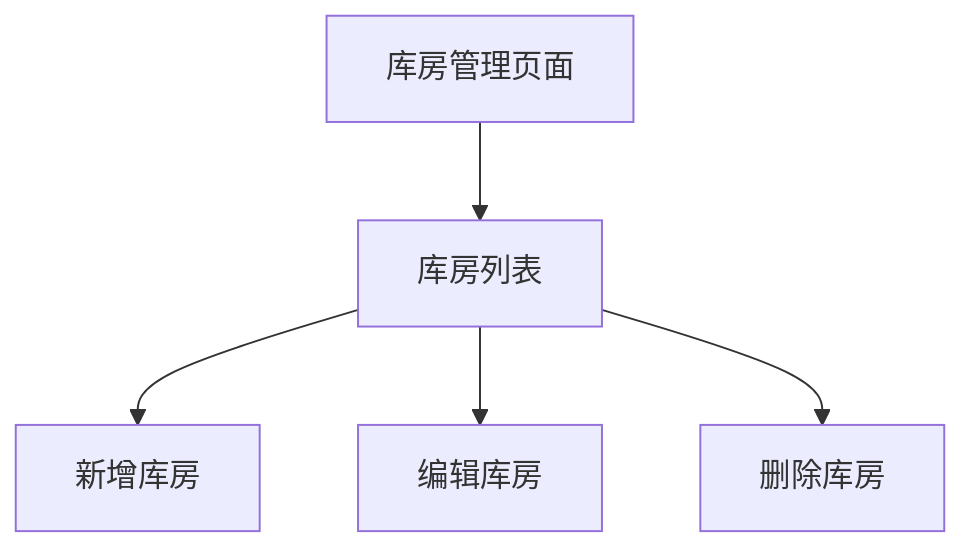

#  库房管理

##  用户故事列表

###  US-3.2.2-001: 管理库房信息(Priority:2,Efforts:1 PM)
- Who: 服务公司管理员
- What: 对库房信息进行新增、编辑、删除操作
- Why: 实现对服务公司库房的统一管理
- 关联用例: UC-3.2.2-001, UC-3.2.2-002, UC-3.2.2-003

##  用例列表

###  UC-3.2.2-001: 库房信息新增(useCaseType:ui)

####  基本信息
- menuId: /warehouse/list
- 参与者: 服务公司管理员
- 简要描述: 新增库房信息

####  详细说明
- 前置条件: 用户拥有库房管理权限
- 基本流程:
  1. 用户进入库房管理页面
  2. 点击“新增库房”按钮
  3. 填写库房编码、库房名称、所属公司、备注等信息
  4. 提交表单，系统保存库房信息
- 异常流程:
  1. 用户未填写必填字段，系统提示错误
  2. 用户填写了重复的库房编码，系统提示编码已存在
- 后置条件: 系统新增一条库房记录，用户返回库房列表页面

###  UC-3.2.2-002: 库房信息编辑(useCaseType:ui)

####  基本信息
- menuId: /warehouse/list
- 参与者: 服务公司管理员
- 简要描述: 编辑库房信息

####  详细说明
- 前置条件: 用户拥有库房管理权限
- 基本流程:
  1. 用户进入库房管理页面
  2. 选择某条库房记录，点击“编辑”按钮
  3. 修改库房编码、库房名称、所属公司、备注等信息
  4. 提交表单，系统更新库房信息
- 异常流程:
  1. 用户未填写必填字段，系统提示错误
  2. 用户填写了重复的库房编码，系统提示编码已存在
- 后置条件: 系统更新库房记录，用户返回库房列表页面

###  UC-3.2.2-003: 库房信息删除(useCaseType:ui)

####  基本信息
- menuId: /warehouse/list
- 参与者: 服务公司管理员
- 简要描述: 删除库房信息

####  详细说明
- 前置条件: 用户拥有库房管理权限
- 基本流程:
  1. 用户进入库房管理页面
  2. 选择某条库房记录，点击“删除”按钮
  3. 系统弹出确认框，用户确认删除
  4. 系统删除库房信息
- 异常流程:
  1. 用户未选择库房记录，系统提示无选中记录
- 后置条件: 系统删除库房记录，用户返回库房列表页面

##  页面列表

###  库房列表(pageType:list)
- menuId: /warehouse/list
- 功能: 展示所有库房信息，支持新增、编辑、删除操作
- 交互元素: 搜索框、表格、新增按钮、编辑按钮、删除按钮

##  UI交互流程

##  业务规则
- 库房编码必须唯一，且不能重复
- 库房名称不能为空
- 库房所属公司必须与服务公司编码匹配
- 删除库房前需确认无关联数据（如出入库记录、盘库记录等）

