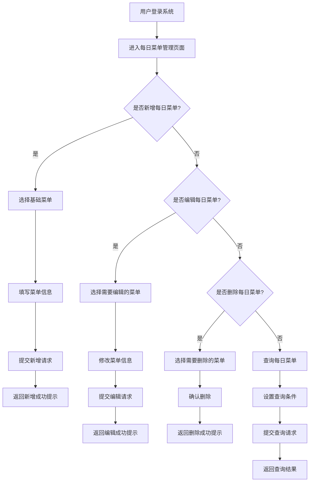

#  每日菜单管理

##  用户故事列表

###  US-3.2.3-001: 服务公司每日菜单维护(Priority:2,Efforts:1 PM)
- Who: 服务公司管理员
- What: 对每日菜单进行新增、编辑、删除及查询操作
- Why: 保证每日菜单的准确性和可追溯性，支持后续成本核算及结算
- 关联用例: UC-3.2.3-001, UC-3.2.3-002, UC-3.2.3-003, UC-3.2.3-004

###  US-3.2.3-002: 学校管理员审核基础菜单(Priority:3,Efforts:1 PM)
- Who: 学校管理员
- What: 审核并补充基础菜单
- Why: 保证每日菜单的完整性，支持服务公司选择
- 关联用例: UC-3.2.3-005

###  US-3.2.3-003: 每日菜单与结算日绑定(Priority:4,Efforts:1 PM)
- Who: 系统管理员
- What: 设置每日菜单与结算日的绑定关系
- Why: 控制每日菜单在结算日不可编辑或删除，保障结算准确性
- 关联用例: UC-3.2.3-006

##  用例列表

###  UC-3.2.3-001: 新增每日菜单(useCaseType:ui)

####  基本信息
- menuId: /daily-menu/create
- 参与者: 服务公司管理员
- 简要描述: 服务公司管理员新增每日菜单

####  详细说明
- 前置条件: 用户已登录系统，拥有服务公司管理员权限
- 基本流程:
  1. 用户进入“每日菜单管理”页面
  2. 点击“新增”按钮
  3. 选择基础菜单
  4. 填写菜单日期、类别、菜单编码、菜单名称、菜单图片、菜单配料
  5. 提交数据
- 异常流程:
  1. 用户未选择基础菜单，系统提示“请选择基础菜单”
  2. 用户未填写菜单日期，系统提示“请输入菜单日期”
- 后置条件: 系统保存新增的每日菜单数据，返回新增成功提示

###  UC-3.2.3-002: 编辑每日菜单(useCaseType:ui)

####  基本信息
- menuId: /daily-menu/edit
- 参与者: 服务公司管理员
- 简要描述: 服务公司管理员编辑每日菜单

####  详细说明
- 前置条件: 用户已登录系统，拥有服务公司管理员权限
- 基本流程:
  1. 用户进入“每日菜单管理”页面
  2. 点击“编辑”按钮
  3. 修改菜单信息
  4. 提交数据
- 异常流程:
  1. 用户未选择基础菜单，系统提示“请选择基础菜单”
  2. 用户未填写菜单日期，系统提示“请输入菜单日期”
- 后置条件: 系统更新每日菜单数据，返回编辑成功提示

###  UC-3.2.3-003: 删除每日菜单(useCaseType:ui)

####  基本信息
- menuId: /daily-menu/delete
- 参与者: 服务公司管理员
- 简要描述: 服务公司管理员删除每日菜单

####  详细说明
- 前置条件: 用户已登录系统，拥有服务公司管理员权限
- 基本流程:
  1. 用户进入“每日菜单管理”页面
  2. 选择需要删除的每日菜单
  3. 点击“删除”按钮
  4. 确认删除
- 异常流程:
  1. 用户尝试删除已结算的每日菜单，系统提示“结算日不可删除”
- 后置条件: 系统删除指定的每日菜单数据，返回删除成功提示

###  UC-3.2.3-004: 查询每日菜单(useCaseType:ui)

####  基本信息
- menuId: /daily-menu/list
- 参与者: 服务公司管理员
- 简要描述: 服务公司管理员查询每日菜单

####  详细说明
- 前置条件: 用户已登录系统，拥有服务公司管理员权限
- 基本流程:
  1. 用户进入“每日菜单管理”页面
  2. 设置查询条件（如菜单日期、菜单名称等）
  3. 点击“查询”按钮
- 异常流程: 无
- 后置条件: 系统展示符合条件的每日菜单列表

###  UC-3.2.3-005: 审核基础菜单(useCaseType:ui)

####  基本信息
- menuId: /menu/audit
- 参与者: 学校管理员
- 简要描述: 学校管理员审核并补充基础菜单

####  详细说明
- 前置条件: 用户已登录系统，拥有学校管理员权限
- 基本流程:
  1. 用户进入“基础菜单管理”页面
  2. 查看未审核的基础菜单
  3. 点击“审核”或“补充”按钮
  4. 提交审核结果
- 异常流程:
  1. 用户未填写菜单名称，系统提示“请输入菜单名称”
- 后置条件: 系统更新基础菜单状态，返回审核成功提示

###  UC-3.2.3-006: 绑定每日菜单与结算日(useCaseType:api)

####  基本信息
- menuId: /daily-menu/settlement
- 参与者: 系统管理员
- 简要描述: 系统管理员设置每日菜单与结算日的绑定关系

####  详细说明
- 前置条件: 用户已登录系统，拥有系统管理员权限
- 基本流程:
  1. 用户进入“结算日管理”页面
  2. 选择需要绑定的每日菜单
  3. 设置结算日
  4. 提交数据
- 异常流程:
  1. 用户未选择每日菜单，系统提示“请选择每日菜单”
  2. 用户未设置结算日，系统提示“请输入结算日”
- 后置条件: 系统更新每日菜单与结算日的绑定关系，返回绑定成功提示

##  页面列表

###  每日菜单管理(pageType:list)
- menuId: /daily-menu/list
- 功能: 显示每日菜单列表，支持查询、新增、编辑、删除操作
- 交互元素: 搜索框、表格、新增按钮、编辑按钮、删除按钮、分页控件

###  基础菜单管理(pageType:list)
- menuId: /menu/list
- 功能: 显示基础菜单列表，支持审核、补充操作
- 交互元素: 搜索框、表格、审核按钮、补充按钮、分页控件

##  UI交互流程

##  业务规则
- 每日菜单只能从基础菜单中选择，服务公司管理员无法自行创建新菜单
- 服务公司管理员在结算日不可编辑或删除每日菜单
- 若基础菜单未审核，服务公司无法选择该菜单
- 每日菜单的菜单日期、类别、菜单编码、菜单名称、菜单图片、菜单配料等字段为必填项
- 每日菜单的菜单编码由系统自动生成
- 每日菜单的菜单图片为可选字段，若未上传则默认使用基础菜单图片
- 每日菜单的菜单配料为必填字段，需填写具体食材信息
- 每日菜单的菜单日期为日期类型，格式为“YYYY-MM-DD”

