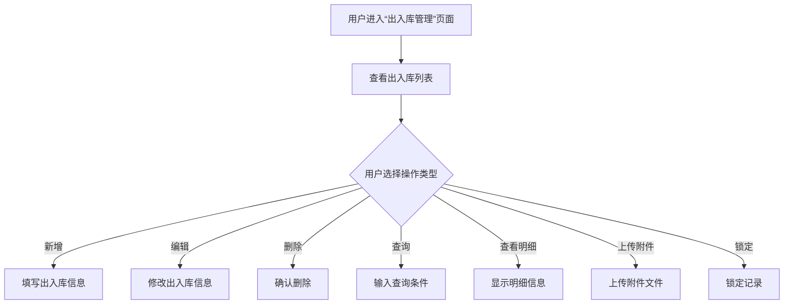

#  入出库管理

##  用户故事列表

###  US-3.2.4-001: 实现出入库操作功能(Priority:1,Efforts:3 PM)
- Who: 服务公司管理员
- What: 实现物资的出入库操作，包括新增、编辑、删除、查询等基础CRUD操作
- Why: 保证服务公司能够准确记录物资的出入库情况，便于成本核算和库存管理
- 关联用例: UC-3.2.4-001, UC-3.2.4-002, UC-3.2.4-003, UC-3.2.4-004, UC-3.2.4-005, UC-3.2.4-006, UC-3.2.4-007

###  US-3.2.4-002: 实现出入库锁定机制(Priority:2,Efforts:2 PM)
- Who: 系统管理员、服务公司管理员
- What: 实现对出入库数据的锁定功能，确保锁定后的数据不能被修改或删除
- Why: 保证数据的完整性，防止在结算或对账过程中数据被误操作
- 关联用例: UC-3.2.4-008

##  用例列表

###  UC-3.2.4-001: 新增出入库记录(useCaseType:ui)

####  基本信息
- menuId: /in-out-stock
- 参与者: 服务公司管理员
- 简要描述: 服务公司管理员可以新增一条出入库记录

####  详细说明
- 前置条件: 用户已登录系统，具有出入库操作权限
- 基本流程:
  1. 用户进入“出入库管理”页面
  2. 点击“新增”按钮
  3. 填写出入库编码、出入库日期、库房、经手人、供应商、已付金额、合计金额等字段
  4. 上传附件材料（如供应商票据）
  5. 点击“保存”按钮
- 异常流程:
  1. 如果必填字段未填写，提示“请填写完整信息”
  2. 如果附件材料未上传，提示“请上传相关附件”
- 后置条件: 新增的出入库记录显示在出入库列表中

###  UC-3.2.4-002: 编辑出入库记录(useCaseType:ui)

####  基本信息
- menuId: /in-out-stock
- 参与者: 服务公司管理员
- 简要描述: 服务公司管理员可以编辑已有的出入库记录

####  详细说明
- 前置条件: 用户已登录系统，具有出入库操作权限
- 基本流程:
  1. 用户进入“出入库管理”页面
  2. 选择要编辑的出入库记录
  3. 点击“编辑”按钮
  4. 修改出入库编码、出入库日期、库房、经手人、供应商、已付金额、合计金额等字段
  5. 上传附件材料（如供应商票据）
  6. 点击“保存”按钮
- 异常流程:
  1. 如果必填字段未填写，提示“请填写完整信息”
  2. 如果附件材料未上传，提示“请上传相关附件”
- 后置条件: 修改后的出入库记录更新在出入库列表中

###  UC-3.2.4-003: 删除出入库记录(useCaseType:ui)

####  基本信息
- menuId: /in-out-stock
- 参与者: 服务公司管理员
- 简要描述: 服务公司管理员可以删除已有的出入库记录

####  详细说明
- 前置条件: 用户已登录系统，具有出入库操作权限
- 基本流程:
  1. 用户进入“出入库管理”页面
  2. 选择要删除的出入库记录
  3. 点击“删除”按钮
  4. 确认删除操作
  5. 系统提示“删除成功”
- 异常流程:
  1. 如果记录已被锁定，提示“该记录已被锁定，不能删除”
- 后置条件: 删除的出入库记录从出入库列表中移除

###  UC-3.2.4-004: 查询出入库记录(useCaseType:ui)

####  基本信息
- menuId: /in-out-stock
- 参与者: 服务公司管理员
- 简要描述: 服务公司管理员可以根据条件查询出入库记录

####  详细说明
- 前置条件: 用户已登录系统，具有出入库操作权限
- 基本流程:
  1. 用户进入“出入库管理”页面
  2. 点击“查询”按钮
  3. 输入查询条件（如出入库日期、库房、供应商等）
  4. 点击“搜索”按钮
  5. 系统返回符合条件的出入库记录
- 异常流程:
  1. 如果查询条件为空，提示“请输入查询条件”
- 后置条件: 查询结果显示在出入库列表中

###  UC-3.2.4-005: 查看出入库明细(useCaseType:ui)

####  基本信息
- menuId: /in-out-stock
- 参与者: 服务公司管理员
- 简要描述: 服务公司管理员可以查看出入库明细

####  详细说明
- 前置条件: 用户已登录系统，具有出入库操作权限
- 基本流程:
  1. 用户进入“出入库管理”页面
  2. 选择一条出入库记录
  3. 点击“查看详情”按钮
  4. 显示该出入库的明细信息，包括物资编码、物资名称、单价、数量、金额等
- 异常流程:
  1. 如果记录不存在，提示“记录不存在”
- 后置条件: 明细信息显示在详情页面中

###  UC-3.2.4-006: 上传附件材料(useCaseType:ui)

####  基本信息
- menuId: /in-out-stock
- 参与者: 服务公司管理员
- 简要描述: 服务公司管理员可以上传出入库时的附件材料

####  详细说明
- 前置条件: 用户已登录系统，具有出入库操作权限
- 基本流程:
  1. 用户进入“出入库管理”页面
  2. 选择一条出入库记录
  3. 点击“上传附件”按钮
  4. 选择文件并上传
  5. 系统提示“上传成功”
- 异常流程:
  1. 如果文件格式不支持，提示“不支持的文件格式”
- 后置条件: 附件材料保存在系统中，并与出入库记录关联

###  UC-3.2.4-007: 查看附件材料(useCaseType:ui)

####  基本信息
- menuId: /in-out-stock
- 参与者: 服务公司管理员
- 简要描述: 服务公司管理员可以查看出入库时上传的附件材料

####  详细说明
- 前置条件: 用户已登录系统，具有出入库操作权限
- 基本流程:
  1. 用户进入“出入库管理”页面
  2. 选择一条出入库记录
  3. 点击“查看附件”按钮
  4. 系统显示附件列表及下载链接
- 异常流程:
  1. 如果没有附件，提示“暂无附件”
- 后置条件: 附件列表显示在页面中

###  UC-3.2.4-008: 锁定出入库记录(useCaseType:ui)

####  基本信息
- menuId: /in-out-stock
- 参与者: 系统管理员、服务公司管理员
- 简要描述: 有权限的用户可以锁定出入库记录，防止被修改或删除

####  详细说明
- 前置条件: 用户已登录系统，具有锁定权限
- 基本流程:
  1. 用户进入“出入库管理”页面
  2. 选择一条出入库记录
  3. 点击“锁定”按钮
  4. 系统提示“锁定成功”
- 异常流程:
  1. 如果记录已被锁定，提示“该记录已被锁定”
- 后置条件: 被锁定的记录不能再被编辑或删除

##  页面列表

###  入出库管理(pageType:list)
- menuId: /in-out-stock
- 功能: 显示出入库记录列表，支持新增、编辑、删除、查询、查看明细、上传附件、锁定等操作
- 交互元素: 表格、搜索框、新增按钮、编辑按钮、删除按钮、查看详情按钮、上传附件按钮、锁定按钮

###  出入库明细(pageType:detail)
- menuId: /in-out-stock
- 功能: 显示出入库记录的明细信息，包括物资编码、物资名称、单价、数量、金额等
- 交互元素: 明细表格、附件下载链接

##  UI交互流程

##  业务规则
- 物资入库时，已禁用的供应商将不出现在选择列表中，其历史数据将会保留。
- 已禁用的服务公司不能再登录使用系统，但历史数据将会保留。
- 每日菜单不能再进行编辑及删除操作，如果菜单日期已纳入结算日。
- 出入库操作时，有权限的用户可锁定数据，已锁定的数据不能再编辑和删除。
- 服务公司的每日菜单只能从基础菜单中进行选择，如有缺少需通知学校管理员补充录入。
- 附件材料（入库时需将供应商提供的票据作为附件上传）。
- 供应商结算以入库单为依据，每项数据包含总金额、已结金额等。
- 日偏差数据是指根据每日出库单、每日成本核算，自动计算偏差。

