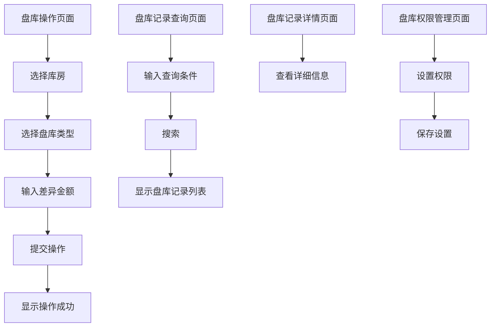

#  盘库管理

##  用户故事列表

###  US-3.2.5-001: 盘库操作管理(Priority:3,Efforts:1 PM)
- Who: 服务公司管理员
- What: 支持对库存误差进行盘库入库及盘库出库操作
- Why: 为了准确掌握库存状态，及时处理库存差异，确保物资管理的准确性
- 关联用例: UC-3.2.5-001, UC-3.2.5-002, UC-3.2.5-003, UC-3.2.5-004, UC-3.2.5-005

##  用例列表

###  UC-3.2.5-001: 盘库操作(Priority:3,useCaseType:ui)

####  基本信息
- menuId: /inventory/check
- 参与者: 服务公司管理员
- 简要描述: 进行盘库操作，记录库存差异

####  详细说明
- 前置条件: 用户已登录系统，拥有盘库操作权限
- 基本流程:
  1. 用户进入盘库操作页面
  2. 用户选择库房及盘库日期
  3. 用户选择盘库类型（入库/出库）
  4. 用户输入差异金额
  5. 用户提交盘库操作
- 异常流程:
  1. 用户未选择库房，系统提示错误
  2. 用户未选择盘库类型，系统提示错误
  3. 差异金额格式不正确，系统提示错误
- 后置条件: 盘库记录已保存至盘库表

###  UC-3.2.5-002: 盘库记录查询(Priority:3,useCaseType:ui)

####  基本信息
- menuId: /inventory/check
- 参与者: 服务公司管理员
- 简要描述: 查询盘库记录，查看库存差异情况

####  详细说明
- 前置条件: 用户已登录系统，拥有盘库操作权限
- 基本流程:
  1. 用户进入盘库记录查询页面
  2. 用户输入查询条件（如盘库日期、库房、盘库类型）
  3. 系统根据条件查询并展示盘库记录
- 异常流程:
  1. 查询条件格式不正确，系统提示错误
- 后置条件: 盘库记录列表展示完成

###  UC-3.2.5-003: 盘库记录详情查看(Priority:3,useCaseType:ui)

####  基本信息
- menuId: /inventory/check
- 参与者: 服务公司管理员
- 简要描述: 查看盘库记录的详细信息

####  详细说明
- 前置条件: 用户已登录系统，拥有盘库操作权限
- 基本流程:
  1. 用户在盘库记录列表中选择一条记录
  2. 系统展示该记录的详细信息
- 异常流程:
  1. 未选择记录，系统提示错误
- 后置条件: 盘库记录详细信息展示完成

###  UC-3.2.5-004: 盘库记录导出(Priority:3,useCaseType:ui)

####  基本信息
- menuId: /inventory/check
- 参与者: 服务公司管理员
- 简要描述: 导出盘库记录为Excel或PDF格式

####  详细说明
- 前置条件: 用户已登录系统，拥有盘库操作权限
- 基本流程:
  1. 用户进入盘库记录查询页面
  2. 用户选择导出格式（Excel/PDF）
  3. 系统生成并下载导出文件
- 异常流程:
  1. 导出格式不支持，系统提示错误
- 后置条件: 导出文件生成并下载完成

###  UC-3.2.5-005: 盘库操作权限管理(Priority:3,useCaseType:ui)

####  基本信息
- menuId: /inventory/check
- 参与者: 系统管理员
- 简要描述: 管理盘库操作的权限设置

####  详细说明
- 前置条件: 用户已登录系统，拥有系统管理员权限
- 基本流程:
  1. 用户进入盘库权限管理页面
  2. 用户设置用户或角色的盘库操作权限
  3. 系统保存权限设置
- 异常流程:
  1. 权限设置格式不正确，系统提示错误
- 后置条件: 权限设置保存完成

##  页面列表

###  盘库操作页面(pageType:ui)
- menuId: /inventory/check
- 功能: 进行盘库操作，记录库存差异
- 交互元素: 库房选择、盘库类型选择、差异金额输入、提交按钮

###  盘库记录查询页面(pageType:ui)
- menuId: /inventory/check
- 功能: 查询盘库记录，查看库存差异情况
- 交互元素: 查询条件输入框、搜索按钮、导出按钮

###  盘库记录详情页面(pageType:ui)
- menuId: /inventory/check
- 功能: 查看盘库记录的详细信息
- 交互元素: 详细信息展示区

###  盘库权限管理页面(pageType:ui)
- menuId: /inventory/check
- 功能: 管理盘库操作的权限设置
- 交互元素: 用户/角色选择、权限设置、保存按钮

##  UI交互流程

##  业务规则
- 盘库操作必须选择库房和盘库类型，差异金额不能为空且为数值类型
- 盘库记录仅可由拥有权限的用户进行操作
- 盘库记录查询支持按库房、盘库日期、盘库类型进行筛选
- 盘库记录导出支持Excel和PDF格式
- 盘库操作权限可由系统管理员进行配置，控制哪些用户或角色可以执行盘库操作

