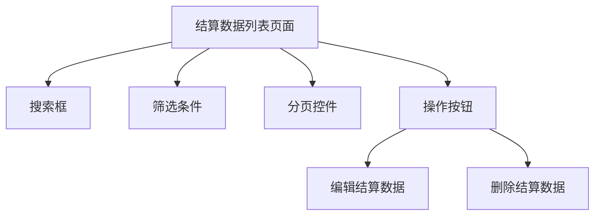

#  供应商结算

##  用户故事列表

###  US-3.2.6-001: 供应商结算数据维护(Priority:2,Efforts:1 PM)
- Who: 服务公司管理员
- What: 实现供应商结算数据的录入、查询、修改和删除功能
- Why: 以入库单为依据，维护供应商结算信息，确保结算数据准确
- 关联用例: UC-3.2.6-001, UC-3.2.6-002, UC-3.2.6-003, UC-3.2.6-004

##  用例列表

###  UC-3.2.6-001: 结算数据录入(useCaseType:ui)

####  基本信息
- menuId: /supplier_settlement/list
- 参与者: 服务公司管理员
- 简要描述: 新增结算数据，支持选择入库单、填写总金额、已结金额等信息

####  详细说明
- 前置条件: 用户具有结算录入权限
- 基本流程:
  1. 用户进入结算数据录入页面
  2. 用户选择对应的入库单
  3. 用户填写总金额、已结金额等字段
  4. 用户点击保存按钮
- 异常流程:
  1. 用户未选择入库单，系统提示错误
  2. 用户输入金额格式不正确，系统提示错误
- 后置条件: 数据成功保存，并显示在结算数据列表中

###  UC-3.2.6-002: 结算数据查询(useCaseType:ui)

####  基本信息
- menuId: /supplier_settlement/list
- 参与者: 服务公司管理员
- 简要描述: 根据条件查询结算数据，支持过滤、排序、分页

####  详细说明
- 前置条件: 用户具有结算查询权限
- 基本流程:
  1. 用户进入结算数据列表页面
  2. 用户输入查询条件（如入库单编号、供应商名称等）
  3. 用户点击查询按钮
  4. 系统展示查询结果
- 异常流程:
  1. 用户输入非法条件，系统提示错误
- 后置条件: 显示查询结果

###  UC-3.2.6-003: 结算数据修改(useCaseType:ui)

####  基本信息
- menuId: /supplier_settlement/list
- 参与者: 服务公司管理员
- 简要描述: 修改已有的结算数据，支持编辑总金额、已结金额等信息

####  详细说明
- 前置条件: 用户具有结算修改权限
- 基本流程:
  1. 用户进入结算数据列表页面
  2. 用户选择一条结算数据
  3. 用户点击编辑按钮
  4. 用户修改相关字段
  5. 用户点击保存按钮
- 异常流程:
  1. 用户未选择数据，系统提示错误
  2. 用户输入金额格式不正确，系统提示错误
- 后置条件: 数据成功更新，并显示在列表中

###  UC-3.2.6-004: 结算数据删除(useCaseType:ui)

####  基本信息
- menuId: /supplier_settlement/list
- 参与者: 服务公司管理员
- 简要描述: 删除指定的结算数据

####  详细说明
- 前置条件: 用户具有结算删除权限
- 基本流程:
  1. 用户进入结算数据列表页面
  2. 用户选择一条结算数据
  3. 用户点击删除按钮
  4. 系统提示确认删除
  5. 用户确认后，系统执行删除操作
- 异常流程:
  1. 用户未选择数据，系统提示错误
  2. 删除操作失败，系统提示错误
- 后置条件: 数据从列表中移除

##  页面列表

###  结算数据列表(pageType:list)
- menuId: /supplier_settlement/list
- 功能: 展示所有结算数据，支持查询、过滤、排序、分页
- 交互元素: 搜索框、筛选条件、分页控件、操作按钮（编辑、删除）

##  UI交互流程

##  业务规则
- 供应商结算以入库单为依据，每项数据包含总金额、已结金额等
- 已禁用的供应商将不出现在选择列表中，其历史数据将会保留
- 已禁用的服务公司不能再登录使用系统，但历史数据将会保留
- 附件材料（入库时需将供应商提供的票据作为附件上传）
- 供应商结算数据只能由有权限的用户进行录入、查询、修改、删除操作
- 日偏差数据是指根据每日出库单、每日成本核算，自动计算偏差

