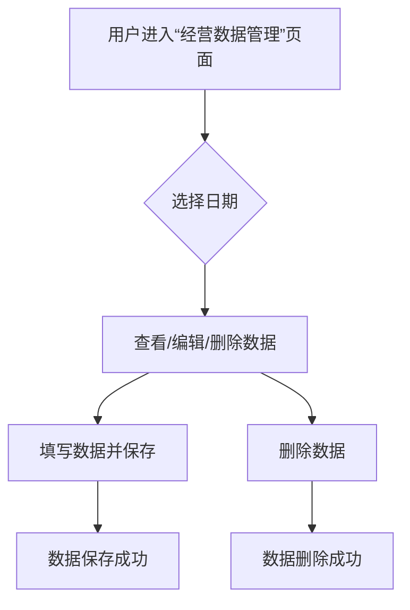

#  经营数据管理

##  用户故事列表

###  US-3.2.7-001: 经营数据录入与管理(Priority:2,Efforts:2 PM)
- Who: 服务公司管理员
- What: 实现经营数据的录入、查看、编辑、删除等操作，支持数据的统计与分析
- Why: 为经营分析提供数据支撑，便于成本控制与决策
- 关联用例: UC-3.2.7-001, UC-3.2.7-002, UC-3.2.7-003, UC-3.2.7-004

##  用例列表

###  UC-3.2.7-001: 经营数据录入(useCaseType:ui)

####  基本信息
- menuId: /A/operating_data
- 参与者: 服务公司管理员
- 简要描述: 服务公司管理员录入每日经营数据，包括订餐人数、经营成本、日偏差数据等

####  详细说明
- 前置条件: 用户已登录系统，具有经营数据录入权限
- 基本流程:
  1. 用户进入“经营数据管理”页面
  2. 用户选择日期
  3. 用户填写订餐人数、经营成本、日偏差数据等信息
  4. 用户点击“保存”按钮
- 异常流程:
  1. 用户未选择日期，系统提示“请选择日期”
  2. 用户未填写必填字段，系统提示“请填写完整信息”
- 后置条件: 数据成功保存至经营数据表

###  UC-3.2.7-002: 经营数据查看(useCaseType:ui)

####  基本信息
- menuId: /A/operating_data
- 参与者: 服务公司管理员
- 简要描述: 服务公司管理员查看历史经营数据

####  详细说明
- 前置条件: 用户已登录系统，具有经营数据查看权限
- 基本流程:
  1. 用户进入“经营数据管理”页面
  2. 用户选择日期范围
  3. 系统展示对应日期的经营数据
- 异常流程: 无
- 后置条件: 显示对应日期的经营数据

###  UC-3.2.7-003: 经营数据编辑(useCaseType:ui)

####  基本信息
- menuId: /A/operating_data
- 参与者: 服务公司管理员
- 简要描述: 服务公司管理员编辑已录入的经营数据

####  详细说明
- 前置条件: 用户已登录系统，具有经营数据编辑权限
- 基本流程:
  1. 用户进入“经营数据管理”页面
  2. 用户选择日期
  3. 用户修改对应字段信息
  4. 用户点击“保存”按钮
- 异常流程:
  1. 用户未选择日期，系统提示“请选择日期”
  2. 用户未填写必填字段，系统提示“请填写完整信息”
- 后置条件: 数据成功更新

###  UC-3.2.7-004: 经营数据删除(useCaseType:ui)

####  基本信息
- menuId: /A/operating_data
- 参与者: 服务公司管理员
- 简要描述: 服务公司管理员删除已录入的经营数据

####  详细说明
- 前置条件: 用户已登录系统，具有经营数据删除权限
- 基本流程:
  1. 用户进入“经营数据管理”页面
  2. 用户选择日期
  3. 用户点击“删除”按钮
  4. 系统提示“确认删除”
  5. 用户点击“确认”
- 异常流程:
  1. 用户未选择日期，系统提示“请选择日期”
- 后置条件: 数据成功删除

##  页面列表

###  经营数据管理(pageType:list)
- menuId: /A/operating_data
- 功能: 查看、录入、编辑、删除经营数据
- 交互元素: 日期选择器、表格、编辑按钮、删除按钮、保存按钮

##  UI交互流程

##  业务规则
- 经营数据必须包含日期、订餐人数、经营成本、日偏差数据等字段
- 日偏差数据由系统根据出入库数据和成本核算自动计算，不可手动修改
- 已锁定的经营数据不可编辑或删除
- 经营数据录入后，若涉及结算日，不可进行编辑或删除操作

