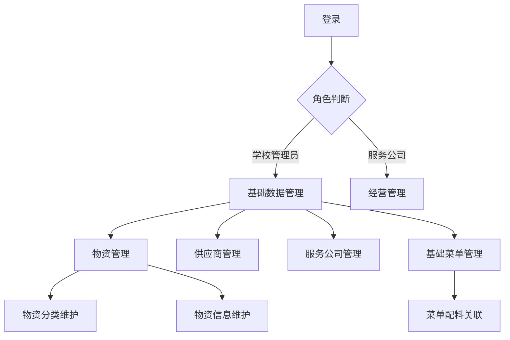
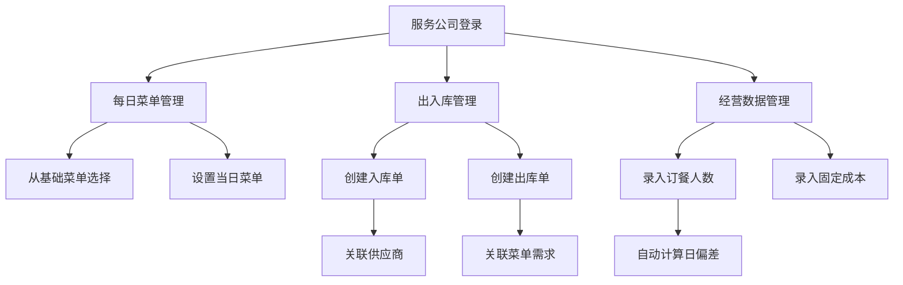
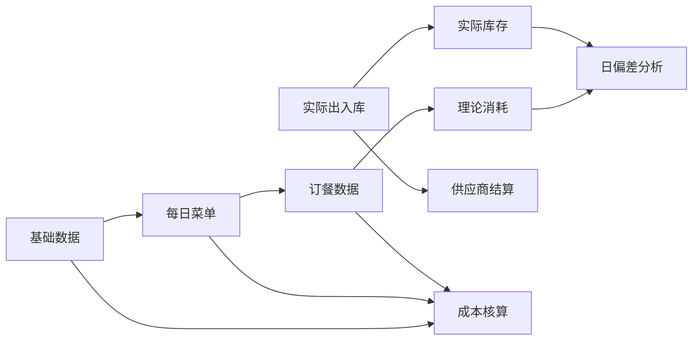

【任务目标】
根据需求，进一步完善指定表的设计，返回结果遵循指定的XML格式。如有必要，可以增加新的表。如果已经很完善，则返回[NO_CHANGE]。

【要求】
 1. 不需要考虑User, Role，权限管理，页面资源等公共表。
 2. 返回全部的表定义，不仅仅是返回新增的表。
 3. 所有ext:dict都在dicts集合中定义，status等字段应该使用dict。


【表定义】

```xml
<orm>
    <dicts>
        <dict name="material_status" label="物资状态">
            <description>物资的启用/禁用状态</description>
            <option value="ENABLED" label="启用" description="物资处于可用状态"/>
            <option value="DISABLED" label="禁用" description="物资处于不可用状态"/>
        </dict>
        <dict name="supplier_status" label="供应商状态">
            <description>供应商的启用/禁用状态</description>
            <option value="ENABLED" label="启用" description="供应商处于合作状态"/>
            <option value="DISABLED" label="禁用" description="供应商停止合作"/>
        </dict>
        <dict name="company_status" label="服务公司状态">
            <description>服务公司的启用/禁用状态</description>
            <option value="ENABLED" label="启用" description="服务公司处于合作状态"/>
            <option value="DISABLED" label="禁用" description="服务公司停止合作"/>
        </dict>
        <dict name="stock_operation_type" label="库存操作类型">
            <description>出入库操作类型</description>
            <option value="IN" label="入库" description="物资入库操作"/>
            <option value="OUT" label="出库" description="物资出库操作"/>
            <option value="ADJUST" label="调整" description="库存调整操作"/>
        </dict>
        <dict name="inventory_status" label="盘点状态">
            <description>库存盘点单的状态</description>
            <option value="DRAFT" label="草稿" description="盘点单未提交"/>
            <option value="CONFIRMED" label="已确认" description="盘点单已确认"/>
            <option value="ADJUSTED" label="已调整" description="库存已调整"/>
        </dict>
        <dict name="settlement_status" label="结算状态">
            <description>供应商结算单的状态</description>
            <option value="PENDING" label="待结算" description="待结算状态"/>
            <option value="PARTIAL" label="部分结算" description="已部分结算"/>
            <option value="COMPLETED" label="已完成" description="结算已完成"/>
        </dict>
    </dicts>
    <entities>
        <!-- 物资分类表 -->
        <entity name="material_category" displayName="物资分类">
            <comment>物资的多级分类信息</comment>
            <columns>
                <column name="id" displayName="ID" mandatory="true" primary="true" stdDomain="INT" sqlType="BIGINT"/>
                <column name="name" displayName="分类名称" mandatory="true" stdDomain="VARCHAR" sqlType="VARCHAR" precision="100"/>
                <column name="code" displayName="分类编码" mandatory="true" stdDomain="VARCHAR" sqlType="VARCHAR" precision="50"/>
                <column name="parent_id" displayName="父分类ID" mandatory="false" stdDomain="INT" sqlType="BIGINT" orm:ref-table="material_category" orm:ref-prop="children" orm:ref-prop-display-name="子分类"/>
                <column name="level" displayName="分类层级" mandatory="true" stdDomain="INT" sqlType="INT"/>
                <column name="sort_order" displayName="排序序号" mandatory="false" stdDomain="INT" sqlType="INT"/>
            </columns>
        </entity>

        <!-- 物资表 -->
        <entity name="material" displayName="物资">
            <comment>食堂物资基本信息</comment>
            <columns>
                <column name="id" displayName="ID" mandatory="true" primary="true" stdDomain="INT" sqlType="BIGINT"/>
                <column name="code" displayName="物资编码" mandatory="true" stdDomain="VARCHAR" sqlType="VARCHAR" precision="50"/>
                <column name="name" displayName="物资名称" mandatory="true" stdDomain="VARCHAR" sqlType="VARCHAR" precision="100"/>
                <column name="category_id" displayName="分类ID" mandatory="true" stdDomain="INT" sqlType="BIGINT" orm:ref-table="material_category" orm:ref-prop="materials" orm:ref-prop-display-name="物资列表"/>
                <column name="specification" displayName="规格" mandatory="false" stdDomain="VARCHAR" sqlType="VARCHAR" precision="100"/>
                <column name="unit" displayName="单位" mandatory="true" stdDomain="VARCHAR" sqlType="VARCHAR" precision="20"/>
                <column name="unit_price" displayName="单价" mandatory="true" stdDomain="DECIMAL" sqlType="DECIMAL" precision="12" scale="2"/>
                <column name="min_stock" displayName="最低库存" mandatory="false" stdDomain="INT" sqlType="INT"/>
                <column name="max_stock" displayName="最高库存" mandatory="false" stdDomain="INT" sqlType="INT"/>
                <column name="image_url" displayName="图片URL" mandatory="false" stdDomain="image" sqlType="VARCHAR" precision="255"/>
                <column name="status" displayName="状态" mandatory="true" ext:dict="material_status" stdDomain="VARCHAR" sqlType="VARCHAR" precision="20"/>
                <column name="description" displayName="描述" mandatory="false" stdDomain="VARCHAR" sqlType="VARCHAR" precision="500"/>
            </columns>
        </entity>

        <!-- 供应商表 -->
        <entity name="supplier" displayName="供应商">
            <comment>物资供应商信息</comment>
            <columns>
                <column name="id" displayName="ID" mandatory="true" primary="true" stdDomain="INT" sqlType="BIGINT"/>
                <column name="name" displayName="供应商名称" mandatory="true" stdDomain="VARCHAR" sqlType="VARCHAR" precision="100"/>
                <column name="code" displayName="供应商编码" mandatory="true" stdDomain="VARCHAR" sqlType="VARCHAR" precision="50"/>
                <column name="contact_person" displayName="联系人" mandatory="false" stdDomain="VARCHAR" sqlType="VARCHAR" precision="50"/>
                <column name="contact_phone" displayName="联系电话" mandatory="false" stdDomain="VARCHAR" sqlType="VARCHAR" precision="20"/>
                <column name="address" displayName="地址" mandatory="false" stdDomain="VARCHAR" sqlType="VARCHAR" precision="200"/>
                <column name="status" displayName="状态" mandatory="true" ext:dict="supplier_status" stdDomain="VARCHAR" sqlType="VARCHAR" precision="20"/>
                <column name="qualification_files" displayName="资质文件" mandatory="false" stdDomain="fileList" sqlType="VARCHAR" precision="1000"/>
                <column name="remark" displayName="备注" mandatory="false" stdDomain="VARCHAR" sqlType="VARCHAR" precision="500"/>
            </columns>
        </entity>

        <!-- 服务公司表 -->
        <entity name="service_company" displayName="服务公司">
            <comment>食堂经营服务公司信息</comment>
            <columns>
                <column name="id" displayName="ID" mandatory="true" primary="true" stdDomain="INT" sqlType="BIGINT"/>
                <column name="name" displayName="公司名称" mandatory="true" stdDomain="VARCHAR" sqlType="VARCHAR" precision="100"/>
                <column name="code" displayName="公司编码" mandatory="true" stdDomain="VARCHAR" sqlType="VARCHAR" precision="50"/>
                <column name="contact_person" displayName="联系人" mandatory="false" stdDomain="VARCHAR" sqlType="VARCHAR" precision="50"/>
                <column name="contact_phone" displayName="联系电话" mandatory="false" stdDomain="VARCHAR" sqlType="VARCHAR" precision="20"/>
                <column name="address" displayName="地址" mandatory="false" stdDomain="VARCHAR" sqlType="VARCHAR" precision="200"/>
                <column name="status" displayName="状态" mandatory="true" ext:dict="company_status" stdDomain="VARCHAR" sqlType="VARCHAR" precision="20"/>
                <column name="remark" displayName="备注" mandatory="false" stdDomain="VARCHAR" sqlType="VARCHAR" precision="500"/>
            </columns>
        </entity>

        <!-- 库房表 -->
        <entity name="warehouse" displayName="库房">
            <comment>服务公司的物资库房信息</comment>
            <columns>
                <column name="id" displayName="ID" mandatory="true" primary="true" stdDomain="INT" sqlType="BIGINT"/>
                <column name="company_id" displayName="服务公司ID" mandatory="true" stdDomain="INT" sqlType="BIGINT" orm:ref-table="service_company" orm:ref-prop="warehouses" orm:ref-prop-display-name="库房列表"/>
                <column name="name" displayName="库房名称" mandatory="true" stdDomain="VARCHAR" sqlType="VARCHAR" precision="100"/>
                <column name="code" displayName="库房编码" mandatory="true" stdDomain="VARCHAR" sqlType="VARCHAR" precision="50"/>
                <column name="location" displayName="位置" mandatory="false" stdDomain="VARCHAR" sqlType="VARCHAR" precision="200"/>
                <column name="manager" displayName="管理员" mandatory="false" stdDomain="VARCHAR" sqlType="VARCHAR" precision="50"/>
                <column name="contact_phone" displayName="联系电话" mandatory="false" stdDomain="VARCHAR" sqlType="VARCHAR" precision="20"/>
                <column name="remark" displayName="备注" mandatory="false" stdDomain="VARCHAR" sqlType="VARCHAR" precision="500"/>
            </columns>
        </entity>

        <!-- 基础菜单表 -->
        <entity name="base_menu" displayName="基础菜单">
            <comment>基础菜单信息</comment>
            <columns>
                <column name="id" displayName="ID" mandatory="true" primary="true" stdDomain="INT" sqlType="BIGINT"/>
                <column name="name" displayName="菜单名称" mandatory="true" stdDomain="VARCHAR" sqlType="VARCHAR" precision="100"/>
                <column name="code" displayName="菜单编码" mandatory="true" stdDomain="VARCHAR" sqlType="VARCHAR" precision="50"/>
                <column name="type" displayName="菜单类型" mandatory="false" stdDomain="VARCHAR" sqlType="VARCHAR" precision="20"/>
                <column name="image_url" displayName="图片URL" mandatory="false" stdDomain="image" sqlType="VARCHAR" precision="255"/>
                <column name="standard_cost" displayName="标准成本" mandatory="true" stdDomain="DECIMAL" sqlType="DECIMAL" precision="12" scale="2"/>
                <column name="description" displayName="描述" mandatory="false" stdDomain="VARCHAR" sqlType="VARCHAR" precision="500"/>
            </columns>
        </entity>

        <!-- 菜单配料表 -->
        <entity name="menu_material" displayName="菜单配料">
            <comment>基础菜单与物资的关联关系</comment>
            <columns>
                <column name="id" displayName="ID" mandatory="true" primary="true" stdDomain="INT" sqlType="BIGINT"/>
                <column name="menu_id" displayName="菜单ID" mandatory="true" stdDomain="INT" sqlType="BIGINT" orm:ref-table="base_menu" orm:ref-prop="materials" orm:ref-prop-display-name="配料列表"/>
                <column name="material_id" displayName="物资ID" mandatory="true" stdDomain="INT" sqlType="BIGINT" orm:ref-table="material" orm:ref-prop="menus" orm:ref-prop-display-name="关联菜单"/>
                <column name="quantity" displayName="数量" mandatory="true" stdDomain="DECIMAL" sqlType="DECIMAL" precision="10" scale="3"/>
                <column name="unit" displayName="单位" mandatory="true" stdDomain="VARCHAR" sqlType="VARCHAR" precision="20"/>
                <column name="remark" displayName="备注" mandatory="false" stdDomain="VARCHAR" sqlType="VARCHAR" precision="200"/>
            </columns>
        </entity>

        <!-- 每日菜单表 -->
        <entity name="daily_menu" displayName="每日菜单">
            <comment>每日实际供应的菜单</comment>
            <columns>
                <column name="id" displayName="ID" mandatory="true" primary="true" stdDomain="INT" sqlType="BIGINT"/>
                <column name="company_id" displayName="服务公司ID" mandatory="true" stdDomain="INT" sqlType="BIGINT" orm:ref-table="service_company" orm:ref-prop="daily_menus" orm:ref-prop-display-name="每日菜单列表"/>
                <column name="menu_date" displayName="菜单日期" mandatory="true" stdDomain="DATE" sqlType="DATE"/>
                <column name="base_menu_id" displayName="基础菜单ID" mandatory="true" stdDomain="INT" sqlType="BIGINT" orm:ref-table="base_menu" orm:ref-prop="daily_menus" orm:ref-prop-display-name="每日菜单引用"/>
                <column name="planned_diners" displayName="预计用餐人数" mandatory="false" stdDomain="INT" sqlType="INT"/>
                <column name="actual_diners" displayName="实际用餐人数" mandatory="false" stdDomain="INT" sqlType="INT"/>
                <column name="is_locked" displayName="是否锁定" mandatory="true" stdDomain="BOOLEAN" sqlType="BOOLEAN"/>
                <column name="remark" displayName="备注" mandatory="false" stdDomain="VARCHAR" sqlType="VARCHAR" precision="500"/>
            </columns>
        </entity>

        <!-- 库存记录表 -->
        <entity name="inventory" displayName="库存记录">
            <comment>物资在各库房的实时库存</comment>
            <columns>
                <column name="id" displayName="ID" mandatory="true" primary="true" stdDomain="INT" sqlType="BIGINT"/>
                <column name="warehouse_id" displayName="库房ID" mandatory="true" stdDomain="INT" sqlType="BIGINT" orm:ref-table="warehouse" orm:ref-prop="inventories" orm:ref-prop-display-name="库存列表"/>
                <column name="material_id" displayName="物资ID" mandatory="true" stdDomain="INT" sqlType="BIGINT" orm:ref-table="material" orm:ref-prop="inventories" orm:ref-prop-display-name="库存分布"/>
                <column name="quantity" displayName="数量" mandatory="true" stdDomain="DECIMAL" sqlType="DECIMAL" precision="12" scale="3"/>
                <column name="unit" displayName="单位" mandatory="true" stdDomain="VARCHAR" sqlType="VARCHAR" precision="20"/>
                <column name="last_update_time" displayName="最后更新时间" mandatory="true" stdDomain="TIMESTAMP" sqlType="TIMESTAMP"/>
            </columns>
        </entity>

        <!-- 库存操作表 -->
        <entity name="stock_operation" displayName="库存操作">
            <comment>物资的出入库操作记录</comment>
            <columns>
                <column name="id" displayName="ID" mandatory="true" primary="true" stdDomain="INT" sqlType="BIGINT"/>
                <column name="operation_no" displayName="操作单号" mandatory="true" stdDomain="VARCHAR" sqlType="VARCHAR" precision="50"/>
                <column name="warehouse_id" displayName="库房ID" mandatory="true" stdDomain="INT" sqlType="BIGINT" orm:ref-table="warehouse" orm:ref-prop="operations" orm:ref-prop-display-name="操作记录"/>
                <column name="operation_type" displayName="操作类型" mandatory="true" ext:dict="stock_operation_type" stdDomain="VARCHAR" sqlType="VARCHAR" precision="20"/>
                <column name="operation_date" displayName="操作日期" mandatory="true" stdDomain="DATE" sqlType="DATE"/>
                <column name="operator" displayName="操作人" mandatory="false" stdDomain="VARCHAR" sqlType="VARCHAR" precision="50"/>
                <column name="supplier_id" displayName="供应商ID" mandatory="false" stdDomain="INT" sqlType="BIGINT" orm:ref-table="supplier" orm:ref-prop="operations" orm:ref-prop-display-name="供应记录"/>
                <column name="daily_menu_id" displayName="每日菜单ID" mandatory="false" stdDomain="INT" sqlType="BIGINT" orm:ref-table="daily_menu" orm:ref-prop="operations" orm:ref-prop-display-name="出库记录"/>
                <column name="is_locked" displayName="是否锁定" mandatory="true" stdDomain="BOOLEAN" sqlType="BOOLEAN"/>
                <column name="remark" displayName="备注" mandatory="false" stdDomain="VARCHAR" sqlType="VARCHAR" precision="500"/>
            </columns>
        </entity>

        <!-- 库存操作明细表 -->
        <entity name="stock_operation_detail" displayName="库存操作明细">
            <comment>库存操作的物资明细</comment>
            <columns>
                <column name="id" displayName="ID" mandatory="true" primary="true" stdDomain="INT" sqlType="BIGINT"/>
                <column name="operation_id" displayName="操作ID" mandatory="true" stdDomain="INT" sqlType="BIGINT" orm:ref-table="stock_operation" orm:ref-prop="details" orm:ref-prop-display-name="操作明细"/>
                <column name="material_id" displayName="物资ID" mandatory="true" stdDomain="INT" sqlType="BIGINT" orm:ref-table="material" orm:ref-prop="operation_details" orm:ref-prop-display-name="操作记录"/>
                <column name="quantity" displayName="数量" mandatory="true" stdDomain="DECIMAL" sqlType="DECIMAL" precision="12" scale="3"/>
                <column name="unit" displayName="单位" mandatory="true" stdDomain="VARCHAR" sqlType="VARCHAR" precision="20"/>
                <column name="unit_price" displayName="单价" mandatory="true" stdDomain="DECIMAL" sqlType="DECIMAL" precision="12" scale="2"/>
                <column name="amount" displayName="金额" mandatory="true" stdDomain="DECIMAL" sqlType="DECIMAL" precision="12" scale="2"/>
                <column name="batch_no" displayName="批次号" mandatory="false" stdDomain="VARCHAR" sqlType="VARCHAR" precision="50"/>
                <column name="remark" displayName="备注" mandatory="false" stdDomain="VARCHAR" sqlType="VARCHAR" precision="200"/>
            </columns>
        </entity>

        <!-- 盘点单表 -->
        <entity name="inventory_check" displayName="盘点单">
            <comment>库存盘点记录</comment>
            <columns>
                <column name="id" displayName="ID" mandatory="true" primary="true" stdDomain="INT" sqlType="BIGINT"/>
                <column name="check_no" displayName="盘点单号" mandatory="true" stdDomain="VARCHAR" sqlType="VARCHAR" precision="50"/>
                <column name="warehouse_id" displayName="库房ID" mandatory="true" stdDomain="INT" sqlType="BIGINT" orm:ref-table="warehouse" orm:ref-prop="checks" orm:ref-prop-display-name="盘点记录"/>
                <column name="check_date" displayName="盘点日期" mandatory="true" stdDomain="DATE" sqlType="DATE"/>
                <column name="operator" displayName="操作人" mandatory="false" stdDomain="VARCHAR" sqlType="VARCHAR" precision="50"/>
                <column name="status" displayName="状态" mandatory="true" ext:dict="inventory_status" stdDomain="VARCHAR" sqlType="VARCHAR" precision="20"/>
                <column name="remark" displayName="备注" mandatory="false" stdDomain="VARCHAR" sqlType="VARCHAR" precision="500"/>
            </columns>
        </entity>

        <!-- 盘点明细表 -->
        <entity name="inventory_check_detail" displayName="盘点明细">
            <comment>盘点单的物资明细</comment>
            <columns>
                <column name="id" displayName="ID" mandatory="true" primary="true" stdDomain="INT" sqlType="BIGINT"/>
                <column name="check_id" displayName="盘点单ID" mandatory="true" stdDomain="INT" sqlType="BIGINT" orm:ref-table="inventory_check" orm:ref-prop="details" orm:ref-prop-display-name="盘点明细"/>
                <column name="material_id" displayName="物资ID" mandatory="true" stdDomain="INT" sqlType="BIGINT" orm:ref-table="material" orm:ref-prop="check_details" orm:ref-prop-display-name="盘点记录"/>
                <column name="system_quantity" displayName="系统数量" mandatory="true" stdDomain="DECIMAL" sqlType="DECIMAL" precision="12" scale="3"/>
                <column name="actual_quantity" displayName="实际数量" mandatory="true" stdDomain="DECIMAL" sqlType="DECIMAL" precision="12" scale="3"/>
                <column name="difference" displayName="差异数量" mandatory="true" stdDomain="DECIMAL" sqlType="DECIMAL" precision="12" scale="3"/>
                <column name="unit" displayName="单位" mandatory="true" stdDomain="VARCHAR" sqlType="VARCHAR" precision="20"/>
                <column name="unit_price" displayName="单价" mandatory="true" stdDomain="DECIMAL" sqlType="DECIMAL" precision="12" scale="2"/>
                <column name="difference_amount" displayName="差异金额" mandatory="true" stdDomain="DECIMAL" sqlType="DECIMAL" precision="12" scale="2"/>
                <column name="remark" displayName="备注" mandatory="false" stdDomain="VARCHAR" sqlType="VARCHAR" precision="200"/>
            </columns>
        </entity>

        <!-- 供应商结算单表 -->
        <entity name="supplier_settlement" displayName="供应商结算单">
            <comment>供应商物资结算信息</comment>
            <columns>
                <column name="id" displayName="ID" mandatory="true" primary="true" stdDomain="INT" sqlType="BIGINT"/>
                <column name="settlement_no" displayName="结算单号" mandatory="true" stdDomain="VARCHAR" sqlType="VARCHAR" precision="50"/>
                <column name="supplier_id" displayName="供应商ID" mandatory="true" stdDomain="INT" sqlType="BIGINT" orm:ref-table="supplier" orm:ref-prop="settlements" orm:ref-prop-display-name="结算记录"/>
                <column name="company_id" displayName="服务公司ID" mandatory="true" stdDomain="INT" sqlType="BIGINT" orm:ref-table="service_company" orm:ref-prop="supplier_settlements" orm:ref-prop-display-name="供应商结算"/>
                <column name="start_date" displayName="开始日期" mandatory="true" stdDomain="DATE" sqlType="DATE"/>
                <column name="end_date" displayName="结束日期" mandatory="true" stdDomain="DATE" sqlType="DATE"/>
                <column name="total_amount" displayName="总金额" mandatory="true" stdDomain="DECIMAL" sqlType="DECIMAL" precision="12" scale="2"/>
                <column name="paid_amount" displayName="已付金额" mandatory="true" stdDomain="DECIMAL" sqlType="DECIMAL" precision="12" scale="2"/>
                <column name="status" displayName="状态" mandatory="true" ext:dict="settlement_status" stdDomain="VARCHAR" sqlType="VARCHAR" precision="20"/>
                <column name="settlement_date" displayName="结算日期" mandatory="false" stdDomain="DATE" sqlType="DATE"/>
                <column name="operator" displayName="操作人" mandatory="false" stdDomain="VARCHAR" sqlType="VARCHAR" precision="50"/>
                <column name="remark" displayName="备注" mandatory="false" stdDomain="VARCHAR" sqlType="VARCHAR" precision="500"/>
            </columns>
        </entity>

        <!-- 结算明细表 -->
        <entity name="settlement_detail" displayName="结算明细">
            <comment>结算单的物资明细</comment>
            <columns>
                <column name="id" displayName="ID" mandatory="true" primary="true" stdDomain="INT" sqlType="BIGINT"/>
                <column name="settlement_id" displayName="结算单ID" mandatory="true" stdDomain="INT" sqlType="BIGINT" orm:ref-table="supplier_settlement" orm:ref-prop="details" orm:ref-prop-display-name="结算明细"/>
                <column name="operation_id" displayName="操作ID" mandatory="true" stdDomain="INT" sqlType="BIGINT" orm:ref-table="stock_operation" orm:ref-prop="settlement_details" orm:ref-prop-display-name="结算关联"/>
                <column name="material_id" displayName="物资ID" mandatory="true" stdDomain="INT" sqlType="BIGINT" orm:ref-table="material" orm:ref-prop="settlement_details" orm:ref-prop-display-name="结算记录"/>
                <column name="quantity" displayName="数量" mandatory="true" stdDomain="DECIMAL" sqlType="DECIMAL" precision="12" scale="3"/>
                <column name="unit" displayName="单位" mandatory="true" stdDomain="VARCHAR" sqlType="VARCHAR" precision="20"/>
                <column name="unit_price" displayName="单价" mandatory="true" stdDomain="DECIMAL" sqlType="DECIMAL" precision="12" scale="2"/>
                <column name="amount" displayName="金额" mandatory="true" stdDomain="DECIMAL" sqlType="DECIMAL" precision="12" scale="2"/>
                <column name="remark" displayName="备注" mandatory="false" stdDomain="VARCHAR" sqlType="VARCHAR" precision="200"/>
            </columns>
        </entity>

        <!-- 付款记录表 -->
        <entity name="payment_record" displayName="付款记录">
            <comment>向供应商付款的记录</comment>
            <columns>
                <column name="id" displayName="ID" mandatory="true" primary="true" stdDomain="INT" sqlType="BIGINT"/>
                <column name="payment_no" displayName="付款单号" mandatory="true" stdDomain="VARCHAR" sqlType="VARCHAR" precision="50"/>
                <column name="settlement_id" displayName="结算单ID" mandatory="true" stdDomain="INT" sqlType="BIGINT" orm:ref-table="supplier_settlement" orm:ref-prop="payments" orm:ref-prop-display-name="付款记录"/>
                <column name="payment_amount" displayName="付款金额" mandatory="true" stdDomain="DECIMAL" sqlType="DECIMAL" precision="12" scale="2"/>
                <column name="payment_date" displayName="付款日期" mandatory="true" stdDomain="DATE" sqlType="DATE"/>
                <column name="payment_method" displayName="付款方式" mandatory="false" stdDomain="VARCHAR" sqlType="VARCHAR" precision="50"/>
                <column name="operator" displayName="操作人" mandatory="false" stdDomain="VARCHAR" sqlType="VARCHAR" precision="50"/>
                <column name="remark" displayName="备注" mandatory="false" stdDomain="VARCHAR" sqlType="VARCHAR" precision="500"/>
                <column name="attachment" displayName="附件" mandatory="false" stdDomain="file" sqlType="VARCHAR" precision="255"/>
            </columns>
        </entity>

        <!-- 经营数据表 -->
        <entity name="operation_data" displayName="经营数据">
            <comment>食堂日常经营数据</comment>
            <columns>
                <column name="id" displayName="ID" mandatory="true" primary="true" stdDomain="INT" sqlType="BIGINT"/>
                <column name="company_id" displayName="服务公司ID" mandatory="true" stdDomain="INT" sqlType="BIGINT" orm:ref-table="service_company" orm:ref-prop="operation_datas" orm:ref-prop-display-name="经营数据"/>
                <column name="record_date" displayName="记录日期" mandatory="true" stdDomain="DATE" sqlType="DATE"/>
                <column name="fixed_cost" displayName="固定成本" mandatory="false" stdDomain="DECIMAL" sqlType="DECIMAL" precision="12" scale="2"/>
                <column name="labor_cost" displayName="人工成本" mandatory="false" stdDomain="DECIMAL" sqlType="DECIMAL" precision="12" scale="2"/>
                <column name="other_cost" displayName="其他成本" mandatory="false" stdDomain="DECIMAL" sqlType="DECIMAL" precision="12" scale="2"/>
                <column name="total_cost" displayName="总成本" mandatory="true" stdDomain="DECIMAL" sqlType="DECIMAL" precision="12" scale="2"/>
                <column name="income" displayName="收入" mandatory="true" stdDomain="DECIMAL" sqlType="DECIMAL" precision="12" scale="2"/>
                <column name="profit" displayName="利润" mandatory="true" stdDomain="DECIMAL" sqlType="DECIMAL" precision="12" scale="2"/>
                <column name="is_locked" displayName="是否锁定" mandatory="true" stdDomain="BOOLEAN" sqlType="BOOLEAN"/>
                <column name="operator" displayName="操作人" mandatory="false" stdDomain="VARCHAR" sqlType="VARCHAR" precision="50"/>
                <column name="remark" displayName="备注" mandatory="false" stdDomain="VARCHAR" sqlType="VARCHAR" precision="500"/>
            </columns>
        </entity>
    </entities>
</orm>
```

【需求描述】
# 食堂物资管理系统详细设计

## 角色与权限设计

### 1. 角色定义

| 角色名称    | 描述                     | 系统权限             |
|---------|------------------------|------------------|
| 学校管理员   | 负责系统基础数据维护、日常监管和统计分析   | 基础数据管理、数据查询、统计分析 |
| 服务公司管理员 | 食堂经营单位的管理人员，负责日常经营数据录入 | 经营管理、数据录入、供应商结算  |

### 2. 权限矩阵

| 功能模块   | 子功能  | 学校管理员 | 服务公司管理员   |
|--------|------|-------|-----------|
| 物资管理   | 增删改查 | 读写    | 只读        |
| 供应商管理  | 增删改查 | 读写    | 只读        |
| 服务公司管理 | 增删改查 | 读写    | 只读(仅自身)   |
| 基础菜单管理 | 增删改查 | 读写    | 只读        |
| 库房管理   | 增删改查 | 只读    | 读写(仅自身)   |
| 每日菜单管理 | 增删改查 | 只读    | 读写(仅自身)   |
| 出入库管理  | 增删改查 | 只读    | 读写(仅自身)   |
| 盘库管理   | 操作   | 只读    | 读写(仅自身)   |
| 供应商结算  | 操作   | 只读    | 读写        |
| 经营数据管理 | 增删改查 | 只读    | 读写(仅自身)   |
| 统计分析   | 各类报表 | 读写    | 只读(仅自身数据) |

## 菜单设计

### 1. 学校管理员菜单

- 基础数据管理
  - 物资管理
  - 供应商管理
  - 服务公司管理
  - 基础菜单管理
- 监管中心
  - 出入库查询
  - 经营数据查询
  - 库存监控
- 统计分析
  - 物资统计报表
  - 成本分析报表
  - 经营绩效分析
- 系统设置
  - 用户管理
  - 角色权限
  - 系统参数

### 2. 服务公司管理员菜单

- 经营管理
  - 库房管理
  - 每日菜单
  - 出入库管理
  - 盘库管理
- 供应商结算
  - 结算单管理
  - 付款记录
- 经营数据
  - 订餐人数录入
  - 固定成本录入
  - 日偏差查看
- 数据查询
  - 库存查询
  - 历史菜单
  - 出入库记录

## 功能模块详细设计

### 1. 基础数据管理模块

#### 功能点列表（优先级）

1. 物资管理（P0）

- 物资分类管理（多级）
- 物资CRUD操作
- 物资图片上传
- 物资库存查询

2. 供应商管理（P0）

- 供应商CRUD
- 供应商启用/禁用
- 供应商资质管理

3. 服务公司管理（P0）

- 服务公司CRUD
- 服务公司启用/禁用

4. 基础菜单管理（P1）

- 基础菜单CRUD
- 菜单配料管理
- 菜单成本计算

#### 交互流程图



#### 核心业务逻辑

- 物资分类采用树形结构，支持无限级分类
- 物资编码采用"分类码+序列号"自动生成规则
- 供应商和服务公司启用/禁用状态影响相关业务操作
- 基础菜单的配料关联物资，自动计算菜品成本

### 2. 经营管理模块

#### 功能点列表（优先级）

1. 库房管理（P1）

- 库房CRUD

2. 每日菜单管理（P0）

- 从基础菜单选择
- 按日期管理
- 结算日锁定

3. 出入库管理（P0）

- 入库单管理
- 出库单管理
- 整入整出
- 单据锁定

4. 盘库管理（P1）

- 库存盘点
- 盘盈盘亏处理

5. 供应商结算（P1）

- 结算单生成
- 付款记录

6. 经营数据管理（P0）

- 订餐人数录入
- 固定成本录入
- 日偏差计算

#### 交互流程图



#### 核心业务逻辑

- 每日菜单必须从基础菜单中选择，不可自定义
- 出入库单据包含明细项，影响实时库存
- 出库可与菜单关联，自动计算理论消耗量
- 日偏差 = 理论消耗量(根据订餐人数计算) - 实际出库量
- 结算日后的数据自动锁定，不可修改

### 3. 统计分析模块

#### 功能点列表（优先级）

1. 物资统计（P1）

- 出入库汇总
- 库存预警

2. 成本分析（P0）

- 菜品成本分析
- 经营成本分析

3. 经营绩效（P1）

- 服务公司绩效
- 供应商评价

#### 核心业务逻辑

- 基于时间维度、物资维度、服务公司维度的交叉分析
- 成本分析结合实际消耗和标准配方的理论消耗
- 绩效评估考虑成本控制、库存周转率等指标

## 数据流设计



## 关键业务规则

1. 数据锁定规则：

- 结算日后自动锁定相关数据
- 手动锁定的单据需上级解锁

2. 库存变更规则：

- 入库增加库存
- 出库减少库存
- 盘盈盘亏调整库存

3. 权限控制规则：

- 服务公司只能操作自身数据
- 敏感操作需记录操作日志

4. 成本计算规则：

- 菜品成本 = ∑(配料数量×最新入库单价)
- 经营成本 = 固定成本 + 食材成本

5. 偏差分析规则：

- 日偏差率 = (实际消耗 - 理论消耗)/理论消耗
- 连续异常偏差触发预警