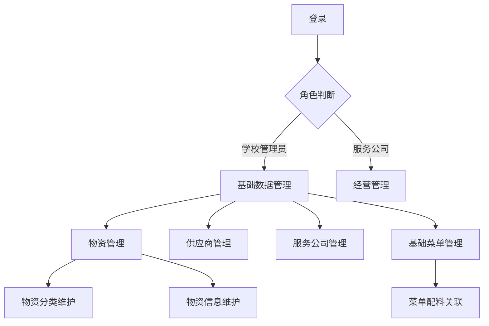
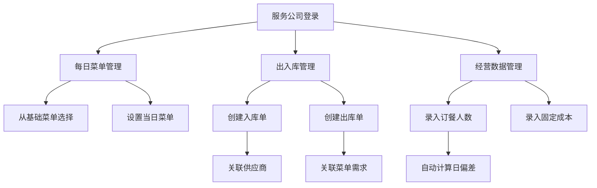
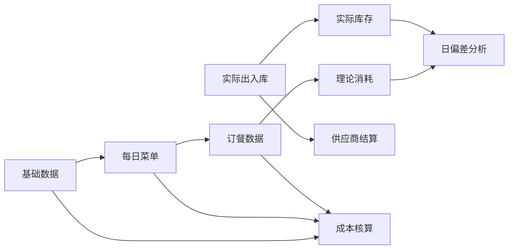

【任务目标】
根据需求，进一步完善指定表的设计，返回结果遵循指定的XML格式。如有必要，可以增加新的表。如果已经很完善，则返回[NO_CHANGE]。

【要求】
 1. 不需要考虑User, Role，权限管理，页面资源等公共表。
 2. 返回全部的表定义，不仅仅是返回新增的表。


【表定义】

```xml
<orm>

    <entities>
        <entity name="MaterialCategory" displayName="物资分类">
            <comment>物资分类信息，支持多级分类</comment>
            <columns>
                <column name="id" displayName="ID" mandatory="true" primary="true" sqlType="BIGINT"/>
                <column name="parent_id" displayName="父分类ID" mandatory="false" sqlType="BIGINT"
                        orm:ref-table="MaterialCategory"/>
                <column name="category_code" displayName="分类编码" mandatory="true" sqlType="VARCHAR" precision="50"/>
                <column name="category_name" displayName="分类名称" mandatory="true" sqlType="VARCHAR" precision="100"/>
                <column name="level" displayName="分类层级" mandatory="true" sqlType="INT"/>
                <column name="sort_order" displayName="排序序号" mandatory="true" sqlType="INT"/>
                <column name="status" displayName="状态" mandatory="true" sqlType="BOOLEAN"/>
            </columns>
        </entity>
        <entity name="Material" displayName="物资">
            <comment>食堂物资基本信息</comment>
            <columns>
                <column name="id" displayName="ID" mandatory="true" primary="true" sqlType="BIGINT"/>
                <column name="category_id" displayName="分类ID" mandatory="true" sqlType="BIGINT"
                        orm:ref-table="MaterialCategory"/>
                <column name="material_code" displayName="物资编码" mandatory="true" sqlType="VARCHAR" precision="50"/>
                <column name="material_name" displayName="物资名称" mandatory="true" sqlType="VARCHAR" precision="100"/>
                <column name="specification" displayName="规格" mandatory="false" sqlType="VARCHAR" precision="100"/>
                <column name="unit" displayName="单位" mandatory="true" sqlType="VARCHAR" precision="20"/>
                <column name="image_url" displayName="图片" mandatory="false" sqlType="VARCHAR" precision="255"
                        stdDomain="image"/>
                <column name="min_stock" displayName="最低库存" mandatory="true" sqlType="DECIMAL" precision="12" scale="2"/>
                <column name="max_stock" displayName="最高库存" mandatory="true" sqlType="DECIMAL" precision="12" scale="2"/>
                <column name="status" displayName="状态" mandatory="true" sqlType="BOOLEAN"/>
            </columns>
        </entity>
        <entity name="Supplier" displayName="供应商">
            <comment>物资供应商信息</comment>
            <columns>
                <column name="id" displayName="ID" mandatory="true" primary="true" sqlType="BIGINT"/>
                <column name="supplier_code" displayName="供应商编码" mandatory="true" sqlType="VARCHAR" precision="50"/>
                <column name="supplier_name" displayName="供应商名称" mandatory="true" sqlType="VARCHAR" precision="100"/>
                <column name="contact_person" displayName="联系人" mandatory="false" sqlType="VARCHAR" precision="50"/>
                <column name="contact_phone" displayName="联系电话" mandatory="false" sqlType="VARCHAR" precision="20"/>
                <column name="address" displayName="地址" mandatory="false" sqlType="VARCHAR" precision="200"/>
                <column name="qualification_files" displayName="资质文件" mandatory="false" sqlType="VARCHAR"
                        precision="500" stdDomain="fileList"/>
                <column name="status" displayName="状态" mandatory="true" sqlType="BOOLEAN"/>
            </columns>
        </entity>
        <entity name="ServiceCompany" displayName="服务公司">
            <comment>食堂经营服务公司信息</comment>
            <columns>
                <column name="id" displayName="ID" mandatory="true" primary="true" sqlType="BIGINT"/>
                <column name="company_code" displayName="公司编码" mandatory="true" sqlType="VARCHAR" precision="50"/>
                <column name="company_name" displayName="公司名称" mandatory="true" sqlType="VARCHAR" precision="100"/>
                <column name="contact_person" displayName="联系人" mandatory="false" sqlType="VARCHAR" precision="50"/>
                <column name="contact_phone" displayName="联系电话" mandatory="false" sqlType="VARCHAR" precision="20"/>
                <column name="address" displayName="地址" mandatory="false" sqlType="VARCHAR" precision="200"/>
                <column name="status" displayName="状态" mandatory="true" sqlType="BOOLEAN"/>
            </columns>
        </entity>
        <entity name="Warehouse" displayName="库房">
            <comment>食堂物资库房信息</comment>
            <columns>
                <column name="id" displayName="ID" mandatory="true" primary="true" sqlType="BIGINT"/>
                <column name="service_company_id" displayName="服务公司ID" mandatory="true" sqlType="BIGINT"
                        orm:ref-table="ServiceCompany"/>
                <column name="warehouse_code" displayName="库房编码" mandatory="true" sqlType="VARCHAR" precision="50"/>
                <column name="warehouse_name" displayName="库房名称" mandatory="true" sqlType="VARCHAR" precision="100"/>
                <column name="location" displayName="位置" mandatory="false" sqlType="VARCHAR" precision="200"/>
                <column name="manager" displayName="管理员" mandatory="false" sqlType="VARCHAR" precision="50"/>
                <column name="status" displayName="状态" mandatory="true" sqlType="BOOLEAN"/>
            </columns>
        </entity>
        <entity name="BaseMenu" displayName="基础菜单">
            <comment>基础菜单信息</comment>
            <columns>
                <column name="id" displayName="ID" mandatory="true" primary="true" sqlType="BIGINT"/>
                <column name="menu_code" displayName="菜单编码" mandatory="true" sqlType="VARCHAR" precision="50"/>
                <column name="menu_name" displayName="菜单名称" mandatory="true" sqlType="VARCHAR" precision="100"/>
                <column name="image_url" displayName="图片" mandatory="false" sqlType="VARCHAR" precision="255"
                        stdDomain="image"/>
                <column name="description" displayName="描述" mandatory="false" sqlType="VARCHAR" precision="500"/>
                <column name="status" displayName="状态" mandatory="true" sqlType="BOOLEAN"/>
            </columns>
        </entity>
        <entity name="MenuMaterial" displayName="菜单配料">
            <comment>基础菜单的配料信息</comment>
            <columns>
                <column name="id" displayName="ID" mandatory="true" primary="true" sqlType="BIGINT"/>
                <column name="menu_id" displayName="菜单ID" mandatory="true" sqlType="BIGINT" orm:ref-table="BaseMenu"
                        orm:ref-prop="materials" orm:ref-prop-display-name="配料列表"/>
                <column name="material_id" displayName="物资ID" mandatory="true" sqlType="BIGINT" orm:ref-table="Material"/>
                <column name="quantity" displayName="数量" mandatory="true" sqlType="DECIMAL" precision="12" scale="2"/>
                <column name="unit" displayName="单位" mandatory="true" sqlType="VARCHAR" precision="20"/>
            </columns>
        </entity>
        <entity name="DailyMenu" displayName="每日菜单">
            <comment>每日提供的菜单</comment>
            <columns>
                <column name="id" displayName="ID" mandatory="true" primary="true" sqlType="BIGINT"/>
                <column name="service_company_id" displayName="服务公司ID" mandatory="true" sqlType="BIGINT"
                        orm:ref-table="ServiceCompany"/>
                <column name="menu_date" displayName="菜单日期" mandatory="true" sqlType="DATE"/>
                <column name="base_menu_id" displayName="基础菜单ID" mandatory="true" sqlType="BIGINT"
                        orm:ref-table="BaseMenu"/>
                <column name="is_locked" displayName="是否锁定" mandatory="true" sqlType="BOOLEAN"/>
            </columns>
        </entity>
        <entity name="Inventory" displayName="库存">
            <comment>物资库存信息</comment>
            <columns>
                <column name="id" displayName="ID" mandatory="true" primary="true" sqlType="BIGINT"/>
                <column name="warehouse_id" displayName="库房ID" mandatory="true" sqlType="BIGINT"
                        orm:ref-table="Warehouse"/>
                <column name="material_id" displayName="物资ID" mandatory="true" sqlType="BIGINT" orm:ref-table="Material"/>
                <column name="quantity" displayName="数量" mandatory="true" sqlType="DECIMAL" precision="12" scale="2"/>
                <column name="last_update_time" displayName="最后更新时间" mandatory="true" sqlType="TIMESTAMP"/>
            </columns>
        </entity>
        <entity name="StockIn" displayName="入库单">
            <comment>物资入库单据</comment>
            <columns>
                <column name="id" displayName="ID" mandatory="true" primary="true" sqlType="BIGINT"/>
                <column name="warehouse_id" displayName="库房ID" mandatory="true" sqlType="BIGINT"
                        orm:ref-table="Warehouse"/>
                <column name="supplier_id" displayName="供应商ID" mandatory="false" sqlType="BIGINT"
                        orm:ref-table="Supplier"/>
                <column name="in_order_no" displayName="入库单号" mandatory="true" sqlType="VARCHAR" precision="50"/>
                <column name="in_date" displayName="入库日期" mandatory="true" sqlType="DATE"/>
                <column name="total_amount" displayName="总金额" mandatory="true" sqlType="DECIMAL" precision="12"
                        scale="2"/>
                <column name="operator" displayName="操作人" mandatory="true" sqlType="VARCHAR" precision="50"/>
                <column name="status" displayName="状态" mandatory="true" sqlType="VARCHAR" precision="20"/>
                <column name="is_locked" displayName="是否锁定" mandatory="true" sqlType="BOOLEAN"/>
                <column name="remark" displayName="备注" mandatory="false" sqlType="VARCHAR" precision="500"/>
            </columns>
        </entity>
        <entity name="StockInDetail" displayName="入库单明细">
            <comment>入库单明细项</comment>
            <columns>
                <column name="id" displayName="ID" mandatory="true" primary="true" sqlType="BIGINT"/>
                <column name="stock_in_id" displayName="入库单ID" mandatory="true" sqlType="BIGINT" orm:ref-table="StockIn"
                        orm:ref-prop="details" orm:ref-prop-display-name="入库明细"/>
                <column name="material_id" displayName="物资ID" mandatory="true" sqlType="BIGINT" orm:ref-table="Material"/>
                <column name="quantity" displayName="数量" mandatory="true" sqlType="DECIMAL" precision="12" scale="2"/>
                <column name="unit_price" displayName="单价" mandatory="true" sqlType="DECIMAL" precision="12" scale="2"/>
                <column name="amount" displayName="金额" mandatory="true" sqlType="DECIMAL" precision="12" scale="2"/>
                <column name="batch_no" displayName="批次号" mandatory="false" sqlType="VARCHAR" precision="50"/>
                <column name="expiry_date" displayName="有效期" mandatory="false" sqlType="DATE"/>
            </columns>
        </entity>
        <entity name="StockOut" displayName="出库单">
            <comment>物资出库单据</comment>
            <columns>
                <column name="id" displayName="ID" mandatory="true" primary="true" sqlType="BIGINT"/>
                <column name="warehouse_id" displayName="库房ID" mandatory="true" sqlType="BIGINT"
                        orm:ref-table="Warehouse"/>
                <column name="out_order_no" displayName="出库单号" mandatory="true" sqlType="VARCHAR" precision="50"/>
                <column name="out_date" displayName="出库日期" mandatory="true" sqlType="DATE"/>
                <column name="daily_menu_id" displayName="关联菜单ID" mandatory="false" sqlType="BIGINT"
                        orm:ref-table="DailyMenu"/>
                <column name="operator" displayName="操作人" mandatory="true" sqlType="VARCHAR" precision="50"/>
                <column name="status" displayName="状态" mandatory="true" sqlType="VARCHAR" precision="20"/>
                <column name="is_locked" displayName="是否锁定" mandatory="true" sqlType="BOOLEAN"/>
                <column name="remark" displayName="备注" mandatory="false" sqlType="VARCHAR" precision="500"/>
            </columns>
        </entity>
        <entity name="StockOutDetail" displayName="出库单明细">
            <comment>出库单明细项</comment>
            <columns>
                <column name="id" displayName="ID" mandatory="true" primary="true" sqlType="BIGINT"/>
                <column name="stock_out_id" displayName="出库单ID" mandatory="true" sqlType="BIGINT"
                        orm:ref-table="StockOut" orm:ref-prop="details" orm:ref-prop-display-name="出库明细"/>
                <column name="material_id" displayName="物资ID" mandatory="true" sqlType="BIGINT" orm:ref-table="Material"/>
                <column name="quantity" displayName="数量" mandatory="true" sqlType="DECIMAL" precision="12" scale="2"/>
                <column name="unit_price" displayName="单价" mandatory="true" sqlType="DECIMAL" precision="12" scale="2"/>
                <column name="amount" displayName="金额" mandatory="true" sqlType="DECIMAL" precision="12" scale="2"/>
            </columns>
        </entity>
        <entity name="InventoryCheck" displayName="盘点单">
            <comment>库存盘点单据</comment>
            <columns>
                <column name="id" displayName="ID" mandatory="true" primary="true" sqlType="BIGINT"/>
                <column name="warehouse_id" displayName="库房ID" mandatory="true" sqlType="BIGINT"
                        orm:ref-table="Warehouse"/>
                <column name="check_no" displayName="盘点单号" mandatory="true" sqlType="VARCHAR" precision="50"/>
                <column name="check_date" displayName="盘点日期" mandatory="true" sqlType="DATE"/>
                <column name="operator" displayName="操作人" mandatory="true" sqlType="VARCHAR" precision="50"/>
                <column name="status" displayName="状态" mandatory="true" sqlType="VARCHAR" precision="20"/>
                <column name="remark" displayName="备注" mandatory="false" sqlType="VARCHAR" precision="500"/>
            </columns>
        </entity>
        <entity name="InventoryCheckDetail" displayName="盘点单明细">
            <comment>盘点单明细项</comment>
            <columns>
                <column name="id" displayName="ID" mandatory="true" primary="true" sqlType="BIGINT"/>
                <column name="check_id" displayName="盘点单ID" mandatory="true" sqlType="BIGINT"
                        orm:ref-table="InventoryCheck" orm:ref-prop="details" orm:ref-prop-display-name="盘点明细"/>
                <column name="material_id" displayName="物资ID" mandatory="true" sqlType="BIGINT" orm:ref-table="Material"/>
                <column name="book_quantity" displayName="账面数量" mandatory="true" sqlType="DECIMAL" precision="12"
                        scale="2"/>
                <column name="actual_quantity" displayName="实际数量" mandatory="true" sqlType="DECIMAL" precision="12"
                        scale="2"/>
                <column name="difference" displayName="差异数量" mandatory="true" sqlType="DECIMAL" precision="12" scale="2"/>
                <column name="unit_price" displayName="单价" mandatory="true" sqlType="DECIMAL" precision="12" scale="2"/>
                <column name="difference_amount" displayName="差异金额" mandatory="true" sqlType="DECIMAL" precision="12"
                        scale="2"/>
            </columns>
        </entity>
        <entity name="SupplierSettlement" displayName="供应商结算单">
            <comment>供应商结算信息</comment>
            <columns>
                <column name="id" displayName="ID" mandatory="true" primary="true" sqlType="BIGINT"/>
                <column name="service_company_id" displayName="服务公司ID" mandatory="true" sqlType="BIGINT"
                        orm:ref-table="ServiceCompany"/>
                <column name="supplier_id" displayName="供应商ID" mandatory="true" sqlType="BIGINT"
                        orm:ref-table="Supplier"/>
                <column name="settlement_no" displayName="结算单号" mandatory="true" sqlType="VARCHAR" precision="50"/>
                <column name="start_date" displayName="开始日期" mandatory="true" sqlType="DATE"/>
                <column name="end_date" displayName="结束日期" mandatory="true" sqlType="DATE"/>
                <column name="total_amount" displayName="总金额" mandatory="true" sqlType="DECIMAL" precision="12"
                        scale="2"/>
                <column name="paid_amount" displayName="已付金额" mandatory="true" sqlType="DECIMAL" precision="12"
                        scale="2"/>
                <column name="status" displayName="状态" mandatory="true" sqlType="VARCHAR" precision="20"/>
                <column name="settlement_time" displayName="结算时间" mandatory="false" sqlType="TIMESTAMP"/>
                <column name="operator" displayName="操作人" mandatory="true" sqlType="VARCHAR" precision="50"/>
            </columns>
        </entity>
        <entity name="PaymentRecord" displayName="付款记录">
            <comment>供应商付款记录</comment>
            <columns>
                <column name="id" displayName="ID" mandatory="true" primary="true" sqlType="BIGINT"/>
                <column name="settlement_id" displayName="结算单ID" mandatory="true" sqlType="BIGINT"
                        orm:ref-table="SupplierSettlement" orm:ref-prop="payments" orm:ref-prop-display-name="付款记录"/>
                <column name="payment_no" displayName="付款单号" mandatory="true" sqlType="VARCHAR" precision="50"/>
                <column name="payment_amount" displayName="付款金额" mandatory="true" sqlType="DECIMAL" precision="12"
                        scale="2"/>
                <column name="payment_time" displayName="付款时间" mandatory="true" sqlType="TIMESTAMP"/>
                <column name="payment_method" displayName="付款方式" mandatory="true" sqlType="VARCHAR" precision="50"/>
                <column name="operator" displayName="操作人" mandatory="true" sqlType="VARCHAR" precision="50"/>
                <column name="remark" displayName="备注" mandatory="false" sqlType="VARCHAR" precision="500"/>
            </columns>
        </entity>
        <entity name="OperationData" displayName="经营数据">
            <comment>食堂日常经营数据</comment>
            <columns>
                <column name="id" displayName="ID" mandatory="true" primary="true" sqlType="BIGINT"/>
                <column name="service_company_id" displayName="服务公司ID" mandatory="true" sqlType="BIGINT"
                        orm:ref-table="ServiceCompany"/>
                <column name="data_date" displayName="数据日期" mandatory="true" sqlType="DATE"/>
                <column name="diner_count" displayName="就餐人数" mandatory="true" sqlType="INT"/>
                <column name="fixed_cost" displayName="固定成本" mandatory="true" sqlType="DECIMAL" precision="12" scale="2"/>
                <column name="material_cost" displayName="食材成本" mandatory="true" sqlType="DECIMAL" precision="12"
                        scale="2"/>
                <column name="deviation_rate" displayName="偏差率" mandatory="true" sqlType="DECIMAL" precision="5"
                        scale="2"/>
                <column name="is_locked" displayName="是否锁定" mandatory="true" sqlType="BOOLEAN"/>
                <column name="operator" displayName="操作人" mandatory="true" sqlType="VARCHAR" precision="50"/>
            </columns>
        </entity>
    </entities>
</orm>

```

【需求描述】
 # 食堂物资管理系统详细设计

## 角色与权限设计

### 1. 角色定义

| 角色名称    | 描述                     | 系统权限             |
|---------|------------------------|------------------|
| 学校管理员   | 负责系统基础数据维护、日常监管和统计分析   | 基础数据管理、数据查询、统计分析 |
| 服务公司管理员 | 食堂经营单位的管理人员，负责日常经营数据录入 | 经营管理、数据录入、供应商结算  |

### 2. 权限矩阵

| 功能模块   | 子功能  | 学校管理员 | 服务公司管理员   |
|--------|------|-------|-----------|
| 物资管理   | 增删改查 | 读写    | 只读        |
| 供应商管理  | 增删改查 | 读写    | 只读        |
| 服务公司管理 | 增删改查 | 读写    | 只读(仅自身)   |
| 基础菜单管理 | 增删改查 | 读写    | 只读        |
| 库房管理   | 增删改查 | 只读    | 读写(仅自身)   |
| 每日菜单管理 | 增删改查 | 只读    | 读写(仅自身)   |
| 出入库管理  | 增删改查 | 只读    | 读写(仅自身)   |
| 盘库管理   | 操作   | 只读    | 读写(仅自身)   |
| 供应商结算  | 操作   | 只读    | 读写        |
| 经营数据管理 | 增删改查 | 只读    | 读写(仅自身)   |
| 统计分析   | 各类报表 | 读写    | 只读(仅自身数据) |

## 菜单设计

### 1. 学校管理员菜单

- 基础数据管理
  - 物资管理
  - 供应商管理
  - 服务公司管理
  - 基础菜单管理
- 监管中心
  - 出入库查询
  - 经营数据查询
  - 库存监控
- 统计分析
  - 物资统计报表
  - 成本分析报表
  - 经营绩效分析
- 系统设置
  - 用户管理
  - 角色权限
  - 系统参数

### 2. 服务公司管理员菜单

- 经营管理
  - 库房管理
  - 每日菜单
  - 出入库管理
  - 盘库管理
- 供应商结算
  - 结算单管理
  - 付款记录
- 经营数据
  - 订餐人数录入
  - 固定成本录入
  - 日偏差查看
- 数据查询
  - 库存查询
  - 历史菜单
  - 出入库记录

## 功能模块详细设计

### 1. 基础数据管理模块

#### 功能点列表（优先级）

1. 物资管理（P0）

- 物资分类管理（多级）
- 物资CRUD操作
- 物资图片上传
- 物资库存查询

2. 供应商管理（P0）

- 供应商CRUD
- 供应商启用/禁用
- 供应商资质管理

3. 服务公司管理（P0）

- 服务公司CRUD
- 服务公司启用/禁用

4. 基础菜单管理（P1）

- 基础菜单CRUD
- 菜单配料管理
- 菜单成本计算

#### 交互流程图



#### 核心业务逻辑

- 物资分类采用树形结构，支持无限级分类
- 物资编码采用"分类码+序列号"自动生成规则
- 供应商和服务公司启用/禁用状态影响相关业务操作
- 基础菜单的配料关联物资，自动计算菜品成本

### 2. 经营管理模块

#### 功能点列表（优先级）

1. 库房管理（P1）

- 库房CRUD

2. 每日菜单管理（P0）

- 从基础菜单选择
- 按日期管理
- 结算日锁定

3. 出入库管理（P0）

- 入库单管理
- 出库单管理
- 整入整出
- 单据锁定

4. 盘库管理（P1）

- 库存盘点
- 盘盈盘亏处理

5. 供应商结算（P1）

- 结算单生成
- 付款记录

6. 经营数据管理（P0）

- 订餐人数录入
- 固定成本录入
- 日偏差计算

#### 交互流程图



#### 核心业务逻辑

- 每日菜单必须从基础菜单中选择，不可自定义
- 出入库单据包含明细项，影响实时库存
- 出库可与菜单关联，自动计算理论消耗量
- 日偏差 = 理论消耗量(根据订餐人数计算) - 实际出库量
- 结算日后的数据自动锁定，不可修改

### 3. 统计分析模块

#### 功能点列表（优先级）

1. 物资统计（P1）

- 出入库汇总
- 库存预警

2. 成本分析（P0）

- 菜品成本分析
- 经营成本分析

3. 经营绩效（P1）

- 服务公司绩效
- 供应商评价

#### 核心业务逻辑

- 基于时间维度、物资维度、服务公司维度的交叉分析
- 成本分析结合实际消耗和标准配方的理论消耗
- 绩效评估考虑成本控制、库存周转率等指标

## 数据流设计



## 关键业务规则

1. 数据锁定规则：

- 结算日后自动锁定相关数据
- 手动锁定的单据需上级解锁

2. 库存变更规则：

- 入库增加库存
- 出库减少库存
- 盘盈盘亏调整库存

3. 权限控制规则：

- 服务公司只能操作自身数据
- 敏感操作需记录操作日志

4. 成本计算规则：

- 菜品成本 = ∑(配料数量×最新入库单价)
- 经营成本 = 固定成本 + 食材成本

5. 偏差分析规则：

- 日偏差率 = (实际消耗 - 理论消耗)/理论消耗
- 连续异常偏差触发预警
