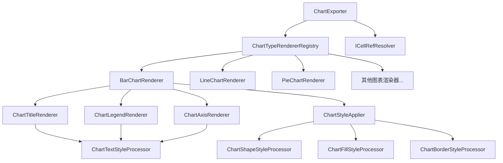

# Design Document

## Overview

nop-chart-export模块设计为一个高度模块化的图表导出系统，负责将ChartModel对象转换为PNG格式图片。系统采用分层架构，将图表渲染、样式应用、数据解析等功能分离到不同的组件中，便于扩展和维护。

核心设计理念：
- **模块化设计**：每种图表类型有独立的渲染器
- **组件化架构**：标题、图例、坐标轴等组件独立处理
- **样式保真**：最大程度保留ChartModel中的样式细节
- **数据抽象**：通过ICellRefResolver接口抽象数据获取逻辑

## Architecture

系统采用三层架构设计：

```
┌─────────────────────────────────────────────────────────────┐
│                    API Layer (接口层)                        │
│  ┌─────────────────┐  ┌─────────────────┐                   │
│  │  ChartExporter  │  │ICellRefResolver │                   │
│  └─────────────────┘  └─────────────────┘                   │
└─────────────────────────────────────────────────────────────┘
┌─────────────────────────────────────────────────────────────┐
│                  Service Layer (服务层)                      │
│  ┌─────────────────┐  ┌─────────────────┐                   │
│  │ChartTypeRenderer│  │ChartStyleApplier│                   │
│  │    Registry     │  │                 │                   │
│  └─────────────────┘  └─────────────────┘                   │
└─────────────────────────────────────────────────────────────┘
┌─────────────────────────────────────────────────────────────┐
│                Component Layer (组件层)                      │
│ ┌──────────────┐ ┌──────────────┐ ┌──────────────┐          │
│ │Chart Type    │ │Chart Component│ │Style         │          │
│ │Renderers     │ │Renderers     │ │Processors    │          │
│ └──────────────┘ └──────────────┘ └──────────────┘          │
└─────────────────────────────────────────────────────────────┘
```

### 核心组件关系



## Components and Interfaces

### 核心接口定义

#### ICellRefResolver
```java
public interface ICellRefResolver {
    /**
     * 根据单元格引用获取单个值
     */
    Object getValue(String cellRef);
    
    /**
     * 根据单元格区域引用获取值列表
     */
    List<Object> getValues(String cellRangeRef);
    
    /**
     * 检查单元格引用是否有效
     */
    boolean isValidRef(String cellRef);
}
```

#### IChartTypeRenderer
```java
public interface IChartTypeRenderer {
    /**
     * 支持的图表类型
     */
    ChartType getSupportedType();
    
    /**
     * 渲染图表
     */
    JFreeChart render(ChartModel chartModel, ICellRefResolver resolver);
    
    /**
     * 是否支持该图表类型
     */
    boolean supports(ChartType type);
}
```

### 主要组件

#### ChartExporter (主导出器)
```java
public class ChartExporter {
    private ChartTypeRendererRegistry rendererRegistry;
    
    public byte[] exportToPng(ChartModel chartModel, ICellRefResolver resolver);
    public byte[] exportToPng(ChartModel chartModel, ICellRefResolver resolver, ChartExportOptions options);
    public void exportToPngFile(ChartModel chartModel, ICellRefResolver resolver, File outputFile);
    public void exportToPngFile(ChartModel chartModel, ICellRefResolver resolver, File outputFile, ChartExportOptions options);
}
```

#### ChartExportOptions (导出选项)
```java
public class ChartExportOptions {
    private int width = 800;           // 默认宽度
    private int height = 600;          // 默认高度
    private int dpi = 96;              // 默认DPI
    private float quality = 0.9f;      // 图片质量 (0.0-1.0)
    private boolean antiAlias = true;  // 抗锯齿
    private Color backgroundColor;     // 背景色
    private long timeoutMs = 30000;    // 超时时间(毫秒)
    private int maxDataSize = 10000;   // 最大数据量
    private IProgressCallback progressCallback; // 进度回调
    
    // 构造方法和getter/setter
    public static ChartExportOptions defaultOptions() {
        return new ChartExportOptions();
    }
}
```

#### ChartTypeRendererRegistry (渲染器注册表)
```java
public class ChartTypeRendererRegistry {
    private Map<ChartType, IChartTypeRenderer> renderers;
    
    public void register(IChartTypeRenderer renderer);
    public IChartTypeRenderer getRenderer(ChartType type);
    public boolean isSupported(ChartType type);
}
```

### 图表类型渲染器

每种图表类型都有独立的渲染器实现：

#### BarChartRenderer
- 处理柱状图的特殊配置(gapWidth, overlap, grouping)
- 支持垂直和水平柱状图
- 处理堆积和分组模式
- 支持3D效果和颜色变化

#### LineChartRenderer  
- 处理折线图的特殊配置(smooth, marker, dropLines)
- 支持多系列折线图
- 处理线条样式和标记点
- 支持高低线(hiLowLines)和涨跌柱(upDownBars)

#### PieChartRenderer
- 处理饼图的特殊配置(startAngle, innerRadius)
- 支持扇形分离效果(explosion)
- 处理标签位置和格式
- 支持3D效果

#### DoughnutChartRenderer
- 继承自PieChartRenderer
- 处理环形图特殊配置(holeSize, innerRadius)
- 支持多层环形图

#### ScatterChartRenderer
- 处理散点图特殊配置(markerSize, markerSymbol, scatterStyle)
- 支持不同的散点样式(none, line, lineMarker, marker, smooth, smoothMarker)
- 处理标记点的形状和大小

#### BubbleChartRenderer
- 继承自ScatterChartRenderer
- 处理气泡图特殊配置(bubble3D, bubbleScale, sizeRepresents)
- 支持气泡大小表示方式(area/width)

#### AreaChartRenderer
- 处理面积图特殊配置(grouping, dropLines)
- 支持堆积面积图
- 处理填充样式和透明度

#### RadarChartRenderer
- 处理雷达图特殊配置(radius, startAngle, radarStyle)
- 支持不同的雷达图样式
- 处理多边形网格

#### HeatmapChartRenderer
- 处理热力图特殊配置(cellSize, colorRange, missingDataColor)
- 支持颜色映射和渐变
- 处理缺失数据的显示

#### ComboChartRenderer
- 组合多种图表类型
- 处理不同系列的不同渲染方式
- 支持双坐标轴显示

### 高级功能渲染器

#### TrendLineRenderer
```java
public class TrendLineRenderer {
    public void applyTrendLines(XYPlot plot, List<ChartTrendLineModel> trendLines);
    private void addLinearTrendLine(XYPlot plot, ChartTrendLineModel trendLine);
    private void addMovingAverageLine(XYPlot plot, ChartTrendLineModel trendLine);
}
```

#### DataPointRenderer
```java
public class DataPointRenderer {
    public void applyDataPointStyles(XYDataset dataset, List<ChartDataPointModel> dataPoints);
    public void applyExplosion(PiePlot plot, List<ChartDataPointModel> dataPoints);
}
```

#### FilterRenderer
```java
public class FilterRenderer {
    public Dataset applyFilters(Dataset dataset, ChartFiltersModel filters);
    private Dataset applyValueFilter(Dataset dataset, ChartValueFilterModel filter);
    private Dataset applyCategoryFilter(Dataset dataset, ChartCategoryFilterModel filter);
    private Dataset applyTopNFilter(Dataset dataset, ChartTopNFilterModel filter);
}
```

### 组件渲染器

#### ChartTitleRenderer
```java
public class ChartTitleRenderer {
    public void applyTitle(JFreeChart chart, ChartTitleModel titleModel, ICellRefResolver resolver);
    private String resolveTitle(ChartTitleModel titleModel, ICellRefResolver resolver);
    private void applyTitleStyle(TextTitle title, ChartTitleModel titleModel);
}
```

#### ChartLegendRenderer
```java
public class ChartLegendRenderer {
    public void applyLegend(JFreeChart chart, ChartLegendModel legendModel);
    private void applyLegendPosition(LegendTitle legend, ChartLegendModel legendModel);
    private void applyLegendStyle(LegendTitle legend, ChartLegendModel legendModel);
}
```

#### ChartAxisRenderer
```java
public class ChartAxisRenderer {
    public void applyAxes(CategoryPlot plot, List<ChartAxisModel> axes, ICellRefResolver resolver);
    public void applyAxes(XYPlot plot, List<ChartAxisModel> axes, ICellRefResolver resolver);
    private void applyAxisStyle(Axis axis, ChartAxisModel axisModel);
    private void applyAxisScale(ValueAxis axis, ChartAxisScaleModel scaleModel);
    private void applyAxisTicks(Axis axis, ChartTicksModel ticksModel);
    private void applyGridLines(CategoryPlot plot, ChartAxisModel axisModel);
    private void applyMultiLevelAxis(CategoryAxis axis, ChartAxisModel axisModel);
}
```

#### ChartGridRenderer
```java
public class ChartGridRenderer {
    public void applyMajorGrid(Plot plot, ChartGridModel gridModel);
    public void applyMinorGrid(Plot plot, ChartGridModel gridModel);
    private Stroke createGridStroke(ChartGridModel gridModel);
}
```

### 样式处理器

#### ChartStyleApplier
```java
public class ChartStyleApplier {
    private ChartShapeStyleProcessor shapeStyleProcessor;
    private ChartTextStyleProcessor textStyleProcessor;
    private ChartFillStyleProcessor fillStyleProcessor;
    private ChartBorderStyleProcessor borderStyleProcessor;
    
    public void applyChartStyle(JFreeChart chart, ChartModel chartModel);
    public void applyPlotStyle(Plot plot, ChartPlotAreaModel plotAreaModel);
}
```

#### ChartShapeStyleProcessor
```java
public class ChartShapeStyleProcessor {
    public void applyShapeStyle(Object target, ChartShapeStyleModel styleModel);
    private Paint createFillPaint(ChartFillModel fillModel);
    private Stroke createBorderStroke(ChartBorderModel borderModel);
}
```

## Data Models

### 数据解析模型

#### ChartDataSet
```java
public class ChartDataSet {
    private String name;
    private List<Object> categories;
    private List<Number> values;
    private List<Number> xValues;  // 用于散点图和气泡图
    private List<Number> bubbleSizes;  // 用于气泡图
    private ChartSeriesModel seriesModel;
    
    // 构造和访问方法
}
```

#### ChartDataResolver
```java
public class ChartDataResolver {
    private ICellRefResolver cellRefResolver;
    
    public List<ChartDataSet> resolveSeriesData(ChartPlotAreaModel plotArea, ICellRefResolver resolver);
    public List<Object> resolveCategories(String catCellRef, ICellRefResolver resolver);
    public List<Number> resolveValues(String dataCellRef, ICellRefResolver resolver);
    public Dataset applyFilters(Dataset dataset, ChartFiltersModel filters);
    public void validateDataIntegrity(ChartDataSet dataSet);
}
```

#### ChartDataValidator
```java
public class ChartDataValidator {
    public void validateChartModel(ChartModel chartModel);
    public void validateSeriesData(ChartSeriesModel series, ChartDataSet dataSet);
    public void validateAxisData(ChartAxisModel axis, List<Object> data);
    public void checkDataVolumeLimit(ChartDataSet dataSet, int maxSize);
}
```

### 样式转换模型

#### JFreeChartStyleAdapter
```java
public class JFreeChartStyleAdapter {
    public static Paint toPaint(String colorStr, double opacity);
    public static Font toFont(io.nop.excel.model.font.FontModel fontModel);
    public static Stroke toStroke(ChartLineStyleModel lineStyle);
    public static RectangleInsets toInsets(ChartSpacingModel spacing);
}
```

## Correctness Properties

*A property is a characteristic or behavior that should hold true across all valid executions of a system-essentially, a formal statement about what the system should do. Properties serve as the bridge between human-readable specifications and machine-verifiable correctness guarantees.*

### Property-Based Testing Overview

Property-based testing (PBT) validates software correctness by testing universal properties across many generated inputs. Each property is a formal specification that should hold for all valid inputs.

### Core Principles

1. **Universal Quantification**: Every property must contain an explicit "for all" statement
2. **Requirements Traceability**: Each property must reference the requirements it validates  
3. **Executable Specifications**: Properties must be implementable as automated tests
4. **Comprehensive Coverage**: Properties should cover all testable acceptance criteria

### Common Property Patterns

1. **Invariants**: Properties that remain constant despite changes to structure or order
2. **Round Trip Properties**: Combining an operation with its inverse to return to original value
3. **Idempotence**: Operations where doing it twice equals doing it once
4. **Metamorphic Properties**: Relationships that must hold between components
5. **Error Conditions**: Generate bad inputs and ensure they properly signal errors

现在让我使用prework工具来分析acceptance criteria：

### Converting EARS to Properties

基于prework分析，以下是从EARS接受标准转换而来的可测试属性：

**Property 1: Chart Export Core Functionality**
*For any* valid ChartModel object and ICellRefResolver, the ChartExporter should generate valid PNG image data
**Validates: Requirements 1.1, 1.2**

**Property 2: Custom Export Options**
*For any* valid ChartModel and ChartExportOptions (including null for defaults), the exported PNG should respect the specified options or use default values
**Validates: Requirements 1.4, 1.5**

**Property 3: Error Handling with Context**
*For any* invalid input parameters, the system should throw NopException with ChartExportErrors error codes and sufficient context information
**Validates: Requirements 1.3, 7.1, 7.2, 7.3, 7.7**

**Property 4: Chart Type Support**
*For any* supported ChartType (BAR, LINE, PIE, DOUGHNUT, SCATTER, AREA, BUBBLE, RADAR, HEATMAP, COMBO), the system should successfully render the chart
**Validates: Requirements 2.1-2.10**

**Property 5: Data Resolution Integration**
*For any* ChartModel containing cellRef properties (dataCellRef, catCellRef, nameCellRef), the system should correctly call the corresponding ICellRefResolver methods
**Validates: Requirements 3.2, 3.3, 3.4**

**Property 6: Cell Reference Format Support**
*For any* valid single cell reference or cell range reference format, the system should correctly parse and process the reference
**Validates: Requirements 3.6**

**Property 7: Shape Style Application**
*For any* ChartModel containing shapeStyle configuration, the system should apply the shape styling to the corresponding chart elements
**Validates: Requirements 4.1**

**Property 8: Text Style Application**
*For any* ChartModel containing textStyle configuration, the system should apply text styling including color conversion to chart text elements
**Validates: Requirements 4.2, 4.6**

**Property 9: Fill and Border Style Application**
*For any* ChartModel containing fill or border configuration, the system should apply the corresponding visual styles to chart areas and elements
**Validates: Requirements 4.3, 4.4**

**Property 10: Font Style Application**
*For any* ChartModel containing font configuration, the system should apply font styling to text elements
**Validates: Requirements 4.5**

**Property 11: Opacity Support**
*For any* ChartModel with opacity settings, the system should correctly apply transparency effects
**Validates: Requirements 4.7**

**Property 12: Chart Component Rendering**
*For any* ChartModel containing title, legend, axes, or dataLabels configuration, the system should render the corresponding components
**Validates: Requirements 5.1, 5.2, 5.3, 5.4**

**Property 13: Plot Area Configuration**
*For any* ChartModel containing plotArea configuration, the system should apply the plot area settings and support component positioning
**Validates: Requirements 5.5, 5.6**

**Property 14: Renderer Registry Functionality**
*For any* chart type renderer registration and lookup operation, the registry should correctly store and retrieve renderers
**Validates: Requirements 6.6**

**Property 15: Logging Behavior**
*For any* chart export operation, the system should log DEBUG level information for key operations and ERROR level information for failures
**Validates: Requirements 7.5, 7.6**

**Property 16: Progress Callback Support**
*For any* large dataset processing, the system should invoke progress callbacks at appropriate intervals
**Validates: Requirements 8.3**

**Property 17: Data Volume Limits**
*For any* dataset exceeding maximum size limits, the system should enforce the limits appropriately
**Validates: Requirements 8.4**

**Property 18: Export Timeout Control**
*For any* export operation exceeding timeout limits, the system should handle the timeout appropriately
**Validates: Requirements 8.5**

**Property 19: Chart-Specific Configuration Parsing**
*For any* ChartModel containing chart-type-specific configuration (barConfig, pieConfig, etc.), the system should correctly parse and apply the configuration
**Validates: Requirements 9.1-9.11**

**Property 20: Manual Layout Application**
*For any* ChartModel containing manualLayout configuration, the system should apply the layout settings to chart positioning
**Validates: Requirements 9.10**

**Property 21: Helper Class Integration**
*For any* data conversion operation, the system should use appropriate nop platform helper classes (ConvertHelper, ColorHelper, UnitsHelper)
**Validates: Requirements 10.1, 10.2, 10.3**

**Property 22: Data Type Processing**
*For any* input data of various types (numeric, string, datetime), the system should correctly process and format the data
**Validates: Requirements 10.4, 10.5**

**Property 23: Data Type Conversion and Validation**
*For any* mismatched data types or invalid data, the system should attempt conversion or throw appropriate exceptions
**Validates: Requirements 10.6, 10.7**

**Property 24: Missing Data Handling**
*For any* null values or empty strings in data, the system should handle missing data gracefully
**Validates: Requirements 10.8**

## Error Handling

### 错误码定义

系统将定义ChartExportErrors类，包含以下错误码：

```java
public class ChartExportErrors {
    public static final ErrorCode ERR_INVALID_CHART_MODEL = 
        define("nop.chart.export.invalid-chart-model", "无效的图表模型: {chartModel}");
    
    public static final ErrorCode ERR_UNSUPPORTED_CHART_TYPE = 
        define("nop.chart.export.unsupported-chart-type", "不支持的图表类型: {chartType}");
    
    public static final ErrorCode ERR_DATA_RESOLUTION_FAILED = 
        define("nop.chart.export.data-resolution-failed", "数据解析失败: {cellRef}");
    
    public static final ErrorCode ERR_CHART_RENDER_FAILED = 
        define("nop.chart.export.render-failed", "图表渲染失败: {reason}");
    
    public static final ErrorCode ERR_INVALID_DIMENSIONS = 
        define("nop.chart.export.invalid-dimensions", "无效的图片尺寸: width={width}, height={height}");
    
    public static final ErrorCode ERR_DATA_TYPE_CONVERSION = 
        define("nop.chart.export.data-type-conversion", "数据类型转换失败: {value} -> {targetType}");
    
    public static final ErrorCode ERR_EXPORT_TIMEOUT = 
        define("nop.chart.export.timeout", "图表导出超时: {timeoutMs}ms");
    
    public static final ErrorCode ERR_DATA_VOLUME_EXCEEDED = 
        define("nop.chart.export.data-volume-exceeded", "数据量超出限制: {actualSize} > {maxSize}");
}
```

### 异常处理策略

1. **参数验证**: 在方法入口进行参数验证，抛出带有详细错误信息的NopException
2. **数据解析**: 捕获ICellRefResolver的异常，包装为统一的NopException
3. **渲染失败**: 捕获JFreeChart相关异常，提供有意义的错误信息
4. **资源清理**: 使用try-with-resources确保资源正确释放

## Testing Strategy

### 双重测试方法

系统将采用单元测试和属性测试相结合的方法：

**单元测试**:
- 验证特定示例和边界情况
- 测试各个组件的集成点
- 验证错误条件和异常处理
- 测试特定图表类型的渲染结果

**属性测试**:
- 验证跨所有输入的通用属性
- 通过随机化实现全面的输入覆盖
- 每个属性测试运行最少100次迭代
- 每个测试必须引用其设计文档属性

**属性测试配置**:
- 最少100次迭代每个属性测试
- 测试标签格式: **Feature: nop-chart-export, Property {number}: {property_text}**
- 使用JUnit 5和jqwik进行属性测试实现

**测试平衡**:
- 单元测试专注于具体示例、边界情况和错误条件
- 属性测试专注于验证所有输入的通用正确性属性
- 避免过多单元测试 - 属性测试处理大量输入覆盖
- 两种测试类型互补，共同提供全面覆盖

### 测试数据生成

**ChartModel生成器**:
- 生成各种图表类型的随机ChartModel
- 包含有效和无效的配置组合
- 支持嵌套样式和组件配置

**数据解析器模拟**:
- 模拟ICellRefResolver的各种行为
- 包括成功解析、失败场景和边界情况
- 支持不同数据类型的返回值

**样式配置生成**:
- 生成各种样式组合
- 包含颜色、字体、边框等配置
- 测试样式继承和覆盖逻辑