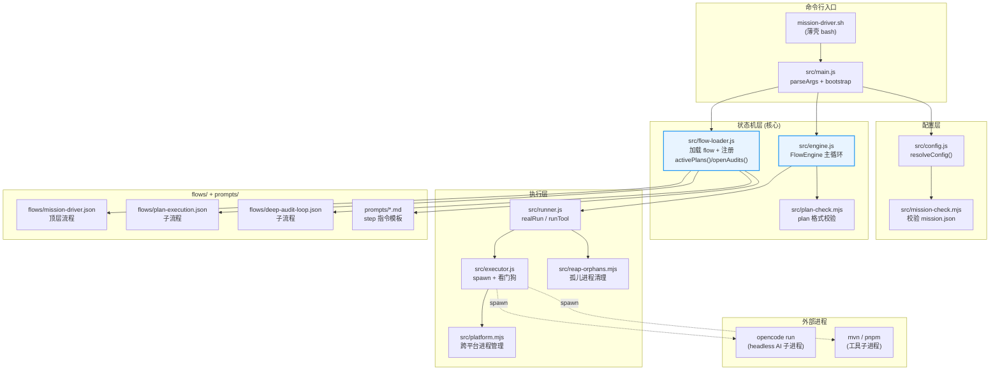
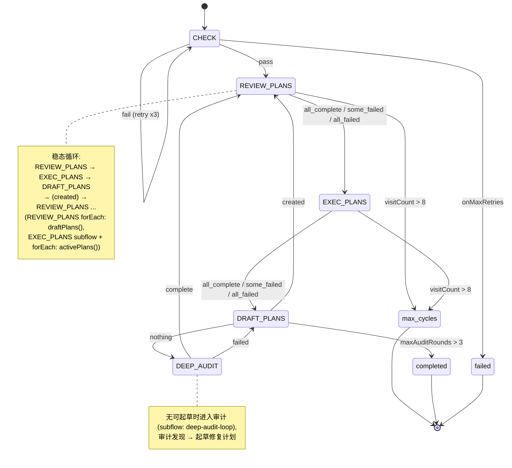
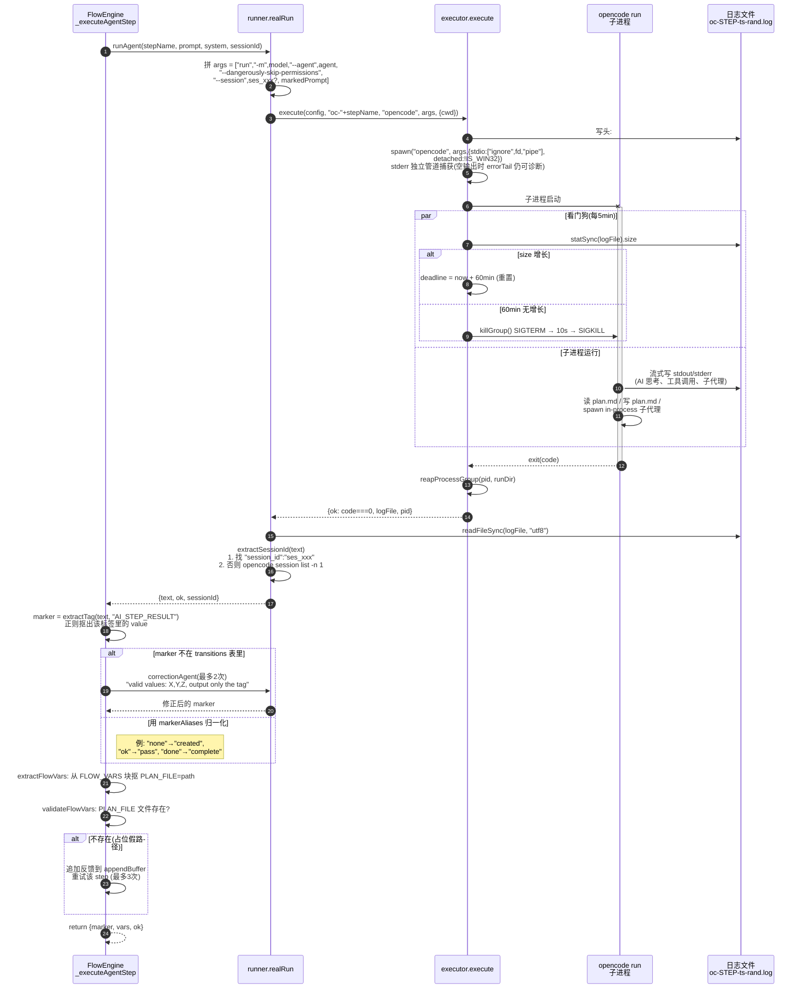
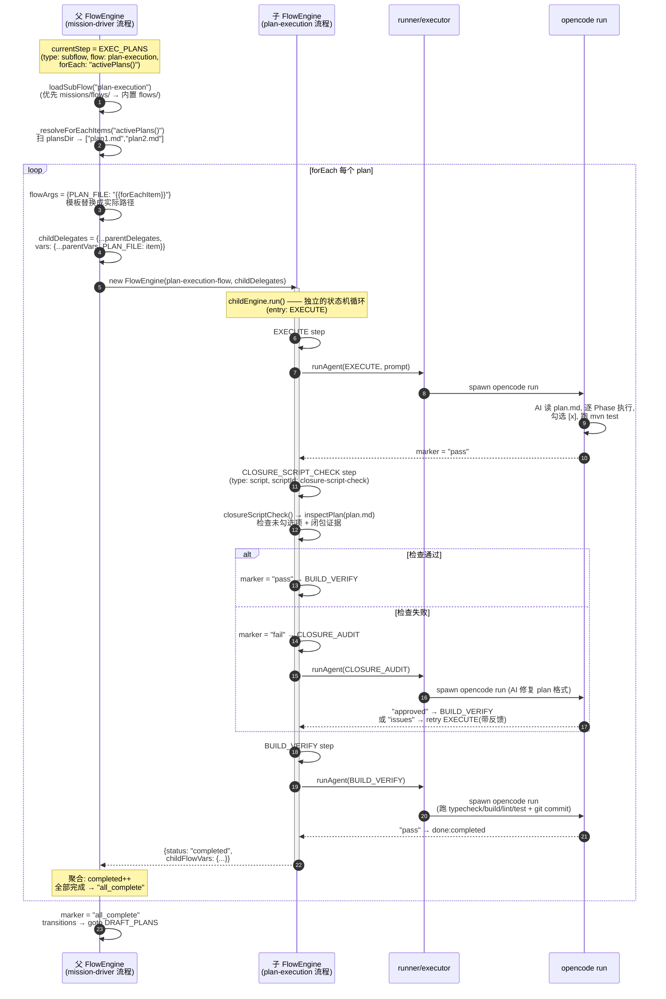
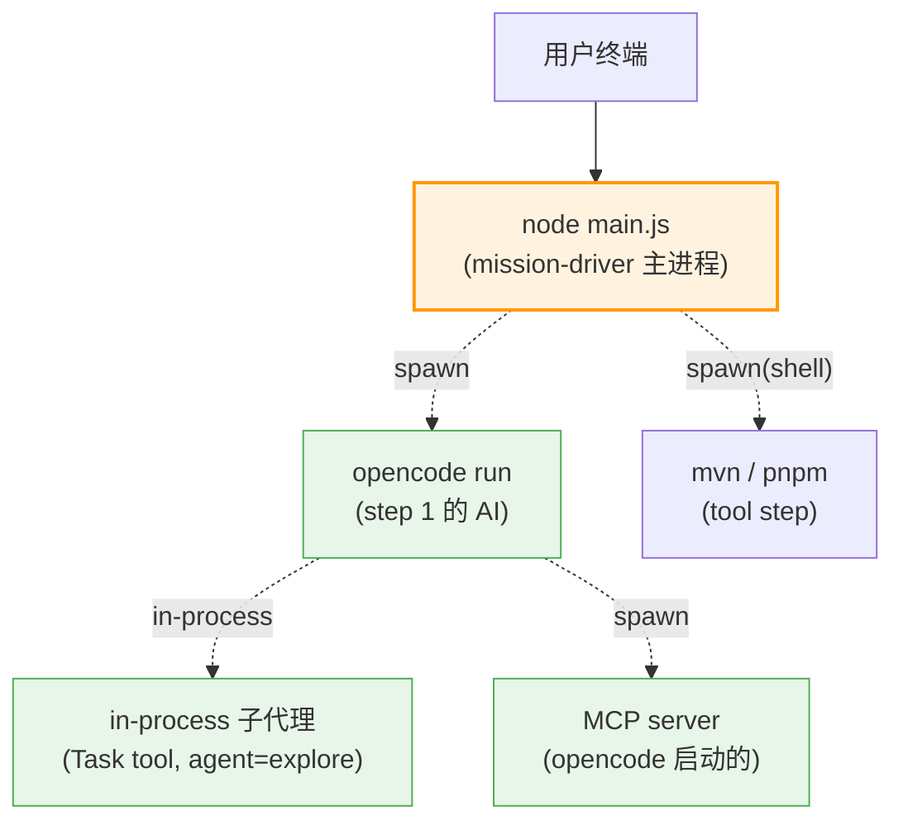
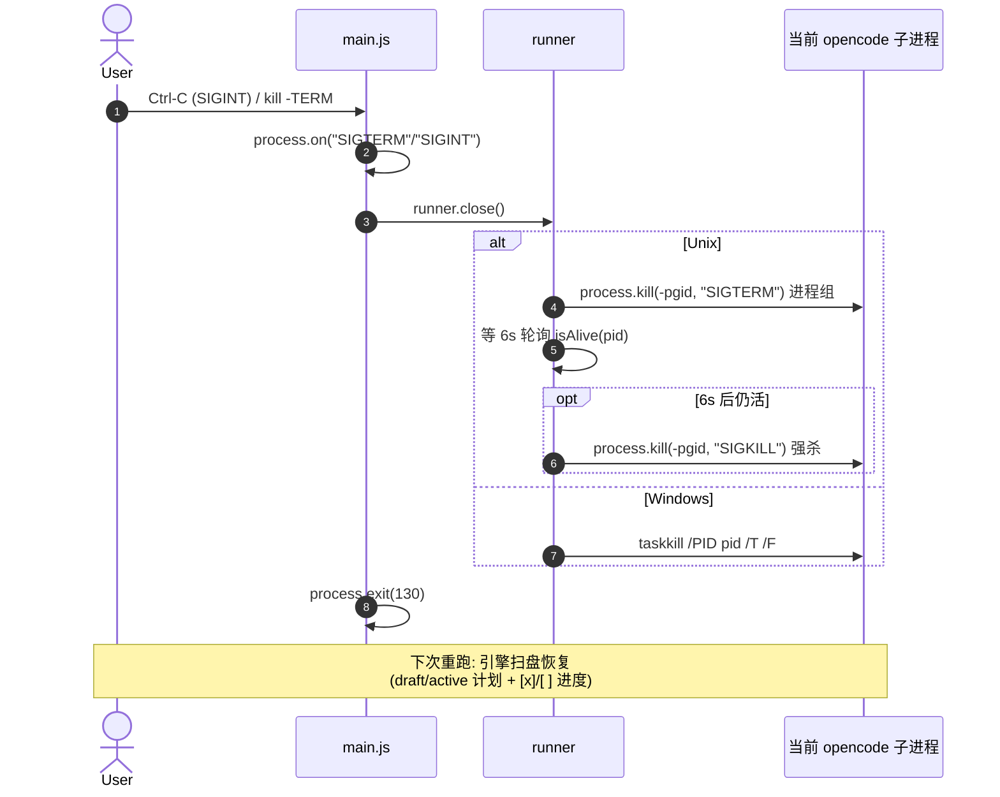
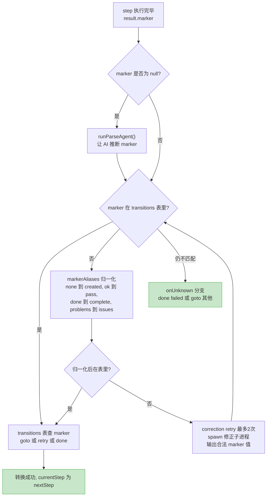
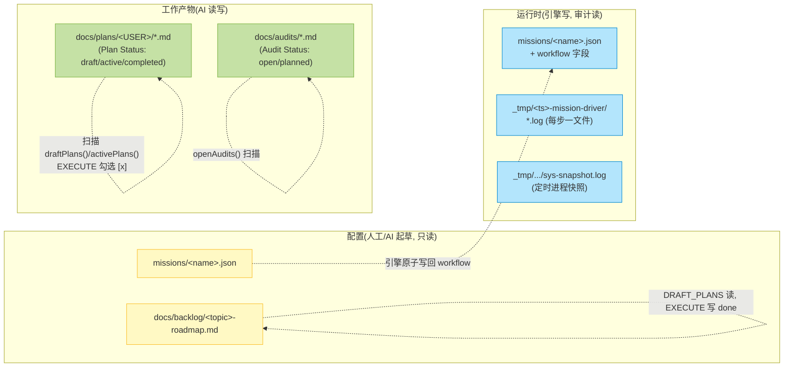
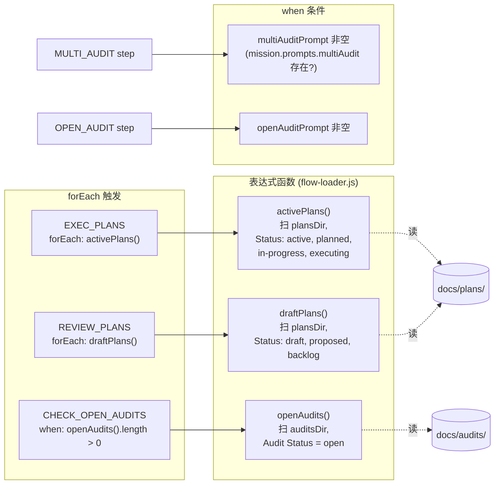

# Mission 执行原理

> Status: active
> Scope: `tools/mission-driver/` 的运行机制 —— 从命令行启动到 AI 子进程执行再到状态持久化的完整链路。
> 相关文档：`README.md`（用法）、`TROUBLESHOOTING.md`（卡住诊断）、`design/mission-design.md`（设计）、`design/mission-driver-flow-design.md`（流程编排）。

本文用 Mermaid 图讲清楚"一个 mission 跑起来后到底发生了什么"。先看组件分层，再看时序。

---

## 1. 一句话模型

mission-driver 是一个 **Node.js 状态机驱动器**：它读 `missions/<name>.json` 配置，按 `flows/*.json` 定义的状态机循环，每个 AI 步骤 `spawn` 一个 `opencode run` 子进程（headless CLI），从子进程的日志文件里抠出 `<AI_STEP_RESULT>` 标记决定下一步，把运行状态原子写回 `missions/<name>.json` 的 `workflow` 字段。**没有 web server，没有 IPC，进程间通信只通过磁盘文件。**

---

## 2. 组件架构



| 组件 | 职责 | 文件 |
|---|---|---|
| **FlowEngine** | 状态机主循环：取 step → 执行 → 抠 marker → 转换；持久化 workflow 状态 | `src/engine.js` |
| **flow-loader** | 加载 flow JSON、注入 prompt 文本、注册表达式函数（`activePlans()` 等） | `src/flow-loader.js` |
| **runner** | 拼装 `opencode run` 命令行；从日志读回文本、抠 session id | `src/runner.js` |
| **executor** | `child_process.spawn`；活动看门狗（60min 无输出则杀）；进程组清理 | `src/executor.js` |
| **platform** | 跨平台进程枚举/杀死（Unix 信号 vs Windows taskkill） | `src/platform.mjs` |
| **mission-check / plan-check** | 固定契约校验器 | `src/mission-check.mjs`、`src/plan-check.mjs` |

---

## 3. 顶层流程状态机

`flows/mission-driver.json` 定义的状态机（`entry: CHECK`）：



**稳态循环**是 `REVIEW_PLANS → EXEC_PLANS → DRAFT_PLANS → REVIEW_PLANS`。入口故意从 `CHECK` 接到 `REVIEW_PLANS`（而非 `EXEC_PLANS`），保证重启时先把上一次留下的 `draft` 计划审查提升为 `active`，再执行，避免重复起草。

每个 step 的输出是一个 **marker**（如 `pass`/`created`/`nothing`/`all_complete`），marker 查 `transitions` 表决定 `goto` / `retry` / `done`。

---

## 4. 启动与主循环时序图 ★ 核心

下图展示：用户启动 → bootstrap → 主循环跑一个 agent step（DRAFT_PLANS）→ 再跑一个 subflow step（EXEC_PLANS，它 forEach 调 plan-execution 子流程）→ 状态写盘。

```mermaid
sequenceDiagram
    autonumber
    actor User
    participant Main as main.js
    participant Cfg as config.js
    participant FL as flow-loader.js
    participant Eng as FlowEngine
    participant Run as runner.js<br/>(realRun)
    participant Exe as executor.js<br/>(spawn)
    participant OC as opencode run<br/>(AI 子进程)
    participant Disk as 磁盘<br/>missions.json / plan.md / 日志

    User->>Main: ./mission-driver.sh {mission}
    Main->>Cfg: resolveConfig(args)
    Cfg->>Disk: 读 missions/{name}.json
    Cfg->>Cfg: loadMission() 校验必填字段
    Cfg-->>Main: config{mission, runDir, timestamp, ...}
    Main->>Run: createRunner(config)
    Main->>FL: createMissionDriverFlow()
    FL->>Disk: 读 flows/mission-driver.json<br/>+ flows/plan-execution.json<br/>+ prompts/*.md
    FL->>FL: resolveStepPrompts() 注入 prompt 文本<br/>resolveStepScripts() 绑定 scriptId
    FL-->>Main: flow 定义对象

    Main->>Eng: new FlowEngine(flow, delegates)
    Note right of Eng: delegates 含 vars(mission 配置)<br/>+ runAgent + runTool + loadSubFlow

    rect rgb(245, 250, 245)
    Note over Eng,Disk: engine.run(entry="CHECK") —— 主循环开始
    Eng->>Eng: _initWorkflow() —— 初始化 workflow 状态对象

    loop until done / maxTotalSteps(500) / max_cycles

        Eng->>Eng: 取 stepDef = flow.steps[currentStep]
        Eng->>Eng: 检查 visitCount 是否超过 maxCycleVisits(8)?
        Eng->>Eng: pingPong 检测(最近6步是否两步循环)
        alt when 条件为 false
            Eng->>Eng: 走 otherwise 分支(skip / goto / done)
        end

        alt stepDef.type = "agent"
            rect rgb(232, 244, 253)
            Note over Eng,OC: 示例: DRAFT_PLANS (agent step)
            Eng->>Eng: _buildPrompt() —— 模板替换 {{roadmapPath}} 等<br/>+ 追加 appendBuffer(重试反馈)
            Eng->>Run: runAgent(stepName, prompt, system, sessionId)
            Run->>Run: markedPrompt = "[MISSION_DRIVER:<runId>] " + prompt<br/>(runId = basename(runDir); 标记携带 run 身份,<br/>供 startup reaper 区分并行 run, 见 §并行安全)
            Run->>Run: args = ["run","-m",model,"--agent",config.agent,<br/>"--dangerously-skip-permissions", markedPrompt]
            Run->>Exe: execute(config, "oc-STEP", "opencode", args)
            Exe->>Disk: writeFileSync 日志头<br/># cmd / # cwd / # started
            Exe->>Exe: spawn("opencode", args,<br/>stdio:[ignore, fd, pipe] → 日志文件 + stderr 独立管道)
            Exe-xOC: 起子进程 (cwd = projectRoot)
            Note right of Exe: 活动看门狗: 每5min 查日志文件 size,<br/>60min 无增长则 killGroup

            OC->>Disk: AI 工作: 读 roadmap / 写 plan.md<br/>(Plan Status: draft)<br/>spawn 子代理审查
            OC-->>Exe: 进程结束 (exit code 0/非0)
            Exe->>Exe: reapProcessGroup() 清理孤儿
            Exe-->>Run: {ok, logFile, pid}
            Run->>Disk: readFileSync(logFile) 读全文本
            Run->>Run: extractSessionId(text) 抠 ses_xxx<br/>(供下一步续跑)
            Run-->>Eng: {text, ok, sessionId}
            Eng->>Eng: extractTag(text, "AI_STEP_RESULT")<br/>→ marker = "created"
            alt result.text 去除 # header 后为空/极短
                Eng->>Eng: 短路(不调 runParseAgent) → marker=null → 失败
            else 无 marker 但有真实正文
                Eng->>Run: runParseAgent() 让 AI 推断 marker
            end
            Eng->>Eng: extractFlowVars(text)<br/>抠 PLAN_FILE 标签块
            Eng->>Eng: validateFlowVars: PLAN_FILE 存在?<br/>(不存在则重试该 step)
            end

        else stepDef.type = "subflow"
            rect rgb(255, 243, 224)
            Note over Eng: 示例: EXEC_PLANS (subflow + forEach)
            Eng->>Eng: _resolveForEachItems("activePlans()")
            Eng->>FL: 表达式函数 activePlans()<br/>扫 plansDir 中 active 计划
            FL-->>Eng: ["plan1.md", "plan2.md"]
            loop 每个 activePlan
                Eng->>Eng: _runChildSubflow(plan-execution, {PLAN_FILE: item})
                Note right of Eng: new child FlowEngine(独立 flowVars)<br/>childEngine.run() 跑完<br/>(见 §6 子流程时序)
                Eng-->>Eng: child 返回 status + flowVars
            end
            Eng->>Eng: 聚合 marker: all_complete/some_failed/all_failed
            end

        else stepDef.type = "tool"
            Eng->>Run: runTool(stepName, command)
            Run->>Exe: spawn(mvn/pnpm, ... shell:IS_WIN32)
            Exe-->>Eng: {ok, marker:"pass"|"fail"}

        else stepDef.type = "script"
            Eng->>Eng: stepDef.run(delegates, flowVars)<br/>例: closureScriptCheck → inspectPlan()
        end

        Eng->>Disk: _wfClose() —— 原子写 workflow 字段<br/>到 missions/{name}.json<br/>(tmp 文件 + rename)
        Eng->>Eng: marker → transitions[marker]<br/>→ {goto: nextStep} | {retry} | {done: status}
        Eng->>Eng: currentStep = nextStep
    end
    end

    Eng->>Disk: _finalizeWorkflow(status)<br/>workflow.status = endedAt = ...
    Eng-->>Main: {status, stepCount, elapsed, history}
    Main->>Main: exitCode = {completed:0, failed:1, max_*:2}
    Main-->>User: 打印摘要 ═══ Status / Steps / Elapsed ═══
```

**时序图关键点**：
- **步骤 1-9**：bootstrap，读 mission.json → 加载 flow 文件 → 注入 prompt 文本 → 构造 FlowEngine。
- **主循环**：每个 step 按 `type` 分发到不同的执行路径，但最终都产出 `marker`。
- **agent step**（蓝框）：spawn opencode 子进程 → 等它结束 → 从日志文件读全文 → 正则抠 marker 与 flowVars。
- **subflow step**（橙框）：不 spawn 新进程，而是在同进程内 `new` 一个子 FlowEngine，递归跑子流程。
- **持久化**：每个 step 结束都 `_wfClose()` 把 workflow 字段原子写回 mission.json。

---

## 5. 单个 Agent Step 的执行细节

聚焦 agent step 的子进程模型与结果解析（`runner.js:107` + `engine.js:234`）：



**通信方式总结**：
- **父→子**：命令行参数（prompt 作为最后一个 argv 传入，加 `[MISSION_DRIVER:<runId>]` 前缀；runId 让 startup reaper 识别该 opencode 属于哪个 run，从而 spare 并行的活跃 run 而非误杀）。
- **子→父**：子进程 stdout 写到日志文件，父进程 `readFileSync` **事后全文读取**；**stderr 经独立管道**（`stdio:["ignore",fd,"pipe"]`）实时捕获到滚动 buffer，即使子进程在写任何输出前崩溃，stderr tail 仍可用于诊断与签名匹配（mdr-1）。没有流式 stdout 管道、没有 stdin 交互。
- **session 续跑**：从输出文本里正则抠 `ses_xxx`，下一次 `opencode run --session ses_xxx` 传回去。若抠不到则 fallback 到 `opencode session list -n 1`。
- **结果契约**：AI 必须在输出里写 `<AI_STEP_RESULT>marker</AI_STEP_RESULT>`；引擎靠这个 marker 驱动状态机。若 AI 忘了写，引擎会再 spawn 一个修正子进程让它只输出合法 marker。

---

## 6. 子流程调用机制

`type: "subflow"` 不 spawn 新进程，而是在**同进程内**递归 new 一个子 FlowEngine（`engine.js:430-512`）。子流程有自己的 `flowVars`（隔离），通过 `flowArgs` 从父接收参数，跑完返回 status + flowVars。



**子流程关键特性**：
- **进程隔离 vs 状态隔离**：subflow 不开新进程，但开新的 `FlowEngine` 实例（独立的 `flowVars`、`visitCounts`、`retryCounts`）。父子通过 `flowArgs` + `delegates.vars` 传数据。
- **forEach 模式**：`forEach: "activePlans()"` 调用表达式函数（在 `flow-loader.js` 注册），返回路径数组；引擎对每个 item 跑一次子流程，`{{forEachItem}}` 在每次迭代中重新解析。
- **marker 透传**：子流程返回它最后一个 step 的实际 marker（如 `"completed"`），父流程的 subflow step 再把它映射成自己的 transition marker。
- **`deep-audit-loop` 子流程**同理：`CHECK_OPEN_AUDITS → MULTI_AUDIT → OPEN_AUDIT → SCAN_NEW_RESULTS → DRAFT_FROM_AUDITS`，线性无循环。

---

## 7. 进程模型与中断清理



**进程边界**（`TROUBLESHOOTING.md §0`）：
- 整个 mission 是**一个 Node 主进程**（`main.js`），它串行 spawn 多个 `opencode run` 子进程（每个 AI step 一个）。
- 子代理（subagent）是 opencode **进程内**的，不是独立 OS 进程 —— 一个子代理挂住会让整个 step 子进程挂住。
- MCP server 是 opencode 启动的独立进程，step 结束后可能残留为孤儿（`reap-orphans.mjs` 负责清理）。

**中断协议**（`main.js:78-87` + `runner.js:6-24`）：



**断点恢复原理**：mission-driver **不保存"当前执行到哪个 step"来驱动恢复**。重跑时引擎从头进 `CHECK`，然后：
1. `REVIEW_PLANS` 扫 `draftPlans()` —— 把上一次留下来的 `draft` 计划审查提升。
2. `EXEC_PLANS` 扫 `activePlans()` —— 执行未完成的 `active` 计划（计划内的 `[ ]`/`[x]` 复选框就是断点）。
3. `DRAFT_PLANS` 只在 active 都执行完且 roadmap 还有 `todo` 时才起草新计划。

所以恢复完全靠**扫磁盘文件**（plan 的 `> Plan Status:` 行 + 复选框），`workflow` 字段只是审计记录。

---

## 8. 标记驱动转换（Marker Engine）

状态机的核心是 marker → transition 查表。一个 step 产出 marker 后，经过多层归一化与保护：



**保护机制**：
- **markerAliases**（`engine.js:211`）：容忍 AI 输出的近义词。顶层流程的别名表在 `flows/mission-driver.json` 的 `markerAliases` 字段。
- **correction retry**（`engine.js:281`）：AI 输出非法 marker 时，再 spawn 一个子进程，prompt 只让它输出合法值，最多 2 次。
- **retry 计数**（`engine.js:646`）：`retry: TARGET, maxRetries: 3` 达到上限走 `onMaxRetries`，避免无限重试。retry 时可通过 `append` 把反馈拼到下次 prompt。
- **ping-pong 检测**（`engine.js:725-747`）：最近 6 步若只在两个 step 间来回（且无 retry 保护），直接判 `ping_pong` 失败，防止死循环。
- **maxCycleVisits**（`engine.js:709`）：单个 step 累计访问超 8 次判 `max_cycles`。
- **maxTotalSteps**（`engine.js:700`）：总步数超 500 判 `max_total_steps`。
- **瞬时 provider 错误独立重试**（`engine.js`，mdr-1）：`isTransientProviderError` 按 **stderr 签名**（`429`/`rate_limit`/`quota`/`overloaded`）判定瞬时故障（取代旧的「stepDur<60s && logLen<600」启发式），命中时走**独立** `transientCounts` 预算（指数退避、硬上限默认 6、`config.transient.*` 可配）——**不**占 `onError.maxRetries`、**不**触发 ping-pong/maxCycleVisits、发 `transient_retry` 事件（非 `step_failed`）；超独立上限才降级为真失败走 `onError`。
- **中性诊断**（`engine.js`，mdr-1）：空/短输出失败的事件 `error` 默认为中性 `empty/short output, exit=<code> — cause unknown; see stderr tail`；仅在 stderr 真含限流签名时才提示限流（消除「一律判限流」误诊）。
- **header-only parse 短路**（`engine.js`，mdr-1）：`result.text` 去除 `#` header 行后为空/极短时直接归失败，不浪费一次 `runParseAgent` 模型调用。

---

## 9. 数据持久化模型

mission 运行期间，状态分散在三类磁盘文件里：



| 写入位置 | 谁写 | 何时写 | 作用 |
|---|---|---|---|
| `missions/<name>.json` 的 `workflow` | `engine._wfClose()` | 每个 step 结束 + 终止时 | 审计/观察用，**不驱动恢复** |
| `docs/plans/<USER>/*.md` | AI 子进程（DRAFT_PLANS / EXECUTE） | 起草时建、执行时勾 `[x]` | **真正的进度持久化**，恢复靠扫它 |
| `docs/plans/*.md` 的 `> Plan Status:` | AI 子进程 | 草案审查通过→active；闭包→completed | `activePlans()`/`draftPlans()` 扫它决定 forEach |
| `docs/audits/*.md` 的 `> Audit Status:` | AI 子进程 | MULTI/OPEN_AUDIT 写 open；起草后改 planned | `openAudits()` 扫它 |
| `docs/backlog/*-roadmap.md` | AI 子进程（EXECUTE 末尾） | 工作项 done 时 | 全局状态表面 |
| `_tmp/<ts>-mission-driver/*.log` | `executor.execute()` | 子进程 stdout/stderr | 排障与抠 marker/sessionId |

**workflow 字段原子写**（`engine.js:130-141`）：用 `tmp` 文件 + `rename` 保证不会写一半崩溃留下损坏的 JSON。

---

## 10. 表达式函数与 forEach 数据源

forEach 的数据来自 `flow-loader.js` 注册的表达式函数（`design/mission-design.md §3.6`），它们直接扫磁盘：



这些函数让状态机"扫盘即决策"：不需要专门的"扫描 step"，forEach 直接消费函数返回值，空数组时引擎短路成 `all_complete` 不调 AI。

---

## 11. 终止条件与退出码

| 触发 | 状态 | exit code | 含义 |
|---|---|---|---|
| `done: completed`（如 DRAFT_PLANS 无可起草 + 审计无发现 + 达 maxAuditRounds） | `completed` | 0 | 正常完成 |
| `done: failed`（如 CHECK 重试 3 次仍 fail） | `failed` | 1 | 不可恢复失败 |
| 单 step 访问 > maxCycleVisits(8) | `max_cycles` | 2 | 循环上限 |
| 总步数 > maxTotalSteps(500) | `max_total_steps` | 2 | 总量上限 |
| 某 retry 链达 maxRetries | `max_retries` | 2 | 重试上限 |
| 检测到两步 ping-pong | `ping_pong` | 2 | 死循环保护 |
| 未知 step / 类型 / 非法转换 | `unknown_step` / `unknown_type` / `no_transition` / `invalid_transition` | 1 | 流程定义错误 |

---

## 12. 延伸阅读

| 想了解 | 读 |
|---|---|
| 流程编排细节（为何 CHECK→REVIEW 而非 CHECK→EXEC） | `design/mission-driver-flow-design.md` |
| mission.json 字段语义 | `design/mission-design.md` |
| 卡住时怎么诊断（进程、日志、socket） | `TROUBLESHOOTING.md` |
| group step / 表达式引擎细节 | `design/flow-engine-design.md`、`design/group-step-design.md` |
| roadmap/plan 格式契约 | `docs/backlog/00-roadmap-authoring-guide.md`、`docs/plans/00-plan-authoring-and-execution-guide.md` |
| 如何用 skill 创建 roadmap 与 mission | `.opencode/skills/mission-driver/SKILL.md` |
